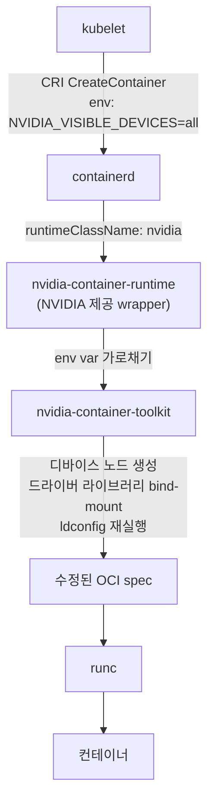
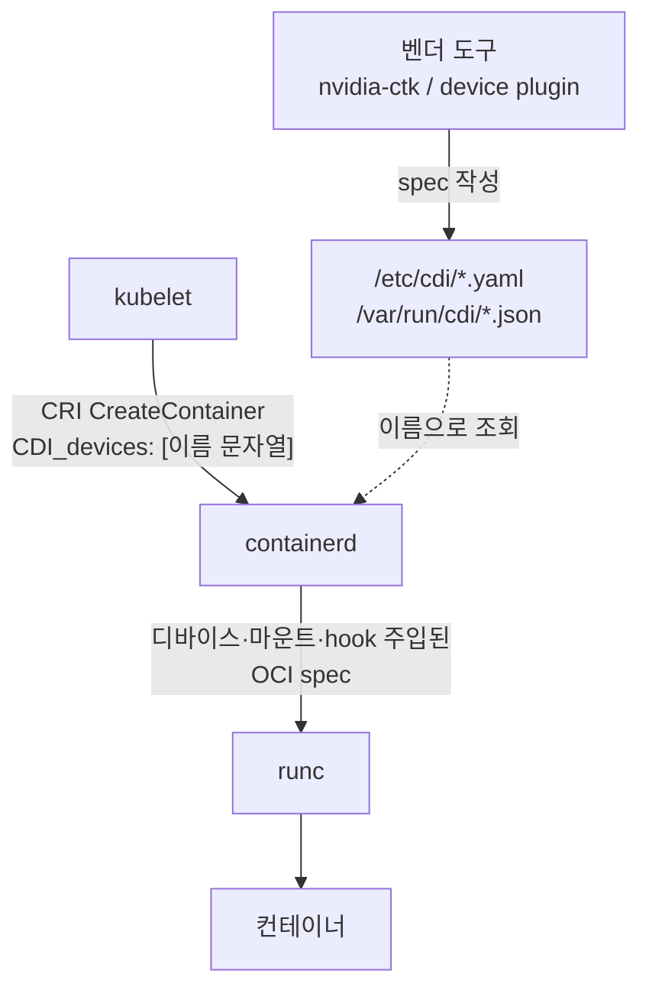
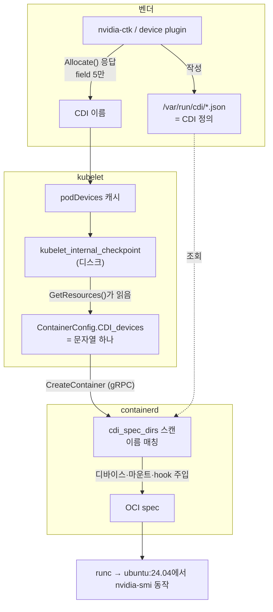

## 일반적인 컨테이너 생성 흐름

쿠버네티스에서 컨테이너를 생성하는 과정은 아래와 같다. kubelet은 gRPC 소켓통신으로 containerd에게 파드 생성에 필요한 명세를 전달한다.  파드 명세를 containerd는 OCI spec으로 바꾸는데 이 과정에서 이미지 레이어를 받아 파일 시스템을 준비하고 CDI 이름을 보고 /etc/cdi에서 실제 디바이스, 마운트, hook을 채워 넣고, cgroup 경로 및 네임스페이스 설정을 확정한다. 


그 후 shim을 띄우고 이는 파드(sandbox) 마다 하나씩 뜨는 별도 프로세스이다. 별도 프로세스인 이유는 containerd가 죽거나 업그레이드 되어도 컨테이너는 살아 남아야하기때문이다. 즉, 수명이 분리되어있다.  컨테이너의 stdout/stderr 중계, 종료 코드 수집, 좀비 프로세스 수확도 shim 몫이다. 


runc는 위에서 containerd가 변환한 OCI Spec을 읽어서 실제로 격리 환경을 만든다. (namespace, cgroup, mount, capabilities 설정 후 exec.) runc는 이러한 작업이 끝나면 사라진다.


```
kubelet ──gRPC / unix socket──▶ containerd
                                    │  파드(sandbox)마다 shim 하나 생성
                                    ▼
                         containerd-shim-runc-v2   ← 별도 프로세스
                                    │  exec
                                    ▼
                              runc (OCI runtime)
                                    │
                                    ▼
                              컨테이너 프로세스

```


## 그러나 GPU 컨테이너는 다르다

일반적인 디바이스는 `/dev` 노드 하나만 컨테이너에 넣어주면 끝난다. 하지만 유저 스페이스의 라이브러리 `libcuda.so`는 호스트 커널 드라이버 버전과 정확히 일치해야한다. 만약 이미지에 라이브러리를 포함하면 드라이버를 업그레이드 하는 순간 이미지가 깨져버린다. 그래서 이미지가 아니라 **컨테이너 생성 시점에 호스트에서 주입**하는 구조가 필요하다.  

- **디바이스 노드**: `/dev/nvidia0`, `/dev/nvidiactl`, `/dev/nvidia-uvm`, `/dev/dri/card1` …
- **유저스페이스 라이브러리**: `libcuda.so.595.84`, `libnvidia-ml.so.595.84` …
- **바이너리**: `nvidia-smi` 등


이를 해결하는 방법으로 두가지 방법을 알아보자. 

- 방식1 : nvidia-container-runtime
- 방식 2: CDI (Container Device Interface)

## 방식 1: nvidia-container-runtime

runc를 감싸는 **wrapper 런타임**을 하나 더 두는 방식이다. containerd가 runc를 직접 부르지 않고, NVIDIA가 만든 바이너리를 대신 부른다.




containerd 설정에 **별도 런타임 항목이 생긴다.** 

```bash
$ grep nvidia /var/lib/rancher/k3s/agent/etc/containerd/config.toml
[plugins.'io.containerd.cri.v1.runtime'.containerd.runtimes.'nvidia']
[plugins.'io.containerd.cri.v1.runtime'.containerd.runtimes.'nvidia'.options]
  BinaryName = "/usr/bin/nvidia-container-runtime"
```


동작 순서는 다음과 같다.

1. device plugin이 `Allocate()` 응답에 `NVIDIA_VISIBLE_DEVICES` **환경변수**를 담아 돌려준다.
2. kubelet이 그 환경변수를 `ContainerConfig.envs`에 실어 CRI로 넘긴다.
3. containerd가 `nvidia` 런타임으로 컨테이너를 만든다.
4. `nvidia-container-runtime`이 그 환경변수를 **가로채서** OCI spec을 수정한다.
5. 수정된 spec으로 runc가 컨테이너를 띄운다.

핵심은 4번이다. **런타임이 컨테이너 생성 경로 중간에 끼어들어 spec을 고친다.** 디바이스 노드를 추가하고, 호스트의 드라이버 라이브러리를 bind-mount하고, 컨테이너 안에서 `ldconfig`를 다시 돌린다.

### 단점

- **런타임이 하나 더 필요하다.** containerd 설정을 고쳐야 하고, `RuntimeClass` 오브젝트도 따로 만들어야 한다.
- **주입 규칙이 NVIDIA 바이너리 안에 하드코딩된다.** 무엇이 주입되는지 밖에서 선언적으로 확인할 방법이 없다.
- **벤더마다 런타임이 따로 생긴다.** 다른 가속기 벤더도 같은 문제를 각자의 wrapper로 푼다.
- **환경변수가 인터페이스다.** `NVIDIA_VISIBLE_DEVICES`는 규격이 아니라 관례이고, 이미지가 그 변수를 이미 갖고 있으면 의도치 않게 GPU가 붙는 사고가 난다.

## 방식 2: CDI (Container Device Interface)

주입 규칙을 **바이너리가 아니라 파일로 선언**하고, 그 파일을 컨테이너 런타임이 직접 읽게 하는 방식이다. 



containerd 쪽 설정은 런타임 추가가 아니라 **스캔할 디렉터리 지정**으로 바뀐다.

```bash
$ containerd config dump | grep -i -A2 cdi
enable_cdi = true
cdi_spec_dirs = ['/etc/cdi', '/var/run/cdi']
```

### CDI spec의 실체

`nvidia-ctk cdi generate`로 만들어지는 파일이 "정의"다. 앞선 방식에서 바이너리 안에 숨어 있던 규칙이 그대로 드러난다.

```yaml
cdiVersion: 0.7.0
kind: nvidia.com/gpu
devices:
    - name: "0"
      containerEdits:
        deviceNodes:
            - path: /dev/nvidia0
              major: 195
              fileMode: 438
              permissions: rwm
            - path: /dev/dri/card1
              ...
        hooks:
            - hookName: createContainer
              path: /usr/bin/nvidia-cdi-hook
              args: ["nvidia-cdi-hook", "create-symlinks", "--link", "libcuda.so.595.84::/usr/lib/x86_64-linux-gnu/libcuda.so.1"]
```

선언된 디바이스에는 **fully qualified name**이 붙는다.

```
nvidia.com/gpu=0
nvidia.com/gpu=GPU-472e819b-4b07-4fd5-ce17-9f1d2b6c17c6
nvidia.com/gpu=all
```

이 이름이 kubelet과 런타임 사이의 유일한 계약이다.

## 핵심 차이: kubelet은 CDI 정의를 모른다

CDI 방식에서 kubelet이 다루는 것은 `nvidia.com/gpu=0` 같은 이름 문자열 하나뿐이다. 디바이스 노드도, 마운트도, hook도 kubelet을 거치지 않는다.

역할이 셋으로 갈린다.


| 주체                            | CDI spec에 대해                     |
| ----------------------------- | -------------------------------- |
| device plugin / DRA 드라이버 (벤더) | **** (`/var/run/cdi/*.json`)에 기록 |
| kubelet                       | **이름 문자열만 전달**                   |
| containerd / CRI-O            | **읽어서 컨테이너에 주입한다**               |


kubelet 코드에서도 알수 있다.

```go
// pkg/kubelet/container/runtime.go:540
type CDIDevice struct {
    // Name is a fully qualified device name
    Name string   // ← 이름 하나뿐
}
```

### 바이너리로 확인할 수 있다

kubelet 바이너리에는 **CDI spec 경로 문자열이 하나도 컴파일되어 있지 않다.**

```bash
$ grep -aoE "/(etc|var/run)/cdi" /usr/bin/kubelet | sort -u
(출력 없음)

$ grep -aoE "/(etc|var/run)/cdi" /usr/local/bin/containerd | sort -u
/etc/cdi
/var/run/cdi
```

`--help`에도 CDI 관련 플래그가 없다. 대신 **이름을 나르는 데 필요한 proto 필드명은 45건**이 들어 있다.

```bash
$ grep -aoE "cdi_devices|cdi_device_ids|CDIDevices|CDIDevice" /usr/bin/kubelet | sort | uniq -c
     29 CDIDevice        # kubecontainer.CDIDevice / runtimeapi.CDIDevice
      6 CDIDevices       # RunContainerOptions / ContainerConfig 필드
      6 cdi_devices      # deviceplugin proto 필드명
      4 cdi_device_ids   # DRA proto 필드명
```

**spec 경로 0건, proto 필드명 45건으로**  이것이 kubelet의 역할이 철저하게 분리 되어 있다는 것을 알 수 있다. 

## 어디서 갈리는가: device plugin의 전략 설정

 **device plugin의 `DEVICE_LIST_STRATEGY`** 환경변수다. kubelet도 containerd도 아니고 벤더 플러그인이 정한다.

```bash
kubectl -n kube-system set env daemonset/nvidia-device-plugin-daemonset \
  DEVICE_LIST_STRATEGY=cdi-cri
```


| 값              | `Allocate()` 응답에 담기는 것                      | 주입 주체                      |
| -------------- | ------------------------------------------- | -------------------------- |
| `envvar` (기본값) | `envs`: `NVIDIA_VISIBLE_DEVICES=...`        | `nvidia-container-runtime` |
| `cdi-cri`      | `cdi_devices`: `nvidia.com/gpu=GPU-472e...` | containerd                 |


`Allocate()` 응답 구조를 보면 두 방식이 **같은 메시지의 다른 필드**임을 알 수 있다.

```protobuf
message ContainerAllocateResponse {
    map<string, string> envs        = 1;   // ← 전통 방식
    repeated Mount      mounts      = 2;   // ← 전통 방식
    repeated DeviceSpec devices     = 3;   // ← 전통 방식
    map<string, string> annotations = 4;   // ← 전통 방식
    repeated CDIDevice  cdi_devices = 5;   // ← CDI 방식
}
```

1번부터 4번까지가 CDI 이전의 주입 수단이고, 5번 하나가 CDI다.

### 체크포인트에서 직접 확인

kubelet은 `Allocate()` 응답을 디스크에 그대로 저장한다. base64를 풀면 어느 필드가 채워졌는지 바이트 단위로 보인다.

```bash
cat /var/lib/kubelet/device-plugins/kubelet_internal_checkpoint | python3 -c "
import json,sys,base64
d=json.load(sys.stdin)
raw=base64.b64decode(d['Data']['PodDeviceEntries'][0]['AllocResp'])
print('원시 바이트:', raw[:8].hex())
print('길이:', len(raw))
print('문자열:', raw[4:].decode())
"
```

```
원시 바이트: 2a4b0a496b38732e
             ^^
             0x2a = field 5, wire type 2
길이: 77
문자열: k8s.device-plugin.nvidia.com/gpu=GPU-472e819b-4b07-4fd5-ce17-9f1d2b6c17c6
```

**응답 전체가 77바이트이고 field 5밖에 없다.** `envs`, `mounts`, `devices`, `annotations`가 전부 비어 있다. `cdi-cri` 전략에서는 플러그인이 이름 하나만 돌려준다는 뜻이다.

### CRI 경계에서 확인

컨테이너 설정을 열어보면 목적지에 도착한 것도 이름 하나뿐이다.

```bash
CID=$(crictl ps --name cuda -q | head -1)
crictl inspect $CID | python3 -c "import json,sys; print(json.load(sys.stdin)['info']['config'].get('CDI_devices'))"
```

```json
[
  { "name": "k8s.device-plugin.nvidia.com/gpu=GPU-472e819b-4b07-4fd5-ce17-9f1d2b6c17c6" }
]
```

같은 설정의 다른 필드는 비어 있다.

```
devices (전통 방식):    null
envs 중 NVIDIA 관련:    []
```

`/dev/nvidia0`도, 드라이버 라이브러리도, `nvidia-smi` 바이너리도 **전부 containerd가 CDI spec을 읽고 넣은 것이다.**

## 두 방식 비교


| 항목                  | nvidia-container-runtime | CDI                                 |
| ------------------- | ------------------------ | ----------------------------------- |
| 주입 주체               | 별도 wrapper 런타임           | containerd / CRI-O 본체               |
| 주입 규칙의 위치           | 벤더 바이너리 내부 (불투명)         | 파일로 선언 (`/etc/cdi`, `/var/run/cdi`) |
| containerd 설정       | 런타임 항목 추가 (`BinaryName`) | 디렉터리 지정 (`cdi_spec_dirs`)           |
| `RuntimeClass`      | 필요                       | 불필요                                 |
| kubelet ↔ 런타임 인터페이스 | 환경변수 (관례)                | `CDI_devices` 필드 (규격)               |
| 벤더 확장               | 벤더마다 런타임 하나씩             | 벤더마다 spec 파일                        |
| 디버깅                 | 바이너리 동작 추적               | spec 파일 읽기                          |


CDI 쪽이 나은 점은 **규칙이 밖으로 드러난다는 것이다.** 무엇이 주입될지 컨테이너를 띄우기 전에 파일로 읽을 수 있고, 문제가 생기면 그 파일만 보면 된다.

벤더 입장에서도 런타임을 만들어 배포하고 사용자에게 containerd 설정을 고치게 하는 대신, spec 파일 하나를 놓으면 된다.

## 실습 kind에서 GPU 붙이기

> 검증 환경: kind `kindest/node:v1.36.1` 단일 노드, RTX 3050 6GB, 드라이버 595.84, nvidia-container-toolkit 1.19.1, containerd v2.3.1

### 호스트 사전 조건


| 항목            | 확인 명령                                                                                           | 필요한 값                   |
| ------------- | ----------------------------------------------------------------------------------------------- | ----------------------- |
| 드라이버          | `nvidia-smi -L`                                                                                 | GPU 인식                  |
| toolkit       | `nvidia-ctk --version`                                                                          | 설치됨                     |
| docker 기본 런타임 | `docker info                                                                                    | grep "Default Runtime"` |
| kind 필수 설정    | `grep accept-nvidia-visible-devices-as-volume-mounts /etc/nvidia-container-runtime/config.toml` | `= true`                |


### 클러스터 생성

`accept-nvidia-visible-devices-as-volume-mounts = true`와 짝을 이루는 방법이다. `/var/run/nvidia-container-devices/<device>`에 무언가를 마운트하면 런타임이 그 디바이스를 노출한다.

```yaml
kind: Cluster
apiVersion: kind.x-k8s.io/v1alpha4
name: gpu-lab
nodes:
- role: control-plane
  extraMounts:
  - hostPath: /dev/null
    containerPath: /var/run/nvidia-container-devices/all
```

```bash
kind create cluster --config=/tmp/gpu-lab.yaml
docker exec gpu-lab-control-plane nvidia-smi -L
docker exec gpu-lab-control-plane ls /usr/lib/x86_64-linux-gnu/libcuda.so*
```

### CDI spec 생성

```bash
docker cp /usr/bin/nvidia-ctk gpu-lab-control-plane:/usr/bin/nvidia-ctk
docker exec gpu-lab-control-plane nvidia-ctk cdi generate --output=/etc/cdi/nvidia.yaml
```

### device plugin 배포

```bash
kubectl apply -f https://raw.githubusercontent.com/NVIDIA/k8s-device-plugin/v0.17.1/deployments/static/nvidia-device-plugin.yml
kubectl -n kube-system set env daemonset/nvidia-device-plugin-daemonset \
  DEVICE_LIST_STRATEGY=cdi-cri NVIDIA_VISIBLE_DEVICES=all
```

kind에서는 **플러그인 파드 자체가 GPU를 못 봐서** 세 번 막힌다.


| 증상                                                                            | 원인                                                            |
| ----------------------------------------------------------------------------- | ------------------------------------------------------------- |
| `CDI --device-list-strategy options are only supported on NVML-based systems` | 파드 안에 NVML 라이브러리 없음                                           |
| `cdi.k8s.io/gpu` 파드 annotation이 무시됨                                           | kubelet이 파드 annotation을 `ContainerConfig.annotations`로 넘기지 않음 |
| `failed to locate libcuda.so.595.84 ... /driver-root/etc/ld.so.cache`         | driver root 미지정                                               |


두 번째 항목은 코드와도 일치한다. kubelet의 `newContainerAnnotations`는 `io.kubernetes.*`와 **device plugin이 준 것만** 넣는다. 사용자가 파드에 붙인 CDI annotation은 런타임까지 가지 않는다.

노드에 라이브러리를 모아두고 hostPath로 주입하면 해결된다.

```bash
docker exec gpu-lab-control-plane sh -c '
mkdir -p /opt/nvidia-libs
cp -a /usr/lib/x86_64-linux-gnu/libnvidia-ml.so* \
      /usr/lib/x86_64-linux-gnu/libnvidia-cfg.so* \
      /usr/lib/x86_64-linux-gnu/libcuda.so* /opt/nvidia-libs/'
```

```yaml
securityContext: { privileged: true }
env:
- { name: LD_LIBRARY_PATH, value: /nvidia-libs }
volumeMounts:
- { name: nvidia-libs, mountPath: /nvidia-libs, readOnly: true }
- { name: dev,         mountPath: /dev }
- { name: driver-root, mountPath: /driver-root, readOnly: true }
- { name: cdi-dir,     mountPath: /var/run/cdi }
volumes:
- { name: nvidia-libs, hostPath: { path: /opt/nvidia-libs } }
- { name: dev,         hostPath: { path: /dev } }
- { name: driver-root, hostPath: { path: / } }
- { name: cdi-dir,     hostPath: { path: /var/run/cdi, type: DirectoryOrCreate } }
```

등록이 끝나면 노드에 리소스가 올라오고 체크포인트 파일이 생긴다.

```bash
$ kubectl get nodes -o custom-columns=NAME:.metadata.name,CAP:.status.capacity.nvidia\\.com/gpu
NAME                    CAP
gpu-lab-control-plane   1

$ docker exec gpu-lab-control-plane ls /var/lib/kubelet/device-plugins/
kubelet.sock
kubelet_internal_checkpoint
nvidia-gpu.sock
```

### GPU 파드

```yaml
apiVersion: v1
kind: Pod
metadata: { name: gpu-test }
spec:
  restartPolicy: Never
  containers:
  - name: cuda
    image: ubuntu:24.04
    command: ["sh","-c","nvidia-smi -L; sleep 3600"]
    resources:
      limits:
        nvidia.com/gpu: 1
```

```bash
$ kubectl logs gpu-test
GPU 0: NVIDIA GeForce RTX 3050 (UUID: GPU-472e819b-4b07-4fd5-ce17-9f1d2b6c17c6)
```

### CDI spec은 두 개 공존한다

```
/etc/cdi/nvidia.yaml                                 ← nvidia-ctk 생성 (nvidia.com/gpu=0)
/var/run/cdi/k8s.device-plugin.nvidia.com-gpu.json   ← device plugin 생성 (실제 사용됨)
```

device plugin이 `cdi-cri` 모드에서 **자기 이름공간으로 별도 spec을 만들어** 그것을 쓴다. `/etc/cdi/nvidia.yaml`은 부트스트랩용으로 남는다. containerd의 `cdi_spec_dirs`가 양쪽을 모두 스캔하므로 둘 다 유효하다.

## 전체 도식화



kubelet이 이름을 **캐시와 체크포인트에 보관하는 이유**는 생산 시점과 소비 시점이 다르기 때문이다. `Allocate()`는 Pod admission 때 한 번 불리고, 이름이 실제로 쓰이는 것은 한참 뒤 컨테이너를 만들기 직전이다. 컨테이너가 재시작될 때마다 다시 필요하므로 플러그인에 매번 물어볼 수도 없다.

## 정리

- GPU 컨테이너는 **드라이버와 버전이 맞물린 유저스페이스 라이브러리** 때문에 생성 시점 주입이 필요하다.
- 전통 방식은 `nvidia-container-runtime`이라는 wrapper 런타임이 OCI spec을 고쳐서 해결한다. 규칙이 바이너리 안에 숨는다.
- CDI 방식은 규칙을 **파일로 선언**하고 containerd가 직접 읽는다. wrapper 런타임이 사라진다.
- 두 방식을 가르는 스위치는 **device plugin의 `DEVICE_LIST_STRATEGY`** 다. `envvar`면 전통 방식, `cdi-cri`면 CDI 방식이다.
- CDI 방식에서 **kubelet은 CDI spec을 읽지 않는다.** 이름 문자열 하나만 CRI로 넘긴다. 바이너리에 spec 경로 문자열이 0건인 것이 그 증거다.

