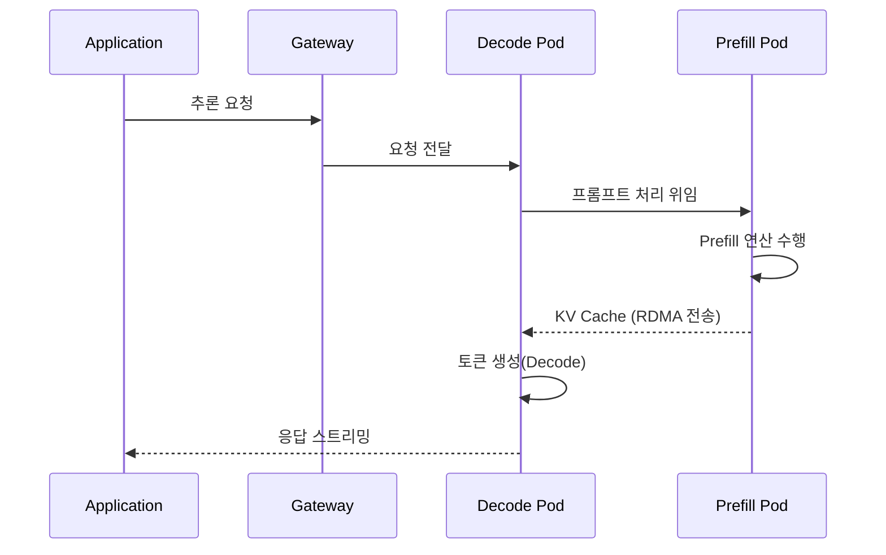
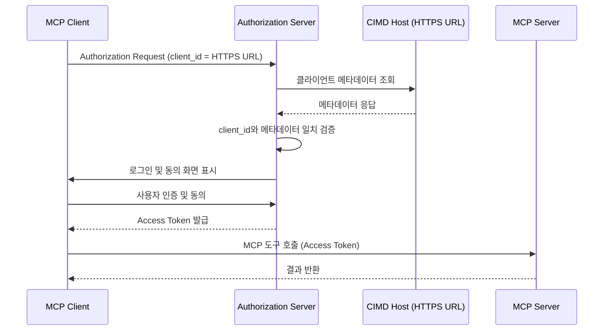
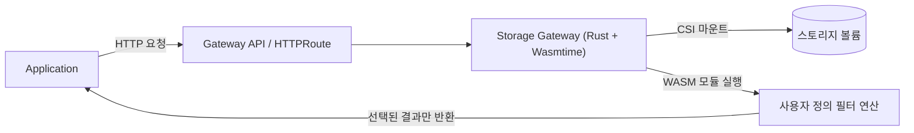
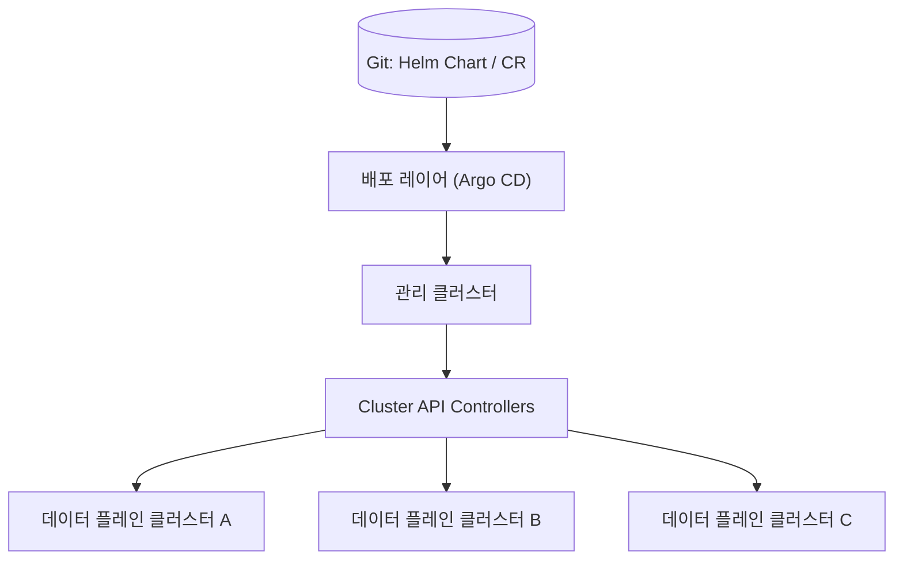

2026년 7월 말, KubeCon + CloudNativeCon Japan이 요코하마에서 열렸다. 이번 행사의 공통된 주제는 AI 워크로드를 기존 클라우드 네이티브 생태계 위에 어떻게 통합하느냐였다. 아래는 현장에서 다룬 세션 여섯 개를 정리한 내용이다.

## 키노트: CNCF 현황과 AI 시대의 클라우드 네이티브

### CNCF 생태계 현황

Linux Foundation의 Jonathan Bryce(Executive Director)와 Chris Aniszczyk(CTO)가 키노트를 진행했다. KubeCon EU 기준 참석자 13,500명 이상, 100개국 3,500개 조직이 참여했다고 밝혔다. CNCF 프로젝트는 230개를 넘었고 전 세계 기여자는 30만 명, 개발자 수는 6개월 만에 1,500만 명에서 약 2,000만 명으로 늘었다.

신규 졸업 프로젝트로 **Kyverno**(정책·보안), **OpenTelemetry**(관측성의 사실상 표준), **Kubeflow**가 소개됐다. NVIDIA는 플래티넘 멤버로 합류하며 GPU 인프라 지원을 위해 400만 달러를 기부했고 GPU 드라이버를 Kubernetes에 업스트림했다. 일본은 CNCF 프로젝트 기여 순위에서 세계 10위를 차지했으며, 개발자 수는 약 95만 명으로 집계됐다.

### 추론 중심으로 이동하는 AI 워크로드

키노트에서 제시된 통계에 따르면 AI 컴퓨팅 배분은 2년 전 학습(training) 2/3에서 올해 추론(inference) 2/3로 역전됐다. McKinsey 보고서는 2030년까지 추론 전용 컴퓨팅이 93GW에 이를 것으로 예측했는데, 이는 현재 전체 컴퓨팅 워크로드를 합친 것보다 큰 규모다. 효율성 개선은 하드웨어보다 vLLM, Kubernetes 같은 소프트웨어 레이어에서 더 크게 나타나고 있다고 언급됐다.

**LLMD**가 구체적 사례로 제시됐다. LLMD는 vLLM을 수평으로 확장하면서 캐싱과 지능형 라우팅을 적용해 GPU 간 단순 로드밸런싱보다 높은 성능을 낸다. 발표에서는 기업의 80% 이상이 이미 Kubernetes를 운영 중이고 그중 60%가 생성형 AI 워크로드를 함께 돌리고 있다는 조사 결과도 인용됐다.

### 지능의 주권과 개방성

Kubernetes 컨포먼스 프로그램이 클라우드·서비스 전반의 일관성을 보장했듯, CNCF는 동일한 목적의 **AI Conformance 플랫폼**을 추진 중이라고 밝혔다. 일부 국가에서는 AI가 소수 기업이나 국가에 종속될 수 있다는 우려에서 **주권 AI(Sovereign AI)** 논의가 이어지고 있다. 오픈소스 기반의 개방형 스택이 이런 종속을 막을 대안으로 제시됐다.

---

## 온프레미스 LLM 서빙 최적화와 PD 분산화

Elva Corporation의 온프레미스 LLM 플랫폼 운영 사례가 발표됐다. vLLM으로 추론을 서빙하고 Envoy AI Gateway로 트래픽을 제어하는 구조이며, 월 약 3.5억 토큰, 테넌트 30곳, 모델 10종을 운영한다.

### 워크로드 특성 분석

사용 사례는 텍스트 요약(최대 비중), 안전 분류, 정보 추출이 전체 사용량의 90%를 차지한다. 텍스트 요약과 정보 추출은 지연에 덜 민감한 배치(batch) 워크로드로, 안전 분류는 지연에 민감한 실시간 워크로드로 분류됐다. 멀티턴 에이전틱 워크로드는 human-in-the-loop 여부에 따라 지연 민감도가 다르게 취급된다.

동시성을 높이면 처리량은 늘지만 어느 지점을 넘으면 지연이 급격히 나빠진다. 발표에서는 이 트레이드오프를 기준으로 지연 민감 워크로드는 동시성을 제한하고, 지연 비민감 워크로드는 동시성을 최대화하는 전략을 제시했다.

### 4가지 최적화 기법 비교

시스템 성능·아키텍처 복잡도·사용 사례 적합성을 기준으로 네 가지 기법을 자체 평가했다.

| 기법 | 효과 | 아키텍처 복잡도 | 비고 |
|---|---|---|---|
| 양자화(Quantization) | 전 지표 개선, 메모리·처리량 향상 | 거의 없음(vLLM 네이티브 지원) | FP8은 Hopper 이상 아키텍처에서 최적 |
| 추측 디코딩(Speculative Decoding) | TTFT·ITL 개선, 출력 품질 100% 동일 | 없음(vLLM 네이티브 지원) | draft 모델의 토큰 수락률에 성능이 좌우됨 |
| KV 캐시 인지 라우팅 | 멀티턴 시나리오에서 TTFT 1,200ms → 200ms | 중간(LLM-D, endpoint picker, ZeroMQ 필요) | 멀티턴·에이전틱 워크로드에 특히 효과적 |
| PD 분산화(Prefill/Decode Disaggregation) | ITL 개선, 독립적인 스케일링 가능 | 큼(별도 스케일링 그룹, 사이드카, RDMA) | 프로비저닝한 PD 비율이 실제 트래픽과 맞아야 효과가 남 |

추측 디코딩은 데이터셋에 따라 결과가 갈렸다. SharedGPT 데이터셋에서는 draft 토큰 수락률이 약 51%로 베이스라인보다 처리량이 높았지만, 무작위 입력에서는 수락률이 15%로 떨어져 베이스라인과 비슷한 수준에 머물렀다.

### PD 분산화 아키텍처

Prefill 단계는 연산 위주(compute-bound), Decode 단계는 메모리 위주(memory-bound)라 같은 GPU에서 함께 돌리면 서로 간섭한다. 이 문제를 해결하기 위해 두 단계를 별도 GPU 풀로 분리하고, Prefill에서 생성한 KV 캐시를 RDMA(RoCE/InfiniBand)로 Decode 풀에 전송하는 구조를 사용한다.

Prefill 용량이 부족하면 Prefill 위주 워크로드에서 타임아웃이 발생했고, Decode 용량이 부족하면 Decode 위주 워크로드에서 지연이 늘었다. Prefill 3 : Decode 1 비율로 맞춘 혼합 워크로드에서는 ITL과 지연이 개선됐지만 TTFT는 다소 저하됐다.

### 로드맵

양자화, 추측 디코딩, KV 캐시 인지 라우팅은 곧 도입할 계획이라고 밝혔다. PD 분산화는 아키텍처 복잡도가 높아 평가 단계에 유지하기로 했으며, 워크로드 수요가 투자를 정당화할 때 도입하겠다고 덧붙였다. 발표는 "각 환경에서 직접 벤치마크하고 트레이드오프를 평가하라"는 메시지로 마무리됐다.

---

## MCP 인가 프레임워크와 CIMD

Hitachi의 Tatsuya Kurosaka가 MCP(Model Context Protocol) 인가와 CIMD(Client ID Metadata Documents)를 주제로 발표했다. MCP는 AI 에이전트가 외부 도구·데이터 소스에 접근할 때 쓰는 표준 프로토콜이며, MCP 서버와 MCP 클라이언트가 공통 프로토콜로 통신한다.

### MCP 인가의 기본 흐름

MCP 인가 사양은 OAuth 2.1 authorization protocol을 기반으로 한다. AI 에이전트가 사용자의 사적 리소스에 접근하려 하면 인가 서버가 사용자를 인증하고 동의를 받은 뒤 access token을 발급하며, 에이전트는 이 토큰으로 MCP 서버를 호출한다. 발표 시점 기준으로 관련 사양이 발표 전날 갱신됐다고 언급됐다.

### 클라이언트 등록 3가지 방식

MCP 사양은 클라이언트 등록 방식으로 세 가지를 정의한다.

- **사전 등록(Static/Free Registration)**: 클라이언트 정보를 인가 서버에 미리 등록한다. 개방적이고 동적인 AI 생태계에서는 확장성이 떨어진다.
- **DCR(Dynamic Client Registration)**: 클라이언트가 등록 요청을 보내면 인가 서버가 검증 후 동적으로 등록한다. 다만 누가 등록 엔드포인트에 접근할 수 있는지, 메타데이터를 어떻게 검증할지는 사양에 정의돼 있지 않다. 최신 버전에서는 권장 수준이 낮아졌다.
- **CIMD**: 클라이언트가 자신의 메타데이터를 HTTPS URL에 게시하고, 그 URL 자체를 client ID로 사용한다. 인가 서버는 요청받은 client ID URL에서 메타데이터를 가져와 요청의 client ID와 일치하는지 검증하므로 해당 URL을 실제로 소유한 클라이언트만 인가받을 수 있다.

최신 사양에서 CIMD가 가장 권장되는 방식으로 자리 잡았다고 소개됐다. 인가 서버 운영자는 여전히 클라이언트 신뢰도 판단, 도메인 allowlist/blocklist 정책 설계와 같은 책임을 진다.

### CIMD 인증 흐름

### 데모 요약

발표에서는 MCP Inspector(디버깅용 MCP 클라이언트), Python SDK로 구현한 MCP 서버, Keycloak 기반 인가 서버, GitHub에 호스팅한 CIMD 문서로 전체 흐름을 시연했다. 등록된 사용자로 로그인하고 동의한 뒤 access token이 발급됐으며, 이 토큰으로 MCP 서버의 hello tool을 정상적으로 호출했다.

---

## Ingress에서 Gateway API로의 마이그레이션

### 마이그레이션이 필요한 이유

발표에 따르면 주요 Ingress 컨트롤러 프로젝트가 2026년 3월부로 은퇴(retire)했다. 은퇴한 프로젝트는 더 이상 패치되지 않으므로 새로 발견되는 CVE에 대응할 수 없고, 이는 클러스터 진입점(surface level) 보안에 직접적인 위험으로 이어진다. 반면 대부분의 오픈소스 생태계와 특히 AI 관련 신기능(AI 에이전트 게이트웨이 등)은 Gateway API를 우선 지원하는 추세라고 설명했다.

### Gateway API가 가진 구조적 차이

Gateway API는 **역할 지향(role-oriented)** 구조를 갖는다. GatewayClass는 Kubernetes의 StorageClass와 비슷한 개념으로, 인프라 관리자가 GatewayClass를 정의하면 애플리케이션 개발자가 Gateway와 HTTPRoute로 이를 사용하는 방식이다. Ingress가 annotation에 설정을 몰아넣던 것과 달리 Gateway API는 기능별로 리소스를 분리하며, YAML 스펙이 표준화돼 있어 구현체 간 이동이 비교적 쉽다.

구현체는 20개 이상 존재하며, 별점·평판 같은 지표보다 실제로 필요한 기능 지원 여부로 고르는 편이 낫다고 조언했다. 예를 들어 NGINX Ingress를 쓰던 환경이라면 NGF(NGINX Gateway Fabric)로, 무중단 패스 스왑처럼 특정 기능이 필요하면 Envoy Gateway나 kgateway처럼 해당 기능을 지원하는 구현체로 옮기는 식이다.

### 마이그레이션 도구와 검증 절차

`ingress2gateway` 도구를 사용하면 기존 Ingress YAML을 Gateway API YAML로 자동 변환할 수 있다. 다만 rewrite path나 인증 관련 설정처럼 완전히 자동 변환되지 않는 항목도 있어 변환 결과를 직접 검증해야 한다. 발표에서는 프로덕션에 바로 적용하기보다 샌드박스나 테스트 클러스터에서 먼저 검증할 것을 권장했다.

라이브 데모에서는 기존 Ingress 컨트롤러를 삭제하고 Gateway API로 트래픽을 전환하는 과정을 시연했다. ICMP 핑이 1회 정도 유실되는 것을 제외하면 IP가 그대로 유지되며 전환이 이뤄졌다.

---

## Kubernetes 기반 WebAssembly와 DPU 스토리지 오프로드

### 문제 정의

발표자가 제시한 측정값에 따르면 입력 로그 데이터 29.61GB 중 클라이언트가 실제로 필요로 한 데이터는 6.64MB에 불과했다. 클라이언트가 전체 데이터를 먼저 내려받고 나서 필터링하면, 최종 결과보다 수천 배 많은 데이터가 네트워크를 오간다. 발표는 이 문제를 "연산을 데이터가 있는 쪽으로 옮긴다(push down)"는 방향으로 접근했다.

### 아키텍처

스토리지 게이트웨이 옆에 이식 가능한 WebAssembly 모듈을 배포하고, 요청이 연산(operation)과 데이터셋을 지정하면 모듈이 해당 데이터를 읽어 필터링한 뒤 결과만 반환하는 구조다.

Gateway API는 요청 라우팅을, CSI는 볼륨 라이프사이클을 담당하며, 데이터셋과 연산을 어떻게 조합할지는 프로젝트 코드가 책임진다. 각 구성 요소가 서로 다른 경계와 소유자를 갖도록 설계한 것이 핵심이라고 설명했다.

### 경계 기반 보안 모델

발표는 보안이 샌드박스 하나가 아니라 여러 경계의 조합에서 나온다고 강조했다. 데이터 플레인 게이트웨이는 Kubernetes API 토큰을 마운트하지 않고, 네트워크는 default-deny 정책에서 시작해 필요한 경로만 허용하며, 컨테이너에는 CPU·메모리·타임아웃 제한을 둔다. WASM 모듈은 다이제스트(digest) 단위로 참조해 배포 변경 사항을 추적 가능하게 했다.

다만 발표자는 이 아키텍처가 아직 멀티 테넌트 서비스 수준은 아니며, 클러스터 운영자가 여전히 배포되는 모듈 자체를 신뢰해야 한다는 한계를 분명히 했다.

### 측정 결과

전송량은 29.61GB에서 6.664MB로 줄어 99.978% 감소했다고 보고됐다. 처리 시간은 클라이언트 측 필터링이 46.98초, 게이트웨이 측 WASM 필터가 25.62초(클라이언트 대비 약 45% 빠름), 게이트웨이 측 네이티브 필터가 15.45초로 측정됐다. WASM은 네이티브 대비 약 65.9% 느렸지만, 대량 전송을 피할 수 있어 종단 간(end-to-end)으로는 이득이 있었다고 정리했다.

### DPU 오프로드 후보 영역

향후 방향으로 NVIDIA BlueField 3 같은 DPU를 활용한 하드웨어 오프로드 가능성이 제시됐다. 후보 영역은 호스트 네트워크 경로(L2~L4 패킷 포워딩, kTLS), 게이트웨이·컴퓨트 경로(DPU의 ARM 코어에서 WASM 런타임 실행), NVMe-oF·RDMA 기반 스토리지 IO 가속 세 가지다. 발표자는 이를 개념적 매핑 단계로 소개했으며 실제 구현과 성능 검증은 향후 과제로 남겨뒀다.

---

## Cluster API 기반 멀티 클러스터 GitOps와 장애 복구

Think Compute 소속 Nabeel과 동료가 "Don't Start with 500 Clusters"라는 제목으로 발표했다. 두 회사에서의 경험을 바탕으로 Cluster API 도입 사례와 장애 복구 과정을 다뤘다.

### 언제 스케일아웃해야 하는가

발표는 스케일아웃의 흔한 동기로 단일 클러스터 스케일 상한(최대 약 5,000노드, 15만 Pod), 격리 요구, 데이터 주권·규제, GPU 등 특화 컴퓨팅을 꼽았다. 동시에 스케일아웃을 미뤄야 할 조건도 제시했는데, 단일 클러스터 상한에 도달하지 않았다면 스케일링보다 튜닝 문제일 가능성이 크고, 네임스페이스·RBAC·네트워크 정책·리소스 쿼터로 충분한 경우가 많다는 점이다.

조직 내부 문제를 인프라 확장으로 해결하려 하면 문제를 여러 클러스터에 복제하는 결과만 낳는다고 지적했다. 클러스터 운영에 이미 많은 수작업 시간이 든다면, 자동화를 먼저 갖추기 전에는 확장하지 말라고 조언했다.

### 사례 1: Adams.co

Adams.co(구 Cloud Kitchens)는 내부 개발자 플랫폼으로 클러스터 100개 이상, 일 활성 Pod 3.5만 개, 3개 리전 멀티 액티브 구성을 운영했다. 마이크로서비스와 진출 국가가 늘며 단일 클러스터 상한에 도달했고, 계약상 이유로 50%의 워크로드를 다른 클라우드로 3개월 내 이전해야 하는 멀티 클라우드 마이그레이션이 Cluster API 도입의 직접적 계기가 됐다.

스택은 엄브렐라 Helm 차트를 Git에 커밋하면 CI가 관리 클러스터에 배포하고, 이것이 Cluster API CR로 reconcile되며, Cluster API 프로바이더가 클라우드에 클러스터를 프로비저닝한 뒤 커스텀 컨트롤러가 애드온을 설치하는 순서로 구성됐다. Azure 프로바이더가 아직 기능이 완전하지 않아 직접 기여했고, Azure VMSS의 불변 노드 필드 문제는 노드 풀을 추상화하는 커스텀 컨트롤러로 무중단 교체를 구현해 해결했다.

Azure 프로바이더의 초기 버그로 노드 provider ID의 마지막 인덱스만 고유 식별자로 잘못 해석되는 문제가 있었고, 이로 인해 프로덕션 노드의 약 60%가 한 번에 유실되는 장애가 발생했다. GCP 클러스터를 병행 운영 중이어서 비즈니스 영향은 없었으며, 이후 몇 달간 Cluster API Provider Azure(CAPZ)를 포크해 핫픽스를 배포했다.

결과적으로 클러스터 프로비저닝 시간은 약 1.5주에서 6시간 미만으로, 업그레이드 사이클당 인시던트는 1건에서 0건으로 줄었다. 같은 규모의 플랫폼 엔지니어 인원으로 6개월 만에 플릿 규모를 두 배로 늘렸다고 밝혔다.

### 사례 2: Ditto

Ditto는 고객 계정에 직접 배포하는 Bring-Your-Own-Cloud(BYOC) SaaS 제품으로, 강한 테넌트 격리와 멀티 클라우드, 데이터 주권, 버전 라이프사이클 관리가 요구사항이었다. 기존에는 Chef와 Terraform으로 클러스터 하나를 만드는 데 2~3일, BYOC 시나리오에서는 1~2주가 걸렸다.

Cluster API 도입 후에는 Argo CD ApplicationSet의 plugin generator가 **Valet**(클러스터 정의를 담은 DB + REST API)에서 클러스터 목록을 읽어와 애플리케이션을 생성하고, Cluster API 컨트롤러가 클라우드 인프라를 구축한 뒤 커스텀 오퍼레이터가 클러스터 헬스를 감지해 Valet에 상태를 기록하는 구조로 전환했다. 클러스터 상태가 정상으로 표시되면 Argo CD가 나머지 애플리케이션을 배포하는 방식으로, 프로비저닝 시간은 며칠에서 약 15분으로 줄었다.

Argo CD를 업그레이드하던 중 CRD를 삭제한 것이 계기가 돼 하위 애플리케이션 오브젝트가 가비지 컬렉션되고, 이것이 Cluster API 리소스와 노드 풀 삭제로 연쇄된 장애도 공유됐다. 담당 엔지니어가 30초 내에 감지해 Argo CD를 스케일다운했지만 내부 클러스터 일부와 고객 클러스터 일부가 손상됐고, 상태를 가진(stateful) 워크로드는 백업에서 복구해야 했다. 이후 Gatekeeper의 default-deny 정책으로 민감 리소스 삭제를 차단하되 탈출구를 남겨두는 방식으로 재발을 방지했다.

### 공통 패턴

두 사례 모두 소스 오브 트루스(Git의 Helm Chart·CR) → 배포 레이어(Argo CD) → 관리 클러스터 → Cluster API 컨트롤러 → 데이터 플레인 클러스터로 이어지는 동일한 구조로 수렴했다.

### 네 가지 원칙

발표는 두 회사의 경험을 다음 네 가지 원칙으로 정리했다.

- **스케일아웃 전에 자동화하라**: human-in-the-loop 프로세스는 클러스터 수십~수백 개로 확장되지 않는다.
- **영구성이 아니라 대체 가능성을 위해 설계하라**: 오픈소스가 아직 다루지 못하는 부분은 커스텀 컴포넌트로 채우되, 나중에 쉽게 교체할 수 있도록 만든다.
- **발명보다 조합(composition over invention)**: 비즈니스 요구가 특수하다는 이유만으로 전체 파이프라인을 새로 만들 필요는 없다.
- **Kubernetes는 최종 제품이 아니라 프레임워크다**: 이해관계자 팀의 요구에 맞춰 플랫폼을 구성하는 재료로 다뤄야 한다.

---

## 정리

이번 세션들을 관통하는 흐름은 AI 워크로드를 기존 클라우드 네이티브 도구(Kubernetes, Gateway API, CSI, Cluster API)의 확장으로 다룬다는 점이다. LLM 서빙 최적화, MCP 인가, WASM 기반 스토리지 오프로드는 모두 "새 워크로드에 맞춰 기존 프리미티브를 어떻게 조합할 것인가"라는 질문에서 출발했다. Ingress에서 Gateway API로의 전환과 Cluster API 기반 멀티 클러스터 운영은 그 조합을 지탱하는 인프라 계층의 변화로 볼 수 있다.
