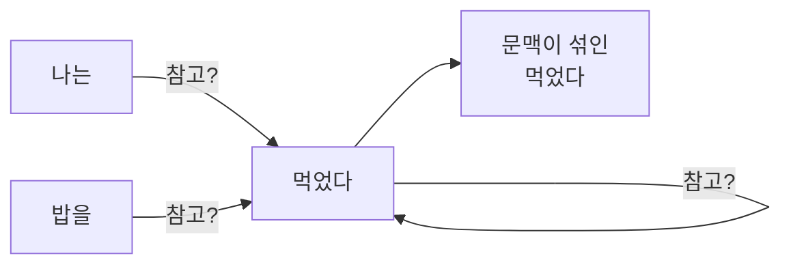
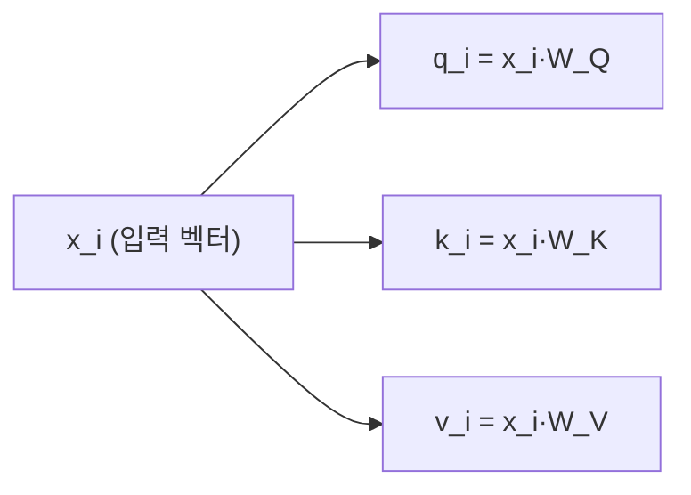
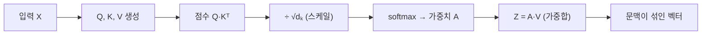
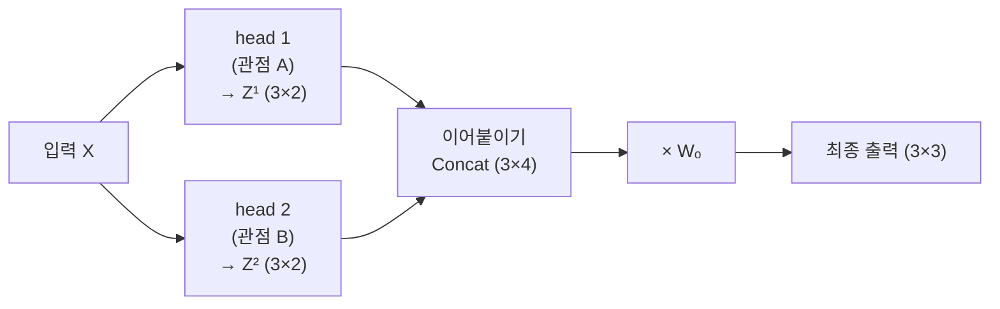

앞 글에서 문장은 \(H_0\) 라는 벡터 묶음(행렬)이 되어 Transformer 블록으로 들어갔다.
그 블록의 심장이 **self-attention**이다.
이 글은 앞 글의 **3차원 결과 \(H_0\) 를 그대로 입력으로 이어받아**, attention을 손으로 따라가며 정리한다.

## attention이 푸는 문제

임베딩만으로는 각 token이 **혼자만의 의미**를 가진다.
하지만 "먹었다"의 진짜 의미는 앞의 "밥을"과 연결될 때 완성된다.
self-attention은 각 token이 **문장 속 다른 token을 얼마나 참고할지**를 계산해 문맥을 섞는 장치다.

핵심은 이 "얼마나"를 **학습된 규칙**으로 정한다는 것이다.
그 규칙의 재료가 Q, K, V 세 벡터다.

### 왜 "self"인가

attention은 원래 **서로 다른 두 시퀀스**를 잇는 장치였다.
번역 모델에서 출력 문장의 한 단어가 입력 문장의 어느 단어를 볼지 고르는 식이다.
self-attention은 그 대상이 **하나의 시퀀스 내부**다. 문장이 자기 자신의 다른 위치를 참고하기 때문에 self다.

### 어디서 나온 아이디어인가

RNN 기반 번역 모델은 입력 문장 전체를 **하나의 hidden state**에 눌러 담아 디코더로 넘겼다.
문장이 길어지면 이 벡터 하나가 병목이 된다.
2014년 Bahdanau attention이 "매 시점 입력 전체를 다시 본다"로 이 병목을 풀었고, 2017년 Transformer는 RNN을 아예 걷어내고 **attention만 남겼다**.

## Q, K, V — 세 가지 역할

각 token 벡터 \(x_i\) 는 세 개의 벡터로 변신한다.
서로 다른 가중치 행렬 \(W_Q, W_K, W_V\) 를 곱해 만든다.

| 이름 | 비유 | 역할 |
| --- | --- | --- |
| **Query (Q)** | 검색어 | "나는 무엇을 찾고 있나" |
| **Key (K)** | 색인 | "나는 무엇에 대한 정보인가" |
| **Value (V)** | 내용 | "내가 전달할 실제 정보" |

$$
q_i = x_i W_Q, \qquad k_i = x_i W_K, \qquad v_i = x_i W_V
$$

동작은 도서관에서 자료를 찾는 것과 같다.
내 **질문(Q)** 을 모든 자료의 **색인(K)** 과 대조해 관련도를 매기고, 관련도가 높은 자료의 **내용(V)** 을 많이 가져온다.

## 예시 설정 — 앞 글의 H₀ 이어받기

입력은 앞 글에서 만든 \(3 \times 3\) 행렬 \(H_0\) 를 그대로 쓴다(token 3개, 차원 3).
각 행이 token 하나의 벡터다.

$$
X = H_0 =
\begin{bmatrix}
0.2 & 1.0 & 0.1 \\
0.9 & 0.1 & 0.4 \\
0.6 & 0.4 & 0.9
\end{bmatrix}
\begin{matrix}
\leftarrow \text{나는} \\
\leftarrow \text{밥을} \\
\leftarrow \text{먹었다}
\end{matrix}
$$

실제로는 학습된 \(3 \times 3\) 행렬 \(W_Q, W_K, W_V\) 를 곱해 Q, K, V를 만든다.
여기서는 계산 흐름에 집중하기 위해 **세 행렬을 항등행렬로 두어 \(Q = K = V = X\)** 로 둔다.

이건 임시방편이 아니라 하나의 단계다.
가중치를 걷어낸 이 상태가 **attention의 뼈대**이고, 여기에 학습되는 투영 \(W_Q, W_K, W_V\) 를 붙이면 실제 self-attention이 된다.
지금은 뼈대만 보고, 살은 이 글 뒤쪽 multi-head 절에서 붙인다.

## 1단계 — Q, K, V 만들기

항등행렬을 곱했으므로 Q, K, V는 모두 입력 \(X\) 와 같다.
즉 각 token의 세 벡터가 아래처럼 정해진다.

| token | \(q_i\) | \(k_i\) | \(v_i\) |
| --- | --- | --- | --- |
| 나는 | [0.2, 1.0, 0.1] | [0.2, 1.0, 0.1] | [0.2, 1.0, 0.1] |
| 밥을 | [0.9, 0.1, 0.4] | [0.9, 0.1, 0.4] | [0.9, 0.1, 0.4] |
| 먹었다 | [0.6, 0.4, 0.9] | [0.6, 0.4, 0.9] | [0.6, 0.4, 0.9] |

## 2단계 — 점수 계산: Q와 K의 내적

한 token이 다른 token을 얼마나 볼지는 **Query와 Key의 내적**으로 잰다.
내적이 클수록 방향이 비슷하다는 뜻이고, 곧 "관련이 깊다"는 신호다.

모든 token 쌍에 대해 \(q_i \cdot k_j\) 를 계산하면 점수 행렬 \(S = Q K^{\top}\) 가 된다.

$$
S = Q K^{\top} \approx
\begin{bmatrix}
1.05 & 0.32 & 0.61 \\
0.32 & 0.98 & 0.94 \\
0.61 & 0.94 & 1.33
\end{bmatrix}
\begin{matrix}
\leftarrow \text{나는가 본 점수} \\
\leftarrow \text{밥을이 본 점수} \\
\leftarrow \text{먹었다가 본 점수}
\end{matrix}
$$

예를 들어 마지막 행("먹었다")은 \(q_{\text{먹었다}} = [0.6, 0.4, 0.9]\) 를 각 Key와 내적한 결과다.
자기 자신(먹었다)과의 점수가 \(1.33\) 으로 가장 높다.

**여기서 한 가지 주의할 것이 있다.** 위 \(S\) 는 대각선을 기준으로 **대칭**이다.
\(W_Q = W_K = I\) 로 뒀기 때문에 \(S = X X^{\top}\) 가 되어 생긴 현상이지, attention의 성질이 아니다.
실제 모델은 \(W_Q \neq W_K\) 라 \(S\) 가 **비대칭**이다. 즉 "'나는'이 '먹었다'를 보는 정도"와 "'먹었다'가 '나는'을 보는 정도"는 서로 다르다.

아래에서 **재생** 버튼을 누르면, \(Q\) 의 각 행과 \(K^{\top}\) 의 각 열이 어떻게 곱해져 점수 한 칸씩 채워지는지 볼 수 있다.



## 3단계 — 스케일링: √dₖ 로 나누기

내적값은 차원이 커질수록 함께 커진다.
차원이 \(d_k\) 개면 그만큼 항이 더해지기 때문이다.
그래서 Key 차원 \(d_k\) 의 제곱근으로 나눠 크기를 눌러 준다.

$$
\frac{S}{\sqrt{d_k}} = \frac{S}{\sqrt{3}} \approx
\begin{bmatrix}
0.61 & 0.18 & 0.35 \\
0.18 & 0.57 & 0.54 \\
0.35 & 0.54 & 0.77
\end{bmatrix}
$$

여기서는 \(d_k = 3\) 이므로 \(\sqrt{3} \approx 1.73\) 으로 나눴다.

### 나누지 않으면 무슨 일이 생기나

"학습이 불안정해진다"로 넘어가기 쉽지만, 메커니즘은 좀 더 구체적이다.
입력값이 커질수록 softmax는 **계단 함수(step function)처럼** 동작한다. 가장 큰 항 하나가 거의 1을 독점하고 나머지는 0에 붙는다.

문제는 그 지점에서 **기울기(gradient)가 거의 0**이 된다는 것이다.
기울기가 0이면 역전파로 전달되는 학습 신호가 사라져, 학습이 급격히 느려지거나 아예 **정체(stagnate)** 된다.
\(d_k\) 가 3인 이 예시에서는 티가 나지 않지만, GPT급은 \(d_k\) 가 보통 수백에서 1000을 넘어 실제로 발생하는 문제다.

## 4단계 — softmax: 점수를 비율로

점수를 **합이 1인 비율**로 바꾸면, 각 token을 얼마나 참고할지가 정해진다.
이 변환이 softmax다. 큰 점수는 더 크게, 작은 점수는 더 작게 벌린 뒤 정규화한다.

$$
\text{softmax}(s)_j = \frac{e^{s_j}}{\sum_k e^{s_k}}
$$

"먹었다" 행 \([0.35, 0.54, 0.77]\) 에 softmax를 적용하면 다음과 같다.

$$
\text{softmax}([0.35,\, 0.54,\, 0.77]) \approx [\,0.27,\; 0.32,\; 0.41\,]
$$

즉 "먹었다"는 자기 자신을 **41%**, "밥을"을 **32%**, "나는"을 **27%** 참고한다.
세 token 전체에 적용하면 **attention 가중치 행렬** \(A\) 가 된다.

| 참고하는 token \ 참고당하는 | 나는 | 밥을 | 먹었다 |
| --- | --- | --- | --- |
| **나는** | 0.41 | 0.27 | 0.32 |
| **밥을** | 0.26 | 0.38 | 0.37 |
| **먹었다** | 0.27 | 0.32 | 0.41 |

각 행의 합은 항상 1이다(반올림 오차로 1.00 근처). 이 행렬이 "누가 누구를 얼마나 보는가"를 한눈에 보여준다.

### 헷갈리기 쉬운 두 "가중치"

\(W_Q\) 도 "가중치 행렬"이고 \(A\) 도 "attention 가중치 행렬"이지만, 둘은 성격이 완전히 다르다.

| | 정체 | 언제 정해지나 |
| --- | --- | --- |
| **\(W_Q, W_K, W_V\)** (weight parameter) | 학습되는 **모델 파라미터** | 학습이 끝나면 고정 |
| **\(A\)** (attention weight) | 참고 비율, 즉 **중간 계산 결과** | 입력 문장마다 매번 새로 계산 |

전자는 모델 파일에 저장되는 값이고, 후자는 저장되지 않는다.
같은 "가중치"라는 말을 쓰지만, 하나는 학습의 산물이고 다른 하나는 추론 중에 생겼다 사라지는 값이다.

학습 중에는 이 \(A\) 에 **dropout**을 적용한다. 일부 비율을 무작위로 0으로 만들고 남은 값을 \(1/(1-p)\) 배 키워 합을 맞춘다.
특정 token만 과하게 참고하는 것을 막기 위해서다. 추론(서빙) 시에는 적용하지 않는다.

## 5단계 — 가중합: 출력 벡터 만들기

이제 가중치대로 **Value를 섞으면** 각 token의 최종 출력이 나온다.
"먹었다"의 출력 \(z_{\text{먹었다}}\) 는 세 Value의 가중합이다.

$$
z_{\text{먹었다}} = 0.27\,v_{\text{나는}} + 0.32\,v_{\text{밥을}} + 0.41\,v_{\text{먹었다}}
$$

$$
= 0.27[0.2,1.0,0.1] + 0.32[0.9,0.1,0.4] + 0.41[0.6,0.4,0.9] \approx [\,0.59,\; 0.47,\; 0.52\,]
$$

전체를 행렬로 쓰면 \(Z = A V\) 한 줄이다.
이 \(Z\) 의 각 행이, **문맥이 섞인** 새 token 벡터다.

가중치 행렬 \(A\) 와 Value \(V\) 의 곱도 같은 방식으로 채워진다. 재생해 보자.



$$
Z = A V \approx
\begin{bmatrix}
0.52 & 0.56 & 0.44 \\
0.62 & 0.45 & 0.51 \\
0.59 & 0.47 & 0.52
\end{bmatrix}
\begin{matrix}
\leftarrow \text{나는} \\
\leftarrow \text{밥을} \\
\leftarrow \text{먹었다}
\end{matrix}
$$

## 전체 흐름 요약

지금까지의 다섯 단계는 결국 아래 한 줄의 수식으로 압축된다.

$$
\text{Attention}(Q, K, V) = \text{softmax}\!\left(\frac{Q K^{\top}}{\sqrt{d_k}}\right) V
$$

## GPT는 미래를 못 본다 — masked self-attention

지금 예시는 모든 token이 서로를 자유롭게 봤다.
하지만 GPT처럼 **다음 단어를 예측**하는 모델은, 아직 나오지 않은 미래 token을 보면 안 된다.
그래서 자기보다 **뒤에 있는 token의 점수를 \(-\infty\)** 로 막아 버린다(softmax 후 0이 된다).

$$
S_{\text{masked}} =
\begin{bmatrix}
1.05 & -\infty & -\infty \\
0.32 & 0.98 & -\infty \\
0.61 & 0.94 & 1.33
\end{bmatrix}
$$

그 결과 attention 가중치 행렬은 **아래 삼각형** 모양이 된다.
"나는"은 자기 자신만, "밥을"은 앞의 둘만, "먹었다"만 문장 전체를 본다.

\(-\infty\) 대신 마스킹 후 다시 정규화하는 방식도 있지만, \(-\infty\) 를 쓰면 softmax가 알아서 0을 만들어 주므로 한 번에 끝난다.
GPT 구현이 이 방식을 쓴다.

## 여러 관점으로 보기 — multi-head attention

지금까지는 attention을 한 번만 수행했다. 이것을 **head 하나**라고 부른다.
head가 하나면 관점도 하나뿐이라, 한 종류의 관계밖에 보지 못한다.
그래서 실제 Transformer는 **여러 head를 병렬로** 두어 서로 다른 관계를 동시에 학습한다. 여기서는 **head 2개**로 설명한다.

한 가지 단서를 달아 둔다. 아래 계산은 **마스킹을 잠시 빼고** 진행한다.
head를 나누는 구조 자체에 집중하기 위해서다. 실제 GPT는 각 head 안에서 앞 절의 마스킹을 그대로 적용한다.

**먼저 차원을 나눈다.** 앞의 single-head는 \(d_v = 3\) 이라 출력 \(Z\) 가 \(3 \times 3\) 이었다.
head 2개로 나누면 각 head는 더 작은 부분 공간(\(d_v = 2\))을 맡아, 출력이 **\(3 \times 2\)** 가 된다.
여기에는 예외 처리가 하나 들어간다.
원래 관례는 \(d_{\text{model}} = h \times d_v\) 라서 \(2 \times 2 = 4 \neq 3\) 은 규칙 위반이고, 실제 구현은 `d_model % n_heads == 0` 을 아예 강제한다.
\(d_{\text{model}} = 3\) 이 2로 나눠떨어지지 않아 예시로만 \(d_v = 2\) 를 쓴다. 그 대가로 다음 글의 \(W_O\) 가 정방행렬이 아니게 되는데, 거기서 다시 짚는다.

각 head는 **자기만의 \(W_Q^i, W_K^i, W_V^i\) (각 \(3 \times 2\))** 를 가진다.
이번엔 항등행렬이 아니라, 입력의 서로 다른 성분을 골라 섞는 행렬로 둔다.

$$
\text{head 1:}\quad
W_Q^1=\begin{bmatrix}1&0\\0&1\\0&0\end{bmatrix},\;
W_K^1=\begin{bmatrix}0&0\\1&0\\0&1\end{bmatrix},\;
W_V^1=\begin{bmatrix}1&0\\0&0\\0&1\end{bmatrix}
$$

$$
\text{head 2:}\quad
W_Q^2=\begin{bmatrix}0&1\\0&0\\1&0\end{bmatrix},\;
W_K^2=\begin{bmatrix}1&0\\0&0\\0&1\end{bmatrix},\;
W_V^2=\begin{bmatrix}0&0\\1&0\\0&1\end{bmatrix}
$$

\(Q^i = X W_Q^i\) 등으로 계산하면, **같은 \(X\) 인데 head마다 Q, K, V가 다르게** 나온다.

$$
\textbf{head 1:}\quad
Q^1=\begin{bmatrix}0.2&1.0\\0.9&0.1\\0.6&0.4\end{bmatrix},\;
K^1=\begin{bmatrix}1.0&0.1\\0.1&0.4\\0.4&0.9\end{bmatrix},\;
V^1=\begin{bmatrix}0.2&0.1\\0.9&0.4\\0.6&0.9\end{bmatrix}
$$

$$
\textbf{head 2:}\quad
Q^2=\begin{bmatrix}0.1&0.2\\0.4&0.9\\0.9&0.6\end{bmatrix},\;
K^2=\begin{bmatrix}0.2&0.1\\0.9&0.4\\0.6&0.9\end{bmatrix},\;
V^2=\begin{bmatrix}1.0&0.1\\0.1&0.4\\0.4&0.9\end{bmatrix}
$$

각 head는 이 Q, K, V로 **앞의 5단계(점수 → 스케일 → softmax → 가중합)를 그대로** 수행한다.
그 결과 head마다 \(3 \times 2\) 짜리 출력 \(Z^i\) 가 나온다.

$$
Z^1 = \begin{bmatrix} 0.58 & 0.54 \\ 0.50 & 0.43 \\ 0.53 & 0.47 \end{bmatrix}, \qquad
Z^2 = \begin{bmatrix} 0.48 & 0.48 \\ 0.44 & 0.55 \\ 0.41 & 0.53 \end{bmatrix}
$$

$$
\text{head}_i = \text{Attention}(X W_Q^i,\; X W_K^i,\; X W_V^i)
$$

각 head가 **서로 다른 부분 공간(representation subspace)** 을 본다는 것까지는 말할 수 있다.
다만 "head 1은 문법, head 2는 의미" 식으로 역할이 깔끔하게 나뉜다는 보장은 없다.
학습 결과로 그렇게 갈릴 수도 있고 아닐 수도 있으므로, 여기서는 그냥 **관점 A, 관점 B**로 부른다.

이제 두 조각 \(Z^1, Z^2\) 가 생겼다.
이것을 하나로 **이어붙이고(concat) \(W_O\) 로 섞어** 다시 \(3 \times 3\) 으로 되돌리는 과정이 다음 글의 주제다.
참고로 GPT-3는 같은 방식으로 head **96개**(각 \(d_v = 128\))를 쓴다.

## 정리

- self-attention은 각 token을 \(q, k, v\) 세 벡터로 바꾼 뒤, **Q·K로 관련도**를 재는 것이다.
- 관련도를 \(\sqrt{d_k}\) 로 나누는 이유는 값이 커지면 softmax의 **기울기가 0에 수렴**해 학습이 멈추기 때문이다.
- 그 비율대로 **Value를 가중합**하면, 문맥이 섞인 새 벡터 \(Z = AV\) 가 나온다.
- GPT는 미래 token을 \(-\infty\) 로 가려(**masked**) 다음 단어 예측에만 집중한다.
- 실제 모델은 이런 attention을 여러 개 병렬로 둔 **multi-head**로, 서로 다른 부분 공간을 동시에 본다.
- 이 글의 \(W = I\) 설정은 **뼈대만 본 것**이다. 그래서 \(S\) 가 대칭으로 나왔지만, 실제 attention은 비대칭이다.
