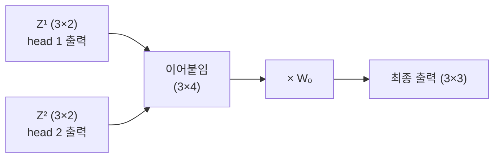

앞 글에서 head 2개가 각각 따로 attention을 계산해 **조각난 출력 \(Z^1, Z^2\)** 를 냈다.
문제는 이 조각들이 \(3 \times 2\) 두 개로 흩어져 있다는 것이다.
이 글은 그 조각들을 **이어붙여(concatenation) 다시 \(3 \times 3\) 하나로 되돌리는** 과정을 정리한다.

## 출발점 — head마다 나온 출력

앞 글에서 head 2개가 각각 \(d_v = 2\) 짜리 출력 \(Z^1, Z^2\) 를 냈다.
각 행이 token 하나의 결과다.

$$
Z^1 = \begin{bmatrix} 0.58 & 0.54 \\ 0.50 & 0.43 \\ 0.53 & 0.47 \end{bmatrix}, \qquad
Z^2 = \begin{bmatrix} 0.48 & 0.48 \\ 0.44 & 0.55 \\ 0.41 & 0.53 \end{bmatrix}
$$

\(Z^1\) 과 \(Z^2\) 는 같은 token 3개에 대한 답이지만, **서로 다른 부분 공간에서 본 결과**다.
앞 글에서 두 head에 각각 다른 \(W_Q^i, W_K^i, W_V^i\) 를 줬기 때문이다.

## 문제 — 조각난 출력을 어떻게 되돌리나

각 head의 출력은 \(d_v = 2\) 차원으로 **쪼개진 조각**이다.
하지만 다음 층으로 넘어가려면 다시 원래 차원 \(d_{\text{model}} = 3\) 으로 맞춰야 한다.
그래서 두 단계를 거친다: **이어붙이기(concat) → \(W_O\) 로 섞기**.

## 1단계 — 이어붙이기 (concatenation)

concat은 이름 그대로, 각 head의 출력을 **옆으로 나란히 붙이는** 것이다.
token마다 head 1의 결과 뒤에 head 2의 결과를 그대로 잇는다.

$$
\text{Concat}(Z^1, Z^2) =
\left[\begin{array}{cc|cc}
0.58 & 0.54 & 0.48 & 0.48 \\
0.50 & 0.43 & 0.44 & 0.55 \\
0.53 & 0.47 & 0.41 & 0.53
\end{array}\right]
$$

왼쪽 두 열이 \(Z^1\), 오른쪽 두 열이 \(Z^2\) 다.
계산은 없다. **그냥 붙일 뿐**이라, 각 head의 관점이 손실 없이 그대로 보존된다.
이제 크기는 \(3 \times 4\), 즉 \(n \times (h \cdot d_k)\) 가 된다.

## 2단계 — Wₒ 로 섞기 (output projection)

이어붙이기만 하면 head들은 물리적으로 나란히 있을 뿐, **서로 섞이지 않았다**.
그래서 **출력 가중치 \(W_O\)** 를 곱해 head 간 정보를 섞고, 동시에 차원을 \(d_{\text{model}}\) 로 되돌린다.
concat이 \(3 \times 4\) 이므로 \(W_O\) 는 \(4 \times 3\) 이다.

여기서 \(W_O\) 가 **정방행렬이 아니다.** 앞 글에서 \(d_{\text{model}} = 3\) 을 head 2개로 나누려고 \(d_v = 2\) 를 쓴 대가다.
표준 설정에서는 \(h \cdot d_v = d_{\text{model}}\) 이라 \(W_O\) 가 항상 정방행렬이 된다(GPT-3는 \(12288 \times 12288\)).

$$
W_O = \begin{bmatrix} 0.5 & 0 & 0.5 \\ 0 & 0.5 & 0.5 \\ 0.5 & 0.5 & 0 \\ 0.5 & 0 & 0.5 \end{bmatrix}
$$

아래에서 **재생**을 누르면, 이어붙인 행렬의 각 행이 \(W_O\) 의 각 열과 곱해져 최종 출력이 채워지는 과정을 볼 수 있다.



$$
\text{MultiHead}(X) = \text{Concat}(Z^1, Z^2)\, W_O \approx
\begin{bmatrix}
0.77 & 0.51 & 0.80 \\
0.75 & 0.44 & 0.74 \\
0.74 & 0.44 & 0.77
\end{bmatrix}
\begin{matrix}
\leftarrow \text{나는} \\
\leftarrow \text{밥을} \\
\leftarrow \text{먹었다}
\end{matrix}
$$

이 \(3 \times 3\) 행렬이 multi-head attention 한 층의 **최종 출력**이다.
입력 \(X\) 와 같은 \(n \times d_{\text{model}}\) 모양으로 돌아온 것에 주목한다.

## 차원 맞추기

concat과 \(W_O\) 의 크기는 항상 다음 규칙으로 맞물린다.

| 단계 | 크기 | 의미 |
| --- | --- | --- |
| head 하나의 출력 \(Z^i\) | \(n \times d_v\) | token마다 \(d_v\) 차원 |
| Concat | \(n \times (h \cdot d_v)\) | head \(h\) 개를 이어붙임 |
| \(W_O\) | \((h \cdot d_v) \times d_{\text{model}}\) | 섞으면서 원래 차원으로 |
| 최종 출력 | \(n \times d_{\text{model}}\) | 입력과 같은 모양 |

예를 들어 GPT-3는 head **96개**, 각 \(d_v = 128\) 이므로 concat은 \(96 \times 128 = 12288\) 차원이 되고, \(W_O\) 는 \(12288 \times 12288\) 행렬이다.
차원 숫자만 커질 뿐, 흐름은 이 예시와 똑같다.

## 전체 한 줄

$$
\text{MultiHead}(X) = \text{Concat}(\text{head}_1, \dots, \text{head}_h)\, W_O
$$

핵심은 두 가지다.
**concat**은 각 head의 서로 다른 관점을 **손실 없이 모으고**, **\(W_O\)** 는 그것들을 **섞으면서 원래 차원으로 되돌린다**.

## 다음 단계 — residual과 정규화

이 출력은 곧바로 다음 층으로 가지 않는다.
Transformer는 여기에 **입력을 그대로 더하고(residual connection)**, 그 결과를 **layer normalization** 으로 정규화한 뒤 MLP로 넘긴다.
두 장치 모두 다음 글에서 숫자와 함께 다룬다.

## 정리

- multi-head는 head마다 \(d_v\) 차원의 조각난 출력 \(Z^i\) 를 낸다.
- **concat**은 이 조각들을 옆으로 이어붙여 \(n \times (h \cdot d_v)\) 로 모은다(계산 없이 보존).
- **\(W_O\)** 를 곱해 head들을 섞고, 차원을 다시 \(d_{\text{model}}\) 로 되돌린다.
- 결과는 입력과 같은 \(n \times d_{\text{model}}\) 모양이라, 다음 층으로 그대로 이어진다.
