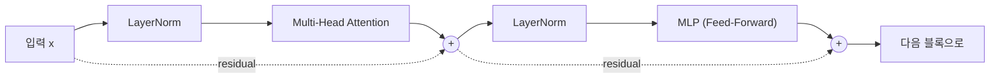

attention은 token들끼리 **서로 정보를 섞는** 단계였다.
그렇게 문맥이 섞인 각 token을, 이번엔 **혼자서 한 번 더 가공하는** 단계가 MLP다.
MLP(=Feed-Forward Network, FFN)는 attention과 함께 Transformer 블록의 나머지 절반을 이룬다.

## Transformer 블록에서 MLP의 자리

한 블록은 **attention → MLP** 순서로 이어지고, 두 단계 앞에 각각 LayerNorm이, 뒤에 각각 residual이 붙는다.
이 블록을 수십 개 쌓은 것이 GPT다.

### norm이 앞인가 뒤인가

여기서 순서를 짚고 넘어갈 필요가 있다.
2017년 원 Transformer 논문은 연산을 **먼저 하고 그 결과를 정규화**했다. 이것을 **Post-LayerNorm**이라 부른다.

GPT-2와 GPT-3는 반대다. **정규화를 먼저 하고 연산에 넣는다(Pre-LayerNorm).**
Post 방식은 학습이 불안정해지는 경향이 있어, 이후 대부분의 모델이 Pre 방식으로 옮겼다.

$$
\text{Post-LN: } \; \text{LN}(x + \text{Attn}(x)) \qquad\text{vs.}\qquad \text{Pre-LN: } \; x + \text{Attn}(\text{LN}(x))
$$

위 다이어그램이 Pre-LayerNorm이다. residual로 더해지는 값은 **정규화되기 전의 원본 \(x\)** 라는 점이 핵심이다.
덕분에 입력에서 출력까지 아무 변형 없이 흐르는 경로가 하나 생긴다.

## MLP가 attention과 다른 점

가장 큰 차이는 **정보가 섞이는 방향**이다.

| | 섞이는 방향 | 하는 일 |
| --- | --- | --- |
| **attention** | token ↔ token (가로) | 다른 token을 참고해 문맥을 섞음 |
| **MLP** | 한 token 안 (세로) | token 하나를 혼자 비선형 변환 |

MLP는 token끼리 섞지 않는다.
문장 속 모든 token이 **똑같은 MLP**(같은 \(W_1, W_2\))를 **각자 독립적으로** 통과한다.
그래서 여기서는 token 하나("먹었다")만 따라가면 충분하다.

## LayerNorm — 앞 글들에서 미뤄 둔 것

MLP로 들어가기 전에, 지난 글들에서 계속 "다음 글에서 다룬다"고 미뤄 둔 LayerNorm을 짚는다.

LayerNorm은 벡터 하나를 **평균 0, 분산 1**로 맞추는 연산이다.
여기서 "벡터 하나"란 **token 하나의 feature 축**을 말한다. batch가 아니라 feature 방향으로 정규화한다는 점이 batch normalization과의 결정적 차이이고, 그래서 batch 크기에 영향받지 않는다.

$$
\text{LN}(x) = \gamma \odot \frac{x - \mu}{\sqrt{\sigma^2 + \epsilon}} + \beta,
\qquad
\mu = \frac{1}{d}\sum_i x_i,\quad
\sigma^2 = \frac{1}{d}\sum_i (x_i - \mu)^2
$$

\(\epsilon\) 은 분산이 0일 때 0으로 나누는 것을 막는 아주 작은 값이다.
\(\gamma\)(scale)와 \(\beta\)(shift)는 **학습되는 파라미터**로, 모델이 정규화 강도를 스스로 조절할 수 있게 해준다. 초깃값은 각각 1과 0이다.

### 실제 값으로 해보기

앞 글의 multi-head 출력에서 "먹었다" 행은 \([0.74, 0.44, 0.77]\) 이었다.
Pre-LayerNorm 구조이므로, 여기에 먼저 residual(= 3편의 \(H_0\) 중 "먹었다" 행)을 더한다.

$$
[\,0.6,\, 0.4,\, 0.9\,] + [\,0.74,\, 0.44,\, 0.77\,] = [\,1.34,\; 0.84,\; 1.67\,]
$$

이 벡터의 평균은 \(\mu = 1.28\), 표준편차는 \(\sigma = 0.34\) 다. \(\gamma = 1, \beta = 0\) 으로 두고 정규화하면 이렇게 된다.

$$
\text{LN}([\,1.34,\, 0.84,\, 1.67\,]) = [\,0.17,\; -1.30,\; 1.13\,]
$$

크기는 눌렸지만 **대소 관계는 그대로**다. 세 번째 성분이 가장 크고 두 번째가 가장 작다.
LayerNorm은 정보를 지우는 게 아니라 **눈금만 다시 매기는** 연산이다.

## 입력 — MLP에 들어가는 벡터

이제 MLP 계산으로 넘어간다.
아래 계산은 정규화 이전 값 \([0.74, 0.44, 0.77]\) 을 그대로 입력으로 쓴다. MLP 자체의 흐름을 따라가는 것이 목적이라, 숫자를 앞 글과 맞춰 두는 편이 읽기 쉽기 때문이다.
LayerNorm을 거친 값을 넣어도 **연산 과정은 한 글자도 달라지지 않는다.**

$$
x = [\,0.74,\; 0.44,\; 0.77\,]
$$

## MLP 구조 — 확장 → 비선형 → 축소

MLP는 **선형 → 비선형(GELU) → 선형** 세 겹으로 된 단순한 구조다.

$$
\text{MLP}(x) = \text{GELU}(x W_1 + b_1)\, W_2 + b_2
$$

- \(W_1\): 차원을 **늘린다**(\(d_{\text{model}} \to d_{\text{ff}}\), 보통 4배).
- **GELU**: 비선형 함수를 통과시킨다.
- \(W_2\): 차원을 다시 **원래대로**(\(d_{\text{ff}} \to d_{\text{model}}\)) 줄인다.

여기서는 \(d_{\text{model}} = 3\) 을 \(d_{\text{ff}} = 6\) 으로 늘렸다 줄인다(예시라 2배, GPT-3는 4배).

## 1단계 — 확장: x W₁ + b₁

\(3 \to 6\) 으로 늘리는 \(W_1\;(3 \times 6)\) 을 곱한다.

$$
W_1 = \begin{bmatrix}
1 & -1 & 0 & 1 & 0 & -1 \\
0 & 1 & 1 & -1 & 1 & 0 \\
1 & 0 & -1 & 0 & 1 & 1
\end{bmatrix}, \quad
b_1 = [\,0.1,\, -0.1,\, 0,\, 0.1,\, 0,\, -0.1\,]
$$

아래에서 **재생**하면 \(x\) 한 줄이 \(W_1\) 의 각 열과 곱해져 6개로 늘어나는 과정을 볼 수 있다.



여기에 \(b_1\) 을 더하면 확장된 벡터 \(h\) 가 된다.

$$
h = x W_1 + b_1 = [\,1.61,\; -0.40,\; -0.33,\; 0.40,\; 1.21,\; -0.07\,]
$$

## 2단계 — GELU: 비선형 통과

GELU는 **음수는 0 쪽으로 누르고, 양수는 거의 그대로 통과**시키는 부드러운 곡선이다.
ReLU(\(\max(0, z)\))의 매끄러운 버전이라고 보면 된다.

$$
\text{GELU}(z) \approx 0.5\,z\left(1 + \tanh\!\left[\sqrt{2/\pi}\,\big(z + 0.044715\,z^3\big)\right]\right)
$$

\(h\) 의 각 원소에 GELU를 적용한다.
큰 양수(1.61, 1.21)는 거의 그대로 남고, 음수(-0.40, -0.33)는 0에 가깝게 눌린다.

$$
\text{GELU}(h) = [\,1.52,\; -0.14,\; -0.12,\; 0.26,\; 1.07,\; -0.03\,]
$$

이 **비선형**이 없으면 \(W_1\) 과 \(W_2\) 는 하나의 행렬로 합쳐져, 층을 쌓아도 결국 선형 하나가 되어 버린다.
GELU가 있어야 층을 쌓는 의미가 생긴다.

### 왜 ReLU가 아니라 GELU인가

"부드럽다"는 것이 단순한 모양 차이가 아니다.
ReLU는 음수 구간이 **완전히 평평해서 기울기가 0**이다. 한 뉴런이 계속 음수만 받으면 학습 신호가 전혀 오지 않아 그대로 죽는다.

GELU는 음수 구간에서도 기울기가 0이 아니다(\(z \approx -0.75\) 한 점만 예외다).
위에서 \(-0.40\) 이 \(-0.14\) 로, \(-0.33\) 이 \(-0.12\) 로 **0이 아닌 값**이 된 것이 그 결과다.
음수를 받은 뉴런도 학습에 계속 기여할 수 있다는 뜻이고, 이게 GELU를 쓰는 실질적인 이유다.

## 3단계 — 축소: GELU(h) W₂ + b₂

이제 \(6 \to 3\) 으로 되돌리는 \(W_2\;(6 \times 3)\) 을 곱한다.

$$
W_2 = \begin{bmatrix}
0.5 & -0.5 & 0 \\
0 & 0.5 & 0.5 \\
-0.5 & 0 & 0.5 \\
0.5 & 0.5 & 0 \\
0 & -0.5 & 0.5 \\
0.5 & 0 & -0.5
\end{bmatrix}, \quad
b_2 = [\,0.1,\, 0,\, -0.1\,]
$$



\(b_2\) 를 더하면 MLP의 출력이 나온다. 다시 \(d_{\text{model}} = 3\) 차원이다.

$$
\text{MLP}(x) = \text{GELU}(h) W_2 + b_2 = [\,1.04,\; -1.24,\; 0.32\,]
$$

## 4단계 — residual: 입력을 다시 더하기

MLP 출력은 그대로 쓰이지 않고, **입력 \(x\) 를 다시 더한다**(residual connection).

$$
x + \text{MLP}(x) = [\,0.74,\, 0.44,\, 0.77\,] + [\,1.04,\, -1.24,\, 0.32\,] = [\,1.78,\; -0.80,\; 1.09\,]
$$

학습 중에는 이 덧셈 직전에 **dropout**이 한 번 들어간다. MLP 출력의 일부를 무작위로 0으로 만드는 것으로, attention 쪽에도 같은 장치가 붙는다. 추론 시에는 적용하지 않는다.

### 왜 더하는가 — vanishing gradient

"원래 정보가 사라지지 않는다"는 설명은 절반이다. 진짜 이유는 **기울기** 쪽에 있다.

역전파는 층을 거슬러 올라가며 기울기를 **곱해 나간다**.
각 층의 기울기가 1보다 작으면 곱할수록 0에 수렴하고, 96층쯤 쌓이면 앞쪽 층에는 학습 신호가 사실상 도달하지 않는다. 이것이 **vanishing gradient**다.

residual은 여기에 **덧셈으로 이어진 지름길**을 만든다.
\(y = x + f(x)\) 를 미분하면 \(1 + f'(x)\) 라서, \(f'(x)\) 가 아무리 작아져도 **1이 남는다**. 기울기가 0으로 붕괴하지 않고 앞쪽 층까지 전달된다.

실제로 5층짜리 신경망에서 층별 기울기 평균을 재보면 차이가 분명하다.

| 층 | residual 없음 | residual 있음 |
| --- | --- | --- |
| 첫 번째 층 | 0.00020 | 0.22170 |
| 다섯 번째 층 | 0.00505 | 1.32585 |

residual이 없으면 첫 층의 기울기가 다섯 번째 층의 **1/25** 수준으로 줄어든다.
층이 96개인 GPT-3에서 residual 없이 학습이 되지 않는 이유가 이것이다.

이 벡터가 그대로 **다음 블록**의 입력이 된다.
Pre-LayerNorm 구조에서는 여기에 LayerNorm이 다시 붙지 않는다. 정규화는 다음 블록이 **자기 입구에서** 수행하고, 블록을 전부 통과한 뒤 마지막에 한 번 더 적용된다.

## GPT-3 숫자

MLP는 모델에서 **파라미터가 가장 많이 몰리는** 곳이다.

| 기호 | 의미 | GPT-3 값 |
| --- | --- | --- |
| \(d_{\text{model}}\) | 입력·출력 차원 | 12288 |
| \(d_{\text{ff}}\) | 확장 차원(4배) | 49152 |
| \(W_1\) | 확장 행렬 | \(12288 \times 49152\) (약 6억) |
| \(W_2\) | 축소 행렬 | \(49152 \times 12288\) (약 6억) |

블록 하나의 MLP만 약 12억 개의 파라미터를 갖는다.
차원 숫자만 커질 뿐, 흐름은 이 예시(\(3 \to 6 \to 3\))와 똑같다.

같은 블록 안의 attention과 비교하면 차이가 분명하다.
attention은 \(W_Q, W_K, W_V, W_O\) 네 개가 각각 \(12288 \times 12288\) 이다.

| 블록 하나 기준 | 계산 | 파라미터 수 |
| --- | --- | --- |
| MLP | \(2 \times 12288 \times 49152\) | 약 **12.1억** |
| attention | \(4 \times 12288 \times 12288\) | 약 **6.0억** |

**MLP가 attention의 정확히 2배다.**
"Transformer는 attention이 핵심"이라고들 하지만, 파라미터 기준으로는 MLP가 모델의 주인이다.
서빙에서 가중치를 읽어 오는 시간의 대부분도 여기에 쓰인다.

## 정리

- MLP는 attention과 달리, 각 token을 **혼자서** 비선형 변환하는 단계다.
- 구조는 **확장(\(W_1\)) → GELU → 축소(\(W_2\))** 로 단순하다.
- **GELU** 비선형이 있어야 층을 쌓는 의미가 생긴다. ReLU와 달리 음수 뉴런을 죽이지 않는다.
- **LayerNorm**은 token 하나를 평균 0·분산 1로 맞춘다. GPT는 연산 **앞에** 두는 Pre-LayerNorm 방식이다.
- **residual**은 미분값에 1을 남겨, 층이 깊어져도 기울기가 0으로 붕괴하지 않게 한다.
- MLP는 블록에서 파라미터가 가장 많이 몰리는 곳으로, attention 전체의 **2배**다.
