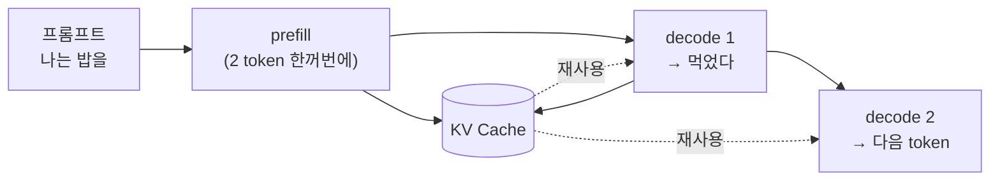
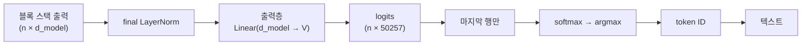

지금까지 임베딩부터 MLP까지 계산한 것은 **forward 한 번**, 즉 token 하나를 만드는 과정이었다.
실제 문장 생성은 이 과정을 **token 개수만큼 반복**한다.
이 글은 그 반복 구조를 **prefill · decode** 로 나누고, **KV Cache** 가 정확히 어떤 숫자를 재사용하는지 정리한다.

## 생성은 두 단계로 나뉜다

사용자가 프롬프트를 넣으면, 모델은 성격이 다른 두 단계를 거친다.

- **prefill**: 입력 프롬프트 **전체를 한 번에** 처리한다. token이 여러 개라 계산량이 많다.
- **decode**: 그 뒤로 token을 **하나씩** 만든다. 스텝마다 가볍지만 여러 번 반복된다.

이 글은 **4편의 단순 설정으로 되돌아간다.** 5편의 multi-head concat과 6편의 MLP는 잠시 접어 두고, 단일 head에 \(W_Q = W_K = W_V = I\) 인 상태로 본다.
KV Cache가 재사용하는 것이 **어떤 숫자인지**만 드러내면 되기 때문이고, head가 늘고 층이 쌓여도 구조는 같다.

## 1단계 — prefill: 프롬프트를 한 번에

프롬프트를 `"나는 밥을"` (token 2개)이라 하자.
앞 글들과 같은 벡터를 쓴다(\(d_{\text{model}} = 3\), 가중치는 항등행렬이라 \(Q = K = V = X\)).

$$
X = \begin{bmatrix} 0.2 & 1.0 & 0.1 \\ 0.9 & 0.1 & 0.4 \end{bmatrix}
\begin{matrix} \leftarrow \text{나는} \\ \leftarrow \text{밥을} \end{matrix}
$$

두 token을 **병렬로** 처리해 attention을 계산한다.
GPT는 미래를 보지 못하므로(masked), 첫 행은 자기 자신만 본다.

$$
\frac{S}{\sqrt{3}} = \begin{bmatrix} 0.61 & -\infty \\ 0.18 & 0.57 \end{bmatrix}
\;\xrightarrow{\text{softmax}}\;
A = \begin{bmatrix} 1.00 & 0 \\ 0.41 & 0.59 \end{bmatrix}
$$

여기까지가 prefill이다.
그리고 **여기서 계산한 K와 V를 버리지 않고 저장한다.** 이것이 KV Cache다.

$$
K_{\text{cache}} = \begin{bmatrix} 0.2 & 1.0 & 0.1 \\ 0.9 & 0.1 & 0.4 \end{bmatrix}, \qquad
V_{\text{cache}} = \begin{bmatrix} 0.2 & 1.0 & 0.1 \\ 0.9 & 0.1 & 0.4 \end{bmatrix}
$$

두 행렬이 똑같아 보이는 것은 \(W_K = W_V = I\) 로 뒀기 때문이다.
실제 모델은 \(W_K \neq W_V\) 라 **서로 다른 행렬**이고, 그래서 뒤에 나올 메모리 공식에 계수 \(2\) 가 붙는다.

## 왜 K와 V만 저장하나

Q는 캐시하지 않는다. 여기에 KV Cache의 핵심이 있다.

| 벡터 | 나중에 다시 필요한가 | 이유 |
| --- | --- | --- |
| **K, V** | **필요하다** | 새 token이 **과거 token들을 참고**할 때 그 K·V를 쓴다 |
| **Q** | 필요 없다 | 각 token의 Q는 **자기 출력을 만들 때 한 번** 쓰고 끝난다 |

새로 생성되는 token은 자신의 q 하나만 있으면 된다.
그 q 를 **과거의 모든 K** 와 내적해 점수를 내고, **과거의 모든 V** 를 가중합하기 때문이다.
반대로 이미 처리된 token의 Q는 다시 등장할 일이 없다.

## 2단계 — decode: token 하나만 계산

이제 3번째 token `"먹었다"` 를 생성한다. 벡터는 \([0.6, 0.4, 0.9]\) 다.
새 token에 대해서만 \(q_3, k_3, v_3\) 를 만든다.

캐시에 \(k_3, v_3\) 를 **한 줄 덧붙인다**. 앞의 두 줄은 그대로 재사용한다.

$$
K_{\text{cache}} = \begin{bmatrix} 0.2 & 1.0 & 0.1 \\ 0.9 & 0.1 & 0.4 \\ \mathbf{0.6} & \mathbf{0.4} & \mathbf{0.9} \end{bmatrix}
\quad \text{(굵은 줄만 새로 계산)}
$$

점수는 **행렬 전체가 아니라 한 줄만** 계산한다.
\(q_3\) 를 캐시된 세 개의 K와 내적하면 끝이다.

$$
q_3 K_{\text{cache}}^{\top} = [\,0.61,\; 0.94,\; 1.33\,]
\;\xrightarrow{\div\sqrt{3}}\;
[\,0.35,\; 0.54,\; 0.77\,]
\;\xrightarrow{\text{softmax}}\;
[\,0.27,\; 0.32,\; 0.41\,]
$$

이 값을 캐시된 V에 가중합하면 출력이 나온다.

$$
z_3 = 0.27\,v_1 + 0.32\,v_2 + 0.41\,v_3 = [\,0.59,\; 0.47,\; 0.52\,]
$$

**4편에서 \(3 \times 3\) 행렬로 한꺼번에 구했던 마지막 행과 정확히 같은 값이다.**
즉 결과는 동일한데, 계산한 양만 \(3 \times 3\) 에서 \(1 \times 3\) 으로 줄었다.

## 그래서 벡터가 어떻게 token이 되나

여기서 한 가지 짚고 갈 것이 있다. 방금 나온 \(z_3 = [0.59, 0.47, 0.52]\) 는 **아직 벡터다.**
이것이 `"먹었다"` 라는 글자가 되려면 단계가 더 남아 있다.

블록을 전부 통과한 뒤 **final LayerNorm**을 한 번 거치고, **출력층**을 곱한다.
출력층은 \(d_{\text{model}}\) 차원을 사전 크기 \(V\) 로 펼치는 행렬이다. GPT-3 기준 \(12288 \times 50257\) 로, 3편의 임베딩 행렬과 **모양이 같다.** 벡터로 들어갔던 길을 거꾸로 되짚어 나오는 셈이다.

$$
\text{logits} = \text{LN}(Z)\, W_{\text{out}}, \qquad W_{\text{out}} \in \mathbb{R}^{d_{\text{model}} \times V}
$$

결과인 logits는 token마다 **사전의 5만여 단어 각각에 대한 점수**를 담는다.
그런데 다음 token을 고를 때 쓰는 것은 **마지막 행 하나뿐**이다. 나머지 행은 이미 아는 token의 자리라 버린다.

$$
\text{logits}[-1] \;\xrightarrow{\text{softmax}}\; \text{확률분포} \;\xrightarrow{\text{argmax}}\; \text{token ID} \;\to\; \text{"먹었다"}
$$

여기서 가장 큰 값을 그대로 고르는 방식을 **greedy decoding**이라 한다.
softmax는 순서를 바꾸지 않는 함수라, 사실 **logits에 바로 argmax를 해도 결과가 같다.** 확률값 자체가 필요할 때만 softmax를 계산하면 된다.

실제 서비스는 항상 최댓값을 고르지는 않는다. 확률분포에서 **뽑기**를 하면 같은 프롬프트에도 매번 다른 답이 나온다.
분포를 얼마나 뾰족하게 만들지 조절하는 것이 temperature이고, 후보를 상위 몇 개로 제한하는 것이 top-k다. 이 부분은 별도로 다룰 주제다.

## 캐시가 있을 때와 없을 때

같은 결과를 얻는 데 드는 계산량 차이가 크다.

| | 캐시 없음 | 캐시 있음 |
| --- | --- | --- |
| K, V 계산 | 매번 **n개 전부** 다시 | **새 token 1개**만 |
| 점수 행렬 | \(n \times n\) 전체 | \(1 \times n\) 한 줄 |
| 스텝당 비용 | \(O(n^2)\) | \(O(n)\) |
| n token 생성 총합 | \(O(n^3)\) | \(O(n^2)\) |

캐시가 없으면 token이 길어질수록 **한 token 만드는 시간이 계속 늘어난다**.
캐시를 쓰면 스텝 비용이 거의 일정하게 유지된다.

교과서에 나오는 가장 단순한 생성 루프가 정확히 "캐시 없음" 버전이다.
매 스텝 `logits = model(idx)` 로 **전체 시퀀스를 처음부터 다시** forward하고, 결과 token을 뒤에 붙여 또 전부 다시 계산한다.
동작은 맞지만, 이미 계산한 K·V를 매번 버리고 있다.

## 대가는 메모리

공짜는 아니다. **연산을 아끼는 대신 메모리를 쓴다.**
캐시 크기는 다음과 같이 커진다.

$$
\text{KV Cache} = 2 \times n_{\text{layers}} \times d_{\text{model}} \times n_{\text{tokens}} \times \text{bytes}
$$

맨 앞의 \(2\) 가 앞에서 말한 **K와 V** 다.

GPT-3(레이어 96, \(d_{\text{model}} = 12288\), fp16 기준)로 계산하면 이렇다.

| 항목 | 크기 |
| --- | --- |
| token **1개**당 | 약 **4.5 MB** |
| 2048 token(최대 문맥) | 약 **9 GB** |

문장 하나를 처리하는 데 KV Cache만 9 GB다.
모델 가중치와 **별도로** 필요한 메모리이고, 동시 요청 수만큼 배로 늘어난다.
서빙에서 배치 크기가 GPU 메모리에 막히는 주된 이유가 이것이다.

이 크기를 줄이려고 여러 head가 K·V를 **공유하게** 만드는 방식(MQA, GQA)이 나왔다.
GPT-3 이후 모델들이 대부분 채택하고 있는데, 이것도 별도로 다룰 주제다.

## 그래서 병목이 단계마다 다르다

두 단계의 성격 차이는 이 구조에서 그대로 따라 나온다.

- **prefill은 연산 집약적**이다. token 여러 개를 한꺼번에 행렬 곱으로 처리하니 GPU 연산이 꽉 찬다.
- **decode는 메모리 집약적**이다. 계산량은 한 줄뿐인데, 그 한 줄을 위해 **모델 가중치 전체와 커진 KV Cache를 매번 읽어야** 한다.

그래서 최적화 방향도 갈린다.
긴 문서를 넣는 작업은 prefill이 병목이고, 짧게 묻고 길게 답하는 챗봇은 decode가 병목이다.

## 정리

- 문장 생성은 **prefill(프롬프트 한꺼번에) → decode(하나씩 반복)** 두 단계다.
- **KV Cache** 는 과거 token의 K·V를 저장해, 새 token 계산 시 **한 줄만** 계산하게 해준다.
- **Q는 캐시하지 않는다.** 과거 token의 Q는 다시 쓰이지 않기 때문이다.
- 벡터가 token이 되는 마지막 경로는 **final LayerNorm → 출력층 → logits → argmax** 다.
- 스텝 비용이 \(O(n^2)\) 에서 \(O(n)\) 으로 줄지만, 그 대가로 **메모리**를 쓴다(GPT-3 기준 2048 token에 약 9 GB).
- prefill은 연산 병목, decode는 메모리 병목이다.
