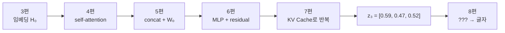
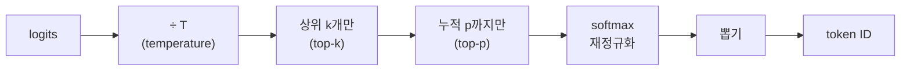
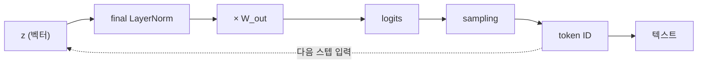

3편에서 텍스트는 벡터가 되어 모델로 들어갔고, 7편까지 계속 벡터인 채로 계산됐다.
이 글은 그 벡터가 **다시 글자로 돌아오는 마지막 구간**을 다룬다.
출력층에서 logits를 만드는 과정과, 그 logits에서 token 하나를 고르는 **sampling** 이 주제다.

## 어디까지 왔나

시리즈가 지나온 숫자를 이어 붙이면 이렇게 된다.

7편의 decode가 만든 \(z_3 = [0.59,\; 0.47,\; 0.52]\) 는 **문맥이 전부 반영된 3차원 벡터**다.
문제는 이게 아직 숫자라는 것이다. 사용자에게 보여줄 글자가 되려면 두 단계가 더 필요하다.

## 1단계 — final LayerNorm

블록을 전부 통과한 벡터는 출력층으로 가기 전에 **LayerNorm을 한 번 더** 거친다.
6편에서 본 블록 내부의 LayerNorm과 같은 연산이지만, 이건 블록 스택 전체가 끝난 뒤 딱 한 번 적용된다.

$$
\text{LN}([\,0.59,\, 0.47,\, 0.52\,]) = [\,1.28,\; -1.15,\; -0.14\,]
$$

Pre-LayerNorm 구조에서는 마지막 블록의 출력에 정규화가 붙지 않은 채로 나온다.
그래서 출력층 앞에 이 **final LayerNorm**을 따로 둔다.

## 2단계 — 출력층: 사전 크기로 펼치기

이제 3차원 벡터를 **사전에 있는 모든 token에 대한 점수**로 바꾼다.
3편에서 쓴 사전을 그대로 가져온다. 크기 \(V = 6\) 이고, ID 3~5에 이름을 붙였다.

| ID | token | ID | token |
| --- | --- | --- | --- |
| 0 | 나는 | 3 | 그리고 |
| 1 | 밥을 | 4 | 물을 |
| 2 | 먹었다 | 5 | 마셨다 |

출력층은 \(d_{\text{model}} \to V\) 로 펼치는 행렬 하나다. 여기서는 \(3 \times 6\) 이다.

$$
W_{\text{out}} =
\begin{bmatrix}
0.1 & -0.2 & 0.3 & 1.5 & 0.9 & 0.6 \\
-0.3 & 0.4 & -0.1 & -0.8 & -0.5 & 0.2 \\
0.2 & 0.1 & 0.5 & 0.4 & 0.7 & -0.3
\end{bmatrix}
$$

아래에서 **재생**을 누르면 정규화된 벡터가 각 token의 열과 곱해져 점수 6개로 펼쳐지는 과정을 볼 수 있다.



결과가 **logits**다. 사전의 token 하나마다 점수 하나씩, 총 6개가 나온다.

$$
\text{logits} = [\,0.45,\; -0.73,\; 0.43,\; 2.79,\; 1.64,\; 0.58\,]
$$

`그리고`(ID 3)의 점수 \(2.79\) 가 가장 높고, `밥을`(ID 1)의 \(-0.73\) 이 가장 낮다.
"나는 밥을 먹었다" 다음에 `밥을` 이 또 나올 이유는 없으니 납득할 만한 순서다.

> **참고** — GPT-2와 GPT-3는 이 \(W_{\text{out}}\) 을 새로 두지 않고 **임베딩 행렬을 전치해서 재사용**한다(weight tying). 그러면 logit 하나가 곧 `출력 벡터 · token 임베딩` 내적이 되어, 3편에서 본 **방향이 비슷할수록 점수가 높다**는 이야기와 그대로 이어진다. 여기서는 계산을 보기 쉽게 별도 행렬로 뒀다.

### GPT-3에서의 크기

| | 예시 | GPT-3 |
| --- | --- | --- |
| \(W_{\text{out}}\) | \(3 \times 6\) | \(12288 \times 50257\) (약 6.2억) |
| logits (token 1개당) | 6개 | **50257개** |

token 하나를 만들 때마다 5만여 개의 점수를 계산한다는 뜻이다.

### logits는 사실 더 크다

지금은 token 하나만 봤지만, prefill에서는 여러 token을 한꺼번에 처리한다.
그래서 logits의 실제 모양은 \(n \times V\) 이고, batch까지 넣으면 3차원이 된다.

$$
\text{logits} \in \mathbb{R}^{\,\text{batch} \times n \times V}
$$

그런데 **다음 token을 고를 때 쓰는 것은 마지막 행 하나뿐**이다.
앞쪽 행들은 이미 알고 있는 token 자리의 예측이라 생성에는 쓸모가 없다. 계산은 했지만 버린다.

## 3단계 — 가장 큰 것 고르기: greedy decoding

가장 단순한 선택은 **제일 높은 점수를 그대로 고르는 것**이다.

$$
\text{다음 token} = \arg\max_j \; \text{logits}_j = 3 \;\to\; \text{그리고}
$$

여기서 자주 하는 오해가 하나 있다.
"softmax로 확률을 구한 다음 가장 큰 걸 고른다"고 설명하는 경우가 많은데, **greedy라면 softmax는 필요 없다.**

softmax는 **순서를 바꾸지 않는(monotonic) 함수**다.
logits에서 가장 큰 원소는 확률로 바꿔도 여전히 가장 크다. 그래서 `argmax(logits)` 와 `argmax(softmax(logits))` 의 결과는 항상 같다.

확률값 자체가 필요할 때만 softmax를 계산하면 된다.
아래에서 다룰 sampling 기법들이 바로 그 경우다.

## 4단계 — 확률로 바꾸기

sampling을 하려면 점수를 **합이 1인 확률분포**로 바꿔야 한다.

$$
p_j = \frac{e^{\,\text{logits}_j}}{\sum_k e^{\,\text{logits}_k}}
$$

| token | logit | 확률 |
| --- | --- | --- |
| **그리고** | 2.79 | **0.608** |
| 물을 | 1.64 | 0.191 |
| 마셨다 | 0.58 | 0.067 |
| 나는 | 0.45 | 0.058 |
| 먹었다 | 0.43 | 0.058 |
| 밥을 | -0.73 | 0.018 |

여기서 `그리고` 를 항상 고르는 것이 greedy다.
그런데 실제 서비스는 그렇게 하지 않는다. **확률에 따라 뽑기(sampling)** 를 한다.

## greedy로는 왜 부족한가

greedy decoding은 **완전히 결정적**이다. 같은 프롬프트에 항상 같은 답이 나온다.

문제는 매 스텝 최댓값만 고르면 문장이 **단조롭고 반복적**이 된다는 점이다.
"그리고 ... 그리고 ..." 처럼 확률이 높은 표현으로 계속 되돌아오는 루프에 갇히기 쉽다.
당장 이 스텝에서 최선인 선택이 문장 전체로도 최선이라는 보장은 없다.

그래서 확률분포에서 뽑되, **얼마나 모험할지**를 조절하는 장치를 둔다.
그 장치가 temperature, top-k, top-p 셋이다.

## temperature — 분포의 뾰족함 조절

temperature는 softmax에 넣기 **전에 logits를 \(T\) 로 나누는** 것이 전부다.

$$
p_j = \frac{e^{\,\text{logits}_j / T}}{\sum_k e^{\,\text{logits}_k / T}}
$$

나누기 하나지만 효과가 크다.
\(T < 1\) 이면 값들의 간격이 **벌어져** 분포가 뾰족해지고, \(T > 1\) 이면 간격이 **좁아져** 평평해진다.

같은 logits에 \(T\) 만 바꿔 본 결과다.

| token | T=0.5 (보수적) | T=1.0 (원본) | T=2.0 (모험적) |
| --- | --- | --- | --- |
| **그리고** | **0.885** | **0.608** | **0.373** |
| 물을 | 0.088 | 0.191 | 0.209 |
| 마셨다 | 0.011 | 0.067 | 0.124 |
| 나는 | 0.008 | 0.058 | 0.115 |
| 먹었다 | 0.008 | 0.058 | 0.115 |
| 밥을 | 0.001 | 0.018 | 0.064 |

\(T = 0.5\) 에서는 `그리고` 가 88.5%를 가져가 사실상 greedy에 가깝다.
\(T = 2.0\) 에서는 37.3%까지 내려가, 나머지 token들도 뽑힐 여지가 생긴다.

양 끝의 극단을 보면 이해가 빠르다.

- \(T \to 0\): 최댓값 하나가 확률 1을 독점한다. **greedy와 완전히 같아진다.**
- \(T \to \infty\): 모든 token이 균등해진다. **완전한 무작위**가 된다.

즉 temperature는 greedy와 무작위 사이를 잇는 **손잡이 하나**다.
사실 확인이 중요한 작업은 낮게, 창작은 높게 두는 것이 일반적이다.

## top-k — 후보를 상위 k개로 자르기

temperature만으로는 부족한 구석이 있다.
분포를 아무리 뾰족하게 만들어도 **말이 안 되는 token에 아주 작은 확률이 계속 남는다.**
위 표에서 \(T = 2.0\) 일 때 `밥을` 이 6.4%다. 스텝을 수백 번 반복하면 언젠가는 뽑힌다.

top-k는 아예 **후보를 상위 \(k\) 개로 잘라 버린다.**
나머지 logits를 \(-\infty\) 로 만들면 softmax 후 정확히 0이 된다. 4편의 masked attention과 같은 수법이다.

\(k = 2\) 로 자르면 이렇게 된다.

$$
\text{logits}_{\text{top-2}} = [\,-\infty,\; -\infty,\; -\infty,\; 2.79,\; 1.64,\; -\infty\,]
$$

남은 둘만으로 다시 정규화하면 확률이 이렇게 재분배된다.

| token | 원래 확률 | k=2 적용 후 | k=3 적용 후 |
| --- | --- | --- | --- |
| **그리고** | 0.608 | **0.761** | **0.702** |
| 물을 | 0.191 | 0.239 | 0.221 |
| 마셨다 | 0.067 | 0 | 0.077 |
| 나머지 3개 | 0.134 | 0 | 0 |

잘려 나간 확률이 살아남은 후보들에게 **비율 그대로 나눠진다**.
`그리고` 와 `물을` 의 비율은 자르기 전과 후가 같다.

## top-p — 확률 합으로 자르기 (nucleus sampling)

top-k에는 약점이 있다. **\(k\) 가 고정된 숫자**라는 점이다.

분포가 뾰족할 때는 \(k = 50\) 이 너무 넓고, 평평할 때는 너무 좁다.
문맥에 따라 그럴듯한 후보의 개수는 계속 달라지는데, top-k는 그걸 반영하지 못한다.

top-p는 개수 대신 **확률의 합**을 기준으로 자른다.
확률이 높은 순으로 더해 나가다가 누적이 \(p\) 를 넘으면 거기서 멈춘다.

| 순위 | token | 확률 | 누적 |
| --- | --- | --- | --- |
| 1 | 그리고 | 0.608 | 0.608 |
| 2 | 물을 | 0.191 | 0.800 |
| 3 | 마셨다 | 0.067 | 0.866 |
| 4 | 나는 | 0.058 | **0.925** ← p=0.9 통과 |
| 5 | 먹었다 | 0.058 | 0.982 |
| 6 | 밥을 | 0.018 | 1.000 |

\(p = 0.9\) 면 4개에서 멈추고, \(p = 0.95\) 면 5개까지 간다.
**후보 개수가 분포 모양에 따라 자동으로 바뀐다**는 것이 top-k와의 차이다.

한 token이 확률 0.95를 독점하는 상황이라면 top-p는 후보를 **1개만** 남긴다.
같은 상황에서 top-k는 여전히 \(k\) 개를 남겨, 말이 안 되는 후보를 억지로 끼워 넣는다.

## 셋을 함께 쓰면

실제 API는 이 셋을 동시에 받는다. 적용 순서는 정해져 있다.

**temperature로 분포 모양을 정하고 → 자르고 → 남은 것 안에서 뽑는다.**
자르기가 temperature보다 뒤에 오는 이유는, temperature가 순위 자체는 바꾸지 않기 때문이다. 어느 쪽을 먼저 해도 후보 집합은 같지만, 확률 비율은 temperature를 먼저 적용해야 의도대로 나온다.

| 파라미터 | 흔한 기본값 | 낮추면 | 높이면 |
| --- | --- | --- | --- |
| temperature | 0.7 ~ 1.0 | 결정적·반복적 | 다양·불안정 |
| top-k | 40 ~ 50 | 후보 축소 | 후보 확대 |
| top-p | 0.9 ~ 0.95 | 후보 축소 | 후보 확대 |

temperature를 0으로 두면 나머지 설정과 무관하게 greedy가 된다.
같은 질문에 항상 같은 답이 필요한 작업에서 이 설정을 쓴다.

## 마지막 — ID를 글자로

뽑힌 것은 여전히 숫자다. 마지막으로 tokenizer가 ID를 문자열로 되돌린다.

$$
3 \;\to\; \text{"그리고"}
$$

이 token은 다시 **다음 스텝의 입력**이 된다.
7편의 KV Cache에 자신의 K·V를 한 줄 덧붙이고, 그 위에서 다음 token을 만든다. 이 반복이 문장이 끝날 때까지 이어진다.

3편에서 글자를 벡터로 바꿔 들어간 길이, 여기서 **벡터를 글자로 되돌리며 닫힌다.**

## 정리

- 블록 스택의 출력은 **final LayerNorm → 출력층**을 거쳐 사전 크기의 **logits**가 된다.
- GPT-3는 token 하나마다 logits **50257개**를 계산하고, 그중 **마지막 행만** 사용한다.
- **greedy**는 argmax 하나면 끝이다. softmax는 순서를 바꾸지 않으므로 계산할 필요가 없다.
- **temperature**는 logits를 \(T\) 로 나눠 분포의 뾰족함을 정한다. \(T \to 0\) 이면 greedy와 같아진다.
- **top-k**는 후보를 고정 개수로, **top-p**는 누적 확률로 자른다. 후자는 후보 개수가 문맥에 따라 자동으로 바뀐다.
- 적용 순서는 **temperature → top-k → top-p → 재정규화 → 뽑기** 다.
