# LLM 서비스 최적화가 중요한 이유

앞선 장들이 모델을 **동작하게** 만드는 이야기였다면 이번 챕터는 LLM을 **빠르고 효율적으로 돌아가게** 하기 위한 내용이다.

## 고객 경험

응답 지연은 만족도와 직결된다. 질문을 던지고 **첫 토큰까지 20초를 기다린다면** 대부분 이탈한다. 같은 하드웨어에서 그 20초를 1초로 줄이면 제품의 성공 확률을 높힐수 있다. 다만 **빠를수록 무조건 좋은 것은 아니다.**

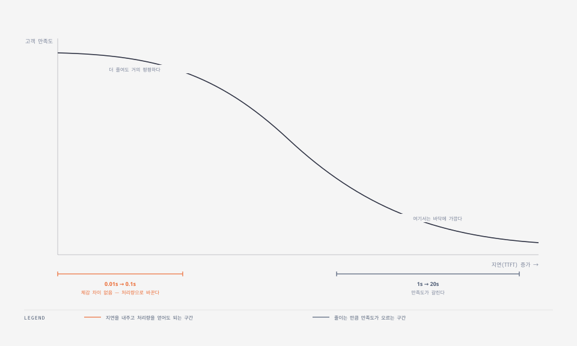

0.1초를 0.01초로 줄여봐야 사람은 그 차이를 느끼지 못한다. 곡선이 평평해지는 구간에서는 **지연을 조금 내주고 처리량을 얻는 편이 낫다.** 0.01초를 0.1초로 되돌리는 대신 동시 처리량을 올리면 비용 효율이 좋아진다.

품질도 경험의 일부다. 같은 계열에서는 대체로 **큰 모델이 더 나은 응답**을 낸다. 최적화 전에는 지연 요구 때문에 8B에 묶여 있었더라도, 서빙을 충분히 다듬으면 **같은 하드웨어·같은 지연으로 32B나 70B를 쓸 수 있다.**

## 비용 효율성

아무리 가치 있는 시스템이라도 **운영 비용이 감당되지 않으면 살아남지 못한다.** 그리고 AI 비용에서 가장 큰 몫은 학습이 아니라 **추론**이다.

의외로 들릴 수 있다. GPT-4 급 모델의 학습 비용이 5,000만 달러를 넘었다는 보도가 있으니 학습이 지배적일 것 같지만, 실제로는 추론 하드웨어 소비가 이미 학습을 넘어섰고 격차는 더 벌어지는 추세다.

이유는 비용의 성격이 다르기 때문이다.


|       | 학습                       | 추론                   |
| ----- | ------------------------ | -------------------- |
| 발생 시점 | 주로 **선불** (재학습·파인튜닝은 지속) | **사용량에 비례해 계속**      |
| 증가 요인 | 모델 개발 주기                 | **쿼리 수 · 사용자 수**     |
| 수행 주체 | 소수의 AI 랩                 | **LLM을 쓰는 거의 모든 기업** |


파운데이션 모델을 처음부터 학습하는 곳은 소수다. **대다수는 기존 모델을 파인튜닝하거나 RAG로 보강한다.** 반면 추론 수요는 멈추지 않는다.

AI 에이전트와 복잡한 워크플로가 늘면서 이 부담은 더 커진다. **워크플로 하나가 여러 LLM과 임베딩 모델을 호출**하기 때문에 호출 수가 곱으로 늘어난다. 서빙을 최적화하면 같은 하드웨어에서 같은 지연으로 **처리량이 늘어 더 많은 고객을 받는다.** 수평 확장 시 필요한 GPU 수가 줄어드니 비용이 직접 내려간다.

## 확장성, 피크 부하, 실현 가능성

프로덕션에 올리고 나면 **GPU 수요는 고객 증가를 따라 늘어난다.** 최적화는 여기서 세 번째 역할을 한다.

평소 트래픽이 안정적인 LLM 기반 영업 에이전트라도 **블랙프라이데이에는 수요가 400% 이상 뛴다.** 최적화가 덜 된 시스템은 이 급증을 감당하지 못해 지연이 무너지고 요청이 실패한다.

**피크를 견디는 능력은 튜닝과 부하 테스트로 만들어진다.** 평시 성능만 보고 배치하면 그 시점에 드러난다.

수급 문제도 있다. AWS·GCP·Azure를 쓰더라도 **고급 GPU가 모든 리전에 늘 있는 것은 아니다.** 최적화된 모델은 낮은 등급 칩에서도 돌아가므로, 특정 GPU에 묶이지 않는 것 자체가 새로운 시장으로 나갈 때 조건이 된다.

# LLM 서비스에서 가속기 칩의 역할

## GPU 사양 읽기

스펙 항목이 많아 보이지만 LLM 서빙에서 실제로 보는 것은 셋이다. **용량 · 대역폭 · 연산**이고 이 셋은 순차 통신이므로 하나만 정체되어도 병목이 될 수 있다.

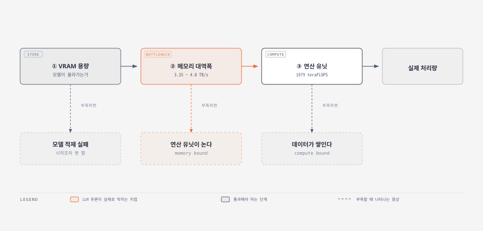

**LLM 추론은 대부분 ②에서 막힌다.** decode 단계는 토큰 하나를 만들 때마다 가중치 전체를 다시 읽어야 해서 연산량보다 메모리 이동량이 지배적이다. FLOPS가 아무리 높아도 대역폭이 못 따라오면 연산 유닛이 놀게 된다.

### 컴퓨팅  정밀도를 낮추면 두 배가 된다

teraFLOPS는 **정밀도별로 따로 표기된다.** 같은 칩이라도 어떤 자료형으로 계산하느냐에 따라 성능이 달라진다.


| 정밀도 (Tensor Core) | H100 SXM   | H100 NVL   |
| ----------------- | ---------- | ---------- |
| TF32              | 989        | 835        |
| BF16 / FP16       | **1,979**  | 1,671      |
| FP8               | **3,958**  | 3,341      |
| INT8              | 3,958 TOPS | 3,341 TOPS |


**FP8은 FP16의 정확히 두 배다.** 자료형 크기가 절반이라 같은 시간에 두 배를 처리한다. 양자화가 성능 최적화 수단이 되는 근거가 이 표에 그대로 있다.

### 메모리 — 용량과 대역폭은 다른 축이다

같은 H100인데 변형에 따라 강점이 갈린다.


|         | H100 SXM         | H100 NVL     |
| ------- | ---------------- | ------------ |
| FP16 연산 | **1,979 TFLOPS** | 1,671 TFLOPS |
| VRAM 용량 | 80 GB            | **94 GB**    |
| 메모리 대역폭 | 3.35 TB/s        | **3.9 TB/s** |


**SXM이 더 빠르지만 NVL이 더 많이 담고 더 빨리 나른다.** 연산이 앞서는 쪽과 메모리가 앞서는 쪽이 갈리므로 "무엇이 더 좋은가"에는 답이 없고, **워크로드가 어디서 막히는지**가 답을 정한다.

### 인터커넥트 (노드 안)

- 모델이 GPU 한 장에 안 들어가면 여러 장에 나누어 적재한다. 그때부터 **GPU끼리 얼마나 빨리 통신하는지가** 성능을 좌우한다. 같은 H100이라도 폼팩터와 NVLink 지원 여부로 세 가지로 나뉜다.


**① PCIe** 

- 가장 싸다. GPU 간 통신이 필요 없는 워크로드(작은 모델을 GPU마다 독립 실행)라면 이것으로 충분하다.

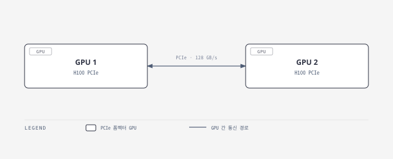

**② NVLink Bridge**

-  두 장을 600 GB/s로 묶는다. 다만 **묶이는 것은 딱 두 장뿐이라** 4장 구성에서 쌍을 넘으면 통신은 다시 PCIe로 해야한다.


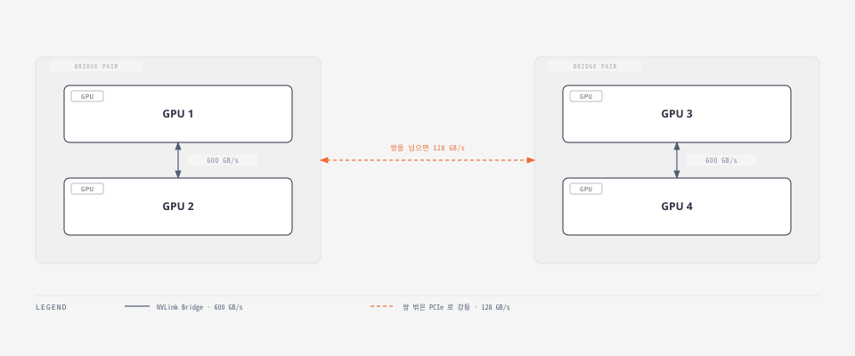

**③ NVLink + NVSwitch** 

- 한 노드에 최대 8장을 묶는다. 하지만 NVSwitch 없이 8장을 직접 연결하면 **각 GPU의 900 GB/s를 나머지 7장에게 나눠 써서 링크당 약 128 GB/s로 떨어진다.** NVSwitch를 사이에 넣어야 모든 쌍이 900 GB/s를 온전히 쓴다.

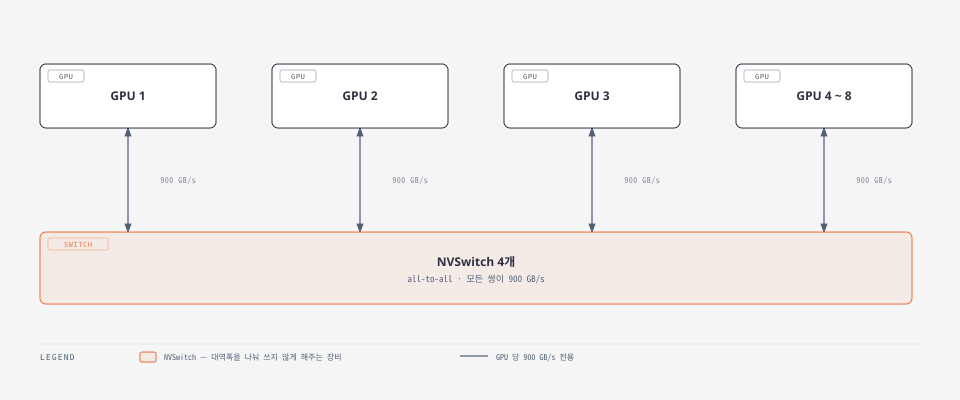

NVSwitch는 별도 장비이고 비싸다. GPU 간 통신이 그만큼 필요 없는 워크로드에는 과한 투자일 수 있다.

### 인터커넥트(노드 간)

- 한 노드에 담을 수 있는 GPU는 **보통 8장이 상한**이다. 전력·냉각·물리적 제약 때문이다. 그보다 큰 모델은 노드를 넘어 쪼개야 하는데 이때 대역폭이 급격히 떨어진다.

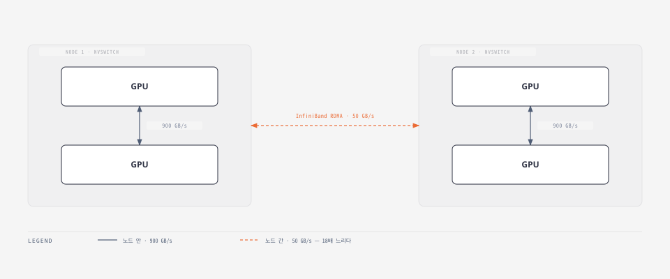

**노드를 넘는 순간 900 GB/s가 50 GB/s가 된다. 18배 차이다.**


| 구간                         | 대역폭         |
| -------------------------- | ----------- |
| 노드 안 · NVLink + NVSwitch   | 900 GB/s    |
| 노드 안 · NVLink Bridge       | 600 GB/s    |
| 노드 안 · PCIe                | 128 GB/s    |
| **노드 간 · InfiniBand RDMA** | **50 GB/s** |


그래서 실제 LLM 서빙은 **모델 replica 하나를 한 노드(GPU 1~8장) 안에 가두는 것**이 기본이다. 트래픽이 늘면 모델을 더 쪼개는 대신 **같은 구성의 replica를 옆으로 늘린다.** 노드 간 통신을 아예 만들지 않는 것이 목적이다.

### 전력

TDP(와트)는 눈에 잘 안 띄지만 배치 밀도를 정하는 제약이다. 다만 **누가 보느냐에 따라 중요도가 완전히 달라진다.**

- **클라우드 사용자** — 신경 쓸 필요가 없다. 인스턴스 타입을 고르면 전력은 가격에 이미 녹아 있다
- **클라우드 사업자 · 자체 데이터센터** — 랙당 몇 장을 꽂을 수 있는지를 전력과 냉각이 정한다. **와트당 성능**이 핵심 지표가 된다
- **엣지 · 온디바이스** — 전력이 시스템 전체를 규정한다. 모델 구조와 정밀도 선택까지 여기서 역산된다

### 모델 크기별 선택

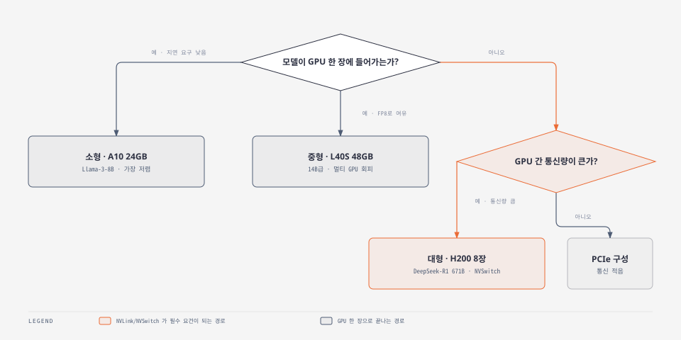


|                  | H200 SXM | H100 SXM | A100 SXM | L40S   | A10       |
| ---------------- | -------- | -------- | -------- | ------ | --------- |
| VRAM (GB)        | 141      | 80       | 80       | 48     | 24        |
| FP16/BF16 TFLOPS | 1,979    | 1,979    | 312      | 362    | 125       |
| 대역폭 (TB/s)       | 4.8      | 3.35     | 1.935    | 0.864  | 0.6       |
| FP8 지원           | O        | O        | **X**    | O      | **X**     |
| NVLink/NVSwitch  | O        | O        | O        | **X**  | **X**     |
| 시간당 비용(GPU당)     | ~$6.3    | ~$6.2    | ~$2.7    | ~$2.25 | &lt;$1.25 |


**A100은 FP8을 지원하지 않는다.** 세대가 앞선 칩이라도 정밀도 지원 여부가 갈리므로　FLOPS만 보고 고르면 양자화 이점을 놓칠 수 있다.

칩 세대는 빠르게 바뀌지만 **판단 기준 자체는 바뀌지 그대로임.**

- 모델이 올라가는가(용량) → 데이터를 제때 나르는가(대역폭) → 여러 장을 묶어야 하는가(인터커넥트) 순


## LLM 모델 로딩 시의 병목 현상

### 모델 로딩 프로세스

서빙의 첫 단계는 가중치를 GPU 메모리에 올려 캐시하는 것이다. 디스크에서 읽어 CPU 메모리를 거쳐 GPU 메모리로 옮겨지고, **한 번 올라간 뒤에는 그대로 상주한다.**

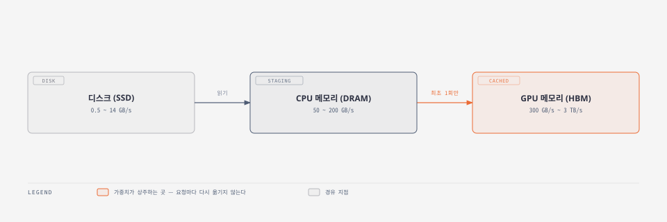


"CPU 메모리가 더 크니 거기 두고 필요할 때 가져오면 되지 않나"라는 의문이 들지만 결론 적으로 **문제는 대역폭에 있다.**


| 계층          | 대역폭                   |
| ----------- | --------------------- |
| 디스크(SSD)    | 0.5 ~ 14 GB/s         |
| CPU 메모리     | 50 ~ 200 GB/s         |
| **GPU 메모리** | **300 GB/s ~ 3 TB/s** |


CPU 메모리는 용량과 범용 접근에 맞춘 **DRAM**이고 GPU 메모리는 대규모 병렬 이동에 맞춘 **HBM**이다.

가중치가 CPU 메모리에 있으면 연산할 때마다 GPU로 옮겨야 하고 **그때마다 실시간 응답을 불가능해진다.**  그래서 GPU 메모리가 모델을 담을 만큼 커야 한다.

### 모델 크기 추정

필요한 GPU 메모리는 변수 두 개로 정해진다. **파라미터 수**와 **정밀도**다. 파라미터 수는 보통 이름에 있다. `Llama-2-7b`는 약 70억 개라는 뜻이다. 정밀도는 Hugging Face 저장소의 `config.json`에서 `torch_dtype`으로 확인한다.

```json
{
  "_name_or_path": "meta-llama/Llama-2-7b-chat-hf",
  "hidden_size": 4096,
  "num_attention_heads": 32,
  "num_hidden_layers": 32,
  "num_key_value_heads": 32,
  "torch_dtype": "float16",
  "vocab_size": 32000
}
```


| 정밀도                  | 비트  | 파라미터당 바이트 |
| -------------------- | --- | --------- |
| FP32 (single)        | 32  | 4         |
| FP16 / BF16 (half)   | 16  | **2**     |
| INT8 / FP8 (quarter) | 8   | 1         |


정밀도를 낮추면 정확도를 조금 내주는 대신 모델이 작아지고 서빙이 빨라진다. 앞 절의 FP8이 FP16의 두 배였던 것과 같은 트레이드오프다.

```bash
# Llama-2-7b, BF16 기준
70억 파라미터 × 2 바이트 = 140억 바이트 ≈ 14 GB
```

저장소의 실제 파일 크기를 합치면 약 13GB로, 추정치와 맞는다.

### KV 캐시 크기 추정

**14GB 모델이니 16GB GPU면 되겠다는 계산이므로 서빙은 가능** 하고 짧은 단일 요청도 처리된다. 하지만 이러한 구성은 별로 유용하지 않다.

[1주차에서 다룬 KV 캐시](../llm-series-all-in-one/#5부-prefill-decode-kv-cache)가 GPU 메모리를 함께 쓰기 때문이다. 남는 공간이 거의 없으면 **배치 크기와 컨텍스트 길이가 그만큼 묶여버린다.**

토큰 하나당 KV 캐시 크기는 이렇게 구한다.

```bash
KV 캐시/토큰 = 2 × 레이어 수 × 어텐션 헤드 수 × 헤드 차원 × 정밀도 바이트
```

Llama-2-7b는 레이어 32, 헤드 32, 헤드 차원 128(= 4096 ÷ 32)이고 half precision이므로 2바이트다.

```bash
2 × 32 × 32 × 128 × 2 = 524,288 바이트 = 0.5 MB / 토큰
```

캐시할 토큰 수는 **최대 배치 크기 × 최대 시퀀스 길이**다. 긴 문단을 요약하는 용도로 시퀀스 4,096, 배치 16을 잡으면 이렇게 된다.

```bash
0.5 MB × 4,096 토큰 × 16 요청 = 32 GB
```

**모델(14GB)보다 KV 캐시(32GB)가 더 크다.** GPU를 고를 때 모델 크기만 보면 안 되는 이유다.

참고로 이 계산은 Llama-2-7b가 쓰는 기본형 **MHA(multi-head attention)** 기준이다. MQA·GQA·MLA처럼 KV를 줄이는 구조를 쓰면 결과가 크게 달라진다.

### 남는 공간이 배치 크기를 정한다

총 GPU 메모리에서 모델 14GB를 빼면 KV 캐시에 쓸 수 있는 양이 나오고, 그 양이 곧 **동시에 처리 가능한 요청 수**가 된다.

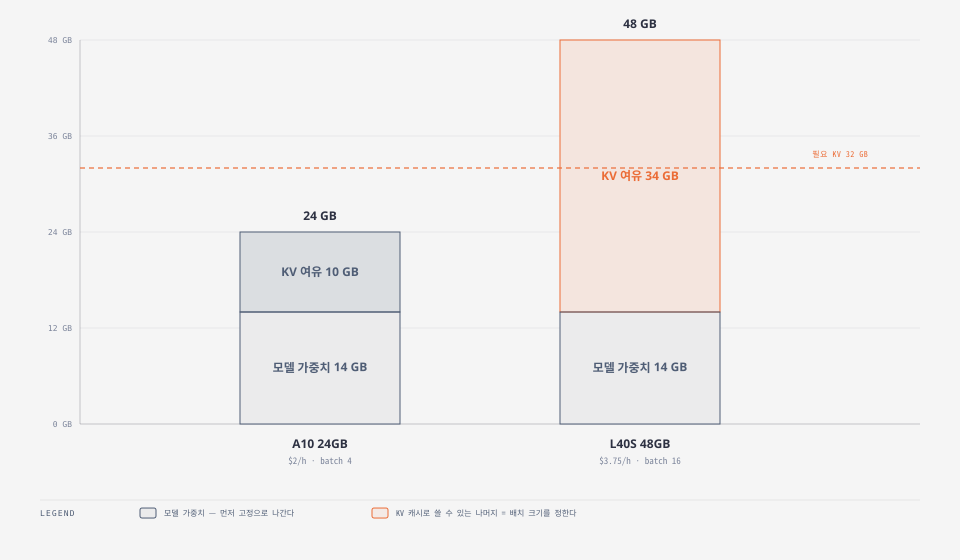


| GPU       | 모델 적재 후 여유 | 최대 배치  | 시간당 비용 |
| --------- | ---------- | ------ | ------ |
| A10 24GB  | 10 GB      | **4**  | $2     |
| L40S 48GB | 34 GB      | **16** | $3.75  |


**비용은 1.9배인데 처리량은 4배다.** L40S가 더 비싸지만 요청당 비용으로는 더 싸진다. 앞 절에서 "중형 모델에 L40S"라고 했던 판단의 근거가 이 계산이다.

계산식의 몫보다 실제 배치가 작은 것(5 → 4, 17 → 16)은 **activation** 때문이다. 중간 단계에서 생기는 텐서 몫을 남겨둬야 해서 이론상 최대치는 못 쓴다.

### 실행 중에는 계속 늘어난다

KV 캐시는 로딩 시점에 고정되는 값이 아니다. **생성이 진행될수록 토큰이 쌓이면서 함께 커진다.** 그래서 확인해야 할 지점은 유휴 상태가 아니라 **생성이 끝나는 순간의 최대 사용량**이다. 그 지점을 넘기지 못하면 OOM으로 떨어진다.

**경험상 모델 크기의 약 2배다.** 14GB 모델이면 28GB 이상을 목표로 잡아야 병렬성이 살고 GPU 성능이 나온다. prefix caching처럼 TTFT를 줄이는 기법은 공간을 더 요구하므로, 여유는 이 기준보다 넉넉한 편이 낫다.

## LLM 모델 실행 시의 병목 현상

모델은 이미 GPU 메모리에 다 올라가 있다. 이제 방 안의 코끼리를 꺼낼 차례다. **서빙을 붙잡는 것은 연산인가, 메모리 대역폭인가.**

### 연산 강도

둘 중 무엇이 병목인지는 **연산 강도(arithmetic intensity)** 하나로 판별한다. 연산량을 데이터 이동량으로 나눈 값이고 단위는 FLOPS/B다.

```bash
연산 강도 = 연산 횟수(FLOPS) ÷ 데이터 이동량(byte)
```

데이터는 많이 읽는데 계산은 적으면 값이 낮고 적게 읽어 많이 계산하면 높다. **낮으면 대역폭에 높으면 연산에 묶인다.**

### 실행 중 데이터는 어디서 오는가

여기서 말하는 데이터 이동은 **로딩과 다르다.** 가중치는 이미 GPU 메모리에 있고 실행 중에는 그 안에서 연산 유닛까지 계속 끌어와야 한다.

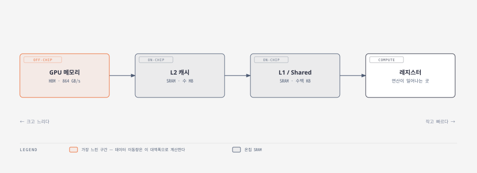

온칩 메모리인 L2·L1·shared memory는 **SRAM**이다. 연산 유닛 바로 옆에 붙어 있어 훨씬 빠르지만 작고 비싸다. 오프칩 **HBM**은 반대로 느린 대신 크다.

**이 경로에서 가장 느린 구간이 GPU 메모리다.** 그래서 데이터 이동량을 계산할 때는 HBM 대역폭을 기준으로 쓴다.

### 루프라인(칩의 손익분기점)

칩 스펙만으로 그 칩의 이론적 연산 강도를 구할 수 있다. L40S는 FP16 Tensor Core 362 TFLOPS에 메모리 대역폭 864 GB/s다.

```bash
362 TFLOPS ÷ 864 GB/s
  = (362 × 10¹²  FLOPS) ÷ (864 × 10⁹  B)
  ≈ 419 FLOPS/B
```

이 값을 기준으로 **루프라인**을 그리면 워크로드가 어디에 묶이는지 눈으로 확인된다.

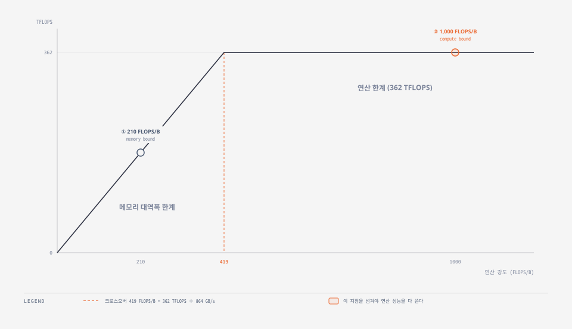

**419보다 낮으면 362 TFLOPS를 다 못 쓴다.** 연산 강도 210짜리 워크로드(①)는 연산 유닛이 남아도는데 데이터를 그만큼 못 넣어서 대역폭에 묶인다. 1,000짜리(②)는 이미 최대 연산에 도달해 데이터를 더 빨리 넣어도 소용이 없다.

### 행렬 곱의 연산 강도

Transformer 블록의 self-attention과 feedforward는 **대부분이 행렬 곱**이다. element-wise나 reduction 연산도 있지만 전체에서 차지하는 비중이 작다.

`[M, K] × [K, N] → [M, N]` 곱을 기준으로 분자와 분모를 각각 구한다.

```bash
연산 횟수  = 2 × M × N × K            # 곱셈 MNK + 덧셈 MN(K-1)
데이터 이동 = 2 × (M×K + K×N + M×N)   # 입력·가중치·출력, half precision 2바이트

연산 강도  = (M×N×K) ÷ (M×K + K×N + M×N)
```

M = N = K로 두고 크기만 바꿔 보면 경향이 분명하다.


| 행렬 크기 (M=N=K) | 연산 강도     | L40S 기준 판정 |
| ------------- | --------- | ---------- |
| 64            | 21        | 대역폭에 묶임    |
| 512           | 170       | 대역폭에 묶임    |
| **4,096**     | **1,365** | **연산에 묶임** |


**행렬이 충분히 크면 연산에 묶인다.** 그러면 남은 질문은 하나다. LLM 서빙의 행렬은 충분히 큰가.

### prefill 과 decode — 같은 모델, 다른 판정

입력 텐서의 모양은 `[배치 크기, 시퀀스 길이, 히든 차원]`이다. 배치가 1이면 차원이 하나 줄어 `[s, h]` 행렬이 된다.

두 단계는 이 `s`가 결정적으로 다르다. **prefill은 프롬프트 토큰을 한꺼번에 처리하지만, decode는 토큰을 하나씩 만든다.**

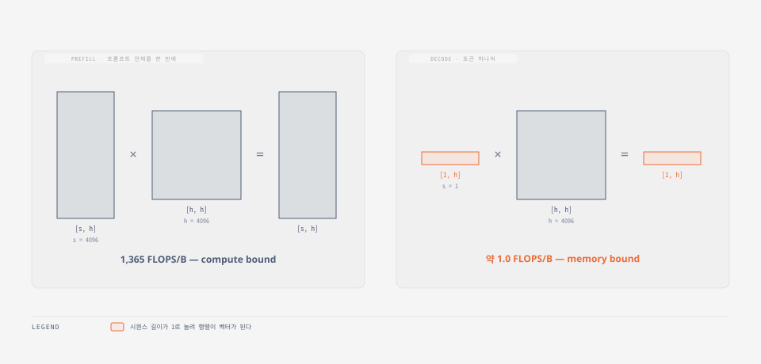

앞의 공식에 `M = s`, `K = N = h`를 넣으면 이렇게 된다.

```bash
연산 강도 = (s × h × h) ÷ (s×h + s×h + h×h)
```


| 시퀀스 길이 | 히든 차원 | prefill      | decode    | L40S 기준 판정                   |
| ------ | ----- | ------------ | --------- | ---------------------------- |
| 64     | 4,096 | 62.06        | 약 1.0     | 둘 다 대역폭에 묶임                  |
| 512    | 4,096 | 409.60       | 약 1.0     | 둘 다 대역폭에 묶임                  |
| 4,096  | 4,096 | **1,365.33** | **약 1.0** | prefill은 연산, **decode는 대역폭** |


**prefill은 시퀀스가 길어지면 연산에 묶이지만, decode는 아무리 길어져도 약 1.0에서 벗어나지 못한다.** 토큰을 하나씩 만드는 구조상 `s`가 1로 눌려 행렬이 사실상 벡터가 되기 때문이다.

[vLLM 실습](../llm-vllm-lab/)에서 단일 요청 속도가 1.1배밖에 안 나왔던 이유가 여기 있다. decode는 구조적으로 대역폭에 묶여 있어서, 엔진을 바꿔도 토큰 하나를 만드는 속도는 크게 달라지지 않는다.

### 최적화 방향

- **연산에 묶였다면** — 계산을 줄인다. 연산 최적화, FLOPS 절감
- **대역폭에 묶였다면** — 불필요한 데이터 이동을 줄인다

연산 강도는 시퀀스 길이뿐 아니라 **배치 크기에도 좌우된다.** 앞 절에서 KV 캐시 여유가 배치 크기를 정한다고 했는데 그 배치 크기가 다시 연산 강도를 밀어 올린다. 메모리 예산과 연산 병목이 한 고리로 이어지는 지점이다.

## 다른 AI 가속기와 흐름

여기까지는 NVIDIA GPU만 봤지만, **모델이 올라가고 실행되는 원리는 다른 칩에서도 같다.**

### 경쟁 칩


| 분류      | 예시                                               |
| ------- | ------------------------------------------------ |
| GPU 대안  | AMD MI300X, Intel Gaudi2                         |
| 클라우드 전용 | Google TPU, AWS Inferentia                       |
| 지역 시장   | Huawei Ascend NPU                                |
| 스타트업    | Groq, Cerebras, Untether AI, SambaNova, d-Matrix |


2026년 초 기준으로는 여전히 NVIDIA의 GPGPU가 시장을 지배하는 이유는 아래와 같다. 


- **추론 전용 칩은 구조가 단순하고 저렴하고 전력 효율이 좋지만** 빠르게 바뀌는 모델 구조를 따라가기 어렵다. 
  - 행렬 곱이나 Transformer에 맞춰 특화할수록 그렇다.
- **소프트웨어 성숙도 차이**
  - **** CUDA는 학습과 추론 양쪽에서 널리 쓰이는데, 다른 칩은 ROCm·JAX·Neuron처럼 각자의 스택을 요구한다. 커뮤니티 지원도 얇아 전환 비용이 만만치 않다.
- **온칩 SRAM**
  - **기반 설계는 지연이 뛰어나지만** SRAM이 비싸고 모델 하나를 서빙하는 데 칩이 여러 장 필요해 비용 효율이 잘 안 나온다.
- **유연성** 
  - **** FP8·FP4 같은 정밀도 지원, 높은 메모리 대역폭, 앞 절에서 본 인터커넥트가 모두 여기에 들어간다.

