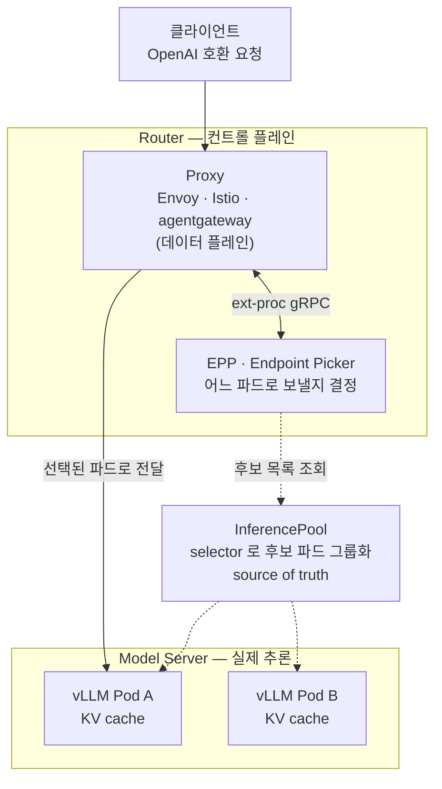
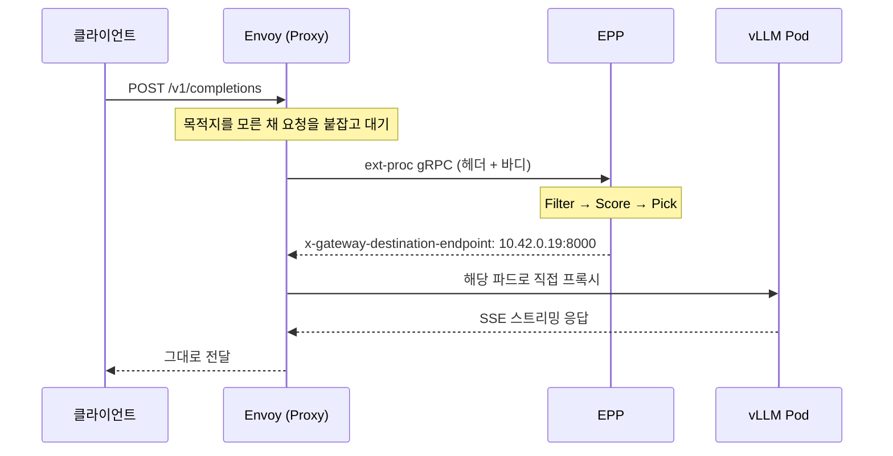
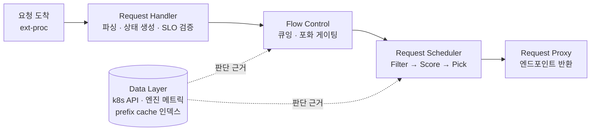
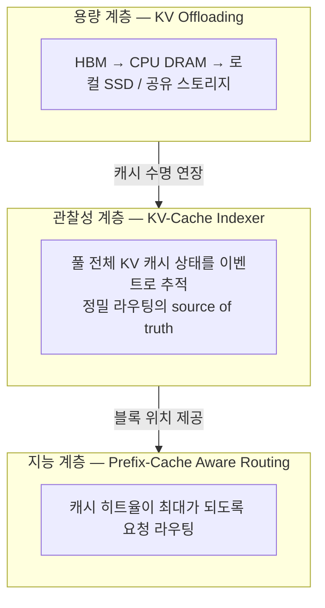
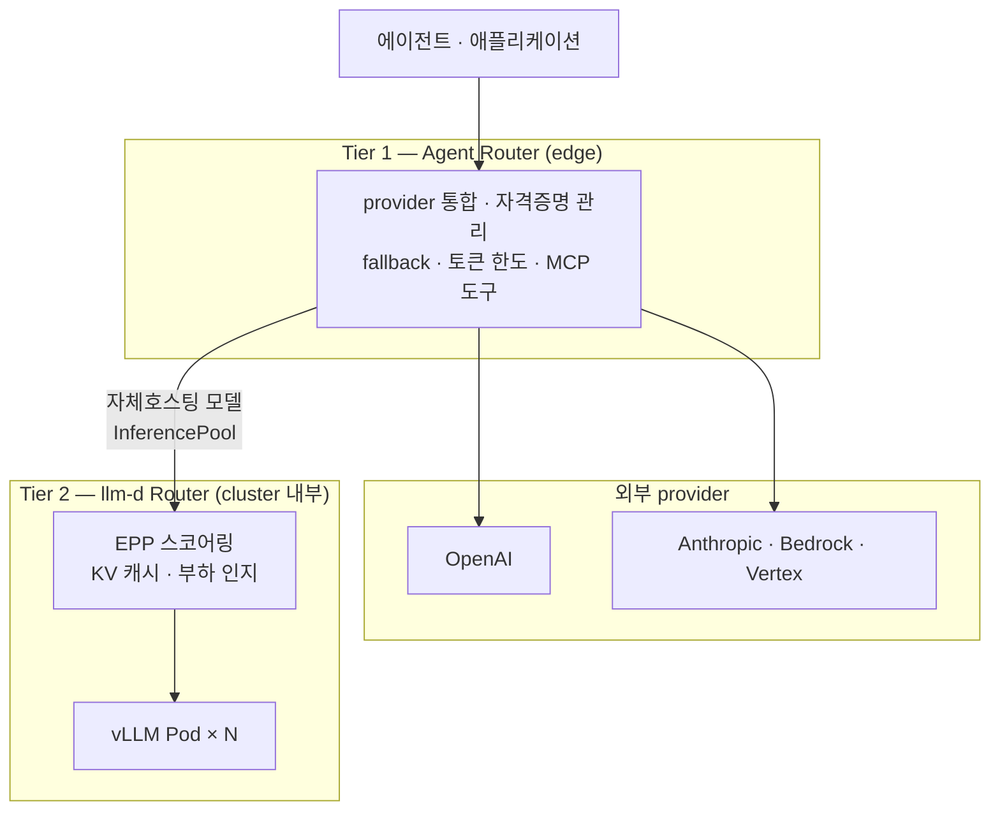

성능관점에서 vLLM 파드 중 **"어느 파드로 보낼 것인가"** 가는 중요한 요소이다. llm-d는 이를 해결 하는  Kubernetes 네이티브 추론 서빙 스택이다. 

CNCF 샌드박스 프로젝트이며, vLLM이나 SGLang 같은 엔진을 래핑하여 확장한다. 이 글은 llm-d 공식 문서를 읽고 구조를 정리한 개념편이다. 

## 1. 왜 일반 로드밸런서로는 부족한가

Kubernetes Service는 L4 로드밸런서다. kube-proxy는 **TCP 연결 단위**로 목적지를 무작위 배정하고, 그 뒤로는 keep-alive 때문에 같은 파드에 고착된다.

일반 요청이라면 문제가 없다. 하지만 LLM 추론은 두 가지 이유로 다르다.

- 첫째 **요청마다 비용이 극단적으로 다르다.** 프롬프트 8토큰짜리와 8,000토큰짜리가 같은 큐에 섞인다. 
- 둘째 **파드마다 들고 있는 상태가 다르다.** 직전에 처리한 프롬프트의 KV 캐시를 가진 파드로 보내면 prefill을 통째로 건너뛴다.

L4 로드밸런서는 이 둘을 전혀 모른다. 어느 파드가 바쁜지도, 어느 파드가 내 프롬프트의 앞부분을 캐시하고 있는지도 보지 않는다. **llm-d Router는 매 요청마다 이 판단을 다시 한다.**

## 2. 3계층 구조

llm-d는 세 개의 코어 컴포넌트로 이루어진다.




역할 분담


| 컴포넌트              | 질문          | 담당                           |
| ----------------- | ----------- | ---------------------------- |
| **InferencePool** | 누가 후보인가     | 라벨 셀렉터 기반 파드 디스커버리           |
| **Router (EPP)**  | 그중 누구를 고르는가 | 실시간 스코어링                     |
| **Model Server**  | 실제 추론       | vLLM · SGLang · TensorRT-LLM |


## 3. Router — Proxy와 EPP를 분리한 이유

llm-d Router는 단일 컴포넌트가 아니다. **Proxy와 EPP로 나뉜다.**

Proxy는 검증된 L7 프록시를 그대로 쓴다. TLS 종료, 커넥션 관리, 실제 트래픽 전달을 맡는다. EPP는 라우팅 "지능"만 담당하는 별도 서비스로 **어디로 보낼지 결정만 하고 트래픽은 건드리지 않는다.**

이렇게 나누면 프록시 구현체를 갈아끼울 수 있다. 공식 지원 목록은 Envoy Gateway, Istio, agentgateway, GKE Gateway, Envoy AI Gateway다.

### 요청 한 건이 지나가는 경로



이때 Proxy는 요청을 받아놓고 **어느 파드에도 보내지 않은 채 대기**한다. 보낼 곳을 아직 모르기 때문이다. EPP가 엔드포인트를 헤더로 돌려주면 그제서야 전달한다.

### ORIGINAL_DST — 구조적으로 고착이 불가능한 이유

Envoy 쪽 설정에서 핵심은 두 군데다. 하나는 `ext_proc` 필터, 다른 하나는 `ORIGINAL_DST` 클러스터다.

```yaml {title="envoy.yaml (발췌)"}
http_filters:
  - name: envoy.filters.http.ext_proc
    typed_config:
      "@type": type.googleapis.com/envoy.extensions.filters.http.ext_proc.v3.ExternalProcessor
      grpc_service:
        envoy_grpc:
          cluster_name: ext_proc
      processing_mode:
        request_body_mode: FULL_DUPLEX_STREAMED
        response_body_mode: FULL_DUPLEX_STREAMED
      message_timeout: 1000s

clusters:
  - name: original_destination_cluster
    type: ORIGINAL_DST
    lb_policy: CLUSTER_PROVIDED
    original_dst_lb_config:
      use_http_header: true
      http_header_name: x-gateway-destination-endpoint
```

`ORIGINAL_DST`는 **고정된 엔드포인트 목록이 없는 특수 클러스터**다. EPP가 헤더에 심어준 `<파드IP>:<포트>` 값으로 매번 새로 연결한다.

즉 로드밸런싱 결정이 Envoy의 표준 알고리즘이 아니라 **EPP에게 100% 위임**된다. 요청마다 헤더로 목적지를 새로 지정하므로, kube-proxy에서 겪는 "연결 단위 배정 후 keep-alive 고착" 문제가 구조적으로 발생할 수 없다.

`FULL_DUPLEX_STREAMED`도 중요하다. 버퍼링 없이 스트리밍 중에도 양방향으로 전달하므로, vLLM의 SSE 응답을 토큰 단위로 통과시키면서 EPP가 관찰할 수 있다.

## 4. InferencePool — 후보 목록의 source of truth

InferencePool은 "Router - EPP - 모델 서버" 사이를 연결하는 중앙 리소스다. 파드가 스케일 인/아웃되거나 Ready 상태가 바뀌면 후보 목록을 자동 갱신한다.

```yaml {title="inferencepool.yaml"}
apiVersion: inference.networking.k8s.io/v1
kind: InferencePool
spec:
  selector:
    matchLabels:
      app: qwen3-0-6b-fp8      # 후보 파드를 고르는 기준
  targetPorts:
    - number: 8000             # 추론 트래픽이 나가는 포트
  endpointPickerRef:
    kind: Service
    name: qwen3-router-epp     # 이 풀의 판단을 맡을 EPP
    port:
      number: 9002
    failureMode: FailOpen      # EPP 장애 시 기본 LB 로 폴백
```

`failureMode: FailOpen`이 안전장치다. EPP가 죽으면 라우팅을 차단(`FailClose`)하는 대신 **기본 로드밸런싱으로 폴백**한다. 라우팅 지능의 장애가 곧바로 서비스 전체 장애로 번지지 않는다.

파드·EPP 서비스·InferencePool 간 참조는 **같은 네임스페이스 내로 엄격히 제한**된다. 멀티테넌트 환경의 경계를 분명히 하기 위함이다.

보통 InferencePool 1개 = 모델의 논리적 배포 1개 = EPP 배포 1개로 둔다. Prefill/Decode를 분리하거나 모델 버전을 나눌 때는 InferencePool을 각각 만들어 독립적으로 스케일링한다.

## 5. EPP — llm-d 배포의 두뇌

EPP는 "이 요청을 어느 파드로 보낼까"를 결정하는 **유일한 컴포넌트**다. 내부는 4개 단계로 나뉜다.



Data Layer는 파이프라인 바깥에서 **백그라운드로 상태를 수집**한다. 판단은 Flow Control과 Request Scheduler가 내린다.

### 5-1. Request Handler — 요청의 생명주기 관리자

요청이 들어와서 스케줄링되기 전까지, 그리고 응답이 스트리밍되는 동안의 파싱과 추적을 전담한다.


| 컴포넌트             | 역할               | 기본 플러그인                                                                                                      |
| ---------------- | ---------------- | ------------------------------------------------------------------------------------------------------------ |
| **Parser**       | 원시 요청 → 내부 구조 변환 | `openai-parser`, `vllmgrpc-parser`, `passthrough-parser`                                                     |
| **DataProducer** | 스케줄링용 상태 생성      | `predicted-latency-producer`(XGBoost TTFT/TPOT 예측), `inflight-load-producer`, `approx-prefix-cache-producer` |
| **Admitter**     | SLO 충족 여부 판단     | `latency-slo-admitter`                                                                                       |


`passthrough-parser`는 바디를 해석하지 않는다. 요청 형식을 모르거나 지원하지 않을 때 쓰며, **페이로드 기반 스코어링은 포기**하고 백엔드 상태만으로 라우팅한다.

### 5-2. Flow Control — 모델 서버를 지키는 중앙 큐

일반적인 RPS 기반 제한과 다르다. LLM 서빙 특유의 비선형적 리소스 소비를 고려해 설계됐다.

해결하려는 문제가 명확하다. 큰 프롬프트를 던지는 테넌트가 KV 캐시를 독점하는 **noisy neighbor**, 일단 디스패치하면 되돌릴 수 없는 **스케줄링 후회**, 낮은 우선순위 배치 작업이 중요 요청을 막는 **우선순위 역전**이다.

디스패치는 3계층으로 이루어진다. `FlowKey = FairnessID + Priority`가 키다.


| 계층                     | 역할          | 제어                                                                            |
| ---------------------- | ----------- | ----------------------------------------------------------------------------- |
| Tier 1 · Priority Band | 최우선 대역 선택   | 고정                                                                            |
| Tier 2 · Fairness      | 대역 내 테넌트 선택 | `round-robin-fairness-policy`, `global-strict-fairness-policy`                |
| Tier 3 · Ordering      | 플로우 내 요청 순서 | `fcfs-ordering-policy`, `edf-ordering-policy`, `slo-deadline-ordering-policy` |


우선순위는 헤더로 지정한다. **음수 우선순위는 "생략 가능(sheddable)" 요청**을 뜻하고, 헤더가 없으면 0으로 폴백한다.

```bash {title="우선순위 지정 요청"}
curl -X POST http://${IP}:${PORT}/v1/completions \
  -H 'Content-Type: application/json' \
  -H 'x-llm-d-inference-fairness-id: tenant-a' \
  -H 'x-llm-d-inference-objective: premium-traffic' \
  -d '{"model": "default-model", "prompt": "Say hello"}'
```

포화도 감지는 게이트키퍼 역할을 한다. `utilization-detector`는 실시간 텔레메트리 기반 폐루프로 정확하지만 지연이 있고, `concurrency-detector`는 활성 요청 카운팅 기반 개루프로 즉각적이지만 실제 메모리 압력은 모른다.

Flow Control이 꺼져 있으면 포화 시 **음수 우선순위 요청만 즉시 429로 거부**한다. 켜져 있으면 중앙 큐에 버퍼링한다.


| 상태                                    | HTTP | 의미           |
| ------------------------------------- | ---- | ------------ |
| `QueueOutcomeRejectedCapacity`        | 429  | 큐 용량 초과      |
| `QueueOutcomeEvictedTTL`              | 503  | TTL 만료       |
| `QueueOutcomeEvictedContextCancelled` | 503  | 클라이언트 연결 끊김  |
| graceful drain                        | 503  | 종료 중, 재시도 권장 |


### 5-3. Request Scheduler — Filter → Score → Pick

Flow Control을 통과한 요청에 대해 실제로 파드를 확정하는 마지막 단계다.

**Filter**는 부적절한 후보를 제거한다. `prefix-cache-affinity-filter`(캐시 점수 높은 sticky 엔드포인트 우선), `slo-headroom-tier-filter`, `label-selector-filter`, P/D 분리용 `prefill-endpoints-filter`/`decode-endpoints-filter`가 있다.

**Score**는 남은 후보에 0.0~1.0 점수를 매긴다.


| 스코어러                          | 스코어링 근거                      |
| ----------------------------- | ---------------------------- |
| `kv-cache-utilization-scorer` | KV 캐시 사용률이 낮을수록 고점           |
| `prefix-scorer`               | 프리픽스 캐시 일치 길이                |
| `queue-depth-scorer`          | 대기열이 짧을수록 고점                 |
| `latency-scorer`              | 예측 지연시간과 SLO 간 여유            |
| `lora-affinity-scorer`        | 요청 LoRA 어댑터가 이미 로드된 엔드포인트 선호 |
| `session-affinity-scorer`     | 같은 세션을 처리했던 엔드포인트 최고점        |
| `no-hit-lru-scorer`           | 캐시 미스 요청을 아직 안 받은 엔드포인트에 우선권 |


점수는 **가중치를 곱해 합산**한다. Scorer A(가중치 2.0)가 0.8, Scorer B(가중치 1.0)가 0.5라면 최종 점수는 `0.8×2.0 + 0.5×1.0 = 2.1`이다.

**Pick**은 최종 1개를 고른다. 기본값은 `max-score-picker`이고, `random-picker`와 점수를 확률로 쓰는 `weighted-random-picker`가 있다.

```yaml {title="scheduler 설정 예시"}
scheduler:
  profileHandler:
    type: single-profile-handler
    primaryProfile:
      filters:
        - type: prefix-cache-affinity-filter
          stickinessThreshold: 0.7
      scorers:
        - {name: kv-cache-scorer, weight: 2.0}
        - {name: latency-scorer, weight: 1.5}
        - {name: queue-depth-scorer, weight: 1.0}
      picker:
        type: max-score-picker
        maxNumOfEndpoints: 1
```

Prefill/Decode를 분리한 경우 `disagg-profile-handler`가 프로필 2개를 각각 실행한다. **최종적으로 decode 엔드포인트가 프록시의 실제 목적지**가 되고, prefill 엔드포인트는 헤더로 주입되어 decode 워커의 사이드카가 원격 prefill을 조율한다.

### 5-4. Data Layer — 판단 근거를 준비하는 계층

각 엔드포인트마다 스레드세이프한 속성 맵을 유지하고, 수집한 값을 채워 넣는다. 소스는 세 종류다.


| 유형                     | 방식             | 수집 대상                                       |
| ---------------------- | -------------- | ------------------------------------------- |
| Polling Data Sources   | 설정된 주기로 폴링     | `KVCacheUsagePercent`, `WaitingQueueSize` 등 |
| Notification Sources   | k8s 리소스 변경 이벤트 | Pod/Service 변경                              |
| Endpoint Event Sources | 엔드포인트 생명주기 이벤트 | 파드 추가·삭제·업데이트                               |


`metrics-data-source`가 Prometheus 호환 메트릭을 파싱하고, `core-metrics-extractor`가 **엔진별 메트릭 이름을 표준 키로 변환**한다. vLLM과 SGLang의 메트릭 이름이 달라도 스코어러는 같은 키를 본다.

### 5-5. EndpointPickerConfig — 핫 리로드가 없다

지금까지 본 모든 플러그인을 YAML 하나로 정의한다. CRD처럼 생겼지만 **실제 CRD가 아니고, EPP 프로세스가 시작 시점에 한 번만 읽는 정적 설정 파일**이다.

설계는 그래프 기반이다. `plugins` 섹션에 정의된 인스턴스가 노드이고, `schedulingProfiles` 등에서 `pluginRef`로 참조하는 것이 엣지다. 같은 인스턴스를 여러 프로필에서 재사용할 수 있다.

```yaml {title="EndpointPickerConfig"}
apiVersion: llm-d.ai/v1alpha1
kind: EndpointPickerConfig
featureGates: [flowControl]
plugins:
  - type: round-robin-fairness-policy
  - type: fcfs-ordering-policy
  - type: concurrency-detector
    parameters: {maxConcurrency: 15, concurrencyMode: requests}
saturationDetector:
  pluginRef: concurrency-detector
flowControl:
  maxBytes: "10Gi"
  maxRequests: "1k"
  defaultRequestTTL: "60s"
  priorityBands:
    - priority: 100
      maxRequests: "500"
      fairnessPolicyRef: round-robin-fairness-policy
      orderingPolicyRef: fcfs-ordering-policy
```

아무것도 설정하지 않아도 합리적으로 동작한다. `schedulingProfiles`를 생략하면 모든 Filter·Scorer·Picker를 포함한 default 프로필이 자동 생성되고, Picker를 지정하지 않으면 `max-score-picker`가 주입된다.

**운영상 가장 중요한 제약은 핫 리로드가 없다는 점이다.** 설정은 컨트롤러가 reconcile하지 않는다. 시작 시 플러그인 그래프를 한 번 구성하고 끝이므로, **설정을 바꾸면 EPP 프로세스를 재시작해야 한다.**

검증도 시작 시점에만 이루어진다. 존재하지 않는 `pluginRef` 참조, 이름 중복, 프로필당 Picker 2개 이상, DataProducer 간 순환 의존성이 모두 초기화 에러로 잡힌다. 그래서 공식 문서는 **replicas &gt; 1 + leader 선출**로 HA를 구성해 롤링 재시작 시 무중단 전환을 권장한다.

## 6. KV Cache Management — llm-d의 핵심 가치

llm-d가 일반 게이트웨이와 갈라지는 지점이다. 목표는 중간 상태(KV 캐시)의 추적과 재사용이다. 구조는 3계층이다.



### 6-1. 근사 방식 vs 정밀 방식

Prefix-cache aware routing은 구현이 두 갈래다.

**근사(Approximate)** 방식은 `approx-prefix-cache-producer`를 쓴다. EPP에 토크나이저가 없으므로 문자-토큰 비율로 근사 계산하고, 프롬프트를 고정 크기 블록으로 나눠 롤링 해시 체인을 만든다. EPP가 "최근 어느 프리픽스를 어느 파드로 보냈는지"를 메모리 내 LRU 인덱스로 자체 관리한다.

문제는 **라우팅 후 "이 파드가 이제 이 프리픽스를 갖고 있다"고 가정하고 인덱스를 갱신**한다는 점이다. 실제 확인은 하지 않는다. 파드 메모리 압박으로 캐시가 제거돼도 EPP는 모른다.

**정밀(Precise)** 방식은 실제 상태를 본다.

1. 프롬프트를 vLLM의 `/v1/completions/render` 엔드포인트로 보내 **정확한 토큰 ID**를 얻는다
2. 모델 서버가 KV 캐시 변경 시 **ZeroMQ로 KVEvents를 실시간 방출**한다
3. KV-Cache Indexer가 이 이벤트를 구독해 각 파드의 토큰 블록 위치를 전역 추적한다
4. 각 후보의 실제 프리픽스 보유 현황으로 스코어링한다

대가는 의존성이다. vLLM render 엔드포인트와 ZMQ 연결이 필요하고, 모델 서버가 KV 이벤트 방출을 지원해야 한다. **가볍게 시작하려면 근사, 정확도와 규모가 중요하면 정밀**이 선택 기준이다.

### 6-2. KV-Cache Indexer — 가장 긴 연속 prefix

Indexer는 Index, Data Producer, Scorer 세 요소로 구성된다. 모델 서버는 ZMQ로 `BlockStored`(새 블록 생성), `BlockRemoved`(축출), `AllBlocksCleared`(캐시 초기화) 세 가지 이벤트를 발행한다.

스코어링 규칙이 직관적이다. **KV 캐시 블록은 의존성 체인을 형성하므로, 서버는 끊기지 않은 prefix만 재사용할 수 있다.**


| 파드가 가진 블록          | 점수  | 이유          |
| ------------------ | --- | ----------- |
| B0, B1, B2, B3     | 4   | 연속 4블록      |
| B0, B1, ~~B2~~, B3 | 2   | B2에서 체인이 끊김 |


블록은 티어에 따라 가중치가 붙는다(GPU 1.0, CPU 0.8). 인덱스 저장 백엔드는 In-Memory가 기본이고, 가변 엔트리 크기에는 Cost-Aware Memory, 영속 상태가 필요하면 Redis/Valkey를 쓴다.

**추측적 인덱싱(speculative indexing)** 은 시간 차를 메우는 장치다. 라우팅 결정 시점과 실제 KVEvent 도착 사이에는 "암흑 시간"이 있다. `speculativeIndexing: true`를 켜면 라우팅 직후 추정 엔트리를 기본 TTL 2초로 즉시 삽입해, 확인 이벤트가 오기 전에도 연속 요청이 어피니티를 유지한다.

### 6-3. KV Offloading — HBM 바깥으로

GPU HBM 용량 한계와 인스턴스별 캐시 고립 문제를 동시에 푼다. 통합 방식은 두 갈래다.

**네이티브**는 vLLM에 내장된 `OffloadingConnector`를 쓴다. `--kv-offloading-backend native --kv-offloading-size <GB>`로 활성화하고, 블록을 CPU 계층이나 공유 스토리지로 디스패치한다.

**Out-of-tree 커넥터**는 LMCache, Mooncake, NVIDIA KVBM 같은 서드파티 엔진을 표준 KV-cache 커넥터 API로 붙인다. 캐시 로직이 별도 프로세스에 있어서 여러 vLLM 인스턴스가 캐시를 공유할 수 있다.

CPU offloading은 GPU DMA 비동기 전송에 고정(pinned) 메모리를 쓴다. vLLM 0.12.0부터 연속 메모리 레이아웃을 지원해 **처리량이 4~5배 오른다.** 공식 가이드는 **CPU DRAM이 GPU HBM보다 크면 항상 켜라**고 권한다.

## 7. Model Server가 지켜야 할 계약

Model Server는 llm-d 스택의 최하위 계층이다. 중요한 점은 **나머지 부분과 완전히 독립적으로 배포**되고, 라벨 셀렉터로 InferencePool에 자동 등록된다는 것이다.

EPP가 판단하려면 모델 서버가 메트릭을 내줘야 한다.


| 메트릭                    | 타입    | 의미               |
| ---------------------- | ----- | ---------------- |
| `TotalQueuedRequests`  | Gauge | 대기 중 요청 수        |
| `TotalRunningRequests` | Gauge | 활성 처리 중 요청 수     |
| `KVCacheUtilization`   | Gauge | KV 캐시 사용률(%)     |
| `BlockSize` (선택)       | Gauge | 토큰 단위 블록 크기      |
| `NumGPUBlocks` (선택)    | Gauge | HBM KV 캐시 총 블록 수 |


엔진마다 실제 이름은 다르다. vLLM은 `vllm:num_requests_waiting`, SGLang은 `sglang_num_queue_reqs`를 쓴다. 파드 라벨 `llm-d.ai/engine-type: vllm|sglang|trtllm-serve`로 엔진 종류를 명시하면 `core-metrics-extractor`가 표준 키로 변환한다.

`GET /health`가 liveness/readiness 겸용이며, **Ready 상태여야 InferencePool의 트래픽 대상이 된다.**

그리고 당연한 전제가 하나 있다. **모델 서버가 프리픽스 캐시 재사용을 지원해야 EPP의 prefix-cache-aware 라우팅이 의미가 있다.** vLLM의 `--enable-prefix-caching`이 대표적이다.

## 8. IPP — 라우팅 경로에 정책을 끼워 넣는 자리

Inference Payload Processor는 **라우팅 결정 전후로 페이로드를 검사·수정**하는 플러그형 프레임워크다. EPP가 풀 "내부"의 파드를 고르는 반면, IPP는 풀 레벨에서 **어떤 InferencePool이 처리할지**에 관여한다.

Envoy ext-proc 위에서 Plugin → Profile → Profile Picker 구조로 동작한다. 가드레일, 콘텐츠 필터링, 모델 인지 라우팅, 관측성이 주 용도다.

독립적인 Deployment로 배포되며 통합 방식은 게이트웨이 구현체를 탄다. Istio는 EnvoyFilter, GKE는 GCPRoutingExtension 리소스를 쓴다.

## 9. llm-d Router와 Agent Router는 경쟁하지 않는다

이름이 헷갈리기 쉽다. Envoy AI Gateway는 Agentic AI Foundation 소속 독립 프로젝트 **Agent Router**로 리브랜딩됐다. 둘은 **레이어가 다르다.**




|        | Agent Router                  | llm-d Router                             |
| ------ | ----------------------------- | ---------------------------------------- |
| 위치     | 앱 앞단 edge 게이트웨이               | 추론 클러스터 내부 스케줄러                          |
| 다루는 대상 | 16개 외부 provider 통합            | 같은 모델을 서빙하는 파드 집합                        |
| 판단 근거  | provider 가용성, 토큰 한도, 비용       | KV 캐시 적중률, 큐 깊이, GPU 부하                  |
| 대표 기능  | fallback, 모델명 가상화, 크리덴셜 중앙 관리 | prefix-cache aware routing, flow control |


**Agent Router가 앞단, llm-d Router가 그 뒤 vLLM 클러스터 내부**로 함께 쓸 수 있는 구조다. 실제로 Agent Router는 자체호스팅 모델에 대해 InferencePool을 지원하며, 여기서 두 프로젝트가 만난다.

## 10. 정리

llm-d의 설계는 몇 가지 결정으로 요약된다.

**결정과 전달을 분리했다.** Proxy는 검증된 L7 프록시를 그대로 쓰고, EPP는 결정만 한다. `ORIGINAL_DST` + 헤더 조합으로 매 요청마다 목적지를 새로 지정하므로 연결 고착이 구조적으로 불가능하다.

**후보 목록은 Kubernetes에 맡겼다.** InferencePool이 라벨 셀렉터로 파드를 추적하고, `FailOpen`으로 EPP 장애를 서비스 장애로 만들지 않는다.

**판단 근거를 실시간으로 모은다.** Data Layer가 큐 깊이·KV 사용률을 폴링하고, 정밀 모드에서는 ZMQ KVEvents로 블록 단위 캐시 위치까지 추적한다.

다만 **핫 리로드가 없다**는 제약은 운영에서 그대로 체감된다. 플러그인 설정을 바꿀 때마다 EPP 재시작이 필요하므로, HA 구성이 선택이 아니라 기본값에 가깝다.

