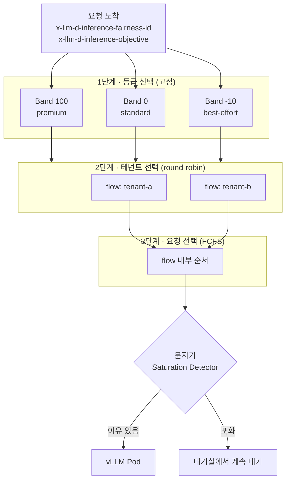

[개념편](../llm-d-architecture/)에서 EPP의 파이프라인을 정리하며 Flow Control을 문서 수준으로만 다뤘다. 이번에는 실제로 켜고 부하를 넣어 **큐가 어디에 쌓이는지** 를 눈으로 확인했다.

GPU는 RTX 3050 6GB 한 장, vLLM replica는 1개다. **작은 GPU가 오히려 유리하다.** Flow Control의 동작은 전부 "풀이 포화됐을 때" 나타나는데, GPU가 작을수록 포화를 만들기 쉽다.

가장 중요한 결과부터 적는다. **Flow Control을 켜도 총 대기시간은 줄지 않는다. 기다리는 장소가 GPU에서 게이트웨이로 옮겨갈 뿐이다.** 공식 문서도 같은 말을 한다 — *"controlling where and for whom TTFT is accrued"*.

## 1. Flow Control은 무엇인가

한 줄로 줄이면 **모델 서버 앞에 대기실을 하나 두는 것**이다. 요청이 도착하자마자 GPU로 보내지 않고, EPP가 붙잡고 있다가 순서를 정해 내보낸다.

식당에 비유하면 이해가 빠르다. 자리가 없는데 손님을 계속 안으로 들여보내면 **모두가 똑같이 느려진다.** 입구에서 대기 명단을 관리하면 예약 손님을 먼저 안내하고, 한 일행이 자리를 독점하는 것도 막을 수 있다.

### 대기실이 없으면 생기는 일

Flow Control이 꺼져 있으면 요청은 곧장 각 모델 서버의 **로컬 큐**로 흩어진다. 문제는 **한 번 들어간 요청을 되돌릴 수 없다**는 점이다.

그래서 네 가지가 생긴다. 큰 프롬프트를 던지는 테넌트가 KV 캐시를 독점하고(**noisy neighbor**), 급한 요청이 배치 작업 뒤에 갇히고(**우선순위 역전**), 더 좋은 서버가 곧 비는데도 이미 보낸 요청을 옮기지 못하고(**scheduling regret**), 요청 하나가 수백 개 몫의 자원을 쓴다(**자원 비대칭**).

### 대기실이 있으면 할 수 있는 일

요청이 EPP 한곳에 모여 있으면 **내보내기 직전까지 순서를 바꿀 수 있다.** 누구를 먼저 보낼지, 누구를 잠시 세워둘지, 누구를 아예 돌려보낼지를 정책으로 정한다.

정리하면 Flow Control은 **"요청을 언제, 어떤 순서로 내보낼지 결정하는 계층"** 이다. 어디로 보낼지를 정하는 Request Scheduler 바로 앞에 붙는다.

### 알아둘 용어 네 개

| 용어 | 쉬운 설명 |
| --- | --- |
| **Priority band** | 요청의 등급. 100(급함) / 0(보통) / -10(나중에 해도 됨)처럼 숫자로 나눈다 |
| **FairnessID** | 누구의 요청인지 표시하는 꼬리표. 보통 테넌트나 팀 이름을 넣는다 |
| **FlowKey** | 등급과 꼬리표를 합친 것. **이 조합마다 대기줄이 하나씩 생긴다** |
| **Saturation detector** | 지금 모델 서버가 더 받을 수 있는지 판단하는 문지기 |

등급과 꼬리표는 HTTP 헤더로 붙인다.

```bash {title="요청에 등급과 테넌트를 표시한다"}
$ curl -X POST http://${IP}:${PORT}/v1/completions \
    -H 'x-llm-d-inference-fairness-id: tenant-a' \
    -H 'x-llm-d-inference-objective: premium-traffic' \
    -d '{"model": "Qwen/Qwen3-0.6B", "prompt": "Say hello"}'
```

> 운영에서는 이 헤더를 사용자가 직접 넣게 두면 안 된다. 누구나 자기 요청을 premium이라고 주장할 수 있기 때문이다. **앞단 게이트웨이나 인증 계층이 API 키를 보고 대신 붙여줘야 한다.**


## 2. RPS 제한이 LLM에서 통하지 않는 이유

전통적인 API 게이트웨이는 **요청 수(RPS)** 로 제한한다. 모든 요청이 비슷한 자원을 쓴다는 가정이 깔려 있다.

LLM 서빙에서는 이 가정이 깨진다. 소비량은 긴 입력 컨텍스트와 예측 불가능한 autoregressive decode 루프가 결정한다. **한 요청이 다른 요청보다 수십 배의 연산과 메모리를 쓸 수 있다.**

그래서 정적 RPS 상한은 둘 중 하나로 실패한다. 너무 보수적이면 GPU를 놀리고, 너무 공격적이면 과부하를 낸다.

Flow Control은 **요청 수가 아니라 물리적 용량(KV 캐시, 큐 포화도)** 을 기준으로 게이팅한다. 그리고 그 대기를 모델 서버가 아니라 EPP의 중앙 큐에서 받는다.

## 3. 다음에 내보낼 요청을 고르는 3단계

대기실에 요청이 쌓였다고 하자. 자리가 하나 나면 **누구를 다음으로 들여보낼 것인가.** llm-d는 이 질문을 세 번 나눠서 푼다.

1. **먼저 등급을 고른다.** 급한 등급에 대기 중인 요청이 하나라도 있으면 아래 등급은 쳐다보지 않는다.
2. **그 등급 안에서 테넌트를 고른다.** 기본은 번갈아 가며 한 명씩(round-robin)이다.
3. **그 테넌트의 줄에서 요청 하나를 고른다.** 기본은 먼저 온 순서(FCFS)다.

마지막으로 문지기에게 묻는다. **모델 서버에 여유가 있으면 내보내고, 포화면 그대로 붙잡는다.**



**1단계는 고정이다.** 등급 순서는 플러그인으로 바꿀 수 없다. 높은 등급이 완전히 빌 때까지 낮은 등급은 서비스되지 않는다.

**2단계와 3단계는 교체할 수 있다.** 테넌트 구분을 무시하고 전체를 한 줄로 세우거나(`global-strict-fairness-policy`), 마감이 임박한 요청을 먼저 빼는(`edf-ordering-policy`) 식이다.

이 글의 실험은 전부 기본 조합인 **round-robin + FCFS** 로 진행했다.

## 4. 적용 — 가이드 기본값은 GPU 16장 기준이다

llm-d 저장소에는 `guides/flow-control/` 가이드가 통째로 들어 있다. 다만 **그대로 쓰면 이 환경에서는 아무 일도 일어나지 않는다.**

```yaml {title="가이드 기본값 (guides/flow-control/router/flow-control.values.yaml)"}
- type: concurrency-detector
  parameters:
    maxConcurrency: 132        # Qwen3-32B × 8 replicas × GPU 16장 기준
    concurrencyMode: requests
```

`maxConcurrency: 132`는 replica 8개짜리 기준이다. replica 1개로는 이 값에 절대 도달하지 못하므로 게이트가 항상 열려 있다.

기준점은 vLLM이 기동 로그에 이미 찍어준다.

```bash {title="vLLM 기동 로그"}
[kv_cache_utils.py:2177] GPU KV cache size: 20,032 tokens
[kv_cache_utils.py:2178] Maximum concurrency for 2,048 tokens per request: 9.78x
```

**9.78x**가 이 모델 서버의 실질 동시 처리 한계다. 문서의 "healthy buffer" 원칙은 `maxConcurrency`를 **모델 서버의 유효 배치 크기 바로 위** 에 두라고 한다.

이 글에서는 큐가 쌓이는 모습을 또렷이 보려고 **먼저 4로 낮춰** 실험하고, 마지막에 **10으로 되돌려** 튜닝 효과를 확인한다.

### 3-1. CRD 한 개가 더 필요하다

우선순위는 `InferenceObjective` 에서 나온다. 이 CRD가 없으면 모든 요청이 priority 0으로 떨어져 **대역 실험 자체가 성립하지 않는다.**

```bash {title="CRD 설치"}
$ kubectl apply -f https://github.com/llm-d/llm-d-router/releases/latest/download/manifests.yaml
customresourcedefinition.apiextensions.k8s.io/inferencemodelrewrites.llm-d.ai created
customresourcedefinition.apiextensions.k8s.io/inferenceobjectives.llm-d.ai created
```

```yaml {title="우선순위 클래스 3종"}
apiVersion: llm-d.ai/v1alpha2
kind: InferenceObjective
metadata: {name: premium-traffic}
spec:
  priority: 100
  poolRef: {name: optimized-baseline}
---
apiVersion: llm-d.ai/v1alpha2
kind: InferenceObjective
metadata: {name: standard-traffic}
spec:
  priority: 0
  poolRef: {name: optimized-baseline}
---
apiVersion: llm-d.ai/v1alpha2
kind: InferenceObjective
metadata: {name: best-effort-traffic}
spec:
  priority: -10                       # 음수 = sheddable
  poolRef: {name: optimized-baseline}
```

`poolRef`는 **기존 InferencePool 이름**으로 맞춰야 한다. 가이드 원본은 `flow-control`이라는 별도 풀을 만들지만, GPU가 1장이라 모델 서버를 하나 더 띄울 수 없다. 기존 릴리스에 values만 얹는 편이 맞다.

### 3-2. EPP 설정

```yaml {title="flow-control-lab.values.yaml"}
router:
  epp:
    flags:
      metrics-endpoint-auth: false      # :9090/metrics 가 기본적으로 401 이다
    pluginsConfigFile: "flow-control-lab.yaml"
    pluginsCustomConfig:
      flow-control-lab.yaml: |
        apiVersion: llm-d.ai/v1alpha1
        kind: EndpointPickerConfig
        featureGates:
        - flowControl                   # 기능 게이트를 명시적으로 켜야 한다
        plugins:
        - type: approx-prefix-cache-producer
        - type: inflight-load-producer
        - type: prefix-cache-affinity-filter
        - type: token-load-scorer
        - type: round-robin-fairness-policy
        - type: fcfs-ordering-policy
        - type: concurrency-detector
          parameters:
            maxConcurrency: 4           # 실험용. 실제 튜닝값은 10
            concurrencyMode: requests
        schedulingProfiles:
        - name: default
          plugins:
          - pluginRef: prefix-cache-affinity-filter
          - pluginRef: token-load-scorer
        flowControl:
          maxRequests: "1k"
          defaultRequestTTL: "60s"
          saturationDetector:
            pluginRef: concurrency-detector
          priorityBands:
          - {priority: 100, maxRequests: "500", fairnessPolicyRef: round-robin-fairness-policy, orderingPolicyRef: fcfs-ordering-policy}
          - {priority: 0,   maxRequests: "200", fairnessPolicyRef: round-robin-fairness-policy, orderingPolicyRef: fcfs-ordering-policy}
          - {priority: -10, maxRequests: "50",  fairnessPolicyRef: round-robin-fairness-policy, orderingPolicyRef: fcfs-ordering-policy}
```

두 가지가 실제로 걸렸다. 첫째, **EPP 메트릭 엔드포인트는 기본이 401**이라 `metrics-endpoint-auth: false`가 없으면 `llm_d_epp_flow_control_*` 를 볼 수 없다.

둘째, **`saturationDetector`의 위치가 문서와 저장소 가이드에서 다르다.** 공식 문서 페이지는 최상위에 두지만, 저장소의 `flow-control.values.yaml`은 `flowControl` 아래에 둔다. EPP 이미지와 같은 스냅샷인 저장소 쪽을 따랐다.

```bash {title="적용 및 확인"}
$ helm upgrade optimized-baseline oci://ghcr.io/llm-d/charts/llm-d-router-standalone \
    -f ${REPO_ROOT}/guides/recipes/router/base.values.yaml \
    -f ${REPO_ROOT}/guides/optimized-baseline/router/optimized-baseline.values.yaml \
    -f ~/flow-control-lab.values.yaml \
    -n llm-d-lab --version v0

$ kubectl logs -n llm-d-lab deploy/optimized-baseline-epp -c epp | grep "Flow Control"
{"body":"Initializing Flow Control layer","service.name":"llm-d-epp"}
```

**EPP는 핫 리로드가 없다.** 설정을 바꿀 때마다 파드가 재시작되고, `failureMode: FailOpen` 때문에 그 순간의 요청은 **플로우 컨트롤 없이 그냥 통과**한다. 이 구간의 측정값은 버려야 한다.

## 5. 측정 1 — 큐는 어디에 쌓이는가

동일 프롬프트 16건을 **동시에** 던지고, 클라이언트 쪽 TTFT와 vLLM의 `num_requests_running` 을 0.15초 간격으로 함께 샘플링했다.

```python {title="측정 스크립트 (핵심부)"}
def worker(i):
    body = json.dumps({"model": MODEL, "prompt": f"Request {i}: ...",
                       "max_tokens": 128, "temperature": 0, "stream": True}).encode()
    t0 = time.perf_counter(); ttft = None
    with urllib.request.urlopen(req, timeout=300) as resp:
        for raw in resp:                      # 스트림을 끝까지 읽는다
            if raw.startswith(b"data: ") and b"[DONE]" not in raw and ttft is None:
                ttft = time.perf_counter() - t0
    results.append({"ttft": ttft * 1000, "e2e": (time.perf_counter() - t0) * 1000})

threads = [threading.Thread(target=worker, args=(i,)) for i in range(16)]
```

결과는 다음과 같다.

| 구성 | 전체 소요 | vLLM running 최대 | TTFT 분포 |
| --- | --- | --- | --- |
| **Flow Control 없음** | 2,250 ms | **16** | 238.8 ~ 262.5 ms (전부 한 덩어리) |
| **maxConcurrency=4** | 8,167 ms | **6** | 4개 파도로 분리 (아래) |
| **maxConcurrency=10** | 4,219 ms | **10** | 2개 파도로 분리 |

Flow Control이 없을 때는 **16건이 전부 즉시 GPU로 들어갔다.** 모두가 같은 배치에 섞여 함께 느려지고, TTFT는 24 ms 폭 안에 몰린다.

`maxConcurrency=4`를 걸면 그림이 완전히 달라진다.

```bash {title="TTFT (ms) — maxConcurrency=4, 동시 16건"}
253.7  259.7  265.3  267.8  268.2  268.6     ← 1파도
2230.4 2246.4 2248.0 2249.6                  ← 2파도
4229.7 4243.1 4243.5 4245.0                  ← 3파도
6206.4 6223.8                                ← 4파도
```

**총 대기시간이 사라진 게 아니다.** 앞쪽 6건은 260 ms에 첫 토큰을 받았지만 뒤쪽 2건은 6.2초를 기다렸다. 전체 소요는 오히려 2,250 ms에서 8,167 ms로 늘었다.

이유는 명확하다. GPU는 16 동시 처리를 감당할 수 있었는데 **게이트를 4로 묶어 인위적 병목을 만들었기** 때문이다. 문서가 말하는 work-conserving은 "설정된 용량 안에서" 성립한다.

## 6. 측정 2 — noisy neighbor

`x-llm-d-inference-fairness-id` 로 테넌트를 나눈다. **tenant-a가 12건으로 먼저 큐를 점유한 뒤, 0.4초 늦게 tenant-b가 2건을 넣는다.**

FCFS라면 tenant-b는 대기 중인 tenant-a 8건 뒤에 서야 한다. round-robin fairness는 다르게 동작해야 한다.

| 파도 | 첫 토큰 시각 | 구성 |
| --- | --- | --- |
| 1 | 45 ~ 60 ms | tenant-a × 4 |
| 2 | 2,110 ~ 2,126 ms | tenant-a × 2 + **tenant-b × 2** |
| 3 | 4,088 ~ 4,104 ms | tenant-a × 4 |
| 4 | 6,137 ~ 6,153 ms | tenant-a × 2 |

**tenant-b는 406 ms에 도착해 2,126 ms에 서비스됐다.** 대기 중이던 tenant-a 6건을 제친 것이다. 2번째 파도의 절반을 가져갔다.

전체 요청의 14%(2/14)만 보낸 테넌트가 **파도의 50%를 받았다.** 이것이 round-robin fairness가 noisy neighbor를 막는 방식이다.

## 7. 측정 3 — 우선순위 역전 방지

best-effort(-10)로 12건을 밀어 큐를 만든 뒤, 2초 후 **premium(100) 4건과 standard(0) 4건을 동시에** 투입했다.

```bash {title="첫 토큰 시각 (ms)"}
premium   #0  2060.4     premium   #2  4008.6
premium   #1  2060.4     premium   #3  4026.5
standard  #1  4026.6     standard  #2  6027.0
standard  #0  4026.6     standard  #3  6043.0
# best-effort 12건은 그 뒤로 밀림
```

**4건의 premium이 모두 standard보다 먼저 나갔고, 둘 다 큐에 있던 best-effort 전부를 제쳤다.** Tier 1이 하드코딩된 엄격한 순서라는 것이 그대로 관찰된다.

다만 **이미 GPU에 들어간 요청은 되돌리지 못한다.** 별도로 진행한 실험에서 best-effort 12건이 먼저 디스패치된 뒤 premium을 넣었더니, premium은 2초를 기다렸다. 문서가 말하는 *Scheduling Regret* — 한 번 내보낸 요청은 EPP가 움직일 수 없다 — 이 그대로 드러난다.

## 8. 측정 4 — 부하 차단과 TTL 만료

대역별 용량 제한을 확인하려고 `-10` 대역의 `maxRequests`를 **5**로, `defaultRequestTTL`을 **3s**로 줄이고 best-effort 24건을 던졌다.

| 결과 | 건수 | 드롭 사유 헤더 |
| --- | --- | --- |
| 200 정상 처리 | **8** | — |
| 429 거부 | **15** | `rejected-saturated` |
| 429 거부 | **1** | `rejected-ttl-expired` |

EPP 메트릭이 클라이언트 관측과 정확히 일치했다.

```bash {title="llm_d_epp_flow_control_requests_total"}
{outcome="Dispatched",       priority="-10"} 8
{outcome="RejectedCapacity", priority="-10"} 15
{outcome="EvictedTTL",       priority="-10"} 1
```

낮은 대역의 큐 용량을 엄격히 묶어두면, **폭주하는 배치 트래픽이 상위 대역의 큐 공간을 잠식하지 못한다.** 이것이 문서가 말하는 메모리 격리다.

## 9. 문서와 달랐던 두 가지

**TTL 만료의 HTTP 코드가 달랐다.** 문서는 `QueueOutcomeEvictedTTL` → **503**으로 매핑한다고 적혀 있지만, 실제로 받은 응답은 **429**였다. 드롭 사유 헤더는 `rejected-ttl-expired`로 정확했고, EPP 메트릭도 `EvictedTTL`로 집계됐다. 내부 상태는 문서대로인데 코드 매핑만 다르다.

**flow를 잘게 쪼개면 초기 버스트가 게이트를 넘어선다.** 우선순위 실험을 처음 설계할 때 요청마다 다른 `fairness-id`를 부여했더니(12개 flow), `maxConcurrency=4`인데도 12건이 한꺼번에 디스패치됐다. 같은 조건에서 flow를 하나로 합치면 4건씩 정상적으로 나뉘었다.

디스패치 사이클이 flow마다 한 건씩 꺼내는 구조라 **포화 판정이 갱신되기 전에 여러 flow가 동시에 통과**한 것으로 보인다. 원인을 단정할 수는 없지만, **테넌트 수가 많은 환경에서는 게이트가 설정값보다 헐겁게 동작할 수 있다**는 점은 기억해둘 만하다.

## 10. maxConcurrency를 제대로 잡으면

마지막으로 실측 기준값인 **10**으로 되돌려 같은 부하를 다시 넣었다.

| | Flow Control 없음 | maxConcurrency=4 | **maxConcurrency=10** |
| --- | --- | --- | --- |
| 전체 소요 | 2,250 ms | 8,167 ms | **4,219 ms** |
| vLLM running 최대 | 16 | 6 | **10** |
| 1파도 처리량 | 16건 | 6건 | **10건** |

`running` 최대치가 설정값과 정확히 일치한다. 10건이 첫 파도(246~266 ms)에, 나머지 6건이 두 번째 파도(2,243~2,259 ms)에 처리됐다.

**게이트를 너무 낮게 잡으면 GPU를 놀리고, 너무 높게 잡으면 Flow Control이 무력해진다.** `maxConcurrency`는 취향이 아니라 측정값이며, vLLM이 기동 로그에 찍어주는 동시성 수치가 그 출발점이다.

## 11. 정리

**Flow Control은 대기시간을 없애지 않는다.** 16건 동시 요청에서 총 처리 시간은 오히려 늘었다. 바뀐 것은 **누가 기다리고, 어디서 기다리는가** 다.

**그 대가로 얻는 것이 통제권이다.** 늦게 온 테넌트가 굶지 않고(측정 2), 중요한 요청이 배치 작업 뒤에 갇히지 않으며(측정 3), 폭주 트래픽은 상위 대역을 침범하지 못한 채 429로 잘린다(측정 4).

**하드웨어와 무관한 소프트웨어 계층이다.** GPU 1장에 0.6B 모델로도 3계층 디스패치, 공정성, 대역 격리가 전부 재현됐다. 오히려 포화를 만들기 쉬워 관찰이 쉬웠다.

**설정에서 실제로 걸린 것은 세 가지다.** `InferenceObjective` CRD 누락, 메트릭 엔드포인트의 기본 401, 그리고 `maxConcurrency` 기본값이 GPU 16장 기준이라는 점이다.

다음으로 확인해볼 것은 큐 깊이를 활용한 오토스케일링이다. `llm_d_epp_flow_control_queue_size` 는 "아직 처리되지 못한 진짜 수요"를 나타내므로 KEDA 같은 외부 스케일러의 입력으로 쓸 수 있다. 다만 replica를 늘릴 GPU가 있어야 의미가 있다.
