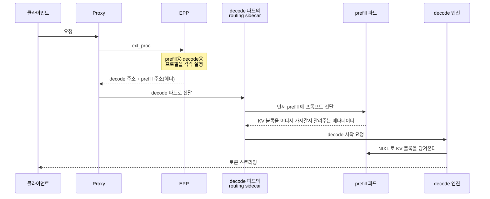

LLM 추론은 성격이 전혀 다른 두 단계로 이루어진다. **이 둘을 같은 GPU에서 돌리면 서로를 방해한다.**

P/D Disaggregation은 그 둘을 아예 다른 서버로 떼어놓는 방식이다. llm-d는 이 기능을 [개념편](../llm-d-architecture/)에서 정리한 EPP에 기본으로 내장하고 있다.

이 글은 llm-d 공식 가이드와 저장소의 실제 매니페스트를 근거로 정리한 개념편이다. 가이드의 기준 구성이 **GPU 16장**이라 직접 돌려보지는 못했고, 그 이유는 마지막 절에 적었다.

## 1. 먼저 용어 다섯 개

| 용어 | 쉬운 설명 |
| --- | --- |
| **Prefill** | 입력 프롬프트 전체를 **한 번에** 읽어서 이해하는 단계 |
| **Decode** | 답변을 **한 글자씩** 만들어내는 단계 |
| **ISL / OSL** | Input/Output Sequence Length. 입력이 10,000 토큰, 출력이 1,000 토큰이면 10:1 |
| **TTFT** | 첫 글자가 나오기까지 걸린 시간. 주로 **prefill**이 좌우한다 |
| **ITL** | 글자와 글자 사이 간격. 주로 **decode**가 좌우한다 |

## 2. 두 단계는 병목이 다르다

책에 비유하면 이해가 빠르다. prefill은 **두꺼운 자료를 한 번에 통독하는 일**이고, decode는 **그 내용을 바탕으로 한 글자씩 받아쓰는 일**이다.

통독은 눈과 머리를 쉴 새 없이 굴려야 한다. 받아쓰기는 머리보다 **자료를 계속 다시 들춰보는 손놀림**이 속도를 결정한다.

GPU에서도 똑같다.

| | Prefill | Decode |
| --- | --- | --- |
| 하는 일 | 프롬프트 전체를 한 번의 forward pass로 처리 | KV 캐시에서 토큰을 하나씩 생성 |
| 병목 | **연산(compute-bound)** — GPU flops | **메모리 대역폭(memory-bandwidth-bound)** — HBM에서 on-chip으로 데이터를 얼마나 빨리 옮기는가 |
| 성격 | 짧고 폭발적 | 길고 지속적 |
| 영향 지표 | TTFT | ITL |

**한 GPU에 섞어두면 문제가 생긴다.** 긴 프롬프트의 prefill이 들어오는 순간 GPU 연산이 거기에 묶이고, 이미 답변을 뱉고 있던 decode 요청들이 그동안 멈춘다.

사용자 입장에서는 **잘 나오던 글자가 갑자기 뚝 끊기는 현상**이다. 남이 보낸 긴 프롬프트 때문에 내 답변이 끊기는 셈이다.

## 3. 떼어놓으면 무엇이 좋아지나

**첫째, 간섭이 사라진다.** prefill 전용 서버와 decode 전용 서버가 나뉘므로, 긴 프롬프트가 들어와도 decode는 자기 속도를 유지한다. ITL이 안정되고 체감 품질이 올라간다.

**둘째, 각자에게 맞는 모양으로 배치할 수 있다.** 이것이 핵심이다.

| | 권장 배치 | 이유 |
| --- | --- | --- |
| Prefill | **replica 많이, 병렬 적게** (예: TP=1 × 8개) | 짧고 폭발적인 작업이라 개수로 받아내는 편이 낫다 |
| Decode | **replica 적게, 병렬 많이** (예: TP=4 × 2개) | 넓게 쪼갤수록 KV 캐시에 쓸 메모리가 늘어난다 |

**셋째, 모델 사본 수가 준다.** decode를 넓은 병렬로 묶으면 같은 GPU 수에서 모델 복사본이 줄고, 그만큼 **KV 캐시에 돌릴 메모리가 늘어난다.**

## 4. 반대로, 쓰지 말아야 할 때

공식 가이드는 **모든 워크로드의 정답이 아니라고 분명히 못 박는다.** 권장 조건은 세 가지다.

- **중대형 모델** (예: `gpt-oss-120b`)
- **긴 입력** (예: 10k ISL / 1k OSL. 200 ISL / 200 OSL 같은 짧은 요청은 대상이 아니다)
- **Sparse MoE 구조** — wide expert parallelism의 여지가 있는 경우

짧은 프롬프트에 짧은 답변이라면 prefill 자체가 가벼워서 간섭이 문제되지 않는다. **오히려 KV를 네트워크로 옮기는 비용만 추가된다.**

## 5. 요청 하나가 흐르는 길



눈여겨볼 곳은 **최종 목적지가 decode라는 점**이다. EPP는 두 개의 엔드포인트를 고르지만, 프록시가 실제로 연결하는 곳은 decode 파드다.

prefill 주소는 **헤더로 주입**되고, decode 파드에 함께 떠 있는 **routing sidecar**가 그 주소를 보고 원격 prefill을 조율한다.

그리고 KV는 **decode가 당겨온다(pull).** prefill이 밀어 넣는 게 아니라, prefill이 "여기 있다"는 메타데이터만 주고 decode가 NIXL로 가져간다.

## 6. EPP는 둘을 어떻게 구분하나

라벨로 구분한다. 두 Deployment는 **같은 InferencePool에 속하면서** `llm-d.ai/role` 값만 다르다.

그리고 EPP 설정에서 **프로필 두 개**를 각각 실행한다.

```yaml {title="pd-disaggregation.values.yaml (EPP 설정 발췌)"}
plugins:
- type: always-disagg-pd-decider
- type: disagg-profile-handler        # 프로필 2개를 실행하는 핸들러
  parameters:
    deciders:
      prefill: always-disagg-pd-decider
- type: prefill-filter                # role=prefill 만 남긴다
- type: decode-filter                 # role=decode 만 남긴다
- type: prefix-cache-affinity-filter
  parameters:
    peakPrefillThroughput: 33821      # 하드웨어별로 다시 재야 하는 값
- type: token-load-scorer
- type: active-request-scorer

schedulingProfiles:
- name: prefill
  plugins:
  - pluginRef: prefill-filter
  - pluginRef: prefix-cache-affinity-filter   # 캐시가 있는 prefill 우선
  - pluginRef: token-load-scorer
  - pluginRef: max-score-picker
- name: decode
  plugins:
  - pluginRef: decode-filter
  - pluginRef: active-request-scorer           # 덜 바쁜 decode 우선
  - pluginRef: max-score-picker
```

**두 프로필이 보는 기준이 다르다는 점이 중요하다.** prefill 쪽은 프리픽스 캐시 적중과 토큰 부하를 보고, decode 쪽은 지금 처리 중인 요청 수를 본다.

각 단계의 병목이 다르니 판단 기준도 달라야 한다. 그리고 **prefix-cache aware 라우팅이 그대로 얹힌다** — 분리했다고 캐시 최적화를 포기하지 않는다.

## 7. 실제 매니페스트

가이드의 기준 구성은 `openai/gpt-oss-120b` 기준 **prefill 8개(TP=1) + decode 2개(TP=4)** 다.

```yaml {title="patch-prefill.yaml (발췌)"}
spec:
  replicas: 8
  template:
    spec:
      containers:
        - name: modelserver
          args:
            - "openai/gpt-oss-120b"
            - "--tensor-parallel-size=1"
            - "--block-size=128"
            - "--kv-transfer-config"
            - '{"kv_connector":"NixlConnector","kv_role":"kv_both",
                "kv_buffer_device":"cuda","kv_connector_extra_config":{"backends":["UCX"]}}'
          env:
            - name: VLLM_NIXL_SIDE_CHANNEL_HOST      # 자기 Pod IP 를 알려준다
              valueFrom:
                fieldRef: {fieldPath: status.podIP}
            - name: VLLM_HTTP_TIMEOUT_KEEP_ALIVE     # 사이드카 idle timeout(90s)보다 길게
              value: "120"
          resources:
            limits: {nvidia.com/gpu: "1"}
```

```yaml {title="patch-decode.yaml (발췌)"}
spec:
  replicas: 2
  template:
    spec:
      containers:
        - name: modelserver
          args:
            - "--tensor-parallel-size=4"
            - "--port=8200"                # 8000 은 사이드카가 쓴다
          resources:
            limits: {nvidia.com/gpu: "4"}
```

decode 파드에는 **라우팅 사이드카가 함께 뜬다.** initContainer로 선언하되 `restartPolicy: Always`를 주는 native sidecar 방식이다.

```yaml {title="patch-sidecar.yaml"}
spec:
  template:
    spec:
      initContainers:
        - name: routing-proxy
          args:
            - --port=8000
            - --kv-connector=nixlv2
          restartPolicy: Always          # native sidecar
          ports:
            - containerPort: 8000
```

포트 배치를 보면 구조가 읽힌다. **사이드카가 8000을 차지하고 vLLM은 8200으로 물러나 있다.** 외부에서 오는 요청은 전부 사이드카를 먼저 거치고, 사이드카가 prefill과 decode의 순서를 조율한 뒤 로컬 vLLM에 넘긴다.

`VLLM_HTTP_TIMEOUT_KEEP_ALIVE: "120"` 도 실전에서 나온 값이다. vLLM 기본 keep-alive가 5초인데 사이드카의 idle timeout은 90초라, **연결을 재사용할 때 TCP RST가 발생**한다. 서버 쪽을 더 길게 잡아 막는다.

## 8. KV를 옮기는 방법 — NIXL

prefill이 만든 KV 블록은 어떻게든 decode로 가야 한다. llm-d는 두 가지 전송 방식을 지원한다.

| 커넥터 | 전송 | 특징 |
| --- | --- | --- |
| **NixlConnector** (기본) | UCX (RDMA 또는 TCP) | prefill과 decode의 **TP가 달라도 된다** |
| **MooncakeConnector** | Mooncake Transfer Engine (RDMA) | prefill과 decode의 **TP가 같아야 한다**. InfiniBand 환경용 |

**TCP로도 동작한다.** 다만 공식 문서는 프로덕션에서는 고대역폭 네트워크(IB, RoCE, EFA)를 강하게 권한다. KV 블록은 작지 않고, 매 요청마다 옮겨야 한다.

주의할 점도 문서에 명시돼 있다. **NixlConnector는 TP 비율의 방향에 따른 제약이 있고, prefill 파드가 재시작되면 상대 정보가 오래된 채로 남는(stale agent) 문제**가 알려져 있다.

네트워크 정책도 챙겨야 한다. HTTP 8000·8200 외에 **prefill ↔ decode 사이 TCP 5600(NIXL side channel)** 이 열려 있어야 한다.

## 9. 운영에서 무엇을 보나 — 두 풀을 짝으로 본다

P/D는 두 풀이 **독립적으로 스케일되고 독립적으로 고장난다.** 그래서 지표를 하나로 합쳐 보면 원인을 못 찾는다.

| 신호 | 왜 보나 |
| --- | --- |
| `vllm:num_requests_running{pod=~".*prefill.*"}` | prefill 포화 = 프롬프트가 decode 시작 전부터 밀린다 → TTFT 상승 |
| `vllm:kv_cache_usage_perc{pod=~".*decode.*"}` | decode는 생성 내내 KV를 쥔다. **0.9를 넘으면 보통 여기가 진짜 병목** |
| `llm_d_epp_pd_decision_total` | EPP가 실제로 P/D를 나누고 있는지. 0으로 수렴하면 통합 서빙으로 되돌아간 것 |
| `vllm:time_to_first_token_seconds` vs `inter_token_latency_seconds` | TTFT가 나쁘면 prefill 또는 KV 전송, ITL이 나쁘면 decode |

실패 패턴은 세 가지로 요약된다.

**TTFT만 나쁘고 decode는 멀쩡하다** → prefill 포화이거나 KV 전송 지연이다. prefill이 한가한데도 TTFT가 높으면 NIXL 전송을 의심한다.

**ITL만 나쁘고 prefill은 멀쩡하다** → decode가 병목이다. KV 캐시 사용률이 1.0에 붙어 있으면 replica를 늘리거나 TP를 키운다.

**둘 다 한가한데 느리다** → 모델 서버가 아니라 라우팅 문제다. P/D 결정 비율과 EPP 스케줄러 지연을 먼저 본다.

## 10. 이 환경에서 돌리지 못한 이유

정직하게 적는다. 앞선 실습에 쓴 장비는 **RTX 3050 6GB 한 장**이다.

가이드 기준 구성은 prefill 8장 + decode 8장으로 **총 16장**이다. 모델도 `gpt-oss-120b`라 6GB에는 올라가지 않는다.

규모를 최소로 줄여도 **prefill 1개와 decode 1개가 각각 다른 GPU에 있어야** 하므로 최소 2장이 필요하다. 한 장을 나눠 쓰면 두 단계가 다시 같은 GPU에서 경쟁하게 되어 **분리의 의미 자체가 사라진다.**

다만 문턱이 하나 낮아진 점은 기록해둘 만하다. **기능 검증에 RDMA는 필수가 아니다.** 문서는 TCP와 8000·8200·5600 포트만 열려 있으면 동작 확인이 가능하다고 적고 있다. GPU 2장만 확보되면 시도해볼 수 있다.

## 11. 정리

**P/D 분리는 성격이 다른 두 작업을 떼어놓는 것이다.** prefill은 연산에 묶이고 decode는 메모리 대역폭에 묶인다. 같이 두면 긴 prefill이 decode를 끊는다.

**이득은 간섭 제거와 전문화다.** prefill은 replica를 늘리고 decode는 병렬을 넓히는 비대칭 배치가 가능해지고, decode 쪽 KV 캐시 여유가 늘어난다.

**대신 만능이 아니다.** 중대형 모델과 긴 입력(10:1 수준)이 전제이며, 짧은 요청에서는 KV를 네트워크로 옮기는 비용만 남는다.

**llm-d에서는 라벨 두 개와 프로필 두 개로 표현된다.** `llm-d.ai/role`로 역할을 나누고, `disagg-profile-handler`가 prefill용·decode용 스코어링을 각각 돌린다. 여기에 prefix-cache aware 라우팅이 그대로 얹힌다.

**운영은 두 풀을 짝으로 본다.** TTFT가 나쁘면 prefill과 KV 전송, ITL이 나쁘면 decode, 둘 다 한가한데 느리면 라우팅이다.
