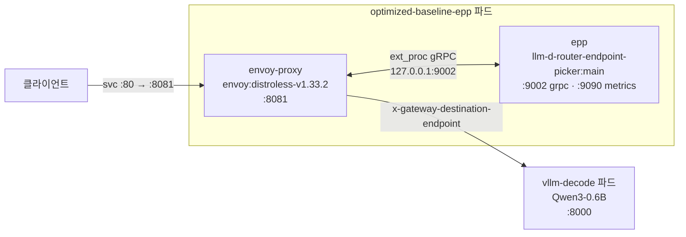

[개념편](../llm-d-architecture/)에서 llm-d가 요청마다 목적지를 다시 고른다는 구조를 정리했다. 그 구조에는 값이 붙는다. **매 요청마다 Envoy가 EPP에게 물어보고 답을 기다린다면, 그 대기는 몇 ms인가.**

RTX 3050 한 장이 꽂힌 데스크톱에 kind로 클러스터를 만들고 llm-d를 올려 직접 쟀다. 결론은 **TTFT 기준 +2.36 ms**, prefix cache 적중률 **84.5%** 다.

공식 가이드의 기준 구성은 **Qwen3-32B / H100 80GB / GPU 16장**이다. 이 글은 그것을 **GPU 1장 6GB**로 줄여 올리는 과정과, 그렇게 줄인 환경에서 무엇을 잴 수 있는지를 함께 다룬다.

## 1. 완성된 환경

| 항목 | 값 |
| --- | --- |
| 호스트 | Debian 13, NVIDIA driver **595.84** |
| GPU | **NVIDIA GeForce RTX 3050 6GB** 1장 |
| 클러스터 | **kind**, 단일 control-plane, **k8s v1.36.1**, containerd 2.3.1 |
| 노드 | CPU 12, memory 32GB, `nvidia.com/gpu: 1` |
| device plugin | `nvcr.io/nvidia/k8s-device-plugin:v0.17.1` |
| llm-d Router | chart `llm-d-router-standalone` `v0`, EPP `llm-d-router-endpoint-picker:main` |
| Proxy | `envoyproxy/envoy:distroless-v1.33.2` (사이드카) |
| 추론 엔진 | **vLLM v0.26.0**, `Qwen/Qwen3-0.6B`, replicas **1** |
| 네임스페이스 | `llm-d-lab` |

## 2. 호스트 준비 — kind 컨테이너에 GPU를 넣는 법

kind 노드는 결국 도커 컨테이너다. **컨테이너 안에서 GPU가 보여야** kubelet이 GPU를 자원으로 인식한다.

먼저 NVIDIA Container Toolkit을 도커의 기본 런타임으로 등록한다.

```bash {title="호스트 준비"}
$ sudo nvidia-ctk runtime configure --runtime=docker --set-as-default
$ sudo systemctl restart docker
```

그리고 설정 파일에서 **볼륨 마운트로 GPU를 지정하는 방식**을 허용해야 한다. 이 한 줄이 없으면 다음 절의 kind 설정이 동작하지 않는다.

```bash {title="/etc/nvidia-container-runtime/config.toml"}
accept-nvidia-visible-devices-as-volume-mounts = true
```

## 3. kind 클러스터 생성

GPU를 넣는 트릭이 설정 파일 마지막 세 줄에 들어 있다.

```yaml {title="kind-gpu.yaml"}
apiVersion: kind.x-k8s.io/v1alpha4
kind: Cluster
nodes:
  - role: control-plane
    image: kindest/node:v1.36.1@sha256:3489c7674813ba5d8b1a9977baea8a6e553784dab7b84759d1014dbd78f7ebd5
    extraMounts:
      - hostPath: /dev/null
        containerPath: /var/run/nvidia-container-devices/all
```

`/dev/null`을 `/var/run/nvidia-container-devices/all`에 마운트한다. **파일 내용은 의미가 없다.** NVIDIA 런타임이 이 경로의 마운트를 보고 "이 컨테이너에 모든 GPU를 넣어라"로 해석한다.

앞 절에서 켠 `accept-nvidia-visible-devices-as-volume-mounts`가 바로 이 해석을 허용하는 스위치다. 둘은 한 쌍이다.

```bash {title="클러스터 생성"}
$ kind create cluster --name gpu-lab --config kind-gpu.yaml
$ kubectl get node -o wide
NAME                    STATUS   ROLES           VERSION   CONTAINER-RUNTIME
gpu-lab-control-plane   Ready    control-plane   v1.36.1   containerd://2.3.1
```

## 4. NVIDIA device plugin

노드 컨테이너에 GPU가 보이더라도, **Kubernetes가 `nvidia.com/gpu` 자원으로 노출하려면 device plugin이 필요하다.**

```bash {title="device plugin 배포"}
$ kubectl apply -f https://raw.githubusercontent.com/NVIDIA/k8s-device-plugin/v0.17.1/deployments/static/nvidia-device-plugin.yml

$ kubectl get node gpu-lab-control-plane -o jsonpath='{.status.capacity}' | tr ',' '\n'
{"cpu":"12"
"ephemeral-storage":"478512880Ki"
"hugepages-1Gi":"0"
"hugepages-2Mi":"0"
"memory":"32683004Ki"
"nvidia.com/gpu":"1"
"pods":"110"}
```

`nvidia.com/gpu: 1`이 뜨면 준비가 끝난 것이다. 여기까지가 llm-d와 무관한 GPU 인프라 작업이다.

## 5. llm-d Router 배포 — Standalone 모드

llm-d 저장소의 `optimized-baseline` 가이드를 따른다. 가이드는 환경변수로 대상을 정하는 구조다.

```bash {title="환경 변수"}
export REPO_ROOT=~/llm-d
export GUIDE_NAME=optimized-baseline
export NAMESPACE=llm-d-lab
export ACCELERATOR_TYPE=gpu
export MODEL_SERVER=vllm

export ROUTER_STANDALONE_CHART=oci://ghcr.io/llm-d/charts/llm-d-router-standalone
export ROUTER_CHART_VERSION=v0
export ROUTER_BASE_VALUES="${REPO_ROOT}/guides/recipes/router/base.values.yaml"
export ROUTER_VALUES="${REPO_ROOT}/guides/${GUIDE_NAME}/router/${GUIDE_NAME}.values.yaml"
export MONITORING_VALUES=""
```

`MONITORING_VALUES`를 비워두는 것이 중요하다. 이 값을 채우면 차트가 `ServiceMonitor`를 만드는데, **Prometheus Operator CRD가 없으면 helm 검증 단계에서 실패**한다.

```bash {title="Router 설치 (Standalone)"}
$ helm install ${GUIDE_NAME} \
    ${ROUTER_STANDALONE_CHART} \
    -f ${ROUTER_BASE_VALUES} \
    ${MONITORING_VALUES} \
    -f ${ROUTER_VALUES} \
    -n ${NAMESPACE} --version ${ROUTER_CHART_VERSION}
```

Standalone 모드는 **Gateway API를 요구하지 않는다.** 실제로 이 클러스터에는 Gateway API CRD가 설치돼 있지 않고, `kubectl get gateway`는 리소스 타입이 없다는 에러를 낸다.

설치된 values에서 핵심은 세 군데다.

```yaml {title="helm get values optimized-baseline (발췌)"}
router:
  proxy:
    proxyType: envoy          # 같은 파드에 사이드카로
    args: ["--service-node", "envoy-sidecar", "--concurrency", "8", ...]
  extraServicePorts:
    - name: http
      port: 80
      targetPort: 8081        # 서비스 80 → Envoy 8081
  inferencePool:
    failureMode: FailOpen     # EPP 장애 시 요청을 막지 않는다
  modelServers:
    matchLabels:
      llm-d.ai/guide: optimized-baseline   # 이 라벨이 붙은 파드가 후보
```

## 6. Model Server 배포 — 가이드를 6GB에 맞추기

여기가 이 실습에서 손이 가장 많이 간 부분이다. 가이드 기본값은 **Qwen3-32B, replicas 8, TP=2, GPU 16장**이라 그대로는 올라가지 않는다.

가이드는 모델 서버를 kustomize 오버레이로 배포하며, 경로에 `INFRA_PROVIDER` 변수가 들어간다. 그래서 **`lab-3050`이라는 오버레이를 새로 만들어** 그 자리에 끼웠다.

```yaml {title="modelserver/gpu/vllm/lab-3050/kustomization.yaml"}
apiVersion: kustomize.config.k8s.io/v1beta1
kind: Kustomization
resources:
  - ../../../../../recipes/modelserver/base/single-host/default
namePrefix: optimized-baseline-nvidia-gpu-vllm-
components:
  - ../../../../../recipes/modelserver/components/images/gpu-vllm/release
labels:
  - pairs:
      llm-d.ai/model: Qwen3-0.6B
      llm-d.ai/guide: optimized-baseline      # Router의 selector와 맞춘다
      llm-d.ai/accelerator-variant: gpu
      llm-d.ai/accelerator-vendor: nvidia
    includeSelectors: true
    includeTemplates: true
patches:
  - path: patch-vllm.yaml
```

`llm-d.ai/guide: optimized-baseline` 라벨이 **InferencePool의 selector와 이어지는 접점**이다. 이 라벨이 없으면 EPP가 후보를 찾지 못한다.

패치에서 모델과 자원을 줄인다.

```yaml {title="modelserver/gpu/vllm/lab-3050/patch-vllm.yaml"}
apiVersion: apps/v1
kind: Deployment
metadata:
  name: decode
spec:
  replicas: 1
  template:
    spec:
      containers:
        - name: modelserver
          command: ["vllm", "serve"]
          args:
            - "Qwen/Qwen3-0.6B"
            - "--disable-access-log-for-endpoints=/health,/metrics,/v1/models"
            - "--max-model-len=2048"
            - "--gpu-memory-utilization=0.6"
            - "--enforce-eager"
          env:
            - name: HF_TOKEN
              valueFrom:
                secretKeyRef: {name: llm-d-hf-token, key: HF_TOKEN}
          resources:
            limits: {cpu: '4', memory: 8Gi, nvidia.com/gpu: 1}
            requests: {cpu: '1', memory: 4Gi, nvidia.com/gpu: 1}
          startupProbe:
            initialDelaySeconds: 10
            periodSeconds: 10
            failureThreshold: 60          # 최대 10분까지 기동을 기다린다
      volumes:
        - name: shm
          emptyDir: {medium: Memory, sizeLimit: 2Gi}
```

바꾼 값마다 이유가 있다. `--gpu-memory-utilization=0.6`은 6GB 중 3.6GB만 쓰겠다는 뜻이고, `--max-model-len=2048`은 KV 캐시가 감당할 컨텍스트 상한이다.

`--enforce-eager`는 CUDA 그래프 캡처를 끈다. **캡처에 쓰는 추가 메모리를 아끼고 기동 시간을 줄이는 대신 약간의 성능을 포기**하는 선택이다.

`startupProbe`의 `failureThreshold: 60`도 중요하다. 모델을 HuggingFace에서 내려받고 엔진을 초기화하는 동안 파드가 죽지 않게 한다.

```bash {title="모델 서버 배포"}
$ kubectl create secret generic llm-d-hf-token \
    --from-literal=HF_TOKEN=<your-token> -n ${NAMESPACE}

$ kubectl apply -n ${NAMESPACE} \
    -k ${REPO_ROOT}/guides/${GUIDE_NAME}/modelserver/gpu/vllm/lab-3050/
```

기동 로그에서 실제로 잡힌 KV 캐시 용량을 확인할 수 있다.

```bash {title="vLLM 기동 로그 (발췌)"}
[cuda.py:482] Using FLASH_ATTN attention backend
[flash_attn.py:776] Using FlashAttention version 2
[gpu_worker.py:560] Available KV cache memory: 2.14 GiB
[kv_cache_utils.py:2177] GPU KV cache size: 20,032 tokens
[kv_cache_utils.py:2178] Maximum concurrency for 2,048 tokens per request: 9.78x
[core.py:347] init engine (profile, create kv cache, warmup model) took 8.08 s
```

6GB 중 0.6을 쓰면 KV 캐시로 **2.14 GiB, 토큰 20,032개** 가 남는다. 요청당 2,048 토큰 기준 동시성 9.78배다.

**replica를 늘릴 수는 없다.** 두 번째 파드도 3.6GB를 요구하므로 6GB에 들어가지 않는다. 이 글의 측정이 "파드 선택"이 아니라 "경로 비용"에 맞춰진 이유다.

## 7. 배포 결과 — 파드 하나에 Envoy와 EPP



```bash {title="배포 확인"}
$ kubectl get pod -n llm-d-lab
NAME                                                         READY   STATUS
optimized-baseline-epp-5fbd7457f9-9xcr7                      2/2     Running
optimized-baseline-nvidia-gpu-vllm-decode-7978d9d5c9-h59gz   1/1     Running

$ kubectl get pod -n llm-d-lab optimized-baseline-epp-5fbd7457f9-9xcr7 \
    -o jsonpath='{range .spec.containers[*]}{.name}: {.image}{"\n"}{end}'
envoy-proxy: docker.io/envoyproxy/envoy:distroless-v1.33.2
epp: ghcr.io/llm-d/llm-d-router-endpoint-picker:main

$ kubectl get svc -n llm-d-lab optimized-baseline-epp \
    -o jsonpath='{range .spec.ports[*]}{.name} {.port}->{.targetPort}{"\n"}{end}'
grpc-ext-proc 9002->9002
http-metrics 9090->9090
http 80->8081
```

Gateway API는 없지만 **InferencePool은 그대로 있다.** 후보 파드를 고르는 일은 배포 모드와 무관하기 때문이다.

```yaml {title="InferencePool (실제 배포본)"}
apiVersion: inference.networking.k8s.io/v1
kind: InferencePool
metadata:
  name: optimized-baseline
  namespace: llm-d-lab
spec:
  appProtocol: http
  selector:
    matchLabels:
      llm-d.ai/guide: optimized-baseline
  targetPorts:
    - number: 8000
  endpointPickerRef:
    kind: Service
    name: optimized-baseline-epp
    port:
      number: 9002
    failureMode: FailOpen
```

## 8. EPP는 근사 모드로 떠 있다

개념편에서 정리한 두 갈래 중 **근사(approximate) 방식**이다. 설정이 짧아서 전부 옮긴다.

```yaml {title="optimized-baseline-plugins.yaml"}
apiVersion: llm-d.ai/v1alpha1
kind: EndpointPickerConfig
plugins:
  - type: approx-prefix-cache-producer
  - type: inflight-load-producer
  - type: prefix-cache-affinity-filter
  - type: token-load-scorer
schedulingProfiles:
  - name: default
    plugins:
      - pluginRef: prefix-cache-affinity-filter
      - pluginRef: token-load-scorer
```

ZMQ도 토크나이저 사이드카도 없다. **EPP가 프롬프트를 문자-토큰 비율로 근사해 해시 체인을 만들고, 자체 LRU 인덱스로 어디에 보냈는지를 기억하는 방식**이다.

설정 파일 주석에 경고가 달려 있다. `prefix-cache-affinity-filter`의 `peakPrefillThroughput` 기본값 **15928**은 **Qwen3-32B / H100 80GB / TP=2 기준으로 보정된 값**이다.

RTX 3050에 0.6B 모델을 올린 이 환경과는 하드웨어가 전혀 다르다. 문서는 이럴 때 `guides/recipes/router/calibration`으로 **직접 측정해 넣으라**고 안내한다.

## 9. Envoy 설정은 문서 그대로다

개념편에서 설명한 `ORIGINAL_DST` 트릭이 실제 ConfigMap에 그대로 들어 있다.

```yaml {title="envoy ConfigMap (발췌)"}
http_filters:
  - name: envoy.filters.http.ext_proc
    typed_config:
      failure_mode_allow: true
      grpc_service:
        envoy_grpc:
          cluster_name: ext_proc
          authority: localhost:9002
        timeout: 10s
      processing_mode:
        request_body_mode: FULL_DUPLEX_STREAMED
        response_body_mode: FULL_DUPLEX_STREAMED
      message_timeout: 1000s

clusters:
  - name: original_destination_cluster
    type: ORIGINAL_DST
    lb_policy: CLUSTER_PROVIDED
    original_dst_lb_config:
      use_http_header: true
      http_header_name: x-gateway-destination-endpoint
```

`failure_mode_allow: true`는 InferencePool의 `failureMode: FailOpen`과 짝을 이룬다. **EPP가 죽어도 요청은 계속 흐른다.**

`ext_proc` 클러스터는 `127.0.0.1:9002`를 가리킨다. Standalone이라 네트워크 홉이 없다.

## 10. 측정 1 — 게이트웨이 경유가 얼마나 비싼가

같은 요청을 두 경로로 보내 비교한다. 대상이 파드 1개뿐이라 **"어디로 갈지"는 고정**이고, 차이는 순수하게 경로 비용이다.

- **직접**: `localhost:8000/v1/completions` (vLLM에 바로)
- **EPP 경유**: `optimized-baseline-epp.llm-d-lab.svc:80` → Envoy → ext_proc → vLLM

캐시 효과가 한쪽에 몰리지 않도록 **요청마다 프롬프트를 다르게** 했고, 드리프트를 없애려 **두 경로를 교차 실행**했다. 워밍업 3회 후 각 20회다.

```python {title="측정 스크립트 (핵심부)"}
def req(base, prompt, max_tokens=64):
    body = json.dumps({"model": MODEL, "prompt": prompt, "max_tokens": max_tokens,
                       "temperature": 0, "stream": True}).encode()
    r = urllib.request.Request(base + "/v1/completions", data=body,
                               headers={"Content-Type": "application/json"})
    t0 = time.perf_counter(); ttft = None
    with urllib.request.urlopen(r, timeout=180) as resp:
        for raw in resp:
            if raw.startswith(b"data: ") and b"[DONE]" not in raw:
                if ttft is None:                 # 첫 토큰 도착 = TTFT
                    ttft = time.perf_counter() - t0
    return ttft * 1000, (time.perf_counter() - t0) * 1000

for i in range(20):                              # 교차 실행
    p = f"Question {i}: name one benefit of Kubernetes in a single sentence."
    d_ttft.append(req(VLLM, p)[0])
    e_ttft.append(req(EPP, p + " ")[0])
```

결과는 다음과 같다.

| 경로 | TTFT mean | TTFT p50 | TTFT p95 | E2E mean |
| --- | --- | --- | --- | --- |
| 직접 호출 | **32.46 ms** | 31.00 | 34.65 | 923.33 ms |
| EPP 경유 | **34.83 ms** | 34.25 | 37.73 | 930.46 ms |

**TTFT 차이는 평균 2.36 ms, 비율로 약 7%다.** E2E 기준으로는 7.13 ms 차이이고 전체의 0.8%에 불과하다.

해석의 핵심은 **무엇이 2.36 ms를 쓰는가**이다. 이 환경에서 활성 플러그인은 필터 하나와 스코어러 하나뿐이고, 스코어링 연산 자체는 마이크로초 단위다.

따라서 대부분은 **Envoy가 요청을 붙잡고 ext_proc gRPC 왕복을 기다리는 구간**이다. 계산 비용이 아니라 왕복 비용이다.

그리고 이 값은 **사이드카 기준**이다. `ext_proc` 클러스터가 `127.0.0.1`을 가리키므로 네트워크 홉이 없다. Gateway 모드로 EPP를 별도 파드에 두면 여기에 파드 간 왕복이 더 붙는다.

한 가지 더. p95를 보면 EPP 경유(37.73 ms)가 직접 호출(34.65 ms)보다 **오히려 편차가 작다.** 직접 호출의 최댓값은 46.84 ms인데 EPP 경유는 38.13 ms였다. 표본이 20개뿐이라 단정할 수는 없지만, 적어도 게이트웨이가 꼬리 지연을 키우지는 않았다.

## 11. 측정 2 — prefix cache는 실제로 몇 %를 건지나

같은 prefix를 공유하는 요청을 연속으로 보내면 prefill을 얼마나 건너뛰는지 본다. 3,102자(약 560 토큰)짜리 공통 prefix에 질문만 바꿔 8회 요청했다.

vLLM 메트릭을 요청 전후로 스냅샷해 델타를 계산했다.

```bash {title="prefix cache 메트릭 델타"}
$ # 8회 요청 전후 vllm:prefix_cache_* 차이
queries delta  4504.0    # 캐시를 조회한 토큰 수
hits    delta  3808.0    # 그중 실제로 재사용한 토큰 수
→ 적중률 84.5%
```

**8회 중 첫 요청은 캐시가 없다.** 84.5%는 그 한 번을 포함한 값이다. 요청당 조회 토큰이 평균 563개이므로, 첫 요청분을 빼면 `3,808 / 3,941`로 **약 96.6%** 가 된다.

TTFT에서도 같은 장면이 보인다.

| 요청 순서 | 1 | 2 | 3 | 4 | 5 | 6 | 7 | 8 |
| --- | --- | --- | --- | --- | --- | --- | --- | --- |
| TTFT (ms) | **83.01** | 34.90 | 36.70 | 41.91 | 33.98 | 55.70 | 34.18 | 38.36 |

**첫 요청 83.01 ms가 2회차에 34.90 ms로 떨어진다. 2.4배다.** 560 토큰짜리 prefill을 통째로 건너뛴 결과다.

여기서 앞 절의 숫자와 나란히 놓고 볼 만하다. **게이트웨이 경유 비용은 2.36 ms, prefix cache가 아낀 시간은 48 ms다.** 캐시를 한 번 맞히면 게이트웨이 비용을 스무 번 치르고도 남는다.

물론 이 환경에서는 파드가 하나라 캐시를 맞히는 데 라우팅이 필요 없었다. **라우팅이 의미를 갖는 것은 파드가 여러 개일 때**이고, 그때 EPP가 하는 일이 바로 이 48 ms를 잃지 않도록 요청을 같은 파드로 보내는 것이다.

## 12. 요청이 EPP를 지나간 흔적

측정 중 EPP 로그에는 요청 단위로 처리 기록이 남는다.

```json {title="EPP 로그 (요청 1건)"}
{"body":"EPP received request",
 "x-request-id":"3f721c05-b714-49c8-ab60-4dc568dd3dff"}
{"body":"EPP sent request body response(s) to proxy",
 "x-request-id":"3f721c05-b714-49c8-ab60-4dc568dd3dff",
 "modelName":"Qwen/Qwen3-0.6B","targetModelName":"Qwen/Qwen3-0.6B"}
{"body":"EPP sent response body back to proxy",
 "x-request-id":"3f721c05-b714-49c8-ab60-4dc568dd3dff"}
```

세 줄이 한 요청의 생명주기다. **요청 수신 → 목적지를 정해 프록시에 회신 → 응답 바디 통과.** 개념편에서 본 "Proxy가 요청을 붙잡고 EPP의 답을 기다린다"가 로그에서는 첫 줄과 둘째 줄 사이의 간격으로 나타난다.

`modelName`과 `targetModelName`이 함께 찍히는 것도 눈여겨볼 만하다. 요청한 모델명과 실제로 보낼 대상 모델명을 구분해 기록하는데, LoRA 어댑터나 모델명 가상화를 쓸 때 이 둘이 갈라진다.

## 13. 정리

GPU 1장짜리 kind 클러스터에 llm-d를 올리고 확인한 것을 정리한다.

**GPU를 kind에 넣는 데 필요한 것은 두 줄이다.** `accept-nvidia-visible-devices-as-volume-mounts = true`와 `/dev/null` extraMount가 한 쌍으로 동작하고, 그 위에 device plugin을 올리면 `nvidia.com/gpu: 1`이 나온다.

**가이드를 축소하는 작업은 kustomize 오버레이 하나로 끝난다.** 16장짜리 기준 구성을 1장으로 줄이는 데 바꾼 것은 모델·replicas·메모리 상한·컨텍스트 길이뿐이고, 라벨만 맞으면 Router는 그대로 붙는다.

**게이트웨이 경유 비용은 TTFT 기준 2.36 ms였다.** E2E로는 0.8%다. 사이드카 배치라 네트워크 홉이 없는 조건에서의 값이므로, EPP를 별도 파드로 분리하면 더 늘어난다.

**prefix cache 적중률은 84.5%, 첫 요청 대비 TTFT는 2.4배 빨라졌다.** 캐시 한 번의 이득(48 ms)이 게이트웨이 비용의 스무 배다. llm-d가 라우팅에 공을 들이는 이유가 이 비율에 있다.

**기본값은 내 하드웨어 기준이 아니다.** `peakPrefillThroughput` 기본값이 H100 80GB에 Qwen3-32B TP=2 기준이라는 주석이 좋은 예다. 라우팅 판단에 쓰이는 임계값은 쓰는 하드웨어에서 다시 재야 한다.

다음으로 확인해볼 것은 파드를 여러 개 띄울 수 있는 환경이다. 이 글의 측정은 목적지가 하나로 고정된 조건이라 EPP의 **선택**을 재지 못했다. GPU가 넉넉해지면 같은 prefix가 같은 파드로 가는지, 그리고 그때 48 ms가 실제로 지켜지는지를 재볼 수 있다.
