`vllm-project/production-stack` 레포의 [`tutorials/terraform/eks`](https://github.com/vllm-project/production-stack/tree/main/tutorials/terraform/eks) 튜토리얼을 따라가며 AWS EKS에 Managed Kubernetes + GPU 노드그룹 + vLLM Production Stack을 Terraform으로 올리는 과정을 명령어 단위로 기록한다. 기본 예시는 TinyLlama-1.1B였지만, 이번엔 NVIDIA L4(g6.2xlarge)에 Qwen3-8B를 올리고, 나아가 LMCache로 KV 캐시 CPU 오프로딩까지 켜본다.


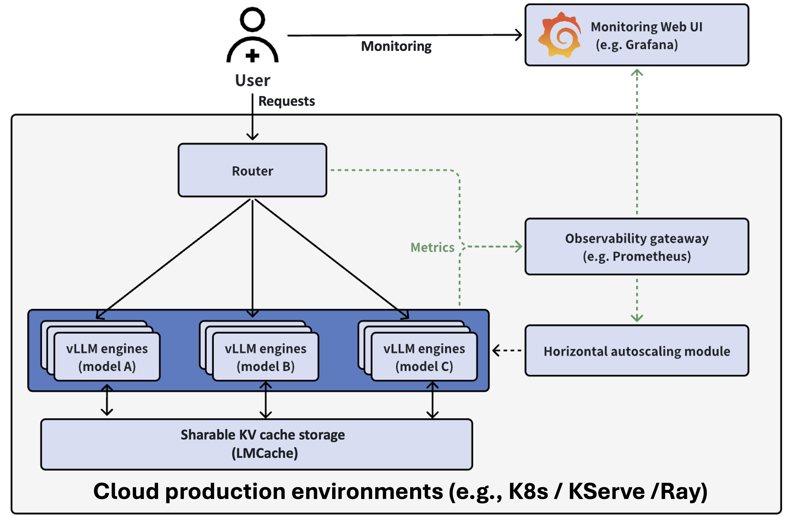

## 1. AWS EKS 사전 점검 및 환경 구성

클라우드 GPU 인프라는 리전별 쿼터, k8s 버전과 GPU 드라이버 호환성처럼 튜토리얼 문서만 봐서는 알 수 없는 제약이 많다. 그래서 **인프라를 실제로 만들기 전에** 같은 종류의 제약을 먼저 CLI로 확인하는 것부터 시작했다.

### 1.1 사전 점검(AWS GPU 쿼터를 리전별로 먼저 확인)

AWS는 신규/저사용 리전에서 GPU 인스턴스(G/VT 계열: g4dn, g5, g6 등) 관련 vCPU 쿼터가 기본 0인 경우가 흔하다. 튜토리얼 README 기본 리전(`us-east-2`)을 그대로 쓰기 전에 `aws service-quotas`로 먼저 확인했다.

```termcast {title="~/production-stack/tutorials/terraform/eks" prompt="$ "}
$ aws service-quotas get-service-quota --service-code ec2 --quota-code L-DB2E81BA --region us-east-2
"Value": 0.0   # README 기본 리전 - GPU 쿼터 없음

$ aws service-quotas get-service-quota --service-code ec2 --quota-code L-DB2E81BA --region us-east-1
"Value": 8.0   # 이미 열려있음

$ aws service-quotas get-service-quota --service-code ec2 --quota-code L-DB2E81BA --region us-west-2
"Value": 8.0   # 이것도 열려있음

$ aws service-quotas get-service-quota --service-code ec2 --quota-code L-DB2E81BA --region ap-northeast-2
"Value": 0.0   # 계정 기본 리전(서울)도 0
```

`L-DB2E81BA` (Running On-Demand G and VT instances)가 `us-east-2`와 계정 기본 리전(`ap-northeast-2`, 서울)에서는 0인데, `us-east-1`/`us-west-2`는 이미 8 vCPU가 열려 있었다. 굳이 쿼터 신청 승인을 기다릴 필요 없이 **리전을 `us-east-1`로 바꾸는 것만으로 문제를 회피**했다.

### 1.2 사전 점검 (k8s 버전 × GPU 지원 매트릭스)

k8s 버전과 GPU 드라이버 호환성 문제로 나중에 발목 잡히지 않도록, apply 전에 먼저 확인했다.

```termcast {title="~/production-stack/tutorials/terraform/eks" prompt="$ "}
$ aws eks describe-cluster-versions --region us-east-1
clusterVersion: "1.36"   defaultVersion: true   status: STANDARD_SUPPORT
clusterVersion: "1.35" ...
...

$ aws ssm get-parameter \
    --name /aws/service/eks/optimized-ami/1.36/amazon-linux-2023/x86_64/nvidia/recommended/image_id \
    --region us-east-1
{ "Parameter": { "Value": "ami-0a40b6166e4b6ea59", ... } }
```

**AWS EKS는 `1.36`을 이미 기본(default) 버전으로 지원하고, GPU용 최적화 AMI도 존재한다.** 게다가 이 튜토리얼은 `nvidia_setup="plugin"`(NVIDIA device-plugin 데몬셋) 방식이라 관리형 드라이버 프리셋 같은 버전 잠금 이슈 자체가 없다.

### 1.3 EKS 환경 구성

```termcast {title="~/production-stack/tutorials/terraform/eks" prompt="$ "}
$ cp env-vars.template env-vars
```


| 변수                               | 값                          | 이유                                                                  |
| -------------------------------- | -------------------------- | ------------------------------------------------------------------- |
| `TF_VAR_region`                  | `us-east-1`                | GPU 쿼터가 이미 열려있는 리전                                                  |
| `TF_VAR_cluster_version`         | `1.36`                     | 최신 지원 버전, GPU AMI 확인됨                                               |
| `TF_VAR_inference_hardware`      | `gpu`                      | GPU 노드풀 활성화                                                         |
| `TF_VAR_gpu_node_instance_types` | `["g6.2xlarge"]`           | NVIDIA L4 24GB, 8 vCPU/32GiB (8 vCPU 쿼터에 정확히 맞춤)                    |
| `TF_VAR_gpu_vllm_helm_config`    | `gpu-qwen3-8b-ingress.tpl` | 새로 작성한 Qwen3-8B 템플릿                                                 |
| `TF_VAR_enable_lb_ctl`           | `true`                     | vLLM ingress가 `className: alb`를 쓰므로 AWS Load Balancer Controller 필요 |
| `TF_VAR_hf_token`                | `hf_...`                   | Hugging Face 토큰                                                     |


기존 `gpu-tinyllama-light-ingress.tpl`을 베이스로 `gpu-qwen3-8b-ingress.tpl`을 새로 작성했다 (ingress는 ALB 방식). g6.2xlarge의 L4 GPU는 compute capability 8.9라 `bfloat16`을 네이티브로 지원한다 (참고로 원래 템플릿의 T4는 7.5라 float16만 지원한다. 주석에 이유가 적혀 있었다.)

### 1.4 terraform init

```termcast {title="~/production-stack/tutorials/terraform/eks" prompt="$ "}
$ terraform init
...
Error: Incompatible provider version

Provider registry.terraform.io/hashicorp/template v2.2.0 does not have a
package available for your current platform, darwin_arm64.
```

`hashicorp/template` 프로바이더(`data "template_file"` 리소스가 암묵적으로 요구)는 이미 수년 전에 deprecated된 프로바이더라 Apple Silicon(darwin_arm64)용 바이너리가 아예 없다. 레포를 뒤져보니 `vllm-production-stack.tf`와 `cluster-tools.tf` 두 곳에서 이 패턴을 쓰고 있었다. Terraform 내장 함수 `templatefile()`로 교체하면 별도 프로바이더 없이 해결된다. `templatefile()`은 Terraform 내장 함수라 별도 프로바이더가 필요 없고, `.tpl` 파일의 `${var}` 보간 문법도 그대로 호환된다.

```diff
- data "template_file" "vllm_values" {
-   count = var.enable_vllm ? 1 : 0
-   template = file(...)
-   vars = {}
- }
  resource "helm_release" "vllm_stack" {
    ...
-   values = [data.template_file.vllm_values[0].rendered]
+   values = [templatefile(
+     var.inference_hardware == "gpu"
+     ? "${path.module}/${var.gpu_vllm_helm_config}"
+     : "${path.module}/${var.cpu_vllm_helm_config}",
+     {}
+   )]
```

```diff
- data "template_file" "calico_values" {
-   template = file("${path.module}/config/calico-values.tpl")
-   vars = { pod_cidr = var.pod_cidr }
- }
  resource "helm_release" "calico" {
    ...
-   values = [data.template_file.calico_values.rendered]
+   values = [templatefile("${path.module}/config/calico-values.tpl", {
+     pod_cidr = var.pod_cidr
+   })]
```


수정 후 재시도

```termcast {title="~/production-stack/tutorials/terraform/eks" prompt="$ "}
$ terraform init
...
Terraform has been created a lock file .terraform.lock.hcl
Terraform has been successfully initialized!
```

### 1.5 terraform plan

```termcast {title="~/production-stack/tutorials/terraform/eks" prompt="$ "}
$ terraform plan
...
Plan: 100 to add, 0 to change, 0 to destroy.
```

VPC, EKS 클러스터, Calico CNI, CPU/GPU 관리형 노드그룹, ALB 컨트롤러, cert-manager, Prometheus/Grafana, vLLM Helm 릴리스까지 한 번에 구성된다. 


plan에서 실제 반영된 값들을 확인한다.

```bash
$ grep "g6.2xlarge\|ami_type" plan.log
+ ami_type       = "AL2023_x86_64_STANDARD"   # CPU 노드그룹
+ ami_type       = "AL2023_x86_64_NVIDIA"      # GPU 노드그룹
+ instance_types = ["g6.2xlarge"]
```

GPU 노드그룹이 `AL2023_x86_64_NVIDIA` AMI 타입으로 정확히 잡혔다. 앞서 SSM으로 확인한 k8s 1.36용 NVIDIA AMI가 그대로 쓰인다. `env-vars`로 넘긴 값들이 plan 출력에 전부 정확히 반영된 것도 확인했다.

### 1.6 예상 비용

```termcast {title="~/production-stack/tutorials/terraform/eks" prompt="$ "}
$ aws pricing get-products --service-code AmazonEC2 --region us-east-1 \
    --filters "Type=TERM_MATCH,Field=instanceType,Value=g6.2xlarge" | grep "Demand Linux g6.2xlarge Instance Hour"

$0.9776 per On Demand Linux g6.2xlarge Instance Hour
```

GPU 노드(g6.2xlarge) 단독 시간당 **$0.98**. 여기에 CPU 노드 2대(t3a 계열, 저렴), EKS 컨트롤 플레인 고정비($0.10/h), NAT Gateway, ALB 비용이 소폭 추가된다. 대략 시간당$1.2~1.3 수준으로 추산.

### 1.7 terraform apply

```termcast {title="~/production-stack/tutorials/terraform/eks" prompt="$ "}
$ terraform apply -auto-approve
...
module.eks.aws_eks_cluster.this[0]: Creation complete after 10m46s
module.eks.module.eks_managed_node_group["cpu_pool"].aws_eks_node_group.this[0]: Creation complete after 1m49s
module.eks.module.eks_managed_node_group["gpu_pool"].aws_eks_node_group.this[0]: Creation complete after 1m50s
module.eks_addons.module.aws_load_balancer_controller.helm_release.this[0]: Creation complete after 21s
module.eks_addons.module.cert_manager.helm_release.this[0]: Creation complete after 59s
```

리전별 GPU 쿼터, k8s 버전 × 드라이버 호환을 미리 검증해둔 덕분에 **CPU/GPU 노드그룹 둘 다 재시도 없이 한 번에 생성 완료**됐다. 

### 1.8 두 번째 함정 — `huggingface-cli`가 최근 삭제됨

애드온까지 다 끝나고 vLLM Helm 릴리스 차례에서 9분 넘게 "Still creating..."에 멈췄다. `kubectl`로 실제 pod 상태를 들여다봤다.

```termcast {title="~/production-stack/tutorials/terraform/eks" prompt="$ "}
$ aws eks update-kubeconfig --name vllm-eks-prod --region us-east-1 --kubeconfig ./kubeconfig
$ export KUBECONFIG=./kubeconfig
$ kubectl get pods -n vllm
NAME                                                     READY   STATUS                  RESTARTS
vllm-gpu-qwen3-8b-gpu-deployment-vllm-7d79dc5559-hhjqh   0/1     Init:CrashLoopBackOff   6
```

로그를 보니 init 컨테이너(`downloader`)가 계속 재시작 중이었다. 

```termcast {title="~/production-stack/tutorials/terraform/eks" prompt="$ "}
$ kubectl logs -n vllm vllm-gpu-qwen3-8b-gpu-deployment-vllm-7d79dc5559-hhjqh -c downloader
...
Successfully installed ... huggingface_hub-1.30.0 ...
Warning: `huggingface-cli` is deprecated and no longer works. Use `hf` instead.
Hint: `hf` is already installed! Use it directly.
```


`huggingface-cli`를 `hf`로 수정

```diff
- huggingface-cli download Qwen/Qwen3-8B \
-   --local-dir /data/models/qwen3-8b \
-   --local-dir-use-symlinks False
+ hf download Qwen/Qwen3-8B \
+   --local-dir /data/models/qwen3-8b
```

(`--local-dir-use-symlinks`도 새 `hf` CLI에서 제거된 옵션이라 같이 뺐다.) 고친 뒤 `terraform apply`를 재실행했다. `helm_release`의 `cleanup_on_fail = true` 덕분에 실패했던 릴리스가 자동 정리되고 새 값으로 재설치를 시도한다.


### 1.9 apply 재시도 (vLLM 엔진은 성공, router는 CrashLoopBackOff)

수정한 템플릿으로 재시도하자 `cleanup_on_fail`이 실패한 릴리스를 정리하고 새로 설치했다. `kubectl`로 지켜보니 이번엔 모델 다운로드가 제대로 됐다.

```termcast {title="~/production-stack/tutorials/terraform/eks" prompt="$ "}
$ kubectl logs -n vllm <qwen-pod> -c downloader
Fetching 15 files: 100%|██████████| 15/15 [02:11<00:00,  8.78s/it]
✓ Downloaded
  path: /data/models/qwen3-8b

$ kubectl logs -n vllm <qwen-pod>
INFO vLLM API server version 0.8.5.post1
Loading safetensors checkpoint shards: 100% Completed | 5/5
```

```termcast {title="~/production-stack/tutorials/terraform/eks" prompt="$ "}
$ kubectl get pods -n vllm
NAME                                     READY   STATUS
vllm-gpu-qwen3-8b-gpu-deployment-vllm    1/1     Running        # ✅ vLLM 엔진 정상
vllm-gpu-deployment-router               0/1     CrashLoopBackOff  # ❌ router만 계속 재시작
```

router 로그를 보면 실제로는 매번 정상 기동한다 (`Uvicorn running on http://0.0.0.0:8000`, `Application startup complete`). 

이벤트를 보면

```
Warning  Unhealthy  kubelet  Startup probe failed: dial tcp ...: connect: connection refused
Normal   Killing    kubelet  Container router-container failed startup probe, will be restarted
```

`helm show values production-stack/vllm-stack`로 차트 기본값을 확인해보니 router의 `startupProbe` 기본값이 `initialDelaySeconds: 5, periodSeconds: 5, failureThreshold: 3` — **총 20초 안에 포트가 안 열리면 kubelet이 정상 프로세스를 강제로 죽이는 구조**였다. 노드에 GPU 모델 로딩(vLLM), Prometheus 스택, 여러 애드온이 동시에 CPU를 다투는 상황에서 router 컨테이너의 파이썬 인터프리터 기동 + 라이브러리 import가 20초를 넘기고 있었던 것.


라우터는 실제로 죽은 게 아니라 **너무 빡빡한 기본 프로브 설정 때문에 정상 프로세스가 반복적으로 강제 종료**당하는 상황이었다. `routerSpec`에 넉넉한 `startupProbe`를 직접 오버라이드해서 해결했다.

```yaml
routerSpec:
  ...
  startupProbe:
    initialDelaySeconds: 15
    periodSeconds: 10
    failureThreshold: 30   # 기본값(5s/3회≈20초)이 너무 타이트해서 5분으로 확장
    httpGet:
      path: /health
      port: router-port
```

수정 후 재적용은 이전 실패한 릴리스가 `cleanup_on_fail`로 자동 정리되고 재설치되는 흐름으로 진행 중이다.


**이번 실습에서 마주친 실패 유형이 세 가지**

1. **환경/쿼터 문제** (리전별 GPU·vCPU 가용성) : apply 전 CLI로 사전 검증
2. **플랫폼 버전 호환성** (k8s 버전 × GPU 드라이버 프리셋) : 문서화된 지원 매트릭스 확인
3. **애플리케이션 레벨 타이밍/버전 드리프트** (deprecated CLI, 너무 타이트한 헬스체크 기본값) : 로그와 이벤트를 직접 읽어야만 보이는 문제

### 1.10 세 번째 함정 (Calico VXLAN MTU 블랙홀)

router가 안정화된 뒤에도 vLLM pod의 init 컨테이너(`downloader`)가 `pip install` 단계에서 20분 넘게 멈춰있었다.

```termcast {title="~/production-stack/tutorials/terraform/eks" prompt="$ "}
$ kubectl logs -n vllm <pod> -c downloader
WARNING: Retrying ... after connection broken by
  'ReadTimeoutError("HTTPSConnectionPool(host='pypi.org', port=443):
  Read timed out. (read timeout=300.0)")'
```

pip 기본 재시도는 300초 타임아웃 × 5회라 최악의 경우 25분까지 그냥 멈춰있을 수 있다. `kubectl exec`로 pod 안에 직접 들어가서 네트워크 계층을 하나씩 살펴봤다.

```termcast {title="~/production-stack/tutorials/terraform/eks" prompt="$ "}
$ kubectl exec -n vllm <pod> -c downloader -- python3 -c "
import socket
print(socket.getaddrinfo('pypi.org', 443))"
# IPv4 주소(151.101.x.223)도 정상 반환됨 → DNS 문제 아님

$ kubectl exec -n vllm <pod> -c downloader -- python3 -c "
import socket, time
s = socket.socket(socket.AF_INET, socket.SOCK_STREAM)
s.settimeout(5)
s.connect(('151.10#4.223', 443))
print('OK')"
# 151.10#4.223:443 OK in 0.00s → TCP 3-way handshake는 즉시 성공

$ kubectl exec -n vllm <pod> -c downloader -- python3 -c "
import socket, ssl, time
ctx = ssl.create_default_context()
s = socket.socket(socket.AF_INET, socket.SOCK_STREAM)
s.settimeout(10)
s.connect(('151.101.64.223', 443))
ss = ctx.wrap_socket(s, server_hostname='pypi.org')"
# FAILED at 10.01s: TimeoutError: handshake operation timed out
```

**TCP 연결은 즉시 되는데 TLS 핸드셰이크만 멈춘다.** 작은 패킷(SYN/ACK, ClientHello)은 통과하고 그보다 큰 패킷(ServerHello + 인증서)만 사라지는 전형적인 **PMTU 블랙홀** 패턴이다. pod의 네트워크 인터페이스를 확인해본다.

```termcast {title="~/production-stack/tutorials/terraform/eks" prompt="$ "}
$ kubectl exec -n vllm <pod> -c downloader -- cat /sys/class/net/eth0/mtu
9001
```


**원인**

- 이 EKS 튜토리얼은 Calico를 VXLAN 오버레이로 쓰는데(`cluster-tools.tf`), pod가 노드의 실제 ENI MTU(AWS 인스턴스 기본값 9001, 점보 프레임)를 그대로 물려받고 있었다. 문제는 **NAT Gateway를 통한 인터넷 아웃바운드 트래픽은 표준 1500 MTU만 지원**한다는 것 — 클러스터 내부(파드 간) 통신은 9001 그대로 잘 되지만, pypi.org 같은 외부 대상으로 나가는 트래픽에서 1500을 넘는 패킷이 조용히 드롭되면서 TLS 핸드셰이크가 영원히 멈춘 것이다. `calico-values.tpl`에 MTU가 명시돼 있지 않아 Calico가 호스트 MTU를 그대로 따라간 게 근본 원인.

```diff
# config/calico-values.tpl
  calicoNetwork:
    bgp: "Disabled"
+   mtu: 1450  # VXLAN 오버헤드(50바이트) 감안, 인터넷 경로의 실제 1500 MTU에 맞춤
    ipPools:
```

`helm_release.calico`만 targeted apply로 먼저 반영하고, calico-node 데몬셋이 새 설정으로 롤아웃되는 걸 기다린 뒤, 멈춰있던 pod를 삭제해서 새 MTU로 재생성했다.

```termcast {title="~/production-stack/tutorials/terraform/eks" prompt="$ "}
$ terraform apply -auto-approve -target=helm_release.calico
helm_release.calico: Modifications complete after 21s

$ kubectl rollout status daemonset/calico-node -n calico-system
daemon set "calico-node" successfully rolled out

$ kubectl delete pod -n vllm <stuck-pod>
$ kubectl logs -n vllm <new-pod> -c downloader
Fetching 15 files: 100%|██████████| 15/15 [00:XX<00:00]
✓ Downloaded
```

이후 모델 다운로드, vLLM 엔진 로딩, router 안정화까지 전부 순조롭게 끝났다.

### 1.11 최종 확인(실제 추론 테스트)

`terraform apply`를 최종 재실행해서 state를 정리하고 (`3 added, 0 changed, 1 destroyed`), ALB ingress URL을 받았다.

```termcast {title="~/production-stack/tutorials/terraform/eks" prompt="$ "}
$ terraform apply -auto-approve
...
Apply complete! Resources: 3 added, 0 changed, 1 destroyed.

Outputs:
vllm_api_url = "http://k8s-vllm-vllmgpui-c4bdadcd08-54353942.us-east-1.elb.amazonaws.com/v1"
```

```termcast {title="~/production-stack/tutorials/terraform/eks" prompt="$ "}
$ curl http://k8s-vllm-vllmgpui-....elb.amazonaws.com/v1/models
{"object":"list","data":[{"id":"/data/models/qwen3-8b", ...}]}

$ curl http://k8s-vllm-vllmgpui-....elb.amazonaws.com/v1/chat/completions \
  -H "Content-Type: application/json" \
  -d '{"model":"/data/models/qwen3-8b","messages":[{"role":"user","content":"한국어로 짧게 자기소개 해줘."}],"max_tokens":100}'
{"choices":[{"message":{"content":"<think>\nOkay, the user asked for a short
self-introduction in Korean. Let me start by greeting them...","role":"assistant"},
"finish_reason":"length"}], ...}
```

인터넷 → ALB → router → vLLM 엔진 → Qwen3-8B까지 엔드투엔드로 정상 동작 확인. Qwen3 특유의 `<think>` 추론 태그도 그대로 나온다 (`max_tokens=100`이라 사고 과정 중간에 잘렸다).

## 2. 최종 정리


| 항목           | 결과                                                                                               |
| ------------ | ------------------------------------------------------------------------------------------------ |
| 플랫폼 / 인스턴스   | AWS EKS, `g6.2xlarge`(NVIDIA L4 24GB), `us-east-1`                                               |
| 인프라 프로비저닝    | 컨트롤 플레인 10분 46초 + 노드그룹 각 2분 이내, 재시도 없이 한 번에 성공                                                   |
| 애플리케이션 레벨 이슈 | 4개(template 프로바이더, huggingface-cli, router startupProbe, Calico MTU)를 순차 해결 후 **Qwen3-8B 서빙 성공** |


정리 명령어

```bash
cd tutorials/terraform/eks && source env-vars && terraform destroy -auto-approve
```

## 3. 클러스터 접속 방법 정리

Terraform이 `./kubeconfig` 파일을 프로젝트 디렉토리 안에 따로 생성해주지만(`export KUBECONFIG=...`로 매번 지정 필요), 평소 쓰는 `~/.kube/config`에 병합해서 컨텍스트 전환만으로 쓰는 쪽을 택했다. 그리고 노드 3대 전부 k8s **1.36.3**인 것을 확인했다.


```termcast {title="~/production-stack/tutorials/terraform/eks" prompt="$ "}
$ aws eks update-kubeconfig --name vllm-eks-prod --region us-east-1
Updated context arn:aws:eks:us-east-1:872515291231:cluster/vllm-eks-prod in /Users/hyeonjaelee/.kube/config

$ kubectl config use-context arn:aws:eks:us-east-1:872515291231:cluster/vllm-eks-prod
Switched to context "arn:aws:eks:us-east-1:872515291231:cluster/vllm-eks-prod".

$ kubectl get nodes
NAME                          STATUS   ROLES    AGE   VERSION
ip-10-20-1-123.ec2.internal   Ready    <none>   3h    v1.36.3-eks-cb19647
ip-10-20-1-13.ec2.internal    Ready    <none>   3h    v1.36.3-eks-cb19647
ip-10-20-2-212.ec2.internal   Ready    <none>   3h    v1.36.3-eks-cb19647
```


API 호출은 kubectl 없이 아래 ALB 엔드포인트로 한다.

```bash
curl http://k8s-vllm-vllmgpui-c4bdadcd08-54353942.us-east-1.elb.amazonaws.com/v1/models
```


ALB 없이 로컬에서 포트포워딩으로도 동일하게 확인된다 (README의 "Router Endpoint through port forwarding" 방식).

```termcast {title="~/production-stack" prompt="$ "}
$ kubectl port-forward svc/vllm-gpu-router-service 30080:80 -n vllm &
$ export vllm_api_url=http://localhost:30080/v1
$ curl -s ${vllm_api_url}/models | jq .
{
  "object": "list",
  "data": [
    {
      "id": "/data/models/qwen3-8b",
      "object": "model",
      "created": 1788589890,
      "owned_by": "vllm",
      "root": "/data/models/qwen3-8b",
      "parent": null,
      "max_model_len": 16384,
      "permission": [
        {
          "id": "modelperm-e84ca9c3aa7e436e8adca6e93cd00eed",
          "object": "model_permission",
          "created": 1788589890,
          "allow_create_engine": false,
          "allow_sampling": true,
          "allow_logprobs": true,
          "allow_search_indices": false,
          "allow_view": true,
          "allow_fine_tuning": false,
          "organization": "*",
          "group": null,
          "is_blocking": false
        }
      ]
    }
  ]
}
```

ALB 인그레스 경로와 포트포워딩 경로 둘 다 동일하게 Qwen3-8B를 서빙하는 걸 확인 — 외부 로드밸런서 없이 로컬 개발/디버깅 용도로는 포트포워딩 쪽이 더 간편하다.

`vllm` 네임스페이스의 서비스 구성도 확인

```termcast {title="~/production-stack" prompt="$ "}
$ kubectl -n vllm get svc
NAME                                   TYPE        CLUSTER-IP       EXTERNAL-IP   PORT(S)
vllm-gpu-qwen3-8b-gpu-engine-service   ClusterIP   172.20.91.183    <none>        80/TCP,55555/TCP,9999/TCP
vllm-gpu-router-service                ClusterIP   172.20.183.144   <none>        80/TCP,9000/TCP
```

### 3.1 `jq '.choices[].text'`를 zsh에서 따옴표 넣기

```bash
curl -s ${vllm_api_url}/completions ... | jq .choices[].text   # 따옴표 없음
```

zsh는 `[]`를 파일명 글롭(bracket expression)으로 해석해서 `no matches found: .choices[].text` 에러를 내며 `jq` 자체를 실행하지 못한다. 그러면 파이프 반대편이 없어진 `curl`은 `Failed writing body`를 뱉고, 응답 JSON 원문이 터미널에 그대로 찍혀서 셸이 그 내용을 명령어로 오인해 `command not found`, `permission denied` 같은 잡음까지 연쇄로 발생한다. jq 필터는 항상 작은따옴표로 감싸야 한다.


모델명(`/data/models/qwen3-8b`)과 따옴표를 고쳐서 재시도

```termcast {title="~/production-stack" prompt="$ "}
$ curl -s ${vllm_api_url}/completions \
  -H "Content-Type: application/json" \
  -d '{
    "model": "/data/models/qwen3-8b",
    "prompt": "Toronto is a",
    "max_tokens": 20,
    "temperature": 0
  }' | jq '.choices[].text'
" city in Canada, located in the province of Ontario. It is the largest city in Canada and the"
```

`/v1/chat/completions`뿐 아니라 legacy `/v1/completions` 엔드포인트까지 정상 동작 확인.

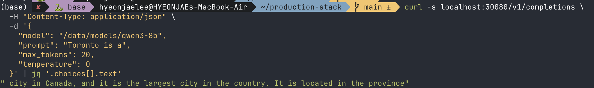

## 4. 옵저버빌리티 (Grafana 접속)

이 스택은 `kube-prometheus-stack`을 애드온으로 같이 설치하기 때문에 Prometheus + Grafana가 기본 내장돼 있다. 별도 Ingress는 안 뚫려있어서 포트포워딩으로 접속한다.

```termcast {title="~/production-stack" prompt="$ "}
$ kubectl port-forward svc/kube-prometheus-stack-grafana 3000:80 -n kube-prometheus-stack
Forwarding from 127.0.0.1:3000 -> 3000
Forwarding from [::1]:3000 -> 3000
```

브라우저에서 `http://localhost:3000` 접속. 관리자 계정 비밀번호는 Kubernetes Secret에 base64로 저장돼 있어서 디코딩해서 꺼낸다.

```termcast {title="~/production-stack" prompt="$ "}
$ kubectl get secret -n kube-prometheus-stack kube-prometheus-stack-grafana \
    -o jsonpath="{.data.admin-password}" | base64 --decode
prom-operator
```

- **URL**: `http://localhost:3000`
- **ID**: `admin`
- **PW**: `prom-operator` (chart 기본값 — `env-vars`에서 따로 오버라이드 안 함)

vLLM 대시보드는 Helm 배포 시 자동으로 프로비저닝되므로, 로그인 후 Dashboards 목록에서 바로 GPU/토큰 처리량 지표를 확인할 수 있다. 실제로 어떤 패널이 들어있는지 ConfigMap을 직접 조회해서 확인했다.

```termcast {title="~/production-stack" prompt="$ "}
$ kubectl get configmap vllm-dashboard -n kube-prometheus-stack -o jsonpath='{.data}' \
    | python3 -c "import json,sys; d=json.load(sys.stdin)
for k,v in d.items():
    dash=json.loads(v)
    print('Dashboard title:', dash.get('title'))
    for p in dash.get('panels', []): print(' -', p.get('title'))"
```


대시보드 결과

```
Dashboard title: vLLM Dashboard
 - Overview System Performance
 - Available vLLM instances
 - Average Latency
 - Request latency distribution
 - QoS Information
 - Current QPS
 - Average ITL
 - Request TTFT distribution
 - Serving Engine Load
 - Number of Running Requests
 - Number of Pending Requests
 - GPU KV Usage Percentage
 - GPU KV Cache Hit Rate
 - Number of Swapped Requests
 - Current Resource Usage
 - GPU Cache Usage (%)
 - CPU Usage (%)
 - Memory Usage (%)
 - Disk Usage (%)
```

README가 소개하는 

- Available vLLM Instances
- Request Latency Distribution
- TTFT Distribution
- Running·Pending Requests
- GPU KV Usage
- GPU KV Cache Hit Rate

 패널이 전부 실제로 배포돼 있는 걸 확인했고, 여기에 QPS·ITL·Swapped Requests·GPU-CPU-Memory-Disk 리소스 사용률까지 추가로 포함되어 있었다. Grafana 로그인 후 Dashboards 목록에서 "vLLM Dashboard"를 열면 이 전부를 한 화면에서 볼 수 있다.

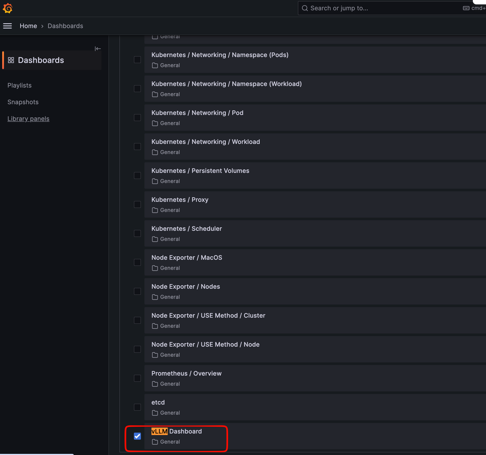


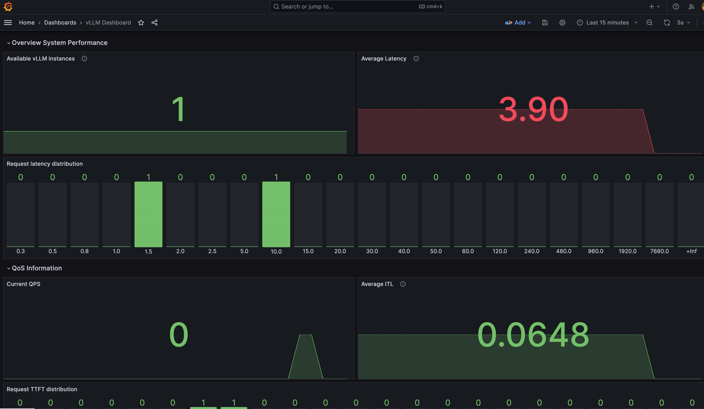

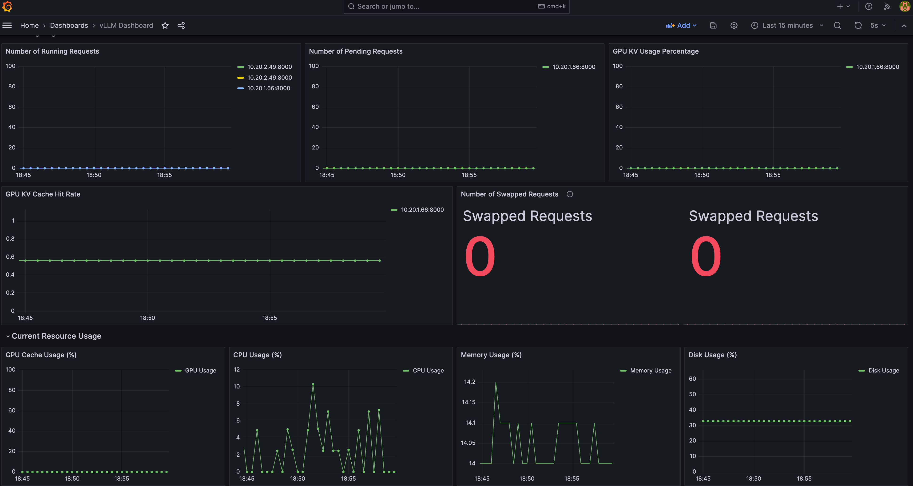

### 4.1 GPU KV Cache Hit Rate/Usage 패널이 비어있는 이유

블로그를 다시 점검하다가, "vLLM Dashboard"에서 **GPU KV Cache Hit Rate**와 **GPU KV Usage Percentage** 패널이 값 없이 비어있는 걸 발견했다. 패널이 실제로 어떤 PromQL을 쓰는지 ConfigMap에서 직접 꺼내봤다.

```termcast {title="~/production-stack" prompt="$ "}
$ kubectl get configmap vllm-dashboard -n kube-prometheus-stack -o jsonpath='{.data.vllm-dashboard\.json}' \
    | python3 -c "import json,sys
d=json.load(sys.stdin)
for p in d.get('panels', []):
    if 'GPU KV' in p.get('title',''):
        print(p['title'])
        for t in p.get('targets', []): print(' ', t.get('expr'))"
GPU KV Usage Percentage
  vllm:gpu_cache_usage_perc
GPU KV Cache Hit Rate
  vllm:gpu_prefix_cache_hits_total{endpoint="service-port"} / vllm:gpu_prefix_cache_queries_total
```

그런데 지금 떠 있는 vLLM(0.27.1)의 `/metrics`엔 이 이름이 아예 없다.

```termcast {title="~/production-stack" prompt="$ "}
$ curl -s .../metrics | grep "gpu_prefix_cache\|gpu_cache_usage_perc"
# (결과 없음 — 둘 다 없음)

$ curl -s .../metrics | grep "prefix_cache\|kv_cache_usage_perc"
vllm:prefix_cache_queries_total           3736.0
vllm:prefix_cache_hits_total              2096.0
vllm:external_prefix_cache_queries_total  1640.0
vllm:external_prefix_cache_hits_total     0.0
vllm:kv_cache_usage_perc                  0.0
```

어느 시점에 vLLM이 이 지표들 이름에서 `gpu_` 접두사를 뗐다 — 아마 cross-instance KV 공유용 `external_prefix_cache_*` 지표가 추가되면서 기존 `gpu_prefix_cache_*`를 `prefix_cache_*`로 통일한 것으로 보인다. `vllm-production-stack` 레포에 패키징된 `vllm-dashboard.json`은 그 이전 이름 그대로 남아있었다. 같은 이름을 쓰는 "GPU Cache Usage (%)" 패널(Current Resource Usage 섹션)도 같은 이유로 같이 비어있었다.

ConfigMap을 직접 패치해서 실제로 고쳐지는지 확인했다.

```termcast {title="~/production-stack" prompt="$ "}
$ kubectl get configmap vllm-dashboard -n kube-prometheus-stack -o jsonpath='{.data.vllm-dashboard\.json}' > dashboard.json
$ sed -i '' \
    -e 's/vllm:gpu_prefix_cache_hits_total/vllm:prefix_cache_hits_total/' \
    -e 's/vllm:gpu_prefix_cache_queries_total/vllm:prefix_cache_queries_total/' \
    -e 's/vllm:gpu_cache_usage_perc/vllm:kv_cache_usage_perc/g' \
    dashboard.json

$ kubectl patch configmap vllm-dashboard -n kube-prometheus-stack \
    --type merge --patch-file=<(python3 -c "import json; print(json.dumps({'data':{'vllm-dashboard.json': open('dashboard.json').read()}}))")
configmap/vllm-dashboard patched
```

`grafana_dashboard=1` 라벨 덕분에 `grafana-sc-dashboard` 사이드카가 별도 재시작 없이 바로 반영했다.

```termcast {title="~/production-stack" prompt="$ "}
$ kubectl logs -n kube-prometheus-stack -l app.kubernetes.io/name=grafana -c grafana-sc-dashboard --tail=5
{"msg": "Writing /tmp/dashboards/vllm-dashboard.json (ascii)", "level": "INFO"}
```

고친 쿼리를 Prometheus에 직접 쏴서 실제로 값이 나오는지 확인했다.

```termcast {title="local" prompt="$ "}
$ curl -s --data-urlencode 'query=vllm:prefix_cache_hits_total{endpoint="service-port"} / vllm:prefix_cache_queries_total' \
    http://localhost:19090/api/v1/query | jq '.data.result[0].value'
[1788597948.265, "0.5610278372591007"]

$ curl -s --data-urlencode 'query=vllm:kv_cache_usage_perc' \
    http://localhost:19090/api/v1/query | jq '.data.result[0].value'
[1788597948.807, "0"]
```

**GPU KV Cache Hit Rate가 56.1%로 정상 조회됐다.** GPU KV Usage Percentage는 그 시점에 처리 중인 요청이 없어서 0으로 나온 것뿐 — 지표 자체는 살아있다.


## 5. LMCache로 KV 캐시 CPU 오프로딩 켜보기

GPU 메모리의 KV 캐시를 CPU로 오프로드하는 LMCache 튜토리얼이다. 지금 떠 있는 EKS 클러스터에 그대로 적용해봤다.

### 5.1 Grafana에 LMCache 전용 지표가 있는지 먼저 확인

KV 캐시 히트율을 Grafana에서 볼 수 있는지 궁금해서 기존 `vllm-dashboard` ConfigMap의 쿼리를 뒤져봤다.

```termcast {title="~/production-stack" prompt="$ "}
$ kubectl get configmap vllm-dashboard -n kube-prometheus-stack -o jsonpath='{.data}' \
    | grep -io "lmcache[a-z_]*\|cpu_offload[a-z_]*"
# (결과 없음)
```

기존 "vLLM Dashboard"의 `GPU KV Usage Percentage`/`GPU KV Cache Hit Rate` 패널은 **vLLM 엔진 자체의 GPU KV 캐시** 지표만 보여준다. LMCache의 CPU 오프로딩 계층 지표(`lmcache:` prefix)는 별도다. 레포를 뒤져보니 이미 전용 대시보드가 준비돼 있었다.

```termcast {title="~/production-stack" prompt="$ "}
$ grep -rln "lmcache" /Users/hyeonjaelee/production-stack --include="*.md" -i | grep -i grafana
helm/README.md   # "LMCache Dashboard" 섹션 — Average TTFT, Cache hit rate, Retrieve speed,
                 # Local CPU cache usage, 총 요청 토큰 수, 총 히트 토큰 수 6개 패널

$ find /Users/hyeonjaelee/production-stack -iname "*lmcache-dashboard*"
helm/dashboards/lmcache-dashboard.json
```

이 chart의 `dashboards.yaml` 템플릿은 `grafanaDashboards.enabled=true` **그리고** `cacheserverSpec.enabled=true`일 때만 `lmcache-dashboard.json`을 자동으로 프로비저닝한다. 그런데 EKS 튜토리얼은 그 메커니즘을 안 쓰고, `vllm-production-stack.tf`에서 `vllm-dashboard.json`을 정적 파일로 읽어 직접 ConfigMap을 만드는 방식이었다. `lmcache-dashboard.json`은 아예 복사돼 있지 않았다. 그래서 같은 방식으로 하나 더 추가했다.

```diff
# vllm-production-stack.tf
+ resource "kubernetes_config_map" "lmcache_dashboard" {
+   count = var.enable_vllm ? 1 : 0
+   metadata {
+     name      = "lmcache-dashboard"
+     namespace = "kube-prometheus-stack"
+     labels = { grafana_dashboard = "1" }
+   }
+   data = {
+     "lmcache-dashboard.json" = file("${path.module}/config/lmcache-dashboard.json")
+   }
+   depends_on = [helm_release.vllm_stack]
+ }
```

```bash
cp helm/dashboards/lmcache-dashboard.json tutorials/terraform/eks/config/lmcache-dashboard.json
```

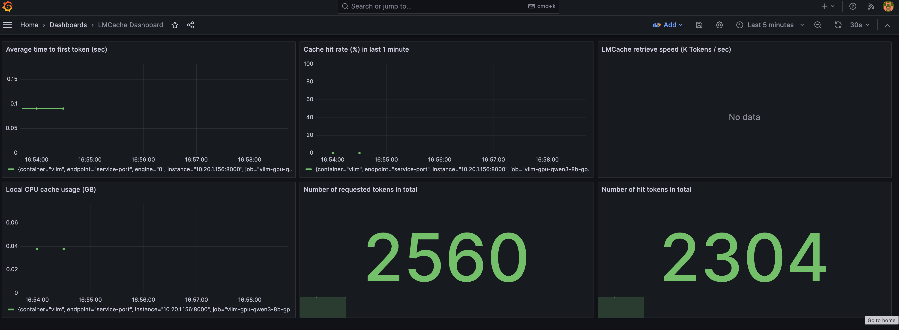


### 5.2 "latest" 대신 핀 고정

LMCache 튜토리얼은 이미지를 `lmcache/vllm-openai:latest`로 쓰라고 하지만 실제 버전을 찾아서 고정한다.

- `latest`와 `v0.5.4`가 같은 시각·같은 크기라 사실상 동일 이미지 — `v0.5.4`로 핀 고정

```termcast {title="local" prompt="$ "}
$ curl -s "https://hub.docker.com/v2/repositories/lmcache/vllm-openai/tags?page_size=100" \
    | python3 -c "import json,sys; d=json.load(sys.stdin)
for r in d['results']:
    if 'rc' not in r['name'] and 'nightly' not in r['name']: print(r['name'], r['last_updated'])"
latest        2026-08-24T18:57:22Z
v0.5.4-cu129  2026-08-24T19:28:49Z
v0.5.4        2026-08-24T18:57:24Z   # ← latest와 동일 시각/크기, 이걸 고정해서 사용
v0.5.3        2026-08-05T22:35:30Z
```


### 5.3 `gpu-qwen3-8b-ingress.tpl`에 `lmcacheConfig` 추가

```diff
  modelSpec:
  - name: "qwen3-8b-gpu"
-   repository: "vllm/vllm-openai"
-   tag: "v0.8.5.post1"
+   repository: "lmcache/vllm-openai"
+   tag: "v0.5.4"
    modelURL: "/data/models/qwen3-8b"
    replicaCount: 1
-   requestMemory: "8Gi"
+   requestMemory: "12Gi"
    requestGPU: 1
-   limitMemory: "24Gi"
+   limitMemory: "28Gi"   # LMCache CPU 오프로딩 버퍼만큼 여유 확보
    ...
    vllmConfig:
      dtype: "bfloat16"
      extraArgs:
        - "--gpu-memory-utilization=0.9"
        - "--max-model-len=16384"
+   lmcacheConfig:
+     enabled: true
+     cpuOffloadingBufferSize: "12"   # GB
```

g6.2xlarge 노드가 32GiB RAM인데, CPU 오프로딩 버퍼(12GB) + 모델 로딩 여유를 감안해서 `limitMemory`를 24Gi → 28Gi로 올렸다.

### 5.4 LMCache 활성화 확인

pod 로그에서 LMCache 엔진 초기화를 확인했다.

```termcast {title="~/production-stack/tutorials/terraform/eks" prompt="$ "}
$ kubectl logs -n vllm <pod> | grep LMCache | head -5
LMCache INFO: Creating LMCacheEngine instance vllm-instance
LMCache INFO: Creating LMCacheEngine with config: {'chunk_size': 256, 'local_cpu': True,
  'max_local_cpu_size': 12.0, ...}
LMCache INFO: Created backend: LocalCPUBackend (LocalCPUBackend)
LMCache INFO: LMCache initialized for role KVConnectorRole.WORKER with version 0.5.4-g3e11b8ed,
  vllm version 0.27.1, ...
```

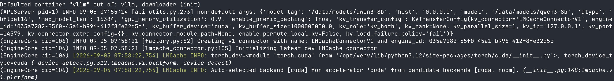


`max_local_cpu_size: 12.0`이 우리가 설정한 버퍼 크기와 일치. 그런데 같은 prompt로 두 번 요청을 보내도 캐시 히트가 0이었다.

```termcast {title="~/production-stack/tutorials/terraform/eks" prompt="$ "}
$ kubectl logs -n vllm <pod> | grep "LMCache hit tokens"
LMCache INFO: Reqid: cmpl-...-0, Total tokens 13, Inference Engine computed tokens: 0, LMCache hit tokens: 0, need to load: 0
LMCache INFO: Reqid: cmpl-...-1, Total tokens 13, Inference Engine computed tokens: 0, LMCache hit tokens: 0, need to load: 0
```

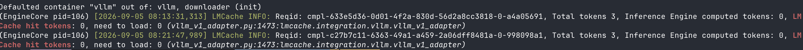

원인은 vLLM 자체의 prefix caching이 꺼져있어서였다 (`enable_prefix_caching=False`). LMCache는 vLLM의 KV 커넥터로 붙는 구조라, vLLM 스케줄러가 prefix caching으로 "재사용 가능한 블록"을 인식해야 그 조회를 LMCache 쪽으로 넘긴다 — prefix caching이 꺼져있으면 LMCache까지 요청이 아예 안 간다.

```diff
    extraArgs:
      - "--gpu-memory-utilization=0.9"
      - "--max-model-len=16384"
+     - "--enable-prefix-caching"   # 이게 없으면 LMCache가 조회조차 안 됨
```


### 5.5 최종 확인(실제 LMCache 히트 재현하기)

`--enable-prefix-caching`을 켰는데도 처음엔 히트가 안 잡혔다. 원인은 **LMCache가 `chunk_size`(기본 256토큰) 단위로만 저장·조회**한다는 점 — 짧은 테스트 prompt(28토큰)는 chunk 하나도 못 채워서 애초에 저장 자체가 안 일어났다. vLLM 엔진의 `/metrics`를 직접 까봐서 확인했다.

```termcast {title="~/production-stack/tutorials/terraform/eks" prompt="$ "}
$ kubectl port-forward svc/vllm-gpu-qwen3-8b-gpu-engine-service 18000:80 -n vllm &
$ curl -s http://localhost:18000/metrics | grep "lmcache:num_stored_tokens_total"
lmcache:num_stored_tokens_total{...} 0.0   # 28토큰짜리 prompt로는 저장 자체가 안 됨
```

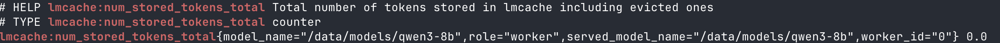

280단어 이상(≈440 토큰)짜리 긴 prompt로 다시 테스트했다.

```termcast {title="local" prompt="$ "}
$ curl -s ${vllm_api_url}/completions \
  -H "Content-Type: application/json" \
  -d '{"model":"/data/models/qwen3-8b","prompt":"<439-token prompt>","max_tokens":10}'

$ curl -s http://localhost:18000/metrics | grep num_stored_tokens_total
lmcache:num_stored_tokens_total{...} 256.0   # 정확히 chunk_size(256) 하나가 저장됨
```


같은 prompt로 두 번째 요청을 보내고 pod 로그의 요청별 상세 라인을 확인했다.

```termcast {title="~/production-stack/tutorials/terraform/eks" prompt="$ "}
$ kubectl logs -n vllm <pod> | grep "LMCache hit tokens"
Reqid: ...-b0aefc6a, Total tokens 439, Inference Engine computed tokens: 432, LMCache hit tokens: 256, need to load: 0
```

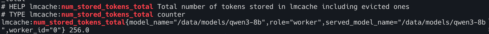

`**LMCache hit tokens: 256**` — 두 번째 요청에서 정확히 1 chunk를 LMCache의 CPU 오프로딩 계층에서 그대로 가져왔다. GPU 메모리가 아니라 CPU RAM(우리가 설정한 12GB 버퍼)에 저장돼 있던 KV 캐시가 재사용된 것을 수치로 확인했다.


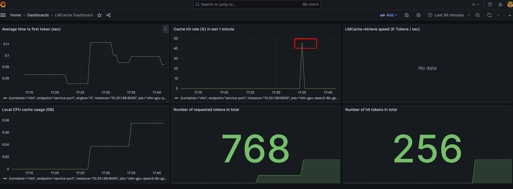

