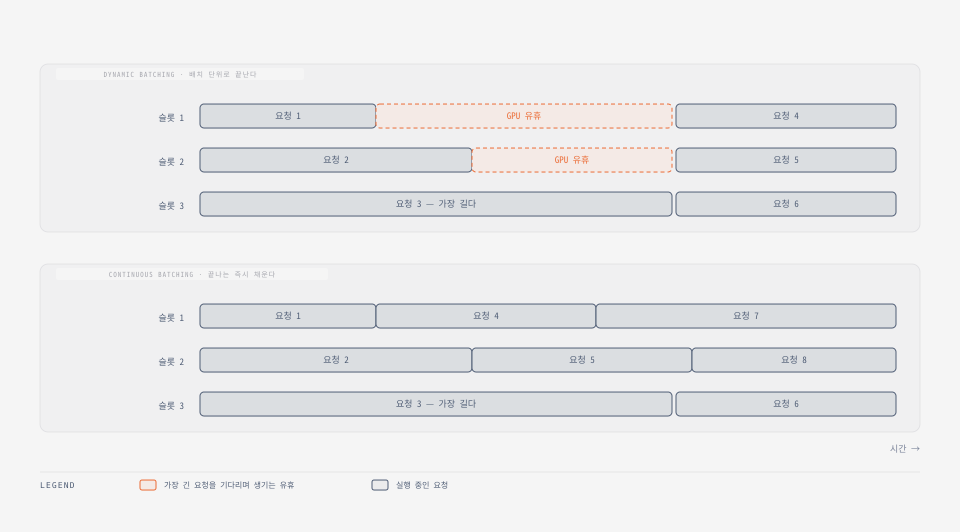
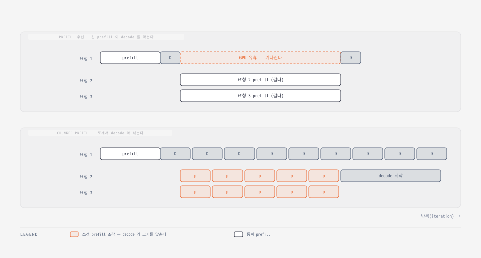
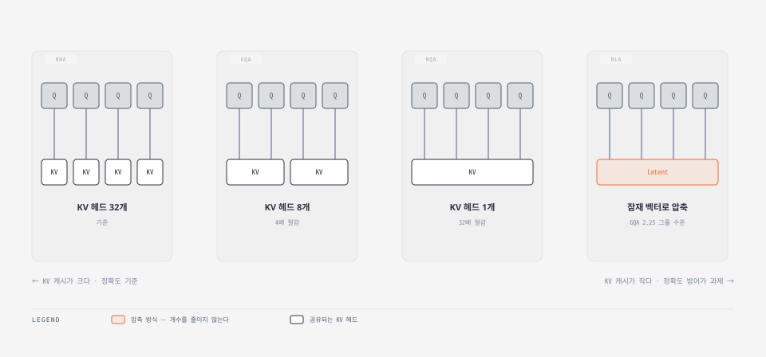
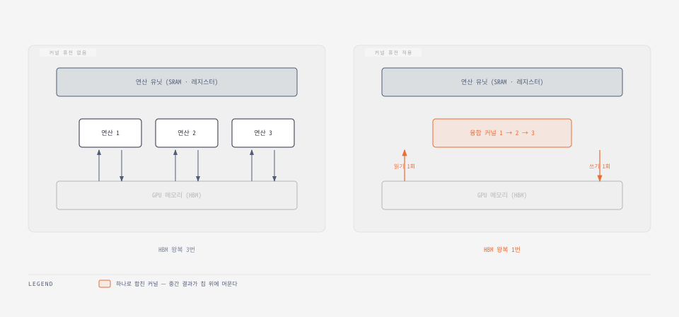
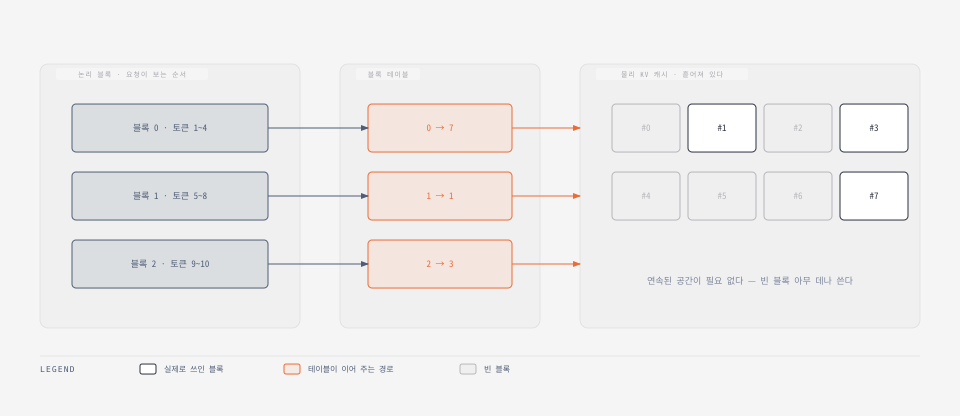
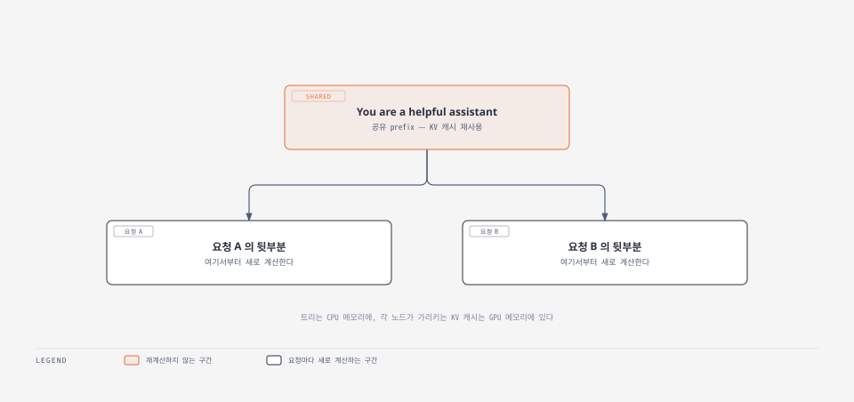
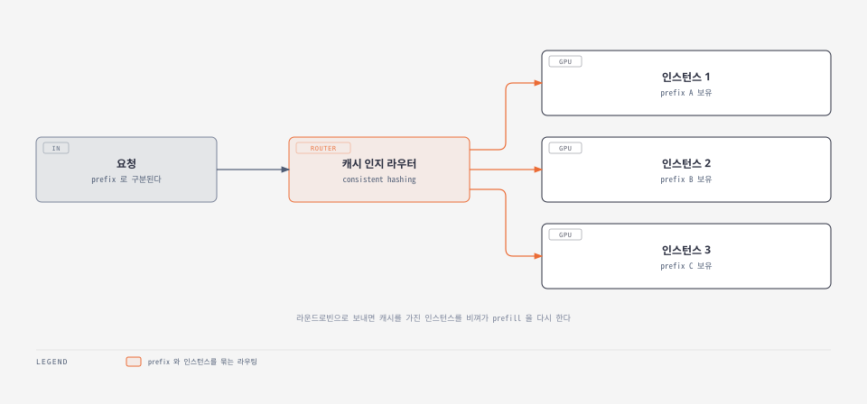

[앞 글](../llm-challenges-when-serving-llm/)에서 병목이 어디에 있는지를 봤다. 이번에는  **병목을 실제로 풀어보자.** 

## 1. 요청 배칭과 스케줄링

### 왜 배칭이 필요한가

prefill은 프롬프트 토큰을 한꺼번에 처리해 연산 강도가 높다. (앞서 말했듯이 연산강도가 높다는 것은 같은 가중치를 한 번 읽고 그것으로 훨씬 많은 토큰을 처리한다)

**문제는 decode다.** 토큰 하나를 만들려고 수십억 개 파라미터를 전부 읽어야 하니 대역폭만 축내고 연산 유닛은 유휴상태이다. 

여기서 배칭이 들어간다. 요청 세 개를 묶으면 **가중치는 여전히 한 번만 읽으면서 토큰은 세 개를 만든다.** 연산 강도를 인위적으로 끌어올린다.

그래서 **배칭은 decode에서 효과가 크고 prefill에서는 거의 없다.** 프롬프트가 아주 짧지 않은 한(대략 1,024 토큰 미만) prefill은 이미 혼자서 GPU 연산을 채운다.

### 동적 배칭

오프라인이라면 요청을 미리 모아 한 번에 보내면 된다. 온라인은 그럴 수 없다. **요청이 언제 올지 모른다.**

배치가 다 찰 때까지 기다리는 것이 **정적 배칭**인데 온라인에서는 위험하다. 배치 크기 10에서 9개가 1초 안에 도착하고 10번째가 5분 뒤에 온다면, 앞의 9개가 5분을 기다린다.

**동적 배칭**은 여기에 상한을 둔다. 파라미터가 둘이다.

- **배치 크기** — 몇 개까지 묶을 것인가
- **최대 대기 시간** — 채워지지 않아도 얼마까지만 기다릴 것인가

둘 중 하나라도 걸리면 즉시 보낸다. 나룻배로 치면 **정원 10명, 최대 5분 대기**다. 5분 안에 8명만 오면 8명으로 출발하고, 5분 전에 10명이 차면 바로 출발한다.

튜닝 방향은 **SLA를 지키는 선에서 배치 크기를 최대한 키우는 것**이다. 다만 배치를 키우면 처리 지연이 늘고 메모리도 함께 늘어 결국 한계에 부딪힌다.

### 연속 배칭

동적 배칭은 일반 ML에서는 잘 듣지만 **LLM에서는 부족하다.** 입력과 출력 길이가 제각각이라 같은 배치 안 요청들의 소요 시간이 크게 다르기 때문이다.

배치 단위로 결과를 돌려주니 **가장 느린 요청이 전체 병목이다.** 나룻배가 가장 먼 집까지 데려다주고 돌아와야 다음 손님을 태우는 것과 같다.

**연속 배칭**은 배치를 기다리지 않는다. 실행 중인 요청 하나가 끝나면 **대기 중인 요청이 즉시 그 자리에 들어간다.**



10인승 배 한 척 대신 **1인승 배 열 척**을 굴리는 셈이다. 각자 목적지가 달라도 낭비가 없고, 한 사람을 내려주고 돌아오면 바로 다음 사람을 태운다.

최대 대기 시간이라는 파라미터 자체가 없어진다. 대신 **배치 크기**는 여전히 상한으로 관리한다.

여기에 파라미터가 하나 더 붙는다. **최대 배치 토큰 수**다. 배치 크기가 요청 단위 제어라면 이쪽은 토큰 단위 제어다.

입력 길이 편차가 크기 때문에 필요하다. **20토큰짜리 10개와 10만 토큰짜리 2개는 완전히 다른 작업량**인데, 요청 수만 세면 이 차이를 못 잡는다.

```bash
vllm serve \
  Qwen/Qwen2.5-7B-Instruct \
  --max-num-batched-tokens 4096 \
  --max-num-seqs 128
```

두 파라미터는 단계별로 다르게 작동한다. **prefill에서는 토큰 수가, decode에서는 배치 크기가 제약이 된다.** 토큰 수를 너무 낮게 잡으면 prefill에서 GPU 연산을 채우지 못한다.

### chunked prefill

연속 배칭도 놓친 것이 있다. **prefill과 decode는 성격이 다른 작업**인데 같은 반복 안에서 섞인다는 점이다.

요청 1이 decode 중인데 요청 2가 도착해 prefill을 하려 한다면 무엇을 먼저 할까. 보통 **prefill을 우선한다.** TTFT가 사용자 체감을 좌우하기 때문이다.

문제는 그 사이 요청 1이 통째로 멈춘다는 것이다. **프롬프트가 길수록 대기가 길어진다.**



**chunked prefill**은 긴 prefill을 decode와 비슷한 크기로 쪼갠다. 그러면 요청 1은 계속 토큰을 만들고, 요청 2·3은 자기 조각을 처리하며 같은 반복에 공존한다.

거저 얻는 것은 아니다.


| 지표            | 변화                           |
| ------------- | ---------------------------- |
| ITL (토큰 간 지연) | **개선** — decode가 막히지 않는다     |
| TTFT          | **악화** — prefill 작업량이 늘어난다   |
| 종단 지연         | 대체로 소폭 악화 (조각 처리 오버헤드)       |
| 처리량           | **개선** — 유휴를 메워 GPU 활용률이 오른다 |


조각 크기도 튜닝 대상이다. **너무 크면 쪼개는 의미가 없고, 너무 작으면 오버헤드만 늘고 GPU를 못 채운다.**

연속 배칭은 수년째 프로덕션 표준이고, chunked prefill도 롱 컨텍스트 워크로드에서 널리 쓰인다.

## 2. 어텐션 확장과 커널 최적화

### KV 캐시를 줄이는 어텐션

decode 단계에서 KV 캐시는 **매 반복마다 HBM에서 온칩으로 실려 온다.** 앞 글에서 본 대역폭 병목이 정확히 여기다.

KV 캐시를 줄이면 두 가지를 동시에 얻는다. **대역폭 압박이 줄고, 남는 공간만큼 배치를 키울 수 있다.**



**MHA**는 원형이다. 질의 헤드마다 전용 K·V 헤드를 둔다. 7B는 보통 32개, 70B는 64개인데 **KV 캐시가 가장 크다.**

**MQA**는 반대편 끝이다. 모든 질의가 K·V 헤드 하나를 공유해 캐시가 32배·64배로 줄지만, **정확도 손실이 크다는 것이 확인됐다.**

**GQA**가 절충이다. 질의 헤드를 그룹으로 묶고 그룹마다 K·V를 공유한다. 지금 많은 모델이 쓰는 방식이다.

어떤 것을 쓰는지는 `config.json`으로 바로 확인된다.

```json
{
  "num_attention_heads": 32,
  "num_key_value_heads": 32
}
```

Llama 2는 둘이 같아 **MHA**다. Llama 3는 `num_key_value_heads`가 8로 줄어 **GQA**이고, `32 ÷ 8 = 4`이므로 KV 헤드 하나를 질의 헤드 4개가 공유한다.

**MLA**는 접근이 다르다. 개수를 줄이는 대신 **잠재 벡터로 압축한다.** DeepSeek 논문은 "GQA 2.25 그룹 수준의 캐시로 MHA보다 강한 성능"을 주장한다.

다만 이것들은 **모델 아키텍처 수준의 선택**이다. 서빙 단계에서 갈아끼울 수 있는 것이 아니라 어떤 모델을 쓸지와 함께 결정된다.

### 커널 퓨전

커널은 GPU에서 도는 작은 전용 프로그램이다. 행렬 곱이나 softmax 같은 연산을 수행한다.

**커널 퓨전**은 여러 연산을 하나로 합친다. 목적은 하나다. **중간 결과를 HBM에 썼다가 다시 읽는 왕복을 없애는 것.**



합치면 중간 결과가 레지스터나 shared memory에 머문다. 앞 글의 데이터 이동 경로에서 **가장 느린 구간을 건너뛰는** 셈이다.

### FlashAttention

**FlashAttention**은 이 발상을 어텐션에 특화해 밀어붙인 것이다. 출발점은 "어텐션이 메모리 대역폭에 묶여 있다"는 진단이고, 해법은 **알고리즘을 하드웨어 I/O에 맞추는 것**이다.

핵심은 **타일링(tiling)**이다. 큰 행렬을 느린 HBM에 통째로 만들지 않고 작은 조각으로 쪼개, **모든 계산을 SRAM 안에서 끝내고 최종 결과만 HBM에 쓴다.**

여기에 어텐션 연산 전체를 융합하고 online softmax 같은 기법을 더했다. FlashAttention 2와 3은 핵심 아이디어를 유지하면서 **GEMM과 softmax 계산을 겹치는** 식으로 H100 세대의 활용률을 끌어올렸다.

실무 관점의 결론은 단순하다. **효율적인 커널을 쓰라는 것.** FlashInfer, xFormers, Triton 등이 있다.

```bash
pip install vllm==0.8.5.post1
pip install flashinfer-python==0.2.2

export VLLM_ATTENTION_BACKEND=FLASHINFER
export VLLM_USE_FLASHINFER_SAMPLER=1
export VLLM_FLASHINFER_FORCE_TENSOR_CORES=1
```

SGLang은 플래그 하나로 바꾼다.

```bash
--attention-backend {flashinfer|fa3|triton|torch_native|FlashMLA}
```

어떤 커널이 좋은지는 하드웨어와 입출력 특성에 따라 달라서 **실험이 필요하다.** 다만 서빙 엔진들이 기본값을 잘 골라 둔다. SGLang은 Hopper가 아닌 장비(A100·A40)에는 FlashInfer를, Hopper(H100·H200)에는 FlashAttention3을 기본으로 쓴다.

**기본값으로 시작해 다른 최적화를 먼저 하고, 커널 교체는 나중에 손대는 편**이 실용적이다.

### PagedAttention

커널이 계산을 다룬다면 **PagedAttention은 메모리 배치를 다룬다.** 앞 글에서 본 대로 전통적 방식은 최악의 경우를 미리 잡아 파편화를 만든다.



OS 페이징에서 온 발상이다. KV 캐시를 **고정 크기 블록으로 나누고 블록 테이블로 매핑**한다. 그러면 **연속된 메모리가 필요 없다.**

논문의 수치가 이 기법의 전부를 말한다. PagedAttention이 없으면 KV 캐시 메모리의 **20.4~38.2%만 실제 토큰 상태 저장에 쓰이고**, 적용하면 **낭비가 거의 0에 가까워진다.**

지금은 연속 배칭과 마찬가지로 **거의 모든 상황에서 켜 두는 기본 기능**이다.

## 3. 모델 압축


| 기법      | 하는 일                                    |
| ------- | --------------------------------------- |
| **양자화** | 파라미터 정밀도를 낮춰 메모리에 더 많이 담고 행렬 연산을 빠르게 한다 |
| **증류**  | 큰 teacher 모델의 지식을 작은 student 모델로 옮긴다    |
| **프루닝** | 중복된 가중치나 어텐션 헤드를 잘라낸다                   |


이 중 **양자화가 압도적으로 실용적이다.** 빠르고, 효과가 있고, 학습 파이프라인을 거의 건드리지 않는다.

### 양자화 

정밀도를 낮추면 오차가 생긴다. 성격이 다른 둘이다.

**반올림 오차**는 값을 정확히 표현할 수 없어 가까운 값으로 옮길 때 생긴다. FP32의 `7.6`을 INT8로 바꾸면 `8`이 되고 오차는 `0.4`다.

**클램핑 오차**는 값이 범위를 벗어날 때 생긴다. FP8이 ±448까지만 표현한다면 `1,000`은 `448`로 잘린다. `**4,096`이 `448`이 되는 식의 왜곡**이라 훨씬 파괴적이다.

그래서 현대 기법은 하드 클램핑을 피하고 **스케일링**을 쓴다. 배율을 적용해 값 범위를 압축하면, 반올림 오차는 조금 생겨도 극단값이 잘려나가지 않는다.

### 숫자를 담는 형식

부동소수점은 **부호 1비트 + 지수 + 가수**로 구성된다. 지수는 표현 범위를, 가수는 정밀도를 정한다.


| 형식   | 전체  | 부호  | 지수    | 가수     | 대략적 범위 |
| ---- | --- | --- | ----- | ------ | ------ |
| FP32 | 32  | 1   | 8     | 23     | ±10³⁸  |
| FP16 | 16  | 1   | **5** | **10** | ±10⁻⁵  |
| BF16 | 16  | 1   | **8** | **7**  | ±10³⁸  |


같은 16비트인데 **FP16은 정밀도를, BF16은 범위를 택했다.** BF16은 지수 8비트로 FP32와 범위가 같아서, FP32에서 변환할 때 **클램핑 위험이 없고 정밀도만 잃는다.** 학습에 BF16이 잘 맞는 이유다.

정수형과 부동소수점형은 **값의 분포가 다르다.** INT8은 전 구간에 균등하게 배치되고, FP8은 **0 근처에 촘촘하고 극단으로 갈수록 성기다.**

```bash
값 = (−1)^부호 × (1 + 가수) × 2^(지수 − bias)
```

지수가 커질수록 표현 가능한 값의 간격이 벌어지기 때문이다. `1.0`과 `2.0` 사이에는 촘촘하지만 `1,000,000`과 `2,000,000` 사이에서는 간격이 128 이상으로 벌어진다.

**모델 파라미터 분포에 따라 유리한 형식이 갈린다.**

FP8은 두 변형이 있고, 추론에는 정밀도가 나은 **E4M3**을 주로 쓴다.


| 형식             | 전체  | 부호  | 지수  | 가수    |
| -------------- | --- | --- | --- | ----- |
| **FP8 (E4M3)** | 8   | 1   | 4   | **3** |
| FP8 (E5M2)     | 8   | 1   | 5   | 2     |


### W4A16 과 W8A8

`W4A16`, `W8A8` 같은 표기는 **가중치(W)와 활성값(A)의 비트 폭**이다.

**가중치만 양자화**하면 모델 크기와 데이터 이동은 줄지만 **계산은 빨라지지 않는다.** 연산 직전에 다시 고비트로 되돌리기 때문이고, 오히려 그 과정에서 오버헤드가 붙는다.

이를 피하려면 **혼합 정밀도 커널**이 필요하다. Ampere용 Marlin, Hopper용 Machete 같은 커널은 INT4 행렬과 FP16 행렬을 **역양자화 없이 한 번에** 곱한다.

**활성값까지 양자화**하면 연산 자체가 빨라진다. 대신 복잡해진다. 활성값은 입력에 따라 계속 바뀌므로 **스케일링 시점**을 정해야 한다.

- **동적 스케일링** — 추론 중에 배율을 계산한다. 정확하지만 느리다
- **정적 스케일링** — 캘리브레이션 데이터로 미리 계산한다. 빠르지만 덜 정확하다

프로덕션에서는 가중치 전용은 GPTQ·AWQ 기반 **W4A16**, 가중치+활성값은 **W8A8**(INT8에서 FP8로 이동 중)이 주로 쓰인다.


|                  | W4A16                | W8A8                    |
| ---------------- | -------------------- | ----------------------- |
| 크기·데이터 이동 감소     | **75%** (1/4)        | 50% (1/2)               |
| 연산 FLOPS         | 변화 없음                | **2배**                  |
| prefill (연산 바운드) | 변화 없음                | **개선**                  |
| decode (대역폭 바운드) | **개선** (낮은 배치에서 유리)  | 개선 (높은 배치에서 유리)         |
| 적합한 곳            | 긴 생성 · 지연 민감 · 낮은 배치 | 롱 컨텍스트 · 높은 처리량 · 높은 배치 |


고르는 기준은 **병목이 어디냐**다. 모델이 커서 4배 압축해야 GPU 한 장에 들어간다면 W4A16이다. 반대로 배치가 높으면 활성값 양자화의 연산 이득이 메모리 절감을 앞선다.

**W8A8로 SLA를 맞출 수 있다면 W4A16까지 갈 필요 없이 배치를 더 키워 비용을 낮추는 쪽**이 낫다.

### 실측이 보여주는 것

Qwen2.5-7B-Instruct를 원본·GPTQ W4A16·FP8 W8A8 세 가지로 벤치마크한 결과의 경향은 이렇다.

**낮은 동시성에서는 W4A16이 압승이다.** 지연과 처리량 모두 원본 대비 약 300% 개선되고 FP8 W8A8은 약 150%다. 낮은 배치에서는 대역폭이 병목이라 **가중치를 4배 줄인 효과가 그대로 나온다.**

**동시성이 올라가면 뒤집힌다.** W4A16은 계산이 여전히 16비트인 데다 역양자화 오버헤드까지 붙어 **TTFT가 원본보다 느려지기도 한다.** 반면 FP8 W8A8은 활성값도 양자화돼 계산이 실제로 빨라진다.

챗봇이나 에이전트 흐름처럼 **지연이 중요하면 W4A16**, 처리량이 중요하면 **W8A8**이다.

### 하드웨어가 먼저 걸린다

**FP8을 모든 GPU가 지원하지는 않는다.** NVIDIA 계열에서는 Hopper와 Blackwell만 지원한다. A100 이하만 있다면 FP8의 성능 이득을 온전히 못 받는다.

FP4는 더 갈린다. **Blackwell(B200)은 NVFP4·MXFP4를 네이티브로 지원**하지만 Hopper(H100·H200)는 FP8 Tensor Core 중심이다. MXFP4로 배포되는 GPT-OSS 계열은 Blackwell에서 가장 잘 맞고, Ampere 이하라면 **아예 다른 모델을 골라 직접 양자화하는 편**이 낫다.

### 다른 대상 — KV 캐시

지금까지의 양자화는 대부분 **FFN 층**이 대상이다. KV 캐시도 양자화할 수 있다.

KV 캐시를 줄이면 GPU 메모리가 남아 **배치를 키우고 prefix 캐시도 더 많이 담는다.** 다만 **지연은 크게 줄지 않는다.** 어텐션 계산이 고정밀도로 남아 있으면 결국 역양자화가 필요해서다.

효과를 온전히 보려면 **양자화된 어텐션 커널과 함께 써야 한다.** 순서는 가중치·활성값 양자화(예: FP8 W8A8)로 시작하고, 롱 컨텍스트나 무거운 decode에서 막힐 때 KV 캐시 양자화를 더하는 식이다.

**GGUF**는 성격이 다르다. GPU가 아니라 **CPU와 Apple Silicon에서 돌리는 데 초점**을 맞춘 형식이고, 로컬·저사양 배포에서 인기가 있다.

### 정확도라는 최종 관문

성능 이득이 아무리 커도 **품질이 무너지면 배포할 수 없다.** 다행히 GPTQ W4A16, AWQ, FP8 양자화 모두 실제 정확도 지표에서 손실이 미미하다는 결과가 쌓여 있다.

방향을 뒤집어 볼 수도 있다. **FP16 8B 대신 FP8 12B를 배포하면** 비슷한 지연에 처리량은 더 높고 정확도까지 낫다.

경향도 알려져 있다. **모델이 클수록 가중치·KV 캐시 양자화에 정확도가 민감**하다. KV 캐시 양자화는 정확도 타격은 작지만 성능 이득도 작아 **우선순위는 뒤**다.

### 증류

**증류**는 결이 다르다. 원본을 줄이는 것이 아니라 **작은 모델을 새로 학습**시킨다. teacher의 출력을 student가 흉내 내게 하는 방식이다.

출력 토큰(hard label)만이 아니라 **확률 분포 logits와 손실까지** 쓰기 때문에, **teacher 모델에 완전한 접근이 필요하다.** API로 출력만 받아서는 안 된다.

DeepSeek R1이 좋은 예다. 원본은 671B인데 Llama·Qwen 계열로 증류한 1.5B~70B 모델이 함께 공개됐다. **서빙 관점에서 10배 이상 작아진다.**


| 벤치마크                 | R1-671B | R1-Distill-Llama-70B |
| -------------------- | ------- | -------------------- |
| MATH-500 pass@1      | 97.3    | 94.5                 |
| GPQA Diamond pass@1  | 71.5    | 65.2                 |
| LiveCodeBench pass@1 | 65.9    | 57.5                 |


|        | 양자화                 | 증류                         |
| ------ | ------------------- | -------------------------- |
| 정확도 손실 | 낮다 (보통 3% 이하)       | **훨씬 크다**                  |
| 속도 이득  | 1.5~3배              | **더 크다** (정확도와 맞바꿔)        |
| 난이도    | 매우 쉽다 — 가중치만 있으면 된다 | **어렵다** — 학습 비용이 원본의 10%까지 |


실용적인 순서는 명확하다. **이미 증류 모델이 있으면 평가해 보고, 기준을 넘으면 그것으로 간다.** 거기에 양자화를 더하면 더 좋다. 증류 모델이 없다면 **양자화가 먼저다.**

### 프루닝

셋 중 가장 덜 쓰인다. 발상은 **모델이 과도하게 파라미터화돼 있으니 중복을 잘라내자**는 것이다.

전체 구간을 들어내는 **구조적 프루닝**과 개별 가중치를 지우는 **비구조적 프루닝**이 있고, 그 중간에 **2:4 희소성**이 있다. 연속된 값 4개마다 2개를 0으로 만들어 **50% 희소도**를 만드는 방식이다.

이 패턴이 의미 있는 이유는 하드웨어 지원 때문이다. **Ampere와 Hopper의 sparse Tensor Core가 이 형태를 가속**해서, 50% 희소도가 행렬 곱 속도를 곧바로 두 배로 만든다.

Neural Magic의 Sparse Llama 3.1은 희소성만으로 **정확도 98% 회복, 처리량 30% 증가, 지연 20% 감소**를 주장한다.

## 4. Prefix 캐싱

일반적인 요청 캐싱은 LLM에서 잘 안 듣는다. **사람이 쓰는 자유 문장이 입력**이라, 같은 질문도 표현이 제각각이어서 해시가 거의 안 맞는다.

**prefix 캐싱**은 전체가 아니라 **앞부분만 맞춘다.** 일치하는 구간의 KV 캐시는 재계산하지 않고 그대로 가져다 쓴다.



prefix 캐싱을 끄면 요청이 끝날 때 그 KV 캐시가 전부 버려진다. 켜면 **공간이 있는 한 GPU 메모리에 남고**, 부족해지면 보통 LRU로 밀어낸다.

**RadixAttention**은 대표적인 구현이다. SGLang과 함께 나왔고 **radix 트리**로 prefix 문자열을 추적한다. 트리는 CPU 메모리에, 각 노드가 가리키는 KV 캐시는 GPU 메모리에 있다.

### 언제 효과가 큰가

간단한 예로 한계를 먼저 보자.

```bash
프롬프트 1: Hi, what is the weather like today?
프롬프트 2: Hi, what is the weather like now?     ← 앞부분 재사용 O
프롬프트 3: What is the weather like today?        ← "Hi" 가 없어 처음부터 재계산
```

빈약해 보이지만 **실제 프로덕션에서는 두 상황에서 크게 듣는다.**

**멀티턴 채팅**이 첫째다. 대화가 이어지면 이전 기록이 새 질문 앞에 통째로 붙는다. 캐싱이 없으면 **매번 앞부분 전체를 다시 prefill**해야 하고, 대화가 길어질수록 TTFT가 계속 늘어난다.

**롱 컨텍스트 서빙**이 둘째다. 컨텍스트가 4천에서 12만, 100만으로 늘면서 prefill이 TTFT를 감당 못 할 수준으로 밀어 올린다. **prefix를 고정되게 구성하면 매번 적중**시킬 수 있다.

지금은 거의 모든 상황에서 기본으로 켠다. 최적화된 엔진에서는 **오버헤드가 사실상 0**이라, 적중률이 5%뿐이어도 그 5%의 TTFT 이득이 남는 장사다.

### 적중률을 올리는 프롬프트 구조

목표는 하나, **캐시 적중률**이다. 방법도 하나다. **정적인 부분을 앞에, 동적인 부분을 뒤에** 두는 것.

```bash
<system>
You are a helpful assistant.
<context>
Document: {매번 같은 정적 컨텍스트}
<user>
{사용자마다 달라지는 질문}
```

`**Document`를 `Documents`로 한 글자만 바꿔도 캐시 미스**가 난다. 그래서 프롬프트는 반드시 **프로그램으로 일관되게 조립**해야 한다.

RAG도 같다. 형식과 순서를 고정해야 한다.

```bash
Document 1: <retrieved_text_chunk_1>
Document 2: <retrieved_text_chunk_2>
Document 3: <retrieved_text_chunk_5>
Document 4: <retrieved_text_chunk_7>
```

`Document1:`처럼 공백을 빠뜨리거나 청크 순서가 뒤바뀌면 그 지점부터 미스다. **일관된 정렬과 중복 제거**가 적중 길이를 늘린다. 앞 두 청크가 달라도 `Document 3:`까지는 맞출 수 있다면 그것도 이득이다.

### 확장할 때 생기는 문제

인스턴스를 늘리면 새 문제가 생긴다. **prefix KV 캐시는 각 인스턴스 안에 따로 있다.**

라운드로빈이나 least-connection으로 보내면 **캐시를 가진 인스턴스를 비껴가** prefill을 처음부터 다시 한다.



그래서 **consistent hashing 같은 방식으로 prefix와 인스턴스를 묶는 라우팅 계층**이 필요하다. 부수 효과도 좋다. 모든 인스턴스가 모든 prefix를 캐시할 필요가 없어져 **GPU 메모리 요구와 축출·재계산이 줄어든다.**

그래도 부족하면 KV 캐시를 **CPU 메모리나 SSD로 오프로드**한다.

### 멀티테넌시 — 보안 문제

여러 고객이 같은 모델 엔드포인트를 공유하는 것이 보통이다. 고객마다 인스턴스를 두면 너무 비싸고, 섞어 배칭해야 GPU 활용률도 오른다.

여기서 prefix 캐싱이 **정보 누출 경로**가 될 수 있다. 고객 A와 B의 prefix가 우연히 같으면, **A가 지연 시간을 관찰하며 열거해 B가 처리한 데이터를 추론**할 수 있다.

막는 방법은 **프롬프트에 고객별 고유 ID를 끼워 넣는 것**이다.

```bash
<system>
You are a helpful assistant.
<id> {user id 또는 session id}
<context>
Document: {정적 컨텍스트}
<user>
{사용자 질문}
```

시스템 프롬프트까지만 공유되고 **그 뒤 컨텍스트는 고객 간에 절대 공유되지 않는다.**

## 정리

네 갈래를 병목 기준으로 다시 세우면 이렇게 정리된다.


| 기법                     | 푸는 병목                     | 상태           |
| ---------------------- | ------------------------- | ------------ |
| 연속 배칭                  | decode의 낮은 연산 강도 · GPU 유휴 | **사실상 기본값**  |
| chunked prefill        | 긴 prefill이 decode를 막는 것   | 롱 컨텍스트에서 널리  |
| GQA · MLA              | KV 캐시 크기 → 대역폭            | 모델 선택 시 결정   |
| 커널 퓨전 · FlashAttention | HBM 왕복                    | 엔진 기본값으로     |
| PagedAttention         | KV 캐시 파편화                 | **사실상 기본값**  |
| 양자화                    | 모델 크기 · 데이터 이동 · 연산       | 가장 실용적       |
| prefix 캐싱              | 반복되는 prefill              | **거의 항상 켠다** |


**대부분은 이미 기본값이다.** 연속 배칭, PagedAttention, 효율적 커널, prefix 캐싱은 켜고 끄는 문제가 아니라 이미 켜져 있다.

**직접 판단해야 하는 것은 셋**이다. chunked prefill을 켤지(ITL과 TTFT의 교환), 어떤 양자화를 쓸지(배치 크기와 하드웨어), prefix 적중률을 어떻게 올릴지(프롬프트 구조).

여기까지가 **GPU 한 장에 올라가는 모델**을 위한 이야기다. 그보다 큰 모델을 여러 GPU와 여러 노드에 나누는 것은 다음 단계다.