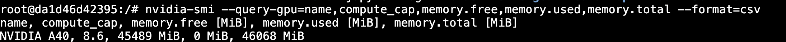
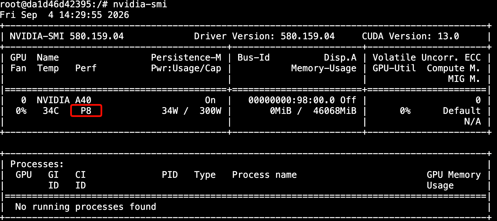
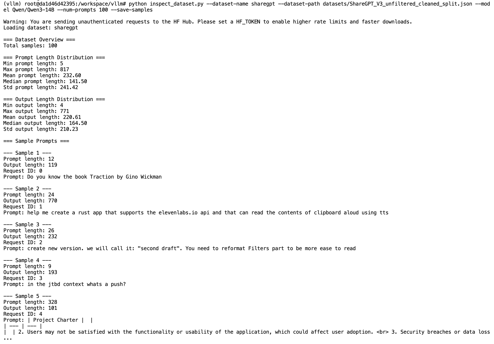
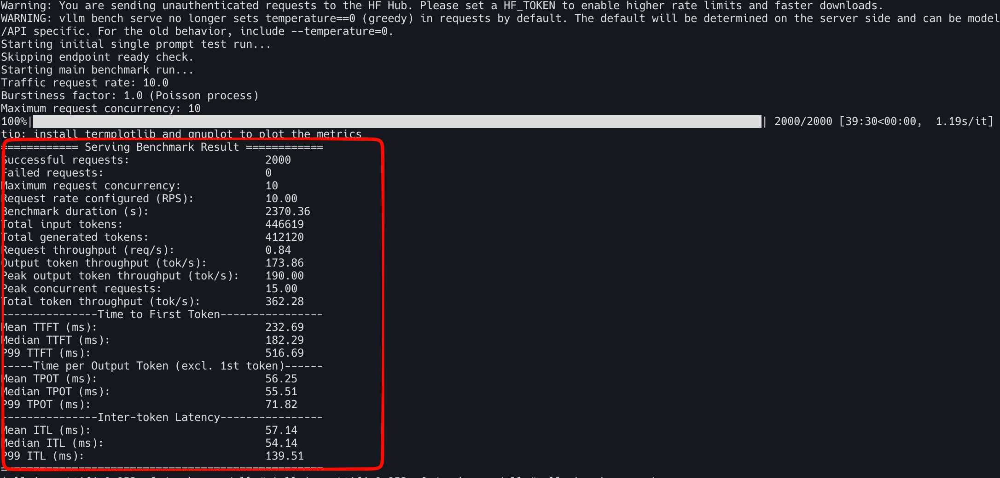
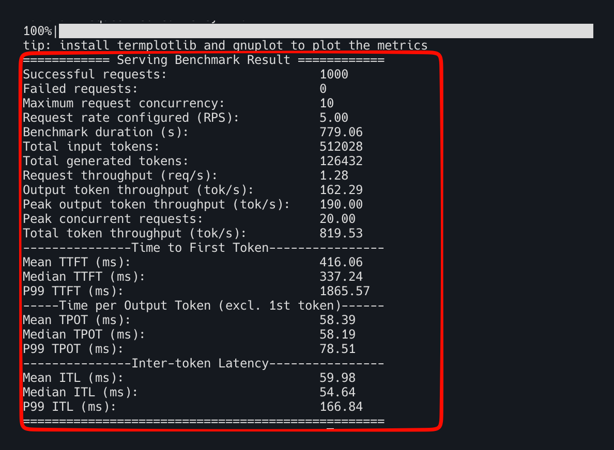
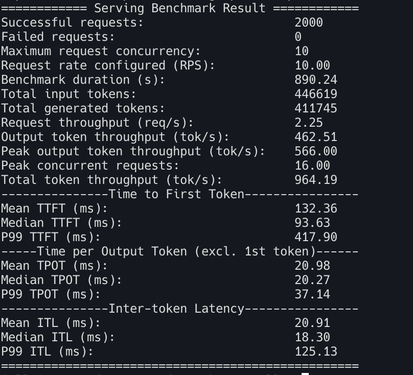

# Qwen3-14B vLLM 서빙 최적화 정리

## **목표**

- 단일 GPU에서 Qwen3-14B를 vLLM으로 서빙할 때 처리량(throughput)과 지연시간(latency)을 체계적으로 측정하고 개선하는 7단계를 알아본다.

## 1단계 : GPU 하드웨어 점검

먼저`nvidia-smi`로 사전 점검을 진행한다. 

- CUDA/드라이버 호환성
- 성능 상태(P8=유휴, P0/P1=고성능)
- 메모리 여유분(46GB 중 사용량)

이후에 **"사용률이 낮거나 부하가 있을 경우"**는  배칭 문제로 **"전력 높거나 처리량 낮을 경우"**는 메모리 병목으로 원인을 구분할 수 있는 기준이 된다. 


아래와 같이 플래그를 사용하여 관심있는 항목만 출력해본다.

```bash
root@da1d46d42395:/# nvidia-smi --query-gpu=name,compute_cap,memory.free,memory.used,memory.total --format=csv
name, compute_cap, memory.free [MiB], memory.used [MiB], memory.total [MiB]
NVIDIA A40, 8.6, 45489 MiB, 0 MiB, 46068 MiB
```




유휴상태(P8)인지도 확인

```bash
root@da1d46d42395:/# nvidia-smi
Fri Sep  4 14:29:55 2026
+-----------------------------------------------------------------------------------------+
| NVIDIA-SMI 580.159.04             Driver Version: 580.159.04     CUDA Version: 13.0     |
+-----------------------------------------+------------------------+----------------------+
| GPU  Name                 Persistence-M | Bus-Id          Disp.A | Volatile Uncorr. ECC |
| Fan  Temp   Perf          Pwr:Usage/Cap |           Memory-Usage | GPU-Util  Compute M. |
|                                         |                        |               MIG M. |
|=========================================+========================+======================|
|   0  NVIDIA A40                     On  |   00000000:98:00.0 Off |                    0 |
|  0%   34C    P8             34W /  300W |       0MiB /  46068MiB |      0%      Default |
|                                         |                        |                  N/A |
+-----------------------------------------+------------------------+----------------------+

+-----------------------------------------------------------------------------------------+
| Processes:                                                                              |
|  GPU   GI   CI              PID   Type   Process name                        GPU Memory |
|        ID   ID                                                               Usage      |
|=========================================================================================|
|  No running processes found                                                             |
+-----------------------------------------------------------------------------------------+
```




## 2단계 : vLLM기동 및 벤치마크 트래픽 준비

프리필과 디코드는 서로 다른 최적화 전략을 요구한다.  실제 사용 패턴과 닮은 벤치마크 데이터가 최우선이다.  

**두 가지 상호보완적 데이터셋**을 사용한다.


| 데이터셋              | 특징                              | 용도                   |
| ----------------- | ------------------------------- | -------------------- |
| ShareGPT          | 실제 대화(입력·출력 평균 각 232/221토큰, 균형) | 실전 서빙 성능·응답성 평가      |
| Prefix Repetition | 공통 접두사+고유 접미사 반복 (합성)           | prefix caching 효과 검증 |


`vllm bench serve`로 요청 수 / 요청률 / 동시성을 제어해 재현 가능한 트래픽 생성한다.


### 2-1 vLLM Repository 클론하기

```bash
# Clone the vLLM repository
git clone https://github.com/vllm-project/vllm.git
cd vllm

# Optional: Checkout a specific version for stability
git checkout v0.28.0  # or latest stable version
```


### 2-2 uv로 가상환경 생성하기

```bash
# Install uv if not already installed
curl -LsSf https://astral.sh/uv/install.sh | sh

# Create virtual environment with Python 3.12 and seed packages
uv venv --python 3.12 --seed

# Activate the virtual environment
source .venv/bin/activate
```


### 2-3 uv로 개발환경에서 vLLM설치하기

```bash
# Install vLLM in editable mode with precompiled dependencies using uv
# VLLM_USE_PRECOMPILED=1 forces use of precompiled wheels for faster installation
VLLM_USE_PRECOMPILED=1 uv pip install -e .

# Install additional dependencies for the notebook and testing
uv pip install jupyter matplotlib numpy requests pytest tblib
```


### 2-4 설치 검증하기

```bash
# Check vLLM installation
python -c "import vllm; print(f'vLLM version: {vllm.__version__}')"

# Check CUDA availability
python -c "import torch; print(f'CUDA available: {torch.cuda.is_available()}')"
python -c "import torch; print(f'CUDA devices: {torch.cuda.device_count()}')"
```


### 2-5 vllm 실행하기

```
HF_HUB_DISABLE_XET=1 nohup vllm serve Qwen/Qwen3-14B > vllm.log 2>&1 &
tail -f vllm.log
```


```
...
Application startup complete.
Uvicorn running on http://0.0.0.0:8000
```


### 2-6 필수 데이터셋 다운로드하기

```bash
# Create datasets directory
mkdir -p datasets

# Download ShareGPT dataset (used in benchmarks)
# This is a large file (~1.5GB), so it may take several minutes
wget -O datasets/ShareGPT_V3_unfiltered_cleaned_split.json \
    "https://huggingface.co/datasets/anon8231489123/ShareGPT_Vicuna_unfiltered/resolve/main/ShareGPT_V3_unfiltered_cleaned_split.json"

# Verify dataset download
ls -lh datasets/ShareGPT_V3_unfiltered_cleaned_split.json
# Should show file size ~650MB

# Alternative: Use curl if wget is not available
curl -L -o datasets/ShareGPT_V3_unfiltered_cleaned_split.json \
    "https://huggingface.co/datasets/anon8231489123/ShareGPT_Vicuna_unfiltered/resolve/main/ShareGPT_V3_unfiltered_cleaned_split.json"
```


/workspace/vllm 이하에 `inspect_dataset.py`생성

```python
#!/usr/bin/env python3
"""Inspect the benchmark datasets used by `vllm bench serve`.

This helper loads a dataset with the very same code path that
`vllm bench serve` uses (``vllm.benchmarks.datasets``), then reports the
prompt/output length distributions, prints a few sample prompts and draws a
simple ASCII histogram. It is meant to answer "what traffic am I actually
sending to the server?" before a benchmark run.

Copy this file into the root of your local `vllm` repository (see README.md)
and run, for example:

    python3 inspect_dataset.py \
        --dataset-name sharegpt \
        --dataset-path ShareGPT_V3_unfiltered_cleaned_split.json \
        --model Qwen/Qwen3-14B \
        --num-prompts 100 \
        --save-samples

    python3 inspect_dataset.py \
        --dataset-name prefix_repetition \
        --model Qwen/Qwen3-14B \
        --num-prompts 50 \
        --prefix-repetition-prefix-len 256 \
        --prefix-repetition-suffix-len 256 \
        --prefix-repetition-num-prefixes 5 \
        --prefix-repetition-output-len 128 \
        --save-samples
"""

import argparse
import json

import numpy as np

from vllm.benchmarks.datasets import (
    PrefixRepetitionRandomDataset,
    RandomDataset,
    ShareGPTDataset,
)
try:
    # vLLM >= 0.12: tokenizer helpers live in their own package.
    from vllm.tokenizers import get_tokenizer
except ImportError:
    from vllm.transformers_utils.tokenizer import get_tokenizer

# Number of buckets in the ASCII histogram.
NUM_HISTOGRAM_BINS = 9
# Prompts longer than this are truncated when printed.
MAX_PROMPT_CHARS = 200
# How many sample prompts to print.
NUM_SAMPLES_TO_SHOW = 5


def build_dataset(args, tokenizer):
    """Sample `args.num_prompts` requests from the requested dataset."""
    if args.dataset_name == "sharegpt":
        if not args.dataset_path:
            raise ValueError("--dataset-path is required for the sharegpt dataset")
        dataset = ShareGPTDataset(
            dataset_path=args.dataset_path,
            random_seed=args.seed,
        )
        return dataset.sample(
            tokenizer=tokenizer,
            num_requests=args.num_prompts,
            output_len=args.sharegpt_output_len,
            request_id_prefix=args.request_id_prefix,
        )

    if args.dataset_name == "prefix_repetition":
        dataset = PrefixRepetitionRandomDataset(random_seed=args.seed)
        return dataset.sample(
            tokenizer=tokenizer,
            num_requests=args.num_prompts,
            prefix_len=args.prefix_repetition_prefix_len,
            suffix_len=args.prefix_repetition_suffix_len,
            num_prefixes=args.prefix_repetition_num_prefixes,
            output_len=args.prefix_repetition_output_len,
            request_id_prefix=args.request_id_prefix,
        )

    if args.dataset_name == "random":
        dataset = RandomDataset(random_seed=args.seed)
        return dataset.sample(
            tokenizer=tokenizer,
            num_requests=args.num_prompts,
            prefix_len=args.random_prefix_len,
            input_len=args.random_input_len,
            output_len=args.random_output_len,
            range_ratio=args.random_range_ratio,
            request_id_prefix=args.request_id_prefix,
        )

    raise ValueError(f"Unknown dataset name: {args.dataset_name}")


def print_distribution(name, values):
    """Print min/max/mean/median/std for one length distribution."""
    print(f"\n=== {name} Length Distribution ===")
    print(f"Min {name.lower()} length: {int(np.min(values))}")
    print(f"Max {name.lower()} length: {int(np.max(values))}")
    print(f"Mean {name.lower()} length: {np.mean(values):.2f}")
    print(f"Median {name.lower()} length: {np.median(values):.2f}")
    print(f"Std {name.lower()} length: {np.std(values):.2f}")


def print_samples(requests, num_samples):
    """Print the first few requests with their prompt truncated."""
    print("\n=== Sample Prompts ===")
    for i, request in enumerate(requests[:num_samples]):
        prompt = request.prompt
        if not isinstance(prompt, str):
            prompt = str(prompt)
        if len(prompt) > MAX_PROMPT_CHARS:
            prompt = prompt[:MAX_PROMPT_CHARS] + "..."
        print(f"\n--- Sample {i + 1} ---")
        print(f"Prompt length: {request.prompt_len}")
        print(f"Output length: {request.expected_output_len}")
        print(f"Request ID: {getattr(request, 'request_id', None)}")
        print(f"Prompt: {prompt}")


def print_histogram(prompt_lens, num_bins=NUM_HISTOGRAM_BINS):
    """Draw an ASCII histogram of the prompt length distribution."""
    print("\n=== Prompt Length Histogram ===")
    min_len = int(np.min(prompt_lens))
    max_len = int(np.max(prompt_lens))

    if min_len == max_len:
        # Every prompt has the same length (the usual case for the synthetic
        # datasets): a histogram of empty bins would be noise, so print one row.
        print(f"{min_len:4d} tokens: {'*' * len(prompt_lens)}")
        return

    bin_width = (max_len - min_len) / num_bins
    counts = [0] * num_bins
    for length in prompt_lens:
        index = min(int((length - min_len) / bin_width), num_bins - 1)
        counts[index] += 1

    for i, count in enumerate(counts):
        low = int(min_len + i * bin_width)
        high = int(min_len + (i + 1) * bin_width)
        print(f"{low:4d}-{high:4d} tokens: {'*' * count}")


def save_samples(requests, filename):
    """Dump the sampled requests to JSON for offline inspection."""
    samples = [
        {
            "request_id": getattr(request, "request_id", None),
            "prompt": request.prompt,
            "prompt_len": request.prompt_len,
            "expected_output_len": request.expected_output_len,
            "has_multimodal": bool(getattr(request, "multi_modal_data", None)),
        }
        for request in requests
    ]
    with open(filename, "w", encoding="utf-8") as f:
        json.dump(samples, f, ensure_ascii=False, indent=2)
    print(f"\nSaved {len(samples)} samples to {filename}")


def parse_args():
    parser = argparse.ArgumentParser(
        description="Inspect a vLLM benchmark dataset before running a benchmark."
    )
    parser.add_argument(
        "--dataset-name",
        type=str,
        default="sharegpt",
        choices=["sharegpt", "prefix_repetition", "random"],
        help="Which benchmark dataset to load.",
    )
    parser.add_argument(
        "--dataset-path",
        type=str,
        default=None,
        help="Path to the dataset file (required for sharegpt).",
    )
    parser.add_argument(
        "--model",
        type=str,
        required=True,
        help="Model name or path used to load the tokenizer.",
    )
    parser.add_argument(
        "--tokenizer",
        type=str,
        default=None,
        help="Tokenizer name or path (defaults to --model).",
    )
    parser.add_argument(
        "--trust-remote-code",
        action="store_true",
        help="Trust remote code when loading the tokenizer.",
    )
    parser.add_argument(
        "--num-prompts",
        type=int,
        default=100,
        help="Number of prompts to sample from the dataset.",
    )
    parser.add_argument(
        "--seed",
        type=int,
        default=0,
        help="Random seed used when sampling the dataset.",
    )
    parser.add_argument(
        "--request-id-prefix",
        type=str,
        default="",
        help="Prefix prepended to generated request IDs.",
    )
    parser.add_argument(
        "--num-samples-to-show",
        type=int,
        default=NUM_SAMPLES_TO_SHOW,
        help="How many sample prompts to print.",
    )
    parser.add_argument(
        "--save-samples",
        action="store_true",
        help="Save the sampled requests to a JSON file.",
    )
    parser.add_argument(
        "--samples-filename",
        type=str,
        default=None,
        help="Output file for --save-samples "
        "(defaults to <dataset-name>_samples.json).",
    )

    # ShareGPT specific.
    parser.add_argument(
        "--sharegpt-output-len",
        type=int,
        default=None,
        help="Override the output length of every ShareGPT request.",
    )

    # Prefix repetition specific.
    parser.add_argument("--prefix-repetition-prefix-len", type=int, default=256)
    parser.add_argument("--prefix-repetition-suffix-len", type=int, default=256)
    parser.add_argument("--prefix-repetition-num-prefixes", type=int, default=10)
    parser.add_argument("--prefix-repetition-output-len", type=int, default=128)

    # Random dataset specific.
    parser.add_argument("--random-input-len", type=int, default=1024)
    parser.add_argument("--random-output-len", type=int, default=128)
    parser.add_argument("--random-prefix-len", type=int, default=0)
    parser.add_argument("--random-range-ratio", type=float, default=0.0)

    return parser.parse_args()


def main():
    args = parse_args()

    tokenizer = get_tokenizer(
        args.tokenizer or args.model,
        trust_remote_code=args.trust_remote_code,
    )

    print(f"Loading dataset: {args.dataset_name}")
    requests = build_dataset(args, tokenizer)

    print("\n=== Dataset Overview ===")
    print(f"Total samples: {len(requests)}")
    if not requests:
        return

    prompt_lens = [r.prompt_len for r in requests]
    output_lens = [r.expected_output_len for r in requests]

    print_distribution("Prompt", prompt_lens)
    print_distribution("Output", output_lens)
    print_samples(requests, args.num_samples_to_show)
    print_histogram(prompt_lens)

    if args.save_samples:
        filename = args.samples_filename or f"{args.dataset_name}_samples.json"
        save_samples(requests, filename)


if __name__ == "__main__":
    main()
```

### 2-7 데이터셋 구조 조사하기

```bash
# Basic dataset inspection
python inspect_dataset.py --dataset-name sharegpt --dataset-path datasets/ShareGPT_V3_unfiltered_cleaned_split.json --model Qwen/Qwen3-14B --num-prompts 100

# Inspect prefix repetition dataset
python inspect_dataset.py --dataset-name prefix_repetition --model Qwen/Qwen3-14B --num-prompts 50 --prefix-repetition-prefix-len 256 --prefix-repetition-suffix-len 256 --prefix-repetition-num-prefixes 5 --prefix-repetition-output-len 128

# Save samples to file for detailed inspection
python inspect_dataset.py --dataset-name sharegpt --dataset-path datasets/ShareGPT_V3_unfiltered_cleaned_split.json --model Qwen/Qwen3-14B --num-prompts 100 --save-samples

# Inspect random dataset with custom parameters
python inspect_dataset.py --dataset-name random --model Qwen/Qwen3-14B --num-prompts 50 --random-input-len 512 --random-output-len 64 --random-prefix-len 128
```





이제 vLLM 벤치마크 CLI 도구(bench serve)를 사용하여 벤치마킹 트래픽을 생성할 수 있다.

예시) ShareGPT 데이터셋에서 2,000개 프롬프트를 샘플링해, 로컬 vLLM 서버로 초당 10개 요청(request rate)의 속도로 전송하여 중간 부하(moderate load) 상태의 현실적인 대화형 트래픽을 시뮬레이션한다.

```bash
vllm bench serve \
     --backend vllm \
     --base-url "http://localhost:8000" \
     --dataset-name sharegpt \
     --dataset-path datasets/ShareGPT_V3_unfiltered_cleaned_split.json \
     --num-prompts 2000 \
     --request-rate 10 \
     --burstiness 1.0 \
     --save-result \
     --append-result \
     --result-filename test_serve_results.txt \
     --model Qwen/Qwen3-14B \
     --max-concurrency 10
```


## 3단계 : 평가 지표의 정의

LLM 서빙 성능 평가에서 흔히 사용되는 지표를 살펴본다. 

- **총 토큰 처리량(TPS)**
  - 초당 처리되는 **입력 토큰과 출력 토큰을 합산한 처리 속도**. 시스템 효율성을 나타내는 고수준 high-level 지표이다.
- **출력 토큰 처리량(Total token throughput)**
  - **초당 생성되는 출력 토큰의 평균 개수**. 디코딩 성능 ‘**LLM 비용의 주요 요인**’ 을 측정하는 핵심 지표이다.
- **TTFT**(Time to frist token)
  - 요청 시작 후 **첫 토큰이 생성되기까지 걸리는 평균 시간**이다. 프리필(prefill) 효율성을 나타낸다.
- **ITL**(Inter-Token Latency) : 토큰간 지연
  - 실시간 스트리밍 품질에서 **사용자 경험**에 영향을 주며, 채팅이나 인터랙티브 에이전트에서 특히 중요하다.


## 4단계 : 베이스라인 서버 기동 및 메모리 분석

별도 튜닝이 없는기본 설정으로 `vllm serve Qwen/Qwen3-14B` 실행하여 로그를 확인하여 베이스라인을 정한다.

- 모델 가중치 **27.5GB** + KV 캐시 **11GB**(72,064토큰) = 총 38.5GB/46GB 사용
- **모델이 GPU 메모리의 65% 이상 차지** → KV 캐시 공간 부족 → 배치 축소·캐시 축출 증가 → 재계산 증가 → 처리량 저하라는 인과 체인(causal chain)이 성립한다.  이것이 이후 양자화의 필요성을 뒷받침한다. (즉 모델 자체를 작게 만드는 것의 중요한 효과 중 하나는 남는 VRAM을 KV Cache에 돌릴 수 있다는 점이다)


## 5단계 : 베이스라인 벤치마크 첫 실행

### ShareGPT 데이터셋에서 2000개 프롬프트를 초당 10개 요청 속도로 전송

```bash
vllm bench serve \
     --backend vllm \
     --base-url "http://localhost:8000" \
     --dataset-name sharegpt \
     --dataset-path datasets/ShareGPT_V3_unfiltered_cleaned_split.json \
     --num-prompts 2000 \
     --request-rate 10 \
     --burstiness 1.0 \
     --save-result \
     --append-result \
     --result-filename test_serve_results.txt \
     --model Qwen/Qwen3-14B \
     --max-concurrency 10
```

```bash
============ Serving Benchmark Result ============
Successful requests:                     2000
Failed requests:                         0
Maximum request concurrency:             10
Request rate configured (RPS):           10.00
Benchmark duration (s):                  2370.36
Total input tokens:                      446619
Total generated tokens:                  412120
Request throughput (req/s):              0.84
Output token throughput (tok/s):         173.86
Peak output token throughput (tok/s):    190.00
Peak concurrent requests:                15.00
Total token throughput (tok/s):          362.28
---------------Time to First Token----------------
Mean TTFT (ms):                          232.69
Median TTFT (ms):                        182.29
P99 TTFT (ms):                           516.69
-----Time per Output Token (excl. 1st token)------
Mean TPOT (ms):                          56.25
Median TPOT (ms):                        55.51
P99 TPOT (ms):                           71.82
---------------Inter-token Latency----------------
Mean ITL (ms):                           57.14
Median ITL (ms):                         54.14
P99 ITL (ms):                            139.51
==================================================
```




### 서빙의 캐시 성능을 벤치마크하기 위해 prefix-repetition 프롬프트(1000개 요청)를 전송

```bash
vllm bench serve \
   --backend vllm \
   --base-url "http://localhost:8000" \
   --model Qwen/Qwen3-14B \
   --dataset-name prefix_repetition \
   --num-prompts 1000 \
   --request-rate 5 \
   --prefix-repetition-prefix-len 256 \
   --prefix-repetition-suffix-len 256 \
   --prefix-repetition-num-prefixes 10 \
   --prefix-repetition-output-len 128 \
   --max-concurrency 10 \
   --save-result \
   --append-result \
   --result-filename test_serve_results.txt
```

```bash
============ Serving Benchmark Result ============
Successful requests:                     1000
Failed requests:                         0
Maximum request concurrency:             10
Request rate configured (RPS):           5.00
Benchmark duration (s):                  779.06
Total input tokens:                      512028
Total generated tokens:                  126432
Request throughput (req/s):              1.28
Output token throughput (tok/s):         162.29
Peak output token throughput (tok/s):    190.00
Peak concurrent requests:                20.00
Total token throughput (tok/s):          819.53
---------------Time to First Token----------------
Mean TTFT (ms):                          416.06
Median TTFT (ms):                        337.24
P99 TTFT (ms):                           1865.57
-----Time per Output Token (excl. 1st token)------
Mean TPOT (ms):                          58.39
Median TPOT (ms):                        58.19
P99 TPOT (ms):                           78.51
---------------Inter-token Latency----------------
Mean ITL (ms):                           59.98
Median ITL (ms):                         54.64
P99 ITL (ms):                            166.84
=================================================
```




| 지표        | ShareGPT (A40 실측) | Prefix Repetition (A40 실측) |
| --------- | ----------------- | -------------------------- |
| Total TPS | 362.28            | **819.53** (2.26배↑)        |
| Mean TTFT | 232.69 ms         | 416.06 ms (79%↑)           |
| Mean ITL  | 57.14 ms          | 59.98 ms (거의 동일)           |


반복 패턴 트래픽에서 처리량이 2.26배 오른 것은 책 사례와 같은 방향이다. **prefix caching + continuous batching + 메모리 블록 공유**로 반복되는 접두사의 계산을 재사용하기 때문이다.

다만 책 예시와 달리 이번 A40 실측에서는 **TTFT가 오히려 79% 늘었다**(232.69ms → 416.06ms). ITL은 57.14ms → 59.98ms로 거의 그대로라 decode 단계는 책 설명과 일치하지만, prefill 대기시간은 그렇지 않았다. Peak concurrent requests가 15 → 20으로 늘어난 것으로 보아, 캐시 재사용으로 처리량이 오르면서 동시성도 함께 늘고, 그만큼 요청이 큐에서 더 오래 기다린 것으로 보인다(P99 TTFT가 1865.57ms까지 치솟은 것도 같은 맥락). 

즉 **캐싱이 처리량은 확실히 올리지만, 동시성이 함께 늘면 TTFT는 오히려 나빠질 수 있다** (이 실습에서 확인된 책에는 없는 관찰이다.)


## 6단계 : **양자화**된 Qwen3 모델을 vLLM으로 벤치마크

모델 가중치를 4비트로 양자화 하여 모델 자체의 메모리 사용량을 줄이고 줄인만큼 KV 캐시에 재할당하여 처리량을 개선시킨다는 아이디어이다.

### 6-1 이전 vLLM 서버 중지 시킨 뒤 `Qwen3-14B-AWQ`로 교체

기존 원본 서버를 내린다.

```bash
pkill -f "vllm serve"
```

프로세스가 완전히 죽었는지, `nvidia-smi`로 GPU 메모리도 비었는지 확인한 뒤 AWQ 모델로 재기동한다. baseline 로그(`vllm.log`)를 덮어쓰지 않도록 로그 파일명을 분리한다.

```bash
nohup vllm serve Qwen/Qwen3-14B-AWQ > vllm_awq.log 2>&1 &
tail -f vllm_awq.log
```

`Qwen/Qwen3-14B-AWQ`는 HF 리포에 quantization config가 박혀 있어 보통 `--quantization awq`를 따로 주지 않아도 vLLM이 자동 인식한다. 로그에 `quantization=awq` 같은 표시가 안 보이면 그때 옵션을 명시적으로 추가한다.

`Application startup complete.`가 뜨면 로그에서 메모리 수치부터 확인한다. 아래 표의 모델 크기·KV 캐시·최대 동시성 행을 채울 값이 여기 있다.

```bash
grep -E "Model loading took|Available KV cache|GPU KV cache size|Maximum concurrency" vllm_awq.log
```

메모리 확인이 끝나면 baseline과 동일한 조건으로 벤치마크를 다시 돌린다. `--model`만 AWQ로 바꾸고 나머지(프롬프트 수, request-rate, concurrency)는 그대로 둬야 비교가 성립한다.

```bash
vllm bench serve \
     --backend vllm \
     --base-url "http://localhost:8000" \
     --dataset-name sharegpt \
     --dataset-path datasets/ShareGPT_V3_unfiltered_cleaned_split.json \
     --num-prompts 2000 \
     --request-rate 10 \
     --burstiness 1.0 \
     --save-result \
     --append-result \
     --result-filename test_serve_results.txt \
     --model Qwen/Qwen3-14B-AWQ \
     --max-concurrency 10
```

```bash
============ Serving Benchmark Result ============
Successful requests:                     2000
Failed requests:                         0
Maximum request concurrency:             10
Request rate configured (RPS):           10.00
Benchmark duration (s):                  890.24
Total input tokens:                      446619
Total generated tokens:                  411745
Request throughput (req/s):              2.25
Output token throughput (tok/s):         462.51
Peak output token throughput (tok/s):    566.00
Peak concurrent requests:                16.00
Total token throughput (tok/s):          964.19
---------------Time to First Token----------------
Mean TTFT (ms):                          132.36
Median TTFT (ms):                        93.63
P99 TTFT (ms):                           417.90
-----Time per Output Token (excl. 1st token)------
Mean TPOT (ms):                          20.98
Median TPOT (ms):                        20.27
P99 TPOT (ms):                           37.14
---------------Inter-token Latency----------------
Mean ITL (ms):                           20.91
Median ITL (ms):                         18.30
P99 ITL (ms):                            125.13
==================================================
```




|                      | 원본 (A40 실측)     | AWQ 4bit (A40 실측)      |
| -------------------- | --------------- | ------------------------ |
| 모델 크기                | 27.5GB          | 9.36GB (65%↓, 책 예시)      |
| KV 캐시                | 11GB / 72,064토큰 | 29.15GB / 191,056토큰 (책 예시) |
| 최대 동시성               | 1.76x           | 4.66x (책 예시)             |
| Total TPS (ShareGPT) | 362.28          | **964.19** (2.66배↑)      |
| Mean TTFT            | 232.69ms        | **132.36ms** (43%↓)      |
| Mean ITL             | 57.14ms         | **20.91ms** (63%↓)       |


> 처리량·TTFT·ITL은 두 서버 모두 A40에서 직접 측정한 값이다. 모델 크기·KV 캐시·최대 동시성 행은 `vllm_awq.log`의 `grep` 출력을 아직 붙여넣지 않아 책 예시값으로 남겨뒀다 — 그 grep 결과를 주면 이 세 행도 실측치로 바꿀 수 있다.

**인과 체인**: 양자화 → 모델 메모리↓ → KV 캐시↑ → 동시 요청↑ → 배치 효율↑ → 처리량↑. 뒷부분(동시 요청↑ 이후)은 A40 실측(TPS 2.66배↑, ITL 63%↓)으로 확인됐고, 앞부분(모델 메모리↓ → KV 캐시↑)은 grep 결과가 들어오면 확정된다.

 단, 정확도 저하·토큰 불안정성 등 트레이드오프는 존재하므로 4bit/8bit/FP8 선택은 품질 허용범위와 성능 목표의 균형 문제이다.

## 7단계 : 워크로드별 추가 최적화

- **프리필 위주**(긴 입력, 공유 컨텍스트 多) → LMCache로 반복 접두사 KV 재사용
- **디코딩 위주**(긴 출력) → 스펙큘레이티브 디코딩(드래프트 모델 병렬 예측)
- 튜닝 노브
  - 메모리/캐시(`--gpu-memory-utilization`, `--max-model-len`, `--block-size`) 
  - 배칭/스케줄링(`--max-num-seqs`, `--max-num-batched-tokens`, `--max-paddings`)

세밀하게 튜닝된 설정 파라미터를 적용한 후의 vLLM 서버 재기동. 

- `--max-model-len 1024` — ShareGPT 샘플 중 프롬프트만 817토큰짜리도 있어 출력까지 합치면 1024를 넘는 요청이 실제로 있다(2단계 통계 참고). 이 값 그대로 쓰면 그런 요청이 잘리거나 실패하므로, 기존 서버가 쓰던 기본값을 그대로 둔다.
- `--max-num-seqs 8` — 기본값(보통 256)보다 훨씬 작아 동시성을 일부러 죽이는 설정이다. 처리량 실험 목적과 맞지 않아 제외한다.


baseline 로그(`vllm_awq.log`)를 덮어쓰지 않도록 로그 파일명을 분리하고, 나머지 노브만 바꿔서 재기동한다.

```bash
pkill -f "vllm serve"

nohup vllm serve Qwen/Qwen3-14B-AWQ \
  --gpu-memory-utilization 0.95 \
  --block-size 16 \
  --enable-chunked-prefill \
  --max-num-batched-tokens 8192 \
  > vllm_awq_tuned.log 2>&1 &

tail -f vllm_awq_tuned.log
```

`--enable-prefix-caching`은 뺐다. vLLM v0.28.0이면 이미 기본으로 켜져 있을 가능성이 높으므로, 기동 로그에서 실제 적용된 설정을 확인한다.


`Application startup complete.`가 뜨면 6단계와 완전히 동일한 조건(프롬프트 수·request-rate·concurrency)으로 벤치마크를 다시 돌린다. 조건을 하나라도 바꾸면 무엇 때문에 차이가 났는지 알 수 없어진다.

```bash
vllm bench serve \
     --backend vllm \
     --base-url "http://localhost:8000" \
     --dataset-name sharegpt \
     --dataset-path datasets/ShareGPT_V3_unfiltered_cleaned_split.json \
     --num-prompts 2000 \
     --request-rate 10 \
     --burstiness 1.0 \
     --save-result \
     --append-result \
     --result-filename test_serve_results.txt \
     --model Qwen/Qwen3-14B-AWQ \
     --max-concurrency 10
```


```bash
============ Serving Benchmark Result ============
Successful requests:                     2000
Failed requests:                         0
Maximum request concurrency:             10
Request rate configured (RPS):           10.00
Benchmark duration (s):                  888.44
Total input tokens:                      446619
Total generated tokens:                  410582
Request throughput (req/s):              2.25
Output token throughput (tok/s):         462.14
Peak output token throughput (tok/s):    570.00
Peak concurrent requests:                17.00
Total token throughput (tok/s):          964.84
---------------Time to First Token----------------
Mean TTFT (ms):                          134.82
Median TTFT (ms):                        94.79
P99 TTFT (ms):                           434.46
-----Time per Output Token (excl. 1st token)------
Mean TPOT (ms):                          20.94
Median TPOT (ms):                        20.25
P99 TPOT (ms):                           35.50
---------------Inter-token Latency----------------
Mean ITL (ms):                           20.92
Median ITL (ms):                         18.31
P99 ITL (ms):                            126.69
==================================================
```


이 결과를 6단계 AWQ 값과 나란히 놓고 비교하면 이 튜닝 노브들이 실제로 이득을 주는지 확인할 수 있다.

| 지표 | 6단계 (튜닝 전) | 7단계 (튜닝 후) | 변화 |
| --- | --- | --- | --- |
| Total TPS | 964.19 | 964.84 | +0.07% (오차 수준) |
| Mean TTFT | 132.36ms | 134.82ms | +1.9% (소폭 악화) |
| Mean ITL | 20.91ms | 20.92ms | 거의 동일 |

**세 지표 모두 사실상 차이가 없다.** `--gpu-memory-utilization 0.95`·`--enable-chunked-prefill`·`--max-num-batched-tokens 8192`를 더했지만 처리량도 지연시간도 안 움직였다.

AWQ 전환만으로 KV 캐시가 이미 191,056토큰(동시성 4.66x)까지 넉넉해졌고, 벤치마크 자체가 `--max-concurrency 10`으로 동시 요청 수를 낮게 캡 걸어둔 상태다. 즉 **병목이 이미 사라진 지점에서 배칭·캐시 노브를 더 조인 것이라 개선 여지가 없었다** — 6단계 양자화가 진짜 병목(모델 메모리)을 해소했고, 7단계 튜닝은 이미 남아 있지 않은 병목을 겨냥한 셈이다.


 특정 GPU·트래픽에 과최적화(overfitting)하면 이식성이 떨어진다. 최신 프레임워크가 합리적 기본값을 자동 추론해주므로, 실무 역량은 "완벽한 수치 찾기"보다 "어떤 기법을 쓸지 판단하기"에 집중해야 한다.

