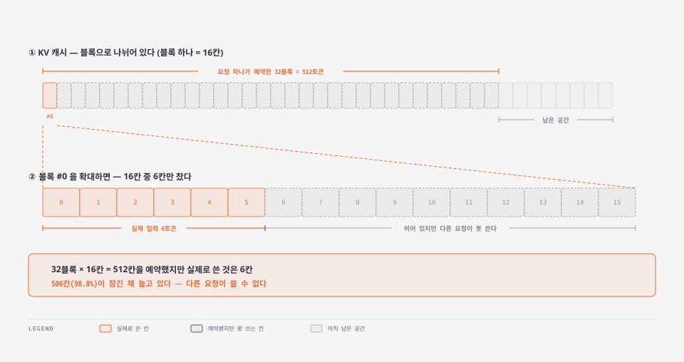
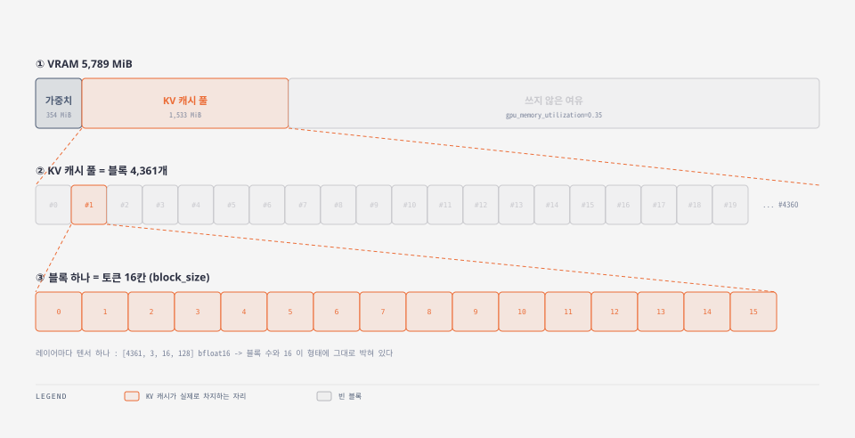
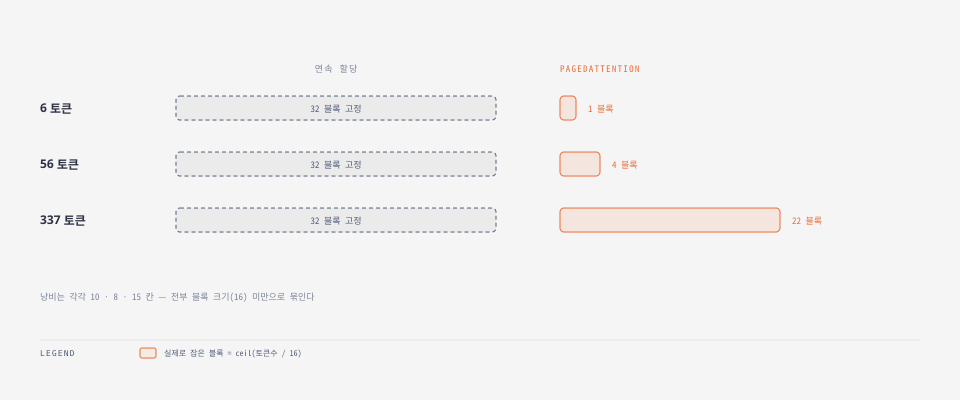
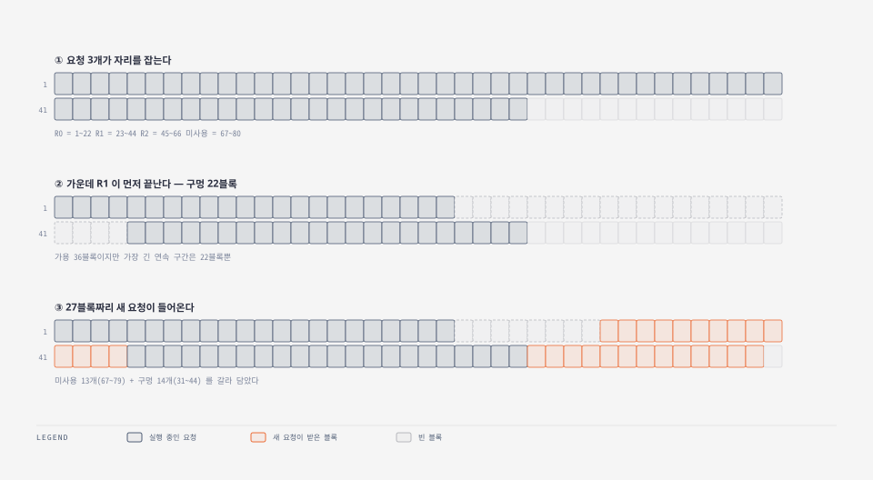
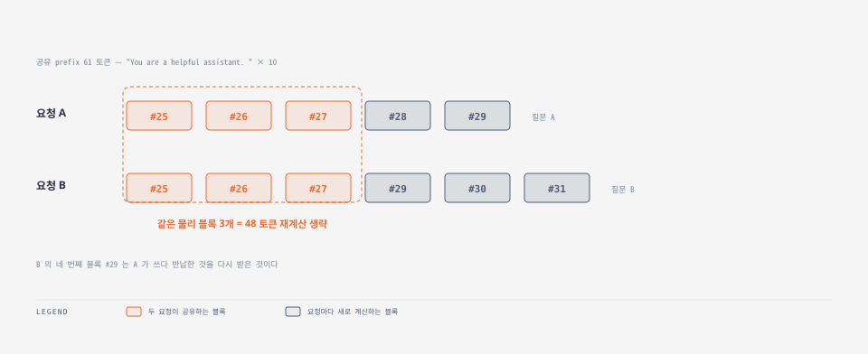
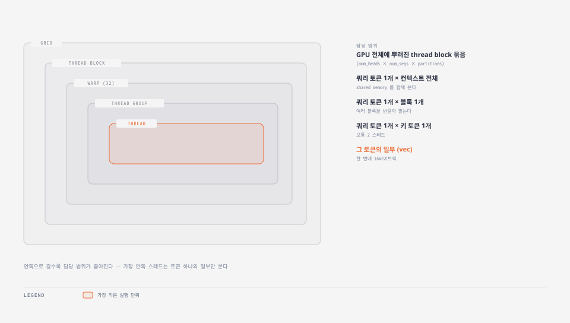

## 1. PagedAttention 을 이해해 보자

LLM은 도중에 계산 결과를 어딘가 보관해야한다. GPU 메모리에 보관하며 토큰이 커질 수록 역시 커진다. 

### 기존 방식의 문제

- 일반적인 최대치를 상정하여 대비한다. 최대 512토큰이 들어 올 수 있으니 32칸을 비워두세요. (하나의 KV블락당 16이라 가정)
- 실제로 6 토큰만 들어오면 나머지 31블락은 쓸모가 없어지는 경우가 생긴다
- 이 쓸모없어진 블락은 사용할 수 없다.

그림으로 보면 이렇다.



**512칸을 예약해 놓고 6칸만 쓴다.** 나머지 506칸(98.8%)은 비어 있는데도 다른 요청이 가져다 쓸 수 없다.

문제가 하나 더 생기는데 **연달아 붙어 있어야 한다**는 조건이다. 예를들어 빈 블록이 여기저기 36개 있어도 붙어 있는 게 22개뿐이면 27블록짜리 요청을 거절한다. **PagedAttention은** 최대치를 미리 잡는 대신 쓴 만큼만 주고 파편화를 가능하게한다. 


### 실제 GPU 구성

말로만 하면 감이 안 오니 이번 실습 환경의 실측값을 먼저 보자.



**VRAM 안에 KV 캐시 풀이 있고 그 풀이 블록으로 잘려 있다.** 블록 하나가 16토큰을 담는다. `block_size = 16`은 임의로 정한 값이 아니라 **실제 텐서 모양에 적혀 있다.** 레이어마다 `[4361, 3, 16, 128]` 짜리 텐서가 하나씩 있는데 이 중 `4361`이 블록 수,`16`이 블록당 토큰 수다.


## 2. 준비

```bash
python3 -m venv ~/pa-lab
~/pa-lab/bin/pip install vllm
```


| 항목                     | 값                                          |
| ---------------------- | ------------------------------------------ |
| GPU                    | RTX 3050 6GB · 드라이버 595.84                 |
| vLLM                   | 0.27.1                                     |
| 모델                     | HuggingFaceTB/SmolLM-135M                  |
| 칸 하나 크기(`block_size`)  | **16 토큰**                                  |
| 최대 길이(`max_model_len`) | 512 토큰 → 옛날 방식이면 **32칸 고정 (512 / 16 =32)** |


```python
os.environ["VLLM_ENABLE_V1_MULTIPROCESSING"] = "0"
```

기본값이면 엔진이 **별도 프로세스**에서 돌아 내부를 들여다볼 수 없다. 같은 프로세스로 끌어와야한다.

## 3. 번호표는 어디 있나

```python
llm.llm_engine.engine_core.engine_core.scheduler
   .kv_cache_manager.coordinator.single_type_managers[0].req_to_blocks
```

여기서 한 번 막혔다. 공식 함수인 `get_block_ids()`가 **빈 값을 돌려준다.**

```bash
내가 준 이름   : R1
엔진이 붙인 이름 : R1-bf6e0edb
```

엔진이 뒤에 꼬리표를 붙인다. 그래서 앞부분만 맞춰 찾는 함수를 따로 만들었다.

```python
def blocks_of(tag):
    for request_id, blocks in manager.req_to_blocks.items():
        if request_id == tag or request_id.startswith(tag + "-"):
            return [b.block_id for b in blocks]
    return None
```

## 4. KV 블락 크기는 처음에 정해진다

```termcast {title="root@controlplane: ~" prompt="$"}
$ ~/pa-lab/bin/python verify_paged.py
==========================================================================
[1] KV 캐시 풀은 기동 시 고정 크기로 선할당된다
==========================================================================
  block_size     : 16 토큰
  num_gpu_blocks : 4,361 개
  총 수용량      : 69,776 토큰
  GPU 할당량     : 1,887.6 MiB  (이후 변하지 않는다)
```

**KV블락이 4,361개, 총 69,776 토큰 (4361 * 16 )** 을 담을 수 있다. 이게 나의 GPU의 상한이다. `1,887.6 MiB`를 기억해 두자. **끝날 때까지 이 숫자는 변하지 않는다.**

## 5. 실험 1 — 6토큰짜리는 몇 칸을 쓸까

6토큰, 56토큰, 337토큰으로 길이가 다른 요청 셋을 보내본다. 

**기존 방식이면 셋 다 32칸이다. 앞에서도 언급 했듯이 최대 토큰을 512로 지정하였으므로 KV 블락 크기는 상시 32블락으로 지정될 것이다.(512 / 16)**



```termcast {title="root@controlplane: ~" prompt="$"}
==========================================================================
[2] 요청은 max_model_len 이 아니라 '쓴 만큼'만 블록을 잡는다
==========================================================================
     토큰    블록  ceil(n/16)      낭비  연속할당이면
      6     1           1     10칸  32블록 고정
     56     4           4      8칸  32블록 고정
    337    22          22     15칸  32블록 고정
```

**KV블락은 16토큰 까지 보관할 수 있으므로 6토큰짜리 요청은  KV블락 1개면충분하다. 하지만 10칸(=16-6)은 낭비라고 본다.**

---

56토큰 요청일 때도 56 / 16 = 4 (반올림 하여 KV 블록 4개 필요)이며 8칸은 낭비라고 본다. 

337 토큰 요청일 때도 337 / 16 = 22(반올림 하여 KV 블록 22개 필요) 이며 15칸은 낭비라고 본다. 


하지만 기존 32블록을 고정했을때에 비하면 상당히 절약할 수 있다.

## 6. 실험 2 — 파편화

현재 이해를 돕기 위해 실제 4361개의 KV 블락 수를 80개로 줄인다.

```python
llm = LLM(model="HuggingFaceTB/SmolLM-135M",
          max_model_len=512, block_size=16,
          num_gpu_blocks_override=80,      # 풀을 80블록으로 좁힌다
          enable_prefix_caching=False,     # 나눠 쓰기를 꺼야 구멍만 보인다
          gpu_memory_utilization=0.35, enforce_eager=True)
```


아래 그림을 살펴보자. 



```termcast {title="root@controlplane: ~" prompt="$"}
$ ~/pa-lab/bin/python verify_fragmentation.py
==========================================================================
[1] 요청 셋을 띄운다 — 풀 80블록, prefix 공유 끔
==========================================================================
  R0 : [1, 2, 3, ... 20, 21, 22]
  R1 : [23, 24, 25, ... 42, 43, 44]
  R2 : [45, 46, 47, ... 64, 65, 66]

  사용 66 / 전체 80  ->  아직 안 쓴 블록 14개
```

가운데 R1이 끝나면 그 자리가 빈다.


```termcast {title="root@controlplane: ~" prompt="$"}
==========================================================================
[2] 가운데 R1 이 끝나면서 구멍이 생긴다
==========================================================================
  구멍 22블록 반환 : [23, 24, ... 43, 44]
  가용 = 구멍 22 + 미사용 14 = 36블록
  다만 가장 긴 '연속' 구간은 22블록뿐이다
```

**이 상태가 함정이다.** 빈칸은 36개인데, **연달아 붙은 건 최대 22개**다. 구멍(23~~44)과 안 쓴 뒷부분(67~~80)이 R2에 가로막혀 떨어져 있다.

여기에 **27 KV블락이 필요한 요청을 넣었다.**

```termcast {title="root@controlplane: ~" prompt="$"}
==========================================================================
[3] 구멍보다 큰 요청을 넣는다
==========================================================================
  NEW 가 받은 블록 (27개) :
    [67, 68, 69, 70, 71, 72, 73, 74, 75, 76, 77, 78, 79, 44, 43, 42, 41, 40, 39, 38, 37, 36, 35, 34, 33, 32, 31]

  구멍에서 재사용 : 14개 [31, 32, 33, 34, 35, 36, 37, 38, 39, 40, 41, 42, 43, 44]
  미사용분에서    : 13개 [67, 68, 69, 70, 71, 72, 73, 74, 75, 76, 77, 78, 79]
  연속인가? 아니오 — 흩어진 블록을 이어 붙였다
```

### 번호가 거꾸로 간다

받은 칸 목록을 다시 보자.

```bash
[67, 68, ... 79,   44, 43, ... 31]
 └─ 올라간다 ─┘   └─ 내려간다 ─┘
```

앞에서부터 이어져야 할 내용이 **67 → 79로 올라갔다가, 44 → 31로 내려간다.**

**순서가 뒤죽박죽이어도 상관없다는 뜻이다.** 번호표만 있으면 어디 뒀든 찾아올 수 있기 때문이다. 붙어 있을 필요가 없는 정도가 아니라, **순서대로일 필요조차 없다.**

## 7. 실험 3 — 요청 간 캐시 공유

이번엔 나눠 쓰기를 다시 켜고 **앞부분이 똑같은** 요청 둘을 차례로 보냈다.



```termcast {title="root@controlplane: ~" prompt="$"}
==========================================================================
[3] prefix 가 같으면 같은 물리 블록을 공유한다
==========================================================================
  공유 prefix : 61 토큰
  A 블록 : [25, 26, 27, 28, 29]
  B 블록 : [25, 26, 27, 29, 30, 31]
  앞에서부터 일치 : [25, 26, 27]  (3개 = 48 토큰 재계산 생략)
```

**앞의 세 칸이 똑같다.** B는 25·26·27을 새로 만들지 않고 A가 쓰던 걸 그대로 봤다. 48토큰치 계산을 통째로 건너뛴 것이다.

**옛날 방식에서는 아예 불가능한 일이다.** 각자 붙어 있는 구역을 통째로 잡아야 하는데, 그 구역의 일부만 겹쳐 쓸 방법이 없다.

## 8. 메모리 고정

```termcast {title="root@controlplane: ~" prompt="$"}
==========================================================================
[4] 그동안 GPU 메모리 총량은 변하지 않았다
==========================================================================
  검증 전 1,887.6 MiB -> 검증 후 1,887.6 MiB  (차이 +0.0 MiB)
  -> 풀은 고정, 그 안에서 블록 소유권만 오간다
```

요청이 들어오고 끝나기를 수십 번 반복했는데 **1바이트도 안 늘었다.**


## 9. 전체 코드

### verify_paged.py

```python
"""PagedAttention 검증 1 — 블록 단위 할당과 prefix 공유

vLLM 엔진을 같은 프로세스 안에서 띄우고, 스케줄러가 들고 있는
블록 테이블(req_to_blocks)을 직접 꺼내 본다.
"""
import os

# 엔진을 별도 프로세스가 아니라 이 프로세스 안에서 돌린다. 내부를 보려면 필수.
os.environ["VLLM_ENABLE_V1_MULTIPROCESSING"] = "0"
# nvcc 가 없는 환경에서 FlashInfer 샘플러가 JIT 컴파일하다 죽는 것을 피한다.
os.environ["VLLM_USE_FLASHINFER_SAMPLER"] = "0"
os.environ["TORCHDYNAMO_DISABLE"] = "1"

import math
import torch
from vllm import LLM, SamplingParams

BLK = 16                      # 블록 하나가 담는 토큰 수
MAX_LEN = 512                 # 최대 컨텍스트 길이
BAR = "=" * 74

llm = LLM(model="HuggingFaceTB/SmolLM-135M",
          max_model_len=MAX_LEN,
          block_size=BLK,
          enable_prefix_caching=True,
          gpu_memory_utilization=0.35,
          enforce_eager=True)

engine = llm.llm_engine
scheduler = engine.engine_core.engine_core.scheduler
manager = scheduler.kv_cache_manager.coordinator.single_type_managers[0]
tokenizer = engine.get_tokenizer()
cache_config = engine.vllm_config.cache_config


def blocks_of(tag):
    """요청이 들고 있는 물리 블록 번호 목록.

    엔진이 request_id 뒤에 접미사를 붙이므로("R1" -> "R1-bf6e0edb")
    정확히 일치시키지 말고 접두사로 찾는다.
    """
    for request_id, blocks in manager.req_to_blocks.items():
        if request_id == tag or request_id.startswith(tag + "-"):
            return [b.block_id for b in blocks]
    return None


def add(tag, prompt, max_tokens=4):
    engine.add_request(tag, prompt,
                       SamplingParams(temperature=0, max_tokens=max_tokens))


def drain():
    """남은 요청을 모두 끝낸다."""
    while engine.has_unfinished_requests():
        engine.step()


# ─────────────────────────────────────────────────────────────
print("\n" + BAR)
print("[1] KV 캐시 풀은 기동 시 고정 크기로 선할당된다")
print(BAR)
print(f"  block_size     : {cache_config.block_size} 토큰")
print(f"  num_gpu_blocks : {cache_config.num_gpu_blocks:,} 개")
print(f"  총 수용량      : {cache_config.num_gpu_blocks * cache_config.block_size:,} 토큰")
before = torch.cuda.memory_allocated()
print(f"  GPU 할당량     : {before / 1024**2:,.1f} MiB  (이후 변하지 않는다)")

# ─────────────────────────────────────────────────────────────
print("\n" + BAR)
print("[2] 요청은 max_model_len 이 아니라 '쓴 만큼'만 블록을 잡는다")
print(BAR)
print(f"  {'토큰':>5} {'블록':>5} {'ceil(n/16)':>11} {'낭비':>7}  연속할당이면")

prompts = [
    "안녕",
    "오늘 날씨는 어떤가요? 서울 기준으로 알려줘.",
    "긴 프롬프트를 만들기 위해 같은 문장을 반복한다. " * 6,
]
for i, prompt in enumerate(prompts):
    tag = f"L{i}"
    n = len(tokenizer.encode(prompt))
    add(tag, prompt)
    engine.step()                       # prefill 이 돌면서 블록이 배정된다
    got = blocks_of(tag) or []
    print(f"  {n:5d} {len(got):5d} {math.ceil(n / BLK):11d} {len(got) * BLK - n:6d}칸"
          f"  {MAX_LEN // BLK}블록 고정")
    drain()

# ─────────────────────────────────────────────────────────────
print("\n" + BAR)
print("[3] prefix 가 같으면 같은 물리 블록을 공유한다")
print(BAR)

shared = "You are a helpful assistant. " * 10      # 두 요청이 공유할 앞부분

add("PA", shared + "질문 A 입니다.")
engine.step()
blocks_a = blocks_of("PA")
drain()

add("PB", shared + "완전히 다른 질문 B 입니다.")
engine.step()
blocks_b = blocks_of("PB")
drain()

print(f"  공유 prefix : {len(tokenizer.encode(shared))} 토큰")
print(f"  A 블록 : {blocks_a}")
print(f"  B 블록 : {blocks_b}")
if blocks_a and blocks_b:
    same = [x for x, y in zip(blocks_a, blocks_b) if x == y]
    print(f"  앞에서부터 일치 : {same}"
          f"  ({len(same)}개 = {len(same) * BLK} 토큰 재계산 생략)")

# ─────────────────────────────────────────────────────────────
print("\n" + BAR)
print("[4] 그동안 GPU 메모리 총량은 변하지 않았다")
print(BAR)
after = torch.cuda.memory_allocated()
print(f"  검증 전 {before / 1024**2:,.1f} MiB"
      f" -> 검증 후 {after / 1024**2:,.1f} MiB"
      f"  (차이 {(after - before) / 1024**2:+.1f} MiB)")
print("  -> 풀은 고정, 그 안에서 블록 소유권만 오간다")
```

### verify_fragmentation.py

```python
"""PagedAttention 검증 2 — 흩어진 빈칸을 주워 담는가

일부러 '구멍'을 만든다.
요청 셋을 나란히 띄우고, 가운데 것만 먼저 끝내면 그 자리가 빈다.
그 뒤 구멍보다 큰 요청을 넣어 어디서 블록을 받아 오는지 본다.
"""
import os

os.environ["VLLM_ENABLE_V1_MULTIPROCESSING"] = "0"
os.environ["VLLM_USE_FLASHINFER_SAMPLER"] = "0"
os.environ["TORCHDYNAMO_DISABLE"] = "1"

from vllm import LLM, SamplingParams

BLK = 16
POOL = 80            # 풀을 좁혀야 구멍을 재사용할 수밖에 없다
BAR = "=" * 74

llm = LLM(model="HuggingFaceTB/SmolLM-135M",
          max_model_len=512,
          block_size=BLK,
          num_gpu_blocks_override=POOL,     # 기본 4,361개는 너무 넉넉하다
          enable_prefix_caching=False,      # 공유를 꺼야 파편화만 보인다
          gpu_memory_utilization=0.35,
          enforce_eager=True)

engine = llm.llm_engine
scheduler = engine.engine_core.engine_core.scheduler
manager = scheduler.kv_cache_manager.coordinator.single_type_managers[0]


def blocks_of(tag):
    for request_id, blocks in manager.req_to_blocks.items():
        if request_id == tag or request_id.startswith(tag + "-"):
            return [b.block_id for b in blocks]
    return None


def add(tag, prompt, max_tokens):
    engine.add_request(tag, prompt,
                       SamplingParams(temperature=0, max_tokens=max_tokens))


def contiguous(xs):
    s = sorted(xs)
    return s == list(range(s[0], s[-1] + 1))


print("\n" + BAR)
print(f"[1] 요청 셋을 띄운다 — 풀 {POOL}블록, prefix 공유 끔")
print(BAR)

body = "요청 %s 의 본문입니다. 블록을 여러 개 차지하도록 길게 씁니다. "
add("R0", (body % "A") * 5, max_tokens=400)   # 오래 남는다
add("R1", (body % "B") * 5, max_tokens=2)     # 먼저 끝난다 -> 구멍이 된다
add("R2", (body % "C") * 5, max_tokens=400)   # 오래 남는다
for _ in range(2):
    engine.step()

occupied = {i: blocks_of(f"R{i}") for i in range(3)}
for i in range(3):
    print(f"  R{i} : {occupied[i]}")

hole = list(occupied[1])
used = sum(len(v) for v in occupied.values() if v)
print(f"\n  사용 {used} / 전체 {POOL}  ->  아직 안 쓴 블록 {POOL - used}개")

print("\n" + BAR)
print("[2] 가운데 R1 이 끝나면서 구멍이 생긴다")
print(BAR)
for _ in range(20):
    engine.step()
    if blocks_of("R1") is None:          # 블록 테이블에서 사라지면 반환된 것
        break
print(f"  구멍 {len(hole)}블록 반환 : {hole}")
print(f"  가용 = 구멍 {len(hole)} + 미사용 {POOL - used} = {len(hole) + POOL - used}블록")
print(f"  다만 가장 긴 '연속' 구간은 {max(len(hole), POOL - used)}블록뿐이다")

print("\n" + BAR)
print("[3] 구멍보다 큰 요청을 넣는다")
print(BAR)
need = "새 요청. 흩어진 빈칸을 모두 써야 들어갈 만큼 길게 만든 프롬프트입니다. " * 5
add("NEW", need, max_tokens=4)

got = []
for _ in range(15):
    engine.step()
    got = blocks_of("NEW") or []
    if got:
        break

print(f"  NEW 가 받은 블록 ({len(got)}개) :")
print(f"    {got}")
if got:
    reused = sorted(set(got) & set(hole))
    fresh = sorted(set(got) - set(hole))
    print(f"\n  구멍에서 재사용 : {len(reused)}개 {reused}")
    print(f"  미사용분에서    : {len(fresh)}개 {fresh}")
    print(f"  연속인가? {'예' if contiguous(got) else '아니오 — 흩어진 블록을 이어 붙였다'}")
    if reused and fresh:
        print("\n  -> 연속 할당이었다면 이만한 연속 공간이 없어 거절됐을 것이다")
```

## 10. 새로운 커널 구성

여기까지는 **"어디에 두는가"** 였지만 **흩어져 있는 걸 어떻게 읽을 수 있을까.** 일반적인 어텐션 커널은 **KV가 메모리에 쭉 이어져 있다고 가정하고 짜여 있다.** 그래야 "여기서부터 몇 바이트"로 한 번에 읽는다. 그런데 7절에서 본 대로 vLLM의 KV는 `67...79` 다음에 `44...31`로 흩어져 있다. **기성 커널을 그대로 쓸 수 없다.** 그래서 vLLM은 블록 테이블을 따라가며 읽는 **전용 CUDA 커널**을 직접 만들었다(`csrc/attention/attention_kernels.cu`).

> 아래 내용은 [vLLM 공식 문서의 Paged Attention 커널 해설](https://docs.vllm.ai/en/latest/design/kernel/paged_attention.html)을 요약한 것이다. **원문은 초기 논문 기준의 역사적 문서이며, 현재 vLLM 코드와는 다르다고 명시하고 있다.** 구조를 잡는 참고로만 본다.

### 다섯 단계로 분업

커널은 GPU 스레드를 계층으로 묶어 일을 나눈다. 바깥으로 갈수록 넓은 범위를, 안으로 갈수록 좁은 범위를 맡는다.




| 단위                         | 맡는 일                      |
| -------------------------- | ------------------------- |
| **Thread Block**           | 쿼리 토큰 하나와 **컨텍스트 전체**의 계산 |
| **Warp** (32스레드)           | 쿼리 토큰 하나와 **블록 하나**의 계산   |
| **Thread Group** (보통 2스레드) | 쿼리 토큰 하나와 **키 토큰 하나**의 계산 |
| **Thread**                 | 그 토큰의 **일부 조각**(vec)      |


**여기서 블록이 다시 등장한다.** 우리가 6·7절에서 번호로 확인한 그 블록이, 커널에서는 **warp 하나가 맡는 작업 단위**가 된다. 블록이 6개고 warp가 4개면 warp 0이 0번과 4번을, warp 1이 1번과 5번을 맡는 식으로 나눠 돈다.

### 왜 이렇게 잘게 쪼개나

이유는 **메모리를 붙여서 읽기 위해서**다.

GPU는 이웃한 스레드가 이웃한 주소를 읽을 때 가장 빠르다. 여러 요청을 한 번의 메모리 접근으로 묶을 수 있기 때문인데 이걸 **메모리 결합(coalescing)** 이라고 한다. 그래서 스레드 0이 앞 조각, 스레드 1이 그다음 조각을 읽도록 배치한다. **읽는 순서 자체가 성능을 정한다.**

`vec`이라는 단위도 여기서 나온다. 한 번에 **16바이트씩** 읽도록 크기를 맞춘 묶음이다. FP16(2바이트)이고 thread group이 2스레드면 vec 하나가 원소 4개가 된다.

### 계산은 세 단계로 흐른다


| 단계          | 하는 일                            |
| ----------- | ------------------------------- |
| **QK**      | 쿼리와 키를 곱해 각 토큰의 점수를 낸다          |
| **Softmax** | 점수를 확률로 바꾼다 (최댓값·합계를 스레드끼리 모아서) |
| **LV**      | 그 확률로 값(V)을 가중 평균한다             |


각 스레드는 **자기 조각만** 계산한다. 그래서 중간중간 **스레드끼리 결과를 모으는 과정**이 들어간다. 최댓값을 구할 때도, 합계를 구할 때도, 마지막 누적값을 합칠 때도 그렇다.

쿼리는 **shared memory**에 둔다. 여러 스레드가 반복해서 보기 때문이다. 반면 키는 각 스레드가 한 번만 보므로 **레지스터**에 둔다. 어디에 두느냐도 접근 횟수에 맞춰 갈린다.

### 정리하면

**블록으로 쪼갠 대가가 커널이다.** 메모리를 흩어 놓으면 낭비는 사라지지만, 그걸 읽는 코드는 복잡해진다. vLLM은 그 복잡함을 커널 하나에 몰아넣고, 바깥에서는 블록 테이블만 보면 되게 만들었다.

> 논문 출처: Kwon et al., *Efficient Memory Management for Large Language Model Serving with PagedAttention*, SOSP 2023.

## 11. 정리


| 확인한 것        | 결과                           |
| ------------ | ---------------------------- |
| 6토큰짜리가 몇 블록? | **1블록** (32블록 아님)            |
| 낭비는 얼마나?     | 10 · 8 · 15칸 — **전부 16 미만**  |
| 빈칸이 흩어져 있으면? | **13 + 14로 나눠 받았다**          |
| 순서는 지키나?     | 안 지킨다 — `67..79` 뒤에 `44..31` |
| 앞부분이 같으면?    | **블록 25 · 26 · 27을 함께 썼다**   |
| 메모리는 늘었나?    | 안 늘었다 (`+0.0 MiB`)           |


- 6토큰짜리에 32블록을 잡아 두는 낭비 → **블록을 잘게 쪼개서** 없앤다
- 빈칸 36개인데 27블록짜리를 거절하는 낭비 → **붙어 있으라는 요구를 버려서** 없앤다

그리고 붙어 있을 필요가 없어진 덕에 **앞부분을 함께 쓰는 이득**이 딸려 온다. prefix 캐싱이 PagedAttention 위에서만 가능한 이유다.  흩어진 블록을 읽으려면 **전용 커널**이 필요하다. 

