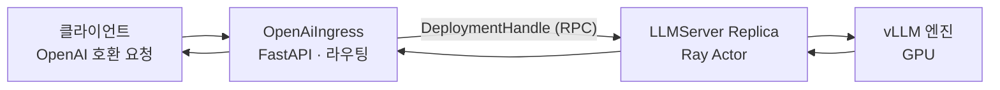

[앞선 두 실습](../llm-serving-single-model-lab/)은 서버 한 대에서 프로세스를 직접 띄웠다. 이번에는 **Kubernetes 위에 얹는다.** KubeRay Operator가 Ray 클러스터를 관리하고, 그 위에서 Ray Serve LLM이 vLLM 엔진을 감싸 **OpenAI 호환 엔드포인트**를 노출하는 구조를 만든다.

최종 목표는 하나다. `kubectl apply` 한 번으로 LLM 서빙이 뜨고, 모델을 바꾸려면 매니페스트만 고치면 되는 상태다.

이 매뉴얼의 명령 결과는 **실제로 실행한 것**이다. 본문(1~11절)은 k3s + 대용량 GPU 환경, 뒤쪽 12~14절은 **kind + RTX 3050 6GB로 축소해 검증한 결과**다.

## 1. 무엇을 쓰는지부터 정리

레이어가 여러 겹이라 이름이 헷갈리기 쉽다. 실습에 필요한 만큼만 짚는다.


| 이름                | 무엇인가                                              |
| ----------------- | ------------------------------------------------- |
| **Ray**           | Python/AI 애플리케이션을 단일 머신에서 클러스터로 확장하는 분산 컴퓨팅 프레임워크 |
| **Ray Serve**     | 학습된 모델을 HTTP 엔드포인트로 서빙하는 Ray의 상위 레이어              |
| **Ray Serve LLM** | vLLM 같은 추론 엔진을 Ray Serve 위에서 수평 확장시키는, LLM 특화 레이어 |
| **Ray Cluster**   | Head Node 1개 + Worker Node N개로 구성된 분산 시스템         |
| **KubeRay**       | Kubernetes에서 Ray 클러스터를 운영하는 공식 Operator           |
| **RayService**    | KubeRay의 CRD. RayCluster + Ray Serve 앱을 **함께** 관리 |


Ray 자체는 Core 위에 Data · Train · Tune · Serve · RLlib가 얹힌 구조인데, 이 실습에서 쓰는 것은 **Serve 하나**다.

### Ray Serve의 네 가지 개념

Ray Serve 문서를 읽을 때 걸리는 용어가 넷이다.

**Deployment** — Ray Serve의 기본 단위다. 비즈니스 로직이나 ML 모델을 담고 요청을 처리한다. `@serve.deployment` 데코레이터로 정의하며, 런타임에 여러 개의 replica(각각 별도 Ray Actor)로 확장된다.

```python
@serve.deployment
class MyFirstDeployment:
    def __init__(self, msg):
        self.msg = msg
    def __call__(self):
        return self.msg
```

**Application** — Deployment 하나 이상으로 구성된 **업그레이드 단위**다. 배포와 롤백이 이 단위로 이뤄진다.

**Ingress Deployment** — `serve.run()`에 전달되는 최상위 Deployment다. HTTP 요청을 받아 필요하면 다른 Deployment로 라우팅한다.

**DeploymentHandle** — Deployment 간 통신용 Python 네이티브 API다. 한 Deployment의 생성자에 다른 Deployment를 넘기면 런타임에 Handle로 바뀌어 비동기 호출이 가능해진다.

연결은 `.bind()`로 하고 `serve.run(ingress.bind(...))`로 실행한다. **이번 실습에서는 이 코드를 직접 쓰지 않는다.** `ray.serve.llm:build_openai_app`이 대신 만들어 주기 때문인데, 안에서 무슨 일이 벌어지는지는 알아 둘 필요가 있다.

### Ray Serve LLM의 구성 요소

`build_openai_app`이 만들어 내는 것이 이 둘이다.

**OpenAiIngress** — FastAPI 기반 진입점이다. OpenAI 호환 엔드포인트를 제공하고, 요청 라우팅과 모델 멀티플렉싱(LoRA 어댑터 관리 포함)을 담당한다.

**LLMServer** — 실제 추론 엔진(vLLM)을 감싸는 Ray Serve 배포 단위다. 세 가지 운영 모드를 지원한다.

- **독립형(standalone)** — replica마다 독립적으로 요청 처리 (이번 실습이 여기 해당)
- **배포 내 조율** — 데이터 병렬 attention, MoE 전문가 계층 조율
- **배포 간 조율** — prefill-decode 분리로 단계별 독립 확장

요청은 이렇게 흐른다.



**같은 노드의 replica를 우선 라우팅해 크로스노드 오버헤드를 줄이는 것**이 특징이다. 오토스케일링은 Ingress : LLMServer = **2:1** 비율이 권장값이며, `target_ongoing_requests`로 컴포넌트별 균형을 맞춘다.

## 2. RayService를 고르는 이유

KubeRay는 CRD를 네 개 제공한다.


| CRD            | 용도                                                 |
| -------------- | -------------------------------------------------- |
| **RayCluster** | Head/Worker 파드로 구성된 Ray 클러스터 자체의 생명주기 관리           |
| **RayJob**     | RayCluster를 만들어 Job 하나를 실행하고 완료되면 정리 (배치용)         |
| **RayService** | RayCluster 위에 Ray Serve 앱을 얹어 운영 — 무중단 업그레이드, 헬스체크 |
| **RayCronJob** | RayJob을 크론 스케줄로 반복 실행                              |


목표가 "vLLM을 서빙해서 OpenAI 호환 엔드포인트를 노출"하는 것이므로 **RayService**가 맞는다. RayCluster와의 차이는 다음과 같다.


| 항목        | RayCluster                                                   | **RayService**                                 |
| --------- | ------------------------------------------------------------ | ---------------------------------------------- |
| 역할 범위     | Ray 클러스터 자체만 관리                                              | **클러스터 + Serve 앱까지**                           |
| 배포 방식     | Helm 또는 CR 직접 apply                                          | 단일 매니페스트에 `rayClusterConfig` + `serveConfigV2` |
| 워크로드 접속   | head pod에 exec, 또는 dashboard port-forward 후 `ray job submit` | Serve용 Service(`-serve-svc`)로 **바로 HTTP**      |
| Serve 앱   | 없음 — `serve run`으로 직접 배포·갱신                                  | **자동 관리** — 무중단 in-place 업데이트                  |
| 헬스체크 / HA | Ray 자체 기능에 한정. k8s가 Serve 상태를 모름                             | `/-/routes` 기반으로 k8s가 Serve 상태까지 파악            |
| GPU 워커 설정 | `workerGroupSpec`에 직접 기술                                     | **동일** — 이 부분은 차이 없음                           |


정리하면 세 가지다. RayCluster만 쓰면 Serve 앱을 직접 올리고 파드가 죽었을 때 재배포도 챙겨야 한다. RayService는 무중단 업데이트와 헬스체크를 컨트롤러가 대신하므로 모델 교체나 replica 수 변경이 `kubectl apply` 한 번이면 된다. **GPU 워커 스펙 작성 난이도는 둘이 같으므로 RayCluster를 고를 이유가 없다.**

## 3. 실습 환경


| 항목           | 값                                                |
| ------------ | ------------------------------------------------ |
| 쿠버네티스        | k3s v1.36.2+k3s1                                 |
| Helm         | v3.20.0                                          |
| 노드           | 16 vCPU / 64GB RAM                               |
| GPU          | NVIDIA 1장 (실측 점유 14.9GB)                         |
| GPU 노출       | nvidia-device-plugin — `nvidia.com/gpu: 1` 정상 노출 |
| StorageClass | `local-path` (k3s 기본)                            |
| 모니터링         | kube-prometheus-stack + DCGM Exporter            |


사전에 필요한 것은 둘이다.

- **Hugging Face 계정과 access token** — gated 저장소 읽기 권한. RayService에 `HUGGING_FACE_HUB_TOKEN`으로 넣는다
- **GPU가 붙은 Kubernetes 클러스터** — GPU Operator 또는 device plugin으로 `nvidia.com/gpu`가 노드에 노출되어 있어야 한다

## 4. STEP 1 — KubeRay Operator 설치

전용 namespace로 분리한다. 공식 예시는 namespace 지정이 없어 `default`에 설치되지만, Operator는 격리해 두는 편이 낫다.

```bash
# 1. Helm repo 추가
helm repo add kuberay https://ray-project.github.io/kuberay-helm/
helm repo update kuberay

# 2. 버전 확인 (문서엔 1.6.0이 명시돼 있지만 실행 시점에 재확인)
helm search repo kuberay/kuberay-operator --versions | head -5

# 3. 설치
kubectl create namespace kuberay-system
helm install kuberay-operator kuberay/kuberay-operator \
  --version 1.6.0 \
  -n kuberay-system
```

CRD는 `helm install`에 포함되어 자동 설치된다. **별도로 `kubectl apply -f crds/`를 할 필요가 없다.**

### 설치 검증

```bash
kubectl get deploy -n kuberay-system -owide
kubectl get crd | grep ray.io
```

```terminal {title="kubectl get deploy -n kuberay-system"}
NAME               READY   UP-TO-DATE   AVAILABLE   AGE   CONTAINERS         IMAGES
kuberay-operator   1/1     1            1           80s   kuberay-operator   quay.io/kuberay/operator:v1.6.2
```

```terminal {title="kubectl get crd | grep ray.io"}
rayclusters.ray.io                             2026-08-09T09:57:38Z
raycronjobs.ray.io                             2026-08-09T09:57:38Z
rayjobs.ray.io                                 2026-08-09T09:57:38Z
rayservices.ray.io                             2026-08-09T09:57:39Z
```

CRD 네 개가 모두 올라왔다. 스키마를 미리 훑어 두면 매니페스트를 쓸 때 편하다.

```bash
kubectl explain rayservices.ray.io.spec
kubectl logs -n kuberay-system -l app.kubernetes.io/name=kuberay-operator --tail=30
```

## 5. STEP 2 — Hugging Face 토큰 Secret

공식 샘플 매니페스트를 받아 보면 맨 아래에 Secret 정의가 붙어 있다.

```bash
curl -o ray-service.llm-serve.yaml \
  https://raw.githubusercontent.com/ray-project/kuberay/master/ray-operator/config/samples/ray-service.llm-serve.yaml
tail ray-service.llm-serve.yaml
```

```yaml
apiVersion: v1
kind: Secret
metadata:
  name: hf-token
type: Opaque
stringData:
  hf_token: <your-hf-access-token-value>
```

## 6. STEP 3 — RayService 매니페스트

공식 예제는 GPU 4장 전제다. GPU 1장에 맞춰 조정했다.


| 항목                       | 공식 예제                 | 조정값                       | 이유                     |
| ------------------------ | --------------------- | ------------------------- | ---------------------- |
| 모델                       | `Qwen2.5-7B-Instruct` | `Qwen2.5-7B-Instruct-AWQ` | 4bit 양자화로 가중치 4~5GB    |
| `quantization`           | 미지정                   | `awq`                     | AWQ 커널 강제 사용           |
| `gpu_memory_utilization` | —                     | `0.85`                    | 가중치가 작아 KV 캐시를 넉넉히     |
| `max_model_len`          | 1024                  | `4096`                    | VRAM 여유가 생겨 실용적 길이로 상향 |
| `nvidia.com/gpu`         | 4                     | **1**                     | 물리 GPU 1장              |
| `num-gpus`               | "4"                   | **"1"**                   | 동일                     |
| `max_replicas`           | 4                     | **1**                     | 동일                     |
| worker CPU/메모리           | 32 / 32Gi             | **8 / 24Gi**              | 모니터링 스택과 공존            |


```yaml
apiVersion: ray.io/v1
kind: RayService
metadata:
  name: vllm-service
  namespace: kuberay
spec:
  serveConfigV2: |
    applications:
      - name: llms
        import_path: ray.serve.llm:build_openai_app
        route_prefix: "/"
        args:
          llm_configs:
            - model_loading_config:
                model_id: qwen2.5-7b-instruct-awq
                model_source: Qwen/Qwen2.5-7B-Instruct-AWQ
              engine_kwargs:
                dtype: auto
                quantization: awq
                max_model_len: 4096
                gpu_memory_utilization: 0.85
              deployment_config:
                autoscaling_config:
                  min_replicas: 1
                  max_replicas: 1        # 물리 GPU 1장 고정
                  target_ongoing_requests: 16
                max_ongoing_requests: 32
  rayClusterConfig:
    headGroupSpec:
      rayStartParams:
        num-gpus: "0"
      template:
        spec:
          containers:
            - name: ray-head
              image: rayproject/ray-llm:2.52.0-py311-cu128   # vLLM+CUDA 포함
              resources:
                limits:   {cpu: "2", memory: "5Gi"}
                requests: {cpu: "2", memory: "4Gi"}
              ports:
                - containerPort: 8000    # Serve
                - containerPort: 8080    # Metrics
                - containerPort: 6379    # GCS
                - containerPort: 8265    # Dashboard
                - containerPort: 10001   # Client
    workerGroupSpecs:
      - groupName: gpu-group
        replicas: 1
        minReplicas: 1
        maxReplicas: 1
        rayStartParams:
          num-gpus: "1"
        template:
          spec:
            containers:
              - name: ray-worker
                image: rayproject/ray-llm:2.52.0-py311-cu128
                resources:
                  limits:   {cpu: "8", memory: "24Gi", nvidia.com/gpu: 1}
                  requests: {cpu: "8", memory: "24Gi", nvidia.com/gpu: 1}
                env:
                  - name: HUGGING_FACE_HUB_TOKEN
                    valueFrom:
                      secretKeyRef:
                        name: hf-token
                        key: hf_token
```

읽을 때 짚어야 할 곳이 셋이다.

`**serveConfigV2`와 `rayClusterConfig`가 한 파일에 있다.** 이것이 RayService의 정체다. 앞의 것은 Serve 앱, 뒤의 것은 그 앱이 얹힐 클러스터다.

**Head는 GPU를 안 쓴다**(`num-gpus: "0"`). Ray Cluster의 Head는 Autoscaler, GCS(Global Control Store), 드라이버 프로세스를 돌리는 관리 노드다. 실제 추론은 Worker가 한다.

**이미지가 `ray-llm`이다.** vLLM과 CUDA가 포함된 11.6GB짜리 이미지라 최초 pull에 시간이 걸린다.

## 7. STEP 4 — 배포와 확인

```bash
kubectl apply -f vllm-service.yaml
kubectl get pods -n kuberay -w
```

AWQ 모델 다운로드만으로도 4~5GB다. 최초 로딩에 몇 분 걸리므로 로그로 진행 상황을 본다.

```bash
kubectl logs -n kuberay <worker-pod> -f
crictl images | grep -i ray
```

```terminal {title="crictl images"}
docker.io/rayproject/ray-llm      2.52.0-py311-cu128   3d6cdf97592a7   11.6GB
quay.io/kuberay/operator          v1.6.2               0e5759fe13013   30.3MB
```

파드가 둘 뜨면 정상이다. Head 하나, GPU Worker 하나다.

```terminal {title="kubectl get pods -n kuberay"}
NAME                                        READY   STATUS    RESTARTS   AGE
vllm-service-g6qjt-gpu-group-worker-wh275   1/1     Running   0          11m
vllm-service-g6qjt-head-ps2zr               1/1     Running   0          11m
```

```terminal {title="kubectl get rayservice -n kuberay"}
NAME           SERVICE STATUS   NUM SERVE ENDPOINTS
vllm-service   Running          2
```

`NUM SERVE ENDPOINTS`가 **2**인 것에 주목한다. OpenAiIngress와 LLMServer가 각각 하나씩이다. 상세 상태로 확인할 수 있다.

```bash
kubectl describe rayservices.ray.io vllm-service -n kuberay
```

```terminal {title="kubectl describe rayservice — Application Statuses"}
Status:
  Active Service Status:
    Application Statuses:
      Llms:
        Serve Deployment Statuses:
          LLMServer:qwen2_5-7b-instruct-awq:
            Status:  HEALTHY
          Open Ai Ingress:
            Status:    HEALTHY
        Status:        RUNNING
    Ray Cluster Name:  vllm-service-g6qjt
    Ray Cluster Status:
      Available Worker Replicas:  1
      Head:
        Pod IP:               10.42.0.30
        Pod Name:             vllm-service-g6qjt-head-ps2zr
        Service Name:         vllm-service-g6qjt-head-svc
      Ready Worker Replicas:  1
      State:                  ready
```

`**HEALTHY` / `RUNNING`이 될 때까지 기다린다.** 파드가 Running이어도 모델 로딩 중이면 여기가 아직 안 올라온다.

```terminal {title="kubectl get rayclusters.ray.io -n kuberay -owide"}
NAME                 DESIRED WORKERS   AVAILABLE WORKERS   CPUS   MEMORY   GPUS   STATUS   AGE   HEAD POD IP
vllm-service-g6qjt   1                 1                   10     28Gi     1      ready    13m   10.42.0.30
```

GPU도 확인한다.

```terminal {title="nvidia-smi"}
+-----------------------------------------------------------------------------------------+
| Processes:                                                                              |
|  GPU   GI   CI              PID   Type   Process name                        GPU Memory |
|=========================================================================================|
|    0   N/A  N/A           34359      C   ...RayWorkerWrapper.__ray_call__      14902MiB |
+-----------------------------------------------------------------------------------------+
```

프로세스 이름이 `RayWorkerWrapper.__ray_call__`이다. **vLLM이 Ray Actor로 감싸여 돌고 있다**는 증거다. 워커 로그에는 `Using executor class: vllm.v1.executor.ray_distributed_executor.RayDistributedExecutor → Started vLLM engine.` 이 찍힌다.

## 8. STEP 5 — 외부 노출과 요청 테스트

Serve 포트(8000)를 NodePort로 연다. selector에 들어갈 RayCluster 이름은 **배포 후에 확인한 실제 이름**을 써야 한다.

```bash
kubectl get pods -n kuberay --show-labels | grep head
```

```yaml
apiVersion: v1
kind: Service
metadata:
  name: vllm-service-nodeport
  namespace: kuberay
spec:
  type: NodePort
  selector:
    ray.io/node-type: head
    ray.io/cluster: vllm-service-g6qjt    # 배포 후 확인한 실제 이름
  ports:
    - name: serve
      port: 8000
      targetPort: 8000
      nodePort: 30005
```

OpenAI 호환 엔드포인트이므로 `/v1/chat/completions`를 그대로 쓴다.

```bash
curl -s http://192.168.254.150:30005/v1/chat/completions \
  -H 'Content-Type: application/json' \
  -d '{
    "model": "qwen2.5-7b-instruct-awq",
    "messages": [{"role":"user","content":"안녕, 너는 어떤 모델이야?"}]
  }' | jq
```

```terminal {title="POST /v1/chat/completions"}
{
  "id": "chatcmpl-6f6bb20c-c9b9-420f-a0b8-48dde2bc06db",
  "object": "chat.completion",
  "created": 1786272184,
  "model": "qwen2.5-7b-instruct-awq",
  "choices": [
    {
      "index": 0,
      "message": {
        "role": "assistant",
        "content": "안녕하세요! 저는 Alibaba Cloud에서 만든 Qwen이라는 언어 모델입니다. 대형 언어 모델로, 다양한 주제에 대해 대화할 수 있고 정보를 제공하는 데 도움을 줄 수 있습니다. 무엇을 도와드릴까요?"
      }
    }
  ]
}
```

`model` 필드에 넣는 값은 `**model_id**`(`qwen2.5-7b-instruct-awq`)이지 `model_source`가 아니다. 여기서 자주 틀린다.

## 9. STEP 6 — Ray Dashboard

Head의 8265 포트를 NodePort로 연다.

```terminal {title="kubectl get svc -n kuberay"}
NAME                              TYPE       CLUSTER-IP      EXTERNAL-IP   PORT(S)          AGE
vllm-service-dashboard-nodeport   NodePort   10.43.195.216   <none>        8265:30006/TCP   8s
```

Dashboard에서는 Serve 앱의 replica 상태, 요청 처리량, Ray Actor 목록을 실시간으로 볼 수 있다.

## 10. STEP 7 — Prometheus / Grafana 연동

이미 kube-prometheus-stack이 있다면 네 단계로 붙는다.


| 구분                   | 내용                                                   | 다운타임                |
| -------------------- | ---------------------------------------------------- | ------------------- |
| A. Prometheus 스크레이프  | PodMonitor 2개(head/worker) + operator ServiceMonitor | 없음                  |
| B. Grafana 대시보드      | KubeRay 공식 대시보드 5종을 ConfigMap으로 로드                   | 없음                  |
| C. Grafana embedding | `allow_embedding` + 익명 Viewer 허용                     | Grafana 파드 재시작(수 초) |
| D. Ray Dashboard 연동  | head에 `RAY_GRAFANA_HOST` 등 env 추가                    | **vLLM 서빙 수 분 중단**  |


**D는 다운타임이 있다.** head 파드의 env를 바꾸면 RayCluster가 재생성되기 때문이다. 서빙 중이라면 감안하고 진행한다.

```yaml
apiVersion: monitoring.coreos.com/v1
kind: PodMonitor
metadata:
  name: ray-head-monitor
  namespace: monitoring
  labels: {release: kube-prometheus-stack}
spec:
  jobLabel: ray-head
  namespaceSelector: {matchNames: [kuberay]}
  selector: {matchLabels: {ray.io/node-type: head}}
  podMetricsEndpoints:
    - port: metrics
      relabelings:
        - {action: replace, sourceLabels: [__meta_kubernetes_pod_label_ray_io_cluster], targetLabel: ray_io_cluster}
---
apiVersion: monitoring.coreos.com/v1
kind: PodMonitor
metadata:
  name: ray-workers-monitor
  namespace: monitoring
  labels: {release: kube-prometheus-stack}
spec:
  jobLabel: ray-workers
  namespaceSelector: {matchNames: [kuberay]}
  selector: {matchLabels: {ray.io/node-type: worker}}
  podMetricsEndpoints:
    - port: metrics
      relabelings:
        - {action: replace, sourceLabels: [__meta_kubernetes_pod_label_ray_io_cluster], targetLabel: ray_io_cluster}
```

공식 문서 예시와 다르게 한 부분이 둘이다. `**as-metrics`/`dash-metrics` 포트가 없어 `metrics`(8080) 하나만 스크레이프**했고, `namespaceSelector`도 예시의 `default` 대신 실제 namespace인 `kuberay`로 지정했다.

Operator 메트릭은 Helm 값으로 켠다.

```bash
helm upgrade kuberay-operator kuberay/kuberay-operator --version 1.6.2 -n kuberay-system \
  --set metrics.serviceMonitor.enabled=true \
  --set metrics.serviceMonitor.selector.release=kube-prometheus-stack
```

Grafana 대시보드는 KubeRay 공식 JSON을 ConfigMap + sidecar 방식으로 로드한다. sidecar가 `grafana_dashboard: "1"` 라벨을 전 namespace에서 자동으로 읽는다.

- `default_grafana_dashboard.json`
- `serve_grafana_dashboard.json`
- `serve_deployment_grafana_dashboard.json`
- `**serve_llm_grafana_dashboard.json**` — vLLM 서빙에 정확히 맞는 대시보드
- `KubeRay-Operator.json`

train/data 대시보드는 이 워크로드에서 쓰지 않으므로 제외했다.

```yaml
# Grafana 설정 (helm values)
grafana:
  grafana.ini:
    security:
      allow_embedding: true
    auth.anonymous:
      enabled: true
      org_role: Viewer
```

> **보안 참고**: 이렇게 하면 해당 포트에 접근 가능한 누구나 **로그인 없이 Grafana를 조회**할 수 있다. 편집은 불가능하지만 인증 없는 열람이 가능해지는 정책 변화이므로, 사설망 안에서만 쓴다.

## 11. STEP 8 — 부하 테스트

별도 패키지 없이 표준 라이브러리만으로 `/v1/chat/completions`를 반복 호출한다. 서버 로컬에서 `localhost:30005`로 직접 쳐서 네트워크 홉을 없앤다.


| 항목           | 값              | 이유                                                         |
| ------------ | -------------- | ---------------------------------------------------------- |
| 동시 요청        | 8              | `max_ongoing_requests: 32` 이내. replica 1개라 과도한 동시성은 큐잉만 유발 |
| 총 실행 시간      | 5분             | 트렌드만 확인                                                    |
| 프롬프트         | 고정된 짧은 문장      | 응답 길이가 매번 다르면 지표 해석이 어렵다                                   |
| `max_tokens` | 64             | 한 사이클을 짧게                                                  |
| 요청 방식        | 응답 오면 즉시 다음 요청 | closed-loop                                                |


```python
import concurrent.futures, json, time, urllib.request

URL = "http://localhost:30005/v1/chat/completions"
PAYLOAD = json.dumps({
    "model": "qwen2.5-7b-instruct-awq",
    "messages": [{"role": "user", "content": "Explain Kubernetes in one sentence."}],
    "max_tokens": 64,
}).encode()

def call():
    t0 = time.time()
    req = urllib.request.Request(URL, data=PAYLOAD, headers={"Content-Type": "application/json"})
    try:
        with urllib.request.urlopen(req, timeout=30) as r:
            r.read()
        return time.time() - t0, True
    except Exception:
        return time.time() - t0, False

def worker(stop_at):
    results = []
    while time.time() < stop_at:
        results.append(call())
    return results

stop_at = time.time() + 300  # 5분
with concurrent.futures.ThreadPoolExecutor(max_workers=8) as ex:
    futures = [ex.submit(worker, stop_at) for _ in range(8)]
    all_results = [r for f in futures for r in f.result()]

latencies = [r[0] for r in all_results]
success = sum(1 for r in all_results if r[1])
print(f"total={len(all_results)} success={success} avg={sum(latencies)/len(latencies):.2f}s "
      f"p95={sorted(latencies)[int(len(latencies)*0.95)]:.2f}s tput={len(all_results)/300:.2f} req/s")
```

### 실측 결과


| 지표              | 값                           |
| --------------- | --------------------------- |
| 총 요청            | 1177건                       |
| 성공 / 실패         | **1177 / 0 (100%)**         |
| 평균 지연시간         | 2.05s                       |
| p50 / p95 / p99 | 2.02s / 2.10s / 2.10s       |
| 처리량             | **3.92 req/s**              |
| GPU (부하 중)      | 사용률 99%, 전력 201.5W, 온도 66°C |
| GPU (종료 후)      | 즉시 idle 복귀 (0%, 52W)        |


읽을 지점이 셋이다.

**p50과 p99의 차이가 거의 없다**(2.02s ~ 2.10s). 동시 8요청 수준에서는 큐잉 지연 없이 안정적으로 처리됐다는 뜻이다.

**처리량이 산술과 정확히 맞는다.** 동시성 8 ÷ 평균지연 2.05s = 3.90, 실측 3.92 req/s다. **GPU가 병목으로 작동하며 예측 가능한 속도로 요청을 소화**하고 있다.

**실패 0건이다.** replica 1개 + AWQ 양자화 구성이 이 정도 부하는 여유롭게 감당한다.

부하가 도는 동안 Grafana에서 볼 것은 셋이다. Serve Dashboard의 전체 QPS와 레이턴시 분포, Serve Deployment Dashboard의 **ongoing/queued requests**(replica가 1개라 큐가 어떻게 쌓이는지가 핵심), DCGM 대시보드의 GPU 사용률 변화다.

## 12. RTX 3050 6GB로 축소하기

위 구성은 GPU가 14.9GB를 점유한다. **6GB에는 들어가지 않는다.** 모델과 설정을 함께 줄여야 한다.

> 아래 값은 **RTX 3050 6GB에서 실제로 배포해 검증했다.** 클러스터를 만드는 절차는 13절, 배포와 실측 결과는 14절에 있다.


| 항목 | 원본 | 6GB 검증값 | 근거 |
| --- | --- | --- | --- |
| 모델 | `Qwen2.5-7B-Instruct-AWQ` | `Qwen/Qwen2.5-1.5B-Instruct-AWQ` | 가중치 약 1.1GB |
| `gpu_memory_utilization` | 0.85 | **0.70** | 6GB × 0.7 = 4.2GB. 디스플레이 점유분 여유 확보 |
| `max_model_len` | 4096 | **2048** | KV 캐시 예산 축소 |
| `max_ongoing_requests` | 32 | **8** | replica 1개 기준 큐 과적 방지 |
| `target_ongoing_requests` | 16 | **4** | 동일 |
| worker CPU / 메모리 | 8 / 24Gi | **4 / 12Gi** | 노드가 12 core / 31GB |

부하 테스트도 동시 요청을 8에서 **4**로 낮춘다. GPU가 작을수록 큐잉이 빨리 시작된다.

**디스크가 별도 관문이다.** `rayproject/ray-llm` 이미지가 11.6GB(전개 시 약 20GB)이므로 여유를 확인하고 시작한다.

Qwen2.5 AWQ 계열은 gated 저장소가 아니므로 **Hugging Face 토큰 없이도 받아진다.** 6GB 경로에서는 STEP 2를 건너뛰고 매니페스트의 `env` 블록도 지운다. 실제로 토큰 없이 배포가 끝까지 진행됐다.

kind에서는 매니페스트에 **두 줄이 더 필요하다.**

```yaml
    workerGroupSpecs:
      - groupName: gpu-group
        template:
          spec:
            runtimeClassName: nvidia          # 추가 — 13절에서 만든 RuntimeClass
            containers:
              - name: ray-worker
                imagePullPolicy: IfNotPresent  # 추가 — 미리 받은 11.6GB 재사용
```

## 13. 6GB 환경 구축 — kind + GPU

축소 구성을 실제로 돌려 보려고 별도 서버에 실습 환경을 만들었다. 원본은 k3s였지만 이 서버에는 **kind**로 구성했다. **여기까지는 실측으로 검증했고**, KubeRay 배포는 다음 단계로 남겨 뒀다.

### 대상 서버가 문서의 서버와 다르다


|           | 문서 속 서버              | 점검한 서버                              |
| --------- | -------------------- | ----------------------------------- |
| 쿠버네티스     | k3s v1.36.2+k3s1     | **k3s 미설치.** kind 클러스터가 있으나 중지 상태   |
| GPU       | 14.9GB 점유 (16GB급 이상) | **RTX 3050 6GB**                    |
| CPU / 메모리 | 16 vCPU / 64GB       | 12 core / 31GB                      |
| Helm      | v3.20.0              | v4.1.3                              |
| OS        | —                    | Ubuntu 24.04.2 LTS, kernel 7.0.0-28 |


### 앞선 실습의 잔여 프로세스

멀티 모델 서빙 실습의 프로세스가 **21시간 29분째** 살아 있었다. GPU 847MiB를 잡고 있어 정리했다.

```terminal {title="정리 전후 GPU"}
# 정리 전
pid, process_name, used_gpu_memory [MiB]
129733, python, 420 MiB          ← multi_model_serving 앱
138328, tritonserver, 148 MiB    ← triton-densenet 컨테이너

# 정리 후
memory.used [MiB], memory.free [MiB]
421 MiB, 5369 MiB
```

**실습을 끝내면 정리 절차를 반드시 돌려야 한다**는 것을 확인한 셈이다.

### 기존 클러스터가 고장나 있었다

원래 있던 kind 클러스터는 기동해도 API 서버가 올라오지 않았다. 원인은 노드 안 containerd다.

```terminal {title="journalctl -u containerd (kind 노드 내부)"}
containerd: drop-in config version 4 higher than root config version 2
containerd.service: Main process exited, code=exited, status=1/FAILURE
containerd.service: Failed with result 'exit-code'.
containerd.service: Scheduled restart job, restart counter is at 354
```

| 파일 | version |
| --- | --- |
| `/etc/containerd/config.toml` (루트) | 2 |
| `/etc/containerd/conf.d/99-nvidia.toml` (드롭인) | **4** |

드롭인의 설정 버전이 루트보다 높아 containerd가 기동을 거부하고, 그 결과 kubelet이 `activating`에서 멈춘다. **재시작 카운터 354**가 누적된 고장임을 보여준다.

**원인은 뒤에서 규명됐다.** `nvidia-ctk runtime configure`를 `--config` 없이 실행하면 이 상태가 재현된다. 자세한 것은 아래 2단계에 적었다. 클러스터를 새로 만들어 해결했다.

### 사전 조건 확인

kind로 GPU를 붙이려면 호스트에 두 가지가 있어야 한다. **둘 다 이미 충족돼 있었다.**

```bash
docker info --format '{{.DefaultRuntime}}'                    # nvidia
grep accept-nvidia /etc/nvidia-container-runtime/config.toml  # = true
```

두 번째 값이 핵심이다. `accept-nvidia-visible-devices-as-volume-mounts = true`이면 **특정 경로에 무엇이든 마운트하는 것만으로 GPU를 컨테이너에 주입**할 수 있다. 이것이 kind에서 GPU를 쓰는 통로가 된다.

### 1단계 — 클러스터 생성

```yaml
# kind-gpu.yaml
kind: Cluster
apiVersion: kind.x-k8s.io/v1alpha4
name: gpu
nodes:
  - role: control-plane
    extraMounts:
      # GPU 전체를 노드에 주입
      - hostPath: /dev/null
        containerPath: /var/run/nvidia-container-devices/all
      # NVIDIA Container Toolkit 을 노드 안으로
      - {hostPath: /usr/bin/nvidia-container-runtime,      containerPath: /usr/bin/nvidia-container-runtime}
      - {hostPath: /usr/bin/nvidia-container-runtime-hook, containerPath: /usr/bin/nvidia-container-runtime-hook}
      - {hostPath: /usr/bin/nvidia-container-cli,          containerPath: /usr/bin/nvidia-container-cli}
      - {hostPath: /usr/bin/nvidia-container-toolkit,      containerPath: /usr/bin/nvidia-container-toolkit}
      - {hostPath: /usr/bin/nvidia-ctk,                    containerPath: /usr/bin/nvidia-ctk}
      - {hostPath: /usr/lib/x86_64-linux-gnu/libnvidia-container.so.1.19.1,    containerPath: /usr/lib/x86_64-linux-gnu/libnvidia-container.so.1}
      - {hostPath: /usr/lib/x86_64-linux-gnu/libnvidia-container-go.so.1.19.1, containerPath: /usr/lib/x86_64-linux-gnu/libnvidia-container-go.so.1}
      - {hostPath: /etc/nvidia-container-runtime/config.toml, containerPath: /etc/nvidia-container-runtime/config.toml}
    extraPortMappings:
      - {containerPort: 30005, hostPort: 30005, listenAddress: "0.0.0.0"}   # Ray Serve
      - {containerPort: 30006, hostPort: 30006, listenAddress: "0.0.0.0"}   # Ray Dashboard
```

```bash
kind create cluster --config kind-gpu.yaml
docker exec gpu-control-plane nvidia-smi -L
```

```terminal {title="노드 안 nvidia-smi -L"}
GPU 0: NVIDIA GeForce RTX 3050 (UUID: GPU-472e819b-4b07-4fd5-ce17-9f1d2b6c17c6)
```

`extraMounts`가 두 가지 일을 한다. **`/var/run/nvidia-container-devices/all`** 마운트는 앞의 `accept-...-as-volume-mounts` 설정과 짝을 이뤄 GPU 디바이스와 드라이버 라이브러리를 노드에 주입한다. **나머지 마운트**는 toolkit 바이너리를 노드로 들여보내는데, 다음 단계에서 필요하다.

`extraPortMappings`는 나중에 Ray Serve와 Dashboard를 NodePort로 노출할 때 쓴다. kind는 노드가 컨테이너라 이 매핑이 없으면 호스트에서 NodePort에 닿지 않는다.

### 2단계 — 노드 containerd에 nvidia 런타임 등록

노드에 GPU가 보이는 것과 **파드에 GPU가 보이는 것은 다른 문제다.** 노드 안 containerd가 nvidia 런타임을 알아야 한다.

```bash
docker exec gpu-control-plane \
  nvidia-ctk runtime configure --runtime=containerd \
             --config=/etc/containerd/config.toml --set-as-default
docker exec gpu-control-plane systemctl restart containerd
```

> **`--config` 를 반드시 지정한다.** 이 옵션 없이 실행하면 nvidia-ctk가 루트 설정의 버전을 참조하지 않고 드롭인을 상위 버전으로 써서, 앞에서 본 `drop-in config version 4 higher than root config version 2` 로 containerd가 기동을 거부한다. `--config`로 루트 파일을 지정하면 드롭인도 같은 `version = 2`로 생성된다.

```terminal {title="생성된 드롭인 확인"}
$ docker exec gpu-control-plane grep -m1 ^version /etc/containerd/conf.d/99-nvidia.toml
version = 2

$ docker exec gpu-control-plane systemctl show containerd -p NRestarts --value
0
```

재시작 카운터가 **0**이면 정상이다.

### 3단계 — RuntimeClass와 device plugin

```bash
kubectl apply -f - <<'EOF'
apiVersion: node.k8s.io/v1
kind: RuntimeClass
metadata:
  name: nvidia
handler: nvidia
EOF

kubectl label node gpu-control-plane nvidia.com/gpu.present=true --overwrite

helm repo add nvdp https://nvidia.github.io/k8s-device-plugin
helm install nvdp nvdp/nvidia-device-plugin \
  -n nvidia-device-plugin --create-namespace
```

**라벨을 직접 붙이는 이유**가 있다. device plugin의 DaemonSet은 nodeAffinity로 `feature.node.kubernetes.io/pci-10de.present` 또는 `nvidia.com/gpu.present` 라벨을 요구한다. 앞의 것은 Node Feature Discovery가 붙여 주는데 NFD를 설치하지 않았으므로, 뒤의 것을 수동으로 붙인다. 라벨이 없으면 DaemonSet의 `DESIRED`가 **0**이 되고 파드가 아예 생성되지 않는다.

### 4단계 — 검증

```bash
kubectl get node gpu-control-plane -o jsonpath='{.status.allocatable}'
```

```terminal {title="노드 allocatable"}
{"cpu":"12"
"memory":"32683004Ki"
"nvidia.com/gpu":"1"
```

실제 파드에서 GPU가 잡히는지가 최종 확인이다.

```yaml
apiVersion: v1
kind: Pod
metadata:
  name: gpu-test
spec:
  restartPolicy: Never
  runtimeClassName: nvidia
  containers:
    - name: cuda
      image: nvidia/cuda:12.4.1-base-ubuntu22.04
      command: ["nvidia-smi"]
      resources:
        limits:
          nvidia.com/gpu: 1
```

```terminal {title="kubectl logs gpu-test"}
+-----------------------------------------------------------------------------------------+
| NVIDIA-SMI 595.84                 Driver Version: 595.84         CUDA Version: 13.2     |
+-----------------------------------------+------------------------+----------------------+
| GPU  Name                 Persistence-M | Bus-Id          Disp.A | Volatile Uncorr. ECC |
|=========================================+========================+======================|
|   0  NVIDIA GeForce RTX 3050        Off |   00000000:01:00.0 Off |                  N/A |
| 32%   38C    P8             11W /   70W |     265MiB /   6144MiB |      0%      Default |
+-----------------------------------------+------------------------+----------------------+
```

### 구축 중 만난 문제 셋

순서대로 겪은 것이고, 각각이 앞 단계의 이유를 설명한다.

| 증상 | 원인 | 해결 |
| --- | --- | --- |
| 노드에 `/dev/nvidia0`은 있는데 `nvidia-smi`가 없음 | 노드 컨테이너에 `NVIDIA_*` env가 없어 toolkit이 userspace를 주입하지 않음 | `/var/run/nvidia-container-devices/all` 마운트 |
| device plugin DaemonSet의 `DESIRED`가 0 | nodeAffinity가 요구하는 NFD 라벨이 없음 | `nvidia.com/gpu.present=true` 라벨 부착 |
| 파드에서 `Failed to initialize NVML: ERROR_LIBRARY_NOT_FOUND` | 노드엔 GPU가 있어도 노드 안 containerd에 nvidia 런타임이 없어 파드로 전달 안 됨 | toolkit을 노드에 마운트 후 containerd에 등록 |

세 번째가 가장 헷갈린다. **노드에서 `nvidia-smi`가 되는 것과 파드에서 되는 것은 별개**이며, 둘 사이를 잇는 것이 containerd의 런타임 설정이다.

### 최종 상태

| 항목 | 값 |
| --- | --- |
| kind | v0.32.0, 노드 `kindest/node:v1.36.1` |
| 컨테이너 런타임 | containerd 2.3.1, 재시작 0회 |
| 노드 | `gpu-control-plane` **Ready** |
| Allocatable | cpu 12 / memory 31.2Gi / **`nvidia.com/gpu: 1`** |
| 파드 GPU 접근 | 검증 완료 |
| GPU 여유 | 5,525 MiB |
| 디스크 여유 | 251GB |

여기까지가 12절의 축소 구성을 배포할 수 있는 상태다.

## 14. 6GB 배포 실측

12절의 축소값을 이 kind 클러스터에 실제로 배포했다. **토큰 없이, GPU 1장 6GB에서 끝까지 동작했다.**

### KubeRay Operator

4절과 같은 명령이 그대로 통했다.

```terminal {title="helm list -n kuberay-system"}
NAME              NAMESPACE       REVISION  STATUS    CHART
kuberay-operator  kuberay-system  1         deployed  kuberay-operator-1.6.0

NAME              READY  UP-TO-DATE  AVAILABLE  IMAGES
kuberay-operator  1/1    1           1          quay.io/kuberay/operator:v1.6.0
```

> 원본 문서에는 이미지가 `v1.6.2`로 찍혀 있다. **차트 버전과 이미지 태그가 따로 움직인다.** `--version 1.6.0`으로 설치하면 이미지도 v1.6.0이 되므로, 원본 기록은 이후 업그레이드했거나 당시 차트가 다른 태그를 참조한 것으로 보인다.

### 이미지 사전 확보

파드가 뜬 뒤 받게 하면 기동이 오래 걸리므로 미리 받는다.

```bash
docker exec gpu-control-plane crictl pull docker.io/rayproject/ray-llm:2.52.0-py311-cu128
```

```terminal {title="crictl images"}
IMAGE                          TAG                  IMAGE ID       SIZE
docker.io/rayproject/ray-llm   2.52.0-py311-cu128   3d6cdf97592a7  11.6GB
```

이미지 ID가 원본 문서와 같다. 디스크는 이 과정에서 **184GB → 204GB**로 약 20GB 늘었다.

### 배포와 기동

```terminal {title="kubectl get pods -n kuberay"}
NAME                                        READY   STATUS    RESTARTS   AGE
vllm-service-bslgp-gpu-group-worker-98c4b   1/1     Running   0          2m16s
vllm-service-bslgp-head-ks8hd               1/1     Running   0          2m16s
```

```terminal {title="applicationStatuses"}
Application Statuses:
  Llms:
    Serve Deployment Statuses:
      LLMServer:qwen2_5-1_5b-instruct-awq:
        Status:  HEALTHY
      Open Ai Ingress:
        Status:    HEALTHY
    Status:        RUNNING
Ray Cluster Name:  vllm-service-bslgp
```

`RUNNING`까지 약 **2분**이 걸렸다. 이미지를 미리 받아 뒀으므로 대부분은 모델 다운로드와 vLLM 엔진 초기화 시간이다.

```terminal {title="nvidia-smi (기동 후)"}
memory.used [MiB], memory.free [MiB]
5155 MiB, 635 MiB
```

**6,144MiB 중 5,155MiB를 점유했다.** `gpu_memory_utilization: 0.70`이 6GB의 70%인 약 4.3GB를 KV 캐시로 잡고, 거기에 CUDA 컨텍스트와 가중치가 더해진 값이다. 여유가 635MiB뿐이므로 **이 설정이 6GB의 상한에 가깝다.**

### 추론 확인

```bash
curl -s http://localhost:30005/v1/chat/completions -H 'Content-Type: application/json' \
  -d '{"model":"qwen2.5-1.5b-instruct-awq",
       "messages":[{"role":"user","content":"안녕, 너는 어떤 모델이야?"}],
       "max_tokens":80}'
```

```terminal {title="POST /v1/chat/completions (6GB)"}
{
  "id": "chatcmpl-d84b8adf-7ec8-44fa-96df-909b471cd59e",
  "model": "qwen2.5-1.5b-instruct-awq",
  "choices": [{
    "index": 0,
    "message": {
      "role": "assistant",
      "content": "나는 Qwen이라고 불릴 수 있습니다. 이것은 대규모의 언어 모델입니다."
    },
    "finish_reason": "stop"
  }],
  "usage": {"prompt_tokens": 40, "total_tokens": 62, "completion_tokens": 22}
}
```

7B가 내놓던 답변보다 짧고 단조롭다. **모델을 1/5로 줄인 대가가 응답 품질로 나타난다.**

### 부하 테스트 — 7B와 비교

11절과 같은 스크립트를 동시 요청 4, 3분으로 조정해 돌렸다.

| 지표 | 7B-AWQ (16GB급) | **1.5B-AWQ (6GB)** |
| --- | --- | --- |
| 동시 요청 | 8 | 4 |
| 실행 시간 | 5분 | 3분 |
| 총 요청 | 1177건 | **419건** |
| 성공 / 실패 | 1177 / 0 | **419 / 0 (100%)** |
| 평균 지연 | 2.05s | **1.72s** |
| p50 / p95 / p99 | 2.02 / 2.10 / 2.10s | **1.65 / 2.24 / 2.60s** |
| 처리량 | 3.92 req/s | **2.33 req/s** |
| GPU (부하 중) | 99%, 201.5W, 66°C | **98%, 68.95W, 65°C** |
| GPU (유휴) | 0%, 52W | **0%, 23.72W** |

읽을 지점이 셋이다.

**모델이 작은데 처리량은 오히려 낮다**(3.92 → 2.33 req/s). 동시 요청을 8에서 4로 줄였기 때문이다. 앞서 본 관계를 적용하면 4 ÷ 1.72s = 2.33으로 정확히 맞는다. **처리량은 모델 크기가 아니라 동시성이 정한다**는 것이 두 실측을 나란히 놓으면 드러난다.

**지연 편차는 6GB 쪽이 크다.** 7B는 p50과 p99가 0.08s 차이인데, 1.5B는 0.95s 벌어진다. VRAM 여유가 635MiB뿐이라 KV 캐시 블록이 빠듯하고, 요청이 겹칠 때 스케줄링 대기가 생기는 것으로 보인다. **작은 GPU에서는 평균보다 꼬리 지연을 봐야 한다.**

**전력이 1/3이다**(201.5W → 68.95W). GPU 사용률은 둘 다 98~99%인데 소비 전력은 크게 다르다. 사용률은 "SM이 일을 하고 있는 시간 비율"일 뿐이며, **얼마나 많은 연산을 하는지는 알려주지 않는다.**

### 6GB에서 확인된 것

- 1.5B-AWQ + `gpu_memory_utilization: 0.70` + `max_model_len: 2048` 조합은 **6GB에서 동작한다.** 다만 여유가 635MiB로 상한에 가깝다
- **Hugging Face 토큰이 필요 없다.** Qwen2.5 AWQ는 gated가 아니라 STEP 2를 통째로 건너뛴다
- kind에서는 worker에 **`runtimeClassName: nvidia`** 가 필요하다. 없으면 파드가 GPU를 못 받는다
- 실패 0건으로, 이 구성이 동시 4요청은 안정적으로 감당한다

## 15. 트러블슈팅


| 증상                                         | 원인                                   | 조치                    |
| ------------------------------------------ | ------------------------------------ | --------------------- |
| 파드는 Running인데 `applicationStatuses`가 안 올라옴 | 모델 다운로드/로딩 중 (AWQ 4~5GB)             | 워커 로그를 `-f`로 보며 대기    |
| `curl`이 모델을 못 찾음                           | `model`에 `model_source`를 넣음          | `**model_id**` 값을 넣는다 |
| NodePort로 접속 안 됨                           | selector의 RayCluster 이름 불일치          | 배포 후 실제 이름 확인해 반영     |
| 이미지 pull이 매우 오래 걸림                         | `ray-llm` 이미지 11.6GB                 | 정상. 사전에 pull          |
| head env 변경 후 서빙 중단                        | RayCluster 재생성                       | 정상 동작. 다운타임 감안        |
| GPU OOM                                    | `gpu_memory_utilization`이 VRAM 대비 과다 | 모델/설정 축소 (12절)        |
| kind 클러스터 API 서버 미기동 | `nvidia-ctk`가 쓴 드롭인 config 버전이 루트보다 높음 | `--config=/etc/containerd/config.toml` 지정해 재실행 (13절) |
| 파드에서 `NVML ERROR_LIBRARY_NOT_FOUND` | 노드 containerd에 nvidia 런타임 미등록 | 13절 2단계 |
| device plugin 파드가 안 뜸 (`DESIRED` 0) | NFD 라벨 부재 | `nvidia.com/gpu.present=true` 라벨 부착 (13절 3단계) |


### `pkill -f` 사용 시 주의

원격 정리 중 겪은 함정이다. SSH로 아래를 실행하면 **명령을 실행하는 셸 자신이 먼저 죽는다.**

```bash
ssh host 'pkill -f "python -m app.server"; echo done'   # done이 안 찍힌다
```

`pkill -f`는 프로세스의 전체 커맨드라인을 매칭하는데, 원격 셸의 커맨드라인에 그 문자열이 그대로 들어 있기 때문이다. 뒤따르는 명령이 통째로 실행되지 않으므로, **정리 명령과 후속 작업은 분리해서 실행**한다.

## 16. 리소스 제거

```bash
kubectl delete -f vllm-service.yaml
kubectl delete svc -n kuberay vllm-service-nodeport vllm-service-dashboard-nodeport
helm uninstall kuberay-operator -n kuberay-system
kubectl delete namespace kuberay kuberay-system

nvidia-smi                                   # GPU 반환 확인
crictl rmi docker.io/rayproject/ray-llm:2.52.0-py311-cu128   # 11.6GB 회수
```

## 17. 정리

**RayService는 클러스터와 앱을 한 파일로 묶는다.** `rayClusterConfig`와 `serveConfigV2`가 함께 있어서, 모델을 바꾸든 replica를 늘리든 `kubectl apply` 한 번으로 끝난다. RayCluster만 썼다면 Serve 앱 배포와 장애 복구를 직접 챙겨야 했다.

**Head는 GPU를 쓰지 않는다.** Autoscaler와 GCS를 돌리는 관리 노드이고, 추론은 Worker가 전담한다. `nvidia-smi`에 `RayWorkerWrapper.__ray_call__`만 잡히는 것이 그 증거다.

**처리량은 예측 가능했다.** 동시성 8 ÷ 평균지연 2.05s = 3.90, 실측 3.92 req/s. GPU가 병목으로 안정적으로 작동한다는 뜻이고, 이 관계를 알면 필요한 GPU 수를 역산할 수 있다.

**모델 크기가 아니라 설정이 VRAM을 정한다.** 7B 모델이 AWQ 양자화로 가중치는 4~5GB인데 실제 점유는 14.9GB였다. `gpu_memory_utilization: 0.85`가 나머지를 KV 캐시로 잡았기 때문이다. 이 감각은 [앞선 vLLM 실습](../llm-serving-single-model-lab/)에서 본 것과 같다.