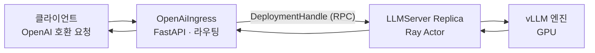
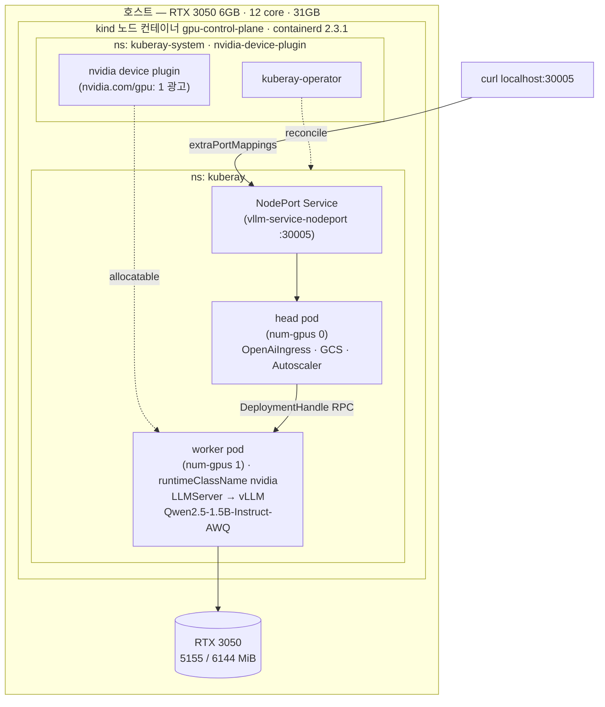
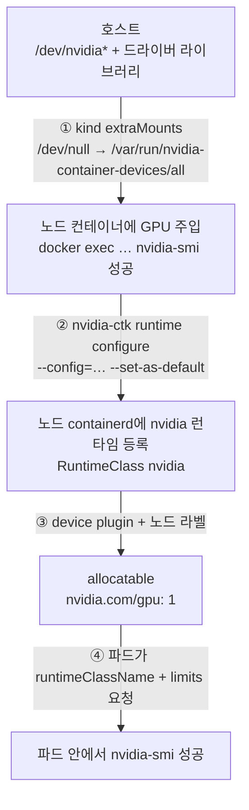

[앞선 두 실습](../llm-serving-single-model-lab/)은 서버 한 대에서 프로세스를 직접 띄웠다. 이번에는 **Kubernetes 위에 얹는다.** KubeRay Operator가 Ray 클러스터를 관리하고, 그 위에서 Ray Serve LLM이 vLLM 엔진을 감싸 **OpenAI 호환 엔드포인트**를 노출하는 구조를 만든다.

최종 목표는  `kubectl apply` 한 번으로 LLM 서빙이 뜨고 모델을 바꾸려면 매니페스트만 고치면 되는 상태다.

 **RTX 3050 6GB 한 장이 달린 리눅스 데스크톱에서 실제로 실행한다.**

## 1. Ray 종류


| 이름                | 무엇인가                                              |
| ----------------- | ------------------------------------------------- |
| **Ray**           | Python/AI 애플리케이션을 단일 머신에서 클러스터로 확장하는 분산 컴퓨팅 프레임워크 |
| Ray Serve         | 학습된 모델을 HTTP 엔드포인트로 서빙하는 Ray의 상위 레이어              |
| **Ray Serve LLM** | vLLM 같은 추론 엔진을 Ray Serve 위에서 수평 확장시키는, LLM 특화 레이어 |
| **Ray Cluster**   | Head Node 1개 + Worker Node N개로 구성된 분산 시스템         |
| **KubeRay**       | Kubernetes에서 Ray 클러스터를 운영하는 공식 Operator           |
| **RayService**    | **KubeRay의 CRD. RayCluster + Ray Serve 앱을 함께 관리** |


Ray 자체는 Core 위에 Data · Train · Tune · Serve · RLlib가 얹힌 구조인데 이 실습에서 쓰는 것은 **Serve 하나**다.

### Ray Serve의 네 가지 개념

**Deployment** 

- Ray Serve의 기본 단위다. 비즈니스 로직이나 ML 모델을 담고 요청을 처리한다. `@serve.deployment` 데코레이터로 정의하며, 런타임에 여러 개의 replica(각각 별도 Ray Actor)로 확장된다.

```python
@serve.deployment
class MyFirstDeployment:
    def __init__(self, msg):
        self.msg = msg
    def __call__(self):
        return self.msg
```

**Application**

-  Deployment 하나 이상으로 구성된 **업그레이드 단위**다. 배포와 롤백이 이 단위로 이뤄진다.

**Ingress Deployment** 

- `serve.run()`에 전달되는 최상위 Deployment다. HTTP 요청을 받아 필요하면 다른 Deployment로 라우팅한다.

**DeploymentHandle**

- Deployment 간 통신용 Python 네이티브 API다. 한 Deployment의 생성자에 다른 Deployment를 넘기면 런타임에 Handle로 바뀌어 비동기 호출이 가능해진다.

연결은 `.bind()`로 하고 `serve.run(ingress.bind(...))`로 실행한다. **이번 실습에서는 이 코드를 직접 쓰지 않는다.** `ray.serve.llm:build_openai_app`이 대신 만들어 주기 때문인데, 안에서 무슨 일이 벌어지는지는 알아 둘 필요가 있다.

### Ray Serve LLM의 구성 요소

`build_openai_app`이 만들어 내는 것이 이 둘이다.

**OpenAiIngress** — FastAPI 기반 진입점이다. OpenAI 호환 엔드포인트를 제공하고, 요청 라우팅과 모델 멀티플렉싱(LoRA 어댑터 관리 포함)을 담당한다.

**LLMServer** — 실제 추론 엔진(vLLM)을 감싸는 Ray Serve 배포 단위다. 세 가지 운영 모드를 지원한다.

- **독립형(standalone)** — replica마다 독립적으로 요청 처리 (이번 실습이 여기 해당)
- **배포 내 조율** — 데이터 병렬 attention, MoE 전문가 계층 조율
- **배포 간 조율** — prefill-decode 분리로 단계별 독립 확장

요청흐름



기본 request router는 **같은 노드의 replica를 먼저 고른다.** 다만 [공식 문서](https://docs.ray.io/en/latest/serve/llm/architecture/overview.html)는 이 크로스노드 오버헤드가 **LLM 서빙에서는 미미하다**고한다. 고동시성에서 TTFT에 몇 ms 붙는 수준이라, 요청당 수백 ms에서 수 초가 걸리는 LLM에서는 챙겨야 할 최적화가 아니라 기본값으로 두면 되는 항목이다.

정작 병목은 다른 쪽에 생긴다. `OpenAiIngress`는 FastAPI 기반이라 **단일 이벤트 루프**로 돌고, GPU 없이 파싱·라우팅·스트리밍 중계만 하는데도 동시성이 오르면 여기 CPU가 먼저 포화된다. 그래서 문서는 **Ingress : LLMServer = 2:1** 이상을 권장한다. Ingress replica는 GPU를 쓰지 않으므로 늘려도 비용 부담이 작다.

오토스케일링이 돌면 두 컴포넌트가 제각각 늘어나 비율이 깨진다. 이를 막으려고 `target_ongoing_requests`를 비율에 맞춰 미리 잡아 둔다.


| 단계                                     | 문서의 예시 값          |
| -------------------------------------- | ----------------- |
| vLLM 프로파일링으로 구한 최대 동시 요청               | 64                |
| `LLMServer`의 `target_ongoing_requests` | **48** (최대치의 75%) |
| `Ingress`의 `target_ongoing_requests`   | **24** (2:1 유지)   |


Ingress가 24에서 먼저 스케일아웃되므로 항상 2배 앞서 늘어난다. LLMServer를 64가 아닌 48로 잡는 것은 여유분인데 최대치에 맞추면 스케일아웃이 끝나기 전에 포화되기 때문이다.

(이 실습에는 replica 1개에 `max_ongoing_requests: 8` 구성이라 스케일아웃 자체가 일어나지 않는다.)

## 2. RayService를 고르는 이유

KubeRay의 CRD


| CRD            | 용도                                                 |
| -------------- | -------------------------------------------------- |
| **RayCluster** | Head/Worker 파드로 구성된 Ray 클러스터 자체의 생명주기 관리           |
| **RayJob**     | RayCluster를 만들어 Job 하나를 실행하고 완료되면 정리 (배치용)         |
| **RayService** | RayCluster 위에 Ray Serve 앱을 얹어 운영 — 무중단 업그레이드, 헬스체크 |
| **RayCronJob** | RayJob을 크론 스케줄로 반복 실행                              |


목표가 "vLLM을 서빙해서 OpenAI 호환 엔드포인트를 노출"하는 것이므로 **RayService**를 선택한다. RayCluster와의 차이는 다음과 같다.


| 항목        | RayCluster                                                   | **RayService**                                 |
| --------- | ------------------------------------------------------------ | ---------------------------------------------- |
| 역할 범위     | Ray 클러스터 자체만 관리                                              | **클러스터 + Serve 앱까지**                           |
| 배포 방식     | Helm 또는 CR 직접 apply                                          | 단일 매니페스트에 `rayClusterConfig` + `serveConfigV2` |
| 워크로드 접속   | head pod에 exec, 또는 dashboard port-forward 후 `ray job submit` | Serve용 Service로 **바로 HTTP**                    |
| Serve 앱   | 없음 — `serve run`으로 직접 배포·갱신                                  | **자동 관리** — 무중단 in-place 업데이트                  |
| 헬스체크 / HA | Ray 자체 기능에 한정. k8s가 Serve 상태를 모름                             | `/-/routes` 기반으로 k8s가 Serve 상태까지 파악            |
| GPU 워커 설정 | `workerGroupSpec`에 직접 기술                                     | **동일** — 이 부분은 차이 없음                           |


정리하면 RayCluster만 쓰면 Serve 앱을 직접 올리고 파드가 죽었을 때 재배포도 챙겨야 한다. RayService는 무중단 업데이트와 헬스체크를 컨트롤러가 대신하므로 모델 교체나 replica 수 변경이 `kubectl apply` 한 번이면 된다. **GPU 워커 스펙 작성 난이도는 둘이 같으므로 RayCluster를 고를 이유가 없다.**

## 3. 실습 환경


| 항목                       | 값                                                             |
| ------------------------ | ------------------------------------------------------------- |
| OS                       | Ubuntu 24.04.2 LTS, kernel 7.0.0-28-generic, x86_64           |
| CPU / 메모리                | 12 core / 31GB                                                |
| **GPU**                  | **NVIDIA GeForce RTX 3050 6144MiB**, Compute Capability 8.6   |
| 드라이버                     | 595.84 (CUDA 13.2)                                            |
| 컨테이너                     | Docker — **DefaultRuntime = `nvidia`**                        |
| NVIDIA Container Toolkit | 1.19.1 (`nvidia-ctk`, `nvidia-container-runtime`)             |
| 쿠버네티스                    | **kind v0.32.0**, 노드 `kindest/node:v1.36.1`, containerd 2.3.1 |
| Helm                     | v4.1.3                                                        |
| 디스크                      | 457GB 중 약 230GB 여유                                            |


**실습제약 : GPU가 6GB 한장**

- 모델 선택, `gpu_memory_utilization`, `max_model_len`, 동시 요청 수가 전부 여기서 역산된다.

> 이 둘은 결국 **KV 캐시 예산**을 나누는 손잡이다. `gpu_memory_utilization`은 vLLM이 선점할 VRAM 총량(가중치 + KV 캐시)을, `max_model_len`은 요청 하나가 그중 몇 토큰치를 차지할지를 정한다 — 계산 근거는 [1주차 5부 KV Cache](../llm-series-all-in-one/#5부-prefill-decode-kv-cache)에 있다.


### 사전에 확인할 것

**디스크 여유가 최소 25GB 필요하다.**

- `rayproject/ray-llm` 이미지가 11.6GB이고 전개하면 약 20GB를 쓴다.

**Hugging Face 토큰은 필요 없다.**

- 이 실습에서 쓰는 `Qwen2.5-1.5B-Instruct-AWQ`는 gated 저장소가 아니다. 토큰은 `meta-llama/*` 같은 gated 모델을 쓸 때만 있으면 된다.

## 4. 만들 구조



한 노드짜리 클러스터지만 **역할은 셋으로 나뉜다.** Operator가 RayService를 감시하며 RayCluster를 만들고, head가 요청을 받아 라우팅하며 worker만 GPU를 점유한다.

`num-gpus: "0"`인 head가 GPU를 전혀 쓰지 않는 것에 주목한다. Ray Cluster의 Head는 GCS(Global Control Store)와 Autoscaler를 돌리는 관리 노드이고, 이 구성에서는 OpenAiIngress까지 얹혀 있다.

## 5. STEP 1 — kind 클러스터에 GPU 붙이기

kind는 노드가 컨테이너다. 그래서 GPU를 쓰려면 호스트 → 노드 컨테이너 → 파드 순으로 **세 번 통과**시켜야 한다.

### 사전 조건 확인

```bash
docker info --format '{{.DefaultRuntime}}'                    # nvidia
grep accept-nvidia /etc/nvidia-container-runtime/config.toml  # = true
```

두 번째 값이 핵심이다. `accept-nvidia-visible-devices-as-volume-mounts = true`이면 **특정 경로에 무엇이든 마운트하는 것만으로 GPU를 컨테이너에 주입**할 수 있다. 이것이 kind에서 GPU를 쓰는 통로가 된다.

### 클러스터 생성

```yaml
# kind-gpu.yaml
kind: Cluster
apiVersion: kind.x-k8s.io/v1alpha4
name: gpu
nodes:
  - role: control-plane
    extraMounts:
      # GPU 전체를 노드에 주입
      - hostPath: /dev/null
        containerPath: /var/run/nvidia-container-devices/all
      # NVIDIA Container Toolkit 을 노드 안으로
      - {hostPath: /usr/bin/nvidia-container-runtime,      containerPath: /usr/bin/nvidia-container-runtime}
      - {hostPath: /usr/bin/nvidia-container-runtime-hook, containerPath: /usr/bin/nvidia-container-runtime-hook}
      - {hostPath: /usr/bin/nvidia-container-cli,          containerPath: /usr/bin/nvidia-container-cli}
      - {hostPath: /usr/bin/nvidia-container-toolkit,      containerPath: /usr/bin/nvidia-container-toolkit}
      - {hostPath: /usr/bin/nvidia-ctk,                    containerPath: /usr/bin/nvidia-ctk}
      - {hostPath: /usr/lib/x86_64-linux-gnu/libnvidia-container.so.1.19.1,    containerPath: /usr/lib/x86_64-linux-gnu/libnvidia-container.so.1}
      - {hostPath: /usr/lib/x86_64-linux-gnu/libnvidia-container-go.so.1.19.1, containerPath: /usr/lib/x86_64-linux-gnu/libnvidia-container-go.so.1}
      - {hostPath: /etc/nvidia-container-runtime/config.toml, containerPath: /etc/nvidia-container-runtime/config.toml}
    extraPortMappings:
      - {containerPort: 30005, hostPort: 30005, listenAddress: "0.0.0.0"}   # Ray Serve
      - {containerPort: 30006, hostPort: 30006, listenAddress: "0.0.0.0"}   # Ray Dashboard
```

```bash
kind create cluster --config kind-gpu.yaml
docker exec gpu-control-plane nvidia-smi -L
```

```terminal {title="노드 안 nvidia-smi -L"}
GPU 0: NVIDIA GeForce RTX 3050 (UUID: GPU-472e819b-4b07-4fd5-ce17-9f1d2b6c17c6)
```

`extraMounts`가 두 가지 일을 한다. `**/var/run/nvidia-container-devices/all**` 마운트는 앞의 `accept-...-as-volume-mounts` 설정과 짝을 이뤄 GPU 디바이스와 드라이버 라이브러리를 노드에 주입한다. **나머지 마운트**는 toolkit 바이너리를 노드로 들여보내는데, 다음 단계에서 필요하다.

`extraPortMappings`는 나중에 Ray Serve와 Dashboard를 NodePort로 노출할 때 쓴다. **노드가 컨테이너라 이 매핑이 없으면 NodePort를 열어도 호스트에서 닿지 않는다.**

### 노드 containerd에 nvidia 런타임 등록

노드에 GPU가 보이는 것과 **파드에 GPU가 보이는 것은 다른 문제다.** 노드 안 containerd가 nvidia 런타임을 알아야 한다.

```bash
docker exec gpu-control-plane \
  nvidia-ctk runtime configure --runtime=containerd \
             --config=/etc/containerd/config.toml --set-as-default
docker exec gpu-control-plane systemctl restart containerd
```

> `--config` 를 반드시 지정한다. 이 옵션 없이 실행하면 nvidia-ctk가 루트 설정의 버전을 참조하지 않고 드롭인을 상위 버전으로 써서, containerd가 `drop-in config version 4 higher than root config version 2` 로 기동을 거부한다. 이 상태가 되면 kubelet이 `activating`에서 멈추고 API 서버가 영영 뜨지 않는다.

```terminal {title="드롭인 및 안정성 확인"}
$ docker exec gpu-control-plane grep -m1 ^version /etc/containerd/conf.d/99-nvidia.toml
version = 2

$ docker exec gpu-control-plane systemctl show containerd -p NRestarts --value
0
```

드롭인이 루트와 같은 `version = 2`이고 재시작 카운터가 **0**이면 정상이다.

### RuntimeClass와 device plugin

```bash
kubectl apply -f - <<'EOF'
apiVersion: node.k8s.io/v1
kind: RuntimeClass
metadata:
  name: nvidia
handler: nvidia
EOF

kubectl label node gpu-control-plane nvidia.com/gpu.present=true --overwrite

helm repo add nvdp https://nvidia.github.io/k8s-device-plugin
helm install nvdp nvdp/nvidia-device-plugin \
  -n nvidia-device-plugin --create-namespace
```

**라벨을 직접 붙이는 이유**가 있다. device plugin의 DaemonSet은 nodeAffinity로 `feature.node.kubernetes.io/pci-10de.present` 또는 `nvidia.com/gpu.present` 라벨을 요구한다. 앞의 것은 Node Feature Discovery가 붙여 주는데 NFD를 설치하지 않았으므로, 뒤의 것을 수동으로 붙인다. 라벨이 없으면 DaemonSet의 `DESIRED`가 **0**이 되고 파드가 아예 생성되지 않는다.

### 검증

```bash
kubectl get node gpu-control-plane -o jsonpath='{.status.allocatable}'
```

```json {title="노드 allocatable (관련 항목 발췌)"}
{
  "cpu": "12",
  "memory": "32683004Ki",
  "nvidia.com/gpu": "1"
}
```

실제 파드에서 GPU가 잡히는지가 최종 확인이다.

```yaml
apiVersion: v1
kind: Pod
metadata:
  name: gpu-test
spec:
  restartPolicy: Never
  runtimeClassName: nvidia
  containers:
    - name: cuda
      image: nvidia/cuda:12.4.1-base-ubuntu22.04
      command: ["nvidia-smi"]
      resources:
        limits:
          nvidia.com/gpu: 1
```

```terminal {title="kubectl logs gpu-test"}
+-----------------------------------------------------------------------------------------+
| NVIDIA-SMI 595.84                 Driver Version: 595.84         CUDA Version: 13.2     |
+-----------------------------------------+------------------------+----------------------+
| GPU  Name                 Persistence-M | Bus-Id          Disp.A | Volatile Uncorr. ECC |
|=========================================+========================+======================|
|   0  NVIDIA GeForce RTX 3050        Off |   00000000:01:00.0 Off |                  N/A |
| 32%   38C    P8             11W /   70W |     265MiB /   6144MiB |      0%      Default |
+-----------------------------------------+------------------------+----------------------+
```

### GPU가 파드에 닿기까지

네 단계를 **전부** 통과해야 파드가 GPU를 잡는다.



**중간 단계가 빠지면 증상이 다르게 나타난다.** 


| 증상                                                        | 원인                                                      | 해결                                            |
| --------------------------------------------------------- | ------------------------------------------------------- | --------------------------------------------- |
| 노드에 `/dev/nvidia0`은 있는데 `nvidia-smi`가 없음                  | 노드 컨테이너에 `NVIDIA_*` env가 없어 toolkit이 userspace를 주입하지 않음 | ① `/var/run/nvidia-container-devices/all` 마운트 |
| device plugin DaemonSet의 `DESIRED`가 0                     | nodeAffinity가 요구하는 NFD 라벨이 없음                           | ③ `nvidia.com/gpu.present=true` 라벨            |
| 파드에서 `Failed to initialize NVML: ERROR_LIBRARY_NOT_FOUND` | 노드엔 GPU가 있어도 노드 안 containerd에 nvidia 런타임이 없어 파드로 전달 안 됨 | ② toolkit 마운트 + containerd 등록                 |


**노드에서** `nvidia-smi`**가 되는 것과 파드에서 되는 것은 별개**이며 둘 사이를 잇는 것이 containerd의 런타임 설정이다.

## 6. STEP 2 — KubeRay Operator 설치

전용 namespace로 분리한다. 공식 예시는 namespace 지정이 없어 `default`에 설치되지만, Operator는 격리해 두는 편이 낫다.

```bash
helm repo add kuberay https://ray-project.github.io/kuberay-helm/
helm repo update kuberay
helm search repo kuberay/kuberay-operator --versions | head -5

kubectl create namespace kuberay-system
helm install kuberay-operator kuberay/kuberay-operator \
  --version 1.6.0 -n kuberay-system
```

CRD는 `helm install`에 포함되어 자동 설치된다. **별도로 `kubectl apply -f crds/`를 할 필요가 없다.**

```terminal {title="helm list / kubectl get deploy"}
NAME              NAMESPACE       REVISION  STATUS    CHART
kuberay-operator  kuberay-system  1         deployed  kuberay-operator-1.6.0

NAME              READY  UP-TO-DATE  AVAILABLE  IMAGES
kuberay-operator  1/1    1           1          quay.io/kuberay/operator:v1.6.0
```

```terminal {title="kubectl get crd | grep ray.io"}
rayclusters.ray.io   2026-08-11T12:16:54Z
raycronjobs.ray.io   2026-08-11T12:16:54Z
rayjobs.ray.io       2026-08-11T12:16:55Z
rayservices.ray.io   2026-08-11T12:16:55Z
```

CRD 네 개가 모두 올라왔다. 스키마를 미리 훑어 두면 매니페스트를 쓸 때 편하다.

```bash
kubectl explain rayservices.ray.io.spec
kubectl logs -n kuberay-system -l app.kubernetes.io/name=kuberay-operator --tail=30
```

> 차트 버전과 이미지 태그는 **따로 움직인다.** `--version 1.6.0`으로 설치하면 이미지도 `v1.6.0`이 된다. 최신을 원하면 `helm search`로 확인한 뒤 명시적으로 지정한다.

## 7. STEP 3 — 이미지 미리 받기

`rayproject/ray-llm`은 vLLM과 CUDA가 포함된 **11.6GB**짜리 이미지다. 파드가 뜬 뒤에 받게 하면 기동이 한없이 길어지므로 미리 받는다.

```bash
docker exec gpu-control-plane crictl pull docker.io/rayproject/ray-llm:2.52.0-py311-cu128
```

```terminal {title="crictl images"}
IMAGE                          TAG                  IMAGE ID       SIZE
docker.io/rayproject/ray-llm   2.52.0-py311-cu128   3d6cdf97592a7  11.6GB
```

이 과정에서 디스크가 **184GB → 204GB**로 약 20GB 늘었다.

## 8. STEP 4 — RayService 매니페스트


| 항목                        | 값                                | 근거                                   |
| ------------------------- | -------------------------------- | ------------------------------------ |
| 모델                        | `Qwen/Qwen2.5-1.5B-Instruct-AWQ` | AWQ 4bit 양자화로 가중치 약 1.1GB            |
| `quantization`            | `awq`                            | AWQ 커널 강제 사용                         |
| `gpu_memory_utilization`  | **0.70**                         | 6GB × 0.7 = 약 4.3GB. 디스플레이 점유분 여유 확보 |
| `max_model_len`           | **2048**                         | KV 캐시 예산 축소                          |
| `max_ongoing_requests`    | **8**                            | replica 1개 기준 큐 과적 방지                |
| `target_ongoing_requests` | **4**                            | 동일                                   |
| `max_replicas`            | **1**                            | 물리 GPU 1장 고정                         |
| worker CPU / 메모리          | **4 / 12Gi**                     | 노드가 12 core / 31GB                   |


```yaml
apiVersion: ray.io/v1
kind: RayService
metadata:
  name: vllm-service
  namespace: kuberay
spec:
  serveConfigV2: |
    applications:
      - name: llms
        import_path: ray.serve.llm:build_openai_app
        route_prefix: "/"
        args:
          llm_configs:
            - model_loading_config:
                model_id: qwen2.5-1.5b-instruct-awq
                model_source: Qwen/Qwen2.5-1.5B-Instruct-AWQ
              engine_kwargs:
                dtype: auto
                quantization: awq
                max_model_len: 2048
                gpu_memory_utilization: 0.70
              deployment_config:
                autoscaling_config:
                  min_replicas: 1
                  max_replicas: 1
                  target_ongoing_requests: 4
                max_ongoing_requests: 8
  rayClusterConfig:
    headGroupSpec:
      rayStartParams:
        num-gpus: "0"
      template:
        spec:
          containers:
            - name: ray-head
              image: rayproject/ray-llm:2.52.0-py311-cu128
              imagePullPolicy: IfNotPresent
              resources:
                limits:   {cpu: "2", memory: "5Gi"}
                requests: {cpu: "2", memory: "4Gi"}
              ports:
                - {containerPort: 8000, name: serve}
                - {containerPort: 8080, name: metrics}
                - {containerPort: 6379, name: gcs}
                - {containerPort: 8265, name: dashboard}
                - {containerPort: 10001, name: client}
    workerGroupSpecs:
      - groupName: gpu-group
        replicas: 1
        minReplicas: 1
        maxReplicas: 1
        rayStartParams:
          num-gpus: "1"
        template:
          spec:
            runtimeClassName: nvidia
            containers:
              - name: ray-worker
                image: rayproject/ray-llm:2.52.0-py311-cu128
                imagePullPolicy: IfNotPresent
                resources:
                  limits:   {cpu: "4", memory: "12Gi", nvidia.com/gpu: 1}
                  requests: {cpu: "4", memory: "12Gi", nvidia.com/gpu: 1}
```

- `serveConfigV2`와 `rayClusterConfig`가 한 파일에 있다. 이것이 RayService의 정체다. 앞의 것은 Serve 앱, 뒤의 것은 그 앱이 얹힐 클러스터다.
- Head는 GPU를 안 쓴다(`num-gpus: "0"`). 실제 추론은 Worker가 한다.
- worker에 `runtimeClassName: nvidia`가 필요하다. STEP 1에서 만든 RuntimeClass이며, 이게 없으면 파드가 GPU를 못 받는다.
- `imagePullPolicy: IfNotPresent`로 미리 받은 이미지를 재사용한다. 없으면 11.6GB를 다시 받으려 할 수 있다.
- Hugging Face 토큰과 Secret은 **쓰지 않는다.** 모델이 gated가 아니라서 `env` 블록 자체가 없다.

## 9. STEP 5 — 배포와 확인

```bash
kubectl create namespace kuberay
kubectl apply -f vllm-service-6gb.yaml
kubectl get pods -n kuberay -w
```

```terminal {title="kubectl get pods -n kuberay"}
NAME                                        READY   STATUS    RESTARTS   AGE
vllm-service-bslgp-gpu-group-worker-98c4b   1/1     Running   0          2m16s
vllm-service-bslgp-head-ks8hd               1/1     Running   0          2m16s
```

파드가 Running이어도 아직 서빙되는 게 아니다. `applicationStatuses`가 `RUNNING`이 되어야 한다.

```bash
kubectl describe rayservices.ray.io vllm-service -n kuberay
```

```terminal {title="applicationStatuses"}
Application Statuses:
  Llms:
    Serve Deployment Statuses:
      LLMServer:qwen2_5-1_5b-instruct-awq:
        Status:  HEALTHY
      Open Ai Ingress:
        Status:    HEALTHY
    Status:        RUNNING
Ray Cluster Name:  vllm-service-bslgp
```

```terminal {title="kubectl get rayservice -n kuberay"}
NAME           SERVICE STATUS   NUM SERVE ENDPOINTS
vllm-service   Running          2
```

`NUM SERVE ENDPOINTS`가 **2**인 것에 주목한다. OpenAiIngress와 LLMServer가 각각 하나씩이다.

`RUNNING`까지 약 **2분**이 걸렸다. 이미지를 미리 받아 뒀으므로 대부분은 모델 다운로드와 vLLM 엔진 초기화 시간이다.

```terminal {title="nvidia-smi (기동 후)"}
memory.used [MiB], memory.free [MiB]
5155 MiB, 635 MiB
```

**6,144MiB 중 5,155MiB를 점유했다.** `gpu_memory_utilization: 0.70`이 KV 캐시로 약 4.3GB를 잡고, 거기에 CUDA 컨텍스트와 가중치가 더해진 값이다. 여유가 635MiB뿐이므로 **이 설정이 6GB의 상한에 가깝다.**

## 10. STEP 6 — 외부 노출과 요청 테스트

Serve 포트(8000)를 NodePort로 연다. selector에 들어갈 RayCluster 이름은 **배포 후에 확인한 실제 이름**을 써야 한다.

```bash
kubectl get rayservice vllm-service -n kuberay \
  -o jsonpath='{.status.activeServiceStatus.rayClusterName}'
```

```yaml
apiVersion: v1
kind: Service
metadata:
  name: vllm-service-nodeport
  namespace: kuberay
spec:
  type: NodePort
  selector:
    ray.io/node-type: head
    ray.io/cluster: vllm-service-bslgp    # 배포 후 확인한 실제 이름
  ports:
    - {name: serve, port: 8000, targetPort: 8000, nodePort: 30005}
```

호스트에서 요청이 파드까지 닿는 경로는 kind 때문에 한 칸이 더 있다.

```
curl localhost:30005
  → ① kind extraPortMappings (호스트 → 노드 컨테이너)
  → ② NodePort Service (selector: node-type=head, cluster=vllm-service-bslgp)
  → ③ head pod : 8000  OpenAiIngress
  → ④ DeploymentHandle RPC → worker pod  LLMServer → vLLM
  → ⑤ CUDA → RTX 3050
```

**①이 kind 특유의 단계다.** 노드가 컨테이너라 `extraPortMappings`가 없으면 NodePort를 열어도 호스트에서 닿지 않는다.

```bash
curl -s http://localhost:30005/v1/chat/completions -H 'Content-Type: application/json' \
  -d '{"model":"qwen2.5-1.5b-instruct-awq",
       "messages":[{"role":"user","content":"안녕, 너는 어떤 모델이야?"}],
       "max_tokens":80}' | jq
```

```json {title="POST /v1/chat/completions"}
{
  "id": "chatcmpl-d84b8adf-7ec8-44fa-96df-909b471cd59e",
  "model": "qwen2.5-1.5b-instruct-awq",
  "choices": [{
    "index": 0,
    "message": {
      "role": "assistant",
      "content": "나는 Qwen이라고 불릴 수 있습니다. 이것은 대규모의 언어 모델입니다."
    },
    "finish_reason": "stop"
  }],
  "usage": {"prompt_tokens": 40, "total_tokens": 62, "completion_tokens": 22}
}
```

`model` 필드에 넣는 값은 `model_id`(`qwen2.5-1.5b-instruct-awq`)이지 `model_source`가 아니다. 

응답이 짧고 단조롭다. **1.5B 모델을 6GB에 욱여넣은 대가가 품질로 나타난다.**

## 11. STEP 7 — Ray Dashboard

Head의 8265 포트를 같은 방식으로 연다. `kind-gpu.yaml`에 30006을 미리 매핑해 뒀다.

```yaml
apiVersion: v1
kind: Service
metadata:
  name: vllm-service-dashboard-nodeport
  namespace: kuberay
spec:
  type: NodePort
  selector:
    ray.io/node-type: head
    ray.io/cluster: vllm-service-bslgp
  ports:
    - {name: dashboard, port: 8265, targetPort: 8265, nodePort: 30006}
```

```terminal {title="Dashboard 확인"}
$ kubectl get svc -n kuberay vllm-service-dashboard-nodeport
NAME                              TYPE       CLUSTER-IP     PORT(S)          AGE
vllm-service-dashboard-nodeport   NodePort   10.96.101.24   8265:30006/TCP   5s

$ curl -s -o /dev/null -w "HTTP %{http_code}\n" http://localhost:30006/
HTTP 200
```

브라우저 없이 상태를 보려면 Dashboard의 REST API를 쓴다.

```bash
curl -s http://localhost:30006/api/serve/applications/ | jq
```

```json {title="/api/serve/applications/ (발췌)"}
{
  "controller_info": {
    "node_id": "6b647d452cfe4f4e135c68b4695518c0ab8645111ec5361cf069fee0",
    "node_ip": "10.244.0.9",
    "node_instance_id": "vllm-service-bslgp-head-ks8hd",
    "actor_id": "8cc20adab0daf4293ad5396701000000",
    "actor_name": "SERVE_CONTROLLER_ACTOR"
  }
}
```

`SERVE_CONTROLLER_ACTOR`가 head 파드에서 돌고 있는 것이 확인된다. **Ray Serve의 제어 평면도 결국 Ray Actor 하나**라는 점이 여기서 드러난다.

## 12. STEP 8 — Prometheus / Grafana 연동

Dashboard는 지금 상태만 보여준다. **추세를 보려면 메트릭을 따로 모아야 한다.** Ray는 head와 worker 모두 `metrics` 포트(8080)로 Prometheus 형식 메트릭을 내보내므로, 이걸 긁어가면 된다.

### 모니터링 스택 설치

kind 환경에 맞춰 값을 조정한다.

```yaml
# kps-values.yaml
# kind 환경 조정: 호스트에서 접근 불가한 컨트롤플레인 컴포넌트 스크레이프 비활성
kubeControllerManager: {enabled: false}
kubeScheduler:         {enabled: false}
kubeEtcd:              {enabled: false}
kubeProxy:             {enabled: false}

prometheus:
  service:
    type: NodePort
    nodePort: 30008
  prometheusSpec:
    # 차트 기본값은 자기 릴리스 라벨이 붙은 것만 수집한다. 전부 수집하도록 해제
    podMonitorSelectorNilUsesHelmValues: false
    serviceMonitorSelectorNilUsesHelmValues: false
    retention: 6h

grafana:
  service:
    type: NodePort
    nodePort: 30007
  adminPassword: admin
```

```bash
helm repo add prometheus-community https://prometheus-community.github.io/helm-charts
helm install kube-prometheus-stack prometheus-community/kube-prometheus-stack \
  -n monitoring --create-namespace -f kps-values.yaml --timeout 15m
```

`podMonitorSelectorNilUsesHelmValues: false` 가 **빠지면 뒤의 PodMonitor가 무시된다.** 차트 기본값은 자기 릴리스 라벨이 붙은 리소스만 수집하기 때문이다.

kind 특유의 조정도 있다. `kubeScheduler`·`kubeControllerManager` 등은 kind 노드에서 메트릭 포트가 열려 있지 않아 켜 두면 **실패한 타깃만 계속 쌓인다.**

```terminal {title="kubectl get pods -n monitoring"}
NAME                                                        READY   STATUS    RESTARTS   AGE
alertmanager-kube-prometheus-stack-alertmanager-0           2/2     Running   0          2m
kube-prometheus-stack-grafana-78777f756-22rfn               3/3     Running   0          2m
kube-prometheus-stack-kube-state-metrics-6dcbc9db6d-krrmb   1/1     Running   0          2m
kube-prometheus-stack-operator-778d64b5d8-4fbbd             1/1     Running   0          2m
kube-prometheus-stack-prometheus-node-exporter-8b8hl        1/1     Running   0          2m
prometheus-kube-prometheus-stack-prometheus-0               2/2     Running   0          2m
```

### 포트가 모자랄 때 — 노드 IP로 직접

`kind-gpu.yaml`에는 30005와 30006만 매핑해 뒀다. `extraPortMappings`는 클러스터 생성 시점에만 정할 수 있어서 나중에 포트를 늘리려면 클러스터를 다시 만들어야 한다.

다행히 우회로가 있다. kind 노드는 docker 브리지 위의 컨테이너이므로 **호스트에서 노드 IP로 NodePort에 바로 닿는다.**

```bash
kubectl get node -o wide      # INTERNAL-IP 확인 → 172.18.0.2
curl -s -o /dev/null -w "grafana:    HTTP %{http_code}\n" http://172.18.0.2:30007/login
curl -s -o /dev/null -w "prometheus: HTTP %{http_code}\n" http://172.18.0.2:30008/-/ready
```

```terminal {title="노드 IP로 NodePort 접근"}
grafana:    HTTP 200
prometheus: HTTP 200
```

클러스터를 재생성하지 않고 포트를 추가할 수 있다. 다만 **호스트 안에서만 닿는다** — 외부에 열려면 `extraPortMappings`가 필요하다.

### Ray 메트릭 수집 설정

head와 worker를 각각 PodMonitor로 잡는다.

```yaml
apiVersion: monitoring.coreos.com/v1
kind: PodMonitor
metadata:
  name: ray-head-monitor
  namespace: monitoring
spec:
  jobLabel: ray-head
  namespaceSelector: {matchNames: [kuberay]}
  selector: {matchLabels: {ray.io/node-type: head}}
  podMetricsEndpoints:
    - port: metrics
      relabelings:
        - {action: replace, sourceLabels: [__meta_kubernetes_pod_label_ray_io_cluster], targetLabel: ray_io_cluster}
---
apiVersion: monitoring.coreos.com/v1
kind: PodMonitor
metadata:
  name: ray-workers-monitor
  namespace: monitoring
spec:
  jobLabel: ray-workers
  namespaceSelector: {matchNames: [kuberay]}
  selector: {matchLabels: {ray.io/node-type: worker}}
  podMetricsEndpoints:
    - port: metrics
      relabelings:
        - {action: replace, sourceLabels: [__meta_kubernetes_pod_label_ray_io_cluster], targetLabel: ray_io_cluster}
```

selector가 잡는 라벨은 KubeRay가 파드에 자동으로 붙여 준다.

```terminal {title="파드 라벨"}
ray.io/cluster=vllm-service-bslgp
ray.io/node-type=head
ray.io/node-type=worker
```

`relabelings`는 `ray_io_cluster` 라벨을 메트릭에 심는다. **클러스터가 여러 개일 때 메트릭을 구분하는 열쇠**이고, KubeRay 공식 대시보드가 이 라벨을 변수로 쓴다.

### 수집 확인

```bash
curl -s "http://172.18.0.2:30008/api/v1/targets?state=active" | jq -r \
  '.data.activeTargets[] | select(.scrapePool|test("ray")) | "\(.scrapePool) \(.health) \(.labels.pod)"'
```

```terminal {title="Prometheus 스크레이프 타깃"}
podMonitor/monitoring/ray-head-monitor/0     up   vllm-service-bslgp-head-ks8hd
podMonitor/monitoring/ray-workers-monitor/0  up   vllm-service-bslgp-gpu-group-worker-98c4b
```

둘 다 `up`이면 성공이다. 실제로 들어온 메트릭을 세어 보면 이렇다.

```terminal {title="수집된 Ray 메트릭"}
ray_* 메트릭 종류: 202

ray_serve_num_http_requests_total         시계열 5개  최근값 19
ray_serve_deployment_replica_healthy      시계열 2개  최근값 1
ray_node_cpu_utilization                  시계열 2개  최근값 26.8
ray_node_mem_used                         시계열 2개  최근값 4140105728
```

**메트릭이 202종이다.** Ray 클러스터 상태부터 Serve 요청 통계까지 한 번에 들어온다.

### Grafana 대시보드 등록

KubeRay가 공식 대시보드 JSON을 제공한다. ConfigMap에 `grafana_dashboard=1` 라벨을 붙이면 Grafana sidecar가 자동으로 읽어 간다.

```bash
BASE=https://raw.githubusercontent.com/ray-project/kuberay/master/config/grafana
for f in default_grafana_dashboard.json serve_grafana_dashboard.json \
         serve_deployment_grafana_dashboard.json serve_llm_grafana_dashboard.json; do
  curl -sfLO $BASE/$f
  n=$(echo $f | sed 's/_grafana_dashboard.json//' | tr '_' '-')
  kubectl create configmap ray-dash-$n -n monitoring --from-file=$f \
    --dry-run=client -o yaml \
  | kubectl label -f - --local -o yaml grafana_dashboard=1 \
  | kubectl apply -f -
done
```

```terminal {title="Grafana에 등록된 대시보드"}
$ curl -s -u admin:admin "http://172.18.0.2:30007/api/search?query=" | jq -r '.[].title'
...
Default Dashboard
Serve Dashboard
Serve Deployment Dashboard
Serve LLM Dashboard
```

넷 중 `Serve LLM Dashboard`가 이 실습에 가장 맞는다.  토큰 처리량, TTFT 같은 LLM 고유 지표를 다룬다.

### 부하를 걸고 메트릭 읽기

대시보드에 값이 차려면 트래픽이 있어야 한다. 60초 동안 동시 4로 172건을 보낸 뒤 조회한 결과다.

```bash
curl -s "http://172.18.0.2:30008/api/v1/query?query=sum(ray_serve_num_http_requests_total)"
```


| 지표              | PromQL                                      | 값      |
| --------------- | ------------------------------------------- | ------ |
| HTTP 요청 누적      | `sum(ray_serve_num_http_requests_total)`    | 5,146  |
| 현재 처리 중 요청      | `sum(ray_serve_num_ongoing_http_requests)`  | **4**  |
| replica healthy | `sum(ray_serve_deployment_replica_healthy)` | **2**  |
| 노드 CPU 사용률      | `max(ray_node_cpu_utilization)`             | 52.2%  |
| 노드 메모리 사용       | `max(ray_node_mem_used)`                    | 3.86GB |


`현재 처리 중 요청`이 정확히 4다. 부하 스크립트의 동시성과 같다. `max_ongoing_requests: 8` 상한 아래이므로 큐잉 없이 곧바로 처리되고 있다는 뜻이고, 이 값이 상한에 붙기 시작하면 replica를 늘릴 시점이다.

`replica healthy`가 2인 것도 짚어 둔다. LLMServer 하나와 OpenAiIngress 하나다. 9절에서 본 `NUM SERVE ENDPOINTS 2`와 같은 숫자를 메트릭 쪽에서 다시 확인한 셈이다.

### Ray Dashboard에 Grafana 패널 임베드

여기까지 하면 Grafana와 Ray Dashboard가 **따로 논다.** head에 env 네 개를 넣으면 Ray Dashboard 안에 Grafana 패널이 끼워진다.

주소가 **두 종류**라는 점이 핵심이다.


| env                       | 누가 접근하나                  | 값           |
| ------------------------- | ------------------------ | ----------- |
| `RAY_GRAFANA_HOST`        | **head 파드** → Grafana    | 클러스터 내부 DNS |
| `RAY_PROMETHEUS_HOST`     | **head 파드** → Prometheus | 클러스터 내부 DNS |
| `RAY_GRAFANA_IFRAME_HOST` | **브라우저** → Grafana       | 외부에서 닿는 주소  |


```yaml
    headGroupSpec:
      template:
        spec:
          containers:
            - name: ray-head
              env:
                - {name: RAY_GRAFANA_HOST,        value: "http://kube-prometheus-stack-grafana.monitoring.svc:80"}
                - {name: RAY_PROMETHEUS_HOST,     value: "http://kube-prometheus-stack-prometheus.monitoring.svc:9090"}
                - {name: RAY_GRAFANA_IFRAME_HOST, value: "http://172.16.0.44:30007"}
                - {name: RAY_PROMETHEUS_NAME,     value: "Prometheus"}
```

Grafana 쪽 설정도 필요한데, 앞의 `kps-values.yaml`에 이미 넣어 뒀다.

```yaml
  grafana.ini:
    security:
      allow_embedding: true       # iframe 삽입 허용
    auth.anonymous:
      enabled: true
      org_role: Viewer            # 로그인 없이 패널 조회
```

> **보안 참고**: 익명 Viewer를 켜면 해당 포트에 닿는 누구나 **로그인 없이 Grafana를 조회**할 수 있다. 편집은 불가능하지만 인증 없는 열람이 가능해지는 정책 변화이므로, 사설망 안에서만 쓴다.

### GPU 1장에서는 무중단 업그레이드가 막힌다

env를 추가하고 `kubectl apply`하면 **RayService가 새 RayCluster를 만들어 트래픽을 넘기는 무중단 업그레이드**를 시작한다. 그런데 GPU가 1장뿐이면 여기서 멈춘다.

```terminal {title="새 worker가 Pending"}
$ kubectl get pods -n kuberay
vllm-service-bslgp-gpu-group-worker-98c4b   1/1     Running   124m   ← 구 클러스터
vllm-service-bslgp-head-ks8hd               1/1     Running   124m
vllm-service-xrcnp-gpu-group-worker-cdjr2   0/1     Pending    10m   ← 신 클러스터
vllm-service-xrcnp-head-vx9hm               1/1     Running    10m

$ kubectl describe pod -n kuberay vllm-service-xrcnp-gpu-group-worker-cdjr2
Warning  FailedScheduling  0/1 nodes are available:
  1 Insufficient cpu, 1 Insufficient memory, 1 Insufficient nvidia.com/gpu.
```

**구 클러스터가 GPU를 쥐고 있어서 신 클러스터가 뜨지 못한다.** 무중단 업그레이드는 전환 순간에 **자원이 2배** 필요한데, GPU가 하나뿐이라 교착 상태가 된다.

이 환경에서는 구 클러스터를 직접 지워 진행시킨다. 그 순간 서빙이 잠시 끊긴다.

```bash
kubectl delete raycluster vllm-service-bslgp -n kuberay
```

> 2절에서 RayService의 장점으로 꼽은 **무중단 업그레이드가 단일 GPU에서는 성립하지 않는다.** 모델을 바꿀 때마다 다운타임이 생기므로, 이 규모에서는 "설정을 한 파일로 관리한다"는 이점만 취하는 셈이다.

전환이 끝나면 **NodePort의 selector도 새 클러스터 이름으로 갱신**해야 한다. 이름이 바뀌었기 때문이다.

```bash
kubectl patch svc vllm-service-nodeport -n kuberay \
  -p '{"spec":{"selector":{"ray.io/node-type":"head","ray.io/cluster":"vllm-service-xrcnp"}}}'
```

### 연동 확인

Ray Dashboard가 Grafana를 인식했는지는 전용 엔드포인트로 확인한다.

```bash
curl -s http://localhost:30006/api/grafana_health | jq
```

```json {title="/api/grafana_health"}
{
  "result": true,
  "msg": "Grafana running",
  "data": {
    "grafanaHost": "http://172.16.0.44:30007",
    "grafanaOrgId": "1",
    "dashboardUids": {
      "default": "rayDefaultDashboard",
      "serve": "rayServeDashboard",
      "serveDeployment": "rayServeDeploymentDashboard",
      "serveLlm": "rayServeLlmDashboard"
    }
  }
}
```

`"result": true` 면 성공이다. `dashboardUids`가 앞서 ConfigMap으로 올린 대시보드와 이어진다. **Ray Dashboard는 이 UID로 Grafana 패널을 찾아 iframe으로 끼워 넣는다**. 그래서 대시보드 JSON을 먼저 등록해 둬야 했다.

재생성 후 서빙과 메트릭이 모두 살아 있는지도 확인한다.

```terminal {title="재생성 후 상태"}
$ curl -s .../v1/chat/completions ... → "Hello! How can I assist you today?"
$ curl -s -o /dev/null -w "%{http_code}" http://localhost:30006/     → 200

# Prometheus 타깃도 새 파드로 자동 전환됨
up  vllm-service-xrcnp-head-vx9hm
up  vllm-service-xrcnp-gpu-group-worker-cdjr2
```

**PodMonitor는 손대지 않았는데 새 파드를 자동으로 잡았다.** 파드 이름이 아니라 `ray.io/node-type` 라벨로 선택하기 때문이다. NodePort는 클러스터 이름을 selector에 박아 둬서 수동 갱신이 필요했던 것과 대비된다.

## 13. STEP 9 — 부하 테스트

별도 패키지 없이 표준 라이브러리만으로 `/v1/chat/completions`를 반복 호출한다. 서버 로컬에서 `localhost:30005`로 직접 쳐서 네트워크 홉을 없앤다.


| 항목           | 값              | 이유                                                        |
| ------------ | -------------- | --------------------------------------------------------- |
| 동시 요청        | **4**          | `max_ongoing_requests: 8` 이내. replica 1개라 과도한 동시성은 큐잉만 유발 |
| 총 실행 시간      | 3분             | 트렌드만 확인                                                   |
| 프롬프트         | 고정된 짧은 문장      | 응답 길이가 매번 다르면 지표 해석이 어렵다                                  |
| `max_tokens` | 64             | 한 사이클을 짧게                                                 |
| 요청 방식        | 응답 오면 즉시 다음 요청 | closed-loop                                               |


```python
import concurrent.futures, json, time, urllib.request

URL = "http://localhost:30005/v1/chat/completions"
PAYLOAD = json.dumps({
    "model": "qwen2.5-1.5b-instruct-awq",
    "messages": [{"role": "user", "content": "Explain Kubernetes in one sentence."}],
    "max_tokens": 64,
}).encode()

def call():
    t0 = time.time()
    req = urllib.request.Request(URL, data=PAYLOAD, headers={"Content-Type": "application/json"})
    try:
        with urllib.request.urlopen(req, timeout=60) as r:
            r.read()
        return time.time() - t0, True
    except Exception:
        return time.time() - t0, False

def worker(stop_at):
    out = []
    while time.time() < stop_at:
        out.append(call())
    return out

DUR, CONC = 180, 4
stop_at = time.time() + DUR
with concurrent.futures.ThreadPoolExecutor(max_workers=CONC) as ex:
    fs = [ex.submit(worker, stop_at) for _ in range(CONC)]
    res = [r for f in fs for r in f.result()]

lat = sorted(r[0] for r in res)
ok = sum(1 for r in res if r[1])
p = lambda q: lat[min(int(len(lat)*q), len(lat)-1)]
print(f"total={len(res)} success={ok} fail={len(res)-ok}")
print(f"avg={sum(lat)/len(lat):.2f}s p50={p(0.50):.2f}s p95={p(0.95):.2f}s p99={p(0.99):.2f}s")
print(f"throughput={len(res)/DUR:.2f} req/s  (concurrency={CONC})")
```

### 실측 결과

```terminal {title="load_test.py"}
total=419 success=419 fail=0
avg=1.72s p50=1.65s p95=2.24s p99=2.60s
throughput=2.33 req/s  (concurrency=4)
```

```terminal {title="nvidia-smi (부하 중 / 유휴)"}
# 부하 중
utilization, power, temp, memory
98 %, 68.95 W, 65, 5163 MiB

# 유휴
0 %, 23.72 W, 44, 5163 MiB
```


| 지표              | 값                       |
| --------------- | ----------------------- |
| 총 요청            | 419건                    |
| 성공 / 실패         | **419 / 0 (100%)**      |
| 평균 지연           | 1.72s                   |
| p50 / p95 / p99 | 1.65 / 2.24 / **2.60s** |
| 처리량             | **2.33 req/s**          |
| GPU (부하 중)      | 98%, 68.95W, 65°C       |
| GPU (유휴)        | 0%, 23.72W, 44°C        |


- **처리량은 산술과 정확히 맞는다.** 동시성 4 ÷ 평균지연 1.72s = 2.33이고 실측도 2.33 req/s다. **GPU가 병목으로 안정적으로 작동한다**는 뜻이고, 이 관계를 알면 목표 처리량에서 필요한 GPU 수를 역산할 수 있다.
- **꼬리 지연이 평균의 1.5배다.** p50이 1.65s인데 p99가 2.60s로 0.95s 벌어진다. VRAM 여유가 635MiB뿐이라 KV 캐시 블록이 빠듯하고, 요청이 겹칠 때 스케줄링 대기가 생기는 것으로 보인다. **작은 GPU에서는 평균보다 꼬리를 봐야 한다.**
- **실패가 0건이다.** replica 1개 + AWQ 양자화 구성이 동시 4요청은 여유롭게 감당한다. 동시성을 더 올리면 `max_ongoing_requests: 8`에 걸려 큐잉이 시작될 것이다.

## 14. 트러블슈팅


| 증상                                         | 원인                                                     | 조치                                                      |
| ------------------------------------------ | ------------------------------------------------------ | ------------------------------------------------------- |
| kind 클러스터 API 서버 미기동                       | `nvidia-ctk`가 쓴 드롭인 config 버전이 루트보다 높음                 | `--config=/etc/containerd/config.toml` 지정해 재실행 (STEP 1) |
| 파드에서 `NVML ERROR_LIBRARY_NOT_FOUND`        | 노드 containerd에 nvidia 런타임 미등록                          | STEP 1의 containerd 등록                                   |
| device plugin 파드가 안 뜸 (`DESIRED` 0)        | NFD 라벨 부재                                              | `nvidia.com/gpu.present=true` 라벨                        |
| 파드는 Running인데 `applicationStatuses`가 안 올라옴 | 모델 다운로드/로딩 중                                           | 워커 로그를 `-f`로 보며 대기                                      |
| `curl`이 모델을 못 찾음                           | `model`에 `model_source`를 넣음                            | `**model_id**` 값을 넣는다                                   |
| NodePort로 접속 안 됨                           | selector의 RayCluster 이름 불일치, 또는 `extraPortMappings` 누락 | 실제 이름 확인 / kind 설정 확인                                   |
| 이미지 pull이 매우 오래 걸림                         | `ray-llm` 이미지 11.6GB                                   | 정상. STEP 3으로 사전 pull                                    |
| GPU OOM                                    | `gpu_memory_utilization`이 VRAM 대비 과다                   | 0.60까지 낮추거나 `max_model_len` 축소                          |
| `torch.cuda.OutOfMemoryError` 또는 기동 실패     | 다른 프로세스가 GPU 점유                                        | `nvidia-smi`로 확인 후 정리                                   |


## 15. 리소스 제거

```bash
kubectl delete -f vllm-service-6gb.yaml
kubectl delete svc -n kuberay vllm-service-nodeport vllm-service-dashboard-nodeport
docker rm -f grafana-fwd                       # socat 중계 제거
helm uninstall kube-prometheus-stack -n monitoring
helm uninstall kuberay-operator -n kuberay-system
helm uninstall nvdp -n nvidia-device-plugin
kubectl delete namespace kuberay kuberay-system nvidia-device-plugin monitoring

nvidia-smi                                      # GPU 반환 확인
kind delete cluster --name gpu                  # 클러스터째 삭제
docker exec gpu-control-plane crictl rmi \
  docker.io/rayproject/ray-llm:2.52.0-py311-cu128   # 클러스터를 남긴다면 이미지만 회수
```

클러스터를 통째로 지우면 노드 컨테이너와 함께 이미지도 사라지므로 `kind delete cluster` 한 줄이면 충분하다.

## 16. 정리

**kind에서 GPU를 붙이는 과정**

-  노드 컨테이너에 GPU 주입
-  노드 containerd에 nvidia 런타임 등록
-  device plugin이 광고. 하나라도 빠지면 증상이 제각각으로 나타나며, 특히 **노드에서** `nvidia-smi`**가 되는 것과 파드에서 되는 것은 별개**다.

**RayService는 클러스터와 앱을 한 파일로 묶는다.** 

- `rayClusterConfig`와 `serveConfigV2`가 함께 있어서, 모델을 바꾸든 replica를 늘리든 `kubectl apply` 한 번으로 끝난다.

**Head는 GPU를 쓰지 않는다.**

- GCS와 Autoscaler를 돌리는 관리 노드이고 추론은 Worker가 전담한다. 한 노드짜리 클러스터에서도 이 분리는 유지된다.

**6GB는 상한이 뚜렷하다.** 

- 1.5B 모델을 AWQ로 양자화하고 `gpu_memory_utilization: 0.70`, `max_model_len: 2048`로 줄여야 들어간다. 그러고도 여유는 635MiB뿐이다. 모델 크기가 아니라 **설정이 VRAM을 정한다**는 것은 [앞선 vLLM 실습](../llm-serving-single-model-lab/)에서 본 것과 같다.

**처리량은 동시성이 정한다.** 

- 동시성 ÷ 평균지연 = 처리량이라는 관계가 실측과 정확히 맞았다. 지연을 줄이거나 동시성을 올리는 것 말고 처리량을 늘리는 길은 없고, 6GB에서는 둘 다 여유가 없다.

