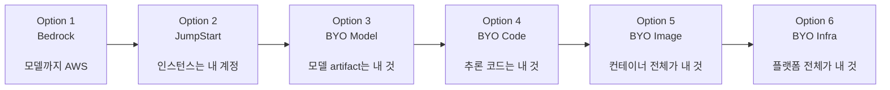
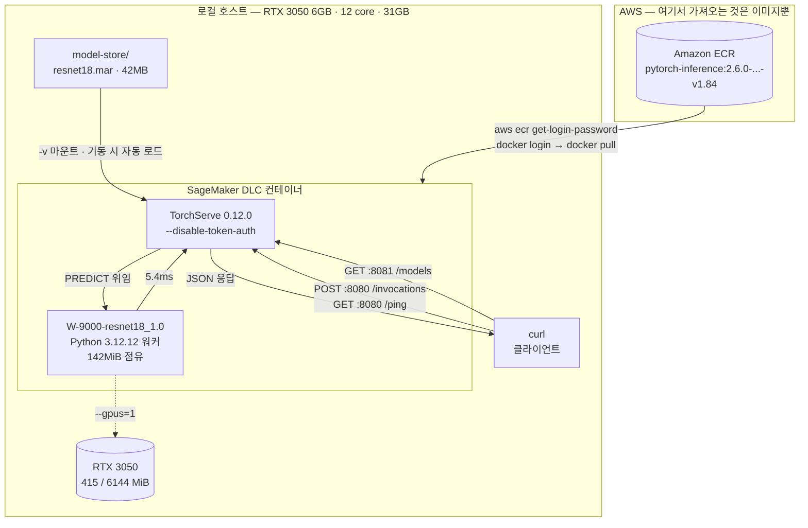
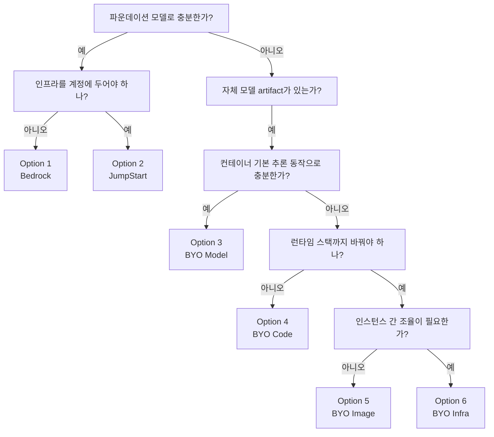

AWS SageMaker를 예시로 삼아 퍼블릭 클라우드에서 모델 서빙 시스템을 만드는 **6가지 방법**을 정리한다.  **클라우드 벤더가 서빙 옵션을 설계하는 근본 논리 파악하고** GCP Vertex AI나 Azure ML의 유사한 스펙트럼도 같은 기준으로 판단할 수 있다.

**5절의 모든 명령과 로그는 RTX 3050 6GB 리눅스 데스크톱에서 실제로 실행한다.**

## 1.  6단계 스펙트럼


| 단계  | 방식                            | 자유도   | 운영 부담 |
| --- | ----------------------------- | ----- | ----- |
| 1   | Bedrock                       | 낮음    | 매우 낮음 |
| 2   | SageMaker JumpStart           | 조금 높음 | 낮음    |
| 3   | Bring Your Own Model          | 중간    | 중간    |
| 4   | Bring Your Own Code           | 높음    | 높음    |
| 5   | Bring Your Own Serving Image  | 매우 높음 | 매우 높음 |
| 6   | Build Your Own Infrastructure | 최고    | 최고    |


각 단계에서 **AWS가 소유하던 레이어가 하나씩 사용자 책임으로 넘어온다.** 




## 2. Option 1  Bedrock: 완전 관리형 파운데이션 모델

[Amazon Bedrock](https://aws.amazon.com/ko/bedrock/)은 간단한 API로 파운데이션 모델을 제공하는 **완전 관리형 서비스**다. 커스터마이징 여지는 가장 적지만 사용하기는 가장 쉽다. 모델 학습이나 호스팅을 직접 관리할 필요가 없다.

Amazon Titan, Anthropic Claude, Stability AI의 Stable Diffusion 같은 모델 중 하나를 고른 뒤 API를 호출해 결과를 받으면 끝이다. AWS와 서드파티 제공업체의 파운데이션 모델을 별도 인프라 구축 없이 바로 쓴다.

가격은 **pay-as-you-go**다. 시간 단위가 아니라 **요청 수나 토큰 수**로 과금한다. 계정 안에서 서버를 직접 운영하지 않으며, 확장과 컴퓨팅 자원은 AWS가 내부적으로 관리한다.

### 구축 3단계

**1) Bedrock API 키 생성** — 리전은 `us-west-2`(오레곤)를 쓴다.

**2) 모델 카탈로그에서 모델 선택** — Anthropic 모델은 최초 사용 시 계정당 한 번(또는 조직 관리 계정에서 한 번) 사용 사례 정보를 제출해야 한다. 제출한 정보는 Anthropic과 공유된다.

모델 ARN은 CLI로 확인한다.

```bash
# us-west-2에서 사용 가능한 파운데이션 모델 개수
aws bedrock list-foundation-models --region us-west-2 | grep modelArn | wc -l
     112
```

ARN과 모델 ID를 함께 보면 벤더별로 어떤 모델이 올라와 있는지 드러난다.

```bash
aws bedrock list-foundation-models --region us-west-2 | grep -E 'modelArn|modelId'
            "modelArn": "arn:aws:bedrock:us-west-2::foundation-model/anthropic.claude-sonnet-4-5-20250929-v1:0",
            "modelId": "anthropic.claude-sonnet-4-5-20250929-v1:0",
            "modelArn": "arn:aws:bedrock:us-west-2::foundation-model/meta.llama3-3-70b-instruct-v1:0",
            "modelId": "meta.llama3-3-70b-instruct-v1:0",
            "modelArn": "arn:aws:bedrock:us-west-2::foundation-model/qwen.qwen3-32b-v1:0",
            "modelId": "qwen.qwen3-32b-v1:0",
            "modelArn": "arn:aws:bedrock:us-west-2::foundation-model/mistral.pixtral-large-2502-v1:0",
            "modelId": "mistral.pixtral-large-2502-v1:0",
            "modelArn": "arn:aws:bedrock:us-west-2::foundation-model/cohere.embed-v4:0",
            "modelId": "cohere.embed-v4:0",
            ...
```

Anthropic, Meta, Qwen, Mistral, Cohere, Stability, DeepSeek이 한 카탈로그에 섞여 있다. **모델 제공사가 누구든 호출 방식은 `modelId` 하나만 바꾸면 된다**는 것이 Bedrock의 핵심이다.

특정 벤더만 보려면 필터를 건다.

```bash
aws bedrock list-foundation-models --region us-west-2 | grep -E 'modelArn|modelId' | grep amazon
            "modelArn": "arn:aws:bedrock:us-west-2::foundation-model/amazon.nova-pro-v1:0",
            "modelId": "amazon.nova-pro-v1:0",
            "modelArn": "arn:aws:bedrock:us-west-2::foundation-model/amazon.nova-lite-v1:0",
            "modelId": "amazon.nova-lite-v1:0",
            "modelArn": "arn:aws:bedrock:us-west-2::foundation-model/amazon.nova-micro-v1:0",
            "modelId": "amazon.nova-micro-v1:0",
            "modelArn": "arn:aws:bedrock:us-west-2::foundation-model/amazon.titan-embed-text-v2:0",
            "modelId": "amazon.titan-embed-text-v2:0",
            ...
```

다음 단계에서 쓸 `amazon.nova-lite-v1:0`이 여기 있다.

**3) 클라이언트 초기화 + API 호출**

```python
import os, boto3

os.environ["AWS_BEARER_TOKEN_BEDROCK"] = "bedrock-api-key-..."

client = boto3.client(
    service_name="bedrock-runtime",
    region_name="us-west-2",
)

model_id = "amazon.nova-lite-v1:0"
messages = [{"role": "user", "content": [
    {"text": "Hello! Can you tell me about Amazon Bedrock?"}
]}]

response = client.converse(
    modelId=model_id,
    messages=messages,
)
```

### 제약 사항

Bedrock은 파운데이션 모델을 위한 **서버리스 관리형 추론 환경**이다. 고수준 API를 호출하면 GPU 인스턴스 프로비저닝, 모델 가중치 로딩, 추론 실행, 결과 반환이 전부 AWS 인프라 안에서 보이지 않게 처리된다.

외부 AI API를 호출하는 것과 개념적으로 같지만, **AWS 환경 안에서 이뤄지는 AWS 서비스 호출**이라는 점이 다르다.


- **인스턴스 타입 선택 불가**
- **컨테이너와 코드 커스터마이징 불가**
- **새 모델의 배포 자체가 불가능** — 자체 proprietary 모델이나 남이 올려두지 않은 파인튜닝 버전은 쓸 수 없다

모델 아키텍처나 학습 방식은 바꿀 수 없고, 중간 정도의 파인튜닝이나 프롬프트 조정만 가능하다.

### 언제 쓰나

챗봇이나 텍스트·이미지 생성기를 인프라 관리 없이 빠르게 프로토타이핑할 때, 사전학습 모델로 충분할 때 적합하다. 자체 커스텀 모델을 배포해야 하거나 정교한 추론 로직이 필요하면 다음 옵션으로 넘어가야 한다.

## 3. Option 2  JumpStart: 원클릭 배포

[Amazon SageMaker JumpStart](https://docs.aws.amazon.com/ko_kr/sagemaker/latest/dg/studio-jumpstart.html)도 no-code/low-code 방식이다. Bedrock처럼 사전학습 모델 허브를 제공하며Cohere·Falcon·Llama·Stable Diffusion 등 AWS가 선별한 모델과 Hugging Face Hub 모델을 카탈로그로 갖고 있다.

Bedrock과의 본질적 차이는 하나다. **엔드포인트가 내 AWS 계정에 실제로 뜬다.**


|           | Bedrock         | JumpStart                      |
| --------- | --------------- | ------------------------------ |
| 모델이 도는 곳  | AWS가 완전히 숨긴 인프라 | **내 SageMaker 계정/인프라**         |
| 과금        | 요청·토큰당 (서버 없음)  | **시간당 인스턴스 요금** (직접 엔드포인트 호스팅) |
| 인프라 관리 부담 | 거의 없음           | **조금 더 있음** — 인스턴스 타입을 직접 선택   |


"원클릭 배포"라고 불릴 만큼 쉽고 SageMaker Studio UI와 SageMaker SDK 양쪽에서 쓸 수 있다. 다만 이제 SageMaker가 관리하는 인스턴스에 **시간당 요금**을 낸다. `g5.48xlarge`, `g6e.48xlarge` 같은 서버 인스턴스 유형을 직접 고른다.

Bedrock보다 인프라 설정 폭이 넓다. 모델 서빙 인스턴스 수, 로깅 레벨, 인스턴스 유형을 지정할 수 있다.

```python
# 모델 ID와 버전 정의
model_id = "huggingface-llm-mistral-7b-instruct"
version = "*"  # 최신 버전 사용

# 하드웨어 설정을 포함한 JumpStartModel 인스턴스 생성
model = JumpStartModel(
    model_id=model_id,
    model_version=version,
    instance_type="ml.g5.2xlarge",     # 인스턴스 타입 지정
    role=sagemaker_execution_role,     # 실행 역할 지정
    env={
        "SAGEMAKER_MODEL_SERVER_WORKERS": "1",
        "SAGEMAKER_CONTAINER_LOG_LEVEL": "20",
    },
)

# JumpStart 모델 배포
predictor = model.deploy(
    initial_instance_count=1,
    endpoint_name="my-mistral-endpoint",
    role=sagemaker_execution_role,
    sagemaker_session=sess,
)

# 추론 요청
response = predictor.predict({"inputs": "Hello, world!"})
```

Bedrock에는 없던 `deploy()` 단계가 생겼다. 인프라 설정을 직접 지정하고 그 결과로 나온 `predictor` 객체로 추론을 요청하는 2단계 구조다.

### 제약 사항

내부적으로는 표준 SageMaker 추론 인프라를 쓰되 설정을 대신 자동화해 주는 것뿐이라 커스터마이징 여지는 제한적이다.

- 모델마다 파인튜닝·평가 지원 여부가 다르다 (배포 전용도 있음)
- **인스턴스 선택이 모델별로 고정**된다
- **전처리·배칭 같은 기본 추론 동작을 바꿀 수 없다**
- **요청 payload 스키마와 content type을 조정할 수 없다**
- **CUDA/PyTorch 버전을 고를 수 없다**
- 컨텍스트 길이와 배치 크기를 JumpStart가 이미 정해 버려서 **최적화 기법 적용이 어렵다**

정리하면 **인스턴스는 내가 고르지만 그 안에서 무엇을 하는지는 여전히 AWS가 정한 대로**다. Bedrock보다 한 단계 열려 있을 뿐, 원클릭 자동화가 감춘 디테일이 많다.

### 언제 쓰나

BERT 텍스트 분류나 Stable Diffusion 이미지 생성처럼 ***유명한 사전학습 모델을 내 AWS 환경에 빠르게 띄우고 싶을 때*** 적합하다. SageMaker 모범 사례대로 엔드포인트를 구성해 주기 때문에 SageMaker 학습 도구로도 쓸 만하다. 추론 로직을 완전히 통제해야 하거나 JumpStart가 지원하지 않는 모델을 서빙해야 한다면 다음 단계다.

## 4. Option 3  Bring Your Own Model: DLC 활용

카탈로그에 없는 자체 모델을 서빙하려면 AWS가 제공하는 **사전 빌드된 서빙용 Docker 이미지, [Deep Learning Containers(DLC)](https://github.com/aws/deep-learning-containers/tree/master)** 를 쓴다. 추론 코드를 따로 작성하지 않고도 모델을 배포할 수 있다.

DLC는 프레임워크별(TensorFlow, PyTorch, HuggingFace Transformers) 사전빌드 서빙 이미지와 SageMaker 내장 알고리즘 컨테이너(DJL 등)로 구성된다. 핵심은 **"bring-your-own-model"이지 "bring-your-own-code"는 아니라는 점**이다. 학습시킨 모델 artifact는 직접 가져오되 서빙 코드와 runtime은 벤더 기본 이미지가 담당한다.

JumpStart는 컨테이너와 설정을 자동으로 골라 주지만 DLC는 **어떤 서빙 컨테이너를 쓸지 직접 지정**한다. PyTorch/Transformers의 정확한 버전을 고를 수 있고 JumpStart 큐레이션 목록에 없는 모델도 배포할 수 있다. 대신 그 컨테이너가 무엇을 요구하는지는 사용자가 알고 있어야 한다.

### 예시 1  PyTorch + TorchServe

첫 단계는 프레임워크와 Python 버전에 맞는 DLC를 **검색**하는 것이다.

```python
# 프레임워크와 서버 인스턴스 타입으로 서빙 이미지 검색
baseimage = sagemaker.image_uris.retrieve(
    framework="pytorch",
    region="",
    py_version="py310",
    image_scope="inference",
    version="2.0.1",
    instance_type="ml.g4dn.16xlarge",
)
```

다음으로 S3의 모델 파일 위치를 지정해 모델 객체를 만들고 배포한다. `model.deploy()`가 AWS 쪽 리소스 제공과 서비스 배포를 담당한다.

```python
# Model 객체 생성
model = Model(
    model_data=f"{output_path}/mnist.tar.gz",
    image_uri=baseimage,
    predictor_cls=Predictor,
    name="mnist",
)

# 배포
predictor = model.deploy(
    instance_type="ml.g4dn.16xlarge",
    initial_instance_count=1,
    endpoint_name="torchserve-endpoint-1",
    serializer=JSONSerializer(),
    deserializer=JSONDeserializer(),
)
```

JumpStart에서 자동이던 이미지 검색 단계가 여기서는 **명시적**이다.

### 예시 2  LMI + vLLM으로 Llama 서빙

vLLM을 지원하는 DJL 서빙 프레임워크 기반의 **LMI(Large Model Inference) 컨테이너**로 Hugging Face의 오픈소스 LLM을 서빙하는 경우다.

```python
# LMI가 모델 아키텍처를 보고 배포 설정을 구성하도록 맡긴다
model = DJLModel(
    model_id="meta-llama/Meta-Llama-3.1-8B-Instruct",
    env={
        "HF_TOKEN": "",
        "OPTION_TENSOR_PARALLEL_DEGREE": "4",   # 텐서 병렬화 정도
        "OPTION_SERVING_LOADER": "vllm",        # 서빙 로더로 vLLM 지정
        "OPTION_MAX_ROLLING_BATCH_SIZE": "128", # 최대 rolling batch 크기
    },
)

# SageMaker Endpoint로 배포하고 Predictor 생성
endpoint_name = sagemaker.utils.name_from_base("llama-8b-endpoint")
predictor = model.deploy(
    instance_type="ml.g5.12xlarge",
    initial_instance_count=1,
    endpoint_name=endpoint_name,
)
```

여기 등장하는 설정값은 앞선 실습에서 손으로 만졌던 것과 정확히 같은 개념이다.

- `OPTION_SERVING_LOADER: vllm` — 단일 모델 서빙 실습에서 `/generate_vllm` 엔드포인트로 직접 통합했던 **vLLM 엔진**이다.
- `OPTION_MAX_ROLLING_BATCH_SIZE` — 로그로 관찰했던 **continuous batching** 설정이다.
- `OPTION_TENSOR_PARALLEL_DEGREE` — 모델을 여러 GPU에 쪼개는 텐서 병렬화다. 앞선 실습은 `tensor_parallel_size=1`이었다.


### 제약 사항

**컨테이너 내부를 거의 통제하지 못한다.** 프레임워크, NVIDIA 드라이버, CUDA, Python, OS가 전부 **이미지 태그에 고정**된다(예: TF 2.19 + CUDA 12.2 + Ubuntu 22.04). 라이브러리 버전을 섞으려면 직접 이미지를 빌드해야 한다.

**HTTP 계약도 고정이다.** 모든 DLC 컨테이너는 **8080 포트**에서 `/invocations`(POST)와 `/ping`(GET)을 구현해야 하고, 응답 타임아웃도 이미지가 정한 값이 적용된다(다음 절에서 쓴 이미지는 120초였다). 사실상 **SageMaker가 강제하는 미니 Public API 계약**이다.

입출력 포맷도 고정이라 커스텀 전처리·후처리가 필요하면 Option 4로 가야 한다.

### 언제 쓰나

흔한 프레임워크로 학습한 모델을 관리형 서비스로 빠르게 배포하되 약간의 커스터마이징(정확한 프레임워크 버전 등)이 필요할 때 적합하다. 파인튜닝한 HF Transformers 모델은 HF 추론 DLC로, TensorFlow SavedModel이나 PyTorch `.pth`는 TorchServe/TF Serving 이미지로 배포한다.

컨테이너의 기본 예측 처리 방식을 그대로 받아들일 수 있다면 **추론 코드를 아예 안 짜도 되는 것이 최대 장점**이다.

## 5. [실습] SageMaker 없이 DLC만 떼어 로컬 GPU에서 재현

DLC 이미지는 SageMaker 서비스와 분리해서 쓸 수 있다. [AWS 문서](https://aws.github.io/deep-learning-containers/vllm/deployment/ec2/)에도 EC2 단독 배포가 나와 있다. `model.deploy()`가 클라우드에서 하던 일을 로컬 `docker run`으로 흉내 내면 앞서 말한 8080 포트 계약의 실체를 직접 확인할 수 있다.

**AWS에서 가져오는 것은 이미지 하나뿐이고, 나머지는 전부 로컬이다.**



**SageMaker가 대신 해주던 일이 전부 화살표로 드러난다.** 클라우드에서 `model.deploy()` 한 줄이 하던 이미지 선택, 포트 매핑, 모델 로딩, 헬스체크 배선을 여기서는 `docker login` → `docker pull` → `docker run -p` → `curl`로 하나씩 손으로 잇는다.

바꿔 말하면 **점선 하나(GPU 패스스루)를 빼고는 AWS 계정이 관여하는 곳이 없다.** ECR에서 이미지를 받은 뒤로는 인터넷도 필요 없고 SageMaker 서비스는 끝까지 켜지 않는다.

### 필요한 것

**1) AWS 계정 자격증명** — DLC 이미지는 완전 익명 공개가 아니라 Amazon ECR(`763104351884.dkr.ecr.<region>.amazonaws.com/...`)에 있다. 무료 티어 계정이라도 `aws ecr get-login-password | docker login ...`으로 인증해야 pull이 된다. **SageMaker 서비스 자체를 켤 필요는 없어** 서빙 비용은 발생하지 않는다(ECR 데이터 전송 비용 정도).

**2) Docker**

**3) NVIDIA 드라이버 + nvidia-container-toolkit** — 앞서 본 대로 **CUDA와 드라이버 버전이 이미지 태그에 고정**돼 있다. 로컬 GPU 드라이버가 요구 CUDA 버전을 만족하지 못하면 실행되지 않는다. 이번에는 PyTorch 2.6.0 / Python 3.12 / CUDA 12.4 / Ubuntu 22.04 조합의 안정 태그(v1.84)를 골랐다. 드라이버가 CUDA 13.2까지 지원하므로 12.4는 문제없이 호환된다.

**4) SageMaker HTTP 계약 재현** — `docker run -p 8080:8080`으로 띄우고 `curl`로 직접 요청을 보낸다. 포트 매핑과 `/ping` 헬스체크를 손으로 흉내 내는 셈이다.

### 실측 환경

**앞선 두 실습과 같은 RTX 3050 6GB 리눅스 데스크톱에서 실행했다.** GPU를 미리 비워야 한다. Ray Serve 실습의 kind 클러스터가 떠 있으면 vLLM worker가 4.8GB를 잡고 있으므로 먼저 정리한다.


| 항목                  | 실측값                                                                   | 비고                          |
| ------------------- | --------------------------------------------------------------------- | --------------------------- |
| DLC 이미지             | `pytorch-inference:2.6.0-gpu-py312-cu124-ubuntu22.04-sagemaker-v1.84` | 이미지 ID `c2d6b7059053`       |
| 이미지 크기              | **16.1GB** (디스크) / 8.48GB (ECR 압축)                                    | `docker system df -v`       |
| TorchServe          | 0.12.0 — **토큰 인증 기본 활성화**                                             | 컨테이너 내장                     |
| torch / torchvision | 2.6.0+cu124 / 0.21.0+cu124                                            | 컨테이너 내부                     |
| Python              | 3.12.12                                                               | 컨테이너 내부                     |
| GPU                 | **NVIDIA GeForce RTX 3050 6144MiB**                                   | `--gpus=1` 패스스루             |
| GPU 드라이버            | 595.84 (CUDA 13.2)                                                    | 호스트                         |
| 호스트                 | 12 core / 31GB RAM / 디스크 457GB 중 237GB 여유                             |                             |
| 테스트 모델              | ResNet18 (파라미터 11,689,512개, 가중치 44.7MB)                               | TorchScript 변환 후 `.mar` 패키징 |


### 이미지 pull과 기동

먼저 ECR에 로그인하고 태그가 실재하는지 확인한다.

```bash
aws ecr get-login-password --region us-west-2 \
  | docker login --username AWS --password-stdin 763104351884.dkr.ecr.us-west-2.amazonaws.com
Login Succeeded

aws ecr describe-images --registry-id 763104351884 --repository-name pytorch-inference \
  --region us-west-2 --image-ids imageTag=2.6.0-gpu-py312-cu124-ubuntu22.04-sagemaker-v1.84 \
  --query "imageDetails[0].{tag:imageTags[0],sizeMB:imageSizeInBytes,pushed:imagePushedAt}"
```

```json
{
    "tag": "2.6.0-gpu-py312-cu124-ubuntu22.04-sagemaker-v1.84-2026-06-15-19-03-30",
    "sizeMB": 8484464840,
    "pushed": "2026-06-16T04:17:20.713000+09:00"
}
```

pull 후 실제 디스크 점유는 **16.1GB**다. ECR이 보고하는 8.48GB는 압축 크기이므로 두 배 가까이 벌어진다.

```bash
docker system df -v | grep pytorch-inference
REPOSITORY                                                       TAG                    IMAGE ID       SIZE      UNIQUE SIZE
763104351884.dkr.ecr.us-west-2.amazonaws.com/pytorch-inference   2.6.0-gpu-py312-...    c2d6b7059053   16.1GB    15.82GB
```

기동 직후 로그의 첫 세 줄이 이 절에서 가장 중요하다.

```bash
CUDA compat package should be installed for NVIDIA driver smaller than 550.163.01
Current installed NVIDIA driver version is 595.84
Skipping CUDA compat setup as newer NVIDIA driver is installed
```

**드라이버 호환 기준선이 550.163.01이라고 컨테이너가 직접 말해 준다.** 이보다 낮으면 CUDA compat 패키지가 필요하고, 595.84는 그 위이므로 건너뛴다. 4절에서 말한 "CUDA와 드라이버가 이미지 태그에 고정된다"는 제약이 실행 시점에 이렇게 드러난다.

### 토큰 인증부터 막힌다

기본 상태로 띄우면 세 엔드포인트가 전부 막힌다.

```bash
curl -s http://localhost:8080/ping -w "HTTP %{http_code}\n"
```

```json
{
  "code": 400,
  "type": "InvalidKeyException",
  "message": "Token Authorization failed. Token either incorrect, expired, or not provided correctly"
}
```

TorchServe 0.12부터 토큰 인증이 기본 활성화되어 `/key_file.json`에 키가 발급된다. 주목할 것은 **에러 응답이 `code`/`type`/`message` 3필드 JSON**이라는 점이다. 이것이 SageMaker가 요구하는 에러 스키마이고, 정상 응답이든 에러든 이 형식을 벗어나지 않는다.

끄는 방법은 `config.properties`가 아니라 **CLI 플래그**다. 

```bash
# ts/arg_parser.py
parser.add_argument(
    "--disable-token-auth",
    "--dt",
    dest="token_auth",
    help="if this option is set then token authorization is disabled",
    action="store_true",
)
```

### 모델 패키징

컨테이너 안에서 세 단계를 거친다.

```python
import torch, json
from torchvision.models import resnet18, ResNet18_Weights

w = ResNet18_Weights.IMAGENET1K_V1
m = resnet18(weights=w).eval()                      # 가중치 다운로드 44.7MB
torch.jit.trace(m, torch.rand(1,3,224,224)).save("/tmp/lab/resnet18_ts.pt")

# 클래스명을 응답에 포함시키려면 index_to_name.json이 필요하다
cats = w.meta["categories"]
json.dump({str(i): [str(i), c] for i, c in enumerate(cats)},
          open("/tmp/lab/index_to_name.json", "w"))
```

```bash
torch-model-archiver --model-name resnet18 --version 1.0 \
  --serialized-file /tmp/lab/resnet18_ts.pt \
  --handler image_classifier \
  --extra-files /tmp/lab/index_to_name.json \
  --export-path /home/model-server/model-store
# → resnet18.mar (42MB)
```

**TorchScript 변환은 선택이 아니다.** `torch.save(model)`로 만든 순수 pickle을 그대로 패키징하면 아카이빙은 통과하지만 로드에서 죽는다.

```bash
MODEL_LOG - Failed to load model resnet18pk, exception
            PytorchStreamReader failed locating file constants.pkl: file not found
WorkerThread - State change WORKER_STARTED -> WORKER_ERROR
WorkerThread - State change WORKER_ERROR -> WORKER_STOPPED
```

`image_classifier` 핸들러가 `torch.jit.load`로 읽기 때문에 TorchScript 아카이브의 `constants.pkl`을 찾다가 실패한다.

### 기동과 모델 로드

```bash
docker run -d --name sm-pytorch-local --gpus=1 -p 8080:8080 -p 8081:8081 \
    -v /home/hyeonjae/dlc-lab/model-store:/home/model-server/model-store \
    763104351884.dkr.ecr.us-west-2.amazonaws.com/pytorch-inference:2.6.0-gpu-py312-cu124-ubuntu22.04-sagemaker-v1.84 \
    torchserve --start --foreground \
      --ts-config /home/model-server/config.properties \
      --model-store /home/model-server/model-store \
      --models resnet18=resnet18.mar --disable-token-auth

docker ps
CONTAINER ID   STATUS          PORTS                              NAMES
fe898f3cf205   Up 28 seconds   0.0.0.0:8080-8081->8080-8081/tcp   sm-pytorch-local
```

기동 로그에 설정과 상태 전이가 그대로 남는다.

```bash
Torchserve version: 0.12.0
Number of GPUs: 1
Number of CPUs: 12
Max heap size: 3192 M
Inference address: http://0.0.0.0:8080
Management address: http://0.0.0.0:8081
Metrics address: http://127.0.0.1:8082
Model Store: /home/model-server/model-store
Initial Models: resnet18=resnet18.mar
...
[INFO ] ModelManager - Model resnet18 loaded.
[INFO ] W-9000-resnet18_1.0-stdout MODEL_LOG - Torch worker started.
[INFO ] W-9000-resnet18_1.0-stdout MODEL_LOG - Python runtime: 3.12.12
[DEBUG] W-9000-resnet18_1.0 WorkerThread - State change null -> WORKER_STARTED
[INFO ] W-9000-resnet18_1.0-stdout MODEL_LOG - Enabled tensor cores
[DEBUG] W-9000-resnet18_1.0 WorkerThread - State change WORKER_STARTED -> WORKER_MODEL_LOADED
[INFO ] W-9000-resnet18_1.0 TS_METRICS - WorkerLoadTime.Milliseconds:2704.0
```

GPU 점유를 보면 **워커가 142MiB**다. 6144MiB 중 415MiB가 쓰이고 나머지는 디스플레이 몫이다.

```bash
nvidia-smi --query-compute-apps=pid,process_name,used_memory --format=csv,noheader
1647049, /usr/local/bin/python, 142 MiB
```

**LLM 서빙과 자릿수가 다르다.** 같은 카드에서 Ray Serve 실습의 vLLM은 5,155MiB를 잡았다. ResNet18급 모델에서 6GB는 제약이 아니고, 이 실습의 진짜 병목은 16.1GB짜리 이미지를 받을 디스크다.

### 실제 추론

앞선 [Triton 실습](../llm-serving-multi-model-lab/)에서 썼던 `cat1.jpg`를 그대로 재사용했다. **SageMaker 계약의 핵심인 `/invocations`로 호출한다.**

```bash
curl -s -X POST http://localhost:8080/invocations \
    -T ch03/multi_model_serving/tests/images/cat1.jpg \
    -w "\nHTTP %{http_code}\n"
```

```json
{
  "tiger cat": 0.3183886706829071,
  "tabby": 0.28682225942611694,
  "Egyptian cat": 0.1711900383234024,
  "Siamese cat": 0.017858989536762238,
  "plastic bag": 0.015862828120589256
}
```

고양이 관련 클래스 상위 3개에 **77.6%가 몰린 정상적인 예측**이다. 같은 이미지를 Triton의 DenseNet으로 돌렸을 때는 `EGYPTIAN CAT`이 압도적 1위였는데, ResNet18은 `tiger cat`과 `tabby`로 확신도가 갈린다. 모델 아키텍처가 다르니 당연한 차이다.

`/predictions/resnet18`로 호출해도 **바이트 단위로 같은 응답**이 온다. 모델이 하나뿐일 때 `/invocations`가 그 모델로 그대로 연결된다는 뜻이고, 이것이 SageMaker가 컨테이너에 요구하는 계약의 전부다.

### 레이턴시

`/invocations`를 20회 반복했다.

```bash
n=20  min=0.009s  p50=0.013s  p95=0.014s  max=0.014s
```

컨테이너 내부 메트릭으로 보면 **첫 요청만 유독 느리다.**

```bash
PredictionTime.ms:496.63   ← 1번째 (콜드)
PredictionTime.ms:18.91    ← 2번째
PredictionTime.ms:5.40     ← 3번째부터 정상
...
PredictionTime.ms:5.44     ← 20번째
```

```bash
[INFO ] ACCESS_LOG - "POST /invocations HTTP/1.1" 200 7
[INFO ] MODEL_METRICS - HandlerTime.ms:5.34|#ModelName:resnet18
[INFO ] MODEL_METRICS - PredictionTime.ms:5.44|#ModelName:resnet18
[INFO ] TS_METRICS - ts_inference_latency_microseconds.Microseconds:6271.018
[INFO ] TS_METRICS - ts_queue_latency_microseconds.Microseconds:45.816
```

**첫 요청이 92배 느리다.** CUDA 커널 JIT 컴파일과 메모리 할당이 첫 호출에 몰리기 때문인데, 6절에서 볼 `handle()` 안의 워밍업 코드가 정확히 이 구간을 없애려는 장치다. 큐 대기는 45.8μs로 사실상 0이고, 추론 6.27ms 중 핸들러가 5.34ms를 쓴다.

### `/ping`은 워커가 죽어도 Healthy다

pickle 모델을 올려 워커가 `WORKER_STOPPED`로 떨어진 상태에서 두 엔드포인트를 같이 찔러 봤다.

```bash
curl http://localhost:8080/ping          # {"status": "Healthy"}   HTTP 200
curl -X POST http://localhost:8080/invocations -T cat1.jpg
                                          # {"message": "Worker died."}  HTTP 500
```

**헬스체크는 프론트엔드만 본다.** 실제 SageMaker였다면 엔드포인트가 `InService`로 보이는 동안 모든 추론이 500을 반환한다. Option 5에서 컨테이너를 직접 만들 때 `/ping` 구현을 어디까지 신경 써야 하는지가 여기서 드러난다.

참고로 이 컨테이너의 모델 기본값은 다음과 같다. 4절에서 말한 타임아웃은 이 이미지에서 **120초**다.

```json
{
  "minWorkers": 1,
  "batchSize": 1,
  "maxBatchDelay": 100,
  "responseTimeout": 120,
  "deviceType": "gpu"
}
```

### 이 실습에서 확인된 것

1. `aws ecr describe-images`로 실존 태그를 조회해 **드라이버 595.84와 호환되는 CUDA 12.4 이미지를 선택**했고, 컨테이너가 기준선(550.163.01)을 로그로 확인해 줬다
2. SageMaker 서비스 없이 `docker pull` + `docker run`만으로 **진짜 SageMaker PyTorch 추론 컨테이너를 기동**했다
3. 가중치 다운로드 → TorchScript 변환 → `.mar` 패키징 → 자동 로드까지, `model.deploy()`가 클라우드에서 하던 일을 로컬 GPU에서 재현했다
4. **순수 pickle은 로드에서 거부된다**는 것을 `constants.pkl` 에러로 확인했다
5. 토큰 인증을 끄는 것은 `config.properties` 항목이 아니라 `**torchserve --disable-token-auth` CLI 플래그**임을 소스에서 확인했다
6. `/ping`, `/models`, `/invocations`, `/predictions/resnet18` 전부 **SageMaker 표준 HTTP 계약 그대로** 로컬에서 응답했다

### 정리

```bash
docker rm -f sm-pytorch-local
docker rmi 763104351884.dkr.ecr.us-west-2.amazonaws.com/pytorch-inference:2.6.0-gpu-py312-cu124-ubuntu22.04-sagemaker-v1.84  # 16.1GB 회수
```

## 6. Option 4 — Bring Your Own Code: 스크립트 모드

커스터마이징 단계가 하나 더 올라가면 **직접 서빙 코드를 작성**한다. SageMaker에서는 이를 스크립트 모드라고 부른다. 기본 프레임워크는 SageMaker 컨테이너에 의존하되, 모델 로딩과 예측 로직을 구현한 **진입점 스크립트를 직접 제공**하는 방식이다.

Option 3와의 차이는 명확하다.


|         | Option 3    | Option 4                          |
| ------- | ----------- | --------------------------------- |
| 컨테이너    | AWS 제공      | AWS 제공 (동일)                       |
| 서빙 코드   | **작성하지 않음** | **entry-point 스크립트 직접 작성**        |
| 가능해지는 것 | 컨테이너 기본 동작만 | 커스텀 전·후처리, 비표준 입출력, 한 컨테이너에 여러 모델 |
| 대가      | 없음          | **코드를 직접 쓰고 유지보수해야 함**            |


### serving.properties

첫 단계는 모델별 서빙 구성 정의다. 서빙 엔진과 모델 위치를 지정한다.

```bash
engine=Python
option.tensor_parallel_degree=2
option.rolling_batch=vllm
option.s3url=s3://sagemaker-us-west-2-.../large-model-lmi/code/my-own-llm
```

`option.rolling_batch=vllm`에서 vLLM이 다시 등장한다. Option 3의 `OPTION_SERVING_LOADER=vllm`과 사실상 같은 개념인데, 여기서는 **직접 짠 `model.py`와 결합해서 쓴다**는 점이 다르다.

### model.py

실제 서빙 로직을 세 함수로 구현한다.

```python
PAD_TOKEN_ID = 50256

# 모델 초기화
def initialize(properties):
    model = AutoModel.from_pretrained(model_id)
    device = torch.device("cuda" if torch.cuda.is_available() else "cpu")
    model.to(device)
    model.eval()
    ...

# 모델 실행
def run_inference(input_texts, onnx_model, tokenizer):
    max_batch_size = 128
    z = torch.empty([0, 768]).to("cuda")
    for i in range(0, len(input_texts), max_batch_size):
        logging.info(f"Start Iteration: {i}")

        batch_dict = tokenizer(
            input_texts[i:i + max_batch_size],
            max_length=512, padding=True, truncation=True,
            return_tensors="pt",
        ).to("cuda")

        with torch.no_grad():
            outputs = model(**batch_dict)
        # ...
        z = torch.cat((embeddings, z), 0)

    results = [{"embedding": e.tolist(), "index": i} for i, e in enumerate(z)]
    return {"embeddings": results}

# 모델 실행 진입점
def handle(inputs: Input) -> None:
    global model, tokenizer
    if not model:
        model, tokenizer = initialize(inputs.get_properties())

    if inputs.is_empty():
        # 모델 서버가 기동 시 빈 호출로 워밍업한다
        return None

    # 요청 전처리
    data = inputs.get_as_json()
    input_sentences = data["inputs"]
    # 추론 실행
    res = run_inference(input_sentences, model, tokenizer)
    return Output().add_as_json(res)
```

세 함수는 직접 만들었던 서빙 코드와 구조적으로 거의 같다.

- `initialize(properties)` — 모델을 GPU에 올린다. `ModelWorker.__init__`이 `self.model.to(self.device)`로 하던 것과 같은 패턴이다.
- `run_inference()` — `max_batch_size=128`로 잘라 가며 토크나이즈하고 `torch.no_grad()`로 추론한 뒤 결과를 조립한다. 수동 배칭 루프, 토크나이저 파라미터, `no_grad` 컨텍스트까지 `generate_forward_batch()`와 같다.
- `handle(inputs)` — 실제 엔트리포인트다. FastAPI 데코레이터 대신 DJL/LMI가 요구하는 **단일 함수 시그니처(Input/Output 객체)** 로 구현한다.

`handle()` 안의 `if inputs.is_empty(): return None`은 주목할 프로덕션 패턴이다. **모델 서버가 부팅 시 빈 입력으로 한 번 호출해 모델을 미리 워밍업**시킨다. 앞서 개념으로만 봤던 콜드스타트·워밍업 전략이 코드 레벨에서 이렇게 구현된다.

### 패키징과 배포

`model.py`, 모델 가중치, `serving.properties`를 하나로 묶어 S3에 올린다.

```bash
# 모델 파일 패키징
tar czvf my-own-llm.tar.gz my-own-llm/
```

```python
# S3 업로드
s3_code_prefix = "large-model-lmi/code/my-own-llm"
bucket = sess.default_bucket()
code_artifact = sess.upload_data("my-own-llm.tar.gz", bucket, s3_code_prefix)

# LMI 이미지 선택
image_uri = image_uris.retrieve(
    framework="djl-deepspeed",
    region=sess.boto_session.region_name,
    version="0.25.0",
)

# 모델 객체 생성
model = Model(image_uri=image_uri, model_data=code_artifact, role=role)

# 엔드포인트로 배포
predictor = model.deploy(
    initial_instance_count=1,
    instance_type="ml.g5.2xlarge",
    endpoint_name="my-own-llm-128",
)
```

배포 흐름 자체는 Option 3과 같다(`image_uris.retrieve` → `Model` → `model.deploy`). **유일한 차이는 `model_data`가 순수 가중치가 아니라 서빙 코드까지 포함한 아카이브라는 점**이다.

### 제약 사항

여전히 컨테이너에 baking된 프레임워크·Python·OS·CUDA 버전·서빙 라이브러리에 종속된다. `option.rolling_batch=vllm`으로 vLLM을 켤 수는 있어도 **그 vLLM의 정확한 버전과 구성은 컨테이너가 정한 대로**다. 원하는 버전을 직접 `pip install`할 자유는 없다.

HTTP 인터페이스와 요청 스키마도 그대로다. 8080 포트, `/invocations`, `/ping` 계약은 변하지 않는다.

### 언제 쓰나

Option 3의 한계가 병목이 될 때다. 모델 자체는 지원 컨테이너에서 잘 도는데 **입력 전처리가 컨테이너 기본 동작으로 해결되지 않는 경우**(커스텀 인코딩, 이미지 변환 등)가 대표적이다.

## 7. Option 5 — Bring Your Own Serving Image

컨테이너 이미지를 통째로 직접 가져오는 방식이다. SageMaker는 여전히 배포와 엔드포인트 URL 제공을 담당하지만 **컨테이너 내부는 100% 사용자 책임**이다.

어떤 언어든, SageMaker가 기본 지원하지 않는 프레임워크든 쓸 수 있다. 커스텀 추론 코드, 시스템 의존성, 네트워크 설정까지 자유롭다.

이때 SageMaker는 컨테이너를 **특정 포트와 경로만 지키면 되는 블랙박스**로 취급한다. 그 계약이 바로 `/ping`(GET), `/invocations`(POST), 포트 8080이다. 앞의 5절에서 DLC를 로컬에 띄워 `/ping`과 `/predictions`를 호출해 본 것이 이 계약의 실체를 확인한 작업이었다.

### 제약 사항

컨테이너를 직접 빌드·유지보수·업데이트해야 하고, SageMaker의 헬스체크와 추론 엔드포인트 요구사항을 지킬 책임도 전적으로 사용자에게 있다. Dockerfile 작성, 앱 구현, ECR 푸시, 더 장황한 API 호출까지 직접 관리하므로 테스트와 디버깅도 복잡해진다.

**분산 서빙에는 한계가 있다.** 서빙 인스턴스 간 조율(분산 KV 캐싱, 프롬프트 캐싱, 요청 라우팅)이 필요하면 이 옵션으로는 부족하고 Option 6로 가야 한다.

### 언제 쓰나

SageMaker 기본 제공 컨테이너의 한계가 발목을 잡을 때 쓰는 탈출구다.

- 모델이 SageMaker가 지원하지 않는 스택·서빙 프레임워크에 의존하거나, 필요한 최신 버전이 아직 없을 때
- 모델 코드를 넘어선 완전한 제어가 필요할 때 (시스템 레벨 최적화, 특정 리눅스 배포판)
- 한 컨테이너 안에 여러 프로세스를 묶고 싶을 때 (예: 가격·사용자 메타데이터 기반 전용 메트릭 수집 보조 서비스를 모델과 나란히 실행)

## 8. Option 6 — Build Your Own Infrastructure

Option 1부터 5까지는 **전부 AWS의 서빙 스택을 어느 정도 계속 활용**한다. 컨테이너 내부를 100% 통제하는 Option 5에서도 배포·스케일링·엔드포인트 URL은 여전히 SageMaker가 관리한다.

Option 6은 그마저 벗어나 **클라우드 인프라(예: 관리형 Kubernetes인 EKS) 위에 서빙 플랫폼 전체를 처음부터 짓는 것**이다. 서빙 이미지도 직접 만들고 런타임도 직접 고른다. Triton, vLLM, TensorRT-LLM, KServe, Ray Serve — 앞선 오픈소스 스택 실습에서 다룬 바로 그 목록을 GPU 노드 그룹 위에서 직접 돌린다.

대신 트래픽 관리, 오토스케일링, 보안, 관측성, 비용 통제를 전부 떠안는다. **물리 GPU 하드웨어를 제외한 거의 모든 레이어를 직접 운영**한다.

아래 AWS 관리형 서비스는 계속 활용한다.

- **인프라**: EKS, ALB/NLB, ECR, S3, EFS/EBS, IAM/IRSA, Karpenter/Cluster Autoscaler, CloudWatch
- **Kubernetes 애드온**: Prometheus/Grafana(모니터링), OpenTelemetry(추적), Fluent Bit(로깅), CNI/NetworkPolicy(네트워킹), Gatekeeper/Kyverno(정책), Argo CD/Rollouts(배포)

### 언제 쓰나

- **서빙 런타임 완전 통제** — 커널, 배칭, 토크나이제이션, 커스텀 사이드카, 비표준 API(gRPC, SSE). SageMaker의 고정된 `/invocations` 계약으로는 불가능한 것들이다.
- **공격적인 비용·성능 튜닝** — 스팟 GPU, GPU 공유(MIG/MPS), 모델 빈패킹, TPS 기반 커스텀 오토스케일링
- **엄격한 컴플라이언스·데이터 격리** — 프라이빗 클러스터, VPC 전용 egress, 테넌트별 격리, 커스텀 감사 추적
- **최신 하드웨어·특수 최적화** — speculative decoding, KV 캐시 샤딩, 고급 라우팅과 로드밸런싱

## 9. 자동차로 비유


| 옵션           | 비유                       | 내가 소유하는 것                                                            |
| ------------ | ------------------------ | -------------------------------------------------------------------- |
| 1. Bedrock   | **택시**                   | 목적지만 말한다. 모델·GPU·컨테이너 관리 없음                                          |
| 2. JumpStart | **렌터카**                  | 차종은 고른다. 다만 준비된 목록 안에서만                                              |
| 3. BYO Model | **엔진은 내 것, 차량 플랫폼은 AWS** | 모델 artifact. 컨테이너는 제공되는 DLC                                          |
| 4. BYO Code  | **컨테이너는 AWS, 운전은 내가**    | 전처리·모델 로딩·예측·후처리 코드                                                  |
| 5. BYO Image | **차를 직접 조립**             | Docker, CUDA, Python, vLLM, 라이브러리, 모델, 서빙 코드                         |
| 6. BYO Infra | **도로까지 직접 깐다**           | EKS, GPU 노드, vLLM, Triton, Ray Serve, Karpenter, Prometheus, Gateway |


Option 6에서는 serving runtime, traffic, autoscaling, security, observability, cost control을 전부 직접 책임진다.

## 10. 옵션 비교와 선택 기준

모든 팀에 맞는 정답은 없다. 회사마다 역량, 비즈니스 모델, 프로젝트 일정이 다르다. 보통 **사용 편의성과 통제권의 트레이드오프**를 1차 기준으로 삼고, 그다음 비용과 성능 같은 관점으로 추가 평가한다.



의사결정 트리가 사용 편의성부터 시작하는 이유는 **AWS 서비스를 많이 활용할수록 모델을 더 빨리 띄울 수 있기** 때문이다. 다만 개발 속도는 여러 요인 중 하나일 뿐이고, 운영·유지보수 비용도 똑같이 중요하다.

### 흔한 패턴: 단순하게 시작해서 이동한다

많은 팀이 아이디어 검증은 가장 단순한 옵션으로 시작하고, 프로젝트가 성숙하거나 요구사항이 커지면 커스터마이징 가능한 옵션으로 옮겨 간다.


| 단계             | 옵션                                    | 과금 방식              |
| -------------- | ------------------------------------- | ------------------ |
| 초기(검증)         | Option 1 (Bedrock)                    | 입력 100만 토큰당 $0.10  |
| 사용량·처리량 증가     | Option 2/3 (JumpStart/DLC, 자기 계정 호스팅) | 서버 인스턴스 시간당 $1.172 |
| 처리량↑·지연↓ 요구 심화 | Option 4/5/6                          | 커스터마이징 수준에 따라      |


### 손익분기점 계산

토큰당 과금과 시간당 과금이 같아지는 지점을 직접 계산하면 언제 옵션을 갈아탈지 판단할 수 있다.

```bash
# 인스턴스 1시간 비용으로 Bedrock에서 처리 가능한 토큰 수
$1.172 / ($0.10 / 1,000,000 tokens) = 11,720,000 tokens/hour

# 초당 환산
11,720,000 / 3,600 = 3,255 tokens/sec
```

**초당 약 3,255 토큰 이상을 꾸준히 처리한다면 전용 인스턴스를 직접 호스팅하는 쪽이 저렴해진다.** 출력 토큰 과금과 인스턴스 유휴 시간 등을 제외한 근사치이지만, 이런 계산이 옵션 이동 시점을 판단하는 실전 방법론이다.

계산의 근거가 되는 레이턴시와 처리량 데이터를 어떻게 측정하는지가 다음 주제다.

## 정리

Option 1에서 6으로 갈수록 **AWS에 위임하던 레이어가 하나씩 사용자 책임으로 넘어온다.** 자유도와 운영 부담은 같은 곡선을 그린다.

관리형 서비스 뒤에서 실제로 도는 것은 직접 조립해 본 스택과 같은 물건이다. LMI 컨테이너 안의 vLLM, DLC 안의 TorchServe, Option 6의 Triton과 Ray Serve 모두 앞선 실습에서 손으로 다룬 것들이다. **벤더가 감춘 것은 엔진이 아니라 프로비저닝과 운영이다.**

그래서 로컬 GPU에서 SageMaker DLC를 그대로 띄워 `/ping`과 `/invocations`를 호출해 보는 것이 의미가 있다. 벤더 계약의 실체를 확인하고 나면 어느 단계에서 무엇을 포기하는지가 구체적으로 보인다.