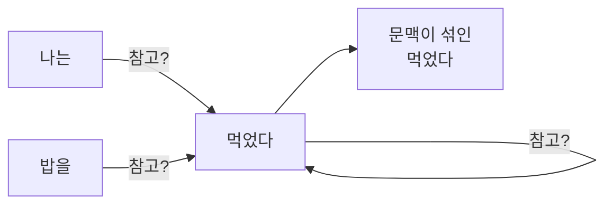
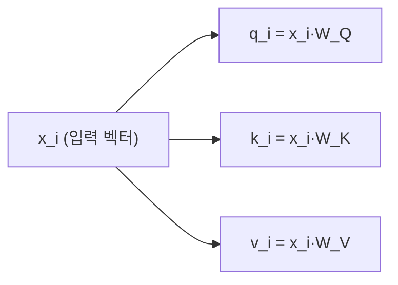
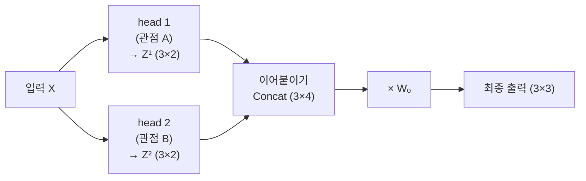
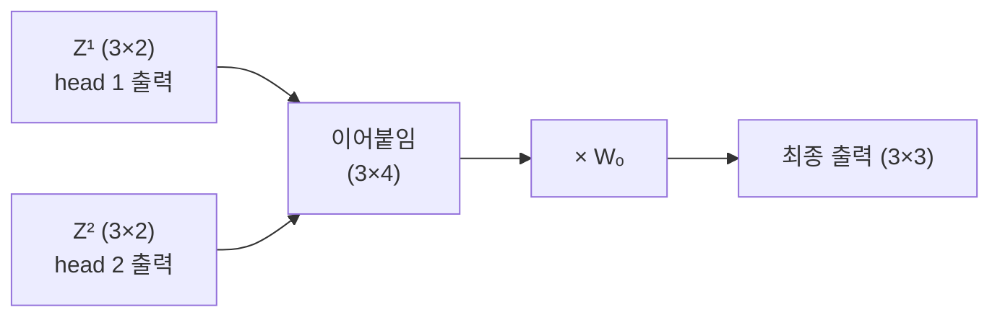
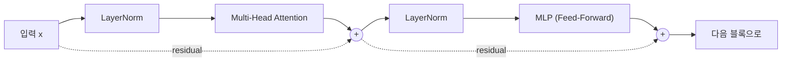
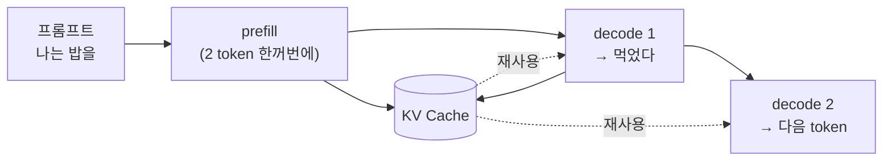
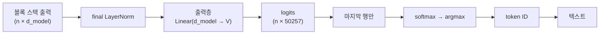
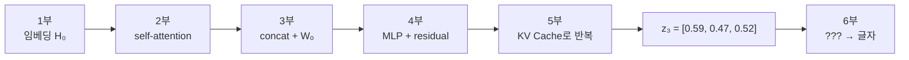
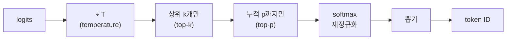
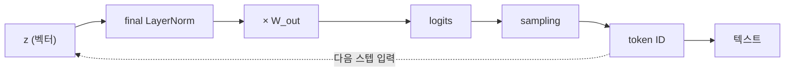

## 이 글의 구성


|     | 다루는 것 |
| --- | --- |
| 1부 | [임베딩과 위치 정보 (Token을 벡터로 바꾸기)](#1부-임베딩과-위치-정보-token을-벡터로-바꾸기) |
| 2부 | [Q·K·V로 문맥을 섞는 self-attention](#2부-qkv로-문맥을-섞는-self-attention) |
| 3부 | [Multi-Head 마무리 — concat과 Wₒ](#3부-multi-head-마무리--concat과-wₒ) |
| 4부 | [각 Token을 따로 가공하는 MLP](#4부-각-token을-따로-가공하는-mlp) |
| 5부 | [prefill, decode, KV Cache](#5부-prefill-decode-kv-cache) |
| 6부 | [출력층과 sampling — 다시 글자로](#6부-출력층과-sampling--다시-글자로) |


# 1부. 임베딩과 위치 정보 (Token을 벡터로 바꾸기)

LLM은 글자를 직접 다루지 못한다. 오직 **숫자(벡터)** 만 계산할 수 있다.
그래서 첫 단계는 단어(정확히는 token)를 벡터로 바꾸는 것인데, 이를 **embedding(임베딩)** 이라 한다. 먼저 GPT-3를 예로 임베딩이 **행렬 연산**으로 어떻게 이뤄지는지 본다.

### Token은 정수, 임베딩은 벡터

먼저 tokenizer가 문장을 **token** 단위로 쪼개고, 각 token에 **정수 ID**를 부여한다.
예를 들어 `"cat"` → `2543` 처럼, 모든 token은 사전(vocabulary)에서 번호 하나를 갖는다.

문제는 이 정수 자체엔 **의미가 없다**는 것이다. `2543`과 `2544`가 가깝다고 뜻이 비슷하지 않다.
그래서 각 token을 **여러 개의 실수로 이뤄진 벡터**로 바꾼다. 이 벡터가 임베딩이다.

GPT 계열이 쓰는 BPE tokenizer로 직접 확인하면 이렇다.

```python
import tiktoken

tokenizer = tiktoken.get_encoding("gpt2")
ids = tokenizer.encode("cat sat")
print(ids)                       # [9246, 3332]
print([tokenizer.decode([i]) for i in ids])   # ['cat', ' sat']
```

GPT-3의 임베딩 벡터는 길이가 \(d_{\text{model}} = 12288\) 이다.
즉 token 하나가 **12288개의 숫자**로 표현된다.

$$
\mathbf{e}_{\text{cat}} = \big[\, e_1,\; e_2,\; \dots,\; e_{12288} \,\big] \in \mathbb{R}^{12288}
$$

### 왜 벡터인가?

정수 ID로 못 하던 일을 벡터는 할 수 있다. ***의미의 가까움을 거리로 표현할 수 있다.*** 두 벡터가 얼마나 같은 방향을 보는지는 **cosine similarity(코사인 유사도)** 로 잰다.

$$
\cos(\mathbf{a}, \mathbf{b}) = \frac{\mathbf{a} \cdot \mathbf{b}}{\lVert \mathbf{a} \rVert \, \lVert \mathbf{b} \rVert}
$$

값이 1에 가까우면 방향이 거의 같고(의미가 비슷), 0이면 무관, -1이면 반대다.

```python
import torch
import torch.nn.functional as F

cat = torch.tensor([0.2, 0.9, 0.1])
dog = torch.tensor([0.3, 0.8, 0.2])
car = torch.tensor([0.9, 0.1, 0.4])

print(F.cosine_similarity(cat, dog, dim=0))   # tensor(0.9831) — 가깝다
print(F.cosine_similarity(cat, car, dim=0))   # tensor(0.3377) — 멀다
```

`cat`과 `dog`는 0.98로 붙어 있고, `cat`과 `car`는 0.34로 떨어져 있다.
정수 ID `2543`과 `2544`로는 절대 만들 수 없던 관계다.

아래에서 두 벡터의 끝점을 **드래그**해 보면, 방향이 일치할 때 cos가 1, 수직이면 0, 정반대면 -1이 되는 것을 직접 확인할 수 있다.





#### 이 벡터는 어떻게 만들어질까? Word2Vec과의 차이

"비슷한 문맥에 등장하는 단어는 비슷한 의미를 갖는다."
**Word2Vec**은 이 전제로 단어와 문맥을 서로 예측하게 학습시켜 벡터를 얻는다. 즉 **미리 따로 학습해두고 가져다 쓴다**.

반면 **LLM은 임베딩을 입력층의 일부로 두고, 모델 전체와 함께 학습한다**.
별도 사전학습 대신 **해당 task와 데이터에 맞게 최적화된다**는 것이 이점이다.
아래에서 다룰 \(W_E\) 가 바로 그 "함께 학습되는" 표다.

### 실제로는 subword (BPE와 V = 50257)

한 가지 짚고 갈 전제가 있다. GPT는 token을 단어 단위로 쪼개지 않는다. 단어 단위 사전은 학습에 없던 단어를 만나면 무너진다.  
그래서 GPT-\(2\)·GPT-3는 **BPE(byte pair encoding)** 를 쓴다.
자주 함께 나오는 문자 조합을 반복 병합해 사전을 만들고, 모르는 단어는 **subword나 개별 문자로 쪼개** 처리한다.

```python
ids = tokenizer.encode("someunknownPlace")
print([tokenizer.decode([i]) for i in ids])
# ['some', 'unknown', 'Place'] — 모르는 단어도 쪼개서 처리한다
```

덕분에 `<|unk|>` 같은 대체 token 없이 **어떤 문자열이든** 표현할 수 있다.
이렇게 만들어진 GPT-\(2\)/GPT-3의 사전 크기가 바로 **\(V = 50257\)** 이다.

> 아래 예시는 이해를 위해 `나는 / 밥을 / 먹었다` 를 token 하나씩으로 다룬다.
> 실제 BPE라면 더 잘게 쪼개지지만, 행렬 연산의 구조는 동일하다.

### 임베딩 행렬

이 벡터들은 어디서 오는가? **임베딩 행렬(embedding matrix)** 이라는 거대한 표에서 꺼내온다.
사전의 각 token마다 벡터 하나씩을 행(row)으로 쌓아둔 것이다.

GPT-3의 사전 크기는 \(V = 50257\) 이므로, 임베딩 행렬 \(W_E\) 는 다음 크기의 행렬이다.

$$
W_E \in \mathbb{R}^{V \times d_{\text{model}}} = \mathbb{R}^{50257 \times 12288}
$$

이 표 하나가 담는 숫자만 \(50257 \times 12288 \approx 6.17 \times 10^{8}\), 약 **6억 개**다. 이 값들은 사람이 정하는 게 아니라 **학습을 통해 얻어지는 파라미터**다.

```python
V, d_model = 50257, 12288
embedding = torch.nn.Embedding(V, d_model)

print(embedding.weight.shape)      # torch.Size([50257, 12288])
print(embedding.weight.numel())    # 617558016  (약 6.2억)
print(embedding.weight.requires_grad)   # True — 학습되는 파라미터다
```

#### 예시)  6 × 3 으로 줄여 보기

실제 크기는 눈에 안 들어오니 차원을 내려 이해를 돕는다. 사전 크기 **\(V = 6\)**, 임베딩 차원 **\(d_{\text{model}} = 3\)** 이다.

문장 `"나는 밥을 먹었다"` 의 token에 ID를 붙이고, \(6 \times 3\) 짜리 \(W_E\) 를 둔다(값은 학습으로 얻어진 것이라 가정).

$$
W_E =
\begin{bmatrix}
0.2 & 0.9 & 0.1 \\
0.8 & 0.1 & 0.3 \\
0.4 & 0.3 & 0.9 \\
0.5 & 0.5 & 0.2 \\
0.1 & 0.7 & 0.6 \\
0.9 & 0.2 & 0.4
\end{bmatrix}
\begin{matrix}
\leftarrow \text{나는 (ID 0)} \\
\leftarrow \text{밥을 (ID 1)} \\
\leftarrow \text{먹었다 (ID 2)} \\
\\ \\ \\
\end{matrix}
$$

### 임베딩 조회 = one-hot 벡터 × 행렬

"token ID로 행렬의 해당 행을 꺼낸다"는 조회(lookup)를, 행렬 곱으로 정확히 표현할 수 있다.
핵심 도구는 **one-hot 벡터**다.

token ID가 \(i\) 일 때, one-hot 벡터 \(\mathbf{o}_i \in \mathbb{R}^{V}\) 는 **\(i\)번째 성분만 1, 나머지는 0** 인 벡터다.

$$
\mathbf{o}_i = \big[\,0,\; \dots,\; 0,\; \underbrace{1}_{i\text{번째}},\; 0,\; \dots,\; 0\,\big]
$$

이 one-hot 벡터를 임베딩 행렬에 곱하면, 정확히 \(i\)번째 행만 뽑혀 나온다.
`"나는"`(ID 0)으로 확인하면 이렇다.

$$
\mathbf{e}_{\text{나는}} = [\,1,0,0,0,0,0\,] \, W_E = [\,0.2,\; 0.9,\; 0.1\,]
$$

곱셈이 "행 하나 선택"이 되는 이유는, 0인 성분은 해당 행을 0으로 지우고 1인 성분만 그 행을 살리기 때문이다.
즉 **임베딩 조회는 곧 one-hot 벡터와 임베딩 행렬의 곱**이다.

```python
V, d = 6, 3
embedding = torch.nn.Embedding(V, d)
token_id = torch.tensor([0])

lookup = embedding(token_id)                       # 방식 1: 조회
onehot = F.one_hot(token_id, num_classes=V).float()
matmul = onehot @ embedding.weight                 # 방식 2: one-hot × 행렬

print(torch.allclose(lookup, matmul))   # True — 수학적으로 동치
```

단, 실제로는 one-hot을 만들지 않는다. 여기서 오해하기 쉽다. one-hot은 "조회가 왜 행렬 곱인가"를 설명하는 개념 도구일 뿐이다. 실제 구현은 one-hot 행렬을 만들지 않고 그냥 해당 행을 꺼낸다.

이유는 크기를 보면 분명하다. GPT-3 기준 one-hot 벡터 하나는 길이 50257인데, 그중 **99.998%가 0**이다.
token 하나를 고르려고 0을 5만 번 곱하는 셈이다.

`nn.Embedding`은 결과가 수학적으로 동일하면서 이 낭비를 없앤 **더 효율적인 구현**이다.
그래서 앞으로 나올 행렬 곱 수식은 **개념을 설명하는 표현**이지 실제 연산 방식이 아니다.

### 행렬 대 행렬 곱으로 문장 전체를 한번에 계산한다.

실제로는 token 하나가 아니라 **문장(token 여러 개)** 을 한꺼번에 처리한다.
길이 \(n\) 인 token 시퀀스의 one-hot 벡터들을 세로로 쌓으면 행렬 \(O \in \mathbb{R}^{n \times V}\) 가 된다.

여기에 임베딩 행렬을 곱하면, 문장의 모든 token 임베딩이 한 번의 행렬 곱으로 나온다.

$$
X = O \, W_E \in \mathbb{R}^{n \times d_{\text{model}}}
$$

예시 문장 `"나는 밥을 먹었다"` 로 확인해 보자. token 3개이므로 \(n = 3\) 이다.

$$
\underbrace{
\begin{bmatrix}
1 & 0 & 0 & 0 & 0 & 0 \\
0 & 1 & 0 & 0 & 0 & 0 \\
0 & 0 & 1 & 0 & 0 & 0
\end{bmatrix}}_{O\;(3 \times 6)}
\;
W_E
\;=\;
\underbrace{
\begin{bmatrix}
0.2 & 0.9 & 0.1 \\
0.8 & 0.1 & 0.3 \\
0.4 & 0.3 & 0.9
\end{bmatrix}}_{X\;(3 \times 3)}
\begin{matrix}
\leftarrow \text{나는} \\
\leftarrow \text{밥을} \\
\leftarrow \text{먹었다}
\end{matrix}
$$

이제 \(X\) 의 각 행이 문장 속 token 하나의 임베딩이다.
행렬 크기가 \((n \times V) \cdot (V \times d) = (n \times d)\) 로 맞아떨어지는 것을 확인하면 감이 잡힌다.

실제로는 배치까지 함께 처리하므로 차원이 하나 더 붙는다.

```python
V, d = 50257, 256
embedding = torch.nn.Embedding(V, d)

# [batch=8, seq_len=4] 형태의 token ID 묶음
token_ids = torch.randint(0, V, (8, 4))

X = embedding(token_ids)
print(X.shape)      # torch.Size([8, 4, 256])  → [batch, seq_len, d_model]
```

즉 token ID 텐서 뒤에 \(d_{\text{model}}\) 축이 하나 추가되는 것이 임베딩 층의 전부다.

### 위치 정보 더하기 (positional embedding)

 지금까지의 \(X\) 는 **token의 순서**를 전혀 모른다.
같은 token ID는 문장 어디에 있든 **항상 같은 벡터**로 매핑되기 때문이다.
그래서 `"개가 사람을 물었다"` 와 `"사람이 개를 물었다"` 가 구분되지 않는다.

그래서 GPT-3는 **위치마다 다른 벡터**를 하나 더 준비한다.
위치용 행렬 \(W_P\) 는 문맥 최대 길이 \(n_{\text{ctx}} = 2048\) 에 대해 다음 크기다.

$$
W_P \in \mathbb{R}^{n_{\text{ctx}} \times d_{\text{model}}} = \mathbb{R}^{2048 \times 12288}
$$

문장 길이 \(n\) 에 맞춰 앞의 \(n\) 개 위치 벡터를 잘라 \(P \in \mathbb{R}^{n \times d}\) 를 만들고, **token 임베딩에 그냥 더한다**.

$$
H_0 = X + P
$$

예시로 이어가면, 각 위치(0, 1, 2번째)의 벡터 \(P\) 를 더해 \(H_0\) 가 완성된다.

$$
P =
\begin{bmatrix}
0.0 & 0.1 & 0.0 \\
0.1 & 0.0 & 0.1 \\
0.2 & 0.1 & 0.0
\end{bmatrix}
\quad\Rightarrow\quad
H_0 = X + P =
\begin{bmatrix}
0.2 & 1.0 & 0.1 \\
0.9 & 0.1 & 0.4 \\
0.6 & 0.4 & 0.9
\end{bmatrix}
$$

이 \(H_0\) 가 **Transformer 블록에 들어가는 첫 입력**이다.
즉 "무슨 단어인가(token embedding) + 몇 번째인가(positional embedding)"를 합친 벡터에서 모든 계산이 시작된다.
실제 GPT-3에서는 \(3 \times 12288\) 크기가 될 뿐, 흐름은 이 예시와 똑같다.

#### absolute와 relative, 그리고 길이 제한

위치를 주입하는 방식은 두 갈래다.

- **absolute** — 위치마다 고유한 벡터를 둔다(0번째 자리, 1번째 자리, …)
- **relative** — token 사이의 **거리**를 표현한다("몇 칸 떨어져 있는가")

**GPT는 absolute를 쓰되, 고정값이 아니라 학습으로 최적화한다.**
원래 Transformer 논문의 고정된 사인파 방식과 다른 지점이다.

여기서 제약이 하나 따라온다. \(W_P\) 의 행이 2048개뿐이므로 **그보다 긴 입력은 위치 벡터가 없다.**
그래서 문맥 길이를 넘는 입력은 **잘라내야(truncate)** 한다.

#### 지금까지의 내용을 전체 코드로 구성하기

지금까지의 예시를 그대로 코드로 옮기면 아래와 같다.
임베딩 값을 직접 지정했으므로 **출력이 위 손계산과 정확히 일치**한다.

```python
import torch

V, d = 6, 3

# 위에서 쓴 임베딩 행렬을 그대로 넣는다 (보통은 학습으로 얻어진다)
W_E = torch.tensor([
    [0.2, 0.9, 0.1],   # 나는 (0)
    [0.8, 0.1, 0.3],   # 밥을 (1)
    [0.4, 0.3, 0.9],   # 먹었다 (2)
    [0.5, 0.5, 0.2],
    [0.1, 0.7, 0.6],
    [0.9, 0.2, 0.4],
])
embedding = torch.nn.Embedding(V, d)
embedding.weight.data = W_E

# "나는 밥을 먹었다" → token ID → 임베딩 조회
token_ids = torch.tensor([0, 1, 2])
X = embedding(token_ids)
print(X)
# tensor([[0.2000, 0.9000, 0.1000],
#         [0.8000, 0.1000, 0.3000],
#         [0.4000, 0.3000, 0.9000]])

# 위치 임베딩을 더해 H0 완성
P = torch.tensor([
    [0.0, 0.1, 0.0],
    [0.1, 0.0, 0.1],
    [0.2, 0.1, 0.0],
])
H0 = X + P
print(H0)
# tensor([[0.2000, 1.0000, 0.1000],
#         [0.9000, 0.1000, 0.4000],
#         [0.6000, 0.4000, 0.9000]])
```

임베딩은 학습되는 파라미터이므로 실제 출력에는 `grad_fn=...` 이 함께 찍힌다(위에서는 생략했다).

참고로 이 예시의 \(W_E\) 는 설명을 위해 지어낸 값이라, 여기에 cosine similarity를 재도 **의미 있는 결과가 나오지 않는다**.
`cos(나는, 밥을) = 0.35` 같은 수치는 우연일 뿐이다.
의미가 담기는 것은 어디까지나 **실제 데이터로 학습된** 임베딩이다.

### GPT-3 숫자 요약


| 기호               | 의미                    | GPT-3 값                     |
| ---------------- | --------------------- | --------------------------- |
| \(V\)                | 사전 크기(BPE token 종류 수) | 50257                       |
| \(d_{\text{model}}\) | 임베딩 벡터 길이             | 12288                       |
| \(n_{\text{ctx}}\)   | 최대 문맥 길이              | 2048                        |
| \(W_E\)              | token 임베딩 행렬          | \(50257 \times 12288\) (약 6.2억) |
| \(W_P\)              | 위치 임베딩 행렬             | \(2048 \times 12288\) (약 2500만) |


# 2부. Q·K·V로 문맥을 섞는 self-attention

### attention이 푸는 문제

임베딩만으로는 각 Token이 **혼자만의 의미**를 가진다.
하지만 "먹었다"의 진짜 의미는 앞의 "밥을"과 연결될 때 완성된다.
self-attention은 각 token이 **문장 속 다른 token을 얼마나 참고할지**를 계산해 문맥을 섞는 장치다.



핵심은 이 "얼마나"를 **학습된 규칙**으로 정한다는 것이다.
그 규칙의 재료가 \(Q\), K, \(V\) 세 벡터다.

#### 왜 "self"인가

attention은 원래 **서로 다른 두 시퀀스**를 잇는 장치였다.
번역 모델에서 출력 문장의 한 단어가 입력 문장의 어느 단어를 볼지 고르는 식이다.
self-attention은 그 대상이 **하나의 시퀀스 내부**다. 문장이 자기 자신의 다른 위치를 참고하기 때문에 self다.

#### 어디서 나온 아이디어인가

RNN 기반 번역 모델은 입력 문장 전체를 **하나의 hidden state**에 눌러 담아 디코더로 넘겼다.
문장이 길어지면 이 벡터 하나가 병목이 된다.
2014년 Bahdanau attention이 "매 시점 입력 전체를 다시 본다"로 이 병목을 풀었고, 2017년 Transformer는 RNN을 아예 걷어내고 **attention만 남겼다**.

### Q, K, V의 세 가지 역할

각 token 벡터 \(x_i\) 는 세 개의 벡터로 변신한다.
서로 다른 가중치 행렬 \(W_Q, W_K, W_V\) 를 곱해 만든다.


| 이름            | 비유  | 역할               |
| ------------- | --- | ---------------- |
| **Query (\(Q\))** | 검색어 | "나는 무엇을 찾고 있나"   |
| **Key (K)**   | 색인  | "나는 무엇에 대한 정보인가" |
| **Value (\(V\))** | 내용  | "내가 전달할 실제 정보"   |


$$
q_i = x_i W_Q, \qquad k_i = x_i W_K, \qquad v_i = x_i W_V
$$

동작은 도서관에서 자료를 찾는 것과 같다.
내 **질문(\(Q\))** 을 모든 자료의 **색인(K)** 과 대조해 관련도를 매기고, 관련도가 높은 자료의 **내용(\(V\))** 을 많이 가져온다.

### 예시 설정  1부의 H₀ 를 가정

입력은 1부에서 만든 \(3 \times 3\) 행렬 \(H_0\) 를 그대로 쓴다(token 3개, 차원 3).
각 행이 token 하나의 벡터다.

$$
X = H_0 =
\begin{bmatrix}
0.2 & 1.0 & 0.1 \\
0.9 & 0.1 & 0.4 \\
0.6 & 0.4 & 0.9
\end{bmatrix}
\begin{matrix}
\leftarrow \text{나는} \\
\leftarrow \text{밥을} \\
\leftarrow \text{먹었다}
\end{matrix}
$$

실제로는 학습된 \(3 \times 3\) 행렬 \(W_Q, W_K, W_V\) 를 곱해 \(Q\), K, V를 만든다.
여기서는 계산 흐름에 집중하기 위해 **세 행렬을 항등행렬로 두어 \(Q = K = V = X\)** 로 둔다.

이건 임시방편이 아니라 하나의 단계다.
가중치를 걷어낸 이 상태가 **attention의 뼈대**이고, 여기에 학습되는 투영 \(W_Q, W_K, W_V\) 를 붙이면 실제 self-attention이 된다.
지금은 뼈대만 보고, 살은 이 부 뒤쪽 multi-head 절에서 붙인다.

### 1단계 — Q, K, V 만들기

항등행렬을 곱했으므로 \(Q\), K, V는 모두 입력 \(X\) 와 같다.
즉 각 token의 세 벡터가 아래처럼 정해진다.


| token | \(q_i\)             | \(k_i\)             | \(v_i\)             |
| ----- | --------------- | --------------- | --------------- |
| 나는    | [0.\(2\), 1.0, 0.1] | [0.\(2\), 1.0, 0.1] | [0.\(2\), 1.0, 0.1] |
| 밥을    | [0.9, 0.1, 0.4] | [0.9, 0.1, 0.4] | [0.9, 0.1, 0.4] |
| 먹었다   | \([0.6, 0.4, 0.9]\) | \([0.6, 0.4, 0.9]\) | \([0.6, 0.4, 0.9]\) |




### 2단계 — 점수 계산: Q와 K의 내적

한 token이 다른 token을 얼마나 볼지는 **Query와 Key의 내적**으로 잰다.
내적이 클수록 방향이 비슷하다는 뜻이고, 곧 "관련이 깊다"는 신호다.

모든 token 쌍에 대해 \(q_i \cdot k_j\) 를 계산하면 점수 행렬 \(S = Q K^{\top}\) 가 된다.

$$
S = Q K^{\top} \approx
\begin{bmatrix}
1.05 & 0.32 & 0.61 \\
0.32 & 0.98 & 0.94 \\
0.61 & 0.94 & 1.33
\end{bmatrix}
\begin{matrix}
\leftarrow \text{나는가 본 점수} \\
\leftarrow \text{밥을이 본 점수} \\
\leftarrow \text{먹었다가 본 점수}
\end{matrix}
$$

예를 들어 마지막 행("먹었다")은 \(q_{\text{먹었다}} = [0.6, 0.4, 0.9]\) 를 각 Key와 내적한 결과다.
자기 자신(먹었다)과의 점수가 \(1.33\) 으로 가장 높다.

**여기서 한 가지 주의할 것이 있다.** 위 \(S\) 는 대각선을 기준으로 **대칭**이다.
\(W_Q = W_K = I\) 로 뒀기 때문에 \(S = X X^{\top}\) 가 되어 생긴 현상이지, attention의 성질이 아니다.
실제 모델은 \(W_Q \neq W_K\) 라 \(S\) 가 **비대칭**이다. 즉 "'나는'이 '먹었다'를 보는 정도"와 "'먹었다'가 '나는'을 보는 정도"는 서로 다르다.


### 3단계 — 스케일링: √dₖ 로 나누기

내적값은 차원이 커질수록 함께 커진다.
차원이 \(d_k\) 개면 그만큼 항이 더해지기 때문이다.
그래서 Key 차원 \(d_k\) 의 제곱근으로 나눠 크기를 눌러 준다.

$$
\frac{S}{\sqrt{d_k}} = \frac{S}{\sqrt{3}} \approx
\begin{bmatrix}
0.61 & 0.18 & 0.35 \\
0.18 & 0.57 & 0.54 \\
0.35 & 0.54 & 0.77
\end{bmatrix}
$$

여기서는 \(d_k = 3\) 이므로 \(\sqrt{3} \approx 1.73\) 으로 나눴다.

#### 나누지 않으면 무슨 일이 생기나

"학습이 불안정해진다"로 넘어가기 쉽지만 메커니즘은 좀 더 구체적이다. 입력값이 커질수록 softmax는 **계단 함수(step function)처럼** 동작한다. 가장 큰 항 하나가 거의 1을 독점하고 나머지는 0에 붙는다.

문제는 그 지점에서 **기울기(gradient)가 거의 0**이 된다는 것이다.
기울기가 0이면 역전파로 전달되는 학습 신호가 사라져, 학습이 급격히 느려지거나 아예 **정체(stagnate)** 된다.
\(d_k\) 가 3인 이 예시에서는 티가 나지 않지만, GPT급은 \(d_k\) 가 보통 수백에서 1000을 넘어 실제로 발생하는 문제다.

### 4단계 — softmax: 점수를 비율로

점수를 **합이 1인 비율**로 바꾸면, 각 token을 얼마나 참고할지가 정해진다.
이 변환이 softmax다. 큰 점수는 더 크게, 작은 점수는 더 작게 벌린 뒤 정규화한다.

$$
\text{softmax}(s)_j = \frac{e^{s_j}}{\sum_k e^{s_k}}
$$

"먹었다" 행 \([0.35, 0.54, 0.77]\) 에 softmax를 적용하면 다음과 같다.

$$
\text{softmax}([0.35,\, 0.54,\, 0.77]) \approx [\,0.27,\; 0.32,\; 0.41\,]
$$

즉 "먹었다"는 자기 자신을 **41%**, "밥을"을 **32%**, "나는"을 **27%** 참고한다.
세 token 전체에 적용하면 **attention 가중치 행렬** \(A\) 가 된다.


|         | 나는   | 밥을   | 먹었다  |
| ------- | ---- | ---- | ---- |
| **나는**  | 0.41 | 0.27 | 0.32 |
| **밥을**  | 0.26 | 0.38 | 0.37 |
| **먹었다** | 0.27 | 0.32 | 0.41 |


각 행의 합은 항상 1이다(반올림 오차로 1.00 근처). 이 행렬이 "누가 누구를 얼마나 보는가"를 한눈에 보여준다.

#### 헷갈리기 쉬운 두 "가중치"

\(W_Q\) 도 "가중치 행렬"이고 \(A\) 도 "attention 가중치 행렬"이지만, 둘은 성격이 완전히 다르다.


|                                      | 정체                    | 언제 정해지나          |
| ------------------------------------ | --------------------- | ---------------- |
| **\(W_Q, W_K, W_V\)** (weight parameter) | 학습되는 **모델 파라미터**      | 학습이 끝나면 고정       |
| **\(A\)** (attention weight)             | 참고 비율, 즉 **중간 계산 결과** | 입력 문장마다 매번 새로 계산 |


전자는 모델 파일에 저장되는 값이고, 후자는 저장되지 않는다.
같은 "가중치"라는 말을 쓰지만, 하나는 학습의 산물이고 다른 하나는 추론 중에 생겼다 사라지는 값이다.

학습 중에는 이 \(A\) 에 **dropout**을 적용한다. 일부 비율을 무작위로 0으로 만들고 남은 값을 \(1/(1-p)\) 배 키워 합을 맞춘다.
특정 token만 과하게 참고하는 것을 막기 위해서다.

```python {title="dropout"}
dropout = nn.Dropout(0.1)          # GPT 학습은 보통 0.1 ~ 0.2
attn_weights = dropout(attn_weights)
```

비율이 0.1이면 10%가 0이 되고, **남은 값들은 \(1/0.9 \approx 1.11\) 배로 커진다.** 학습과 추론에서 평균 영향력을 같게 유지하기 위해서다.
추론(서빙) 시에는 `model.eval()` 로 비활성화되므로 적용되지 않는다.

### 5단계 — 가중합: 출력 벡터 만들기

이제 가중치대로 **Value를 섞으면** 각 token의 최종 출력이 나온다.
"먹었다"의 출력 \(z_{\text{먹었다}}\) 는 세 Value의 가중합이다.

$$
z_{\text{먹었다}} = 0.27\,v_{\text{나는}} + 0.32\,v_{\text{밥을}} + 0.41\,v_{\text{먹었다}}
$$

$$
= 0.27[0.2,1.0,0.1] + 0.32[0.9,0.1,0.4] + 0.41[0.6,0.4,0.9] \approx [\,0.59,\; 0.47,\; 0.52\,]
$$


&nbsp;

전체를 행렬로 쓰면 \(Z = A V\) 한 줄이다.
이 \(Z\) 의 각 행이, **문맥이 섞인** 새 token 벡터다.

$$
Z = A V \approx
\begin{bmatrix}
0.52 & 0.56 & 0.44 \\
0.62 & 0.45 & 0.51 \\
0.59 & 0.47 & 0.52
\end{bmatrix}
\begin{matrix}
\leftarrow \text{나는} \\
\leftarrow \text{밥을} \\
\leftarrow \text{먹었다}
\end{matrix}
$$

### 전체 흐름 요약

지금까지의 다섯 단계는 결국 아래 한 줄의 수식으로 압축된다.

$$
\text{Attention}(Q, K, V) = \text{softmax}\!\left(\frac{Q K^{\top}}{\sqrt{d_k}}\right) V
$$


지금까지 손으로 따라간 다섯 단계를 코드로 옮기면 이게 전부다.

```python {title="self_attention.py"}
import torch
import torch.nn as nn

class SelfAttention(nn.Module):
    def __init__(self, d_in, d_out, qkv_bias=False):
        super().__init__()
        self.W_query = nn.Linear(d_in, d_out, bias=qkv_bias)
        self.W_key   = nn.Linear(d_in, d_out, bias=qkv_bias)
        self.W_value = nn.Linear(d_in, d_out, bias=qkv_bias)

    def forward(self, x):
        queries = self.W_query(x)                    # 1단계
        keys    = self.W_key(x)
        values  = self.W_value(x)

        attn_scores  = queries @ keys.T              # 2단계  S = QKᵀ
        attn_weights = torch.softmax(                # 3·4단계 ÷√dₖ 후 softmax
            attn_scores / keys.shape[-1]**0.5, dim=-1)
        return attn_weights @ values                 # 5단계  Z = AV
```

\(W_Q, W_K, W_V\) 가 `nn.Linear`로 되어 있는 점에 주목한다.
`bias=False` 인 `nn.Linear`는 사실상 행렬곱과 같지만, **가중치 초기화 방식이 최적화되어 있어** 학습이 더 안정적이다. 그래서 실제 구현은 `nn.Parameter`로 행렬을 직접 만들지 않고 이쪽을 쓴다.

`keys.shape[-1]**0.5` 가 \(\sqrt{d_k}\) 다. 차원을 상수로 박아 두지 않고 텐서에서 꺼내 쓴다.

### GPT는 미래를 못 본다  (masked self-attention)

지금 예시는 모든 token이 서로를 자유롭게 봤다.
하지만 GPT처럼 **다음 단어를 예측**하는 모델은 아직 나오지 않은 미래 token을 보면 안 된다.  
그래서 자기보다 **뒤에 있는 token의 점수를 \(-\infty\)** 로 막아 버린다(softmax 후 0이 된다).

$$
S_{\text{masked}} =
\begin{bmatrix}
1.05 & -\infty & -\infty \\
0.32 & 0.98 & -\infty \\
0.61 & 0.94 & 1.33
\end{bmatrix}
$$

그 결과 attention 가중치 행렬은 **아래 삼각형** 모양이 된다.
"나는"은 자기 자신만, "밥을"은 앞의 둘만, "먹었다"만 문장 전체를 본다.

\(-\infty\) 대신 마스킹 후 다시 정규화하는 방식도 있지만, \(-\infty\) 를 쓰면 softmax가 알아서 0을 만들어 주므로 한 번에 끝난다.
GPT 구현이 이 방식을 쓴다.

```python {title="causal_mask.py"}
# 대각선 위쪽(미래)만 1인 상삼각 행렬
mask = torch.triu(torch.ones(context_length, context_length), diagonal=1)

attn_scores.masked_fill_(mask.bool(), -torch.inf)   # 미래 자리를 -∞ 로
attn_weights = torch.softmax(attn_scores / keys.shape[-1]**0.5, dim=-1)
```

`torch.triu(..., diagonal=1)` 이 만드는 상삼각 행렬이 곧 "미래" 자리다.
`masked_fill_` 처럼 **밑줄로 끝나는 PyTorch 연산은 in-place**라, 텐서를 새로 복사하지 않는다.

두 방식의 결과 행렬은 **완전히 같다.** 마스킹 후 재정규화하는 것은, 결국 처음부터 마스킹되지 않은 위치들만으로 softmax를 계산한 것과 수학적으로 동일하기 때문이다. 미래 token의 기여는 완전히 상쇄된다.

이 mask는 학습 파라미터가 아니지만 모델과 함께 GPU로 옮겨져야 한다. 그래서 실제 구현은 `register_buffer` 로 등록한다.

```python {title="register_buffer"}
self.register_buffer(
    'mask', torch.triu(torch.ones(context_length, context_length), diagonal=1))

# forward 안에서는 실제 입력 길이만큼 잘라 쓴다
attn_scores.masked_fill_(self.mask.bool()[:num_tokens, :num_tokens], -torch.inf)
```

buffer로 등록하면 `model.to("cuda")` 할 때 **자동으로 함께 이동**해 device mismatch 오류를 막는다.
입력 token 수가 `context_length` 보다 짧을 수 있으므로, 쓸 때는 `[:num_tokens, :num_tokens]` 로 잘라 쓴다.

### 여러 관점으로 보기 — multi-head attention

지금까지는 attention을 한 번만 수행했다. 이것을 **head 하나**라고 부른다.
head가 하나면 관점도 하나뿐이라, 한 종류의 관계밖에 보지 못한다.
그래서 실제 Transformer는 **여러 head를 병렬로** 두어 서로 다른 관계를 동시에 학습한다. 여기서는 **head 2개**로 설명한다.

한 가지 단서를 달아 둔다. 아래 계산은 **마스킹을 잠시 빼고** 진행한다.
head를 나누는 구조 자체에 집중하기 위해서다. 실제 GPT는 각 head 안에서 앞 절의 마스킹을 그대로 적용한다.

**먼저 차원을 나눈다.** 앞의 single-head는 \(d_v = 3\) 이라 출력 \(Z\) 가 \(3 \times 3\) 이었다.
head 2개로 나누면 각 head는 더 작은 부분 공간(\(d_v = 2\))을 맡아, 출력이 **\(3 \times 2\)** 가 된다.
여기에는 예외 처리가 하나 들어간다.
원래 관례는 \(d_{\text{model}} = h \times d_v\) 라서 \(2 \times 2 = 4 \neq 3\) 은 규칙 위반이고, 실제 구현은 `d_model % n_heads == 0` 을 아예 강제한다.
\(d_{\text{model}} = 3\) 이 2로 나눠떨어지지 않아 예시로만 \(d_v = 2\) 를 쓴다. 그 대가로 3부의 \(W_O\) 가 정방행렬이 아니게 되는데, 거기서 다시 짚는다.

각 head는 **자기만의 \(W_Q^i, W_K^i, W_V^i\) (각 \(3 \times 2\))** 를 가진다.
이번엔 항등행렬이 아니라, 입력의 서로 다른 성분을 골라 섞는 행렬로 둔다.

$$
\text{head 1:}\quad
W_Q^1=\begin{bmatrix}1&0\\0&1\\0&0\end{bmatrix},\;
W_K^1=\begin{bmatrix}0&0\\1&0\\0&1\end{bmatrix},\;
W_V^1=\begin{bmatrix}1&0\\0&0\\0&1\end{bmatrix}
$$

$$
\text{head 2:}\quad
W_Q^2=\begin{bmatrix}0&1\\0&0\\1&0\end{bmatrix},\;
W_K^2=\begin{bmatrix}1&0\\0&0\\0&1\end{bmatrix},\;
W_V^2=\begin{bmatrix}0&0\\1&0\\0&1\end{bmatrix}
$$

\(Q^i = X W_Q^i\) 등으로 계산하면, **같은 \(X\) 인데 head마다 \(Q\), K, V가 다르게** 나온다.

$$
\textbf{head 1:}\quad
Q^1=\begin{bmatrix}0.2&1.0\\0.9&0.1\\0.6&0.4\end{bmatrix},\;
K^1=\begin{bmatrix}1.0&0.1\\0.1&0.4\\0.4&0.9\end{bmatrix},\;
V^1=\begin{bmatrix}0.2&0.1\\0.9&0.4\\0.6&0.9\end{bmatrix}
$$

$$
\textbf{head 2:}\quad
Q^2=\begin{bmatrix}0.1&0.2\\0.4&0.9\\0.9&0.6\end{bmatrix},\;
K^2=\begin{bmatrix}0.2&0.1\\0.9&0.4\\0.6&0.9\end{bmatrix},\;
V^2=\begin{bmatrix}1.0&0.1\\0.1&0.4\\0.4&0.9\end{bmatrix}
$$

각 head는 이 \(Q\), K, V로 **앞의 5단계(점수 → 스케일 → softmax → 가중합)를 그대로** 수행한다.
그 결과 head마다 \(3 \times 2\) 짜리 출력 \(Z^i\) 가 나온다.

$$
Z^1 = \begin{bmatrix} 0.58 & 0.54 \\ 0.50 & 0.43 \\ 0.53 & 0.47 \end{bmatrix}, \qquad
Z^2 = \begin{bmatrix} 0.48 & 0.48 \\ 0.44 & 0.55 \\ 0.41 & 0.53 \end{bmatrix}
$$

$$
\text{head}_i = \text{Attention}(X W_Q^i,\; X W_K^i,\; X W_V^i)
$$

각 head가 **서로 다른 부분 공간(representation subspace)** 을 본다는 것까지는 말할 수 있다.
다만 "head 1은 문법, head 2는 의미" 식으로 역할이 깔끔하게 나뉜다는 보장은 없다.
학습 결과로 그렇게 갈릴 수도 있고 아닐 수도 있으므로, 여기서는 그냥 **관점 \(A\), 관점 B**로 부른다.



이제 두 조각 \(Z^1, Z^2\) 가 생겼다.
이것을 하나로 **이어붙이고(concat) \(W_O\) 로 섞어** 다시 \(3 \times 3\) 으로 되돌리는 과정이 다음 부의 주제다.
참고로 GPT-3는 같은 방식으로 head **96개**(각 \(d_v = 128\))를 쓴다.

#### 실제 구현은 head를 나누지 않는다

위 설명은 "작은 attention을 head 수만큼 만들어 쌓는다"는 그림이다. 이해하기엔 좋지만 **느리다.**
head마다 행렬곱을 따로 돌리면, 가장 비싼 연산을 96번 반복하게 된다.

실제 구현은 방향이 반대다. **큰 layer 하나로 한 번에 계산한 뒤, 그 결과를 head로 쪼갠다.**

```python {title="multi_head_attention.py"}
class MultiHeadAttention(nn.Module):
    def __init__(self, d_in, d_out, context_length, dropout, num_heads, qkv_bias=False):
        super().__init__()
        assert d_out % num_heads == 0, "d_out must be divisible by num_heads"
        self.d_out, self.num_heads = d_out, num_heads
        self.head_dim = d_out // num_heads          # 96개로 나눈 각 head의 차원

        self.W_query = nn.Linear(d_in, d_out, bias=qkv_bias)   # head마다가 아니라 하나!
        self.W_key   = nn.Linear(d_in, d_out, bias=qkv_bias)
        self.W_value = nn.Linear(d_in, d_out, bias=qkv_bias)
        self.out_proj = nn.Linear(d_out, d_out)                # 곧 다룰 W_O
        self.dropout = nn.Dropout(dropout)
        self.register_buffer('mask',
            torch.triu(torch.ones(context_length, context_length), diagonal=1))

    def forward(self, x):
        b, num_tokens, d_in = x.shape
        queries = self.W_query(x)                   # (b, n, d_out) — 한 번만 계산
        keys    = self.W_key(x)
        values  = self.W_value(x)

        # (b, n, d_out) → (b, n, num_heads, head_dim) → (b, num_heads, n, head_dim)
        queries = queries.view(b, num_tokens, self.num_heads, self.head_dim).transpose(1, 2)
        keys    = keys.view(b, num_tokens, self.num_heads, self.head_dim).transpose(1, 2)
        values  = values.view(b, num_tokens, self.num_heads, self.head_dim).transpose(1, 2)

        attn_scores = queries @ keys.transpose(2, 3)            # head별로 한꺼번에
        attn_scores.masked_fill_(
            self.mask.bool()[:num_tokens, :num_tokens], -torch.inf)
        attn_weights = self.dropout(
            torch.softmax(attn_scores / keys.shape[-1]**0.5, dim=-1))

        context = (attn_weights @ values).transpose(1, 2)       # (b, n, num_heads, head_dim)
        context = context.contiguous().view(b, num_tokens, self.d_out)   # 이어붙이기
        return self.out_proj(context)
```

핵심은 `self.W_query = nn.Linear(d_in, d_out)` 가 **head 수와 무관하게 하나**라는 점이다.
`d_out` 을 통째로 계산한 뒤 `.view(...)` 로 `num_heads × head_dim` 으로 쪼갠다. 행렬곱이 96번이 아니라 한 번이다.

`queries @ keys.transpose(2, 3)` 은 4차원 텐서의 **batched matmul**이다. 마지막 두 축끼리 행렬곱을 하고 head마다 반복한 것과 결과가 정확히 같은데, 반복문 없이 한 번에 처리된다.

맨 앞의 `assert d_out % num_heads == 0` 이 앞서 말한 그 제약이다. 이 글의 예시(\(3 \div 2\))는 여기서 걸린다.

`.contiguous()` 는 `transpose` 후 메모리 배치가 불연속이라 `.view` 앞에 필요하다.
마지막 `self.out_proj` 가 다음 글에서 다룰 \(W_O\) 다. 즉 이 클래스 하나에 concat과 \(W_O\) 까지 다 들어 있다.

# 3부. Multi-Head 마무리 — concat과 Wₒ

앞에서 head 2개가 각각 따로 attention을 계산해 **조각난 출력 \(Z^1, Z^2\)** 를 냈다.
문제는 이 조각들이 \(3 \times 2\) 두 개로 흩어져 있다는 것이다.
이제 그 조각들을 **이어붙여(concatenation) 다시 \(3 \times 3\) 하나로 되돌린다.**

### head마다 나온 출력

앞에서 head 2개가 각각 \(d_v = 2\) 짜리 출력 \(Z^1, Z^2\) 를 냈다.
각 행이 token 하나의 결과다.

$$
Z^1 = \begin{bmatrix} 0.58 & 0.54 \\ 0.50 & 0.43 \\ 0.53 & 0.47 \end{bmatrix}, \qquad
Z^2 = \begin{bmatrix} 0.48 & 0.48 \\ 0.44 & 0.55 \\ 0.41 & 0.53 \end{bmatrix}
$$

\(Z^1\) 과 \(Z^2\) 는 같은 token 3개에 대한 답이지만, **서로 다른 부분 공간에서 본 결과**다.
앞에서 두 head에 각각 다른 \(W_Q^i, W_K^i, W_V^i\) 를 줬기 때문이다.

### 문제 — 조각난 출력을 어떻게 되돌리나

각 head의 출력은 \(d_v = 2\) 차원으로 **쪼개진 조각**이다.
하지만 다음 층으로 넘어가려면 다시 원래 차원 \(d_{\text{model}} = 3\) 으로 맞춰야 한다.
그래서 두 단계를 거친다: **이어붙이기(concat) → \(W_O\) 로 섞기**.



### 1단계 — 이어붙이기 (concatenation)

concat은 이름 그대로, 각 head의 출력을 **옆으로 나란히 붙이는** 것이다.
token마다 head 1의 결과 뒤에 head 2의 결과를 그대로 잇는다.

$$
\text{Concat}(Z^1, Z^2) =
\left[\begin{array}{cc|cc}
0.58 & 0.54 & 0.48 & 0.48 \\
0.50 & 0.43 & 0.44 & 0.55 \\
0.53 & 0.47 & 0.41 & 0.53
\end{array}\right]
$$

왼쪽 두 열이 \(Z^1\), 오른쪽 두 열이 \(Z^2\) 다.
계산은 없다. **그냥 붙일 뿐**이라, 각 head의 관점이 손실 없이 그대로 보존된다.
이제 크기는 \(3 \times 4\), 즉 \(n \times (h \cdot d_v)\) 가 된다.

코드로는 한 줄이다.

```python {title="concat"}
context = torch.cat([head(x) for head in self.heads], dim=-1)
```

`dim=-1` 이 **마지막 축(차원 방향)으로 붙인다**는 뜻이다. token 축이 아니라 차원 축이라, 행 수는 그대로고 열만 늘어난다.

다만 이건 head를 따로 만들어 순차 실행하는 방식이라 느리다.
앞 글에서 본 실제 구현은 이미 하나의 큰 텐서로 계산해 뒀기 때문에, concat이 **텐서 모양만 되돌리는 연산**이 된다.

```python {title="실제 구현의 concat"}
# (b, num_heads, n, head_dim) → (b, n, num_heads, head_dim)
context = (attn_weights @ values).transpose(1, 2)
# → (b, n, d_out) : head들이 옆으로 이어붙은 모양
context = context.contiguous().view(b, num_tokens, self.d_out)
```

`.view(b, num_tokens, self.d_out)` 이 곧 concat이다.
`num_heads × head_dim` 두 축을 `d_out` 하나로 합치는데, 메모리에 이미 그 순서로 놓여 있으므로 **데이터를 옮기지 않고 모양만 바꾼다.** 위 수식에서 "계산은 없다"고 한 것이 코드에서도 그대로다.

### 2단계 — Wₒ 로 섞기 (output projection)

이어붙이기만 하면 head들은 물리적으로 나란히 있을 뿐, **서로 섞이지 않았다**.
그래서 **출력 가중치 \(W_O\)** 를 곱해 head 간 정보를 섞고, 동시에 차원을 \(d_{\text{model}}\) 로 되돌린다.
concat이 \(3 \times 4\) 이므로 \(W_O\) 는 \(4 \times 3\) 이다.

여기서 \(W_O\) 가 **정방행렬이 아니다.** 2부에서 \(d_{\text{model}} = 3\) 을 head 2개로 나누려고 \(d_v = 2\) 를 쓴 대가다.
표준 설정에서는 \(h \cdot d_v = d_{\text{model}}\) 이라 \(W_O\) 가 항상 정방행렬이 된다(GPT-3는 \(12288 \times 12288\)).

$$
W_O = \begin{bmatrix} 0.5 & 0 & 0.5 \\ 0 & 0.5 & 0.5 \\ 0.5 & 0.5 & 0 \\ 0.5 & 0 & 0.5 \end{bmatrix}
$$

$$
\text{MultiHead}(X) = \text{Concat}(Z^1, Z^2)\, W_O \approx
\begin{bmatrix}
0.77 & 0.51 & 0.80 \\
0.75 & 0.44 & 0.74 \\
0.74 & 0.44 & 0.77
\end{bmatrix}
\begin{matrix}
\leftarrow \text{나는} \\
\leftarrow \text{밥을} \\
\leftarrow \text{먹었다}
\end{matrix}
$$

이 \(3 \times 3\) 행렬이 multi-head attention 한 층의 **최종 출력**이다.
입력 \(X\) 와 같은 \(n \times d_{\text{model}}\) 모양으로 돌아온 것에 주목한다.

코드에서는 `out_proj` 라는 이름의 `nn.Linear` 하나다.

```python {title="output projection"}
self.out_proj = nn.Linear(d_out, d_out)   # (h·d_v) → d_model

...

return self.out_proj(context)             # concat 결과를 섞어 내보낸다
```

표준 설정에서는 \(h \cdot d_v = d_{\text{model}}\) 이므로 입력과 출력 차원이 둘 다 `d_out` 이다.
그래서 \(W_O\) 가 정방행렬이 되고, `nn.Linear(d_out, d_out)` 한 줄로 끝난다.

### 차원 맞추기

concat과 \(W_O\) 의 크기는 항상 다음 규칙으로 맞물린다.


| 단계              | 크기                                    | 의미             |
| --------------- | ------------------------------------- | -------------- |
| head 하나의 출력 \(Z^i\) | \(n \times d_v\)                          | token마다 \(d_v\) 차원 |
| Concat          | \(n \times (h \cdot d_v)\)                | head \(h\) 개를 이어붙임 |
| \(W_O\)             | \((h \cdot d_v) \times d_{\text{model}}\) | 섞으면서 원래 차원으로   |
| 최종 출력           | \(n \times d_{\text{model}}\)             | 입력과 같은 모양      |


예를 들어 GPT-3는 head **96개**, 각 \(d_v = 128\) 이므로 concat은 \(96 \times 128 = 12288\) 차원이 되고, \(W_O\) 는 \(12288 \times 12288\) 행렬이다.
차원 숫자만 커질 뿐, 흐름은 이 예시와 똑같다.

### 전체 한 줄

$$
\text{MultiHead}(X) = \text{Concat}(\text{head}_1, \dots, \text{head}_h)\, W_O
$$

핵심은 두 가지다.
**concat**은 각 head의 서로 다른 관점을 **손실 없이 모으고**, **\(W_O\)** 는 그것들을 **섞으면서 원래 차원으로 되돌린다**.


# 4부. 각 Token을 따로 가공하는 MLP

attention은 token들끼리 **서로 정보를 섞는** 단계였다.
그렇게 문맥이 섞인 각 token을, 이번엔 **혼자서 한 번 더 가공하는** 단계가 MLP다.
MLP(=Feed-Forward Network, FFN)는 attention과 함께 Transformer 블록의 나머지 절반을 이룬다.

### Transformer 블록에서 MLP의 자리

한 블록은 **attention → MLP** 순서로 이어지고, 두 단계 앞에 각각 LayerNorm이, 뒤에 각각 residual이 붙는다.
이 블록을 수십 개 쌓은 것이 GPT다.



#### norm이 앞인가 뒤인가

여기서 순서를 짚고 넘어갈 필요가 있다.
2017년 원 Transformer 논문은 연산을 **먼저 하고 그 결과를 정규화**했다. 이것을 **Post-LayerNorm**이라 부른다.

GPT-2와 GPT-3는 반대다. **정규화를 먼저 하고 연산에 넣는다(Pre-LayerNorm).**
Post 방식은 학습이 불안정해지는 경향이 있어, 이후 대부분의 모델이 Pre 방식으로 옮겼다.

$$
\text{Post-LN: } \; \text{LN}(x + \text{Attn}(x)) \qquad\text{vs.}\qquad \text{Pre-LN: } \; x + \text{Attn}(\text{LN}(x))
$$

위 다이어그램이 Pre-LayerNorm이다. residual로 더해지는 값은 **정규화되기 전의 원본 \(x\)** 라는 점이 핵심이다.
덕분에 입력에서 출력까지 아무 변형 없이 흐르는 경로가 하나 생긴다.


```python {title="transformer_block.py"}
class TransformerBlock(nn.Module):
    def __init__(self, cfg):
        super().__init__()
        self.att = MultiHeadAttention(
            d_in=cfg["emb_dim"], d_out=cfg["emb_dim"],
            context_length=cfg["context_length"],
            num_heads=cfg["n_heads"], dropout=cfg["drop_rate"],
            qkv_bias=cfg["qkv_bias"])
        self.ff = FeedForward(cfg)
        self.norm1 = LayerNorm(cfg["emb_dim"])
        self.norm2 = LayerNorm(cfg["emb_dim"])
        self.drop_shortcut = nn.Dropout(cfg["drop_rate"])

    def forward(self, x):
        shortcut = x                 # ① attention 쪽
        x = self.norm1(x)            #   norm 먼저 (Pre-LayerNorm)
        x = self.att(x)
        x = self.drop_shortcut(x)
        x = x + shortcut             #   원본을 다시 더함

        shortcut = x                 # ② MLP 쪽 — 똑같은 패턴
        x = self.norm2(x)
        x = self.ff(x)
        x = self.drop_shortcut(x)
        x = x + shortcut
        return x
```

`**shortcut = x` 로 원본을 챙겨 두고 → `norm` → 연산 → `dropout` → 다시 더하기.** 이 네 줄짜리 패턴이 두 번 반복된다.

Post-LayerNorm이었다면 `x = self.norm1(x + self.att(x))` 처럼 **더한 뒤에** norm이 왔을 것이다.
`shortcut` 에 담기는 것이 `norm1` 을 통과하기 **전의** 값이라는 점이 Pre-LayerNorm의 정의다.

입출력 모양은 변하지 않는다. `(2, 4, 768)` 이 들어가면 `(2, 4, 768)` 이 나온다.
그래서 이 블록을 **96번 그냥 쌓을 수 있다.**

### MLP가 attention과 다른 점

가장 큰 차이는 **정보가 섞이는 방향**이다.


|               | 섞이는 방향             | 하는 일                 |
| ------------- | ------------------ | -------------------- |
| **attention** | token ↔ token (가로) | 다른 token을 참고해 문맥을 섞음 |
| **MLP**       | 한 token 안 (세로)     | token 하나를 혼자 비선형 변환  |


MLP는 token끼리 섞지 않는다.
문장 속 모든 token이 **똑같은 MLP**(같은 \(W_1, W_2\))를 **각자 독립적으로** 통과한다.
그래서 여기서는 token 하나("먹었다")만 따라가면 충분하다.

### LayerNorm

LayerNorm은 벡터 하나를 **평균 0, 분산 1**로 맞추는 연산이다.
여기서 "벡터 하나"란 **token 하나의 feature 축**을 말한다. batch가 아니라 feature 방향으로 정규화한다는 점이 batch normalization과의 결정적 차이이고, 그래서 batch 크기에 영향받지 않는다.

$$
\text{LN}(x) = \gamma \odot \frac{x - \mu}{\sqrt{\sigma^2 + \epsilon}} + \beta,
\qquad
\mu = \frac{1}{d}\sum_i x_i,\quad
\sigma^2 = \frac{1}{d}\sum_i (x_i - \mu)^2
$$

\(\epsilon\) 은 분산이 0일 때 0으로 나누는 것을 막는 아주 작은 값이다.
\(\gamma\)(scale)와 \(\beta\)(shift)는 **학습되는 파라미터**로, 모델이 정규화 강도를 스스로 조절할 수 있게 해준다. 초깃값은 각각 1과 0이다.

#### 실제 값으로 해보기

3부의 multi-head 출력에서 "먹었다" 행은 \([0.74, 0.44, 0.77]\) 이었다.
Pre-LayerNorm 구조이므로, 여기에 먼저 residual(= 1부의 \(H_0\) 중 "먹었다" 행)을 더한다.

$$
[\,0.6,\, 0.4,\, 0.9\,] + [\,0.74,\, 0.44,\, 0.77\,] = [\,1.34,\; 0.84,\; 1.67\,]
$$

이 벡터의 평균은 \(\mu = 1.28\), 표준편차는 \(\sigma = 0.34\) 다. \(\gamma = 1, \beta = 0\) 으로 두고 정규화하면 이렇게 된다.

$$
\text{LN}([\,1.34,\, 0.84,\, 1.67\,]) = [\,0.17,\; -1.30,\; 1.13\,]
$$

크기는 눌렸지만 **대소 관계는 그대로**다. 세 번째 성분이 가장 크고 두 번째가 가장 작다.
LayerNorm은 정보를 지우는 게 아니라 **눈금만 다시 매기는** 연산이다.

```python {title="layer_norm.py"}
class LayerNorm(nn.Module):
    def __init__(self, emb_dim):
        super().__init__()
        self.eps = 1e-5
        self.scale = nn.Parameter(torch.ones(emb_dim))    # γ — 학습됨
        self.shift = nn.Parameter(torch.zeros(emb_dim))   # β — 학습됨

    def forward(self, x):
        mean = x.mean(dim=-1, keepdim=True)
        var  = x.var(dim=-1, keepdim=True, unbiased=False)
        norm_x = (x - mean) / torch.sqrt(var + self.eps)
        return self.scale * norm_x + self.shift
```

인자 세 개가 각각 이유를 갖는다.

- `**dim=-1**` — 마지막 축, 즉 embedding 차원을 따라 정규화한다. batch 축이 아니다. GPT의 입력은 `[batch, n_tokens, emb_dim]` 3차원인데, `-1` 로 써 두면 2차원이든 3차원이든 코드를 고칠 필요가 없다.
- `**keepdim=True**` — 차원 수를 유지해 뒤의 뺄셈이 브로드캐스팅되게 한다. 없으면 모양이 어긋난다.
- `**unbiased=False**` — 분산을 \(n-1\) 이 아니라 \(n\) 으로 나눈다(Bessel 보정 없음). embedding 차원이 12288쯤 되면 실질 차이가 없고, **원 GPT-2가 그렇게 학습돼 사전학습 가중치와 호환되어야** 하기 때문이다. 구현 디테일이 역사적 이유에서 나온 사례다.

정규화 후 평균을 찍어 보면 정확히 0이 아니라 `-5.96e-08` 같은 값이 나온다. 부동소수점 정밀도 한계이지 버그가 아니다.

### 입력 — MLP에 들어가는 벡터

이제 MLP 계산으로 넘어간다.
아래 계산은 정규화 이전 값 \([0.74, 0.44, 0.77]\) 을 그대로 입력으로 쓴다. MLP 자체의 흐름을 따라가는 것이 목적이라, 숫자를 앞부분과 맞춰 두는 편이 읽기 쉽기 때문이다.
LayerNorm을 거친 값을 넣어도 **연산 과정은 한 글자도 달라지지 않는다.**

$$
x = [\,0.74,\; 0.44,\; 0.77\,]
$$

### MLP 구조 — 확장 → 비선형 → 축소

MLP는 **선형 → 비선형(GELU) → 선형** 세 겹으로 된 단순한 구조다.

$$
\text{MLP}(x) = \text{GELU}(x W_1 + b_1)\, W_2 + b_2
$$

- \(W_1\): 차원을 **늘린다**(\(d_{\text{model}} \to d_{\text{ff}}\), 보통 4배).
- **GELU**: 비선형 함수를 통과시킨다.
- \(W_2\): 차원을 다시 **원래대로**(\(d_{\text{ff}} \to d_{\text{model}}\)) 줄인다.

여기서는 \(d_{\text{model}} = 3\) 을 \(d_{\text{ff}} = 6\) 으로 늘렸다 줄인다(예시라 2배, GPT-3는 4배).

코드로는 `nn.Sequential` 세 줄이 전부다.

```python {title="feed_forward.py"}
class FeedForward(nn.Module):
    def __init__(self, cfg):
        super().__init__()
        self.layers = nn.Sequential(
            nn.Linear(cfg["emb_dim"], 4 * cfg["emb_dim"]),   # 확장
            GELU(),                                          # 비선형
            nn.Linear(4 * cfg["emb_dim"], cfg["emb_dim"]),   # 축소
        )

    def forward(self, x):
        return self.layers(x)
```

`4 *` 가 코드에 그대로 박혀 있다. 확장 배수는 하이퍼파라미터가 아니라 관례로 굳어진 값이다.
입력이 `(2, 3, 768)` 이면 출력도 `(2, 3, 768)` 로 **모양이 변하지 않는다.** batch와 token 수는 가변이지만 embedding 차원만은 가중치를 만들 때 고정된다.

### 1단계 — 확장: x W₁ + b₁

\(3 \to 6\) 으로 늘리는 \(W_1\)(\(3 \times 6\)) 을 곱한다.

$$
W_1 = \begin{bmatrix}
1 & -1 & 0 & 1 & 0 & -1 \\
0 & 1 & 1 & -1 & 1 & 0 \\
1 & 0 & -1 & 0 & 1 & 1
\end{bmatrix}, \quad
b_1 = [\,0.1,\, -0.1,\, 0,\, 0.1,\, 0,\, -0.1\,]
$$

여기에 \(b_1\) 을 더하면 확장된 벡터 \(h\) 가 된다.

$$
h = x W_1 + b_1 = [\,1.61,\; -0.40,\; -0.33,\; 0.40,\; 1.21,\; -0.07\,]
$$

### 2단계 — GELU: 비선형 통과

GELU는 **음수는 0 쪽으로 누르고, 양수는 거의 그대로 통과**시키는 부드러운 곡선이다.
ReLU(\(\max(0, z)\))의 매끄러운 버전이라고 보면 된다.

$$
\text{GELU}(z) \approx 0.5\,z\left(1 + \tanh\!\left[\sqrt{2/\pi}\,\big(z + 0.044715\,z^3\big)\right]\right)
$$

```python {title="gelu.py"}
class GELU(nn.Module):
    def forward(self, x):
        return 0.5 * x * (1 + torch.tanh(
            torch.sqrt(torch.tensor(2.0 / torch.pi)) *
            (x + 0.044715 * torch.pow(x, 3))
        ))
```

수식이 그대로 코드가 된다. 이건 **근사식**이라는 점을 짚어 둘 필요가 있다.
GELU의 정확한 정의는 \(\text{GELU}(z) = z \cdot \Phi(z)\) 로, \(\Phi\) 는 표준정규분포의 누적분포함수다. 그대로 계산하면 비싸서, curve fitting으로 찾은 위 근사식을 쓴다. 원 GPT-2도 이 근사로 학습됐다.

`0.044715` 라는 어정쩡한 상수가 붙어 있는 이유가 그것이다.

\(h\) 의 각 원소에 GELU를 적용한다.
큰 양수(1.61, 1.21)는 거의 그대로 남고, 음수(\(-0.40\), \(-0.33\))는 0에 가깝게 눌린다.

$$
\text{GELU}(h) = [\,1.52,\; -0.14,\; -0.12,\; 0.26,\; 1.07,\; -0.03\,]
$$

이 **비선형**이 없으면 \(W_1\) 과 \(W_2\) 는 하나의 행렬로 합쳐져, 층을 쌓아도 결국 선형 하나가 되어 버린다.
GELU가 있어야 층을 쌓는 의미가 생긴다.

#### 왜 ReLU가 아니라 GELU인가

"부드럽다"는 것이 단순한 모양 차이가 아니다.
ReLU는 음수 구간이 **완전히 평평해서 기울기가 0**이다. 한 뉴런이 계속 음수만 받으면 학습 신호가 전혀 오지 않아 그대로 죽는다.

GELU는 음수 구간에서도 기울기가 0이 아니다(\(z \approx -0.75\) 한 점만 예외다).
위에서 \(-0.40\) 이 \(-0.14\) 로, \(-0.33\) 이 \(-0.12\) 로 **0이 아닌 값**이 된 것이 그 결과다.
음수를 받은 뉴런도 학습에 계속 기여할 수 있다는 뜻이고, 이게 GELU를 쓰는 실질적인 이유다.

### 3단계 — 축소: GELU(h) W₂ + b₂

이제 \(6 \to 3\) 으로 되돌리는 \(W_2\)(\(6 \times 3\)) 을 곱한다.

$$
W_2 = \begin{bmatrix}
0.5 & -0.5 & 0 \\
0 & 0.5 & 0.5 \\
-0.5 & 0 & 0.5 \\
0.5 & 0.5 & 0 \\
0 & -0.5 & 0.5 \\
0.5 & 0 & -0.5
\end{bmatrix}, \quad
b_2 = [\,0.1,\, 0,\, -0.1\,]
$$

\(b_2\) 를 더하면 MLP의 출력이 나온다. 다시 \(d_{\text{model}} = 3\) 차원이다.

$$
\text{MLP}(x) = \text{GELU}(h) W_2 + b_2 = [\,1.04,\; -1.24,\; 0.32\,]
$$

### 4단계 — residual: 입력을 다시 더하기

MLP 출력은 그대로 쓰이지 않고, **입력 \(x\) 를 다시 더한다**(residual connection).

$$
x + \text{MLP}(x) = [\,0.74,\, 0.44,\, 0.77\,] + [\,1.04,\, -1.24,\, 0.32\,] = [\,1.78,\; -0.80,\; 1.09\,]
$$

학습 중에는 이 덧셈 직전에 **dropout**이 한 번 들어간다. MLP 출력의 일부를 무작위로 0으로 만드는 것으로, attention 쪽에도 같은 장치가 붙는다. 추론 시에는 적용하지 않는다.

#### 왜 더하는가 — vanishing gradient

"원래 정보가 사라지지 않는다"는 설명은 절반이다. 진짜 이유는 **기울기** 쪽에 있다.

역전파는 층을 거슬러 올라가며 기울기를 **곱해 나간다**.
각 층의 기울기가 1보다 작으면 곱할수록 0에 수렴하고, 96층쯤 쌓이면 앞쪽 층에는 학습 신호가 사실상 도달하지 않는다. 이것이 **vanishing gradient**다.

residual은 여기에 **덧셈으로 이어진 지름길**을 만든다.
\(y = x + f(x)\) 를 미분하면 \(1 + f'(x)\) 라서, \(f'(x)\) 가 아무리 작아져도 **1이 남는다**. 기울기가 0으로 붕괴하지 않고 앞쪽 층까지 전달된다.

코드로는 조건 하나가 붙은 덧셈이다.

```python {title="shortcut connection"}
for layer in self.layers:
    layer_output = layer(x)
    if self.use_shortcut and x.shape == layer_output.shape:   # 모양이 같을 때만
        x = x + layer_output
    else:
        x = layer_output
```

모양이 같을 때만 더한다는 조건에 주의한다. 차원이 바뀌는 층에서는 그냥 더할 수 없다.
Transformer 블록이 입출력 모양을 유지하도록 설계된 이유이기도 하다.

실제로 5층짜리 신경망에 `[[1., 0., -1.]]` 을 넣고 층별 기울기 평균을 재보면 차이가 분명하다.


| 층              | residual 없음 | residual 있음 |
| -------------- | ----------- | ----------- |
| layers.0 (첫 층) | 0.00020     | 0.22170     |
| layers.1       | 0.00012     | 0.20694     |
| layers.\(2\)       | 0.00072     | 0.32897     |
| layers.3       | 0.00140     | 0.26657     |
| layers.4 (마지막) | 0.00505     | 1.32585     |


residual이 없으면 첫 층의 기울기가 다섯 번째 층의 **1/25** 수준으로 줄어든다.
층이 96개인 GPT-3에서 residual 없이 학습이 되지 않는 이유가 이것이다.

이 벡터가 그대로 **다음 블록**의 입력이 된다.
Pre-LayerNorm 구조에서는 여기에 LayerNorm이 다시 붙지 않는다. 정규화는 다음 블록이 **자기 입구에서** 수행하고, 블록을 전부 통과한 뒤 마지막에 한 번 더 적용된다.

### GPT-3 숫자

MLP는 모델에서 **파라미터가 가장 많이 몰리는** 곳이다.


| 기호               | 의미        | GPT-3 값                   |
| ---------------- | --------- | ------------------------- |
| \(d_{\text{model}}\) | 입력·출력 차원  | 12288                     |
| \(d_{\text{ff}}\)    | 확장 차원(4배) | 49152                     |
| \(W_1\)              | 확장 행렬     | \(12288 \times 49152\) (약 6억) |
| \(W_2\)              | 축소 행렬     | \(49152 \times 12288\) (약 6억) |


블록 하나의 MLP만 약 12억 개의 파라미터를 갖는다.
차원 숫자만 커질 뿐, 흐름은 이 예시(\(3 \to 6 \to 3\))와 똑같다.

같은 블록 안의 attention과 비교하면 차이가 분명하다.
attention은 \(W_Q, W_K, W_V, W_O\) 네 개가 각각 \(12288 \times 12288\) 이다.


| 블록 하나 기준  | 계산                          | 파라미터 수      |
| --------- | --------------------------- | ----------- |
| MLP       | \(2 \times 12288 \times 49152\) | 약 **12.1억** |
| attention | \(4 \times 12288 \times 12288\) | 약 **6.0억**  |


**MLP가 attention의 정확히 2배다.**
"Transformer는 attention이 핵심"이라고들 하지만, 파라미터 기준으로는 MLP가 모델의 주인이다.
서빙에서 가중치를 읽어 오는 시간의 대부분도 여기에 쓰인다.

# 5부. prefill, decode, KV Cache

지금까지 임베딩부터 MLP까지 계산한 것은 **forward 한 번**, 즉 token 하나를 만드는 과정이었다.
실제 문장 생성은 이 과정을 **token 개수만큼 반복**한다.
이제 그 반복 구조를 **prefill · decode** 로 나누고, **KV Cache** 가 정확히 어떤 숫자를 재사용하는지 정리한다.

### 생성은 두 단계로 나뉜다

사용자가 프롬프트를 넣으면, 모델은 성격이 다른 두 단계를 거친다.

- **prefill**: 입력 프롬프트 **전체를 한 번에** 처리한다. token이 여러 개라 계산량이 많다.
- **decode**: 그 뒤로 token을 **하나씩** 만든다. 스텝마다 가볍지만 여러 번 반복된다.



여기서는 **2부의 단순 설정으로 되돌아간다.** 3부의 multi-head concat과 4부의 MLP는 잠시 접어 두고, 단일 head에 \(W_Q = W_K = W_V = I\) 인 상태로 본다.
KV Cache가 재사용하는 것이 **어떤 숫자인지**만 드러내면 되기 때문이고, head가 늘고 층이 쌓여도 구조는 같다.

### 1단계 — prefill: 프롬프트를 한 번에

프롬프트를 `"나는 밥을"` (token 2개)이라 하자.
앞과 같은 벡터를 쓴다(\(d_{\text{model}} = 3\), 가중치는 항등행렬이라 \(Q = K = V = X\)).

$$
X = \begin{bmatrix} 0.2 & 1.0 & 0.1 \\ 0.9 & 0.1 & 0.4 \end{bmatrix}
\begin{matrix} \leftarrow \text{나는} \\ \leftarrow \text{밥을} \end{matrix}
$$

두 token을 **병렬로** 처리해 attention을 계산한다.
GPT는 미래를 보지 못하므로(masked), 첫 행은 자기 자신만 본다.

$$
\frac{S}{\sqrt{3}} = \begin{bmatrix} 0.61 & -\infty \\ 0.18 & 0.57 \end{bmatrix}
\;\xrightarrow{\text{softmax}}\;
A = \begin{bmatrix} 1.00 & 0 \\ 0.41 & 0.59 \end{bmatrix}
$$

여기까지가 prefill이다.
그리고 **여기서 계산한 K와 V를 버리지 않고 저장한다.** 이것이 KV Cache다.

$$
K_{\text{cache}} = \begin{bmatrix} 0.2 & 1.0 & 0.1 \\ 0.9 & 0.1 & 0.4 \end{bmatrix}, \qquad
V_{\text{cache}} = \begin{bmatrix} 0.2 & 1.0 & 0.1 \\ 0.9 & 0.1 & 0.4 \end{bmatrix}
$$

두 행렬이 똑같아 보이는 것은 \(W_K = W_V = I\) 로 뒀기 때문이다.
실제 모델은 \(W_K \neq W_V\) 라 **서로 다른 행렬**이고, 그래서 뒤에 나올 메모리 공식에 계수 \(2\) 가 붙는다.

### 왜 K와 V만 저장하나

Q는 캐시하지 않는다. 여기에 KV Cache의 핵심이 있다.


| 벡터       | 나중에 다시 필요한가 | 이유                                      |
| -------- | ----------- | --------------------------------------- |
| **K, \(V\)** | **필요하다**    | 새 token이 **과거 token들을 참고**할 때 그 K·V를 쓴다 |
| **\(Q\)**    | 필요 없다       | 각 token의 Q는 **자기 출력을 만들 때 한 번** 쓰고 끝난다  |


새로 생성되는 token은 자신의 q 하나만 있으면 된다.
그 q 를 **과거의 모든 K** 와 내적해 점수를 내고, **과거의 모든 \(V\)** 를 가중합하기 때문이다.
반대로 이미 처리된 token의 Q는 다시 등장할 일이 없다.

### 2단계 — decode: token 하나만 계산

이제 3번째 token `"먹었다"` 를 생성한다. 벡터는 \([0.6, 0.4, 0.9]\) 다.
새 token에 대해서만 \(q_3, k_3, v_3\) 를 만든다.

캐시에 \(k_3, v_3\) 를 **한 줄 덧붙인다**. 앞의 두 줄은 그대로 재사용한다.

$$
K_{\text{cache}} = \begin{bmatrix} 0.2 & 1.0 & 0.1 \\ 0.9 & 0.1 & 0.4 \\ \mathbf{0.6} & \mathbf{0.4} & \mathbf{0.9} \end{bmatrix}
\quad \text{(굵은 줄만 새로 계산)}
$$

점수는 **행렬 전체가 아니라 한 줄만** 계산한다.
\(q_3\) 를 캐시된 세 개의 K와 내적하면 끝이다.

$$
q_3 K_{\text{cache}}^{\top} = [\,0.61,\; 0.94,\; 1.33\,]
\;\xrightarrow{\div\sqrt{3}}\;
[\,0.35,\; 0.54,\; 0.77\,]
\;\xrightarrow{\text{softmax}}\;
[\,0.27,\; 0.32,\; 0.41\,]
$$

이 값을 캐시된 V에 가중합하면 출력이 나온다.

$$
z_3 = 0.27\,v_1 + 0.32\,v_2 + 0.41\,v_3 = [\,0.59,\; 0.47,\; 0.52\,]
$$

**2부에서 \(3 \times 3\) 행렬로 한꺼번에 구했던 마지막 행과 정확히 같은 값이다.**
즉 결과는 동일한데, 계산한 양만 \(3 \times 3\) 에서 \(1 \times 3\) 으로 줄었다.

### 그래서 벡터가 어떻게 token이 되나

여기서 한 가지 짚고 갈 것이 있다. 방금 나온 \(z_3 = [0.59, 0.47, 0.52]\) 는 **아직 벡터다.**
이것이 `"먹었다"` 라는 글자가 되려면 단계가 더 남아 있다.



블록을 전부 통과한 뒤 **final LayerNorm**을 한 번 거치고, **출력층**을 곱한다.
출력층은 \(d_{\text{model}}\) 차원을 사전 크기 \(V\) 로 펼치는 행렬이다. GPT-3 기준 \(12288 \times 50257\) 로, 1부의 임베딩 행렬과 **모양이 같다.** 벡터로 들어갔던 길을 거꾸로 되짚어 나오는 셈이다.

$$
\text{logits} = \text{LN}(Z)\, W_{\text{out}}, \qquad W_{\text{out}} \in \mathbb{R}^{d_{\text{model}} \times V}
$$

결과인 logits는 token마다 **사전의 5만여 단어 각각에 대한 점수**를 담는다.
그런데 다음 token을 고를 때 쓰는 것은 **마지막 행 하나뿐**이다. 나머지 행은 이미 아는 token의 자리라 버린다.

$$
\text{logits}[-1] \;\xrightarrow{\text{softmax}}\; \text{확률분포} \;\xrightarrow{\text{argmax}}\; \text{token ID} \;\to\; \text{"먹었다"}
$$

여기서 가장 큰 값을 그대로 고르는 방식을 **greedy decoding**이라 한다.
softmax는 순서를 바꾸지 않는 함수라, 사실 **logits에 바로 argmax를 해도 결과가 같다.** 확률값 자체가 필요할 때만 softmax를 계산하면 된다.

실제 서비스는 항상 최댓값을 고르지는 않는다. 확률분포에서 **뽑기**를 하면 같은 프롬프트에도 매번 다른 답이 나온다.
분포를 얼마나 뾰족하게 만들지 조절하는 것이 temperature이고, 후보를 상위 몇 개로 제한하는 것이 top-k다.
출력층과 이 sampling 기법들은 **다음 부에서** 숫자와 함께 자세히 다룬다.

### 캐시가 있을 때와 없을 때

같은 결과를 얻는 데 드는 계산량 차이가 크다.


|               | 캐시 없음           | 캐시 있음           |
| ------------- | --------------- | --------------- |
| K, \(V\) 계산       | 매번 **n개 전부** 다시 | **새 token 1개**만 |
| 점수 행렬         | \(n \times n\) 전체   | \(1 \times n\) 한 줄  |
| 스텝당 비용        | \(O(n^2)\)          | \(O(n)\)            |
| \(n\) token 생성 총합 | \(O(n^3)\)          | \(O(n^2)\)          |


캐시가 없으면 token이 길어질수록 **한 token 만드는 시간이 계속 늘어난다**.
캐시를 쓰면 스텝 비용이 거의 일정하게 유지된다.

교과서에 나오는 가장 단순한 생성 루프가 정확히 "캐시 없음" 버전이다.

```python {title="generate_text_simple.py"}
def generate_text_simple(model, idx, max_new_tokens, context_size):
    for _ in range(max_new_tokens):
        idx_cond = idx[:, -context_size:]      # ① 문맥 길이 초과 시 뒤쪽만
        with torch.no_grad():
            logits = model(idx_cond)           # ② 매번 전체를 다시 forward
        logits = logits[:, -1, :]              # ③ 마지막 시점만: (b,n,V) → (b,V)
        probas = torch.softmax(logits, dim=-1)
        idx_next = torch.argmax(probas, dim=-1, keepdim=True)
        idx = torch.cat((idx, idx_next), dim=1)   # ④ 뒤에 붙여 다음 반복 입력으로
    return idx
```

문제는 ②다. `model(idx_cond)` 에 **시퀀스 전체**가 들어간다.
④에서 token을 하나 붙이고 나면 다음 반복에서 그 전체를 **처음부터 다시** 계산한다. 앞 token들의 K·V는 값이 달라지지 않는데도 매번 새로 만든다.

동작은 맞다. 다만 이미 알고 있는 답을 매 스텝 다시 구하고 있다. KV Cache는 이 루프에서 ②만 "새 token 한 줄"로 바꾼 것이다.

③도 짚어 둘 만하다. `logits[:, -1, :]` 로 **마지막 시점만** 남긴다. 앞쪽 시점의 예측은 이미 아는 token 자리라 버린다.

### 대가는 메모리

공짜는 아니다. **연산을 아끼는 대신 메모리를 쓴다.**
캐시 크기는 다음과 같이 커진다.

$$
\text{KV Cache} = 2 \times n_{\text{layers}} \times d_{\text{model}} \times n_{\text{tokens}} \times \text{bytes}
$$

맨 앞의 \(2\) 가 앞에서 말한 **K와 \(V\)** 다.

GPT-3(레이어 96, \(d_{\text{model}} = 12288\), fp16 기준)로 계산하면 이렇다.


| 항목                | 크기           |
| ----------------- | ------------ |
| token **1개**당     | 약 **4.5 MB** |
| 2048 token(최대 문맥) | 약 **9 GB**   |


문장 하나를 처리하는 데 KV Cache만 9 GB다.
모델 가중치와 **별도로** 필요한 메모리이고, 동시 요청 수만큼 배로 늘어난다.
서빙에서 배치 크기가 GPU 메모리에 막히는 주된 이유가 이것이다.

이 크기를 줄이려고 여러 head가 K·V를 **공유하게** 만드는 방식(MQA, GQA)이 나왔다.
GPT-3 이후 모델들이 대부분 채택하고 있는데, 이것도 별도로 다룰 주제다.

### 그래서 병목이 단계마다 다르다

두 단계의 성격 차이는 이 구조에서 그대로 따라 나온다.

- **prefill은 연산 집약적**이다. token 여러 개를 한꺼번에 행렬 곱으로 처리하니 GPU 연산이 꽉 찬다.
- **decode는 메모리 집약적**이다. 계산량은 한 줄뿐인데, 그 한 줄을 위해 **모델 가중치 전체와 커진 KV Cache를 매번 읽어야** 한다.

그래서 최적화 방향도 갈린다.
긴 문서를 넣는 작업은 prefill이 병목이고, 짧게 묻고 길게 답하는 챗봇은 decode가 병목이다.

# 6부. 출력층과 sampling — 다시 글자로

1부에서 텍스트는 벡터가 되어 모델로 들어갔고, 5부까지 계속 벡터인 채로 계산됐다.
이제 그 벡터가 **다시 글자로 돌아오는 마지막 구간**을 본다.
출력층에서 logits를 만드는 과정과, 그 logits에서 token 하나를 고르는 **sampling** 이 주제다.

### 어디까지 왔나

시리즈가 지나온 숫자를 이어 붙이면 이렇게 된다.



5부의 decode가 만든 \(z_3 = [0.59, 0.47, 0.52]\) 는 **문맥이 전부 반영된 3차원 벡터**다.
문제는 이게 아직 숫자라는 것이다. 사용자에게 보여줄 글자가 되려면 두 단계가 더 필요하다.

### 1단계 — final LayerNorm

블록을 전부 통과한 벡터는 출력층으로 가기 전에 **LayerNorm을 한 번 더** 거친다.
4부에서 본 블록 내부의 LayerNorm과 같은 연산이지만, 이건 블록 스택 전체가 끝난 뒤 딱 한 번 적용된다.

$$
\text{LN}([\,0.59,\, 0.47,\, 0.52\,]) = [\,1.28,\; -1.15,\; -0.14\,]
$$

Pre-LayerNorm 구조에서는 마지막 블록의 출력에 정규화가 붙지 않은 채로 나온다.
그래서 출력층 앞에 이 **final LayerNorm**을 따로 둔다.

### 2단계 — 출력층: 사전 크기로 펼치기

이제 3차원 벡터를 **사전에 있는 모든 token에 대한 점수**로 바꾼다.
1부에서 쓴 사전을 그대로 가져온다. 크기 \(V = 6\) 이고, ID 3~5에 이름을 붙였다.


| ID  | token | ID  | token |
| --- | ----- | --- | ----- |
| 0   | 나는    | 3   | 그리고   |
| 1   | 밥을    | 4   | 물을    |
| \(2\)   | 먹었다   | 5   | 마셨다   |


출력층은 \(d_{\text{model}} \to V\) 로 펼치는 행렬 하나다. 여기서는 \(3 \times 6\) 이다.

$$
W_{\text{out}} =
\begin{bmatrix}
0.1 & -0.2 & 0.3 & 1.5 & 0.9 & 0.6 \\
-0.3 & 0.4 & -0.1 & -0.8 & -0.5 & 0.2 \\
0.2 & 0.1 & 0.5 & 0.4 & 0.7 & -0.3
\end{bmatrix}
$$


결과가 **logits**다. 사전의 token 하나마다 점수 하나씩, 총 6개가 나온다.

$$
\text{logits} = [\,0.45,\; -0.73,\; 0.43,\; 2.79,\; 1.64,\; 0.58\,]
$$

`그리고`(ID 3)의 점수 \(2.79\) 가 가장 높고, `밥을`(ID 1)의 \(-0.73\) 이 가장 낮다.
"나는 밥을 먹었다" 다음에 `밥을` 이 또 나올 이유는 없으니 납득할 만한 순서다.

> **참고** — GPT-2와 GPT-3는 이 \(W_{\text{out}}\) 을 새로 두지 않고 **임베딩 행렬을 전치해서 재사용**한다(weight tying). 그러면 logit 하나가 곧 `출력 벡터 · token 임베딩` 내적이 되어, 1부에서 본 **방향이 비슷할수록 점수가 높다**는 이야기와 그대로 이어진다. 여기서는 계산을 보기 쉽게 별도 행렬로 뒀다.

#### GPT-3에서의 크기


|                    | 예시         | GPT-3                       |
| ------------------ | ---------- | --------------------------- |
| \(W_{\text{out}}\)     | \(3 \times 6\) | \(12288 \times 50257\) (약 6.2억) |
| logits (token 1개당) | 6개         | **50257개**                  |


token 하나를 만들 때마다 5만여 개의 점수를 계산한다는 뜻이다.

#### logits는 사실 더 크다

지금은 token 하나만 봤지만, prefill에서는 여러 token을 한꺼번에 처리한다.
그래서 logits의 실제 모양은 \(n \times V\) 이고, batch까지 넣으면 3차원이 된다.

$$
\text{logits} \in \mathbb{R}^{\,\text{batch} \times n \times V}
$$

그런데 **다음 token을 고를 때 쓰는 것은 마지막 행 하나뿐**이다.
앞쪽 행들은 이미 알고 있는 token 자리의 예측이라 생성에는 쓸모가 없다. 계산은 했지만 버린다.

#### 모델 전체를 조립하면

지금까지 1부부터 여기까지 만든 조각을 한 클래스로 모으면 GPT가 된다.

```python {title="gpt_model.py"}
class GPTModel(nn.Module):
    def __init__(self, cfg):
        super().__init__()
        self.tok_emb  = nn.Embedding(cfg["vocab_size"], cfg["emb_dim"])      # 1부
        self.pos_emb  = nn.Embedding(cfg["context_length"], cfg["emb_dim"])  # 1부
        self.drop_emb = nn.Dropout(cfg["drop_rate"])
        self.trf_blocks = nn.Sequential(                                     # 2~4부
            *[TransformerBlock(cfg) for _ in range(cfg["n_layers"])])
        self.final_norm = LayerNorm(cfg["emb_dim"])                          # 6부
        self.out_head = nn.Linear(cfg["emb_dim"], cfg["vocab_size"], bias=False)

    def forward(self, in_idx):
        batch_size, seq_len = in_idx.shape
        tok_embeds = self.tok_emb(in_idx)
        pos_embeds = self.pos_emb(torch.arange(seq_len, device=in_idx.device))
        x = tok_embeds + pos_embeds        # ← 1부의 H₀ = X + P 가 이 한 줄이다
        x = self.drop_emb(x)
        x = self.trf_blocks(x)             # ← 블록 96개 통과
        x = self.final_norm(x)
        return self.out_head(x)            # ← logits
```

`x = tok_embeds + pos_embeds` 한 줄이 1부에서 손으로 계산한 \(H_0 = X + P\) 다.
`nn.Sequential(*[TransformerBlock(cfg) for _ in range(n_layers)])` 가 \(2\)~4부를 96번 쌓는 부분이고, 마지막 두 줄이 이 절에서 다루는 출력 경로다.

출력층에 `**bias=False**` 가 붙은 점을 눈여겨볼 만하다. token마다 고정 편향을 두지 않는다.

이 구조를 다 만들고 학습 없이 돌리면 `Hello, I am` 다음에 `Featureiman Byeswickattribute argue` 같은 문자열이 나온다.
**구조가 곧 능력은 아니다.** 지금까지 본 것은 전부 계산의 뼈대이고, 의미는 학습된 가중치에서 온다.

### 3단계 — 가장 큰 것 고르기: greedy decoding

가장 단순한 선택은 **제일 높은 점수를 그대로 고르는 것**이다.

$$
\text{다음 token} = \arg\max_j \; \text{logits}_j = 3 \;\to\; \text{그리고}
$$

여기서 자주 하는 오해가 하나 있다.
"softmax로 확률을 구한 다음 가장 큰 걸 고른다"고 설명하는 경우가 많은데, **greedy라면 softmax는 필요 없다.**

softmax는 **순서를 바꾸지 않는(monotonic) 함수**다.
logits에서 가장 큰 원소는 확률로 바꿔도 여전히 가장 크다. 그래서 `argmax(logits)` 와 `argmax(softmax(logits))` 의 결과는 항상 같다.

```python {title="greedy decoding"}
logits = logits[:, -1, :]                    # 마지막 시점만 (b, V)

probas = torch.softmax(logits, dim=-1)       # 이 줄은
idx_next = torch.argmax(probas, dim=-1)      # 생략해도 결과가 같다

idx_next = torch.argmax(logits, dim=-1)      # ← 이것만으로 충분
```

확률값 자체가 필요할 때만 softmax를 계산하면 된다.
아래에서 다룰 sampling 기법들이 바로 그 경우다.

### 4단계 — 확률로 바꾸기

sampling을 하려면 점수를 **합이 1인 확률분포**로 바꿔야 한다.

$$
p_j = \frac{e^{\,\text{logits}_j}}{\sum_k e^{\,\text{logits}_k}}
$$


| token   | logit | 확률        |
| ------- | ----- | --------- |
| **그리고** | \(2.79\)  | **0.608** |
| 물을      | 1.64  | 0.191     |
| 마셨다     | 0.58  | 0.067     |
| 나는      | 0.45  | 0.058     |
| 먹었다     | 0.43  | 0.058     |
| 밥을      | \(-0.73\) | 0.018     |


여기서 `그리고` 를 항상 고르는 것이 greedy다.
그런데 실제 서비스는 그렇게 하지 않는다. **확률에 따라 뽑기(sampling)** 를 한다.

### greedy로는 왜 부족한가

greedy decoding은 **완전히 결정적**이다. 같은 프롬프트에 항상 같은 답이 나온다.

문제는 매 스텝 최댓값만 고르면 문장이 **단조롭고 반복적**이 된다는 점이다.
"그리고 ... 그리고 ..." 처럼 확률이 높은 표현으로 계속 되돌아오는 루프에 갇히기 쉽다.
당장 이 스텝에서 최선인 선택이 문장 전체로도 최선이라는 보장은 없다.

그래서 확률분포에서 뽑되, **얼마나 모험할지**를 조절하는 장치를 둔다.
그 장치가 temperature, top-\(k\), top-\(p\) 셋이다.

### temperature — 분포의 뾰족함 조절

temperature는 softmax에 넣기 **전에 logits를 \(T\) 로 나누는** 것이 전부다.

$$
p_j = \frac{e^{\,\text{logits}_j / T}}{\sum_k e^{\,\text{logits}_k / T}}
$$

나누기 하나지만 효과가 크다.
\(T\) &lt; 1 이면 값들의 간격이 **벌어져** 분포가 뾰족해지고, \(T\) &gt; 1 이면 간격이 **좁아져** 평평해진다.

같은 logits에 \(T\) 만 바꿔 본 결과다.


| token   | \(T\)=0.5 (보수적) | \(T\)=1.0 (원본) | \(T\)=\(2\).0 (모험적) |
| ------- | ----------- | ---------- | ----------- |
| **그리고** | **0.885**   | **0.608**  | **0.373**   |
| 물을      | 0.088       | 0.191      | 0.209       |
| 마셨다     | 0.011       | 0.067      | 0.124       |
| 나는      | 0.008       | 0.058      | 0.115       |
| 먹었다     | 0.008       | 0.058      | 0.115       |
| 밥을      | 0.001       | 0.018      | 0.064       |


\(T = 0.5\) 에서는 `그리고` 가 88.5%를 가져가 사실상 greedy에 가깝다.
\(T = 2.0\) 에서는 37.3%까지 내려가, 나머지 token들도 뽑힐 여지가 생긴다.

양 끝의 극단을 보면 이해가 빠르다.

- \(T \to 0\): 최댓값 하나가 확률 1을 독점한다. **greedy와 완전히 같아진다.**
- \(T \to \infty\): 모든 token이 균등해진다. **완전한 무작위**가 된다.

```python {title="temperature"}
scaled = logits / temperature
probas = torch.softmax(scaled, dim=-1)
idx_next = torch.multinomial(probas, num_samples=1)   # argmax가 아니라 뽑기
```

`torch.argmax` 가 `torch.multinomial` 로 바뀐 것이 sampling의 본질이다.
전자는 최댓값 위치를 고르고, 후자는 **확률에 비례해 무작위로 뽑는다.** 확률 0.608인 token은 열 번 중 여섯 번쯤 나온다.

즉 temperature는 greedy와 무작위 사이를 잇는 **손잡이 하나**다.
사실 확인이 중요한 작업은 낮게, 창작은 높게 두는 것이 일반적이다.

### top-k — 후보를 상위 k개로 자르기

temperature만으로는 부족한 구석이 있다.
분포를 아무리 뾰족하게 만들어도 **말이 안 되는 token에 아주 작은 확률이 계속 남는다.**
위 표에서 \(T = 2.0\) 일 때 `밥을` 이 6.4%다. 스텝을 수백 번 반복하면 언젠가는 뽑힌다.

top-k는 아예 **후보를 상위 \(k\) 개로 잘라 버린다.**
나머지 logits를 \(-\infty\) 로 만들면 softmax 후 정확히 0이 된다. 2부의 masked attention과 같은 수법이다.

\(k = 2\) 로 자르면 이렇게 된다.

$$
\text{logits}_{\text{top-2}} = [\,-\infty,\; -\infty,\; -\infty,\; 2.79,\; 1.64,\; -\infty\,]
$$

남은 둘만으로 다시 정규화하면 확률이 이렇게 재분배된다.


| token   | 원래 확률 | \(k\)=\(2\) 적용 후  | \(k\)=3 적용 후  |
| ------- | ----- | --------- | --------- |
| **그리고** | 0.608 | **0.761** | **0.702** |
| 물을      | 0.191 | 0.239     | 0.221     |
| 마셨다     | 0.067 | 0         | 0.077     |
| 나머지 3개  | 0.134 | 0         | 0         |


잘려 나간 확률이 살아남은 후보들에게 **비율 그대로 나눠진다**.
`그리고` 와 `물을` 의 비율은 자르기 전과 후가 같다.

```python {title="top_k"}
top_logits, top_pos = torch.topk(logits, k)          # 상위 k개의 값과 위치

logits = torch.where(
    logits < top_logits[..., -1],                    # k번째보다 작으면
    torch.tensor(float("-inf")),                     # -∞ 로
    logits)

probas = torch.softmax(logits / temperature, dim=-1) # 남은 것만으로 재정규화
```

`top_logits[..., -1]` 이 **k번째로 큰 값**, 즉 커트라인이다. 그보다 작은 것을 전부 `-inf` 로 만든다.
softmax가 \(e^{-\infty} = 0\) 으로 처리하므로 별도 재정규화 코드가 필요 없다. 4부의 masked attention과 정확히 같은 수법이다.

### top-p — 확률 합으로 자르기 (nucleus sampling)

top-k에는 약점이 있다. **\(k\) 가 고정된 숫자**라는 점이다.

분포가 뾰족할 때는 \(k = 50\) 이 너무 넓고, 평평할 때는 너무 좁다.
문맥에 따라 그럴듯한 후보의 개수는 계속 달라지는데, top-k는 그걸 반영하지 못한다.

top-p는 개수 대신 **확률의 합**을 기준으로 자른다.
확률이 높은 순으로 더해 나가다가 누적이 \(p\) 를 넘으면 거기서 멈춘다.


| 순위  | token | 확률    | 누적                   |
| --- | ----- | ----- | -------------------- |
| 1   | 그리고   | 0.608 | 0.608                |
| \(2\)   | 물을    | 0.191 | 0.800                |
| 3   | 마셨다   | 0.067 | 0.866                |
| 4   | 나는    | 0.058 | **0.925** ← \(p\)=0.9 통과 |
| 5   | 먹었다   | 0.058 | 0.982                |
| 6   | 밥을    | 0.018 | 1.000                |


\(p = 0.9\) 면 4개에서 멈추고, \(p = 0.95\) 면 5개까지 간다.
**후보 개수가 분포 모양에 따라 자동으로 바뀐다**는 것이 top-k와의 차이다.

한 token이 확률 0.95를 독점하는 상황이라면 top-p는 후보를 **1개만** 남긴다.
같은 상황에서 top-k는 여전히 \(k\) 개를 남겨, 말이 안 되는 후보를 억지로 끼워 넣는다.

```python {title="top_p"}
sorted_logits, sorted_idx = torch.sort(logits, descending=True)
cumulative = torch.cumsum(torch.softmax(sorted_logits, dim=-1), dim=-1)

# 누적이 p를 넘어선 뒤의 것들을 제거 (경계 token은 남긴다)
remove = cumulative > p
remove[..., 1:] = remove[..., :-1].clone()
remove[..., 0] = False

logits[sorted_idx[remove]] = float("-inf")
```

`torch.cumsum` 이 위 표의 "누적" 열이다.
`remove` 를 한 칸 밀어 주는 두 줄이 중요하다. 이게 없으면 **누적이 \(p\) 를 넘게 만든 그 token까지 잘려 나가서**, 실제로는 \(p\) 에 못 미치는 확률만 남는다.

### Temperature, top-k, top-p

실제 API는 이 셋을 동시에 받는다. 적용 순서는 정해져 있다.



**temperature로 분포 모양을 정하고 → 자르고 → 남은 것 안에서 뽑는다.**
자르기가 temperature보다 뒤에 오는 이유는, temperature가 순위 자체는 바꾸지 않기 때문이다. 어느 쪽을 먼저 해도 후보 집합은 같지만, 확률 비율은 temperature를 먼저 적용해야 의도대로 나온다.


| 파라미터        | 흔한 기본값     | 낮추면     | 높이면    |
| ----------- | ---------- | ------- | ------ |
| temperature | 0.7 ~ 1.0  | 결정적·반복적 | 다양·불안정 |
| top-\(k\)       | 40 ~ 50    | 후보 축소   | 후보 확대  |
| top-\(p\)       | 0.9 ~ 0.95 | 후보 축소   | 후보 확대  |


temperature를 0으로 두면 나머지 설정과 무관하게 greedy가 된다.
같은 질문에 항상 같은 답이 필요한 작업에서 이 설정을 쓴다.

### 마지막 — ID를 글자로

뽑힌 것은 여전히 숫자다. 마지막으로 tokenizer가 ID를 문자열로 되돌린다.

$$
3 \;\to\; \text{"그리고"}
$$

이 token은 다시 **다음 스텝의 입력**이 된다.
5부의 KV Cache에 자신의 K·V를 한 줄 덧붙이고, 그 위에서 다음 token을 만든다. 이 반복이 문장이 끝날 때까지 이어진다.



1부에서 글자를 벡터로 바꿔 들어간 길이, 여기서 **벡터를 글자로 되돌리며 닫힌다.**

## 전체 정리

### 1부. 임베딩과 위치 정보 (Token을 벡터로 바꾸기)

- 정수 ID엔 의미가 없지만, **벡터는 의미의 가까움을 방향·거리로 표현**할 수 있다(cosine similarity).
- LLM의 임베딩은 Word2Vec처럼 따로 학습하지 않고, **모델과 함께 학습되는 입력층**이다.
- GPT는 BPE로 **subword**를 쪼개며, 그 결과 사전 크기가 \(V = 50257\) 이다.
- 조회는 개념적으로 행렬 곱이다: \(\mathbf{e}_i = \mathbf{o}_i^\top W_E\), 문장 전체는 \(X\) = OW_E.
다만 **실제 구현은 one-hot을 만들지 않고 해당 행을 바로 꺼낸다**.
- 여기에 **위치 임베딩을 더해** \(H_0 = X + P\) 를 만들면, 그게 Transformer의 첫 입력이다.

### 2부. Self-Attention — 단어들이 서로를 참고한다

- self-attention은 각 token을 \(q, k, v\) 세 벡터로 바꾼 뒤, **\(Q\)·K로 관련도**를 재는 것이다.
- 관련도를 \(\sqrt{d_k}\) 로 나누는 이유는 값이 커지면 softmax의 **기울기가 0에 수렴**해 학습이 멈추기 때문이다.
- 그 비율대로 **Value를 가중합**하면, 문맥이 섞인 새 벡터 \(Z = AV\) 가 나온다.
- GPT는 미래 token을 \(-\infty\) 로 가려(**masked**) 다음 단어 예측에만 집중한다.
- 실제 모델은 이런 attention을 여러 개 병렬로 둔 **multi-head**로, 서로 다른 부분 공간을 동시에 본다.
- 2부의 \(W = I\) 설정은 **뼈대만 본 것**이다. 그래서 \(S\) 가 대칭으로 나왔지만, 실제 attention은 비대칭이다.

### 3부. Multi-Head 마무리 — concat과 Wₒ

- multi-head는 head마다 \(d_v\) 차원의 조각난 출력 \(Z^i\) 를 낸다.
- **concat**은 이 조각들을 옆으로 이어붙여 \(n \times (h \cdot d_v)\) 로 모은다(계산 없이 보존).
- **\(W_O\)** 를 곱해 head들을 섞고, 차원을 다시 \(d_{\text{model}}\) 로 되돌린다.
- 결과는 입력과 같은 \(n \times d_{\text{model}}\) 모양이라, 다음 층으로 그대로 이어진다.

### 4부. MLP — 각 token을 따로 가공한다

- MLP는 attention과 달리, 각 token을 **혼자서** 비선형 변환하는 단계다.
- 구조는 **확장(\(W_1\)) → GELU → 축소(\(W_2\))** 로 단순하다.
- **GELU** 비선형이 있어야 층을 쌓는 의미가 생긴다. ReLU와 달리 음수 뉴런을 죽이지 않는다.
- **LayerNorm**은 token 하나를 평균 0·분산 1로 맞춘다. GPT는 연산 **앞에** 두는 Pre-LayerNorm 방식이다.
- **residual**은 미분값에 1을 남겨, 층이 깊어져도 기울기가 0으로 붕괴하지 않게 한다.
- MLP는 블록에서 파라미터가 가장 많이 몰리는 곳으로, attention 전체의 **2배**다.

### 5부. prefill, decode, KV Cache

- 문장 생성은 **prefill(프롬프트 한꺼번에) → decode(하나씩 반복)** 두 단계다.
- **KV Cache** 는 과거 token의 K·V를 저장해, 새 token 계산 시 **한 줄만** 계산하게 해준다.
- **Q는 캐시하지 않는다.** 과거 token의 Q는 다시 쓰이지 않기 때문이다.
- 스텝 비용이 \(O(n^2)\) 에서 \(O(n)\) 으로 줄지만, 그 대가로 **메모리**를 쓴다(GPT-3 기준 2048 token에 약 9 GB).
- prefill은 연산 병목, decode는 메모리 병목이다.

### 6부. 출력층과 sampling — 다시 글자로

- 블록 스택의 출력은 **final LayerNorm → 출력층**을 거쳐 사전 크기의 **logits**가 된다.
- GPT-3는 token 하나마다 logits **50257개**를 계산하고, 그중 **마지막 행만** 사용한다.
- **greedy**는 argmax 하나면 끝이다. softmax는 순서를 바꾸지 않으므로 계산할 필요가 없다.
- **temperature**는 logits를 \(T\) 로 나눠 분포의 뾰족함을 정한다. \(T \to 0\) 이면 greedy와 같아진다.
- **top-\(k\)**는 후보를 고정 개수로, **top-\(p\)**는 누적 확률로 자른다. 후자는 후보 개수가 문맥에 따라 자동으로 바뀐다.
- 적용 순서는 **temperature → top-\(k\) → top-\(p\) → 재정규화 → 뽑기** 다.

## 전체 로직

$$
\text{텍스트} \to \underbrace{H_0}_{\text{1부}} \to \underbrace{Z^i}_{\text{2부}} \to \underbrace{\text{Concat} \cdot W_O}_{\text{3부}} \to \underbrace{\text{LN} \to \text{MLP} \to +x}_{\text{4부}} \to \underbrace{\text{반복}}_{\text{5부}} \to \underbrace{\text{logits} \to \text{argmax}}_{\text{6부}} \to \text{텍스트}
$$

GPT-3는 2부부터 4부까지를 **블록 하나**로 묶어 **96번 쌓고** 그 위에서 5부의 반복을 돌린다.  
차원이 3에서 12288로, 층이 1에서 96으로 커질 뿐 각 단계에서 하는 계산은 이 글에서 손으로 따라간 것과 똑같다.