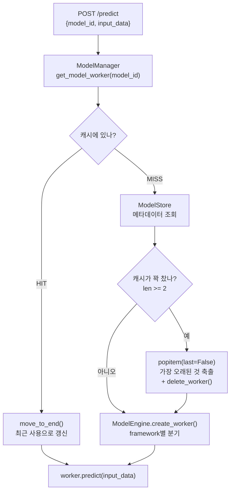
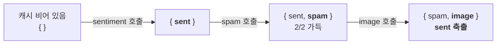
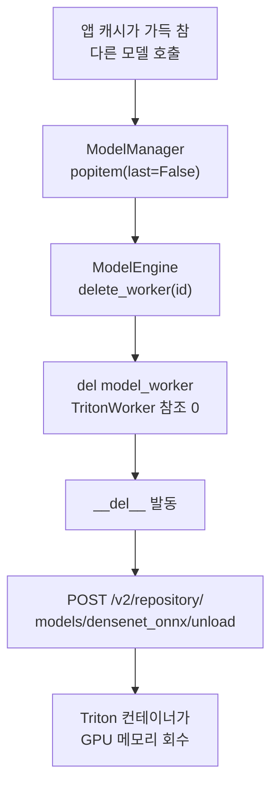

[앞 글](../llm-serving-single-model-lab/)에서는 모델 **하나**를 어떻게 빠르게 굴릴지를 다뤘다. 배칭, 스트리밍, 프로세스 격리가 주제였다. 이번에는 질문이 바뀐다. **모델이 여러 개일 때 무엇을 메모리에 올려두고 어디로 보낼 것인가.**

같은 저장소 [orca3/llm-model-inference](https://github.com/orca3/llm-model-inference)의 `ch03/multi_model_serving`을 쓴다. 모델 4개를 LRU 캐시로 관리하고, 그중 하나는 **NVIDIA Triton 컨테이너에 위임**하는 구조다.

이 글의 모든 로그와 명령 결과는 **RTX 3050 6GB 리눅스 머신에서 실제로 실행한 것**이다.

## 1. Part 1과 무엇이 다른가

두 랩은 완전히 독립적이다. 그리고 **torch 버전이 충돌**하므로 venv를 반드시 분리해야 한다.

| | Part 1 (앞 글) | Part 2 (이 글) |
| --- | --- | --- |
| 디렉터리 | `single_model_llm_serving` | `multi_model_serving` |
| 주제 | 배칭 · 스트리밍 · 프로세스 격리 | **모델 캐싱(LRU) · 라우팅 · 크로스 프레임워크** |
| 서비스 포트 | 8000 | 8001 |
| torch | 2.7.0 | **2.2.1** ← 충돌 |
| 핵심 의존성 | `vllm` | `tritonclient[http]`, `torchvision` |
| VRAM 사용 (6GB 기준) | 약 3.8GB | **약 1.5GB** |
| Docker | 불필요 | **필수** (Triton) |
| GPU 패치 | 필수 (안 하면 깨짐) | 선택 (원본은 CPU로 잘 돌아감) |

VRAM 항목이 흥미롭다. **모델 개수는 이쪽이 더 많은데 메모리는 절반도 안 쓴다.** Part 1의 vLLM이 `gpu_memory_utilization=0.5`로 3GB를 통째로 선점했기 때문이다. **모델 크기가 아니라 프레임워크의 메모리 예약 정책이 VRAM을 결정한다**는 것이 두 랩을 비교하면 바로 보인다.

포트는 다음과 같이 나뉜다. 두 랩을 동시에 띄워도 포트는 충돌하지 않는다(VRAM은 충돌한다).

| 포트 | 용도 |
| --- | --- |
| 8000 | Part 1 서비스 |
| 8001 | Part 2 서비스 |
| 8009 | Triton **HTTP** (컨테이너 8000 → 호스트 8009) |
| 8010 | Triton gRPC |
| 8011 | Triton Metrics |

Triton 컨테이너의 기본 HTTP 포트가 8000이라 Part 1과 겹친다. 그래서 호스트 8009로 매핑했고, `app/worker.py`의 `triton_url`도 `0.0.0.0:8009`로 하드코딩되어 있다. **이 매핑을 바꾸면 코드도 같이 고쳐야 한다.**

시작 전에 Part 1 서비스를 반드시 내린다. 6GB에서 두 랩을 같이 띄우면 확실히 OOM이다.

```bash
pkill -f "python main.py"; sleep 2
nvidia-smi --query-gpu=memory.used,memory.free --format=csv   # 반환 확인
```

## 2. 구조 — 요청 하나가 지나가는 길

핵심은 `ModelManager`가 들고 있는 **`OrderedDict` 하나**다. 이게 LRU 캐시의 실체이고, 상한은 `max_models=2`다.



`ModelEngine`은 **Worker Factory**다. `framework` 문자열을 보고 구현체를 고른다.

| 파일 | 역할 |
| --- | --- |
| `app/server.py` | FastAPI — `/predict`, `/models` (포트 8001) |
| `app/manager.py` | **`ModelManager`** — `OrderedDict` LRU 캐시 (`max_models=2`) |
| `app/engine.py` | `ModelEngine` — framework별 Worker Factory |
| `app/worker.py` | `ModelWorker(ABC)` + 구현체 3개 |
| `app/store.py` | `ModelStore` — `config/models.json` 로드 |

등록된 모델은 4개이고, 프레임워크가 세 종류다.

| 모델 | framework | 용도 |
| --- | --- | --- |
| distilbert-...-sst-2-english | `transformers` | 감성 분석 |
| bert-tiny-...-sms-spam-detection | `transformers` | 스팸 탐지 |
| pytorch/vision:mobilenet_v2 | `torchvision` | 이미지 분류 |
| densenet_onnx | `triton` | 이미지 분류 (**원격 위임**) |

**모델 4개, 캐시 자리 2개.** 이 불일치가 이 실습 전체의 주제다.

편의를 위해 셸 변수로 잡아둔다.

```bash
export M_SENT=550e8400-e29b-41d4-a716-446655440000
export M_SPAM=6ba7b810-9dad-11d1-80b4-00c04fd430c8
export M_IMG=7c9e6679-7425-40de-944b-e07fc1f90ae7
export M_TRITON=8ba7b810-9dad-11d1-80b4-00c04fd430c9
```

## 3. 설치

**Part 1의 venv를 재사용하면 안 된다.** torch 2.7.0과 2.2.1이 충돌한다.

```bash
cd llm-model-inference/ch03/multi_model_serving
python3.12 -m venv venv
source venv/bin/activate
pip install -U pip
pip install -r requirements.txt        # 5~10분
```

```bash
python -c "import torch, torchvision, transformers, tritonclient.http; print(torch.__version__, torchvision.__version__, transformers.__version__)"
# 기대: 2.2.1 0.17.1 4.35.2
```

Triton 이미지는 9.6GB로 크다. 미리 백그라운드로 받아두고 다음 단계를 진행하면 시간을 아낀다.

```bash
docker pull nvcr.io/nvidia/tritonserver:24.12-py3 &
```

## 4. GPU 패치 — 이번엔 "버그 수정"이 아니다

Part 1과 정반대 상황이다. Part 1은 `self.device`만 계산하고 모델을 안 옮겨서 **GPU에서 깨졌다.** 여기는 device 개념 자체가 없어서 **CPU로 멀쩡히 돈다.**

```bash
grep -n "cuda\|\.to(\|device" app/worker.py
# 아무것도 안 나온다
```

즉 이 패치는 선택 사항이다. 그래도 하는 이유는 하나다. **LRU eviction이 VRAM 수치로 눈에 보이기 때문이다.** 캐시에서 빠지는 순간 `nvidia-smi` 숫자가 실제로 내려가는지가 이 랩에서 가장 중요한 관찰이다.

### 패치 ① — 워커를 GPU로

`TransformerWorker`와 `TorchVisionWorker` 두 곳에 device를 넣는다.

```python
# app/worker.py — TransformerWorker
    def _load_model(self):
        if self.model is None:
            self.device = "cuda" if torch.cuda.is_available() else "cpu"     # 추가
            self.model = AutoModelForSequenceClassification.from_pretrained(
                self.model_metadata.name).to(self.device).eval()             # 추가
            self.tokenizer = AutoTokenizer.from_pretrained(self.model_metadata.name)

    def predict(self, input_data: Any) -> Dict[str, Any]:
        inputs = self.tokenizer(input_data, return_tensors="pt",
                                padding=True, truncation=True).to(self.device)   # 추가
        with torch.no_grad():
            outputs = self.model(**inputs)
        predictions = torch.softmax(outputs.logits, dim=-1)
        return {"predictions": predictions.cpu().tolist()}                       # 추가
```

`TritonWorker`는 손대지 않는다. 애초에 로컬에서 추론하지 않고 원격에 위임하기 때문이다.

### 패치 ② — eviction 시 VRAM을 실제로 회수 (핵심)

패치 ①만 하면 **캐시에서 빠졌는데도 `nvidia-smi` 수치가 안 줄어든다.** 이유가 두 개 겹쳐 있다.

1. `popitem()`이 반환한 워커가 **지역 변수 `model_worker`에 붙들려** 함수가 끝날 때까지 살아 있다
2. 참조가 사라져도 PyTorch **caching allocator**가 VRAM을 OS에 반환하지 않고 재사용을 위해 쥐고 있다

```python
# app/manager.py — get_model_worker() 안, eviction 블록
        if len(self.model_cache) >= self.max_models:
            id, model_worker = self.model_cache.popitem(last=False)
            self.model_engine.delete_worker(id)
            del model_worker                      # 추가 — 마지막 참조 제거
            gc.collect()                          # 추가 — 순환 참조까지 정리
            if torch.cuda.is_available():
                torch.cuda.empty_cache()          # 추가 — allocator가 쥔 VRAM 반환
```

> **"모델 객체를 버리는 것"과 "메모리를 실제로 회수하는 것"은 다른 문제다.** 캐시 상한을 지켰는데도 OOM이 나는 전형적인 원인이 이것이다. 패치 ②를 **일부러 빼고 먼저 관찰**한 뒤 넣으면 대비가 확실하다.

부수 효과도 있다. `del model_worker`가 없으면 `TritonWorker.__del__`(= 원격 unload 호출)이 함수 종료 시점까지 밀린다. 이 패치를 넣으면 eviction 즉시 unload가 나가서 뒤에 나올 Triton 로그 관찰이 깔끔해진다.

## 5. 서비스 기동 — lazy loading 확인

```bash
# 반드시 multi_model_serving/ 에서 (ModelStore가 상대경로를 쓴다)
python -m app.server 2>&1 | tee mms_run.log
```

```terminal {title="mms_run.log"}
INFO:     Started server process [129733]
INFO:     Waiting for application startup.
INFO:     Application startup complete.
INFO:     Uvicorn running on http://0.0.0.0:8001 (Press CTRL+C to quit)
```

별도 터미널에 VRAM 모니터를 켜둔다. 이 실습의 절반이 이 숫자를 보는 일이다.

```bash
watch -n 1 'nvidia-smi --query-gpu=memory.used,memory.free --format=csv; \
            nvidia-smi --query-compute-apps=pid,used_memory --format=csv'
```

기동 직후에는 **앱 프로세스가 `nvidia-smi`에 아예 안 나타난다.** 모델을 하나도 안 올렸기 때문이다. 첫 `/predict`가 와야 CUDA 컨텍스트(약 0.4GB)와 모델이 잡힌다. 이것이 **lazy loading**이다.

모델 목록을 보면 메타데이터 4개는 있지만 `loaded_models`가 비어 있다.

```bash
curl -s http://localhost:8001/models | jq
```

```terminal {title="GET /models"}
{
  "available_models": {
    "550e8400-...": { "name": "distilbert-base-uncased-finetuned-sst-2-english", "framework": "transformers", ... },
    "6ba7b810-...": { "name": "mrm8488/bert-tiny-finetuned-sms-spam-detection",  "framework": "transformers", ... },
    "7c9e6679-...": { "name": "pytorch/vision:mobilenet_v2",                     "framework": "torchvision",  ... },
    "8ba7b810-...": { "name": "densenet_onnx",                                   "framework": "triton",       ... }
  },
  "loaded_models": {}
}
```

**"등록된 모델"과 "메모리에 올라간 모델"이 분리되어 있다.** 멀티 모델 서빙의 출발점이다.

## 6. 실습 1 — 모델 세 개로 LRU 축출 일으키기

### 감성 분석 (첫 번째 모델)

```bash
curl -s -X POST http://localhost:8001/predict \
  -H "Content-Type: application/json" \
  -d "{\"model_id\": \"$M_SENT\", \"input_data\": \"This movie was great! I really enjoyed it.\"}" | jq
```

```terminal {title="POST /predict — sentiment"}
{
  "predictions": [
    [
      0.00011904446728294715,
      0.9998809099197388
    ]
  ]
}
```

긍정 확률 0.9999다. 첫 호출은 HuggingFace에서 가중치를 받느라 오래 걸린다. curl이 끊긴 것처럼 보이면 `--max-time 300`을 붙이면 된다.

두 번째 호출은 캐시 HIT라 즉시 끝난다.

```bash
time curl -s -X POST http://localhost:8001/predict -H "Content-Type: application/json" \
  -d "{\"model_id\": \"$M_SENT\", \"input_data\": \"good\"}" > /dev/null
```

```terminal {title="time curl — 2회차 (캐시 HIT)"}
0.00s user 0.00s system 1% cpu 0.201 total
```

**0.2초.** 모델 로딩이 없으면 이 정도다. 이 차이가 뒤에 나올 **cold start latency**의 실체다.

```bash
curl -s http://localhost:8001/models | jq '.loaded_models'
```

```terminal {title="loaded_models — 1/2"}
{
  "550e8400-e29b-41d4-a716-446655440000": "distilbert-base-uncased-finetuned-sst-2-english"
}
```

### 스팸 탐지 (두 번째 모델)

같은 문장을 스팸 모델에 넣어본다.

```bash
curl -s -X POST http://localhost:8001/predict \
  -H "Content-Type: application/json" \
  -d "{\"model_id\": \"$M_SPAM\", \"input_data\": \"This movie was great! I really enjoyed it.\"}" | jq
```

```terminal {title="POST /predict — spam"}
{
  "predictions": [
    [
      0.9374048113822937,
      0.06259513646364212
    ]
  ]
}
```

ham 확률 0.937이다. **같은 입력인데 모델에 따라 답의 의미가 완전히 다르다.** 통합 API가 감춰주지 않는 부분이다.

```bash
curl -s http://localhost:8001/models | jq '.loaded_models'
```

```terminal {title="loaded_models — 2/2 (가득 참)"}
{
  "550e8400-e29b-41d4-a716-446655440000": "distilbert-base-uncased-finetuned-sst-2-english",
  "6ba7b810-9dad-11d1-80b4-00c04fd430c8": "mrm8488/bert-tiny-finetuned-sms-spam-detection"
}
```

캐시가 2/2로 찼다. 다음 호출에서 축출이 일어난다.

### 이미지 분류 (세 번째 모델) — 축출이 일어나는 순간

```bash
curl -s -X POST http://localhost:8001/predict \
  -H "Content-Type: application/json" \
  -d "{\"model_id\": \"$M_IMG\", \"input_data\": \"tests/images/cat1.jpg\"}" | jq '.predictions[0] | length'
# 1000
```

`input_data`가 **서버 프로세스 기준 파일 경로 문자열**이라는 점에 주의한다. `worker.py`가 `Image.open(input_data)`를 그대로 부른다.

```bash
curl -s http://localhost:8001/models | jq '.loaded_models'
```

```terminal {title="loaded_models — sentiment가 사라졌다"}
{
  "6ba7b810-9dad-11d1-80b4-00c04fd430c8": "mrm8488/bert-tiny-finetuned-sms-spam-detection",
  "7c9e6679-7425-40de-944b-e07fc1f90ae7": "pytorch/vision:mobilenet_v2"
}
```

**감성 분석 모델이 사라졌다.** `max_models=2`를 넘자 `popitem(last=False)`가 가장 오래 안 쓴 모델을 꺼내고 `delete_worker()`로 지웠다.



### LRU가 정말 "최근 사용" 순인지 확인

`move_to_end()`가 동작하는지 보려면 중간에 재호출을 끼워 넣으면 된다. `sentiment → spam → sentiment → image` 순으로 부르면, sentiment를 다시 썼으므로 이번엔 **spam이 밀려나야** 정상이다.

```bash
curl -s -X POST localhost:8001/predict -H "Content-Type: application/json" -d "{\"model_id\":\"$M_SENT\",\"input_data\":\"a\"}" >/dev/null
curl -s -X POST localhost:8001/predict -H "Content-Type: application/json" -d "{\"model_id\":\"$M_SPAM\",\"input_data\":\"a\"}" >/dev/null
curl -s -X POST localhost:8001/predict -H "Content-Type: application/json" -d "{\"model_id\":\"$M_SENT\",\"input_data\":\"a\"}" >/dev/null   # 여기서 move_to_end
curl -s -X POST localhost:8001/predict -H "Content-Type: application/json" -d "{\"model_id\":\"$M_IMG\",\"input_data\":\"tests/images/cat1.jpg\"}" >/dev/null
curl -s localhost:8001/models | jq '.loaded_models'
```

```terminal {title="loaded_models — 이번엔 spam이 밀려났다"}
{
  "550e8400-e29b-41d4-a716-446655440000": "distilbert-base-uncased-finetuned-sst-2-english",
  "7c9e6679-7425-40de-944b-e07fc1f90ae7": "pytorch/vision:mobilenet_v2"
}
```

**밀려나는 대상이 바뀌었다.** 캐시에 먼저 들어온 순서(FIFO)가 아니라 **마지막으로 쓴 시점** 기준이라는 것이 확인된다. `manager.py`의 캐시 HIT 분기에 있는 `move_to_end()` 한 줄이 하는 일이다.

없는 모델을 부르면 404가 돌아온다.

```bash
curl -s -w "\nHTTP %{http_code}\n" -X POST http://localhost:8001/predict \
  -H "Content-Type: application/json" -d '{"model_id":"invalid-id","input_data":"test"}'
```

```terminal {title="POST /predict — 없는 model_id"}
{"detail":"Model invalid-id not found"}
HTTP 404
```

## 7. 실습 2 — VRAM으로 확인하는 축출

`/models` 응답은 **"캐시 딕셔너리에서 빠졌다"**만 알려준다. 메모리가 실제로 돌아왔는지는 VRAM을 봐야 안다. 이게 이 랩에서 가장 배울 게 많은 부분이다.

```bash
VRAM() { nvidia-smi --query-gpu=memory.used --format=csv,noheader; }
```

세 단계로 나눠 측정했다.

```bash
# ② sentiment 로드 (distilbert 66M)
curl -s -X POST localhost:8001/predict -H "Content-Type: application/json" \
     -d "{\"model_id\":\"$M_SENT\",\"input_data\":\"a\"}" >/dev/null; VRAM
```

```terminal {title="VRAM — ② sentiment 로드 후"}
697 MiB
```

```bash
# ③ spam 추가 (bert-tiny 4.4M) → 캐시 2/2
curl -s -X POST localhost:8001/predict -H "Content-Type: application/json" \
     -d "{\"model_id\":\"$M_SPAM\",\"input_data\":\"a\"}" >/dev/null; VRAM
```

```terminal {title="VRAM — ③ spam 추가 후"}
697 MiB
```

```bash
# ④ image 호출 → sentiment 축출
curl -s -X POST localhost:8001/predict -H "Content-Type: application/json" \
     -d "{\"model_id\":\"$M_IMG\",\"input_data\":\"tests/images/cat1.jpg\"}" >/dev/null; VRAM
```

```terminal {title="VRAM — ④ image 호출, sentiment 축출"}
563 MiB
```

실측을 정리하면 이렇다.

| 시점 | VRAM | 해석 |
| --- | --- | --- |
| ① 기동 직후 | 0 | lazy loading — 아직 아무것도 안 올림 |
| ② sentiment | 697 MiB | CUDA 컨텍스트 + distilbert(66M) |
| ③ + spam | **697 MiB** | 변화 없음 |
| ④ sentiment 축출 | **563 MiB** | **134 MiB 반환** ← 패치 ②의 효과 |

두 지점이 눈에 띈다.

**③에서 숫자가 전혀 안 늘었다.** bert-tiny는 파라미터가 4.4M(distilbert의 1/15)이라 수 MB에 불과하고, 이미 잡아둔 allocator 블록 안에서 소화됐기 때문이다. **모델을 하나 더 올렸는데 VRAM은 그대로**인 상황이라, 캐시 딕셔너리만 봐서는 메모리 상태를 알 수 없다는 것을 보여준다.

**④에서 134 MiB가 실제로 줄었다.** 이게 패치 ②가 하는 일 전부다. 패치가 없으면 이 숫자는 697에서 꿈쩍하지 않는다 — **캐시 상한(`max_models=2`)은 지켜졌는데 메모리는 안 돌아온 상태**이고, 모델이 커지면 그대로 OOM으로 이어진다.

## 8. 실습 3 — Triton 서버 띄우기

이제 4번째 모델(`densenet_onnx`)을 위해 Triton을 띄운다. 모델 리포지토리는 저장소에 이미 포함되어 있어 다운로드가 필요 없다.

```
model_dir/densenet_onnx/1/model.onnx          (31MB)
model_dir/densenet_onnx/config.pbtxt
model_dir/densenet_onnx/densenet_labels.txt   (ImageNet 1000 클래스)
```

`<모델명>/<버전번호>/<모델파일>` + `config.pbtxt`. **이 디렉터리 구조 자체가 Triton과의 계약**이다.

```bash
docker run --gpus all -d --name triton-densenet \
  --shm-size=1g --ulimit memlock=-1 --ulimit stack=67108864 \
  -p8009:8000 -p8010:8001 -p8011:8002 \
  -v $(pwd)/model_dir:/models \
  nvcr.io/nvidia/tritonserver:24.12-py3 \
  tritonserver --model-repository=/models --model-control-mode=explicit
```

**`--model-control-mode=explicit`가 핵심이다.** 기본값(`none`)이면 기동 시 모든 모델을 자동 로드하고 **load/unload API가 400을 반환**한다. explicit 모드여야 "필요할 때 올리고 안 쓰면 내린다"는 이 장의 주제를 실습할 수 있다.

기동 직후 로드된 모델이 없는지 확인한다.

```bash
curl -s -X POST localhost:8009/v2/repository/index | jq
```

```terminal {title="Triton — repository/index"}
[
  {
    "name": "densenet_onnx"
  }
]
```

이름만 있고 상태가 비어 있다. **등록은 됐지만 로드는 안 된 상태**다. 앞서 앱의 `available_models` / `loaded_models` 분리와 정확히 같은 구조다.

컨테이너 안에는 프로세스 하나만 돈다.

```bash
docker exec triton-densenet ps -ef | head -3
```

```terminal {title="docker exec — 컨테이너 내부"}
UID          PID    PPID  C STIME TTY          TIME CMD
root           1       0  0 13:54 ?        00:00:00 tritonserver --model-repository=/models --model-control-mode=explicit
root         197       0 50 13:56 ?        00:00:00 ps -ef
```

GPU도 확인한다.

```bash
nvidia-smi
```

```terminal {title="nvidia-smi — 앱 + Triton"}
+-----------------------------------------------------------------------------------------+
| NVIDIA-SMI 595.84                 Driver Version: 595.84         CUDA Version: 13.2     |
+-----------------------------------------+------------------------+----------------------+
|   0  NVIDIA GeForce RTX 3050        Off |   00000000:01:00.0 Off |                  N/A |
| 32%   38C    P8             10W /   70W |     711MiB /   6144MiB |      0%      Default |
+-----------------------------------------+------------------------+----------------------+

+-----------------------------------------------------------------------------------------+
| Processes:                                                                              |
|  GPU   GI   CI              PID   Type   Process name                        GPU Memory |
|=========================================================================================|
|    0   N/A  N/A          129733      C   python                                  290MiB |
|    0   N/A  N/A          138328      C   tritonserver                            142MiB |
+-----------------------------------------------------------------------------------------+
```

**프로세스가 두 개로 잡힌다.** 앱(`python`) 290MiB와 Triton 142MiB다. 합쳐도 6GB 중 711MiB — Part 1의 3.8GB와 대조적이다.

### Triton API를 직접 호출해보기

앱을 거치지 않고 Triton만 상대해본다. 축이 두 개뿐이다.

```bash
# ① 모델 관리 API — 로드
curl -s -X POST localhost:8009/v2/repository/models/densenet_onnx/load
curl -s localhost:8009/v2/models/densenet_onnx | jq
```

```terminal {title="Triton — 모델 메타데이터"}
{
  "name": "densenet_onnx",
  "versions": [ "1" ],
  "platform": "onnxruntime_onnx",
  "inputs": [
    { "name": "data_0", "datatype": "FP32", "shape": [ 3, 224, 224 ] }
  ],
  "outputs": [
    { "name": "fc6_1", "datatype": "FP32", "shape": [ 1000 ] }
  ]
}
```

입력 이름이 `data_0`, 출력이 `fc6_1`이다. 이 이름이 곧 호출 규약이 된다.

```bash
# ② 추론 API — 고양이 사진으로
curl -s -X POST localhost:8009/v2/models/densenet_onnx/infer \
  -H "Content-Type: application/json" -d @/tmp/triton_payload.json \
  > /tmp/triton_response.json
```

```terminal {title="Triton — 추론 결과 top-1"}
top-1: index=285  label=EGYPTIAN CAT  logit=11.55
```

고양이 사진을 넣었더니 **EGYPTIAN CAT**이 나왔다. 여기까지가 멀티 모델 서빙 백엔드의 계약 전부다 — **모델 관리 API**(`/v2/repository/models/.../load|unload`)와 **추론 API**(`/v2/models/.../infer`) 두 개면 끝난다.

## 9. 실습 4 — Triton을 앱의 백엔드로 통합

이제 같은 일을 앱의 `/predict`를 통해 한다. `TritonWorker`는 직접 추론하지 않고 위임하는 **wrapper**다.

| 메서드 | 동작 |
| --- | --- |
| `__init__` | `httpclient.InferenceServerClient(url="0.0.0.0:8009")` 생성 |
| `_load_model` | `POST /v2/repository/models/{name}/load` → `is_model_ready()`로 검증 |
| `predict` | dict/list → float32 numpy → `InferInput` → `client.infer()` |
| `__del__` | **워커 소멸 시 unload 호출** → Triton 쪽 메모리 회수 |

`__del__`이 핵심이다. 여기가 로컬 캐시와 원격 백엔드를 잇는 고리다.

```bash
curl -s -X POST http://localhost:8001/predict -H "Content-Type: application/json" \
  -d @/tmp/predict_triton.json | python3 -c "..."
```

```terminal {title="POST /predict — triton 위임"}
285 EGYPTIAN CAT 11.5
```

앞서 Triton을 직접 호출했을 때와 **같은 결과**다. 경로만 앱을 한 번 거쳤다.

```bash
curl -s localhost:8001/models | jq '.loaded_models'
```

```terminal {title="loaded_models — triton 워커도 캐시 대상"}
{
  "7c9e6679-7425-40de-944b-e07fc1f90ae7": "pytorch/vision:mobilenet_v2",
  "8ba7b810-9dad-11d1-80b4-00c04fd430c9": "densenet_onnx"
}
```

**원격 모델도 똑같이 캐시 한 자리를 차지한다.** 로컬에 가중치가 없는데도 그렇다. `TritonWorker`가 점유하는 것은 GPU 메모리가 아니라 **"이 모델을 쓸 준비가 된 상태"** 자체다.

### 가장 흥미로운 관찰 — 축출이 원격까지 전파된다

Triton 로그를 켜두고, 다른 모델 두 개를 불러 densenet을 밀어낸다.

```bash
docker logs -f triton-densenet 2>&1 | grep --line-buffered -E "successfully (loaded|unloaded)"
```

```bash
# 1) triton 모델 로드
curl -s -X POST localhost:8001/predict -H "Content-Type: application/json" -d @/tmp/predict_triton.json >/dev/null
# 2) 다른 모델 2개 호출 → 캐시가 밀리면서 TritonWorker 소멸
curl -s -X POST localhost:8001/predict -H "Content-Type: application/json" \
     -d "{\"model_id\":\"$M_SENT\",\"input_data\":\"hello\"}" >/dev/null
curl -s -X POST localhost:8001/predict -H "Content-Type: application/json" \
     -d "{\"model_id\":\"$M_SPAM\",\"input_data\":\"hello\"}" >/dev/null
```

```terminal {title="docker logs triton-densenet"}
I0810 13:57:29.930487 1 model_lifecycle.cc:849] "successfully loaded 'densenet_onnx'"
I0810 14:05:09.489317 1 model_lifecycle.cc:636] "successfully unloaded 'densenet_onnx' version 1"
I0810 14:05:35.133108 1 model_lifecycle.cc:849] "successfully loaded 'densenet_onnx'"
I0810 14:07:10.001565 1 model_lifecycle.cc:636] "successfully unloaded 'densenet_onnx' version 1"
```

**앱에 `unload`를 부른 적이 없다.** 그런데 별도 컨테이너에서 모델이 내려갔다. 연쇄는 이렇게 이어진다.



**로컬 프로세스의 캐시 정책(LRU)이 원격 백엔드의 메모리 수명주기까지 제어한다.** "클라이언트 요청 처리와 리소스 관리는 wrapper가, 무거운 추론은 전문 엔진이" 라는 위임 패턴의 실체가 이것이다.

`__del__`은 CPython 참조 카운트에 의존한다. 패치 ②의 `del model_worker`가 있으면 **eviction 즉시** 발동하고, 없으면 함수 종료 시점까지 밀린다. 로그가 바로 안 보이면 몇 초 기다리거나 요청을 한 번 더 보내면 된다.

## 10. 통합 API가 감춰주지 않는 것

`/predict`는 `input_data: Any`로 받고 전/후처리를 전혀 하지 않는다. 그 결과가 이 표다.

| framework | `input_data` 형식 | 응답 |
| --- | --- | --- |
| `transformers` | 문자열 | `{"predictions": [[p0, p1]]}` |
| `torchvision` | **서버 기준 이미지 경로** 문자열 | `{"predictions": [[1000개]]}` |
| `triton` | `{"data_0": {"shape":[3,224,224], "data":[...]}}` | `{"fc6_1": [1000개]}` |

**엔드포인트는 하나인데 계약은 셋이다.** 클라이언트가 모델별 입력 포맷을 알아야 하고, 응답 키 이름마저 다르다(`predictions` vs `fc6_1`).

이건 게으름이 아니라 **의도적인 트레이드오프**다. 전/후처리를 서버가 떠안으면 모델을 추가할 때마다 서버 코드를 고쳐야 한다. 클라이언트에 미루면 서버는 `framework` 분기 하나만 추가하면 된다. 어디에 복잡성을 둘 것인가의 문제다.

## 11. 트러블슈팅

| 증상 | 원인 | 조치 |
| --- | --- | --- |
| `FileNotFoundError: config/models.json` | cwd가 틀림 | `multi_model_serving/`에서 `python -m app.server` |
| `ModuleNotFoundError: No module named 'app'` | 같은 원인 | 테스트도 `python -m pytest` |
| `docker: could not select device driver "nvidia"` | NVIDIA Container Toolkit 미설치 | `--gpus all` 빼고 CPU 모드로 진행 |
| `load` 호출이 **400** | `--model-control-mode=explicit` 누락 | 컨테이너 재기동 시 옵션 확인 |
| `ConnectionRefused` (triton 모델) | Triton 미기동 또는 포트 불일치 | `curl localhost:8009/v2/health/ready` 확인 |
| **eviction 후에도 VRAM 안 줄어듦** | 지역변수 참조 + caching allocator | **패치 ②** 적용 |
| `torch.cuda.OutOfMemoryError` | **Part 1이 아직 떠 있음** (3.8GB 점유) | `pkill -f "python main.py"` 후 반환 확인 |
| `torch==2.7.0`이 깔려 있음 | Part 1 venv 재사용 | venv 새로 만들기 |
| 앱이 GPU를 안 씀 | 패치 ① 미적용 — 원본은 CPU 전용 | 정상 동작. GPU로 올리려면 패치 ① |
| GPU 추론이 CPU보다 느림 | 모델이 작아 커널 런치·전송 오버헤드가 지배 | **정상.** 이 랩의 주제는 처리량이 아니다 |

실습이 끝나면 컨테이너까지 정리한다.

```bash
docker stop triton-densenet && docker rm triton-densenet
nvidia-smi                                       # GPU 반환 확인
deactivate
docker rmi nvcr.io/nvidia/tritonserver:24.12-py3   # 이미지까지 지우려면 (9.6GB 회수)
```

## 12. 정리

로그와 숫자로 직접 확인한 것들이다.

**lazy loading** — 기동 직후 `loaded_models`가 비어 있고 `nvidia-smi`에 앱이 안 보인다. 등록된 모델과 올라간 모델은 다르다.

**LRU 축출** — 세 번째 모델을 부르면 첫 번째가 사라진다. 중간에 재호출을 끼우면 밀려나는 대상이 바뀐다. `move_to_end()` 한 줄의 효과다.

**캐시에서 빠지는 것과 메모리가 도는 것은 다르다** — VRAM 697 → 563 MiB. 패치 ②(`del` + `gc.collect()` + `empty_cache()`)가 없으면 이 숫자는 안 움직인다. 캐시 상한을 지켰는데도 OOM이 나는 시나리오가 여기서 나온다.

**위임 패턴** — 앱에 unload를 부른 적이 없는데 별도 컨테이너에서 모델이 내려갔다. 로컬 캐시 정책이 원격 백엔드의 메모리 수명주기를 제어한다.

**메모리를 결정하는 건 모델 크기가 아니다** — 모델 4개짜리 이 랩이 1.5GB, 모델 1개짜리 Part 1이 3.8GB를 썼다. vLLM의 사전 예약 정책 때문이다.

두 랩을 한 문장으로 묶으면 이렇다. **Part 1은 하나의 모델을 어떻게 빠르게 굴릴 것인가, Part 2는 여러 모델 중 무엇을 올리고 어디로 보낼 것인가.** 결론은 같다. 프레임워크가 복잡성을 가져가지만, 내부를 알아야 설정을 튜닝하고 아키텍처를 고를 수 있다.
