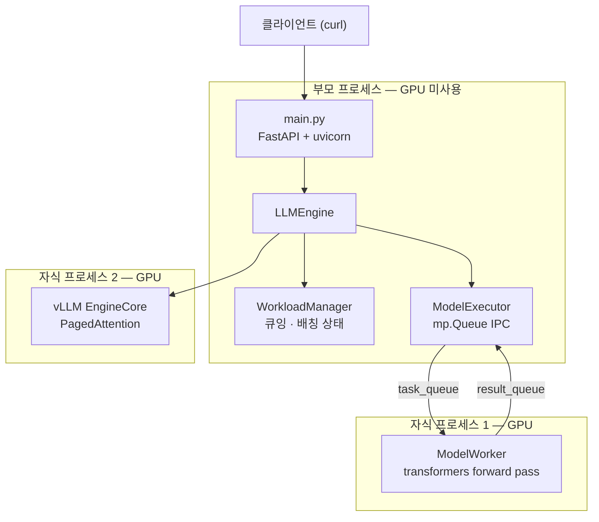
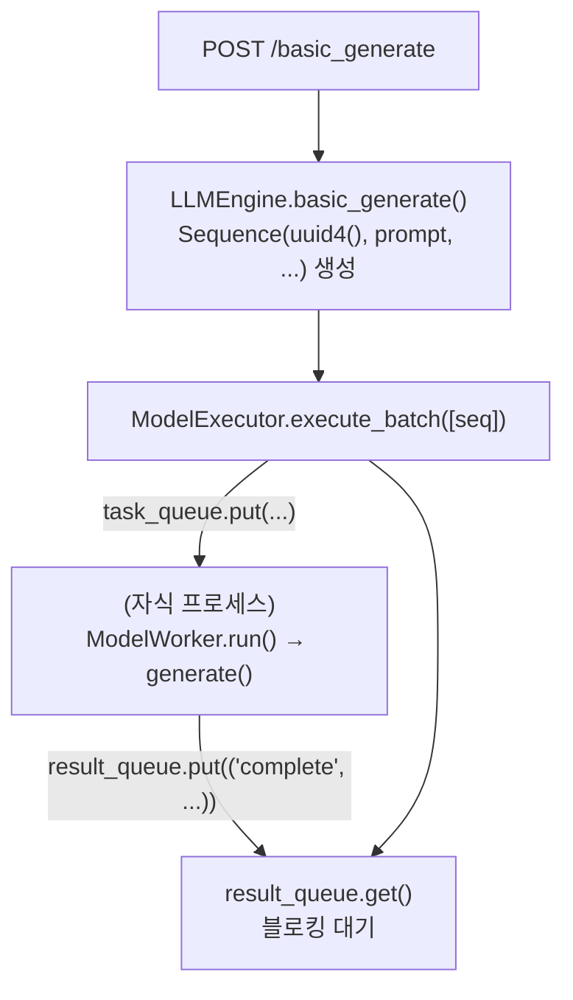

LLM 서빙은 보통 vLLM이나 TGI 같은 프레임워크를 가져다 쓴다. 하지만 그 안에서 무슨 일이 벌어지는지는 직접 만들어봐야 감이 온다. 이번 실습은 **배칭 · 스트리밍 · 프로세스 격리**를 손으로 구현한 서버를 띄우고, 로그를 읽어 동작을 확인하는 과정이다.

대상 코드는 책 *Hands-On LLM Serving and Optimization*의 공식 저장소 [orca3/llm-model-inference](https://github.com/orca3/llm-model-inference) 중 `ch03/single_model_llm_serving`이다. 모델은 **facebook/opt-125m**을 쓴다. 작아서 6GB GPU에서도 충분히 돌아간다.

이 글의 모든 로그와 명령 결과는 **RTX 3050 6GB 리눅스 머신에서 실제로 실행한 것**이다.

## 1. 실습 환경

원본 코드는 **CPU 실행을 전제**로 작성되어 있다. GPU에서 돌리려면 뒤에 나올 패치 두 건이 반드시 필요하다.

| 항목 | 요구사항 |
| --- | --- |
| OS | Linux x86_64 (vLLM 0.9.0.1 휠이 manylinux x86_64만 제공) |
| Python | 3.9 ~ 3.12 (3.13은 vLLM 설치 불가) |
| GPU | NVIDIA, Compute Capability 7.0 이상 |
| VRAM | 6GB부터 가능 |
| 드라이버 | CUDA 12.6+ 지원 |
| 디스크 | 약 15GB |

실습에 쓴 RTX 3050은 Compute Capability 8.6(Ampere)이라 요구사항을 만족한다. 다만 6GB는 여유가 거의 없어서 패치가 없으면 서버가 아예 뜨지 않는다.

시작 전에 유휴 VRAM부터 확인한다. 디스플레이가 연결된 데스크톱이면 이미 200~600MB를 쓰고 있어 그만큼 예산이 줄어든다.

```bash
uname -m && python3 -V
nvidia-smi --query-gpu=name,compute_cap,memory.total,memory.free --format=csv
```

## 2. 서버 구조 한눈에 보기

이 서버의 핵심은 **프로세스가 세 개로 나뉘어 있다**는 점이다. API를 받는 부모 프로세스는 GPU를 전혀 쓰지 않고, 실제 연산은 자식 프로세스 둘이 담당한다.



토크나이징이나 전후처리 같은 CPU 작업이 GPU 프로세스를 붙잡지 않도록 격리한 구조이다. 덤으로 모델 프로세스가 죽어도 API 프로세스는 살아남는다.

파일별 역할은 다음과 같다.

| 파일 | 역할 |
| --- | --- |
| `main.py` | FastAPI — 엔드포인트 4개 |
| `llm/llm.py` | `LLMEngine` — 오케스트레이터 + vLLM 통합 |
| `llm/workload_manager.py` | `Sequence` 정의, 큐잉/배칭 (`batch_size=4`) |
| `llm/model_executor.py` | `mp.Process` + task/result Queue (IPC) |
| `llm/model_worker.py` | 별도 프로세스에서 실제 forward pass |
| `llm/model_manager.py` | HF 모델·토크나이저 로드 |

같은 모델이 두 벌 로드되는 것은 의도된 설계다. **수동 구현 경로와 vLLM 경로를 나란히 비교**하기 위해서다.

## 3. 설치

저장소를 클론하고 가상환경을 만든다.

```bash
git clone https://github.com/orca3/llm-model-inference.git
cd llm-model-inference/ch03/single_model_llm_serving

python3.12 -m venv venv
source venv/bin/activate
pip install -U pip
pip install -r requirements.txt      # 10~20분 소요 (vllm 휠 359MB)
```

설치가 끝나면 CUDA 인식 여부부터 확인한다. 여기서 `False`가 나오면 드라이버 문제이므로 더 진행할 이유가 없다.

```bash
python -c "import torch, vllm; print(torch.__version__, torch.cuda.is_available()); print(vllm.__version__)"
# 기대: 2.7.0 True / 0.9.0.1
```

## 4. GPU 패치 두 가지

원본 코드를 그대로 돌리면 GPU 머신에서 실패한다. 두 가지를 고쳐야 한다.

### 패치 A — 모델을 GPU로 올리기

`llm/model_worker.py`는 `self.device`를 계산하고 **입력 텐서만** `.to(self.device)`로 옮긴다. 모델 가중치를 GPU로 옮기는 코드가 어디에도 없다.

CPU 머신에서는 `device="cpu"`라 우연히 동작하지만, GPU 머신에서는 모델(CPU)과 입력(CUDA)이 어긋나 첫 요청에서 터진다.

```terminal {title="error"}
RuntimeError: Expected all tensors to be on the same device,
but found at least two devices, cuda:0 and cpu!
```

`__init__`에 두 줄을 추가한다.

```python
    def __init__(self, model_name: str):
        self.device = "cuda" if torch.cuda.is_available() else "cpu"
        logger.debug(f"Loading model {model_name} on device {self.device}")
        self.model, self.tokenizer = ModelManager().load_model(model_name)
        self.model.to(self.device)      # 추가 — 가중치를 GPU로
        self.model.eval()               # 추가 — dropout 비활성
        self.stream_states = {}
```

### 패치 B — vLLM의 GPU 메모리 선점량 제한

vLLM은 기본값 `gpu_memory_utilization=0.9`로 **VRAM의 90%를 KV 캐시용으로 미리 통째로 예약**한다. opt-125m 가중치가 0.24GiB밖에 안 되는데도 그렇다.

6GB × 0.9 = 5.4GB를 요구하는데, 같은 GPU에 transformers 워커가 이미 올라가 있어 실제 가용은 5.2GB뿐이다. 그래서 초기화 단계에서 죽는다.

```terminal {title="error"}
ValueError: Free memory on device (5.2/6.0 GiB) on startup is less than
desired GPU memory utilization (0.9, 5.4 GiB).
```

`llm/llm.py`의 vLLM 초기화에 인자 네 개를 넣는다.

```python
        self.vllm_model = VLLM(
            model="facebook/opt-125m",
            gpu_memory_utilization=0.50,   # 6GB 기준: vLLM에 약 3.0GB만 할당
            max_model_len=512,             # opt-125m 최대 2048, 실습엔 512로 충분
            max_num_seqs=16,               # 동시 시퀀스 상한을 낮춰 피크 메모리 감소
            enforce_eager=True,            # CUDA graph 캡처 생략 → 기동 단축
        )
```

VRAM별 권장값은 다음과 같다.

| VRAM | 권장값 | vLLM이 잡는 양 |
| --- | --- | --- |
| 6GB (RTX 3050) | `0.50` | 약 3.0GB |
| 8GB | `0.45` | 약 3.6GB |
| 12GB | `0.40` | 약 4.8GB |
| 16GB 이상 | `0.35` | 약 5.6GB |

**0.50으로 충분한 이유**는 계산해보면 나온다. opt-125m의 KV 캐시는 토큰당 약 36KB이다(12 layer × 768 hidden × 2(K,V) × 2byte). 3.0GB에서 가중치와 CUDA 컨텍스트를 빼고 남는 2GB만으로도 5만 토큰 이상을 담는다.

반대로 너무 낮추면 `No available memory for the cache blocks` 에러가 난다. 그때는 0.05씩 올린다.

## 5. 서버 기동

로그 읽기가 실습의 절반이므로 파일로 남긴다.

```bash
python main.py 2>&1 | tee server_run.log
```

실제 기동 로그에서 확인해야 할 지점만 추리면 다음과 같다.

```terminal {title="server_run.log"}
INFO 08-10 00:38:29 [__init__.py:243] Automatically detected platform cuda.
2026-08-10 00:38:30,604 - llm.model_executor - DEBUG - ModelExecutor initialized with queues
2026-08-10 00:38:30,610 - llm.model_executor - DEBUG - Worker process started
2026-08-10 00:38:30,627 - llm.model_worker - DEBUG - Loading model facebook/opt-125m on device cuda
2026-08-10 00:38:32,964 - llm.model_worker - DEBUG - Worker initialized
INFO 08-10 00:38:38 [cuda.py:217] Using Flash Attention backend on V1 engine.
INFO 08-10 00:38:39 [gpu_model_runner.py:1549] Model loading took 0.2389 GiB and 0.748333 seconds
INFO 08-10 00:38:40 [kv_cache_utils.py:637] GPU KV cache size: 45,968 tokens
INFO 08-10 00:38:40 [kv_cache_utils.py:640] Maximum concurrency for 512 tokens per request: 89.78x
INFO 08-10 00:38:40 [core.py:167] init engine (profile, create kv cache, warmup model) took 0.47 seconds
INFO:     Uvicorn running on http://0.0.0.0:8000 (Press CTRL+C to quit)
```

`on device cuda`가 찍혔으면 패치 A가 반영된 것이다. **KV 캐시 45,968 토큰**은 앞서 계산한 예상치와 맞아떨어진다. 512 토큰짜리 요청 기준으로 동시 처리 여력이 89.78배라는 뜻이므로, 실습에는 넉넉하다.

### 프로세스 세 개 확인

별도 터미널에서 프로세스 트리를 본다.

```bash
ps auxf | grep -v grep | grep "python main.py"
```

```terminal {title="ps auxf"}
hyeonjae   53166 21.8  3.1 5453012 1014368 pts/3 Sl+  00:38   0:06   \_ python main.py
hyeonjae   53185 12.3  3.2 11556508 1049148 pts/3 Sl+ 00:38   0:02   |   \_ python main.py
hyeonjae   53301  8.8  4.8 15113648 1590944 pts/3 Sl+ 00:38   0:01   |   \_ python main.py
```

부모(53166) 아래 자식 둘이 붙어 있다. 53185가 `ModelWorker`, 53301이 vLLM `EngineCore`이다. vLLM v1은 tensor parallel이 1이어도 실행을 별도 프로세스로 분리한다.

### GPU 점유 확인

```bash
watch -n 1 nvidia-smi --query-gpu=memory.used,memory.free --format=csv
```

```terminal {title="nvidia-smi"}
memory.used [MiB], memory.free [MiB]
2809 MiB, 2981 MiB
```

6GB 중 **2.8GB만 쓰고 2.9GB가 남았다**. 4GB 안쪽이면 안전선이므로 여유 있게 통과한다. 여기서 `nvidia-smi`에 부모 PID가 잡히지 않는 것이 정상이며, 이 장의 핵심 관찰 포인트이다.

포트도 부모 프로세스가 잡고 있다.

```bash
ss -tnlp | grep 8000
```

```terminal {title="ss -tnlp"}
LISTEN 0  2048  0.0.0.0:8000  0.0.0.0:*  users:(("python",pid=53166,fd=47))
```

## 6. 실습 1 — 단일 요청 `/basic_generate`

가장 단순한 경로부터 확인한다. 프롬프트 하나를 보내면 forward pass 한 번이 돈다.

```bash
curl -s -X POST http://localhost:8000/basic_generate \
  -H "Content-Type: application/json" \
  -d '{"prompt": "Hello, I am"}' | jq
```

실제 로그이다.

```terminal {title="server_run.log"}
20:41:17,050 - llm.model_executor - DEBUG - Sending batch to worker: [<Sequence object at 0x7852dc8977d0>]
20:41:17,050 - llm.model_executor - DEBUG - Waiting for results from worker
20:41:17,054 - llm.model_worker  - DEBUG - Batch input shape: torch.Size([1, 6])
20:41:17,460 - llm.model_worker  - DEBUG - Generated texts: ['Hello, I am fine with this. I am not a fan of the idea of a "new" version of the game. ...']
20:41:17,461 - llm.model_executor - DEBUG - Received results from worker: ('complete', [{'request_id': '39e8707c-6b36-41e4-8aa7-4dd5d0d05e72', 'generated_text': '...'}])
INFO:     127.0.0.1:46748 - "POST /basic_generate HTTP/1.1" 200 OK
```

`torch.Size([1, 6])`은 **시퀀스 1개 × 6토큰**이다. 요청 하나에 GPU 연산 한 번이 대응한다.

요청 흐름은 다음과 같다. `result_queue.get()`이 **블로킹**이라는 점이 중요하다.



**관찰 포인트**: 프롬프트 하나당 forward 한 번이므로 GPU가 대부분 놀고 있다. 여러 사용자가 몰리면 순차 처리된다. 배칭이 필요한 이유가 여기서 나온다.

## 7. 실습 2 — 배칭 `/generate`

프롬프트 **5개**를 한 번에 보낸다. `WorkloadManager`의 `batch_size`가 4이므로 배치가 두 번으로 나뉘어야 한다.

```bash
curl -s -X POST http://localhost:8000/generate \
  -H "Content-Type: application/json" \
  -d '{
    "prompts": [
      "Hello, I am",
      "The weather is",
      "I want to",
      "The best way to",
      "The most efficient way to"
    ]
  }' | jq
```

실제 로그를 시간 순으로 보면 예상대로 두 배치로 쪼개진다.

```terminal {title="server_run.log"}
20:43:23,235 - Sending batch to worker: [<Sequence>, <Sequence>, <Sequence>, <Sequence>]
20:43:23,428 - Batch input shape: torch.Size([4, 5])
20:43:23,737 - Generated texts: ['Hello, I am a student at the University of California, Berkeley. ...',
                                 'The weather is, of course, a factor in the weather. ...',
                                 'I want toand I want to be a part of this. ...',
                                 'The best way to get a job is to get a job. ...']
20:43:23,738 - Sending batch to worker: [<Sequence>]
20:43:23,738 - Batch input shape: torch.Size([1, 6])
20:43:23,996 - Generated texts: ['The most efficient way to get a job is to get a job. ...']
```

읽어야 할 세 가지가 있다.

**첫째, `torch.Size([4, 5])`**. 시퀀스 4개가 배치 내 최장 프롬프트 기준 5토큰으로 패딩되어 **하나의 GPU forward pass에 섞여 들어갔다**. 서로 다른 사용자의 요청이 한 번의 연산에 합쳐진 것이다.

**둘째, `request_id`**. 결과에 `request_id`가 딸려 나오므로 배치로 섞여도 어느 프롬프트의 결과인지 잃지 않는다. `Sequence` ID가 **웹 요청 순서와 GPU 실행 순서를 분리**하는 역할을 한다.

**셋째, 두 번째 배치가 `[1, 6]`이라는 점**. 첫 배치가 **전부 끝나고** `active_sequences`가 비워진 뒤에야 5번째 프롬프트가 들어간다. 이것이 **정적 배칭(static batching)**이며, vLLM의 continuous batching과 대비되는 지점이다.

시간을 보면 첫 배치 4개가 309ms, 두 번째 1개가 258ms 걸렸다. **4개를 처리하는 비용이 1개와 크게 다르지 않다**는 것이 배칭의 이득이다.

### 추가 실험 — 배치 크기를 2로

`workload_manager.py`의 `self.batch_size`를 `2`로 바꾸고 서버를 재기동한 뒤 같은 요청을 보냈다.

```terminal {title="server_run.log  (batch_size=2)"}
20:48:43,589 - Batch input shape: torch.Size([2, 5])
20:48:43,880 - Batch input shape: torch.Size([2, 5])
20:48:44,172 - Batch input shape: torch.Size([1, 6])
```

예상대로 배치가 세 번으로 쪼개졌다. 두 번째 차원이 `[2,5] → [2,5] → [1,6]`인 것은 패딩 결과다. 앞의 프롬프트 4개는 모두 5토큰이고, 마지막 "The most efficient way to"만 6토큰이라 혼자 남았다.

전체 처리 시간은 약 1.04초로, `batch_size=4`일 때(약 0.76초)보다 느려졌다. **배치를 작게 잡으면 GPU 호출 횟수가 늘어난다**는 것이 숫자로 확인된다.

읽어볼 코드는 다음과 같다.

| 파일 | 무엇 |
| --- | --- |
| `workload_manager.py` `Sequence` | id, prompt, output, finished, token_count, client_stream |
| `workload_manager.py` `add_request()` | uuid 발급 → `incoming_queue` + `sequence_map` 등록 |
| `workload_manager.py` `get_next_batch()` | **FIFO + 고정 4**. 빈 자리가 나야 다음 프롬프트 진입 |
| `llm.py` `generate()` | 등록 → 배치 실행 루프 → `request_id`로 결과 매핑 |

**트레이드오프**도 같이 보인다. `get_next_batch()`가 주는 배치는 "내가 보낸 프롬프트"가 아니라 큐에 쌓인 아무 프롬프트 4개다. 자원 공유는 이득이지만 요청별 지연은 들쭉날쭉해진다.

## 8. 실습 3 — 스트리밍 + 배칭 `/generate_stream`

배칭과 스트리밍은 언뜻 반대 개념처럼 보인다. 안에서는 여러 요청을 묶고, 밖으로는 요청마다 토큰을 따로 내보내야 하기 때문이다.

### 단일 스트리밍

```bash
curl -N -X POST http://localhost:8000/generate_stream \
  -H "Content-Type: application/json" \
  -d '{"prompt": "Hello, I am"}' --no-buffer
```

SSE 형식으로 토큰이 하나씩 흘러나온다.

```terminal {title="curl — SSE 응답"}
data: {"token": " new", "sequence_id": "25d52090-5263-4fed-a7c4-6e4ec6e7f1a6"}

data: {"token": " to", "sequence_id": "25d52090-5263-4fed-a7c4-6e4ec6e7f1a6"}

data: {"token": " this", "sequence_id": "25d52090-5263-4fed-a7c4-6e4ec6e7f1a6"}

data: {"token": " subreddit", "sequence_id": "25d52090-5263-4fed-a7c4-6e4ec6e7f1a6"}

data: {"token": " and", "sequence_id": "25d52090-5263-4fed-a7c4-6e4ec6e7f1a6"}
```

`-N`이나 `--no-buffer`가 없으면 curl이 버퍼링해서 한꺼번에 보인다. 토큰만 뽑아 보려면 파이프 전체에 버퍼링 해제 옵션을 걸어야 한다.

```bash
curl -N -s -H "Accept: text/event-stream" -H "Content-Type: application/json" \
     -d '{"prompt": "The weather is"}' \
     http://localhost:8000/generate_stream \
  | grep --line-buffered '^data: ' \
  | sed -u 's/^data: //' \
  | jq -r --unbuffered '.token'
```

`--line-buffered` / `-u` / `--unbuffered` 3종 세트가 핵심이다. 파이프로 연결되면 각 도구가 기본적으로 4KB 블록 버퍼링을 하므로, 이 옵션들이 없으면 스트리밍인데도 토큰이 한꺼번에 쏟아진다.

### 동시 스트리밍 두 건 — 이 실습의 핵심

두 요청을 동시에 보내고, 로그에서 배치 크기를 추적한다.

```bash
curl -N -s -X POST http://localhost:8000/generate_stream \
  -H "Content-Type: application/json" -d '{"prompt": "The weather is"}' > /tmp/s1.txt &
curl -N -s -X POST http://localhost:8000/generate_stream \
  -H "Content-Type: application/json" -d '{"prompt": "I want to"}' > /tmp/s2.txt &
wait
```

실제 로그이다.

```terminal {title="server_run.log"}
20:52:59,059 - Batch input shape: torch.Size([2, 4])
20:52:59,066 - Batch input shape: torch.Size([2, 5])
20:52:59,073 - Batch input shape: torch.Size([2, 6])
20:52:59,080 - Batch input shape: torch.Size([2, 7])
        ... (매 스텝 약 7ms 간격) ...
20:52:59,206 - Batch input shape: torch.Size([2, 24])
20:52:59,214 - Batch input shape: torch.Size([2, 25])
```

**`torch.Size([1, ...])`가 한 번도 안 나온다.** 두 요청이 끝까지 같은 배치 슬롯에서 나란히 처리됐다는 뜻이다. 스물두 스텝 동안 배치 크기 2가 유지됐다.

두 번째 차원이 매 스텝 1씩 커지는 이유는 `update_sequence_output()`이 `sequence.prompt += token`으로 프롬프트를 계속 늘리기 때문이다. 뒤에서 다시 다룬다.

토큰 생성 로그를 보면 매 스텝 **두 줄씩** 찍힌다.

```terminal {title="server_run.log"}
20:52:59,197 - Generated token for prompt 'The weather is cooling down. Hi! ...'
20:52:59,197 - Generated token for prompt 'I want to play with you guys. ... a whole lot easier': ' than'
20:52:59,205 - Generated token for prompt 'The weather is cooling down. Hi! ...'
20:52:59,205 - Generated token for prompt 'I want to play with you guys. ... a whole lot easier than': ' any'
```

타임스탬프가 밀리초 단위까지 같다. 모델을 두 번 호출한 것이 아니라 **한 번의 배치 forward에서 두 시퀀스의 다음 토큰을 동시에 뽑은 것**이다.

그렇다면 뽑힌 토큰은 어떻게 각자의 클라이언트로 돌아갈까. `sequence_id`로 라우팅된다.

```terminal {title="server_run.log"}
Received data in queue for sequence 359e715a-...: {"token": " than",   "sequence_id": "359e715a-..."}
Received data in queue for sequence 8ee10313-...: {"token": " than",   "sequence_id": "8ee10313-..."}
Received data in queue for sequence 359e715a-...: {"token": " the",    "sequence_id": "359e715a-..."}
Received data in queue for sequence 8ee10313-...: {"token": " any",    "sequence_id": "8ee10313-..."}
Received data in queue for sequence 359e715a-...: {"token": " summer", "sequence_id": "359e715a-..."}
Received data in queue for sequence 8ee10313-...: {"token": " of",     "sequence_id": "8ee10313-..."}
```

각 토큰이 자기 `client_stream` 큐로만 갔으므로 두 문장이 섞이지 않고 각각 온전하게 재구성된다.

구조를 정리하면 이렇다. 백그라운드 데몬 스레드가 GPU 배치를 계속 돌리고, API 코루틴이 사용자 연결을 잡고, **`asyncio.Queue`가 둘 사이를 연결**한다. 스레드에서 이벤트 루프로 넘어가는 지점은 `asyncio.run_coroutine_threadsafe()`이다.

| 파일 | 무엇 |
| --- | --- |
| `llm.py` `requests_processing_loop()` | 백그라운드 데몬 스레드 — 배치 스텝을 계속 돌림 |
| `llm.py` `event_generator()` | 요청마다 `asyncio.Queue` 생성 → `await queue.get()` |
| `llm.py` 완료 처리 | `queue.put(None)` → 스트림 종료 신호 |
| `llm.py` 스레드 경계 | `asyncio.run_coroutine_threadsafe()` |
| `main.py` | `StreamingResponse(media_type="text/event-stream")` = SSE |

안에서는 배치, 밖으로는 요청별 토큰 스트림이다. **배칭과 스트리밍은 반대 개념이 아니다.**

### 주의 — `/generate`와 `/generate_stream`을 동시에 쓰지 말 것

`ModelExecutor`는 `task_queue`/`result_queue` **한 쌍과 워커 프로세스 1개만** 띄운다. 배치 경로와 스트리밍 경로가 같은 큐를 공유하므로, 동시에 쓰면 결과가 교차해서 `Unexpected result type from worker`나 `KeyError: 'generated_text'`가 난다.

버그라기보다 **단일 모델 서버에서 실제로 겪는 리소스 경합을 그대로 재현한 것**이다. 실습은 하나씩 진행한다.

## 9. 실습 4 — vLLM `/generate_vllm`

이제 같은 서버 안에 있는 vLLM 경로를 쓴다. 수동 구현이 300줄인 데 반해 vLLM 통합 코드는 20줄 남짓이다.

```bash
curl -s -X POST http://localhost:8000/generate_vllm \
  -H "Content-Type: application/json" \
  -d '{"prompts": ["Hello, I am", "The weather is", "Once upon a time"]}' | jq
```

```terminal {title="server_run.log"}
Adding requests: 100%|██████████| 3/3 [00:00<00:00, 4101.34it/s]
Processed prompts: 100%|██████████| 3/3 [00:00<00:00, 27.90it/s, est. speed input: 130.37 toks/s, output: 558.68 toks/s]
INFO:     127.0.0.1:48036 - "POST /generate_vllm HTTP/1.1" 200 OK
```

프롬프트 3개가 **한 배치로** 처리됐다. 출력 558 toks/s가 나온다.

경계 조건도 확인했다. 빈 리스트는 그대로 200으로 통과하고, 필드명이 틀리면 Pydantic이 422로 막는다.

```bash
curl -s -X POST http://localhost:8000/generate_vllm \
  -H "Content-Type: application/json" -d '{"prompts": []}'
curl -s -X POST http://localhost:8000/generate_vllm \
  -H "Content-Type: application/json" -d '{"invalid_field": ["Hello"]}'
```

```terminal {title="server_run.log"}
Adding requests: 0it [00:00, ?it/s]
INFO:     127.0.0.1:52662 - "POST /generate_vllm HTTP/1.1" 200 OK
INFO:     127.0.0.1:59452 - "POST /generate_vllm HTTP/1.1" 422 Unprocessable Entity
```

### 동시 요청 — 역설적인 결과

여기서부터가 이 장에서 가장 흥미로운 부분이다. 요청 두 건을 동시에 보낸다.

```bash
time ( curl -s -X POST http://localhost:8000/generate_vllm -H "Content-Type: application/json" \
        -d '{"prompts":["Hello, I am"]}' > /dev/null &
       curl -s -X POST http://localhost:8000/generate_vllm -H "Content-Type: application/json" \
        -d '{"prompts":["The weather is"]}' > /dev/null &
       wait )
```

```terminal {title="server_run.log"}
Adding requests: 100%|██████████| 1/1 [00:00<00:00, 3010.99it/s]
Processed prompts: 100%|██████████| 1/1 [00:00<00:00,  3.58it/s, est. speed input: 17.89 toks/s, output: 71.56 toks/s]
INFO:     127.0.0.1:49850 - "POST /generate_vllm HTTP/1.1" 200 OK
Adding requests: 100%|██████████| 1/1 [00:00<00:00, 3463.50it/s]
Processed prompts: 100%|██████████| 1/1 [00:00<00:00, 11.69it/s, est. speed input: 46.79 toks/s, output: 233.93 toks/s]
INFO:     127.0.0.1:49848 - "POST /generate_vllm HTTP/1.1" 200 OK
```

`Processed prompts: 1/1`이 **두 번 따로** 찍혔다. 한 배치로 합쳐지지 않았다. 출력 속도도 71 toks/s와 233 toks/s로, 앞서 3개를 한 번에 보냈을 때의 558 toks/s에 한참 못 미친다.

**원인은 통합 방식에 있다.** 핸들러는 `async def`인데, 그 안에서 **동기** 함수인 `vllm.LLM.generate()`를 `await` 없이 호출한다. uvicorn의 단일 이벤트 루프가 그동안 통째로 블로킹되므로 두 요청이 순차 처리된다.

> **이 장 최고의 교훈이다.** 배칭하려고 붙인 프레임워크가 통합 방식 때문에 배칭을 못 한다. 해결하려면 `vllm.AsyncLLMEngine`을 써야 한다. "프레임워크를 쓴다"와 "프레임워크의 이점을 얻는다"는 다른 문제이다.

## 10. 수동 구현 vs vLLM

|  | 수동 구현 | vLLM |
| --- | --- | --- |
| 배치 구성 | `get_next_batch()` FIFO + 고정 4, 배치가 다 끝나야 다음 진입 | 내부 스케줄러, **continuous batching** |
| 토큰 생성 | `use_cache=False`로 매 토큰 전체 프롬프트 재계산 → **O(n²)** | PagedAttention + KV 캐시 |
| 결과 매핑 | `sequence_map` / `request_id` 수동 추적 | 입력 순서 그대로 반환 |
| 스트리밍 | `asyncio.Queue` + 백그라운드 스레드 직접 구현 | 내부 처리 (별도 API 필요) |
| 코드량 | 약 300줄 | 약 20줄 |

### O(n²)를 로그로 확인하기

앞서 스트리밍 로그에서 배치 shape이 `[2, 4]`에서 `[2, 25]`까지 커지는 것을 봤다. 이것이 O(n²)의 증거다.

`model_worker.py`가 `use_cache=False`로 호출하고, `workload_manager.py`가 `sequence.prompt += token`으로 프롬프트를 늘린다. 즉 **매 스텝마다 프롬프트 전체를 처음부터 다시 계산한다**. 토큰을 하나 뽑을 때마다 입력이 길어지므로 총 비용이 제곱으로 늘어난다.

흥미로운 것은 `model_worker.py`에 `self.stream_states = {}`가 **선언만 되고 전혀 쓰이지 않는다**는 점이다. `request_id -> past_key_values`를 담아 증분 디코딩으로 확장할 자리를 남겨두고 데모에서는 구현하지 않았다. "제대로 만들면 왜 KV 캐시가 필요한가"를 체감시키는 의도적인 반면교사다.

### 엔드포인트 요약

| 엔드포인트 | 요청 | 실행 경로 | 배칭/캐싱 |
| --- | --- | --- | --- |
| `POST /basic_generate` | `{"prompt": str}` | `ModelExecutor` → HF `model.generate()` (1개) | HF 내부 KV 캐시 |
| `POST /generate` | `{"prompts": [str]}` | `WorkloadManager` 큐 → 최대 4개 배치 | HF 내부 KV 캐시 / 정적 배칭 |
| `POST /generate_stream` | `{"prompt": str}` → SSE | 백그라운드 스레드 → 토큰 1개씩 forward | **캐시 없음** (의도적) |
| `POST /generate_vllm` | `{"prompts": [str]}` | `vllm.LLM` 직접 호출 | PagedAttention + continuous batching |

## 11. 자동화 테스트와 정리

테스트는 자체적으로 앱을 인메모리로 띄우므로 **서버를 먼저 종료**해야 한다. 안 그러면 워커와 vLLM이 각각 두 벌씩 올라가 6GB에서는 확실히 OOM이다.

```bash
# 서버 종료 후
pytest tests/test_api.py -v      # basic / batch / streaming
pytest tests/test_vllm.py -v     # vLLM 경로 4건
```

`pytest.ini`가 `asyncio_mode = auto`와 `pythonpath`를 설정하므로 반드시 `single_model_llm_serving/` 디렉터리에서 실행한다.

실습이 끝나면 잔여 프로세스와 GPU 메모리 반환을 확인한다.

```bash
ps aux | grep -E "main.py|EngineCore" | grep -v grep
nvidia-smi                      # GPU 메모리 반환 확인
pkill -f "python main.py"       # 남아 있으면
deactivate
```

## 12. 자주 만나는 에러

| 증상 | 원인 | 조치 |
| --- | --- | --- |
| `Expected all tensors to be on the same device` | 패치 A 미적용 | `self.model.to(self.device)` 추가 |
| `Free memory on device ... less than desired GPU memory utilization` | 패치 B 미적용 | `gpu_memory_utilization=0.50` |
| `torch.OutOfMemoryError` | vLLM 예약분 + 워커가 VRAM 초과 | `0.45` → `0.40`으로 단계적으로 낮추기 |
| 기동할 때마다 OOM 여부가 들쭉날쭉 | 워커 로딩과 vLLM 메모리 측정의 순서 경쟁 | `0.40`까지 낮추기 |
| `No available memory for the cache blocks` | `gpu_memory_utilization`이 너무 낮음 | 0.05씩 올리기 |
| `No matching distribution found for vllm` | Python 3.13 또는 비 x86_64 | Python 3.12 이하로 venv 재생성 |
| `Unexpected result type from worker` | `/generate`와 `/generate_stream` 동시 실행 | 한 번에 한 경로만 |
| curl에서 토큰이 한꺼번에 나옴 | curl 버퍼링 | `-N --no-buffer` 사용 |
| 자식 프로세스에서 `CUDA re-initialization` | fork 후 CUDA 컨텍스트 충돌 | `mp.set_start_method("spawn", force=True)` |
| `Waiting for debugger to attach...` | 죽은 로그 문구 (debugpy 연결 코드 없음) | 무시 |

## 13. 정리

이번 실습에서 로그로 직접 확인한 것들을 정리하면 다음과 같다.

**프로세스 격리**는 부모가 GPU를 전혀 쓰지 않는 것으로 확인된다. `nvidia-smi`에 자식 PID 둘만 잡히는 것이 정상이다.

**정적 배칭**은 `[4, 5] → [1, 6]`이라는 배치 shape 두 개로 드러난다. 첫 배치가 전부 끝나야 다음이 들어가므로, 긴 요청 하나가 짧은 요청들을 붙잡는다.

**요청 추적**은 `request_id`와 `sequence_id`가 담당한다. 배치로 섞여도 결과가 정확히 제 주인에게 돌아가는 것을 스트리밍 로그에서 확인했다.

**KV 캐시의 필요성**은 배치 shape이 `[2, 4]`에서 `[2, 25]`로 매 스텝 커지는 것으로 체감된다. 캐시 없이 매번 전체를 재계산하면 O(n²)가 된다.

**프레임워크 통합의 함정**은 vLLM 동시 요청이 한 배치로 합쳐지지 않은 결과가 보여준다. 동기 API를 async 핸들러에서 그냥 호출하면 프레임워크의 배칭 능력이 통째로 무력화된다.

다음 편에서는 같은 저장소의 `multi_model_serving` + Triton으로 **모델 캐싱과 라우팅**을 다룬다. 두 랩은 torch 버전이 충돌하므로(2.7.0 ↔ 2.2.1) venv를 반드시 분리해야 한다.
