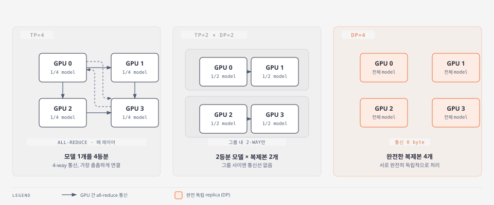
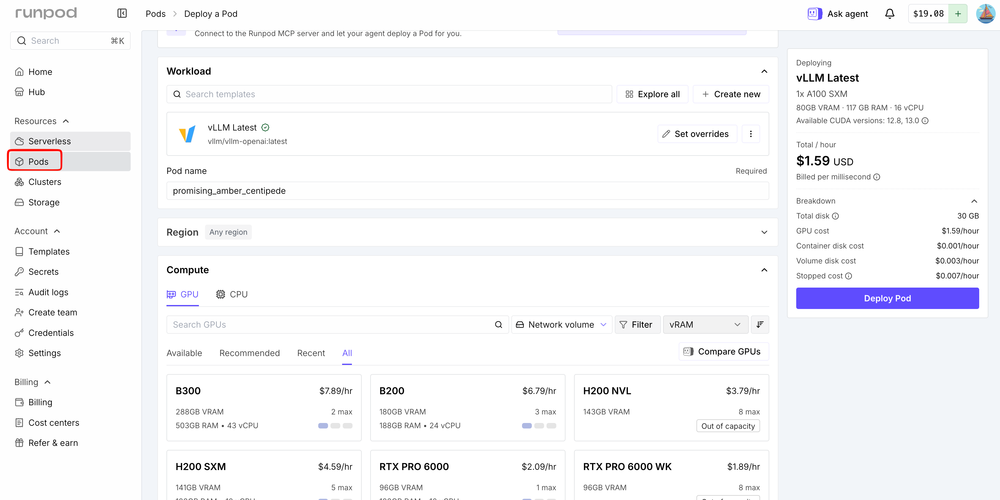
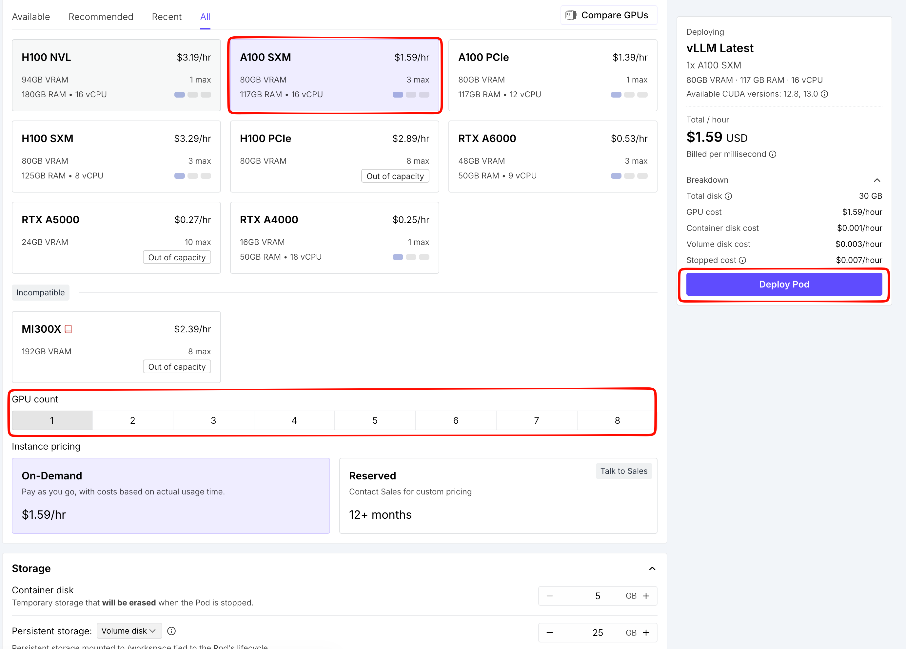
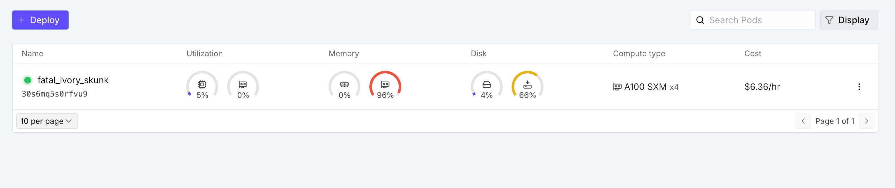
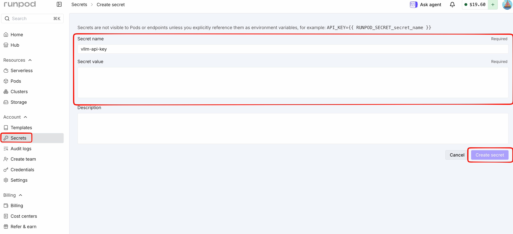
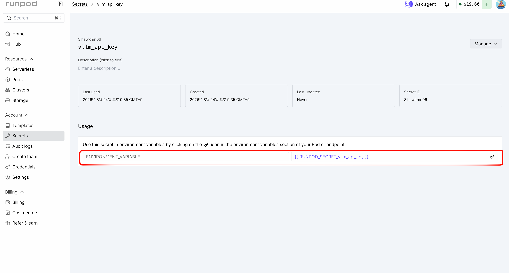
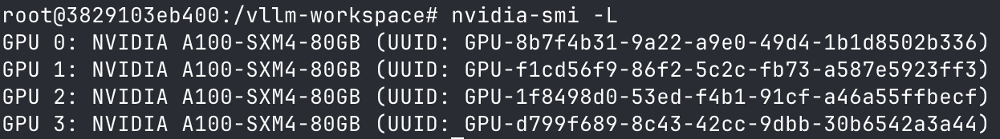
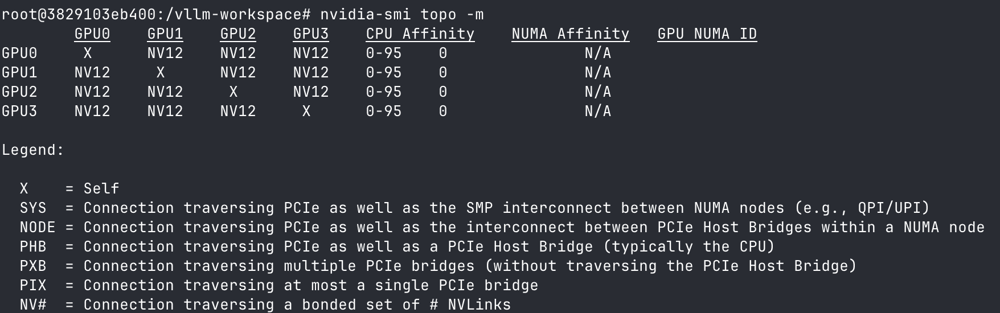
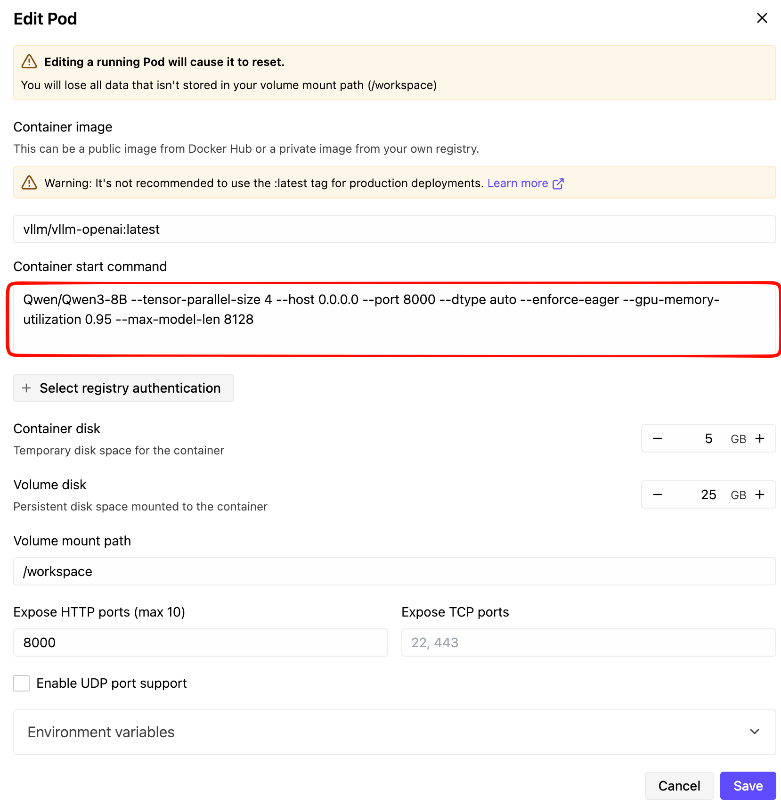
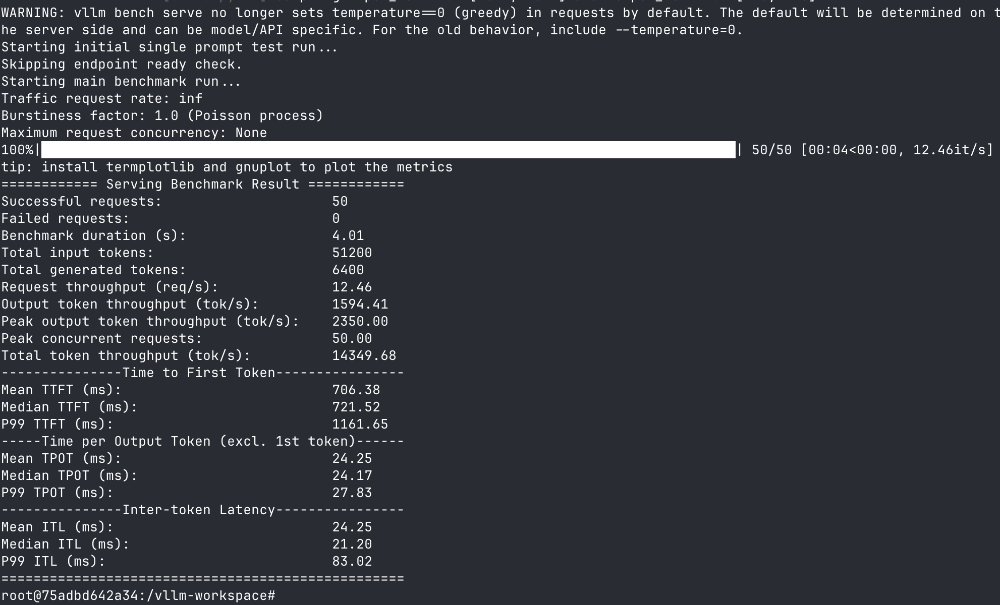

단일 노드에 GPU 4개가 달린 환경(NVLink or PCIe)에서 **TP=4**, **TP=2 × DP=2**, **DP=4** 세 가지 구성으로 vLLM 서빙을 띄우고 속도를 비교하는 실습 순서를 정리한다. 원래는 TP=8까지 포함할 계획이었지만 Runpod 인벤토리 제약으로 현재 4-GPU가 상한이라 같은 4장 안에서 TP와 DP 비중만 조절하는 방식으로 실험을 재구성했다.



TP 비중이 높을수록(왼쪽) GPU끼리 주고받는 통신라인이 많아지고, DP 비중이 높을수록(오른쪽) 통신라인이 줄어들며 완전히 독립된 복제본으로 바뀐다.

### 멀티 GPU 병렬화, 네 가지 방식

멀티 GPU·멀티 노드 추론에서 쓰는 병렬화 방식은 크게 네 가지다.

- **데이터 병렬화(DP)** — 처리량 확장을 위해 GPU와 노드 전반에 모델 인스턴스를 통째로 복제하는 방식이다.
- **텐서 병렬화(TP)** — 대형 모델에 적합하며, 레이어를 쪼개 대규모 행렬 연산을 나눠 맡겨 지연 시간을 줄인다.
- **파이프라인 병렬화(PP)** — 역시 대규모 모델에 적합하며, 여러 GPU와 노드에 걸쳐 레이어를 단계별로 분할하는 방식으로 작동한다.
- **전문가 병렬화(EP)** — Mixture-of-Experts(MoE) 모델의 경우, GPU에 전문가(expert)를 분산시켜 작동한다.

이 실습은 이 중 **DP와 TP만** 다룬다. 단일 노드(GPU 4장)에 다 들어가는 dense 모델(Qwen3-8B)이라 여러 노드로 걸치는 PP는 필요 없고, MoE 구조가 아니라 EP도 해당하지 않는다. 그래서 남는 선택지는 "레이어를 쪼갤 것이냐(TP), 모델을 통째로 복제할 것이냐(DP)냐"뿐이고, 이 매뉴얼은 그 두 축의 비중을 4장짜리 GPU 안에서 바꿔가며 비교한다.

## 1. Runpod Pod 준비

- Template: **vLLM Verified**
- Compute 필터: **GPU Type = A100 SXM**(PCIe 아님 NVLink 확보), **GPU Count = 4**
- Storage: 모델 크기 고려해 컨테이너 디스크 여유 있게(7B~14B급이면 50GB+)

 8장짜리 재고 찾기도 힘들고 가격도 만만치 않아서 4장으로만 실습진행, 아래 3장파트의 명령에서 `--tensor-parallel-size 8` 조합만 추가하면 된다.


- 가입 충전 후 Pods 선택, GPU 선택




&nbsp;

- A100 SXM 과 GPU count를 4장 선택 후 Deploy Pod 클릭




&nbsp;

- 배포된 상태를 확인 할 수 있다. Compute type에서 A100 SXM x4인것을 확인. 코스트 시간당 $6.36/hr...........................




- 시크릿을 설정하자.  Secrets -&gt; Create secret으로 생성하자. 아래 명령어로 랜덤 숫자를 만들어 추가하자.


```
openssl rand -hex 32
```




- 생성된 환경 변수 참조값을 복사하자. 나중에 컨테이너 파드에 환경변수를 주입할 것이다.





## 2. 접속 후 확인

```bash
nvidia-smi -L         # GPU 4개 잡히는지 먼저 확인
nvidia-smi topo -m    # GPU끼리 NV# 표시되면 NVLink 정상, PHB/PXB면 PCIe만 연결된 것
```




- GPU0부터  GPU3까지 NVLinks로 연결된것 확인



## 3. 서빙 실행

Pods에서 배포한 컨테이너의 맨 오른쪽 오버플로우 메뉴를 클릭후 Edit pod를 클릭한다. 


Runpod Edit Pod의 **Container Start Command**에 아래 인자를 그대로 붙여넣는다. vLLM Verified 템플릿은 ENTRYPOINT에 `vllm serve`가 이미 포함돼 있어서, 필드에는 모델 이름부터 시작하는 인자만 적으면 된다.

### 3-1. TP=4

```
Qwen/Qwen3-8B --tensor-parallel-size 4 --host 0.0.0.0 --port 8000 --dtype auto --enforce-eager --gpu-memory-utilization 0.95 --max-model-len 8128
```



### 3-2. TP=2 × DP=2

```
Qwen/Qwen3-8B --tensor-parallel-size 2 --data-parallel-size 2 --host 0.0.0.0 --port 8000 --dtype auto --enforce-eager --gpu-memory-utilization 0.95 --max-model-len 8128
```

### 3-3. DP=4

```
Qwen/Qwen3-8B --tensor-parallel-size 1 --data-parallel-size 4 --host 0.0.0.0 --port 8000 --dtype auto --enforce-eager --gpu-memory-utilization 0.95 --max-model-len 8128
```

편집 후에는 Pod를 재시작(Stop → Start, 또는 Edit 저장 시 자동 재시작)해야 새 커맨드가 적용된다. 모델을 바꿀 경우 **attention head 수가 TP 크기로 나눠떨어지는지** 미리 확인한다. 나눠떨어지지 않으면 "must be divisible" 에러가 뜬다.

## 4. 속도 측정

```bash
vllm bench serve \
  --backend vllm \
  --model Qwen/Qwen3-8B \
  --base-url http://localhost:8000 \
  --num-prompts 50 \
  --request-rate inf \
  --header "Authorization=Bearer $VLLM_API_KEY"
```

세 가지 구성(TP=4, TP=2×DP=2, DP=4) 각각에 대해 **동시성 1**(레이턴시 위주)과 **동시성 높음**(처리량 위주) 두 조건 모두 돌려서 비교한다. 나머지 조건(모델, 프롬프트 셋, `--num-prompts`)은 고정하고 서버 설정만 바꿔야 결과를 공정하게 비교할 수 있다.

**측정 지표**

- **TTFT**(Time To First Token) — prefill 성능 지표
- **TPOT / ITL**(Time Per Output Token / Inter-Token Latency) — decode 성능 지표
- **Throughput** — 초당 요청 수, 초당 생성 토큰 수

**예상되는 대비 포인트**

- **TP=4**: 4-way all-reduce라 통신은 가장 많지만, 모델이 가장 잘게 쪼개져 요청 하나당 TTFT가 가장 짧을 가능성
- **TP=2 × DP=2**: 통신 오버헤드는 절반(2-way all-reduce)으로 줄고, 두 개의 복제본이 요청을 나눠 처리해 처리량이 유리해질 가능성
- **DP=4**: 추론 시 DP는 복제본 간 통신이 전혀 없으므로(0 byte), 개별 요청 레이턴시는 TP=1 그대로지만 동시 처리량은 가장 높을 가능성

"TP 비중을 낮추고 DP 비중을 높일수록 레이턴시는 손해 보고 처리량은 이득 본다"는 트레이드오프 곡선을 4장짜리 GPU만으로도 확인한다.

## 5. 실측 결과

A100 이전에 처음 잡은 Runpod Pod는 4x L40S(PCIe, NVLink 없음)였는데 이 호스트에서 NCCL P2P 핸드셰이크가 멈추는 문제가 있어 `NCCL_P2P_DISABLE=1`을 추가해 우회했다. 이후 두 번째 Pod는 4x A100 SXM으로, `nvidia-smi topo -m` 확인 결과 GPU 전 쌍이 NV12로 연결되어 실제 NVLink가 동작했다. 이 pod에서는 `NCCL_P2P_DISABLE`을 제거하고 재측정하였다.

**명령** 

```bash
vllm bench serve \
  --backend vllm \
  --model Qwen/Qwen3-8B \
  --base-url http://localhost:8000 \
  --num-prompts 50 \
  --request-rate inf \
  --header "Authorization=Bearer $VLLM_API_KEY"
```


성공하면 먼저 아래와 같은 결과를 얻을 수 있다.




### 결과 한눈에 비교

- **결과** (요청 50개, 동시성 최대)


| 지표                           | TP=4 (L40S, PCIe) | TP=4 (A100 SXM, NVLink) | TP=2×DP=2 (A100 SXM, NVLink) | DP=4 (A100 SXM, NVLink) |
| ---------------------------- | ----------------- | ----------------------- | ---------------------------- | ----------------------- |
| Successful / Failed          | 50 / 0            | 50 / 0                  | 50 / 0                       | 50 / 0                  |
| Benchmark duration           | 6.08s             | 4.34s                   | 4.01s                        | 3.24s                   |
| Request throughput           | 8.23 req/s        | 11.53 req/s             | 12.46 req/s                  | 15.41 req/s             |
| Output token throughput      | 1,052.99 tok/s    | 1,475.59 tok/s          | 1,594.41 tok/s               | 1,972.70 tok/s          |
| Peak output token throughput | 2,717.00 tok/s    | 2,250.00 tok/s          | 2,350.00 tok/s               | 2,851.00 tok/s          |
| Total token throughput       | 9,476.87 tok/s    | 13,280.32 tok/s         | 14,349.68 tok/s              | 17,754.27 tok/s         |
| Mean TTFT                    | 2,053.43 ms       | 831.52 ms               | 706.38 ms                    | 605.67 ms               |
| Median TTFT                  | 2,052.03 ms       | 831.12 ms               | 721.52 ms                    | 643.24 ms               |
| P99 TTFT                     | 3,784.41 ms       | 1,485.30 ms             | 1,161.65 ms                  | 945.33 ms               |
| Mean TPOT                    | 30.11 ms          | 25.53 ms                | 24.25 ms                     | 19.59 ms                |
| Mean ITL                     | 30.11 ms          | 25.53 ms                | 24.25 ms                     | 19.59 ms                |
| Median ITL                   | 18.38 ms          | 22.68 ms                | 21.20 ms                     | 17.34 ms                |
| P99 ITL                      | 146.51 ms         | 56.01 ms                | 83.02 ms                     | 126.87 ms               |


(Total input tokens 51,200 / Total generated tokens 6,400은 네 구성 모두 동일 — 같은 프롬프트 셋을 썼기 때문)

### 고찰

**1. NVLink 효과가 뚜렷하다.** 

- 같은 TP=4 구성에서 L40S(PCIe) → A100 SXM(NVLink)로 바꾸자 Mean TTFT가 2,053ms → 832ms로 약 2.5배 줄었고 벤치마크 시간도 6.08s → 4.34s로 단축됐다. TP=4는 레이어마다 4-way all-reduce가 필요한 구성이라, GPU 간 통신 경로가 PCIe 폴백이냐 NVLink냐에 따른 차이가 그대로 드러난다. 다만 L40S와 A100 SXM은 GPU 자체 스펙(연산 성능, 메모리 대역폭)도 다르므로, 이 차이가 순수하게 인터커넥트 때문만은 아니라는 점은 감안해야 한다.


**2. 예상을 뒤집는 TP vs DP 결과**

- 4절에서는 "TP 비중이 높을수록 TTFT가 짧다"고 예상했지만, 같은 A100 SXM(NVLink) 환경에서 TP=2×DP=2가 TP=4보다 TTFT(706ms vs 832ms)와 처리량(12.46 req/s vs 11.53 req/s) 둘 다 앞선다. 요청 50개가 한꺼번에 몰리는 이 부하 조건에서는, 4-way all-reduce 통신량이 절반으로 줄어드는 이득(TP=2)과 두 개의 독립된 엔진이 요청을 나눠 처리하는 이득(DP=2)이 합쳐져, 통신 오버헤드가 더 큰 TP=4의 세밀한 병렬성보다 유리하게 작용한 것으로 보인다.


**3. 이 모델 크기에서는 TP가 통신 오버헤드만 더한다**

- **** A100 SXM 세 구성만 놓고 보면 TP=4 → TP=2×DP=2 → DP=4로 갈수록 모든 지표가 일관되게 개선된다 
-  throughput 11.53 → 12.46 → 15.41 req/s, Mean TTFT 832 → 706 → 606ms, Mean TPOT 25.53 → 24.25 → 19.59ms. Qwen3-8B는 A100 80GB 한 장에 여유 있게 올라가는 크기라, 애초에 TP로 쪼갤 필요(메모리 부족)가 없다. 이런 경우 TP는 all-reduce 통신 오버헤드만 추가하고 실질적 이득은 주지 못하며, 4개의 완전히 독립된 replica가 요청을 나눠 처리하는 DP=4가 가장 효율적이다. **TP는 모델이 GPU 한 장에 안 들어갈 때 쓰는 도구지 이미 한 장에 들어가는 모델을 더 빠르게 서빙하기 위한 도구가 아니라는 걸** 이 실측 결과가 보여준다.


TTFT가 전반적으로 수백 ms~2초대로 나온 건 `--request-rate inf`로 50개 요청이 한 번에 몰려서 prefill 큐가 밀린 영향이 크다 — 개별 요청의 최선 레이턴시가 아니라 최대 부하 상태의 처리량 지표로 봐야 한다.

