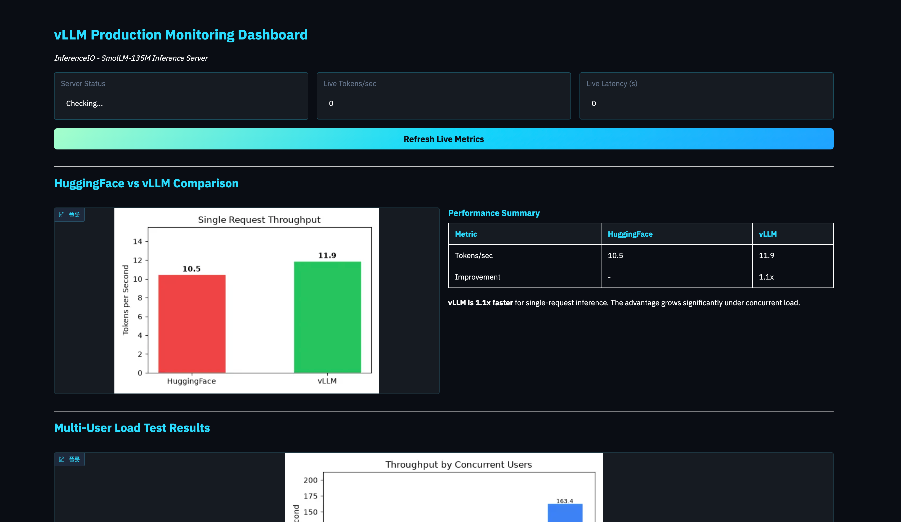

[2주차 실습들](../llm-serving-single-model-lab/)은 서빙 시스템을 **어떻게 구성하는지**를 다뤘다. 이번에는 질문이 안쪽으로 향한다. **vLLM은 정확히 무엇 때문에 빠른가.**

CPU만 있는 4GB VM에서 SmolLM-135M을 8단계로 굴린다. HuggingFace 베이스라인을 재고, vLLM과 비교하고, KV 캐시가 낭비되는 과정을 숫자로 본 뒤 PagedAttention이 그것을 어떻게 되돌리는지 확인한다.

**결론부터 말하면 단일 요청에서 vLLM은 1.1배밖에 빠르지 않다.** 진짜 차이는 동시 사용자가 붙을 때 나온다. 이 글의 8단계는 그 격차가 어디서 오는지를 따라가는 순서다.

## 1. 실습 환경

GPU가 없다. vLLM의 CPU 빌드를 쓰고, 4GB 메모리 제한 때문에 엔진을 in-process로 띄운다.


| 항목 | 값 |
| --- | --- |
| 모델 | **HuggingFaceTB/SmolLM-135M** (135M 파라미터) |
| vLLM | **0.27.1+cpu** (CPU 빌드) |
| torch / transformers | 2.13.0+cpu / 5.15.0 |
| gradio / aiohttp | 5.50.0 / 3.14.3 |
| 실행 환경 | CPU 전용, **메모리 4GB 제한** |
| `max_model_len` | **128** |
| KV 캐시 | **128MB** (`kv_cache_memory_bytes=134217728`) |


제약이 설정을 강제한다. 4GB VM에서 vLLM 기본값인 멀티프로세스 모드는 파이썬 프로세스를 2개 더 띄우고 각각 1GB를 넘게 쓴다. 그래서 in-process로 돌린다.

```python
# CPU 전용 실행 설정.
# VLLM_ENABLE_V1_MULTIPROCESSING=0 으로 엔진을 in-process 로 돌린다.
# 기본 멀티프로세스 모드는 별도 파이썬 프로세스 2개가 각각 1GB 넘게 쓴다.
# VLLM_CPU_KVCACHE_SPACE 는 일부러 비운다 — 설정하면 kv_cache_memory_bytes 를
# 덮어쓰고 GiB 단위 정수만 받는다.
os.environ["VLLM_TARGET_DEVICE"] = "cpu"
os.environ["VLLM_ENABLE_V1_MULTIPROCESSING"] = "0"
os.environ.pop("VLLM_CPU_KVCACHE_SPACE", None)
os.environ["TORCHDYNAMO_DISABLE"] = "1"

# 128MB KV 캐시 — max_model_len=128 기준 SmolLM-135M 시퀀스를 약 43개 담는다
# (토큰당 KV 약 22.5KB). 작게 잡은 이유는 vLLM 기동 검사가 파드의 page cache
# (모델 다운로드분)를 사용 중으로 계산해서, 4GB VM에 몇백 MB만 남은 것으로 보기 때문이다.
KV_CACHE_BYTES = 128 * 1024 * 1024
```

환경 검증부터 통과시킨다.

```termcast {title="root@controlplane: ~/code" prompt="root@controlplane ~/code ➜"}
$ source /root/venv/bin/activate
$ python /root/code/verify_environment.py
=================================================================
vLLM Explained Lab - Environment Verification
=================================================================
[1/5] Checking Python virtual environment...
  PASS - Virtual environment found at /root/venv
[2/5] Checking required packages...
  PASS - torch 2.13.0+cpu
  PASS - transformers 5.15.0
[3/5] Checking vLLM installation...
  PASS - vllm 0.27.1+cpu (CPU build)
[4/5] Checking additional packages...
  PASS - gradio 5.50.0
  PASS - aiohttp 3.14.3
  PASS - requests 2.34.2
[5/5] Downloading SmolLM-135M model...
  Downloading tokenizer for HuggingFaceTB/SmolLM-135M...
config.json: 100%|████████████| 724/724 [00:00<00:00, 5.37MB/s]
vocab.json: 100%|███████████| 801k/801k [00:00<00:00, 91.5MB/s]
tokenizer.json: 100%|██████| 2.10M/2.10M [00:00<00:00, 242MB/s]
  Downloading model for HuggingFaceTB/SmolLM-135M...
model.safetensors: reconstructing file: 100%|█|  538MB /  538MB
Loading weights: 100%|█████| 272/272 [00:00<00:00, 1576.86it/s]
  PASS - Model downloaded in 6.8s
  Model size: 135M parameters
  Running quick test generation...
  Test output: Hello, world!
  PASS - Model generates text successfully
=================================================================
ENVIRONMENT CHECK: 5/5 passed
=================================================================
All checks passed! Your environment is ready.
```

## 2. Task 1 — HuggingFace 베이스라인

비교 기준을 먼저 만든다. `transformers`로 모델을 올리고 50토큰을 생성하며 시간을 잰다.

```python
model = AutoModelForCausalLM.from_pretrained(model_name)
tokenizer = AutoTokenizer.from_pretrained(model_name)
inputs = tokenizer(prompt, return_tensors="pt")

start_time = time.time()
outputs = model.generate(
    **inputs,
    max_new_tokens=50,
    do_sample=True,
    temperature=0.7,
)
end_time = time.time()

generated_tokens = outputs.shape[1] - inputs["input_ids"].shape[1]
tokens_per_second = generated_tokens / (end_time - start_time)
```

```termcast {title="root@controlplane: ~/code" prompt="root@controlplane ~/code ➜"}
$ python /root/code/task_1_hf_baseline.py
=================================================================
Task 1: Naive HuggingFace Inference - The Baseline
=================================================================
Model: HuggingFaceTB/SmolLM-135M
Prompt: "Explain what a large language model is in simple terms."
-----------------------------------------------------------------
Loading model with HuggingFace transformers...
Loading weights: 100%|█████| 272/272 [00:00<00:00, 2441.55it/s]
Model loaded successfully.
Generating with HuggingFace transformers...
--- RESULTS ---
Generated tokens: 50
Total time: 4.77 seconds
Tokens per second: 10.5 tok/s
=================================================================
KEY INSIGHT:
- This is SINGLE-REQUEST performance
- There is no batching - one request at a time
- Under load with multiple users, requests would queue up
=================================================================
```

**10.5 tok/s가 기준선이다.** 여기서 중요한 것은 숫자 자체가 아니라 성격이다. `model.generate()`는 요청 하나를 처음부터 끝까지 처리하고, 그동안 다른 요청은 그냥 기다린다.

## 3. Task 2 — vLLM 오프라인 추론

같은 모델, 같은 프롬프트를 vLLM으로 돌린다. 코드는 오히려 짧아진다.

```python
from vllm import LLM, SamplingParams

# enforce_eager=True 는 torch.compile 을 건너뛰어 CPU에서 메모리를 아낀다
llm = LLM(model=model_name, max_model_len=128, enforce_eager=True,
          kv_cache_memory_bytes=KV_CACHE_BYTES)

sampling_params = SamplingParams(temperature=0.7, max_tokens=50)
outputs = llm.generate([prompt], sampling_params)

generated_tokens = len(outputs[0].outputs[0].token_ids)
tokens_per_second = generated_tokens / total_time
```

```termcast {title="root@controlplane: ~/code" prompt="root@controlplane ~/code ➜" line="35"}
$ python /root/code/task_2_vllm_inference.py
=================================================================
Task 2: vLLM Offline Inference - See the Difference
=================================================================
INFO [importing.py:53] Triton is installed but 0 active driver(s) found (expected 1). Disabling Triton.
Initializing vLLM engine...
INFO [api_utils.py:273] non-default args: {'max_model_len': 128, 'kv_cache_memory_bytes': 134217728, 'enforce_eager': True, 'model': 'HuggingFaceTB/SmolLM-135M'}
INFO [model.py:645] Resolved architecture: LlamaForCausalLM
INFO [model.py:1883] Using max model len 128
INFO [scheduler.py:242] Chunked prefill is enabled with max_num_batched_tokens=4096.
INFO [core.py:121] Initializing a V1 LLM engine (v0.27.1) ... device_config=cpu, enable_prefix_caching=True, enable_chunked_prefill=True ...
INFO [cpu_model_runner.py:131] Starting to load model HuggingFaceTB/SmolLM-135M...
INFO [weight_utils.py:867] Filesystem type for checkpoints: OVERLAY. Checkpoint size: 0.50 GiB. Available RAM: 0.36 GiB.
Loading safetensors checkpoint shards: 100% Completed | 1/1 [00:00<00:00,  3.55it/s]
INFO [default_loader.py:430] Loading weights took 0.31 seconds
INFO [cpu_worker.py:248] Explicitly set (0.12/3.73) GiB for KV cache on node 0.
INFO [kv_cache_utils.py:2235] GPU KV cache size: 5,760 tokens
INFO [kv_cache_utils.py:2236] Maximum concurrency for 128 tokens per request: 45.00x
INFO [core.py:355] init engine (profile, create kv cache, warmup model) took 0.10 s
vLLM engine ready.
Generating with vLLM...
Processed prompts: 100%|█| 1/1 [00:04<00:00,  4.19s/it, est. speed input: 2.63 toks/s
--- vLLM RESULTS ---
Generated tokens: 50
Total time: 4.19 seconds
Tokens per second: 11.9 tok/s
--- COMPARISON: HuggingFace vs vLLM ---
Metric                HuggingFace         vLLM
----------------------------------------------
Tokens/sec                   10.5         11.9
Total time                  4.77s        4.19s
vLLM is 1.1x faster in tokens/sec
=================================================================
KEY INSIGHT:
- vLLM optimizes inference even for single requests
- The REAL advantage is under concurrent load (Task 6)
=================================================================
```

**1.1배다.** 엔진을 통째로 바꿨는데 단일 요청 속도는 거의 그대로다. vLLM을 "빠른 추론 엔진"으로만 이해하면 이 결과가 설명되지 않는다.

기동 로그에 답의 실마리가 있다. `GPU KV cache size: 5,760 tokens`와 `Maximum concurrency for 128 tokens per request: 45.00x`다. **vLLM이 최적화하는 대상은 한 요청의 속도가 아니라 동시에 몇 개를 담을 수 있는가**이고, 그 용량은 KV 캐시가 정한다.

## 4. Task 3 — KV 캐시는 어떻게 낭비되는가

전통적인 방식은 요청마다 **최대 길이를 미리 잡는다.** 실제로 몇 토큰을 쓸지 모르니 최악의 경우를 예약한다.

`max_model_len=512` 기준으로 길이가 제각각인 요청 5개를 시뮬레이션한다.

```termcast {title="root@controlplane: ~/code" prompt="root@controlplane ~/code ➜"}
$ python /root/code/task_3_kv_cache_problem.py
=================================================================
Task 3: The KV Cache Problem - Why Memory Matters
=================================================================
Max sequence length (pre-allocated per request): 512
Number of concurrent requests: 5
--- SIMULATING CONTIGUOUS ALLOCATION ---
(Each request gets 512 token slots, regardless of actual usage)
  Request 1 (Short question):
    [####..............................................] 45/512 used (91.2% wasted)
  Request 2 (Medium paragraph):
    [############......................................] 128/512 used (75.0% wasted)
  Request 3 (Quick greeting):
    [##................................................] 23/512 used (95.5% wasted)
  Request 4 (Long document):
    [#########################.........................] 256/512 used (50.0% wasted)
  Request 5 (Code snippet):
    [######............................................] 67/512 used (86.9% wasted)
--- SUMMARY ---
Total allocated: 2560 token slots
Total actually used: 519 token slots
Memory utilization: 20.3%
Overall waste: 79.7%
--- CONCURRENT USER IMPACT ---
  With 10000 total memory slots:
  - Contiguous allocation: 19 concurrent users max
  - Ideal (no waste): 97 concurrent users max
  - You are serving 19x fewer users than possible!
=================================================================
```

**2,560슬롯을 잡아 519슬롯을 썼다. 활용률 20.3%.** 짧은 인사 한 줄이 512칸을 통째로 예약해 95.5%를 버린다.

이 낭비가 그대로 동시 사용자 수로 환산된다. 같은 메모리로 **19명 대 97명**이다. 속도가 아니라 **수용 인원**의 문제다.

## 5. Task 4 — PagedAttention

vLLM의 해법은 OS의 가상 메모리 페이징을 그대로 가져온 것이다. 큰 덩어리를 미리 잡는 대신 **16토큰짜리 작은 페이지를 필요할 때마다 준다.**

```termcast {title="root@controlplane: ~/code" prompt="root@controlplane ~/code ➜"}
$ python /root/code/task_4_paged_attention.py
=================================================================
Task 4: PagedAttention - vLLM's Solution
=================================================================
Page size: 16 tokens per page
Contiguous allocation: 512 tokens per request (worst-case)
--- PAGED ALLOCATION (like vLLM's PagedAttention) ---
  Request 1: 45 tokens -> 3 pages (48 slots)
    Pages: [##|##|##]  waste: 6.2%
  Request 2: 128 tokens -> 8 pages (128 slots)
    Pages: [##|##|##|##|##|##|##|##]  waste: 0.0%
  Request 3: 23 tokens -> 2 pages (32 slots)
    Pages: [##|##]  waste: 28.1%
  Request 4: 256 tokens -> 16 pages (256 slots)
    Pages: [##|##|##|##|##|##|##|##|##|##|##|##|##|##|##|##]  waste: 0.0%
  Request 5: 67 tokens -> 5 pages (80 slots)
    Pages: [##|##|##|##|##]  waste: 16.2%
--- SIDE-BY-SIDE COMPARISON ---
Method          Total Allocated   Total Used   Utilization
---------------------------------------------------------
Contiguous             2560 slots      519 slots         20.3%
Paged                   544 slots      519 slots         95.4%
Memory saved: 2016 slots (4.7x less memory)
--- CONCURRENT USER IMPACT ---
  With 10000 total memory slots:
  - Contiguous: 19 concurrent users
  - Paged:      92 concurrent users
  - Improvement: 4.8x more users!
=================================================================
```

**활용률이 20.3%에서 95.4%로 올라간다.** 같은 요청 5개를 2,560슬롯이 아니라 544슬롯으로 담는다.

남은 낭비는 페이지 경계에서만 생긴다. 23토큰 요청이 2페이지(32슬롯)를 받아 28.1%를 버리는 식인데, **버리는 양이 페이지 크기 이하로 묶인다**는 점이 핵심이다. 512칸을 예약하고 23칸만 쓰던 것과는 규모가 다르다.

OS 비유가 정확히 들어맞는다. OS는 RAM을 4KB 페이지로 나눠 프로세스에 필요할 때 준다. vLLM은 KV 캐시를 토큰 단위 페이지로 나눠 생성이 진행되는 만큼만 준다.

## 6. Task 5 — OpenAI 호환 API 서버

여기서 오프라인 추론을 벗어난다. vLLM은 **OpenAI 호환 API 서버를 기본 제공**한다.

```bash
python -m vllm.entrypoints.openai.api_server \
    --model HuggingFaceTB/SmolLM-135M --port 8000
```

```termcast {title="root@controlplane: ~/code" prompt="root@controlplane ~/code ➜"}
$ python /root/code/task_5_api_server.py
=================================================================
Task 5: vLLM OpenAI-Compatible API Server
=================================================================
Model: HuggingFaceTB/SmolLM-135M
Server URL: http://localhost:8000
Prompt: "What is inference in machine learning?"
-----------------------------------------------------------------
Starting vLLM server (this may take a moment)...
  Server process started (PID: 6969)
  Waiting for server to be ready...
  Server is ready! (18s)
--- SENDING REQUEST ---
Endpoint: http://localhost:8000/v1/completions
--- RESPONSE ---
Response:
Inference is a component of machine learning that allows an algorithm to make
predictions based on data. It is a type of optimization problem in machine
learning that involves finding the best parame
Latency: 3.83s
Prompt tokens: 7
Completion tokens: 50
--- API DETAILS ---
Format: OpenAI-compatible (drop-in replacement)
Auth: No API key needed (local server)
=================================================================
KEY INSIGHT:
- Any app using the OpenAI SDK works with vLLM - zero code changes
=================================================================
```

**엔드포인트가 `/v1/completions`다.** OpenAI SDK를 쓰는 애플리케이션이라면 base URL만 바꾸면 그대로 붙는다. [SageMaker 편](../llm-sagemaker-serving-options/)에서 본 `/invocations` 계약과 달리, 여기서는 이미 널리 쓰이는 스키마를 그대로 구현한다.

## 7. Task 6 — 동시 사용자를 붙인다

앞의 여섯 단계가 이 지점을 향한다. 동시 요청 수를 1 → 5 → 10 → 20으로 올리며 처리량을 잰다.

```python
async def send_request(session, url, model, prompt, max_tokens=50):
    async with session.post(url, json={...}) as resp:
        data = await resp.json()
        return data

async def run_load_test(url, model, prompts, num_concurrent):
    async with aiohttp.ClientSession() as session:
        tasks = [send_request(session, url, model, p) for p in prompts]
        results = await asyncio.gather(*tasks)
    return results
```

```termcast {title="root@controlplane: ~/code" prompt="root@controlplane ~/code ➜" line="60"}
$ python /root/code/task_6_multi_user_load.py
=================================================================
Task 6: Multi-User Throughput Under Load
=================================================================
Load test plan: [1, 5, 10, 20] concurrent users
Each user sends 1 request with max_tokens=50
  Testing with 1 concurrent user(s)... done (13.0 tok/s, 3.85s avg latency)
  Testing with 5 concurrent user(s)... done (53.3 tok/s, 4.67s avg latency)
  Testing with 10 concurrent user(s)... done (96.2 tok/s, 5.18s avg latency)
  Testing with 20 concurrent user(s)... done (163.4 tok/s, 6.11s avg latency)
--- LOAD TEST RESULTS ---
 Users  Total Tokens  Time (s)   Throughput  Avg Latency  Success
------------------------------------------------------------------
     1            50     3.85s      13.0 tok/s       3.85s     100%
     5           250     4.69s      53.3 tok/s       4.67s     100%
    10           500     5.20s      96.2 tok/s       5.18s     100%
    20          1000     6.12s     163.4 tok/s       6.11s     100%
--- SCALING ANALYSIS ---
  Baseline (1 user): 13.0 tok/s
  Peak (20 users): 163.4 tok/s
  Scaling factor: 12.6x throughput improvement
=================================================================
KEY INSIGHT:
- Throughput SCALES with concurrent users
- vLLM uses continuous batching - does not wait for batch to fill
- Per-request latency increases but total throughput improves
=================================================================
```

**동시성 20배에 처리량 12.6배다.** Task 2에서 1.1배였던 그 엔진이다.


| 동시 사용자 | 처리량 | 평균 지연 | 사용자당 실효 |
| --- | --- | --- | --- |
| 1 | 13.0 tok/s | 3.85s | 13.0 |
| 5 | 53.3 tok/s | 4.67s | 10.7 |
| 10 | 96.2 tok/s | 5.18s | 9.6 |
| 20 | **163.4 tok/s** | 6.11s | 8.2 |


두 축이 반대로 움직인다. **처리량은 12.6배 늘지만 개인이 체감하는 지연은 3.85초에서 6.11초로 늘어난다.** 사용자당 실효 속도는 13.0에서 8.2로 떨어진다.

이것이 서빙에서의 트레이드오프다. 20명이 각자 순서를 기다리면 마지막 사람은 77초를 기다리지만, 함께 배치로 묶이면 6.11초에 끝난다. **개인 지연을 1.6배 희생해 전체를 12.6배 처리한다.**

가능한 이유는 두 가지가 겹쳐서다. **continuous batching**은 배치가 다 찰 때까지 기다리지 않고 도착하는 대로 진행 중인 배치에 끼워 넣는다. 그리고 그렇게 끼워 넣을 자리를 만들어 주는 것이 앞에서 본 **PagedAttention**이다.

## 8. Task 7 — 파라미터 튜닝

같은 서버를 설정만 바꿔 세 번 벤치마크한다. 동시 요청은 10개로 고정한다.

```termcast {title="root@controlplane: ~/code" prompt="root@controlplane ~/code ➜"}
$ python /root/code/task_7_tuning.py
=================================================================
Task 7: Tuning vLLM Parameters for Production
=================================================================
Benchmark: 10 concurrent requests per config
-----------------------------------------------------------------
--- CONFIG A: Default ---
  max_model_len=128, max_num_seqs=256, swap_space=1GB
  Result: 95.2 tok/s, 5.12s avg latency
--- CONFIG B: Shorter Context ---
  max_model_len=64, max_num_seqs=256, swap_space=1GB
  Result: 101.9 tok/s, 4.90s avg latency
--- CONFIG C: Limited Concurrency ---
  max_model_len=64, max_num_seqs=8, swap_space=1GB
  Result: 53.6 tok/s, 6.01s avg latency
--- CONFIGURATION COMPARISON ---
Config                  max_model_len  max_num_seqs  Throughput   Latency
------------------------------------------------------------------------
A: Default                        128           256     95.2 tok/s    5.12s
B: Shorter Context                 64           256    101.9 tok/s    4.90s
C: Limited Concurrency             64             8     53.6 tok/s    6.01s
=================================================================
```

세 결과가 서로 다른 것을 말한다.

**B가 A보다 빠르다.** `max_model_len`을 128에서 64로 줄였을 뿐인데 처리량이 7% 오르고 지연도 줄었다. 요청당 KV 캐시 예산이 절반이 되면서 **같은 메모리에 더 많은 시퀀스가 들어갔기 때문**이다.

**C가 결정적이다.** B와 컨텍스트 길이는 같은데 `max_num_seqs`를 256에서 8로 줄이자 처리량이 101.9에서 53.6으로 반토막 났다. **동시 요청 10개 중 8개만 배치에 들어가고 나머지는 큐에서 기다린다.** Task 6에서 본 배칭 효과를 설정 하나로 꺼 버린 셈이다.

정리하면 `max_model_len`은 요청당 메모리를, `max_num_seqs`는 배치에 들어갈 수 있는 시퀀스 수를 정한다. **둘 다 결국 KV 캐시 예산을 나누는 손잡이**이고, 이는 [Ray Serve 편](../llm-ray-serving-result/)에서 `gpu_memory_utilization`과 `max_model_len`을 다뤘던 것과 같은 구조다.

## 9. Task 8 — 모니터링 대시보드

마지막은 Gradio로 지표를 띄운다. 앞에서 잰 tok/s와 지연을 실시간으로 보는 화면이다.

```termcast {title="root@controlplane: ~/code" prompt="root@controlplane ~/code ➜"}
$ python /root/code/task_8_dashboard.py
=================================================================
Task 8: Production Monitoring Dashboard (Capstone)
=================================================================
Server: http://localhost:8000 (running)
Dashboard will be available at: http://localhost:7860
-----------------------------------------------------------------
Testing live metrics against the vLLM server...
Building Gradio dashboard...
Task 8 Complete!
Launching dashboard on port 7860...
* Running on local URL:  http://0.0.0.0:7860
```



프로덕션에서는 Gradio 대신 vLLM이 노출하는 `/metrics`를 Prometheus로 긁고 Grafana에 얹는 것이 일반적이다. 다만 **무엇을 봐야 하는지는 같다.** 초당 토큰 수와 지연, 그리고 KV 캐시 사용률이다.

## 10. 정리

여덟 단계를 관통하는 숫자는 두 개다. **단일 요청 1.1배, 동시 요청 12.6배.**


| 단계 | 확인한 것 | 수치 |
| --- | --- | --- |
| 1 | HuggingFace 베이스라인 | 10.5 tok/s |
| 2 | vLLM 단일 요청 | 11.9 tok/s (**1.1x**) |
| 3 | 연속 할당의 낭비 | 활용률 **20.3%** |
| 4 | PagedAttention | 활용률 **95.4%**, 사용자 4.8x |
| 5 | OpenAI 호환 서버 | `/v1/completions` |
| 6 | 동시 20명 부하 | 163.4 tok/s (**12.6x**) |
| 7 | 파라미터 튜닝 | `max_num_seqs` 8로 줄이자 절반 |
| 8 | 대시보드 | tok/s · 지연 · KV 사용률 |


**vLLM의 가치는 요청 하나를 빨리 처리하는 데 있지 않다.** 같은 메모리에 더 많은 요청을 담고, 담긴 것들을 한 배치로 묶어 흘리는 데 있다. Task 2에서 실망스러웠던 1.1배와 Task 6의 12.6배는 같은 엔진의 다른 얼굴이다.

그래서 벤치마크를 읽을 때 **동시성 조건이 빠진 tok/s 수치는 절반만 말하는 것**이다. 어떤 엔진이 "몇 배 빠르다"고 할 때 사용자 1명 기준인지 20명 기준인지에 따라 결론이 뒤집힌다.

CPU 4GB에서도 이 구조는 그대로 관찰된다. GPU에서는 절대 수치가 달라지지만 **낭비를 줄여 동시성을 확보한다는 원리는 바뀌지 않는다.**
