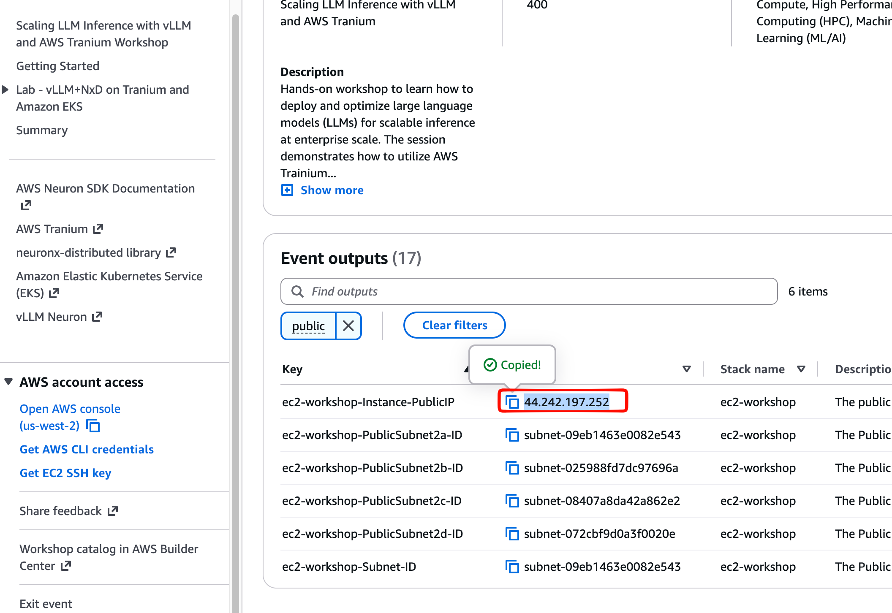
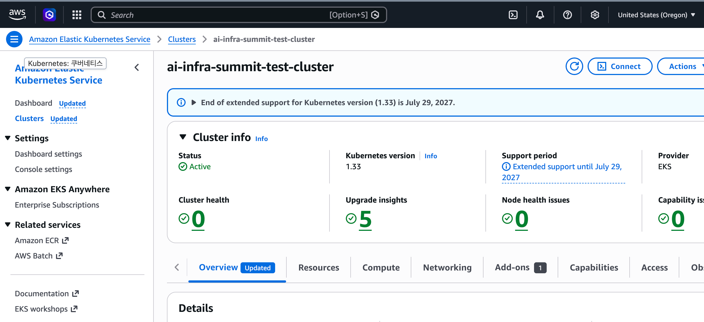
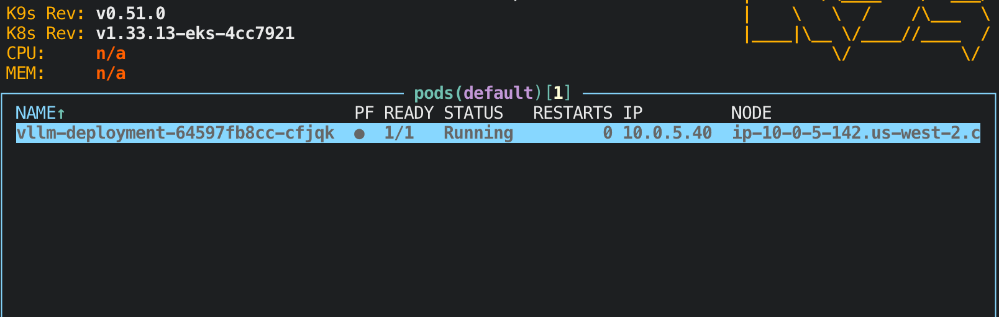
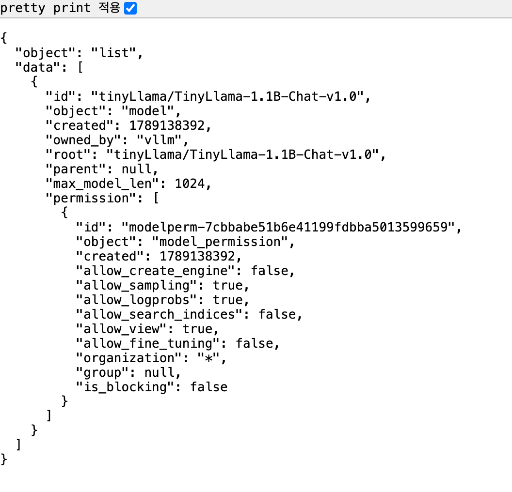
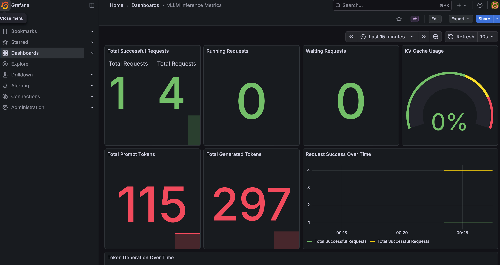

&nbsp;



```bash
# workshop 계정에서 발급된 EC2에 접속한다
MYEC2IP=<EC2_PUBLIC_IP>
ssh -i ws-default-keypair.pem ubuntu@$MYEC2IP

#
whoami
hostnamectl
...
  Hardware Model: t3.2xlarge

htop
df -hT
ip -c addr
docker info

#
sudo apt update && sudo apt install tree jq -y
tree -a workshop/
workshop/
└── .env

cat workshop/.env
HF_TOKEN="hf_****************************"
```


# Lab1: EKS Cluster Setup

작업은 모두 workshop EC2(`t3.2xlarge`, Ubuntu 22.04) 안에서 진행한다. EKS control plane은 workshop CloudFormation stack이 미리 생성해 둔 상태이며, 여기서는 **Trainium node group 추가 → Neuron device plugin → model cache용 S3 연결** 순서로 붙인다.

## 1. 도구 설치

```bash
cd workshop
pwd

# Update package list and install tools
sudo apt update
sudo apt install -y python3-pip jq unzip

# Install AWS CLI v2
curl "https://awscli.amazonaws.com/awscli-exe-linux-x86_64.zip" -o "awscliv2.zip"
unzip awscliv2.zip
sudo ./aws/install --update

# Install Helm
curl https://raw.githubusercontent.com/helm/helm/main/scripts/get-helm-3 | bash

# Enable kubectl autocompletion for current session and add to bashrc
source <(kubectl completion bash) && echo "source <(kubectl completion bash)" >> ~/.bashrc

# Verify installations
aws --version
helm version --short
jq --version
```

설치 결과는 다음과 같다. `kubectl`과 `eksctl`은 AMI에 이미 포함되어 있다.

```bash
$ aws --version
aws-cli/2.36.43 Python/3.14.6 Linux/6.8.0-1035-aws exe/x86_64.ubuntu.22

$ helm version --short
v3.22.0+g144ca65

$ eksctl version
0.230.0

$ kubectl version --client
Client Version: v1.37.0
Kustomize Version: v5.8.1
```


## 2. 환경 변수 설정

node group에 쓸 AMI는 직접 찾지 않고 SSM public parameter에서 가져온다. Trainium/Inferentia용 EKS optimized AMI는 `.../amazon-linux-2023/x86_64/neuron/recommended/image_id` 경로에 있다.

```bash
export AWS_REGION=us-west-2
export CLUSTER_NAME=ai-infra-summit-test-cluster
export EKS_VERSION=1.33
export INSTANCE_TYPE=trn1.2xlarge
export DESIRED_NODES=1
export WORKER_AMI=$(aws ssm get-parameter \
    --name /aws/service/eks/optimized-ami/1.33/amazon-linux-2023/x86_64/neuron/recommended/image_id \
    --region $AWS_REGION \
    --query "Parameter.Value" \
    --output text)
export AWS_ACCOUNT_ID=$(aws sts get-caller-identity --query Account --output text)
export BUCKET_NAME=ai-infra-summit-vllm-models-cache-${AWS_ACCOUNT_ID}

echo "$CLUSTER_NAME $WORKER_AMI $AWS_ACCOUNT_ID $BUCKET_NAME"
```

```bash
ai-infra-summit-test-cluster ami-0e08c07b0376ba3f8 <ACCOUNT_ID> ai-infra-summit-vllm-models-cache-<ACCOUNT_ID>
```

EC2에는 instance profile이 붙어 있어 별도 credential 설정이 필요 없다.

```bash
$ aws sts get-caller-identity
{
    "UserId": "<ROLE_ID>:<EC2_INSTANCE_ID>",
    "Account": "<ACCOUNT_ID>",
    "Arn": "arn:aws:sts::<ACCOUNT_ID>:assumed-role/ec2-workshop-WorkshopInstanceRole-MXbUd3DpMGVq/<EC2_INSTANCE_ID>"
}
```




## 3. kubeconfig 설정

```bash
aws eks update-kubeconfig --region $AWS_REGION --name $CLUSTER_NAME
```

```bash
Updated context arn:aws:eks:us-west-2:<ACCOUNT_ID>:cluster/ai-infra-summit-test-cluster in /home/ubuntu/.kube/config
```

cluster 상태를 확인한다. control plane은 이미 `ACTIVE`이고 endpoint는 private access만 열려 있다. workshop EC2가 같은 VPC 안에 있어 접근이 된다.

```bash
$ aws eks describe-cluster --name $CLUSTER_NAME --region $AWS_REGION \
    --query "cluster.{status:status,version:version,createdAt:createdAt,vpc:resourcesVpcConfig.vpcId}"
{
    "status": "ACTIVE",
    "version": "1.33",
    "createdAt": "2026-09-11T03:55:40.647000+00:00",
    "vpc": "<VPC_ID>"
}
```

이 시점에는 node가 하나도 없고 `coredns`만 pending 상태로 떠 있다.


## 4. Trainium node group 생성

### VPC / subnet 확인

node group 정의에 넣을 VPC, subnet, security group ID를 cluster에서 그대로 가져온다.

```bash
aws eks describe-cluster --name $CLUSTER_NAME --region $AWS_REGION \
    --query "cluster.resourcesVpcConfig"
```

```json
{
    "subnetIds": [
        "<SUBNET-2A-PUBLIC>",
        "<SUBNET-2B-PUBLIC>",
        "<SUBNET-2C-PUBLIC>",
        "<SUBNET-2D-PUBLIC>",
        "<SUBNET-2A-PRIVATE>",
        "<SUBNET-2B-PRIVATE>",
        "<SUBNET-2C-PRIVATE>",
        "<SUBNET-2D-PRIVATE>"
    ],
    "securityGroupIds": [],
    "clusterSecurityGroupId": "<CLUSTER-SG>",
    "vpcId": "<VPC_ID>",
    "endpointPublicAccess": false,
    "endpointPrivateAccess": true,
    "publicAccessCidrs": [],
    "controlPlaneEgressMode": "AWS_MANAGED"
}
```

subnet이 8개라 어느 것이 public인지 구분이 필요하다. `trn1.2xlarge`는 특정 AZ에만 있으므로 public subnet 중 us-west-2b, us-west-2d를 고른다.

```bash
aws ec2 describe-subnets --region $AWS_REGION \
    --filters "Name=vpc-id,Values=<VPC_ID>" \
    --query "Subnets[].{id:SubnetId,az:AvailabilityZone,cidr:CidrBlock,public:MapPublicIpOnLaunch}" \
    --output table
```

```bash
----------------------------------------------------------------
|                       DescribeSubnets                        |
+------------+--------------+-----------------------+----------+
|     az     |     cidr     |           id          |  public  |
+------------+--------------+-----------------------+----------+
|  us-west-2b|  10.0.7.0/24 |  <SUBNET-2B-PRIVATE>  |  False   |
|  us-west-2b|  10.0.5.0/24 |  <SUBNET-2B-PUBLIC>   |  True    |
|  us-west-2c|  10.0.8.0/24 |  <SUBNET-2C-PRIVATE>  |  False   |
|  us-west-2a|  10.0.3.0/24 |  <SUBNET-2A-PRIVATE>  |  False   |
|  us-west-2a|  10.0.1.0/24 |  <SUBNET-2A-PUBLIC>   |  True    |
|  us-west-2d|  10.0.2.0/24 |  <SUBNET-2D-PUBLIC>   |  True    |
|  us-west-2d|  10.0.4.0/24 |  <SUBNET-2D-PRIVATE>  |  False   |
|  us-west-2c|  10.0.6.0/24 |  <SUBNET-2C-PUBLIC>   |  True    |
+------------+--------------+-----------------------+----------+
```

### SSH key 생성

node group에 SSH 접근을 열어 두려면 public key가 필요하다.

```bash
ssh-keygen -t rsa -b 3072 -f ~/.ssh/id_rsa -N ""
```

### node group manifest

`eksctl`의 `ClusterConfig`로 managed node group만 추가한다. cluster는 이미 있으므로 `metadata`의 이름과 region이 기존 cluster와 일치해야 한다.

```yaml {title="eks_nodegroup.yaml"}
apiVersion: eksctl.io/v1alpha5
kind: ClusterConfig
metadata:
  name: ai-infra-summit-test-cluster
  region: us-west-2
  version: "1.33"
vpc:
  id: <VPC_ID>
  subnets:
    public:
      us-west-2b: { id: <SUBNET-2B-PUBLIC> }
      us-west-2d: { id: <SUBNET-2D-PUBLIC> }
  securityGroup: <CLUSTER-SG>
managedNodeGroups:
- name: neuron-trn1-2x
  ami: ami-0e08c07b0376ba3f8
  amiFamily: AmazonLinux2023
  subnets: ["<SUBNET-2B-PUBLIC>", "<SUBNET-2D-PUBLIC>"]
  iam:
    attachPolicyARNs:
    - arn:aws:iam::aws:policy/AmazonEKSWorkerNodePolicy
    - arn:aws:iam::aws:policy/AmazonEC2ContainerRegistryReadOnly
    - arn:aws:iam::aws:policy/AmazonSSMManagedInstanceCore
    - arn:aws:iam::aws:policy/AmazonS3FullAccess
    - arn:aws:iam::aws:policy/AmazonEKS_CNI_Policy
  instanceType: trn1.2xlarge
  desiredCapacity: 1
  volumeSize: 100
  volumeType: gp2
  ssh:
     allow: true
     publicKeyPath: ~/.ssh/id_rsa.pub
```

`ami`를 직접 지정하면 `amiFamily`도 같이 명시해야 한다. node IAM role에 `AmazonS3FullAccess`를 붙이는 이유는 뒤에서 Mountpoint S3 CSI driver가 node role 권한으로 bucket에 접근하기 때문이다.

### 생성

```bash
eksctl create nodegroup -f eks_nodegroup.yaml
```

CloudFormation stack `eksctl-ai-infra-summit-test-cluster-nodegroup-neuron-trn1-2x`가 만들어지고, 약 5분 뒤 node 한 대가 붙는다.

```bash
$ eksctl get nodegroup --cluster $CLUSTER_NAME --region $AWS_REGION
CLUSTER                       NODEGROUP       STATUS  CREATED               MIN SIZE  MAX SIZE  DESIRED CAPACITY  INSTANCE TYPE  IMAGE ID               TYPE
ai-infra-summit-test-cluster  neuron-trn1-2x  ACTIVE  2026-09-11T13:47:03Z  1         1         1                 trn1.2xlarge   ami-0e08c07b0376ba3f8  managed
```

```bash
$ kubectl get nodes -o wide
NAME                                       STATUS   ROLES    AGE   VERSION                INTERNAL-IP   EXTERNAL-IP     OS-IMAGE                        KERNEL-VERSION                     CONTAINER-RUNTIME
ip-10-0-5-142.us-west-2.compute.internal   Ready    <none>   11m   v1.33.13-eks-cb19647   10.0.5.142    34.222.123.83   Amazon Linux 2023.12.20260831   6.12.103-127.188.amzn2023.x86_64   containerd://2.2.5+unknown
```


## 5. Neuron device plugin / scheduler 설치

node가 Ready여도 Trainium device는 아직 Kubernetes에 노출되지 않는다. `aws.amazon.com/neuron` resource를 광고하려면 Neuron device plugin이 필요하다. chart는 OCI registry(`public.ecr.aws`)에서 바로 받는다.

```bash
helm install neuron-helm-chart oci://public.ecr.aws/neuron/neuron-helm-chart \
  --set "npd.enabled=false"
```

`trn1.2xlarge`는 Neuron device가 1개(NeuronCore 2개)뿐이라 기본 scheduler로도 동작하지만, 여러 device를 쓰는 multi-card 배치에서는 연속된 core를 할당하는 Neuron scheduler extension이 필요하다. 이어서 scheduler를 켠다.

```bash
helm upgrade neuron-helm-chart oci://public.ecr.aws/neuron/neuron-helm-chart \
  --set "npd.enabled=false" \
  --set "scheduler.enabled=true"
```

```bash
$ helm history neuron-helm-chart -n default
REVISION  UPDATED                   STATUS      CHART                     APP VERSION  DESCRIPTION
1         Fri Sep 11 13:56:32 2026  superseded  neuron-helm-chart-1.10.0  1.10.0       Install complete
2         Fri Sep 11 13:56:53 2026  deployed    neuron-helm-chart-1.10.0  1.10.0       Upgrade complete

$ helm get values neuron-helm-chart -n default
USER-SUPPLIED VALUES:
npd:
  enabled: false
scheduler:
  enabled: true
```

device plugin(DaemonSet), Neuron scheduler extension, 그리고 extension을 물고 있는 보조 scheduler(`my-scheduler`)가 올라온다.

```bash
$ kubectl get pods -n kube-system | grep -E "neuron|scheduler"
k8s-neuron-scheduler-785c8d99f8-zbrt6   1/1     Running   0   2m23s
my-scheduler-55f56bc9f8-25m4c           1/1     Running   0   2m23s
neuron-device-plugin-vl2jb              1/1     Running   0   2m45s
```

node의 allocatable resource에 Neuron이 잡히면 정상이다.

```bash
$ kubectl get node -o json | jq -r '.items[] | .status.allocatable'
{
  "aws.amazon.com/neuron": "1",
  "aws.amazon.com/neuroncore": "2",
  "cpu": "7910m",
  "ephemeral-storage": "95491281146",
  "hugepages-1Gi": "0",
  "hugepages-2Mi": "0",
  "memory": "31315408Ki",
  "pods": "58"
}
```

`trn1.2xlarge` 한 대는 Trainium chip 1개 = NeuronCore 2개다. vCPU 8개 중 7910m이 allocatable로 남는다.


## 6. Model cache용 S3 + Mountpoint S3 CSI driver

vLLM이 매번 Hugging Face에서 모델을 내려받고 Neuron compile을 다시 하면 시간이 오래 걸린다. 컴파일 결과와 weight를 S3에 캐시하고 Pod에 volume으로 붙이기 위해 bucket과 CSI driver를 준비한다.

```bash
aws s3 mb s3://${BUCKET_NAME} --region $AWS_REGION
aws s3 ls
```

```bash
2026-09-11 13:56:09 ai-infra-summit-vllm-models-cache-<ACCOUNT_ID>
```

CSI driver는 Helm repository에서 설치한다.

```bash
helm repo add aws-mountpoint-s3-csi-driver https://awslabs.github.io/mountpoint-s3-csi-driver
helm repo update
helm upgrade --install aws-mountpoint-s3-csi-driver \
  aws-mountpoint-s3-csi-driver/aws-mountpoint-s3-csi-driver \
  --namespace kube-system
```

IRSA를 따로 만들지 않았으므로 `s3-csi-driver-sa`에는 role annotation이 없다. node group IAM role에 붙여 둔 `AmazonS3FullAccess`로 bucket에 접근한다.

```bash
$ kubectl get pods -n kube-system | grep s3-csi
s3-csi-controller-5df587766f-dqb2z   1/1     Running   0   2m
s3-csi-node-5b6lt                    3/3     Running   0   2m
```


## 7. 최종 상태 확인

```bash
$ helm list -A
NAME                          NAMESPACE    REVISION  STATUS    CHART                               APP VERSION
aws-mountpoint-s3-csi-driver  kube-system  1         deployed  aws-mountpoint-s3-csi-driver-2.8.0
neuron-helm-chart             default      2         deployed  neuron-helm-chart-1.10.0            1.10.0

$ kubectl get pods -A
NAMESPACE     NAME                                    READY   STATUS    RESTARTS   AGE
kube-system   aws-node-hkdj6                          2/2     Running   0          11m
kube-system   coredns-75cb89d95b-lf4lz                1/1     Running   0          9h
kube-system   coredns-75cb89d95b-v5rzs                1/1     Running   0          9h
kube-system   k8s-neuron-scheduler-785c8d99f8-zbrt6   1/1     Running   0          2m23s
kube-system   kube-proxy-jtwxj                        1/1     Running   0          11m
kube-system   my-scheduler-55f56bc9f8-25m4c           1/1     Running   0          2m23s
kube-system   neuron-device-plugin-vl2jb              1/1     Running   0          2m45s
kube-system   s3-csi-controller-5df587766f-dqb2z      1/1     Running   0          2m
kube-system   s3-csi-node-5b6lt                       3/3     Running   0          2m
```

여기까지가 vLLM을 올리기 전 단계다. 정리하면 다음과 같다.


| 구성 요소            | 값                                                           | 비고                                                   |
| ---------------- | ----------------------------------------------------------- | ---------------------------------------------------- |
| Cluster          | `ai-infra-summit-test-cluster` (EKS 1.33, us-west-2)        | control plane은 workshop CFN이 사전 생성, private endpoint |
| CNI              | `amazon-k8s-cni:v1.22.4-eksbuild.3`                         | VPC CNI                                              |
| Node group       | `neuron-trn1-2x` (managed, `trn1.2xlarge` × 1)              | eksctl로 추가                                           |
| AMI              | `ami-0e08c07b0376ba3f8`                                     | EKS optimized AL2023 Neuron                          |
| Node storage     | gp2 100GB                                                   | `ephemeral-storage` capacity `104779756Ki`           |
| Neuron resource  | `aws.amazon.com/neuron: 1`, `aws.amazon.com/neuroncore: 2`  | device plugin 2.32.0.0                               |
| Neuron scheduler | `k8s-neuron-scheduler` + `my-scheduler`                     | `scheduler.enabled=true`로 추가 설치                      |
| Model cache      | `s3://ai-infra-summit-vllm-models-cache-<ACCOUNT_ID>`       | Mountpoint S3 CSI driver 2.8.0                       |
| Node IAM role    | EKSWorkerNode, EKS_CNI, ECR ReadOnly, SSM, **S3FullAccess** | CSI driver가 이 권한으로 bucket 접근                         |
| IRSA             | 미사용                                                         | cluster OIDC issuer는 있으나 IAM OIDC provider 미등록       |


두 가지는 워크숍 가이드 설명과 다르니 확인이 필요하다.

- **node volume은 500GB가 아니라 100GB다.** `eks_nodegroup.yaml`의 `volumeSize: 100`이 그대로 반영됐다. 모델을 로컬 디스크에 받는 구성이라면 부족할 수 있으나, 여기서는 S3에 캐시하므로 그대로 진행한다.
- **OIDC는 "enabled" 상태가 아니다.** EKS cluster는 모두 OIDC issuer URL을 갖지만, IAM에 OIDC identity provider가 등록되지 않아 IRSA를 쓸 수 없다.

```bash
$ aws iam list-open-id-connect-providers
{
    "OpenIDConnectProviderList": []
}
```

그래서 `s3-csi-driver-sa`에 role annotation이 없고, node IAM role의 `AmazonS3FullAccess`로 S3에 접근한다. node group 정의에 S3 권한을 넣어 둔 이유가 이것이다.

### 참고: workshop role의 권한 제한

workshop EC2 role은 cluster 단위 조회 권한이 제한되어 있다. node group 조회는 되지만 cluster/addon 목록은 막혀 있으니 콘솔이나 `describe-cluster`로 확인한다.

```bash
$ eksctl get cluster --region us-west-2
Error: failed to list clusters in region "us-west-2": ... AccessDeniedException:
User: arn:aws:sts::<ACCOUNT_ID>:assumed-role/ec2-workshop-WorkshopInstanceRole-... is not
authorized to perform: eks:ListClusters ...
```


&nbsp;

&nbsp;

# Lab2: vLLM Deployment

init container 패턴으로 vLLM을 배포한다. init container가 모델을 다운로드·컴파일해서 S3에 캐시하고, 메인 container는 컴파일된 아티팩트를 읽어 OpenAI 호환 API server를 띄운다. 컴파일 결과가 S3에 남으므로 재배포 시 컴파일 단계를 건너뛴다.

구성 요소는 여섯 가지다.


| 리소스        | 이름                           | 역할                           |
| ---------- | ---------------------------- | ---------------------------- |
| Secret     | `hf-token-secret`            | Hugging Face 토큰              |
| ConfigMap  | `vllm-shared-config`         | 모델·Neuron 런타임 설정             |
| PV / PVC   | `s3-model-cache-pv` / `-pvc` | S3 bucket을 RWX volume으로 마운트  |
| Deployment | `vllm-deployment`            | init container + vLLM server |
| Service    | `vllm-service`               | Classic ELB로 외부 노출           |


## 1. HF_TOKEN Secret 생성

```bash
rm -rf /home/ubuntu/workshop/.env
echo 'HF_TOKEN="hf_****"' > /home/ubuntu/workshop/.env

source /home/ubuntu/workshop/.env
kubectl create secret generic hf-token-secret \
    --from-literal=HF_TOKEN="$HF_TOKEN" \
    --dry-run=client -o yaml | kubectl apply -f -
```

```bash
$ kubectl get secret hf-token-secret
NAME              TYPE     DATA   AGE
hf-token-secret   Opaque   1      40m
```

`--dry-run=client -o yaml | kubectl apply -f -` 조합을 쓰면 Secret이 이미 있어도 `AlreadyExists` 없이 갱신된다.


## 2. ConfigMap 생성

vLLM과 Neuron 런타임 설정을 한곳에 모은다.

```bash
cat > vllm-configmap.yaml <<EOF
apiVersion: v1
kind: ConfigMap
metadata:
  name: vllm-shared-config
data:
  HF_TOKEN: "$HF_TOKEN"
  MODEL_NAME: "tinyLlama/TinyLlama-1.1B-Chat-v1.0"
  S3_BUCKET: "ai-infra-summit-vllm-models-cache-$(aws sts get-caller-identity | jq -r .Account)"
  S3_PREFIX: "compiled-models"
  MAX_NUM_SEQS: "4"
  PORT: "8080"
  NEURON_COMPILED_ARTIFACTS: "/shared/model/cache"
  NEURON_COMPILE_CACHE_URL: "/shared/model/cache"
  TENSOR_PARALLEL_SIZE: "2"
  MAX_MODEL_LEN: "1024"
  NEURON_RT_VISIBLE_CORES: "0-1"
  NEURON_RT_LOG_LEVEL: "ERROR"
  NEURON_RT_ASYNC_EXEC_MAX_INFLIGHT_REQUESTS: "4"
  VLLM_NEURON_FRAMEWORK: "neuronx-distributed-inference"
EOF
kubectl apply -f vllm-configmap.yaml
```

실제로 적용된 값은 다음과 같다(`HF_TOKEN` 제외, 14개 중 13개).

```json
{
  "MAX_MODEL_LEN": "1024",
  "MAX_NUM_SEQS": "4",
  "MODEL_NAME": "tinyLlama/TinyLlama-1.1B-Chat-v1.0",
  "NEURON_COMPILED_ARTIFACTS": "/shared/model/cache",
  "NEURON_COMPILE_CACHE_URL": "/shared/model/cache",
  "NEURON_RT_ASYNC_EXEC_MAX_INFLIGHT_REQUESTS": "4",
  "NEURON_RT_LOG_LEVEL": "ERROR",
  "NEURON_RT_VISIBLE_CORES": "0-1",
  "PORT": "8080",
  "S3_BUCKET": "ai-infra-summit-vllm-models-cache-<ACCOUNT_ID>",
  "S3_PREFIX": "compiled-models",
  "TENSOR_PARALLEL_SIZE": "2",
  "VLLM_NEURON_FRAMEWORK": "neuronx-distributed-inference"
}
```

주요 설정의 의미는 다음과 같다.


| 키                          | 값                               | 의미                                                |
| -------------------------- | ------------------------------- | ------------------------------------------------- |
| `TENSOR_PARALLEL_SIZE`     | `2`                             | 가중치를 NeuronCore 2개에 분할. `trn1.2xlarge`의 코어를 모두 사용 |
| `NEURON_RT_VISIBLE_CORES`  | `0-1`                           | 런타임에 노출할 코어 인덱스                                   |
| `MAX_MODEL_LEN`            | `1024`                          | prompt+생성 최대 토큰. KV cache 크기 산정 기준                |
| `MAX_NUM_SEQS`             | `4`                             | continuous batching 동시 처리 시퀀스 상한                  |
| `NEURON_COMPILE_CACHE_URL` | `/shared/model/cache`           | 컴파일 캐시 경로. S3 PVC 마운트 지점과 동일                      |
| `VLLM_NEURON_FRAMEWORK`    | `neuronx-distributed-inference` | Neuron 백엔드로 NxD 추론 프레임워크 사용                       |


두 가지는 짚고 넘어갈 만하다.

- **`HF_TOKEN`이 ConfigMap에 평문으로 들어간다.** Secret을 따로 만든 의미가 없어진다. Deployment가 `secretRef`로도 주입받으므로 ConfigMap 쪽 `HF_TOKEN`은 빼도 동작한다.
- **`S3_PREFIX: compiled-models`는 실제로 쓰이지 않는다.** 아티팩트는 bucket 루트의 `cache/` 아래에 떨어진다(뒤의 S3 목록 참고). init container가 `cp -r /tmp/cache/* /shared/model/cache/`로 복사하는데, PVC가 bucket 루트에 마운트되기 때문이다.


## 3. S3 PV / PVC 생성

```bash
cat > vllm-storage.yaml <<EOF
apiVersion: v1
kind: PersistentVolume
metadata:
  name: s3-model-cache-pv
spec:
  capacity:
    storage: 100Gi
  accessModes:
    - ReadWriteMany
  persistentVolumeReclaimPolicy: Retain
  csi:
    driver: s3.csi.aws.com
    volumeHandle: ai-infra-summit-vllm-models-cache-$(aws sts get-caller-identity | jq -r .Account)
    volumeAttributes:
      bucketName: ai-infra-summit-vllm-models-cache-$(aws sts get-caller-identity | jq -r .Account)
---
apiVersion: v1
kind: PersistentVolumeClaim
metadata:
  name: s3-model-cache-pvc
spec:
  accessModes:
    - ReadWriteMany
  resources:
    requests:
      storage: 100Gi
  volumeName: s3-model-cache-pv
EOF
kubectl apply -f vllm-storage.yaml
```

```bash
$ kubectl get pvc,pv
NAME                                       STATUS   VOLUME              CAPACITY   ACCESS MODES   RECLAIM POLICY   AGE
persistentvolumeclaim/s3-model-cache-pvc   Bound    s3-model-cache-pv   100Gi      RWX                             39m

NAME                                 CAPACITY   ACCESS MODES   RECLAIM POLICY   STATUS   CLAIM                        AGE
persistentvolume/s3-model-cache-pv   100Gi      RWX            Retain           Bound    default/s3-model-cache-pvc   39m
```

`storageClassName`이 비어 있는 static provisioning이다. `capacity: 100Gi`는 스케줄링용 논리값일 뿐이고 Mountpoint가 쿼터를 강제하지 않는다.


## 4. Deployment 배포

node에 붙은 label을 먼저 확인한다. `nodeSelector`가 이 label을 참조한다.

```bash
$ kubectl describe node | grep nodegroup-name
                    alpha.eksctl.io/nodegroup-name=neuron-trn1-2x
```

Deployment의 핵심은 세 가지다.

- `schedulerName: my-scheduler` — Neuron scheduler extension을 통해 스케줄링
- `initContainers.model-prep` — 캐시 확인 → 없으면 다운로드·컴파일 → `/shared/model/cache`로 복사
- `resources`에 `aws.amazon.com/neuron: 1` — device plugin이 광고한 Neuron device 1개 요청

```yaml {title="vllm-deployment.yaml (일부)"}
spec:
  schedulerName: my-scheduler
  nodeSelector:
    alpha.eksctl.io/nodegroup-name: neuron-trn1-2x
  volumes:
    - name: model-storage
      persistentVolumeClaim:
        claimName: s3-model-cache-pvc
  initContainers:
    - name: model-prep
      image: public.ecr.aws/neuron/pytorch-inference-vllm-neuronx:0.9.1-neuronx-py310-sdk2.25.0-ubuntu22.04
      envFrom:
        - configMapRef: { name: vllm-shared-config }
        - secretRef:    { name: hf-token-secret }
      resources:
        limits:   { aws.amazon.com/neuron: 1, ephemeral-storage: 50Gi }
        requests: { aws.amazon.com/neuron: 1, ephemeral-storage: 50Gi }
      volumeMounts:
        - name: model-storage
          mountPath: /shared/model
  containers:
    - name: vllm-server
      image: public.ecr.aws/neuron/pytorch-inference-vllm-neuronx:0.9.1-neuronx-py310-sdk2.25.0-ubuntu22.04
      ports:
        - containerPort: 8080
          name: http-vllm
      volumeMounts:
        - name: model-storage
          mountPath: /shared/model
          readOnly: true
      resources:
        limits:   { aws.amazon.com/neuron: 1, ephemeral-storage: 50Gi, cpu: "8000m" }
        requests: { aws.amazon.com/neuron: 1, ephemeral-storage: 50Gi, cpu: "4000m" }
```

init container가 `/shared/model/cache`가 비어 있을 때만 컴파일한다. 컴파일은 `/tmp/cache`에서 수행하고 끝난 뒤 통째로 복사하는데, Mountpoint S3가 append나 부분 쓰기를 지원하지 않기 때문이다.

```bash
kubectl apply -f vllm-deployment.yaml
kubectl get pod -l app.kubernetes.io/name=vllm-server -w
```

```bash
$ kubectl get deployment vllm-deployment -o wide
NAME              READY   UP-TO-DATE   AVAILABLE   AGE   CONTAINERS    IMAGES
vllm-deployment   1/1     1            1           38m   vllm-server   public.ecr.aws/neuron/pytorch-inference-vllm-neuronx:0.9.1-...

$ kubectl get pods -l app.kubernetes.io/name=vllm-server -o wide
NAME                               READY   STATUS    RESTARTS   AGE   IP          NODE
vllm-deployment-64597fb8cc-cfjqk   1/1     Running   0          38m   10.0.5.40   ip-10-0-5-142.us-west-2.compute.internal

$ kubectl get pod -l app.kubernetes.io/name=vllm-server \
    -o jsonpath='{.items[0].spec.schedulerName}{"\n"}{.items[0].spec.nodeSelector}'
my-scheduler
{"alpha.eksctl.io/nodegroup-name":"neuron-trn1-2x"}
```



### 실측 소요 시간

Pod의 condition과 container 상태에서 각 구간을 뽑았다.

```bash
kubectl get pod -l app.kubernetes.io/name=vllm-server -o json | jq -r '.items[] |
{podCreated: .metadata.creationTimestamp,
 initStart:  .status.initContainerStatuses[0].state.terminated.startedAt,
 initFinish: .status.initContainerStatuses[0].state.terminated.finishedAt,
 mainStart:  .status.containerStatuses[0].state.running.startedAt}'
```


| 구간                               | 시각(UTC)  | 소요         |
| -------------------------------- | -------- | ---------- |
| Pod 생성 / 스케줄                     | 14:16:32 | —          |
| image pull 완료, init container 시작 | 14:19:24 | 2분 52초     |
| 모델 컴파일 + S3 업로드 완료               | 14:23:15 | 3분 51초     |
| vLLM server container 시작         | 14:23:16 | 1초         |
| `Application startup complete`   | 14:23:51 | 35초        |
| **전체**                           |          | **7분 19초** |


7.9GiB짜리 이미지를 받는 데 걸린 2분 52초와 컴파일 3분 51초가 대부분이다. 재배포 시에는 이미지가 node에 캐시돼 있고 S3에 컴파일 결과가 있으므로 마지막 35초 구간만 남는다.

init container 로그 끝부분에서 컴파일 완료를 확인할 수 있다.

```bash
$ kubectl logs -l app.kubernetes.io/name=vllm-server -c model-prep --tail=8
INFO:Neuron:Finished weights loading in 12.716184116000022 seconds
INFO:Neuron:Warming up the model.
INFO:Neuron:Warmup completed in 0.4222989082336426 seconds.
INFO 09-11 14:23:11 [executor_base.py:112] # neuron blocks: 4, # CPU blocks: 0
INFO 09-11 14:23:11 [executor_base.py:117] Maximum concurrency for 1024 tokens per request: 4.00x
INFO 09-11 14:23:11 [llm_engine.py:434] init engine (profile, create kv cache, warmup model) took 0.00 seconds
Model compiled successfully!
```

`# neuron blocks: 4`는 `MAX_NUM_SEQS: 4`에서 나온 값이고, 이것이 동시 처리 가능 요청 수 상한(`4.00x`)이 된다.

로그 중간에 나오는 libfabric 경고는 무시해도 된다. EFA 라이브러리가 없다는 메시지인데, 단일 node·단일 device 구성에서는 collective communication이 node 간을 넘지 않는다.

```bash
CCOM WARN NET/Plugin: Error: libnccom-net.so load failed. libfabric.so.1: cannot open shared object file
```


## 5. S3 캐시 확인

```bash
$ aws s3 ls s3://$BUCKET_NAME --recursive --human-readable
2026-09-11 14:23:13    4.6 MiB cache/model.pt
2026-09-11 14:23:14    6.1 KiB cache/neuron_config.json
2026-09-11 14:23:14  359 Bytes cache/neuronxcc-2.20.9961.0+0acef03a/MODULE_56f0d314fda2b6e1e336+617f6939/compile_flags.json
2026-09-11 14:23:15    0 Bytes cache/neuronxcc-2.20.9961.0+0acef03a/MODULE_56f0d314fda2b6e1e336+617f6939/model.done
2026-09-11 14:23:14  547.2 KiB cache/neuronxcc-2.20.9961.0+0acef03a/MODULE_56f0d314fda2b6e1e336+617f6939/model.hlo_module.pb
2026-09-11 14:23:14    1.5 MiB cache/neuronxcc-2.20.9961.0+0acef03a/MODULE_56f0d314fda2b6e1e336+617f6939/model.neff
2026-09-11 14:23:15    1.6 MiB cache/neuronxcc-2.20.9961.0+0acef03a/MODULE_56f0d314fda2b6e1e336+617f6939/wrapped_neff.hlo
2026-09-11 14:23:15  359 Bytes cache/neuronxcc-2.20.9961.0+0acef03a/MODULE_ae92d68443828ba4e463+ad9e832d/compile_flags.json
2026-09-11 14:23:16    0 Bytes cache/neuronxcc-2.20.9961.0+0acef03a/MODULE_ae92d68443828ba4e463+ad9e832d/model.done
2026-09-11 14:23:15  851.5 KiB cache/neuronxcc-2.20.9961.0+0acef03a/MODULE_ae92d68443828ba4e463+ad9e832d/model.hlo_module.pb
2026-09-11 14:23:15  741.0 KiB cache/neuronxcc-2.20.9961.0+0acef03a/MODULE_ae92d68443828ba4e463+ad9e832d/model.neff

Total Objects: 11
   Total Size: 10320638
```

전체 10MB 남짓이다. 1.1B 모델의 가중치가 아니라 **Neuron 컴파일 산출물만** 올라간다. `MODULE_` 디렉터리 두 개는 context encoding과 token generation 각각에 대한 컴파일 결과다.


| 파일                    | 내용                                                   |
| --------------------- | ---------------------------------------------------- |
| `model.neff`          | Neuron Executable File Format. 실제 device에서 실행되는 바이너리 |
| `model.hlo_module.pb` | 컴파일러 입력인 HLO 그래프                                     |
| `compile_flags.json`  | 캐시 히트 판정에 쓰이는 컴파일 플래그                                |
| `model.done`          | 컴파일 완료 마커(0 byte)                                    |


Pod 안에서도 같은 트리가 보인다.

```bash
$ kubectl exec -it deploy/vllm-deployment -c vllm-server -- ls -R -1 /shared/model
/shared/model:
cache

/shared/model/cache:
model.pt
neuron_config.json
neuronxcc-2.20.9961.0+0acef03a

/shared/model/cache/neuronxcc-2.20.9961.0+0acef03a:
MODULE_56f0d314fda2b6e1e336+617f6939
MODULE_ae92d68443828ba4e463+ad9e832d
```

주입된 환경 변수도 확인한다.

```bash
$ kubectl exec -it deploy/vllm-deployment -c vllm-server -- env | grep -E 'NEURON|VLLM|MAX|TENSOR' | sort
MAX_MODEL_LEN=1024
MAX_NUM_SEQS=4
NEURON_COMPILED_ARTIFACTS=/shared/model/cache
NEURON_COMPILE_CACHE_URL=/shared/model/cache
NEURON_LOGICAL_NC_CONFIG=1
NEURON_RT_ASYNC_EXEC_MAX_INFLIGHT_REQUESTS=4
NEURON_RT_LOG_LEVEL=ERROR
NEURON_RT_VISIBLE_CORES=0-1
TENSOR_PARALLEL_SIZE=2
VLLM_NEURON_FRAMEWORK=neuronx-distributed-inference
VLLM_TARGET_DEVICE=neuron
```

`NEURON_LOGICAL_NC_CONFIG`와 `VLLM_TARGET_DEVICE`는 ConfigMap에 없고 컨테이너 이미지가 기본으로 갖고 있는 값이다.


## 6. 워커노드에서 확인

workshop EC2의 security group egress가 53/80/443만 허용하므로 node에 SSH가 안 된다. `kubectl debug`로 node의 root filesystem에 들어간다.

```bash
kubectl debug node/ip-10-0-5-142.us-west-2.compute.internal -it \
  --image=public.ecr.aws/amazonlinux/amazonlinux:2023 --profile=sysadmin \
  -- chroot /host bash
```

### 컨테이너 이미지

```bash
$ ctr -n k8s.io images ls | grep -i vllm
public.ecr.aws/neuron/pytorch-inference-vllm-neuronx:0.9.1-neuronx-py310-sdk2.25.0-ubuntu22.04
public.ecr.aws/neuron/pytorch-inference-vllm-neuronx@sha256:01f0f7b1e2cf256019a80c16712e79a5f254b04a3a77dbf8ac196de4ee380928
```

### 프로세스

```bash
$ ps -ef | grep -E "mount-s3|api_server" | grep -v grep
ec2-user 14990 14969 0 14:16 ? 00:00:00 /mountpoint-s3/bin/mount-s3 ai-infra-summit-vllm-models-cache-<ACCOUNT_ID> /dev/fd/3 --allow-root --foreground --user-agent-prefix=s3-csi-driver/2.8.0 credential-source#driver k8s/v1.33.13-eks-4cc7921 md/install#helm
root     17827 15119 0 14:23 ? 00:00:09 python -m vllm.entrypoints.openai.api_server --model=tinyLlama/TinyLlama-1.1B-Chat-v1.0 --max-num-seqs=4 --max-model-len=1024 --tensor-parallel-size=2 --port=8080 --device=neuron --override-neuron-config={"enable_bucketing":false}
```

`mount-s3`가 `ec2-user` 권한으로, vLLM이 `root`로 돈다. `mount-s3`는 14:16(볼륨 마운트 시점), vLLM은 14:23(init 완료 후)에 시작됐다.

### S3 마운트

```bash
$ mount | grep -i s3
mountpoint-s3 on /var/lib/kubelet/plugins/s3.csi.aws.com/mnt/mp-8jfx5 type fuse (rw,nosuid,nodev,noatime,user_id=0,group_id=0,default_permissions,allow_other)
mountpoint-s3 on /var/lib/kubelet/pods/ea2412ea-.../volumes/kubernetes.io~csi/s3-model-cache-pv/mount type fuse (rw,nosuid,nodev,noatime,user_id=0,group_id=0,default_permissions,allow_other)
```

`type fuse`다. 블록 디바이스가 아니라 userspace FUSE filesystem이며, read/write syscall이 `mount-s3` 데몬으로 전달돼 S3 `GetObject`/`PutObject`/`ListObjectsV2` 호출로 변환된다.

일반 블록 스토리지 CSI는 "한 번 stage 후 bind mount로 재사용"하지만, S3 CSI driver는 **마운트 지점마다 별도의 FUSE 프로세스를 띄운다.** 위 두 항목이 bind mount 관계가 아닌 이유다.

Mountpoint의 성질 때문에 주의할 점이 있다.

- **용량 제한 없음** — PV의 `100Gi`는 스케줄링용 논리값이고 실제 쿼터는 강제되지 않는다.
- **완전한 POSIX가 아님** — append, 부분 쓰기, hard link, 일부 rename이 제한된다. init container가 `cp -r`로 통째 복사하는 이유다.
- **강한 읽기-후-쓰기 일관성** — 업로드 직후 다른 프로세스가 읽어도 최신 데이터가 보인다.
- **동시 접근 안전** — RWX로 여러 Pod가 붙어도 node/Pod마다 독립 FUSE 프로세스라 서로 영향이 없다.

### Neuron device 점유

```bash
$ /opt/aws/neuron/bin/neuron-ls
instance-type: trn1.2xlarge
instance-id: <NODE_INSTANCE_ID>
+--------+--------+----------+--------+--------------+-------+----------+------+------------------------------------------+---------+
| NEURON | NEURON |  NEURON  | NEURON |     PCI      |  PID  |   CPU    | NUMA |                 COMMAND                  | RUNTIME |
| DEVICE | CORES  | CORE IDS | MEMORY |     BDF      |       | AFFINITY | NODE |                                          | VERSION |
+--------+--------+----------+--------+--------------+-------+----------+------+------------------------------------------+---------+
| 0      | 2      | 0-1      | 32 GB  | 0000:00:1e.0 | 17954 | 0-7      | -1   | /opt/conda/bin/python -c from multipr... | 2.27.23 |
+--------+--------+----------+--------+--------------+-------+----------+------+------------------------------------------+---------+
```

device 0의 코어 0-1을 vLLM 프로세스가 점유하고 있다. `TENSOR_PARALLEL_SIZE: 2`가 실제로 두 코어를 쓰고 있음을 확인할 수 있다. HBM은 32GB다.


## 7. LoadBalancer Service 생성

Service를 만들기 전에 Pod 안에서 API가 응답하는지 먼저 본다.

```bash
kubectl exec -it deploy/vllm-deployment -c vllm-server -- \
  curl -s http://localhost:8080/v1/models | jq .data
```

```bash
cat > vllm-service.yaml <<EOF
apiVersion: v1
kind: Service
metadata:
  name: vllm-service
spec:
  selector:
    app.kubernetes.io/name: vllm-server
  ports:
    - protocol: TCP
      port: 8080
      targetPort: http-vllm
  type: LoadBalancer
EOF
kubectl apply -f vllm-service.yaml
```

```bash
$ kubectl get svc,ep vllm-service
NAME                   TYPE           CLUSTER-IP       EXTERNAL-IP                                                               PORT(S)          AGE
service/vllm-service   LoadBalancer   172.20.216.178   <VLLM-ELB>   8080:30732/TCP   13m

NAME                     ENDPOINTS        AGE
endpoints/vllm-service   10.0.5.40:8080   13m
```

annotation 없이 `type: LoadBalancer`만 주면 in-tree cloud provider가 **Classic ELB**를 만든다. 트래픽 경로는 `ELB:8080 → nodePort 30732 → pod 10.0.5.40:8080`이다.

controller가 ELB용 security group도 같이 만들고, node가 쓰는 cluster SG에 이 SG를 허용하는 규칙을 넣는다.

```bash
$ aws ec2 describe-security-groups --group-ids <ELB-SG> \
    --query "SecurityGroups[0].{name:GroupName,desc:Description}"
{
    "name": "k8s-elb-<VLLM-ELB-ID>",
    "desc": "Security group for Kubernetes ELB <VLLM-ELB-ID> (default/vllm-service)"
}
```


## 8. API 테스트

### 외부에서 직접 호출

```bash
export VLLM_ENDPOINT="http://<VLLM-ELB>:8080"

curl -s $VLLM_ENDPOINT/v1/models | jq .data
```

```json
[
  {
    "id": "tinyLlama/TinyLlama-1.1B-Chat-v1.0",
    "object": "model",
    "created": 1789138204,
    "owned_by": "vllm",
    "root": "tinyLlama/TinyLlama-1.1B-Chat-v1.0",
    "parent": null,
    "max_model_len": 1024
  }
]
```

```bash
curl -s $VLLM_ENDPOINT/v1/chat/completions \
  -H "Content-Type: application/json" \
  -d '{
    "model": "tinyLlama/TinyLlama-1.1B-Chat-v1.0",
    "messages": [{"role": "user", "content": "What is AWS Trainium in one sentence?"}],
    "max_tokens": 80
  }'
```

```json
{
  "id": "chatcmpl-1f0fa6b77ee34cf298c48602bba5267b",
  "model": "tinyLlama/TinyLlama-1.1B-Chat-v1.0",
  "choices": [{
    "index": 0,
    "message": {
      "role": "assistant",
      "content": "AWS Trainium is an open-source, interactive website that provides demonstrations of Amazon Web Services (AWS) functionality and examples of successful deployments to help users better understand the capabilities and features of the platform."
    },
    "finish_reason": "stop"
  }],
  "usage": {"prompt_tokens": 25, "completion_tokens": 45, "total_tokens": 70}
}
```

응답 내용 자체는 사실과 다르다. 1.1B 모델의 한계이며, 여기서 확인하는 것은 추론 경로가 동작하는지이지 답변 품질이 아니다.

### workshop EC2에서 테스트할 때

EC2의 SG egress에 8080이 없어 ELB 주소로 직접 호출하면 timeout이 난다. port-forward로 우회한다.

```bash
kubectl port-forward svc/vllm-service 8080:8080 &
export VLLM_ENDPOINT="http://localhost:8080"
curl -s $VLLM_ENDPOINT/v1/models | jq .data
```

테스트가 끝나면 background job을 정리한다.

```bash
kill %1
```

### 대화형 클라이언트

```python {title="test-vllm-pod.py"}
from openai import OpenAI
import sys, os

def main():
    base_endpoint = os.getenv("VLLM_ENDPOINT")
    if not base_endpoint:
        print("Error: VLLM_ENDPOINT environment variable is not set")
        sys.exit(1)

    client = OpenAI(api_key="EMPTY", base_url=f"{base_endpoint}/v1")
    model_name = client.models.list().data[0].id
    print(f"Connected! Using model: {model_name}")

    print("Chat (type 'exit' to quit):")
    while True:
        user_input = input("\nYou: ").strip()
        if user_input.lower() in ['exit', 'quit', 'bye'] or not user_input:
            break
        response = client.chat.completions.create(
            model=model_name,
            messages=[{"role": "user", "content": user_input}],
            max_tokens=900,
            temperature=1.0,
            extra_body={'top_k': 50})
        print("AI:", response.choices[0].message.content)

if __name__ == "__main__":
    main()
```

```bash
pip install openai
python3 test-vllm-pod.py
```

API key는 `"EMPTY"`를 넣는다. vLLM의 OpenAI 호환 server는 `--api-key`를 주지 않으면 인증을 하지 않는다.


## 디버깅에 쓴 명령어

```bash
# 컨트롤러 로그
kubectl logs -n kube-system -l name=neuron-device-plugin-ds
kubectl logs -n kube-system -l app.kubernetes.io/component=k8s-neuron-scheduler

# 이벤트 / 리소스 확인
kubectl get events --sort-by=.metadata.creationTimestamp
kubectl describe pods -l app.kubernetes.io/name=vllm-server | grep -A 10 "Requests"
kubectl describe nodes -l alpha.eksctl.io/nodegroup-name=neuron-trn1-2x

# 컨테이너별 로그
kubectl logs -l app.kubernetes.io/name=vllm-server -c model-prep -f
kubectl logs -l app.kubernetes.io/name=vllm-server -c vllm-server -f
```

Pod가 `Pending`에서 멈추면 `aws.amazon.com/neuron` allocatable이 0인 경우가 대부분이다. device plugin이 떴는지부터 확인한다.


# Lab3: Ingress Configuration

NGINX Ingress Controller를 올리고, path 기반 라우팅으로 vLLM API를 외부에 노출한다.

`vllm-service`는 `type: LoadBalancer`라 Service 하나당 ELB가 하나씩 붙는다. 여러 서비스를 하나의 진입점에서 path나 host로 분기하려면 Ingress controller가 필요하다.

## 1. NGINX Ingress Controller 설치

```bash
echo "$AWS_REGION $CLUSTER_NAME"
```

```bash
us-west-2 ai-infra-summit-test-cluster
```

### 설치

```bash
# Add NGINX Ingress Controller Helm repository
helm repo add ingress-nginx https://kubernetes.github.io/ingress-nginx

# Install NGINX Ingress Controller
helm upgrade --install ingress-nginx ingress-nginx \
  --repo https://kubernetes.github.io/ingress-nginx \
  --namespace ingress-nginx \
  --create-namespace

# Wait for the ingress controller to be ready
kubectl wait --namespace ingress-nginx \
  --for=condition=ready pod \
  --selector=app.kubernetes.io/component=controller \
  --timeout=90s
```

```bash
"ingress-nginx" has been added to your repositories
...
pod/ingress-nginx-controller-6797f4dc8c-7cqcq condition met
```

`--repo` 플래그를 직접 주므로 앞의 `helm repo add`는 이 명령만 놓고 보면 없어도 된다. 나중에 `helm search repo`로 차트를 찾으려면 등록해 두는 편이 편하다.

`kubectl wait`는 18초 만에 통과했다.


### 설치 확인

```bash
$ helm list -n ingress-nginx
NAME           NAMESPACE      REVISION  UPDATED                                 STATUS    CHART                 APP VERSION
ingress-nginx  ingress-nginx  1         2026-09-11 15:09:53.621833545 +0000 UTC deployed  ingress-nginx-4.15.1  1.15.1

$ kubectl get pod -n ingress-nginx -o wide
NAME                                        READY   STATUS    RESTARTS   AGE   IP           NODE
ingress-nginx-controller-6797f4dc8c-7cqcq   1/1     Running   0          18s   10.0.5.252   ip-10-0-5-142.us-west-2.compute.internal

$ kubectl get svc,ep -n ingress-nginx ingress-nginx-controller
NAME                               TYPE           CLUSTER-IP       EXTERNAL-IP                                                               PORT(S)                      AGE
service/ingress-nginx-controller   LoadBalancer   172.20.238.179   <INGRESS-ELB>   80:30381/TCP,443:32447/TCP   19s

NAME                                 ENDPOINTS                      AGE
endpoints/ingress-nginx-controller   10.0.5.252:443,10.0.5.252:80   19s
```

controller Pod는 vLLM과 같은 node(`ip-10-0-5-142`)에 떴다. 이 클러스터의 워커노드가 한 대뿐이라 선택지가 없다.

IngressClass도 함께 생성된다. Ingress 리소스에서 `ingressClassName: nginx`로 참조한다.

```bash
$ kubectl get ingressclass
NAME    CONTROLLER             PARAMETERS   AGE
nginx   k8s.io/ingress-nginx   <none>       20s
```


### controller 단독 동작 확인

controller Service도 `type: LoadBalancer`라 **두 번째 Classic ELB**가 생성된다. 80/443을 받아 nodePort 30381 / 32447로 넘긴다.

ELB가 backend 등록을 마치는 데 생성 직후 1~2분이 걸린다. 그 전에는 연결이 그냥 끊긴다.

```bash
$ curl -i http://<INGRESS-ELB>/
HTTP/1.1 404 Not Found
Date: Fri, 11 Sep 2026 15:11:52 GMT
Content-Type: text/html
Content-Length: 146
Connection: keep-alive

<html>
<head><title>404 Not Found</title></head>
<body>
<center><h1>404 Not Found</h1></center>
<hr><center>nginx</center>
</body>
</html>
```

404는 정상이다. Ingress 리소스를 아직 만들지 않아 매칭되는 rule이 없고, nginx의 default backend가 응답한 것이다. `Server: nginx` 헤더가 곧 controller까지 트래픽이 도달했다는 증거다.


```bash
http://<VLLM-ELB>:8080/v1/models
```




## 2. vLLM Ingress 생성

모든 경로를 `vllm-service:8080`으로 넘기는 단일 rule을 만든다.

```yaml {title="vllm-ingress-simple.yaml"}
apiVersion: networking.k8s.io/v1
kind: Ingress
metadata:
  name: vllm-ingress-simple
  namespace: default
  annotations:
    nginx.ingress.kubernetes.io/rewrite-target: /
spec:
  ingressClassName: nginx
  rules:
  - http:
      paths:
      - path: /
        pathType: Prefix
        backend:
          service:
            name: vllm-service
            port:
              number: 8080
```

```bash
kubectl apply -f vllm-ingress-simple.yaml
```

```bash
$ kubectl get ingress -o wide
NAME                  CLASS   HOSTS   ADDRESS                                                                   PORTS   AGE
vllm-ingress-simple   nginx   *       <INGRESS-ELB>   80      2m14s
```

`ADDRESS`는 controller Service의 ELB 주소가 그대로 들어온다. Ingress가 ELB를 새로 만드는 것이 아니라, **이미 떠 있는 controller의 ELB를 공유**한다.

```bash
$ kubectl describe ingress vllm-ingress-simple
Name:             vllm-ingress-simple
Namespace:        default
Address:          <INGRESS-ELB>
Ingress Class:    nginx
Default backend:  <default>
Rules:
  Host        Path  Backends
  ----        ----  --------
  *
              /   vllm-service:8080 (10.0.5.40:8080)
Annotations:  nginx.ingress.kubernetes.io/rewrite-target: /
Events:
  Type    Reason  Age                   From                      Message
  ----    ------  ----                  ----                      -------
  Normal  Sync    109s (x2 over 2m15s)  nginx-ingress-controller  Scheduled for sync
```

Backends에 Pod IP `10.0.5.40:8080`이 찍히면 Service의 endpoint까지 정상적으로 해석된 것이다. 여기가 비어 있으면(`<none>`) Service selector나 Pod 상태를 먼저 본다.


## 3. Ingress 경유 API 테스트

```bash
export VLLM_ENDPOINT="http://$(kubectl get ingress vllm-ingress-simple -o jsonpath='{.status.loadBalancer.ingress[0].hostname}')"
echo $VLLM_ENDPOINT
```

```bash
http://<INGRESS-ELB>
```

Lab2에서는 `vllm-service`의 ELB로 8080 포트에 직접 붙었지만, 이제는 **80 포트**로 접근한다.

```bash
$ curl -s $VLLM_ENDPOINT/v1/models
{"object":"list","data":[{"id":"tinyLlama/TinyLlama-1.1B-Chat-v1.0","object":"model",
 "created":1789139702,"owned_by":"vllm","max_model_len":1024, ...}]}

$ curl -s -o /dev/null -w "%{http_code}\n" $VLLM_ENDPOINT/health
200
```

```bash
curl -s -X POST "$VLLM_ENDPOINT/v1/chat/completions" \
  -H "Content-Type: application/json" \
  -d '{
    "model": "tinyLlama/TinyLlama-1.1B-Chat-v1.0",
    "messages": [{"role": "user", "content": "Hello, how are you?"}],
    "max_tokens": 100,
    "temperature": 0.7
  }' | jq -r '.choices[0].message.content'
```

```bash
I am fine, thank you. How about you?

i am doing well, thank you.

i hope you are too.

feel free to contact me if you need anything.

i'm here to help you.

see you soon.

meanwhile, stay safe and healthy.
```

### rewrite-target은 이 구성에서 no-op이다

`nginx.ingress.kubernetes.io/rewrite-target: /`가 붙어 있으면 `/v1/models` 같은 경로가 `/`로 바뀌어 API가 깨질 것처럼 보인다. 실제로는 그렇지 않다. `path: /`에 capture group이 없어 치환 결과가 원본과 같기 때문이다.

controller access log로 확인할 수 있다.

```bash
$ kubectl logs -n ingress-nginx deployment/ingress-nginx-controller --tail=5
10.0.5.142 - - [11/Sep/2026:15:13:45 +0000] "POST /v1/chat/completions HTTP/1.1" 200 828 "-" "curl/7.81.0" 380 0.832 [default-vllm-service-8080] [] 10.0.5.40:8080 828 0.832 200 ebb5664e...
10.0.5.142 - - [11/Sep/2026:15:15:02 +0000] "GET /v1/models HTTP/1.1" 200 518 "-" "curl/8.7.1" 143 0.001 [default-vllm-service-8080] [] 10.0.5.40:8080 518 0.001 200 6246691a...
10.0.5.142 - - [11/Sep/2026:15:15:03 +0000] "GET /health HTTP/1.1" 200 0 "-" "curl/8.7.1" 140 0.001 [default-vllm-service-8080] [] 10.0.5.40:8080 0 0.001 200 5c208dcb...
10.0.5.142 - - [11/Sep/2026:15:15:03 +0000] "POST /v1/chat/completions HTTP/1.1" 200 676 "-" "curl/8.7.1" 349 0.601 [default-vllm-service-8080] [] 10.0.5.40:8080 676 0.601 200 0415e926...
```

원본 경로가 그대로 upstream `[default-vllm-service-8080] 10.0.5.40:8080`으로 전달돼 200이 떨어진다. 다만 **path를 `/`가 아닌 값으로 바꾸는 순간 이 annotation은 위험해진다.** 예를 들어 `path: /api`에 `rewrite-target: /`를 두면 `/api/v1/models`가 `/`로 바뀌어 404가 난다. 이 구성에서는 annotation을 빼는 편이 안전하다.

응답 시간도 로그의 마지막 두 숫자에서 읽을 수 있다.


| 요청                                       | upstream 응답 시간 |
| ---------------------------------------- | -------------- |
| `GET /v1/models`                         | 0.001s         |
| `GET /health`                            | 0.001s         |
| `POST /v1/chat/completions` (100 tokens) | 0.601 ~ 0.832s |


메타데이터 조회는 1ms, 생성은 0.6~0.8초다. 70 토큰 생성에 0.6초이므로 대략 **100 tok/s** 수준이다.

대화형 클라이언트도 같은 엔드포인트로 붙는다.

```bash
python3 test-vllm-pod.py
```


## 4. 모니터링 / 문제 해결

```bash
# Ingress 상태
kubectl get ingress vllm-ingress-simple -o wide
kubectl describe ingress vllm-ingress-simple
kubectl get ingress vllm-ingress-simple -o yaml

# controller
kubectl get pods -n ingress-nginx
kubectl get svc -n ingress-nginx
kubectl logs -n ingress-nginx deployment/ingress-nginx-controller --tail=50

# 이벤트 / endpoint
kubectl get events --sort-by=.metadata.creationTimestamp | grep -i ingress
kubectl get endpoints vllm-service

# 클러스터 내부에서 연결 테스트
kubectl run test-pod --image=curlimages/curl:latest -it --rm --restart=Never -- /bin/sh
# 파드 안에서: curl http://vllm-service:8080/health
```

```bash
$ kubectl get endpoints vllm-service
NAME           ENDPOINTS        AGE
vllm-service   10.0.5.40:8080   34m
```

문제를 좁히는 순서는 다음과 같다.


| 증상                                     | 확인할 곳                                                              |
| -------------------------------------- | ------------------------------------------------------------------ |
| Ingress `ADDRESS`가 비어 있음               | controller Service가 ELB를 받았는지 (`kubectl get svc -n ingress-nginx`) |
| `describe ingress`의 Backends가 `<none>` | Service selector와 Pod label, `kubectl get endpoints`               |
| 404가 계속 남                              | `ingressClassName`이 `nginx`인지, IngressClass가 존재하는지                 |
| 502 / 504                              | Pod가 Ready인지, targetPort 이름(`http-vllm`)이 맞는지                      |
| 연결 자체가 안 됨                             | ELB backend 등록 대기(1~2분), 호출하는 쪽의 SG egress                         |


## 현재 ELB 두 개

이 시점에 Classic ELB가 두 개 떠 있다.


| Service                                  | ELB           | 포트                      |
| ---------------------------------------- | ------------- | ----------------------- |
| `default/vllm-service`                   | `<VLLM-ELB>` | 8080 → 30732            |
| `ingress-nginx/ingress-nginx-controller` | `<INGRESS-ELB>` | 80 → 30381, 443 → 32447 |


Ingress를 통해 80 포트로 접근이 되므로 `vllm-service`를 `ClusterIP`로 바꾸면 ELB 하나를 없앨 수 있다. Ingress는 controller의 ELB를 쓰기 때문에 영향이 없다.

```bash
kubectl patch svc vllm-service -p '{"spec":{"type":"ClusterIP"}}'
```

정리할 때는 `ingress-nginx` release를 삭제해야 ELB와 `k8s-elb-...` security group이 함께 없어진다.

```bash
kubectl delete ingress vllm-ingress-simple
helm uninstall ingress-nginx -n ingress-nginx
kubectl delete namespace ingress-nginx
```


&nbsp;

&nbsp;

&nbsp;

# Lab4: Observability

Prometheus로 메트릭을 수집하고 Grafana로 시각화한다. 두 서비스 모두 Lab3에서 만든 ingress-nginx의 ELB를 subpath로 공유한다. CloudWatch Container Insights는 이번 환경에서 제외했다.


| 경로         | 대상                     |
| ---------- | ---------------------- |
| `/`        | `vllm-service:8080`    |
| `/p8s`     | `prometheus-server:80` |
| `/grafana` | `grafana:80`           |


ELB 하나(`<INGRESS-ELB>`)로 셋을 모두 처리한다.

## 1. Prometheus 설치

```bash
helm repo add prometheus-community https://prometheus-community.github.io/helm-charts
helm repo update
```

`prometheus-values.yaml`에서 중요한 것은 `vllm-metrics` job이다. vLLM이 `/metrics`로 내보내는 `vllm:` 계열 지표를 여기서 긁는다.

```yaml {title="prometheus-values.yaml"}
server:
  persistentVolume:
    enabled: false
  retention: "15d"
  resources:
    requests: { cpu: 500m, memory: 1Gi }
    limits:   { cpu: 1000m, memory: 2Gi }
  global:
    scrape_interval: 15s
    evaluation_interval: 15s

alertmanager:
  enabled: false
  persistentVolume:
    enabled: false

nodeExporter:
  enabled: true
kubeStateMetrics:
  enabled: true

serverFiles:
  prometheus.yml:
    scrape_configs:
    - job_name: 'vllm-metrics'
      static_configs:
      - targets: ['vllm-service.default.svc.cluster.local:8080']
      metrics_path: '/metrics'
      scrape_interval: 10s
```

워크숍 원본 values에는 `job_name: kubernetes-pods`가 중복으로 들어 있다. 그대로 두면 Prometheus가 config 로드에 실패하므로 **제거해야 한다.**

```bash
helm upgrade -i prometheus prometheus-community/prometheus \
  --namespace monitoring --create-namespace \
  --values prometheus-values.yaml
```

```bash
$ kubectl get svc -n monitoring
NAME                                  TYPE        CLUSTER-IP       PORT(S)    AGE
prometheus-kube-state-metrics         ClusterIP   172.20.158.73    8080/TCP   5m17s
prometheus-prometheus-node-exporter   ClusterIP   172.20.67.81     9100/TCP   5m17s
prometheus-prometheus-pushgateway     ClusterIP   172.20.214.63    9091/TCP   5m17s
prometheus-server                     ClusterIP   172.20.70.164    80/TCP     5m17s
```

`alertmanager: enabled: false`라 alertmanager Service는 없다. Service는 전부 `ClusterIP`이고, 외부 노출은 Ingress가 담당한다.


## 2. Prometheus Ingress + subpath 설정

```bash
$ kubectl get ingressclasses.networking.k8s.io
NAME    CONTROLLER             PARAMETERS   AGE
nginx   k8s.io/ingress-nginx   <none>       3h21m
```

```bash
cat <<EOF | kubectl apply -f -
apiVersion: networking.k8s.io/v1
kind: Ingress
metadata:
  name: prometheus-ingress
  namespace: monitoring
spec:
  ingressClassName: nginx
  rules:
  - http:
      paths:
      - path: /p8s
        pathType: Prefix
        backend:
          service:
            name: prometheus-server
            port:
              number: 80
EOF
```

여기까지만 하면 **`/p8s/targets`가 404를 낸다.** Ingress에 rewrite가 없어 `/p8s`가 붙은 채로 전달되는데, Prometheus는 `/targets`만 알기 때문이다.

```bash
$ curl -i http://<ELB>/p8s/targets
HTTP/1.1 404 Not Found
Content-Type: text/plain; charset=utf-8
X-Content-Type-Options: nosniff

404 page not found
```

응답 본문이 `404 page not found`(Go 형식)라는 점이 단서다. nginx가 낸 404였다면 `<hr><center>nginx</center>` HTML이 왔을 것이다. 즉 라우팅은 정상이고 Prometheus가 경로를 모르는 상태다.

클러스터 안에서 확인하면 명확하다.

```bash
$ curl -o /dev/null -w "%{http_code}" http://prometheus-server.monitoring.svc/targets
200
$ curl -o /dev/null -w "%{http_code}" http://prometheus-server.monitoring.svc/p8s/targets
404
```

Prometheus에 subpath를 알려준다. 이래야 내부 링크·리다이렉트·정적 자산 경로가 깨지지 않는다.

```bash
helm upgrade prometheus prometheus-community/prometheus -n monitoring --reuse-values \
  --set server.prefixURL=/p8s \
  --set server.baseURL=http://<INGRESS-ELB>/p8s
```

워크숍 원본의 `--set --web.route-prefix=/p8s`는 **잘못된 표기다.** `--set`은 chart values의 키를 받는데 `--web.route-prefix`는 Prometheus 바이너리의 플래그다. 이렇게 쓰면 values에 `--web:` 라는 엉뚱한 최상위 키가 생기고 컨테이너 인자에는 아무 영향이 없다. chart가 제공하는 키는 `server.prefixURL` / `server.baseURL`이다.

적용 후 컨테이너 인자를 확인한다.

```bash
$ kubectl get deploy -n monitoring prometheus-server \
    -o jsonpath='{.spec.template.spec.containers[?(@.name=="prometheus-server")].args}'
["--storage.tsdb.retention.time=15d",
 "--config.file=/etc/config/prometheus.yml",
 "--storage.tsdb.path=/data",
 "--web.console.libraries=/etc/prometheus/console_libraries",
 "--web.console.templates=/etc/prometheus/consoles",
 "--web.enable-lifecycle",
 "--web.route-prefix=/p8s",
 "--web.external-url=http://<INGRESS-ELB>/p8s"]
```

```bash
$ kubectl describe ingress -n monitoring prometheus-ingress
Address:          <INGRESS-ELB>
Ingress Class:    nginx
Rules:
  Host        Path  Backends
  ----        ----  --------
  *           /p8s   prometheus-server:80 (10.0.5.241:9090)
```

이제 전부 통한다.

```bash
/p8s/targets                     200
/p8s/graph                       302  → Location: /p8s/query?
/p8s/-/healthy                   200
/p8s/-/ready                     200
/p8s/api/v1/query?query=up       200
```

`/p8s/graph`의 리다이렉트 대상이 `/p8s/query?`인 것이 `--web.external-url`이 제대로 먹었다는 증거다. prefix가 빠진 `/query?`였다면 UI가 깨진다.

### 수집 타깃 상태

```bash
curl -s "http://<ELB>/p8s/api/v1/query?query=up"
```


| up     | job                            |
| ------ | ------------------------------ |
| 1 (×2) | `kubernetes-api-servers`       |
| 1      | `kubernetes-nodes`             |
| 1      | `kubernetes-nodes-cadvisor`    |
| 1 (×5) | `kubernetes-service-endpoints` |
| 1      | `prometheus-pushgateway`       |
| 1      | `vllm-metrics`                 |
| **0**  | `prometheus`                   |


`job=prometheus`만 down이다. `--web.route-prefix=/p8s`를 주면 Prometheus 자신의 metrics 엔드포인트도 `/p8s/metrics`로 옮겨가는데, chart가 만든 self-scrape config는 여전히 `localhost:9090/metrics`를 긁기 때문이다. subpath 설정의 부작용이며 vLLM 모니터링에는 영향이 없다.


## 3. Grafana 설치

```bash
helm repo add grafana https://grafana.github.io/helm-charts
helm repo update
```

```yaml {title="grafana-values.yaml"}
persistence:
  enabled: false
adminPassword: "<GRAFANA_PASSWORD>"
service:
  type: ClusterIP

datasources:
  datasources.yaml:
    apiVersion: 1
    datasources:
    - name: Prometheus
      type: prometheus
      url: http://prometheus-server.monitoring.svc.cluster.local/p8s
      access: proxy
      isDefault: true

dashboardProviders:
  dashboardproviders.yaml:
    apiVersion: 1
    providers:
    - name: 'default'
      orgId: 1
      folder: ''
      type: file
      disableDeletion: false
      editable: true
      options:
        path: /var/lib/grafana/dashboards/default

dashboards:
  default:
    kubernetes-cluster:
      gnetId: 7249
      revision: 1
      datasource: Prometheus
    kubernetes-pods:
      gnetId: 6336
      revision: 1
      datasource: Prometheus

resources:
  requests: { cpu: 250m, memory: 512Mi }
  limits:   { cpu: 500m, memory: 1Gi }
```

datasource URL 끝의 **`/p8s`가 핵심이다.** Prometheus에 route-prefix를 준 상태에서 이걸 빼면 datasource가 깨진다. 클러스터 내부 통신이라 Ingress와 무관하게 실패한다.

```bash
# /p8s 없이 뒀을 때
{"message":"404 Not Found - There was an error returned querying the Prometheus API.","status":"ERROR"}
```

```bash
helm upgrade -i grafana grafana/grafana --namespace monitoring --values grafana-values.yaml
```


## 4. Grafana Ingress + subpath 설정

```bash
cat <<EOF | kubectl apply -f -
apiVersion: networking.k8s.io/v1
kind: Ingress
metadata:
  name: grafana-ingress
  namespace: monitoring
spec:
  ingressClassName: nginx
  rules:
  - http:
      paths:
      - path: /grafana
        pathType: Prefix
        backend:
          service:
            name: grafana
            port:
              number: 80
EOF
```

Grafana도 Prometheus와 같은 이유로 subpath를 알려줘야 한다.

```yaml {title="grafana-subpath-values.yaml"}
grafana.ini:
  server:
    root_url: "http://<INGRESS-ELB>/grafana"
    serve_from_sub_path: true
readinessProbe:
  httpGet:
    path: /grafana/api/health
    port: grafana
livenessProbe:
  httpGet:
    path: /grafana/api/health
    port: grafana
  initialDelaySeconds: 60
  timeoutSeconds: 30
  failureThreshold: 10
```

**probe 경로를 같이 바꾸는 것이 중요하다.** `serve_from_sub_path: true`면 health 엔드포인트도 `/grafana/api/health`로 옮겨간다. 기본값인 `/api/health`를 두면 probe가 실패해 Pod가 재시작을 반복한다.

```bash
helm upgrade grafana grafana/grafana -n monitoring --reuse-values -f grafana-subpath-values.yaml
```

```bash
$ kubectl get deploy -n monitoring grafana \
    -o jsonpath='{.spec.template.spec.containers[0].readinessProbe.httpGet.path}'
/grafana/api/health
```

```bash
$ kubectl get ingress -A
NAMESPACE    NAME                  CLASS   HOSTS   ADDRESS                                                                   PORTS   AGE
default      vllm-ingress-simple   nginx   *       <INGRESS-ELB>   80      12m
monitoring   grafana-ingress       nginx   *       <INGRESS-ELB>   80      67s
monitoring   prometheus-ingress    nginx   *       <INGRESS-ELB>   80      6m21s

$ kubectl describe ingress -n monitoring grafana-ingress
Rules:
  Host        Path      Backends
  ----        ----      --------
  *           /grafana   grafana:80 (10.0.5.239:3000)
```

세 Ingress의 ADDRESS가 모두 같다. Ingress는 ELB를 새로 만들지 않고 controller의 ELB를 공유한다.

### 접속 확인

```bash
http://<INGRESS-ELB>/grafana
admin / <GRAFANA_PASSWORD>
```

```bash
$ curl -s http://<ELB>/grafana/api/health
{
  "database": "ok",
  "version": "12.3.1",
  "commit": "3a1c80ca7ce612f309fdc99338dd3c5e486339be"
}

$ curl -i http://<ELB>/grafana | grep -iE "^HTTP|^location"
HTTP/1.1 302 Found
Location: /grafana/login?redirectTo=
```

리다이렉트 주소에 `/grafana`가 붙어 있으면 `serve_from_sub_path`가 정상 동작한 것이다.

datasource 상태도 API로 확인할 수 있다.

```bash
$ curl -s -u admin:<GRAFANA_PASSWORD> http://<ELB>/grafana/api/datasources/uid/PBFA97CFB590B2093/health
{"details":{"application":"Prometheus","features":{"rulerApiEnabled":false}},
 "message":"Successfully queried the Prometheus API.","status":"OK"}
```


## 5. vLLM 대시보드 생성

패널 8개짜리 대시보드를 JSON으로 만든다.

```bash
cat > vllm-dashboard.json <<'EOF'
{
  "id": null,
  "title": "vLLM Inference Metrics",
  "tags": ["vllm", "inference", "llm"],
  "panels": [ ... ],
  "time": {"from": "now-15m", "to": "now"},
  "refresh": "10s"
}
EOF
```


| 패널                         | 쿼리                                | 타입         |
| -------------------------- | --------------------------------- | ---------- |
| Total Successful Requests  | `vllm:request_success_total`      | stat       |
| Running Requests           | `vllm:num_requests_running`       | stat       |
| Waiting Requests           | `vllm:num_requests_waiting`       | stat       |
| KV Cache Usage             | `vllm:gpu_cache_usage_perc * 100` | gauge      |
| Total Prompt Tokens        | `vllm:prompt_tokens_total`        | stat       |
| Total Generated Tokens     | `vllm:generation_tokens_total`    | stat       |
| Request Success Over Time  | `vllm:request_success_total`      | timeseries |
| Token Generation Over Time | prompt / generation tokens        | timeseries |


ConfigMap으로 만들어 Grafana에 마운트한다.

```bash
kubectl create configmap vllm-dashboard \
  --from-file=vllm-dashboard.json \
  -n monitoring
```

```bash
kubectl patch deployment grafana -n monitoring --type='json' -p='[
  {
    "op": "add",
    "path": "/spec/template/spec/volumes/-",
    "value": {
      "name": "vllm-dashboard",
      "configMap": { "name": "vllm-dashboard" }
    }
  },
  {
    "op": "add",
    "path": "/spec/template/spec/containers/0/volumeMounts/-",
    "value": {
      "name": "vllm-dashboard",
      "mountPath": "/var/lib/grafana/dashboards/default/vllm-dashboard.json",
      "subPath": "vllm-dashboard.json"
    }
  }
]'
```

`subPath`를 쓰는 이유는 `/var/lib/grafana/dashboards/default` 디렉터리 전체를 덮어쓰지 않고 파일 하나만 얹기 위해서다. 이 디렉터리에는 chart가 넣은 `kubernetes-cluster`, `kubernetes-pods` 대시보드가 이미 있다.

```bash
$ kubectl get deploy grafana -n monitoring -o jsonpath='{.spec.template.spec.volumes[*].name}'
config dashboards-default storage search vllm-dashboard
```



## 6. vLLM Deployment에 scrape annotation 추가

```bash
kubectl annotate deployment vllm-deployment -n default \
  prometheus.io/scrape=true \
  prometheus.io/port=8080 \
  prometheus.io/path=/metrics
```

```bash
$ kubectl get deploy vllm-deployment -o jsonpath='{.metadata.annotations}' | jq
{
  "prometheus.io/path": "/metrics",
  "prometheus.io/port": "8080",
  "prometheus.io/scrape": "true"
}
```

이 annotation은 `kubernetes-pods` job의 서비스 디스커버리용이다. 다만 이번 구성은 `vllm-metrics` job이 Service DNS(`vllm-service.default.svc.cluster.local:8080`)를 static target으로 직접 지정하고 있어, annotation 없이도 수집은 이미 되고 있었다. 또 annotation을 Deployment의 metadata에 붙이면 Pod template에는 전파되지 않으므로 Pod 기반 디스커버리에는 잡히지 않는다. Pod에 적용하려면 `spec.template.metadata.annotations`에 넣어야 한다.


## 7. 메트릭 확인

각 패널 쿼리가 실제로 값을 반환하는지 API로 확인했다.

```bash
for q in vllm:request_success_total vllm:num_requests_running vllm:num_requests_waiting \
         vllm:gpu_cache_usage_perc vllm:prompt_tokens_total vllm:generation_tokens_total; do
  curl -s "http://<ELB>/p8s/api/v1/query?query=$q"
done
```


| 쿼리                                     | 값      | 의미               |
| -------------------------------------- | ------ | ---------------- |
| `vllm:request_success_total`           | 4      | 성공한 요청 누적 수      |
| `vllm:num_requests_running`            | 0      | 현재 처리 중 요청       |
| `vllm:num_requests_waiting`            | 0      | 대기열 요청           |
| `vllm:gpu_cache_usage_perc`            | 0      | KV cache 사용률     |
| `vllm:prompt_tokens_total`             | 115    | 처리된 prompt 토큰 누적 |
| `vllm:generation_tokens_total`         | 297    | 생성된 토큰 누적        |
| `vllm:time_to_first_token_seconds_sum` | 0.2167 | TTFT 누적 시간       |


앞선 테스트에서 보낸 요청 4건이 그대로 반영돼 있다. prompt 115 / generation 297 토큰이고, TTFT 합계가 0.217초이므로 요청당 평균 약 **54ms**다.

`num_requests_running`과 `gpu_cache_usage_perc`가 0인 것은 정상이다. 측정 시점에 처리 중인 요청이 없었을 뿐이다. 지표 이름이 `gpu_`로 시작하지만 Neuron 환경에서도 그대로 쓰인다. vLLM이 백엔드와 무관하게 같은 지표 이름을 유지하기 때문이다.


# Lab5: Performance Testing

실제 워크로드를 시뮬레이션해 지연 시간과 처리량을 측정하고, 그 부하가 Lab4의 모니터링에 어떻게 반영되는지 확인한다. 도구는 두 가지를 쓴다.


| 도구                   | 성격                              |
| -------------------- | ------------------------------- |
| `basic_load_test.py` | 직접 작성한 스레드 풀 기반 부하 생성기. 기능 검증용  |
| `llmperf`            | Ray 기반 통계적 워크로드 생성기. 업계 표준 벤치마크 |


## 0. 사전 정비: Prometheus scrape config 복구

Lab4 진행 중 `serverFiles.prometheus.yml.scrape_configs`가 덮어써져 **`vllm-metrics` job이 ConfigMap에서 사라진 상태였다.** 실행 중인 Pod가 이전 config를 메모리에 들고 있어 당장은 수집이 되고 있었지만, 부하 테스트 도중 Pod가 재시작되면 지표가 끊긴다.

원인은 `--reuse-values`와 배열 부분 수정의 조합이다.

```bash
# 이렇게 하면 scrape_configs 배열 전체가 교체된다
helm upgrade prometheus ... --reuse-values \
  --set 'serverFiles.prometheus\.yml.scrape_configs[0].metrics_path=/p8s/metrics'
```

결과적으로 `job_name` 없는 항목만 남았다.

```yaml
- job_name: prometheus-pushgateway
- metrics_path: /p8s/metrics      ← job_name 없음
```

values 파일을 다시 작성해 `-f`로 올린다. `--reuse-values`를 빼면 이전에 잘못 들어간 `--web:` 최상위 키도 함께 정리된다.

```yaml {title="prometheus-values.yaml"}
server:
  persistentVolume:
    enabled: false
  retention: "15d"
  resources:
    requests: { cpu: 500m, memory: 1Gi }
    limits:   { cpu: 1000m, memory: 2Gi }
  global:
    scrape_interval: 15s
    evaluation_interval: 15s
  prefixURL: /p8s
  baseURL: http://<INGRESS-ELB>/p8s

alertmanager:
  enabled: false
  persistentVolume:
    enabled: false

nodeExporter:
  enabled: true
kubeStateMetrics:
  enabled: true

serverFiles:
  prometheus.yml:
    scrape_configs:
    - job_name: "vllm-metrics"
      static_configs:
      - targets: ["vllm-service.default.svc.cluster.local:8080"]
      metrics_path: "/metrics"
      scrape_interval: 10s
```

**적용 전에 `--dry-run`으로 렌더링 결과를 먼저 본다.** values를 잘못 주면 upgrade 직후 수집이 끊기기 때문이다.

```bash
helm upgrade prometheus prometheus-community/prometheus -n monitoring \
  --values prometheus-values.yaml --dry-run > /tmp/p8s-dry.yaml

grep -nE "job_name" /tmp/p8s-dry.yaml
```

```bash
 98:    - job_name: kubernetes-api-servers
112:    - job_name: kubernetes-nodes
123:    - job_name: kubernetes-nodes-cadvisor
138:    - job_name: kubernetes-pods
196:    - job_name: kubernetes-pods-slow
252:    - job_name: kubernetes-service-endpoints
299:    - job_name: kubernetes-service-endpoints-slow
344:    - job_name: kubernetes-services
373:    - job_name: prometheus
377:    - job_name: prometheus-pushgateway
386:    - job_name: vllm-metrics
```

차트 기본 job에 `vllm-metrics`가 **덧붙는다**(교체가 아니다). `job_name` 없는 항목도 사라졌다. 확인 후 적용한다.

```bash
helm upgrade prometheus prometheus-community/prometheus -n monitoring --values prometheus-values.yaml
kubectl rollout status deploy/prometheus-server -n monitoring
```

재시작 후에도 수집이 유지되는지 확인한다.


| up     | job                                                 |
| ------ | --------------------------------------------------- |
| 1      | `vllm-metrics`                                      |
| 1 (×2) | `kubernetes-api-servers`                            |
| 1      | `kubernetes-nodes`, `kubernetes-nodes-cadvisor`     |
| 1 (×5) | `kubernetes-service-endpoints`                      |
| 1      | `prometheus-pushgateway`                            |
| 0      | `prometheus` (self-scrape, 앞서 설명한 route-prefix 부작용) |


## 1. 환경 변수

```bash
export AWS_REGION=us-west-2
export CLUSTER_NAME=ai-infra-summit-test-cluster
export MONITORING_NAMESPACE=monitoring

export VLLM_ENDPOINT=$(kubectl get service vllm-service -n default \
  -o jsonpath='{.status.loadBalancer.ingress[0].hostname}')
export VLLM_NAMESPACE=default
export VLLM_URL="http://$VLLM_ENDPOINT:8080/v1"

echo "vLLM Endpoint: $VLLM_URL"
```

```bash
vLLM Endpoint: http://<VLLM-ELB>:8080/v1
vLLM Namespace: default
```

워크숍 문서의 `CLUSTER_NAME=vllm-trn1-eks-cluster`는 오타다. 이 환경의 cluster는 `ai-infra-summit-test-cluster`다.

엔드포인트로 Lab3의 Ingress(80)가 아니라 `vllm-service`의 ELB(8080)를 쓴다. Ingress를 거치지 않으므로 nginx 홉이 빠져 vLLM 자체 성능에 더 가깝게 측정된다.


## 2. 테스트 Pod 준비

```bash
kubectl create namespace performance-testing
```

```yaml {title="performance-test-pod.yaml"}
apiVersion: v1
kind: Pod
metadata:
  name: performance-test-runner
  namespace: performance-testing
spec:
  containers:
  - name: performance-tester
    image: python:3.10-slim
    command: ["sleep", "infinity"]
    resources:
      requests: { cpu: 500m, memory: 1Gi }
      limits:   { cpu: 2000m, memory: 4Gi }
    volumeMounts:
    - name: test-scripts
      mountPath: /scripts
  volumes:
  - name: test-scripts
    emptyDir: {}
  restartPolicy: Never
```

```bash
kubectl apply -f performance-test-pod.yaml
kubectl wait --for=condition=ready pod/performance-test-runner -n performance-testing --timeout=180s
```

```bash
$ kubectl get pod -n performance-testing
NAME                      READY   STATUS    RESTARTS   AGE
performance-test-runner   1/1     Running   0          5s
```

이 Pod는 `aws.amazon.com/neuron`을 요청하지 않는다. Neuron device는 vLLM Pod가 이미 전부 점유하고 있으므로, 부하 생성기가 device를 요구하면 스케줄이 안 된다.

```bash
kubectl exec -n performance-testing performance-test-runner -- \
  pip install requests aiohttp numpy matplotlib pandas locust
```

```bash
$ kubectl exec -n performance-testing performance-test-runner -- pip list
aiohttp            3.14.3
locust             2.46.0
matplotlib         3.10.9
numpy              2.2.6
pandas             2.3.3
requests           2.34.2
```

원본 목록의 `asyncio`는 Python 3.4부터 표준 라이브러리라 `pip install` 대상이 아니다. PyPI에 있는 동명 패키지는 폐기된 백포트이므로 설치하지 않는 편이 낫다.


## 3. 기본 부하 테스트

`basic_load_test.py`를 Pod로 복사해 실행한다.

```bash
kubectl cp basic_load_test.py performance-testing/performance-test-runner:/scripts/
kubectl exec -n performance-testing performance-test-runner -- \
  python /scripts/basic_load_test.py $VLLM_URL 30 5
```

요청 30건, 워커 5개다.

```bash
Starting load test with 5 workers
Target: http://<VLLM-ELB>:8080/v1
Completed 10/30 requests
Completed 20/30 requests
Completed 30/30 requests

=== LOAD TEST RESULTS ===
Total Requests: 30
Successful: 30 (100.0%)
Failed: 0 (0.0%)

=== LATENCY STATISTICS ===
Average Latency: 0.96s
Median Latency: 1.06s
95th Percentile: 1.52s
99th Percentile: 1.77s
Min Latency: 0.09s
Max Latency: 1.77s

=== TOKEN STATISTICS ===
Average Tokens per Response: 50.8
Tokens per Second: 52.8
```

### 스크립트의 처리량 계산은 틀렸다

`Tokens per Second: 52.8`은 실제 처리량이 아니다. 스크립트가 이렇게 계산하기 때문이다.

```python
total_time = sum(latencies)          # 동시 실행된 요청들의 지연 시간을 그냥 더함
print(f"Tokens per Second: {total_tokens/total_time:.1f}")
```

워커 5개가 병렬로 도는데 각자의 지연 시간을 전부 더하면 분모가 실제 경과 시간의 약 5배가 된다. 확인을 위해 wall-clock 기준 출력 세 줄을 추가해 다시 측정했다.

```python
print(f"[wall-clock] Elapsed: {self.wall_clock:.2f}s")
print(f"[wall-clock] Tokens per Second: {total_tokens/self.wall_clock:.1f}")
print(f"[wall-clock] Requests per Second: {len(self.results)/self.wall_clock:.2f}")
```

```bash
[wall-clock] Elapsed: 6.28s
[wall-clock] Tokens per Second: 243.0
[wall-clock] Requests per Second: 4.78
```

**52.8 tok/s가 아니라 243.0 tok/s다.** 비율이 4.6배로 워커 수 5에 가깝다. 뒤에서 llmperf가 내놓는 `Overall Output Throughput: 339`와도 자릿수가 맞는다. 원본 스크립트의 출력은 "워커 1개 기준 처리량"으로 읽어야 한다.


## 4. llmperf 벤치마크

```bash
kubectl exec -n performance-testing performance-test-runner -- bash -c "
pip install --upgrade pip && \
apt-get update && apt-get install -y git && \
cd /tmp && git clone https://github.com/ray-project/llmperf.git && \
cd llmperf && pip install ray && pip install -e .
"
```

```bash
kubectl exec -n performance-testing performance-test-runner -- bash -c "
cd /tmp/llmperf && \
export OPENAI_API_KEY=EMPTY && \
export OPENAI_API_BASE=$VLLM_URL && \
python token_benchmark_ray.py \
    --model 'tinyLlama/TinyLlama-1.1B-Chat-v1.0' \
    --mean-input-tokens 256 --stddev-input-tokens 50 \
    --mean-output-tokens 100 --stddev-output-tokens 20 \
    --max-num-completed-requests 50 \
    --timeout 600 \
    --num-concurrent-requests 5 \
    --results-dir 'result_outputs' \
    --llm-api openai \
    --additional-sampling-params '{\"temperature\": 0.7}'
"
```

파라미터의 의미는 다음과 같다.


| 옵션                                                   | 의미                                                |
| ---------------------------------------------------- | ------------------------------------------------- |
| `--mean-input-tokens 256 --stddev-input-tokens 50`   | 고정 길이가 아니라 정규분포에서 매 요청 샘플링. 실제 트래픽처럼 프롬프트 길이를 다양화 |
| `--mean-output-tokens 100 --stddev-output-tokens 20` | 출력 길이도 랜덤 결정되어 각 요청의 `max_tokens`에 반영             |
| `--max-num-completed-requests 50`                    | 응답까지 받은 요청이 50건이 될 때까지 실행                         |
| `--timeout 600`                                      | 600초 초과 시 강제 종료                                   |
| `--num-concurrent-requests 5`                        | in-flight 요청을 항상 5개로 유지. 하나 끝나면 즉시 다음 요청 투입       |
| `--llm-api openai`                                   | vLLM이 OpenAI 호환 API를 노출하므로 이 어댑터 선택               |


실행 중 Ray가 `/dev/shm` 경고를 낸다. 컨테이너의 shared memory가 64MB뿐이라 object store가 `/tmp`를 쓴다는 내용이다. 이 규모에서는 영향이 없다.

```bash
WARNING: The object store is using /tmp/ray instead of /dev/shm because /dev/shm has only
67108864 bytes available. This will harm performance!
```

### 결과

50건 완료에 **14초**가 걸렸다.

```bash
inter_token_latency_s
    p25 = 0.010533197675579501
    p50 = 0.011335195329905044
    p75 = 0.013357803658334447
    p90 = 0.01458673198562109
    p95 = 0.014918960312485338
    p99 = 0.016072675808620207
    mean = 0.01195091227547865
    min = 0.009657615346942311
    max = 0.0170578906052972
    stddev = 0.0017345265009493843
ttft_s
    p25 = 0.11523566200003188
    p50 = 0.20684104649944857
    p75 = 0.3595698380004251
    p90 = 0.4603797805995783
    p95 = 0.5340842209003311
    p99 = 0.5588042465605576
    mean = 0.25021471850001037
    min = 0.04793875699942873
    max = 0.5594372560008196
    stddev = 0.15323682653572493
end_to_end_latency_s
    p25 = 1.058154924749715
    p50 = 1.1764374354997926
    p75 = 1.3464375240000663
    p90 = 1.4255717264004488
    p95 = 1.508258455750456
    p99 = 1.5572798763800983
    mean = 1.182102578119975
    min = 0.6697167339998487
    max = 1.5696425460000683
    stddev = 0.2160172698857819
request_output_throughput_token_per_s
    p25 = 74.72318697474945
    p50 = 88.05565188536687
    p75 = 94.92815383462235
    p90 = 96.77919871768835
    p95 = 99.36473786914019
    p99 = 102.16478482190938
    mean = 85.0578411708009
    min = 58.619424018192035
    max = 103.53285630406408
    stddev = 11.227464153934132
number_input_tokens
    mean = 256.94   min = 131   max = 418   stddev = 50.23999951254387
number_output_tokens
    mean = 99.06    min = 62    max = 128   stddev = 15.261542971716556

Number Of Errored Requests: 0
Overall Output Throughput: 339.01856647830186
Number Of Completed Requests: 50
Completed Requests Per Minute: 205.3413485634778
```

핵심 지표를 정리하면 다음과 같다.


| 지표                  | p50        | p95        | mean       |
| ------------------- | ---------- | ---------- | ---------- |
| TTFT (첫 토큰까지)       | 0.207s     | 0.534s     | 0.250s     |
| Inter-token latency | 0.0113s    | 0.0149s    | 0.0120s    |
| End-to-end latency  | 1.176s     | 1.508s     | 1.182s     |
| 요청당 출력 처리량          | 88.1 tok/s | 99.4 tok/s | 85.1 tok/s |


| 전체 지표                         | 값               |
| ----------------------------- | --------------- |
| Overall Output Throughput     | **339.0 tok/s** |
| Completed Requests Per Minute | 205.3           |
| Errored Requests              | 0               |


입력 토큰 실측 평균이 256.94(지정값 256), 출력이 99.06(지정값 100)으로 의도한 분포대로 샘플링됐다.

**inter-token latency 11.3ms는 곧 요청 하나당 약 88 tok/s**를 의미한다. 여기에 동시성 5를 곱하면 339 tok/s가 되는데, 전체 처리량과 정확히 맞는다. 즉 동시 요청 5개가 서로 간섭 없이 선형으로 처리되고 있다. `MAX_NUM_SEQS: 4`로 continuous batching 상한을 4로 뒀는데도 병목이 보이지 않는 것은 요청이 짧아 큐에 쌓이기 전에 빠져나가기 때문이다.

개별 요청 결과는 JSON으로 남는다.

```bash
$ kubectl exec -n performance-testing performance-test-runner -- ls /tmp/llmperf/result_outputs/
tinyLlama-TinyLlama-1-1B-Chat-v1-0_256_100_individual_responses.json
tinyLlama-TinyLlama-1-1B-Chat-v1-0_256_100_summary.json
```

```json
{
    "error_code": null,
    "inter_token_latency_s": 0.009924852558099722,
    "ttft_s": 0.052236619000723294,
    "end_to_end_latency_s": 0.853675344000294,
    "request_output_throughput_token_per_s": 100.74087368742184,
    "number_total_tokens": 352,
    "number_output_tokens": 86,
    "number_input_tokens": 266
}
```


## 5. 모니터링 상관관계 확인

부하가 Prometheus에 반영됐는지 본다. `vllm:request_success_total`은 `finished_reason` label이 붙은 counter라 series가 나뉜다.

```bash
curl -s "http://<ELB>/p8s/api/v1/query?query=vllm:request_success_total"
```

```bash
stop     14
length   75
```

`length`가 75건인 것은 `max_tokens` 상한에 걸려 생성이 끊긴 요청이다. 부하 테스트가 짧은 출력을 강제했으니 당연한 분포다. 합계를 보려면 `sum()`으로 묶는다.

```bash
$ curl -s --data-urlencode 'query=sum(vllm:request_success_total)' "http://<ELB>/p8s/api/v1/query"
89
```


| 쿼리                                  | 값            |
| ----------------------------------- | ------------ |
| `sum(vllm:request_success_total)`   | 89           |
| `sum(vllm:prompt_tokens_total)`     | 14,656       |
| `sum(vllm:generation_tokens_total)` | 7,928        |
| 평균 TTFT (`_sum / _count`)           | **203.3 ms** |


89건은 Lab4까지의 요청 9건 + 기본 부하 30건 + llmperf 50건이다. 숫자가 맞는다.

**Prometheus가 집계한 평균 TTFT 203.3ms는 llmperf의 mean 250ms, p50 207ms와 일치한다.** 서버 쪽 지표와 클라이언트 쪽 측정이 독립적으로 같은 값을 가리키므로, Lab4의 모니터링 파이프라인이 실제로 동작한다고 볼 수 있다. 클라이언트 mean이 약간 높은 것은 네트워크 왕복(ELB 경유)이 포함되기 때문이다.

측정 시점의 `num_requests_running`과 `gpu_cache_usage_perc`는 0이다. 부하가 이미 끝난 뒤라 정상이다. 실시간 추이를 보려면 Grafana 대시보드의 refresh(10s)를 켜둔 채 부하를 걸어야 한다.

## 6. 정리

```bash
kubectl delete namespace performance-testing
```

`performance-testing` namespace만 지우면 테스트 Pod와 그 안의 llmperf 결과가 모두 사라진다. 결과 JSON이 필요하면 먼저 꺼내둔다.

```bash
kubectl cp performance-testing/performance-test-runner:/tmp/llmperf/result_outputs ./result_outputs
```

