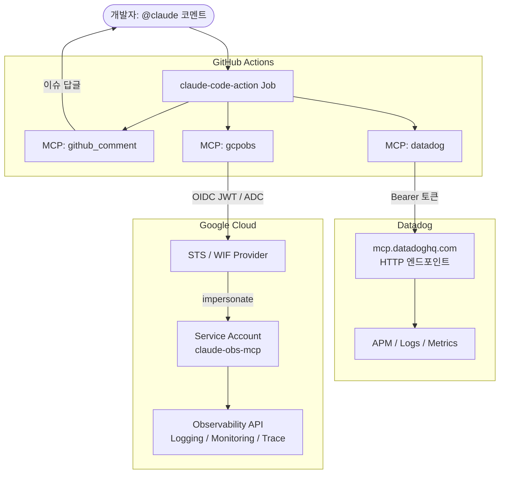
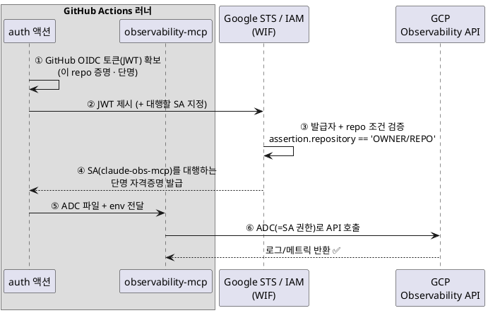

GitHub 이슈에 `@claude` 코멘트를 달면 Claude Code Action이 Actions에서 돌아간다.
이때 MCP 서버를 붙이면 봇이 외부 도구(Datadog 조회, GCP 로그 조회 등)를 직접 호출할 수 있다.  
이 글은 Github Actions에서 MCP 서버에 접속하는 방법과 인증이 다른 두 패턴(HTTP·stdio)으로 정리한다.

## 전체 구조

`@claude` 코멘트 하나가 다음 흐름을 태운다.



## MCP 서버 접속 방법

MCP(Model Context Protocol) 서버는 Claude에게 **도구(tool)** 를 제공하는 표준이다.
Claude Code Action에 붙일 때는 크게 두 형태로 나뉜다.

- **HTTP(remote) 서버**: 이미 떠 있는 원격 엔드포인트에 HTTP로 접속한다. 보통 Bearer 토큰으로 인증한다. 
- **stdio(local) 서버**: 러너 안에서 프로세스로 직접 실행하고 표준입출력으로 통신한다. 인증은 그 프로세스가 쓰는 자격증명(예: ADC)을 따른다. (예: GCP Observability)


## MCP 접속 설정 : `--mcp-config` 와 `allowedTools`

Claude Code Action에 MCP를 붙이려면 두 가지를 설정한다.

- `**--mcp-config**`: 어떤 MCP 서버를 어떤 방식으로 붙일지 정의(JSON). HTTP면 `url`+헤더, stdio면 실행 `command`를 적는다.
- `**--allowedTools**`: 붙인 서버의 도구를 Claude가 **호출하도록 허용**한다. 서버 전체를 허용하려면 `mcp__<서버명>` 형식으로 적는다.

이 둘이 맞아야 도구가 실제로 로드되고 호출된다. 아래에서 두 패턴을 각각 본다.

## 패턴 1 — HTTP MCP + Bearer (Datadog)

Datadog MCP는 HTTP 엔드포인트(`https://mcp.datadoghq.com/...`)에 **Bearer 토큰**을 실어 붙인다.
토큰은 GitHub Secret으로 넣고, `--mcp-config`에서 헤더로 주입한다.

```json
// mcp-config 안의 datadog 서버 (개념 예시)
"datadog": {
  "type": "http",
  "url": "https://mcp.datadoghq.com/v1/mcp",
  "headers": { "Authorization": "Bearer ${{ secrets.DD_MCP_TOKEN }}" }
}
```

이 방식은 **공유 비밀(shared secret)** 이다. 토큰 값 자체가 곧 권한이므로 유출되면 그대로 악용된다. 그래서 반드시 Secret으로 관리한다.

### 삽질부분

처음엔 봇이 "Datadog MCP 접속 정상"을 반환하였다. 하지만 실제로는 MCP 도구를 단 한 번도 호출하지 않았다. 


디버그 로그로 CLI 초기화 시점의 `mcp_servers` 목록을 직접 확인하니 원인이 드러났다.

```json
"mcp_servers": [ { "name": "github_comment", "status": "pending" } ]
```

`datadog` 서버가 목록에 아예 없었다. 토큰 문제가 아니라 서버가 처음부터 로드되지 않았던 것이다.  
원인은 두 가지였다.

- `allowedTools` 매처 오타: `"mcp__datadog__"` 처럼 끝에 `__`가 붙어 도구명이 비면 **어떤 실제 도구와도 매칭되지 않는다.** 서버의 모든 도구를 허용하려면 `"mcp__datadog"` 로 써야 한다.
- **핸드셰이크 로그 미노출**: `show_full_output: false` 라 연결 성공/401/403이 로그에 안 찍혀 실패를 알 수 없었다.

 "job success"는 MCP 연결 성공이 아니다.
검증은 반드시 **실제 도구 호출 결과**로 확인해야 하고, 그러려면 `--debug`(또는 `show_full_output: true`)로 핸드셰이크를 로그로 출력해야 알 수 있다.

## 패턴 2 — stdio MCP + 키리스 WIF (GCP)

GCP 쪽은 `@google-cloud/observability-mcp` 패키지를 로컬 stdio MCP로 붙였다.
이 서버는 ADC(Application Default Credentials) 로 인증한다.

여기서 핵심 선택은 서비스 계정 JSON 키를 쓰지 않는다는 것이다.
대신 Workload Identity Federation(WIF) 으로 키 없이 인증한다.
JSON 키를 Secret에 저장하는 방식은 키가 유출되면 끝이지만, WIF는 저장할 키 자체가 없다.


### 워크플로우 스텝

WIF 인증 → MCP 설치 → Claude Code 실행 순이다.
마지막 `Run Claude Code` 스텝에서 두 MCP 서버(datadog·gcpobs)를 하나의 `--mcp-config`에 등록하고, `--allowedTools`로 둘 다 허용한다.

```yaml
# 1) WIF 인증 → ADC 자격증명 파일 생성 + GOOGLE_APPLICATION_CREDENTIALS export
- uses: google-github-actions/auth@v2
  with:
    workload_identity_provider: ${{ secrets.GCP_WIF_PROVIDER }}
    service_account: ${{ secrets.GCP_SERVICE_ACCOUNT }}

# 2) MCP 바이너리 전역 설치
- run: npm install -g @google-cloud/observability-mcp

# 3) Claude Code 실행 — datadog(HTTP)·gcpobs(stdio)를 한 config에 등록
- name: Run Claude Code
  uses: anthropics/claude-code-action@v1.0.171
  env:
    # 토큰은 env로 주입 → config의 ${DD_MCP_TOKEN}로 확장. 실제 토큰이 claude_args/로그에 안 남는다.
    DD_MCP_TOKEN: ${{ secrets.DD_MCP_TOKEN }}
    # GCP Observability MCP가 조회/quota에 쓸 프로젝트 (auth 스텝의 ADC와 함께 사용)
    GOOGLE_CLOUD_PROJECT: ${{ vars.GCP_PROJECT_ID }}
    GOOGLE_CLOUD_QUOTA_PROJECT: ${{ vars.GCP_PROJECT_ID }}
  with:
    anthropic_api_key: ${{ secrets.ANTHROPIC_API_KEY }}
    github_token: ${{ secrets.GITHUB_TOKEN }}
    trigger_phrase: "@claude"
    # 진단용: CLI 전체 출력(--debug 포함)을 로그로 노출해 MCP 핸드셰이크 확인
    show_full_output: true
    claude_args: |
      --model claude-haiku-4-5-20251001
      --debug
      --mcp-config '{"mcpServers":{"datadog":{"type":"http","url":"https://mcp.datadoghq.com/v1/mcp?toolsets=core,apm,alerting,error-tracking","headers":{"Authorization":"Bearer ${DD_MCP_TOKEN}"}},"gcpobs":{"command":"observability-mcp","args":[]}}}'
      --allowedTools "mcp__datadog,mcp__gcpobs"
```

보안 포인트가 하나 있다. 토큰을 `claude_args`에 직접 쓰지 않고 `env`(`DD_MCP_TOKEN`)로 주입한 뒤 config에서 `${DD_MCP_TOKEN}`로 확장한다. 이렇게 하면 실제 토큰 값이 명령 문자열이나 로그에 남지 않는다.

기존 Datadog 흐름이 깨지지 않도록 GCP 스텝엔 `continue-on-error: true`를 걸어, 설정 전이라도 Datadog은 계속 동작하게 했다.

### 헷갈렸던 부분 — WIF 핸드셰이크 6단계

WIF가 "키 없이 어떻게 신뢰가 성립하나?"가 가장 헷갈린다.
흐름을 6단계로 끊으면 명확해진다.



풀어 쓰면 이렇다.

- **① OIDC 토큰 확보**: `auth 액션`이 "이 실행이 정말 이 repo에서 나왔다"를 증명하는 단명(short-lived) JWT를 GitHub에서 받는다.
- **② STS에 제시**: 그 JWT와 함께 "대행할 서비스 계정"을 Google STS에 제시한다.
- **③ 검증**: Google은 발급자가 `token.actions.githubusercontent.com`인지, 그리고 repo 조건(`assertion.repository == '<OWNER>/<REPO>'`)을 만족하는지 확인한다.
- **④ SA 대행 자격증명 발급**: 통과하면 서비스 계정(`claude-obs-mcp`)을 **대행(impersonate)** 하는 단명 자격증명을 돌려준다. 여기서 SA는 통신 주체가 아니라 **대행되는 신원**이다.
- **⑤ ADC 전달**: `auth 액션`이 이 자격증명을 파일(ADC)로 저장하고 `GOOGLE_APPLICATION_CREDENTIALS`를 export → 같은 러너의 `observability-mcp`가 쓸 수 있게 된다.
- **⑥ API 호출**: `observability-mcp`가 그 **ADC(=SA 권한)** 로 GCP Observability API를 호출한다.

핵심 요지는 이것이다.
어디에도 키(JSON)를 저장하지 않는다.
"GitHub이 서명한 *이 repo의* 단명 토큰" + "Google에 걸어둔 *repo 조건*", 이 두 가지만으로 신뢰가 성립한다.
그래서 키리스다.

### GCP 사전 설정 (gcloud)

 GCP·GitHub 양쪽에 사전 리소스가 있어야 한다.

```bash
# 1) Workload Identity Pool + Provider (이 repo에만 허용)
gcloud iam workload-identity-pools create github --location=global
gcloud iam workload-identity-pools providers create-oidc github \
  --location=global --workload-identity-pool=github \
  --issuer-uri="https://token.actions.githubusercontent.com" \
  --attribute-mapping="google.subject=assertion.sub,attribute.repository=assertion.repository" \
  --attribute-condition="assertion.repository=='<OWNER>/<REPO>'"

# 2) 서비스 계정 + Observability 읽기 권한 5종
gcloud iam service-accounts create claude-obs-mcp
PROJECT=<GCP_PROJECT_ID>
for role in roles/monitoring.viewer roles/logging.viewer roles/cloudtrace.user \
            roles/errorreporting.viewer roles/serviceusage.serviceUsageConsumer; do
  gcloud projects add-iam-policy-binding $PROJECT \
    --member="serviceAccount:claude-obs-mcp@$PROJECT.iam.gserviceaccount.com" --role=$role
done

# 3) GitHub OIDC 신원이 이 SA를 impersonate 하도록 바인딩
gcloud iam service-accounts add-iam-policy-binding \
  claude-obs-mcp@$PROJECT.iam.gserviceaccount.com \
  --role=roles/iam.workloadIdentityUser \
  --member="principalSet://iam.googleapis.com/projects/<PROJECT_NUMBER>/locations/global/workloadIdentityPools/github/attribute.repository/<OWNER>/<REPO>"

# 4) 필요한 API 활성화
gcloud services enable monitoring.googleapis.com logging.googleapis.com \
  cloudtrace.googleapis.com clouderrorreporting.googleapis.com --project=$PROJECT
```

## 값이 어디에 존재하는가

접속에 필요한 설정값이 GitHub과 GCP에 나뉘어 있어 헷갈리기 쉽다. 표로 정리하자.


| 위치     | 종류       | 이름                    | 값(예시)                                                                                      |
| ------ | -------- | --------------------- | ------------------------------------------------------------------------------------------ |
| GitHub | Secret   | `DD_MCP_TOKEN`        | Datadog MCP Bearer 토큰                                                                      |
| GitHub | Secret   | `GCP_WIF_PROVIDER`    | `projects/<PROJECT_NUMBER>/locations/global/workloadIdentityPools/github/providers/github` |
| GitHub | Secret   | `GCP_SERVICE_ACCOUNT` | `claude-obs-mcp@<PROJECT_ID>.iam.gserviceaccount.com`                                      |
| GitHub | Variable | `GCP_PROJECT_ID`      | 조회 대상 GCP 프로젝트 ID                                                                          |
| GCP    | 리소스      | WIF Pool/Provider     | `<OWNER>/<REPO>` 조건으로 제한                                                                   |
| GCP    | 리소스      | Service Account       | 읽기 역할 5종 바인딩                                                                               |


Variable은 Secret과 탭이 다르다(Settings → Secrets and variables → Actions → **Variables**).

## 접속이 됐는지 검증하기

MCP 접속은 "job success"가 아니라 실제 도구 호출 결과로 확인해야 한다.
샘플 앱이 없어도, 방금 만든 IAM/API 작업이**** Cloud Audit Log에 남아 검증에 쓸 수 있었다.

이슈에 `@claude gcp observability로 최근 로그 조회해줘` 코멘트를 달아 동작을 검증하자.

- **WIF 인증 성공**: auth 스텝이 자격증명 파일 생성 + `project_id` export
- `gcpobs` 등록: `mcp_servers` init에 `github_comment` / `datadog` / `gcpobs` 셋 다
- **실데이터 반환**: `list_log_names` → `list_log_entries`가 실제 **AuditLog**를 반환


## 정리

- Claude Code Action에서 MCP 접속은 `**--mcp-config`(서버 정의) + `--allowedTools`(호출 허용)** 로 배선한다.
- **HTTP MCP**는 원격 엔드포인트에 **Bearer 토큰**으로, **stdio MCP**는 러너에서 **프로세스로 실행**하고 그 자격증명(ADC 등)으로 접속한다.
- GCP는 JSON 키 대신 **키리스 WIF** — GitHub OIDC 토큰 + Google에 건 repo 조건만으로 신뢰가 성립한다.
- 접속 검증은 `--debug`로 `mcp_servers` 초기화와 **실제 도구 호출 결과**를 확인한다.

